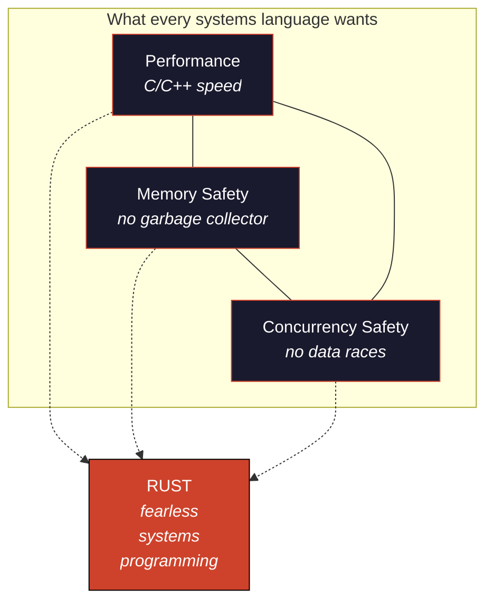

# Ferro e Espírito

### A Philosophical and Practical Journey Through the Rust Language

> *"A complex system that works is invariably found to have evolved from a simple system that worked."*
> — John Gall, *Systemantics* (1975)
>
> *"Rust is technology from the past come to save the future from itself."*
> — Graydon Hoare, creator of Rust

> **[Leia em Português →](README.pt-BR.md)**

> **Note:** the book is written in Brazilian Portuguese. This README provides an overview in English; the chapter content itself is in pt-BR.

---

## What is this?

An **open-source book** — 28,000+ lines, 62 chapters across 22 parts — that walks through the Rust programming language as both a craft and a philosophy. Every chapter compares Rust against **TypeScript**, **Go**, and **C**, because learning Rust is in large part learning what other languages *don't* do for you, and what Rust does for all of them.

Inspired in form and spirit by [The Whole and the Part](https://github.com/Felipeness/the-whole-and-the-part).

---

## The Impossible Triangle

For decades the industry assumed you had to pick two of three: performance and control (C/C++) at the cost of safety, or safety (Java/Go/TS) at the cost of control. Rust broke the dichotomy by moving verification to the **compiler** — not to the runtime, not to the programmer.

This book is about how Rust does that, why it changes the rules, and what you have to unlearn to write idiomatic Rust.

---

## Who is this for?

- You **come from TypeScript** and are tired of `undefined is not a function` in production.
- You **come from Go** and want richer expressive power in the type system.
- You **come from C** and want to keep the control while losing the segfaults.
- You have **never written systems code** and want to understand what lives below the runtime.

---

## Table of Contents

The book is organized in **four arcs** across 22 parts. Browse the full chapter listing in [`book/SUMMARY.md`](book/SUMMARY.md).

<table>
<tr>
<td valign="top" width="50%">

### Arc I — Foundations & Mind
Parts I–IV · Chapters 1–13

The philosophical groundwork. Why Rust exists, the impossible triangle, the mental model of ownership, primitive types, expressions over statements, and the heart of Rust: borrow checking and lifetimes.

- [Why Rust Exists](book/part-01-genesis/ch01-por-que-rust-existe.md)
- [The Impossible Triangle](book/part-01-genesis/ch02-trindade-impossivel.md)
- [The Mental Model: Ownership as Philosophy](book/part-01-genesis/ch03-modelo-mental-ownership.md)
- [Ownership: The Three Rules](book/part-04-ownership/ch10-ownership-regras.md)
- [Borrowing: Verified Loans](book/part-04-ownership/ch11-borrowing.md)
- [Lifetimes: Why and How](book/part-04-ownership/ch12-lifetimes.md)
- [...and 7 more chapters](book/SUMMARY.md)

---

### Arc II — Types, Modules & Errors
Parts V–IX · Chapters 14–27

From structs and enums to the death of `null`. Cargo, generics, traits, trait objects, advanced lifetimes, and the everyday derives that make Rust ergonomic.

- [Structs — Modeling the Domain](book/part-05-composite-types/ch14-structs.md)
- [Enums and Pattern Matching](book/part-05-composite-types/ch15-enums-e-matching.md)
- [Option and Result — The Death of Null](book/part-05-composite-types/ch16-option-e-result.md)
- [Cargo — The Conductor](book/part-06-modules-and-crates/ch19-cargo.md)
- [Generics, Traits & Trait Objects](book/part-08-generics-and-traits/)
- [Advanced Lifetimes & PhantomData](book/part-09-lifetimes-deep/)
- [...and 8 more chapters](book/SUMMARY.md)

</td>
<td valign="top" width="50%">

### Arc III — Concurrency, Async, Unsafe
Parts X–XV · Chapters 28–43

Smart pointers, threads with `Send`/`Sync`, channels, mutexes and atomics, futures and Tokio, async patterns, `unsafe`, FFI, pinning, declarative and procedural macros, and the idiomatic patterns that distinguish Rust code in the wild.

- [Box, Rc, Arc — Shared Ownership](book/part-10-smart-pointers/ch28-box-rc-arc.md)
- [Threads and the Send/Sync Model](book/part-11-concurrency/ch30-threads-send-sync.md)
- [Futures and the Async Model](book/part-12-async/ch33-futures.md)
- [Tokio — The De Facto Runtime](book/part-12-async/ch34-tokio.md)
- [Unsafe Rust](book/part-13-unsafe-and-ffi/ch36-unsafe.md)
- [Type-State Pattern](book/part-15-patterns-and-idioms/ch42-type-state.md)
- [...and 10 more chapters](book/SUMMARY.md)

---

### Arc IV — Production & Frontiers
Parts XVI–XXII · Chapters 44–62

The ecosystem (`serde`, testing, workspaces), performance (zero-cost, profiling, SIMD), real applications (CLI, axum, WASM), deep comparisons (Rust vs TS/Go/C), embedded and kernel, compiler internals, the culture and the future.

- [serde — Serialization as Art](book/part-16-ecosystem/ch44-serde.md)
- [Zero-Cost Abstractions](book/part-17-performance/ch47-zero-cost.md)
- [Building a Real CLI](book/part-18-applications/ch50-cli.md)
- [Web Service with Axum](book/part-18-applications/ch51-axum.md)
- [Rust vs TypeScript / Go / C](book/part-19-comparisons/)
- [Rust in the Kernel — Linux & Windows](book/part-20-frontiers/ch58-rust-no-kernel.md)
- [...and 13 more chapters](book/SUMMARY.md)

</td>
</tr>
</table>

[Epilogue: The Compiler as Master](book/epilogue.md) · [References](book/references.md) · [Glossary, Decision Trees, Cheat Sheet](book/part-22-glossary/)

---

## Start Here

New to Rust or wanting an overview? Read the **[introductory article](article/en.md)** — a 10-minute summary of why Rust matters before diving into 60+ chapters.

---

## Read the Full Book

- **[Single file](full-book.md)** — all 62 chapters in one document (1.1 MB)
- **[Browse by chapter](book/SUMMARY.md)** — navigate part by part
- **Browse by topic** — see the four arcs above

---

## Why this book exists

Most Rust material treats the language as if it dropped from the sky with arbitrary rules to memorize. But **Rust is not arbitrary**. Every rule, every compiler error, every syntactic choice carries the weight of decades of real bugs in C, Java, Python, and JavaScript. Rust is not a new language — it is the bitter distillation of everything we learned the hard way.

When the borrow checker rejects your code, it is not being pedantic. It is saying: *"this exact class of bug brought down a data center at AWS in 2017. This exact pattern leaked the data of 200 million people at Equifax. This exact indirection is what Stagefright exploited on Android."* The compiler is the living record of every segfault that cost humanity dearly.

This book makes that motivation explicit. Every chapter explains the *why* before the *how*, and every chapter compares Rust against the languages you already know.

---

## License

This work is licensed under [Creative Commons Attribution-ShareAlike 4.0 International (CC BY-SA 4.0)](https://creativecommons.org/licenses/by-sa/4.0/).

You are free to share and adapt this material, as long as you give credit and distribute contributions under the same license.

---

## About the Author

**Felipe Coelho** — Senior Software Engineer & Engineering Manager. Author of [The Whole and the Part](https://github.com/Felipeness/the-whole-and-the-part).

[GitHub: @Felipeness](https://github.com/Felipeness)

---

> *"The compiler is iron. The intuition you have built is spirit. Together, they build what works."*
