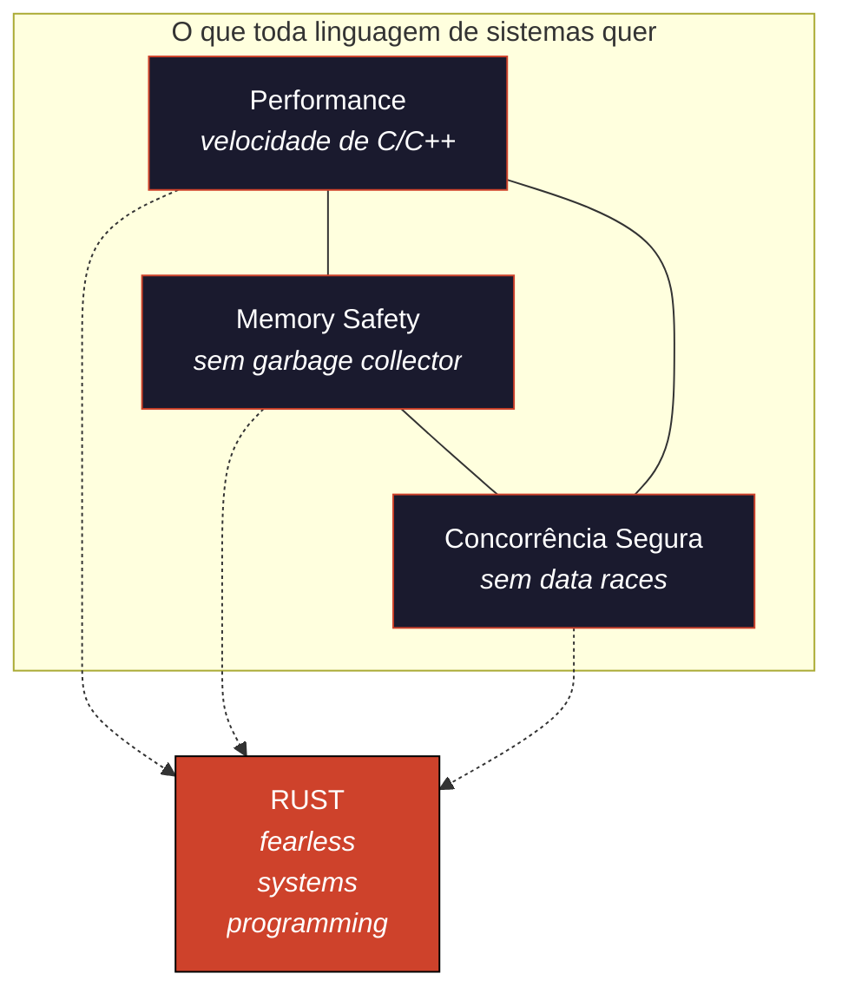

# Ferro e Espírito

### Uma Jornada Filosófica e Prática Pela Linguagem Rust

> *"A complex system that works is invariably found to have evolved from a simple system that worked."*
> — John Gall, *Systemantics* (1975)
>
> *"Rust is technology from the past come to save the future from itself."*
> — Graydon Hoare, criador do Rust

> **[Read in English →](README.md)**

---

## O que é isto?

Um **livro aberto** — 28.000+ linhas, 62 capítulos em 22 partes — sobre Rust como ofício e filosofia. Cada capítulo carrega comparações concretas com **TypeScript**, **Go** e **C** — porque aprender Rust é, em grande parte, aprender o que outras linguagens *não* fazem por você, e o que Rust faz por todas elas.

Inspirado em forma e espírito por [The Whole and the Part](https://github.com/Felipeness/the-whole-and-the-part).

---

## O Triângulo Impossível

Por décadas a indústria assumiu que era preciso escolher dois entre três: ou você tem performance e controle (C/C++) e abre mão de segurança, ou você tem segurança (Java/Go/TS) e abre mão de controle. Rust quebrou essa dicotomia ao mover a verificação para o **compilador** — não para o runtime, não para o programador.

Este livro é sobre como Rust faz isso, por que isso muda tudo, e o que você precisa desaprender para escrever Rust idiomático.

---

## Para quem é este livro?

- Você **vem de TypeScript** e cansou de `undefined is not a function` em produção.
- Você **vem de Go** e quer mais expressividade no sistema de tipos.
- Você **vem de C** e quer manter o controle, mas perder os segfaults.
- Você **nunca programou em sistemas** e quer entender o que existe abaixo do runtime.

---

## Sumário

O livro está organizado em **quatro arcos** ao longo de 22 partes. Veja o índice completo em [`book/SUMMARY.md`](book/SUMMARY.md).

<table>
<tr>
<td valign="top" width="50%">

### Arco I — Fundamentos e Mente
Partes I–IV · Capítulos 1–13

A base filosófica. Por que Rust existe, o triângulo impossível, o modelo mental de ownership, tipos primitivos, expressões sobre statements, e o coração de Rust: borrow checking e lifetimes.

- [Por Que Rust Existe](book/part-01-genesis/ch01-por-que-rust-existe.md)
- [A Trindade Impossível](book/part-01-genesis/ch02-trindade-impossivel.md)
- [O Modelo Mental — Ownership Como Filosofia](book/part-01-genesis/ch03-modelo-mental-ownership.md)
- [Variáveis, Mutabilidade e Shadowing](book/part-02-foundations/ch04-variaveis-mutabilidade.md)
- [Tipos Primitivos](book/part-02-foundations/ch05-tipos-primitivos.md)
- [Funções e Controle de Fluxo](book/part-02-foundations/ch06-funcoes-e-fluxo.md)
- [Strings — O Pesadelo Necessário](book/part-02-foundations/ch07-strings.md)
- [Inferência, Coerção e Conversão](book/part-03-types-and-syntax/ch08-inferencia-e-conversao.md)
- [Slices](book/part-03-types-and-syntax/ch09-slices.md)
- [Ownership: As Três Regras](book/part-04-ownership/ch10-ownership-regras.md)
- [Borrowing — Empréstimos Verificados](book/part-04-ownership/ch11-borrowing.md)
- [Lifetimes — Por Que e Como](book/part-04-ownership/ch12-lifetimes.md)
- [Move Semantics — A Morte do Alias](book/part-04-ownership/ch13-move-semantics.md)

---

### Arco II — Tipos, Módulos e Erros
Partes V–IX · Capítulos 14–27

De structs e enums à morte do `null`. Cargo, generics, traits, trait objects, lifetimes avançados e os derives cotidianos que tornam Rust ergonômico.

- [Structs — Modelando o Domínio](book/part-05-composite-types/ch14-structs.md)
- [Enums e Pattern Matching — A Álgebra dos Tipos](book/part-05-composite-types/ch15-enums-e-matching.md)
- [Option e Result — A Morte do Null](book/part-05-composite-types/ch16-option-e-result.md)
- [Crates, Módulos e Paths](book/part-06-modules-and-crates/ch17-crates-modulos-paths.md)
- [Visibilidade e Organização](book/part-06-modules-and-crates/ch18-visibilidade.md)
- [Cargo — O Maestro](book/part-06-modules-and-crates/ch19-cargo.md)
- [Coleções Padrão — Vec, HashMap, BTreeMap](book/part-07-collections-and-errors/ch20-colecoes.md)
- [Tratamento de Erros Idiomático](book/part-07-collections-and-errors/ch21-tratamento-erros.md)
- [Generics — Polimorfismo Paramétrico](book/part-08-generics-and-traits/ch22-generics.md)
- [Traits — Contratos Compostáveis](book/part-08-generics-and-traits/ch23-traits.md)
- [Trait Objects e Despacho Dinâmico](book/part-08-generics-and-traits/ch24-trait-objects.md)
- [Traits Cotidianos — Display, Debug, Clone, Copy, Drop](book/part-08-generics-and-traits/ch25-traits-cotidianos.md)
- [Lifetimes Avançados — Variance, HRTB, 'static](book/part-09-lifetimes-deep/ch26-lifetimes-avancados.md)
- [PhantomData e Type-Level Programming](book/part-09-lifetimes-deep/ch27-phantomdata.md)

</td>
<td valign="top" width="50%">

### Arco III — Concorrência, Async, Unsafe
Partes X–XV · Capítulos 28–43

Smart pointers, threads com `Send`/`Sync`, channels, mutexes e atômicos, futures e Tokio, padrões async, `unsafe`, FFI, pinning, macros declarativas e procedurais, e os padrões idiomáticos que distinguem Rust em produção.

- [Box, Rc, Arc — Posse Compartilhada](book/part-10-smart-pointers/ch28-box-rc-arc.md)
- [Cell, RefCell, OnceCell — Mutabilidade Interior](book/part-10-smart-pointers/ch29-mutabilidade-interior.md)
- [Threads e o Modelo Send/Sync](book/part-11-concurrency/ch30-threads-send-sync.md)
- [Channels — A Influência de Go](book/part-11-concurrency/ch31-channels.md)
- [Mutex, RwLock e Atômicos](book/part-11-concurrency/ch32-mutex-atomics.md)
- [Futures e o Modelo Async](book/part-12-async/ch33-futures.md)
- [Tokio — O Runtime de Fato](book/part-12-async/ch34-tokio.md)
- [Padrões Async](book/part-12-async/ch35-padroes-async.md)
- [Unsafe Rust](book/part-13-unsafe-and-ffi/ch36-unsafe.md)
- [FFI — Falando Com C](book/part-13-unsafe-and-ffi/ch37-ffi.md)
- [Pinning — A Memória Que Não Move](book/part-13-unsafe-and-ffi/ch38-pinning.md)
- [Macros Declarativas](book/part-14-macros/ch39-macros-declarativas.md)
- [Macros Procedurais](book/part-14-macros/ch40-macros-procedurais.md)
- [Newtype, Builder, RAII](book/part-15-patterns-and-idioms/ch41-newtype-builder-raii.md)
- [Type-State Pattern](book/part-15-patterns-and-idioms/ch42-type-state.md)
- [Error Handling Avançado](book/part-15-patterns-and-idioms/ch43-error-handling-avancado.md)

---

### Arco IV — Produção e Fronteiras
Partes XVI–XXII · Capítulos 44–62

O ecossistema (`serde`, testing, workspaces), performance (zero-cost, profiling, SIMD), aplicações reais (CLI, axum, WASM), comparações profundas (Rust vs TS/Go/C), embedded e kernel, internals do compilador, cultura e o futuro.

- [serde — Serialização Como Arte](book/part-16-ecosystem/ch44-serde.md)
- [Testing — cargo test, criterion, proptest](book/part-16-ecosystem/ch45-testing.md)
- [Workspaces, Features e Conditional Compilation](book/part-16-ecosystem/ch46-workspaces-features.md)
- [Zero-Cost Abstractions](book/part-17-performance/ch47-zero-cost.md)
- [Profiling e Benchmarking](book/part-17-performance/ch48-profiling.md)
- [SIMD, Inlining e Otimizações](book/part-17-performance/ch49-simd-otimizacoes.md)
- [Construindo uma CLI Real](book/part-18-applications/ch50-cli.md)
- [Web Service com Axum](book/part-18-applications/ch51-axum.md)
- [WASM — Rust no Navegador e Edge](book/part-18-applications/ch52-wasm.md)
- [Rust vs TypeScript](book/part-19-comparisons/ch53-rust-vs-typescript.md)
- [Rust vs Go](book/part-19-comparisons/ch54-rust-vs-go.md)
- [Rust vs C](book/part-19-comparisons/ch55-rust-vs-c.md)
- [Quando *Não* Escolher Rust](book/part-19-comparisons/ch56-quando-nao-rust.md)
- [Embedded Rust e `no_std`](book/part-20-frontiers/ch57-embedded-no-std.md)
- [Rust no Kernel — Linux e Windows](book/part-20-frontiers/ch58-rust-no-kernel.md)
- [O Compilador por Dentro](book/part-20-frontiers/ch59-compilador-internals.md)
- [A Cultura Rust](book/part-21-philosophy/ch60-cultura-rust.md)
- [Anti-Patterns em Rust](book/part-21-philosophy/ch61-anti-patterns.md)
- [O Futuro — Rust 2024 e Além](book/part-21-philosophy/ch62-futuro-rust.md)

**Extras:** [Glossário](book/part-22-glossary/glossario.md) · [Árvores de Decisão](book/part-22-glossary/arvores-decisao.md) · [Cheat Sheet](book/part-22-glossary/cheat-sheet.md)

</td>
</tr>
</table>

[Epílogo: O Compilador Como Mestre](book/epilogue.md) · [Referências](book/references.md)

---

## Comece Aqui

Não precisa ler tudo de uma vez. O melhor ponto de entrada é o artigo que condensa a essência do livro em 15 minutos.

**[Leia o artigo introdutório →](article/pt.md)**

---

## Leia o Livro Completo

- **[Arquivo único](full-book.md)** — todos os 62 capítulos em um documento (1.1 MB)
- **[Por capítulo](book/SUMMARY.md)** — navegue parte por parte
- **Por tópico** — veja os quatro arcos acima

---

## Por que este livro existe

A maior parte do material sobre Rust trata a linguagem como se tivesse caído pronta do céu, com regras arbitrárias para decorar. Mas **Rust não é arbitrário**. Cada regra, cada erro do compilador, cada construção da sintaxe carrega o peso de **décadas de bugs reais em C, em Java, em Python, em JavaScript**. Rust não é uma linguagem nova — é a destilação amarga de tudo que aprendemos do jeito difícil.

Quando o borrow checker recusa seu código, ele não está implicando. Ele está dizendo: *"essa exata classe de bug travou um data center na AWS em 2017. Esse padrão exato vazou os dados de 200 milhões de pessoas no Equifax. Essa indireção exata é o que o Stagefright explorou no Android."* O compilador é o registro vivo de todo segfault que custou caro à humanidade.

Este livro torna essa motivação explícita. Cada capítulo explica o *porquê* antes do *como*, e cada capítulo compara Rust com as linguagens que você já conhece.

---

## Licença

Este trabalho está licenciado sob [Creative Commons Attribution-ShareAlike 4.0 International (CC BY-SA 4.0)](https://creativecommons.org/licenses/by-sa/4.0/).

Você é livre para compartilhar e adaptar este material, desde que dê crédito apropriado e distribua suas contribuições sob a mesma licença.

---

## Sobre o Autor

**Felipe Coelho** — Engenheiro de Software Sênior & Engineering Manager. Autor de [The Whole and the Part](https://github.com/Felipeness/the-whole-and-the-part).

[GitHub: @Felipeness](https://github.com/Felipeness)

---

> *"O compilador é o ferro. A intuição que você desenvolveu é o espírito. Juntos, vocês dois constroem o que dá certo."*
