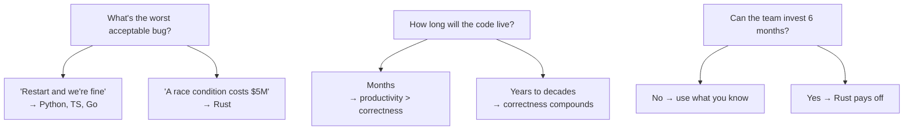

# Ferro e Espírito — The Essence in 10 Minutes

> *"A complex system that works is invariably found to have evolved from a simple system that worked."*
> — John Gall, *Systemantics* (1975)

> **Note:** the full book is in Brazilian Portuguese. This article is the English overview.

If you only have 10 minutes, read this. If you decide it's worth more, [start with Chapter 1](../book/part-01-genesis/ch01-por-que-rust-existe.md) (Portuguese).

---

## The Thesis

Every programming language answers one question: *who owns this memory, and when can it be freed?*

- **C** says: you. Good luck.
- **Java, Go, JavaScript, Python** say: the runtime. Pay for the garbage collector.
- **Rust** says: the compiler proves it at compile time. No runtime, no bug.

This difference, which sounds technical, is philosophical. It defines what kind of software you can write, at what scale, with what confidence.

---

## The Impossible Triangle

Every systems language tries to deliver three needs:

1. **Performance** — close to hardware speed.
2. **Memory safety** — no use-after-free, no buffer overflow.
3. **Concurrency safety** — no data races.

For decades, picking two cost you the third:

| Language | Performance | Memory safety | Concurrency safety |
|---|:---:|:---:|:---:|
| C / C++ | yes | no | no |
| Java / C# | partial (GC pause) | yes | partial |
| Go | partial (GC) | yes | no (runtime data races) |
| Python / Ruby | no | yes | partial (GIL) |
| **Rust** | **yes** | **yes** | **yes** |

Rust is the first mainstream language that delivers all three by default. Not by magic — by design. Verification was moved into the **compiler**.

---

## The Core Idea: Ownership

In Rust, **every value has exactly one owner**. When the owner goes out of scope, the value is freed. There is no manual `free`. There is no garbage collector.

```rust
fn main() {
    let s = String::from("hello");  // s is the owner
    consume(s);                     // ownership transferred
    // println!("{}", s);           // compile error — s is no longer owner
}

fn consume(t: String) {
    println!("{}", t);
} // t goes out of scope — String is freed here
```

When you need to use a value without owning it, you **borrow** it:

```rust
fn main() {
    let s = String::from("hello");
    inspect(&s);       // borrow — does not transfer ownership
    println!("{}", s); // still owner, still valid
}

fn inspect(t: &String) {
    println!("{}", t);
}
```

This is the mother rule: **aliasing XOR mutability**. You can have many immutable references OR one mutable reference, never both at once. This single restriction eliminates entire classes of bugs — iterator invalidation, data races, use-after-free — at compile time.

---

## What This Eliminates

| Bug | In C/C++ | In Java/Go/JS | In Rust |
|---|---|---|---|
| Use-after-free | runtime crash or exploit | impossible (GC) | compile error |
| Double-free | runtime crash | impossible | compile error |
| Null dereference | crash | crash (NPE) | impossible (Option) |
| Buffer overflow | exploit | impossible (bounds check) | impossible (bounds check) |
| Data race | undefined behavior | possible | compile error |
| Memory leak | possible | possible (cycles) | possible but rare |
| Iterator invalidation | undefined behavior | exception | compile error |

The bugs that cost billions — Heartbleed, Stagefright, Equifax, every privilege escalation in kernels — almost all belong to the C/C++ column. Rust turns them into compiler messages.

---

## The Death of Null

Tony Hoare called null his "billion-dollar mistake". In Rust, null does not exist. In its place:

```rust
fn find_user(id: u64) -> Option<User> {
    // ...
}

match find_user(42) {
    Some(user) => println!("{}", user.name),
    None => println!("not found"),
}
```

The type forces you to handle absence. There is no way to forget. There is no `NullPointerException`.

---

## Errors as Values

In Rust, errors are not exceptions — they are values in the return type:

```rust
fn read_file(path: &str) -> Result<String, std::io::Error> {
    std::fs::read_to_string(path)
}

fn main() -> Result<(), Box<dyn std::error::Error>> {
    let contents = read_file("config.toml")?;  // ? propagates the error
    println!("{}", contents);
    Ok(())
}
```

The `?` operator is one of the language's most elegant constructs. It replaces stories of try-catch with a single punctuation mark.

---

## Fearless Concurrency

Threads in Rust are safe by construction:

```rust
use std::thread;

fn main() {
    let mut v = vec![1, 2, 3];
    let h = thread::spawn(move || {
        v.push(4);
    });
    // v.push(5);  // error — v was moved into the thread
    h.join().unwrap();
}
```

The compiler tracks who can access what. Types that can cross threads implement `Send`. Types that can be shared between threads implement `Sync`. Violate this, and it does not compile.

This is Rust's great achievement: data races, which cause half the bugs in concurrent systems, are **impossible** in safe code.

---

## Quick Comparison with TypeScript

```typescript
// TypeScript
interface User {
  id: number;
  name: string;
  email?: string;  // can be undefined
}

async function find(id: number): Promise<User> {
  const r = await fetch(`/api/users/${id}`);
  return r.json();  // type is an assertion, not a check
}
```

```rust
// Rust
#[derive(serde::Deserialize)]
struct User {
    id: u64,
    name: String,
    email: Option<String>,  // explicit absence
}

async fn find(id: u64) -> Result<User, reqwest::Error> {
    reqwest::get(format!("/api/users/{}", id))
        .await?
        .json::<User>()  // real validation
        .await
}
```

Differences you feel in production:
- TS `Promise<User>` can reject with anything. Rust `Result` carries the error type.
- TS `r.json()` is `any` in practice. Rust `.json::<User>()` validates the shape.
- TS can forget to handle `email`. Rust forces it through `Option`.

---

## Quick Comparison with Go

```go
// Go
func sum(nums []int) int {
    total := 0
    for _, n := range nums {
        total += n
    }
    return total
}
```

```rust
// Rust
fn sum(nums: &[i32]) -> i32 {
    nums.iter().sum()
}
```

Same performance, similar readability, but:
- Rust does not allow passing `nil`. Go does and gives nil pointer panics.
- Rust has no GC. Go does (and its tail latency shows).
- Rust monomorphizes generics (zero-cost). Go uses GC and escape analysis.

---

## The Real Cost

Every language has a cost. Rust has three:

1. **Learning curve**: 3-6 months to be productive. The borrow checker is strange until it clicks.
2. **Compile time**: clean builds can take minutes. `cargo check` helps the iterative loop.
3. **Verbosity in some cases**: explicit error handling, occasional lifetime annotations.

These costs are justified when software lives for a long time, processes a lot of data, or guards sensitive data. For a throwaway script, Python is better. For a prototype, TypeScript. For an internal chatbot serving 200 users, Go.

For the Linux kernel, Cloudflare's edge, Discord's backbone — Rust has won.

---

## Who Already Adopted

- **Linux 6.1+** accepts Rust drivers (Apple GPU, NVIDIA Open).
- **Windows** is rewriting parts of the kernel.
- **Android** reported 21% of new native code in Rust and *zero* memory CVEs in that subset.
- **Cloudflare Pingora** replaced NGINX in part of the infrastructure.
- **Discord Read States** replaced Go and cut tail latency by 90%.
- **AWS Firecracker** (which runs Lambda) is Rust.
- **Mozilla, Microsoft, Google, AWS, Cloudflare, Meta, Apple** sponsor development or the Rust Foundation.

Rust is no longer a bet. It is infrastructure.

---

## When to Choose Rust



Rust is not universally "better". It is the right choice when:
- Code lifetime is long.
- Bugs are expensive.
- Performance and/or determinism matter.
- You are willing to invest in the curve.

For everything else, use what serves. But know the option exists.

---

## Next Steps

1. **Read the full book**: starting with [Chapter 1: Why Rust Exists](../book/part-01-genesis/ch01-por-que-rust-existe.md) (Portuguese).
2. **Install Rust**: `curl --proto '=https' --tlsv1.2 -sSf https://sh.rustup.rs | sh`
3. **Take the official tour**: [doc.rust-lang.org/book](https://doc.rust-lang.org/book/) — free, official, complementary to this book.
4. **Build something real**: the worst way to learn Rust is to only read. Write a CLI, a web service, a parser. The borrow checker is a teacher — it only works if you do the exercises.

---

> *"The compiler is iron. The intuition you have built is spirit. Together, they build what works."*

[← Back to README](../README.md) · [Versão em Português](pt.md) · [Book Table of Contents](../book/SUMMARY.md)
