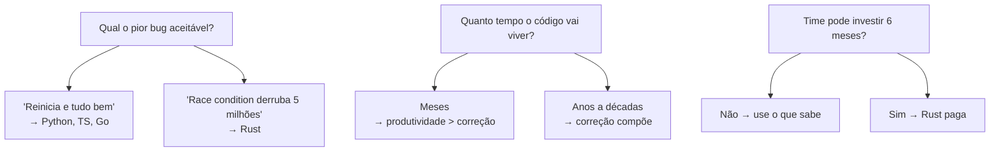

# Ferro e Espírito — A Essência em 15 Minutos

> *"A complex system that works is invariably found to have evolved from a simple system that worked."*
> — John Gall, *Systemantics* (1975)

Este artigo é a essência do livro. Se você só tem 15 minutos, leia isto. Se decidir que vale a pena, [comece pelo Capítulo 1](../book/part-01-genesis/ch01-por-que-rust-existe.md).

---

## A Tese

Toda linguagem de programação resolve uma pergunta: *quem é dono desta memória, e quando ela pode ser liberada?*

- **C** diz: você. Boa sorte.
- **Java, Go, JavaScript, Python** dizem: o runtime. Pague o garbage collector.
- **Rust** diz: o compilador prova em tempo de compilação. Sem runtime, sem bug.

Esta diferença, que parece técnica, é filosófica. Define que tipo de software você consegue escrever, em que escala, com que confiança.

---

## O Triângulo Impossível

Toda linguagem de sistemas tenta atender três necessidades:

1. **Performance** — velocidade próxima ao hardware.
2. **Memory safety** — sem use-after-free, sem buffer overflow.
3. **Concurrency safety** — sem data races.

Por décadas, escolher dois custava o terceiro:

| Linguagem | Performance | Memory safety | Concurrency safety |
|---|:---:|:---:|:---:|
| C / C++ | sim | não | não |
| Java / C# | parcial (GC pause) | sim | parcial |
| Go | parcial (GC) | sim | não (data races em runtime) |
| Python / Ruby | não | sim | parcial (GIL) |
| **Rust** | **sim** | **sim** | **sim** |

Rust é a primeira linguagem mainstream que oferece os três como default. Não por mágica — por desenho. A verificação foi movida para o **compilador**.

---

## A Ideia Central: Ownership

Em Rust, **cada valor tem exatamente um dono**. Quando o dono sai de escopo, o valor é liberado. Não há `free` manual. Não há garbage collector.

```rust
fn main() {
    let s = String::from("olá");  // s é dono
    consumir(s);                  // ownership transferido
    // println!("{}", s);         // erro de compilação — s já não é dono
}

fn consumir(t: String) {
    println!("{}", t);
} // t sai de escopo — String é liberada aqui
```

Quando você precisa usar um valor sem possuí-lo, você o **toma emprestado**:

```rust
fn main() {
    let s = String::from("olá");
    inspecionar(&s);   // empresta — não transfere posse
    println!("{}", s); // ainda é dono, ainda válido
}

fn inspecionar(t: &String) {
    println!("{}", t);
}
```

Esta é a regra-mãe: **aliasing XOR mutability**. Você pode ter muitas referências imutáveis OU uma referência mutável, nunca os dois ao mesmo tempo. Esta restrição elimina classes inteiras de bugs — iterator invalidation, data races, use-after-free — em compile time.

---

## O Que Isso Elimina

| Bug | Em C/C++ | Em Java/Go/JS | Em Rust |
|---|---|---|---|
| Use-after-free | runtime crash ou exploit | impossível (GC) | erro de compilação |
| Double-free | runtime crash | impossível | erro de compilação |
| Null dereference | crash | crash (NPE) | impossível (Option) |
| Buffer overflow | exploit | impossível (bound check) | impossível (bound check) |
| Data race | undefined behavior | possível | erro de compilação |
| Memory leak | possível | possível (cycle) | possível mas raro |
| Iterator invalidation | undefined behavior | exception | erro de compilação |

Os bugs que custaram bilhões — Heartbleed, Stagefright, Equifax, todas as escalações de privilégio em kernels — quase todos pertencem à coluna de C/C++. Rust os transforma em mensagens do compilador.

---

## A Morte do Null

Tony Hoare chamou null de "minha invenção bilionária em prejuízo". Em Rust, null não existe. No lugar:

```rust
fn buscar_usuario(id: u64) -> Option<Usuario> {
    // ...
}

match buscar_usuario(42) {
    Some(usuario) => println!("{}", usuario.nome),
    None => println!("não encontrado"),
}
```

O tipo te força a tratar a ausência. Não há como esquecer. Não há `NullPointerException`.

---

## Erros Como Valores

Em Rust, erros não são exceções — são valores no tipo de retorno:

```rust
fn ler_arquivo(caminho: &str) -> Result<String, std::io::Error> {
    std::fs::read_to_string(caminho)
}

fn main() -> Result<(), Box<dyn std::error::Error>> {
    let conteudo = ler_arquivo("config.toml")?;  // ? propaga o erro
    println!("{}", conteudo);
    Ok(())
}
```

O `?` é uma das construções mais elegantes da linguagem. Substitui andares de try-catch por uma pontuação.

---

## Concorrência Sem Medo

Threads em Rust são seguras por construção:

```rust
use std::thread;

fn main() {
    let mut v = vec![1, 2, 3];
    let h = thread::spawn(move || {
        v.push(4);
    });
    // v.push(5);  // erro — v já foi movido para a thread
    h.join().unwrap();
}
```

O compilador rastreia quem pode acessar o quê. Tipos que podem cruzar threads implementam `Send`. Tipos que podem ser compartilhados entre threads implementam `Sync`. Se você violar, não compila.

Este é o grande feito de Rust: data races, que são causa de metade dos bugs em sistemas concorrentes, são **impossíveis** em código safe.

---

## Comparação Rápida com TypeScript

```typescript
// TypeScript
interface Usuario {
  id: number;
  nome: string;
  email?: string;  // pode ser undefined
}

async function buscar(id: number): Promise<Usuario> {
  const r = await fetch(`/api/usuarios/${id}`);
  return r.json();  // tipo é assertion, não verificação
}
```

```rust
// Rust
#[derive(serde::Deserialize)]
struct Usuario {
    id: u64,
    nome: String,
    email: Option<String>,  // ausência explícita
}

async fn buscar(id: u64) -> Result<Usuario, reqwest::Error> {
    reqwest::get(format!("/api/usuarios/{}", id))
        .await?
        .json::<Usuario>()  // verificação real
        .await
}
```

Diferenças que você sente em produção:
- TS `Promise<Usuario>` pode rejeitar com qualquer coisa. Rust `Result` carrega o tipo do erro.
- TS `r.json()` é `any` na prática. Rust `.json::<Usuario>()` valida o shape.
- TS pode esquecer de tratar `email`. Rust força via `Option`.

---

## Comparação Rápida com Go

```go
// Go
func somar(nums []int) int {
    total := 0
    for _, n := range nums {
        total += n
    }
    return total
}
```

```rust
// Rust
fn somar(nums: &[i32]) -> i32 {
    nums.iter().sum()
}
```

Mesma performance, mesma legibilidade, mas:
- Rust não permite passar `nil`. Go permite e dá nil pointer panic.
- Rust não tem GC. Go tem (e seu tail latency mostra).
- Rust monomorphiza generics (zero-cost). Go usa GC e tem escape analysis.

---

## O Custo Real

Toda linguagem tem custo. Rust tem três:

1. **Curva de aprendizado**: 3-6 meses até ser produtivo. O borrow checker é estranho até clicar.
2. **Tempo de compilação**: builds completos podem levar minutos. `cargo check` ajuda no fluxo iterativo.
3. **Verbosidade em alguns casos**: handling de erro explícito, lifetimes anotados às vezes.

Esses custos se justificam quando o software vai viver muito tempo, processar muitos dados, ou guardar dados sensíveis. Para um script throwaway, Python é melhor. Para um protótipo, TypeScript. Para um chatbot interno de 200 usuários, Go.

Para o kernel do Linux, o motor da Cloudflare, o backbone do Discord — Rust ganhou.

---

## Quem Já Adotou

- **Linux 6.1+** aceita drivers em Rust (Apple GPU, NVIDIA Open).
- **Windows** está reescrevendo partes do kernel.
- **Android** reportou 21% de novo código nativo em Rust e *zero* CVEs de memória nesse subset.
- **Cloudflare Pingora** substituiu NGINX em parte da infra.
- **Discord Read States** substituiu Go e cortou latência tail em 90%.
- **AWS Firecracker** (que roda Lambda) é Rust.
- **Mozilla, Microsoft, Google, AWS, Cloudflare, Meta, Apple** patrocinam o desenvolvimento ou a Rust Foundation.

Rust deixou de ser aposta. É infraestrutura.

---

## Quando Escolher Rust



Rust não é universalmente "melhor". É a escolha certa quando:
- A vida útil do código é longa.
- Bugs custam caro.
- Performance e/ou determinismo importam.
- Você está disposto a investir na curva.

Para tudo o mais, use o que serve. Mas saiba que existe a opção.

---

## Próximos Passos

1. **Leia o livro completo**: começando por [Capítulo 1: Por Que Rust Existe](../book/part-01-genesis/ch01-por-que-rust-existe.md).
2. **Instale Rust**: `curl --proto '=https' --tlsv1.2 -sSf https://sh.rustup.rs | sh`
3. **Faça o tour oficial**: [doc.rust-lang.org/book](https://doc.rust-lang.org/book/) — gratuito, oficial, complementar a este livro.
4. **Construa algo real**: a pior forma de aprender Rust é só ler. Escreva uma CLI, um web service, um parser. O borrow checker é um professor — só funciona se você fizer os exercícios.

---

> *"O compilador é o ferro. A intuição que você desenvolveu é o espírito. Juntos, vocês dois constroem o que dá certo."*

[← Voltar ao README](../README.pt-BR.md) · [English version](en.md) · [Sumário do Livro](../book/SUMMARY.md)
