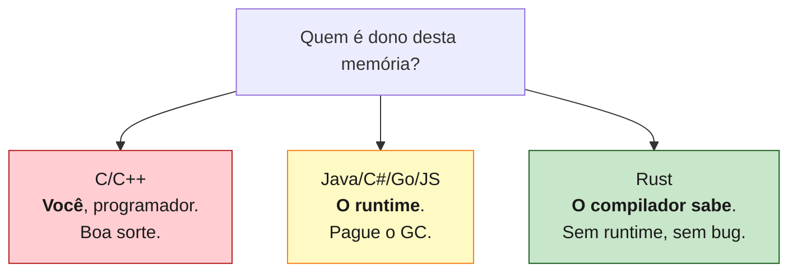

<a id="capitulo-1"></a>
# Capítulo 1: Por Que Rust Existe

> *"The most dangerous phrase in the language is, 'we've always done it this way.'"*
> — Grace Hopper

> *"Rust is technology from the past come to save the future from itself."*
> — Graydon Hoare, criador do Rust

## 1.1 A Cena do Crime

Em 25 de junho de 2014, a Apple anunciou no WWDC uma linguagem nova chamada **Swift**. Em 30 de novembro de 2009, o Google havia anunciado **Go**. Em 7 de julho de 2010, um engenheiro chamado Graydon Hoare começou um projeto pessoal num idioma que ele chamou — em homenagem a um fungo resistente — de **Rust**.

Por que três das maiores empresas de software do mundo estavam, simultaneamente, escrevendo *novas linguagens de programação*?

A resposta é desconfortável: porque as antigas estavam **matando gente**.

Em 2019, a Microsoft revelou que **70% das vulnerabilidades de segurança** corrigidas em seus produtos eram falhas de memória — buffer overflows, use-after-free, double frees, dangling pointers. Em 2020, o Google anunciou exatamente o mesmo número para o Chromium. Heartbleed (2014) era um buffer over-read em C. Shellshock (2014), parsing inseguro em C. Stagefright (2015), no Android, em C++.

Não era um problema de programadores ruins. Os engenheiros desses projetos estão entre os melhores do mundo. Era um problema **da linguagem**. C e C++ pedem ao programador uma forma de atenção que a mente humana não consegue sustentar em escala.

## 1.2 O Pecado Original

O pecado original de C, cometido em 1972 por Dennis Ritchie e Ken Thompson, não foi malicioso. Foi pragmático. C precisava rodar num PDP-11 com 64 kilobytes de RAM. A linguagem precisava de um modelo de memória **transparente**: cada byte sob controle do programador, cada ponteiro uma promessa que o programador jurava cumprir.

```c
// C, 1972 — e ainda hoje
char* nome = malloc(20);
strcpy(nome, "Felipe");
free(nome);
printf("%s\n", nome); // Use after free. Compila. Roda. Às vezes.
```

Esse trecho compila sem warning. Roda. Talvez imprima `"Felipe"`. Talvez imprima lixo. Talvez segfault. Talvez sirva como vetor de exploit que comprometa um data center inteiro. **A linguagem não tem como saber.**

Java e C# tentaram resolver isso com **garbage collection**: o programador não gerencia memória, o runtime gerencia. Funcionou para aplicações de negócio, mas:

1. Introduziu **pausas imprevisíveis** (GC stop-the-world).
2. Adicionou **overhead de memória** (objetos carregam metadata).
3. Não resolveu **data races em concorrência**.
4. Tornou impossível escrever **kernels, drivers, embedded** — domínios onde o GC é impraticável.

Go adotou GC e prosperou em servidores. Mas Go aceitou um trade-off: simplicidade da linguagem em troca de runtime visível. Para sistemas de baixíssimo nível, Go não serve.

## 1.3 O Sonho de Hoare

Graydon Hoare trabalhava na Mozilla. Sua casa em Vancouver tinha um elevador quebrado — defeito num software escrito em C++. Subindo dez andares pela escada, pela enésima vez, ele teve um pensamento subversivo:

> *E se a linguagem não permitisse o bug em primeiro lugar?*

Não detectasse em runtime. Não pedisse atenção do programador. **Não compilasse.**

Não era ideia nova. Linguagens funcionais como ML e Haskell já praticavam o lema "if it compiles, it works". Mas elas pagavam um preço: GC e immutability total. Não serviam para escrever sistemas operacionais.

A pergunta de Hoare foi: **podemos ter a segurança de Haskell com a performance de C?**

A resposta — e levou uma década e o trabalho de centenas de engenheiros para refiná-la — foi **sim, se você ensinar o compilador a entender posse**.

## 1.4 A Ideia Central

Toda linguagem de programação resolve uma pergunta: *quem é dono desta memória, e quando ela pode ser liberada?*



C diz: "você é dono, faça o que quiser, free quando quiser, e que Deus tenha piedade da sua alma".

Java/Go dizem: "o runtime é dono, você não se preocupa, e nós paramos a aplicação periodicamente para limpar".

Rust diz: "**a posse é uma propriedade do código fonte**. Cada valor tem exatamente um dono. Quando o dono sai de escopo, o valor é liberado. Eu, compilador, vou *provar* que você não cometeu nenhum erro de memória *antes* de gerar o binário."

Isso parece simples. É catastroficamente difícil de implementar. Mas o resultado é único: um binário tão rápido quanto C, sem garbage collector, e *seguro por construção*.

## 1.5 Os Três Pilares

Rust se sustenta em três promessas:

```rust
// 1. MEMORY SAFETY sem garbage collector
fn main() {
    let s = String::from("hello");
    let r = &s;
    drop(s);          // ❌ erro de compilação
    println!("{}", r); // borrow checker disse não
}
```

```rust
// 2. CONCORRÊNCIA sem data races
use std::thread;

fn main() {
    let mut x = 5;
    thread::spawn(|| {
        x += 1; // ❌ erro de compilação
    });          // closure captura por referência mutável
    x += 1;      // sem Send/Sync, não passa
}
```

```rust
// 3. ZERO-COST ABSTRACTIONS
let total: i32 = (0..1_000_000)
    .filter(|x| x % 2 == 0)
    .map(|x| x * x)
    .sum();
// Compila para o mesmo código de máquina de um for-loop em C.
// Iteradores são gratuitos. Closures são gratuitas.
```

Cada pilar é uma vitória contra um inimigo histórico:

- **Memory safety sem GC**: contra C/C++.
- **Concorrência sem data races**: contra Java, contra Go (que tem data races), contra C++.
- **Zero-cost abstractions**: contra Java, Python, JavaScript — onde abstrações custam runtime.

## 1.6 O Custo

Toda linguagem tem um custo. O custo de Rust é a **curva de aprendizado**.

Programadores experientes em outras linguagens chegam ao Rust e descobrem que **não conseguem escrever código que compila**. Eles tentam escrever Java em Rust, Go em Rust, C em Rust — e o compilador recusa, capítulo após capítulo.

Esse momento — chamado pela comunidade de "fighting the borrow checker" — é desorientador. Mas é também o momento em que o aprendizado real acontece. Cada erro do compilador é uma lição:

| Mensagem do compilador | Lição |
|---|---|
| `value borrowed after move` | Você não percebeu que cópia em Rust é explícita. |
| `cannot borrow as mutable... already borrowed as immutable` | Você confundiu posse com aliasing. |
| `lifetime may not live long enough` | Você não pensou na vida útil dos dados. |
| `the trait Send is not implemented` | Você quase enviou estado mutável entre threads. |

Cada uma dessas mensagens, em C ou C++, seria um bug em produção. Em Rust, é um *erro de compilação*.

> "Rust não é difícil. Programar em sistemas é difícil. Rust apenas se recusa a fingir o contrário."
> — Manish Goregaokar

## 1.7 A Adoção

Em 2024, Rust era a linguagem mais amada do Stack Overflow Developer Survey pelo **nono ano consecutivo**. Mais importante: havia parado de ser uma curiosidade.

- **Linux** aceita drivers em Rust desde 6.1 (2022).
- **Windows** está reescrevendo pedaços do kernel em Rust.
- **Android** adicionou Rust como linguagem aprovada em 2021.
- **Cloudflare** reescreveu seu HTTP proxy (Pingora) em Rust e está servindo trilhões de requisições.
- **Discord** trocou Go por Rust no serviço Read States e cortou latência em 90%.
- **AWS** patrocina um time inteiro de Rust em Tokio, hyper, e Firecracker (que roda Lambda).

Rust não é mais uma aposta. É infraestrutura de internet.

## 1.8 Por Que Este Livro

A maior parte do material de Rust em português ainda é tradução. E quase todo material em qualquer idioma trata Rust como uma linguagem isolada — explica `ownership` como se você nunca tivesse escrito JavaScript, `Result` como se você nunca tivesse pego uma exceção em Java.

Este livro assume o oposto: **você já programa**. Você já sabe que `null` foi uma má ideia. Você já apanhou de uma race condition em Go. Você já viu um segfault em C que custou um sprint inteiro. Você quer entender o que Rust *faz* com esses problemas.

Por isso, em cada capítulo, há comparações. **TypeScript** porque é onde a maior parte de você escreve. **Go** porque é o competidor honesto. **C** porque é o passado que Rust quer aposentar.

A jornada começa no próximo capítulo, com o que chamo de a **Trindade Impossível** — o triângulo que toda linguagem de sistemas tenta equilibrar e quase sempre falha.

---

> *"Antes de aprender a sintaxe, é preciso aprender o porquê. Senão Rust parece arbitrário. E nada em Rust é arbitrário."*

[Próximo: Capítulo 2 — A Trindade Impossível →](ch02-trindade-impossivel.md)
