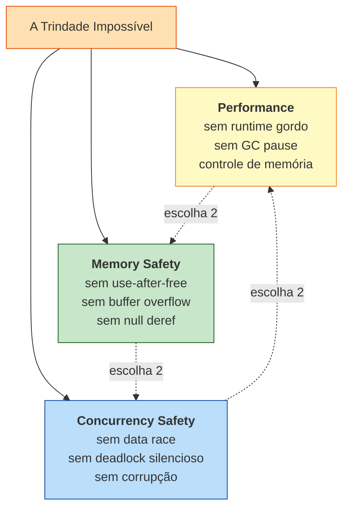
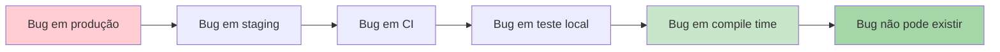

<a id="capitulo-2"></a>
# Capítulo 2: A Trindade Impossível

> *"There are only two hard things in Computer Science: cache invalidation and naming things."*
> — Phil Karlton

> *"The cheapest, fastest, and most reliable components are those that aren't there."*
> — Gordon Bell

## 2.1 O Triângulo

Toda linguagem que se propõe a escrever sistemas — kernels, bancos de dados, runtimes, navegadores — tenta equilibrar três promessas que historicamente se canibalizam:

1. **Performance**: o programa precisa rodar perto do metal. Sem GC pausando, sem boxing escondido, sem alocação que você não pediu.
2. **Memory Safety**: o programa não pode ler memória que não é dele, escrever fora dos limites, nem usar ponteiros depois de liberá-los.
3. **Concurrency Safety**: quando dois fluxos de execução compartilham dados, o resultado precisa ser determinístico. Sem data races, sem corrupção silenciosa.

Por quase cinco décadas, a indústria aceitou um axioma tácito: **você escolhe dois**. Se quer performance e controle, escreve C — e aceita os bugs de memória. Se quer segurança, escreve Java ou Go — e paga o GC. Se quer concorrência fácil, escreve Erlang ou JavaScript single-threaded — e perde paralelismo real.

Rust é a primeira linguagem mainstream que se recusa a escolher.



A pergunta deste capítulo é simples: **por que isso era um trilema, e como Rust o destrói?**

## 2.2 Vértice 1 — C e o Preço do Controle

C escolhe performance e — em teoria — controle. Não escolhe nem segurança de memória nem segurança de concorrência. Tudo é responsabilidade do programador.

```c
// C — segfault esperando para acontecer
#include <stdio.h>
#include <stdlib.h>
#include <string.h>

int main(void) {
    char *buf = malloc(8);
    strcpy(buf, "abcdefghij"); // overflow: 11 bytes em 8
    free(buf);
    printf("%s\n", buf);       // use-after-free
    return 0;
}
```

Esse programa compila com `gcc -Wall` sem reclamar. Pode imprimir lixo. Pode segfault. Pode, dependendo do alocador e da fase da lua, não reclamar. Em produção, esse padrão tem nome: **CVE**.

Concorrência em C é pior. A linguagem não tem modelo de memória decente até C11, e mesmo o `<threads.h>` é opcional — quase ninguém usa. Na prática, programadores caem em pthreads, que oferecem mutex e condvar e nada mais. Compartilhar um `int` entre threads sem mutex é undefined behavior, e o compilador tem o direito de assumir que isso nunca acontece (e otimiza assumindo). Bugs reais passam despercebidos por anos.

A Microsoft, num relatório de 2019, atribuiu **70% de seus CVEs** a falhas de memória em C/C++. O Google, no mesmo ano, encontrou **70% de bugs de segurança no Chromium** com a mesma causa. Não é um vértice — é um abismo.

## 2.3 Vértice 2 — Java, Go e o Preço do Runtime

A geração que se opôs a C escolheu o caminho oposto: pagar com runtime para comprar segurança. Java foi o emblema. C# seguiu. Go, em 2009, repetiu a fórmula com sintaxe mais magra.

```java
// Java — memory safe, mas paga o preço
import java.util.ArrayList;
import java.util.List;

class Pedido {
    final long id;
    final double valor;
    Pedido(long id, double valor) { this.id = id; this.valor = valor; }
}

public class App {
    public static void main(String[] args) {
        List<Pedido> pedidos = new ArrayList<>();
        for (long i = 0; i < 10_000_000L; i++) {
            pedidos.add(new Pedido(i, i * 1.5));
        }
        // GC vai pausar a JVM várias vezes durante esse loop.
        // Cada Pedido carrega header de objeto (~16 bytes em x86-64).
    }
}
```

Em Java, cada objeto carrega um header (mark word + class pointer) que custa memória e força indireção. O GC promete que você não verá `use-after-free`, mas em troca:

- **Pausas imprevisíveis**: até G1 e ZGC reduzirem isso, era comum ver pausas de centenas de milissegundos. Inaceitável em trading, jogos, baixa-latência.
- **Footprint inflado**: tipicamente 2x a 4x mais memória do que C equivalente.
- **Tail latency**: o p99 sempre carrega a sombra de uma coleta major.

Go fez algo mais sutil. Adotou GC, mas otimizou para latência baixa em troca de throughput. O resultado é decente para servidores HTTP, péssimo para qualquer coisa onde você precisa de RAII determinístico.

```go
// Go — sintaxe limpa, runtime sempre presente
package main

import "fmt"

type Pedido struct {
    ID    int64
    Valor float64
}

func main() {
    pedidos := make([]Pedido, 0, 10_000_000)
    for i := int64(0); i < 10_000_000; i++ {
        pedidos = append(pedidos, Pedido{ID: i, Valor: float64(i) * 1.5})
    }
    fmt.Println(len(pedidos))
}
```

Go é mais magro que Java aqui — `Pedido` é um value type, sem header. Mas o GC continua presente, o scheduler está sempre rodando, e — como veremos no próximo vértice — Go tem um defeito ainda mais grave.

## 2.4 Vértice 3 — Go, Java e o Mito da Concorrência Segura

Existe uma narrativa popular: "Go é seguro porque tem goroutines e channels". É falsa.

Go permite escrever isto, e compila:

```go
// Go — data race silenciosa
package main

import (
    "fmt"
    "sync"
)

func main() {
    var contador int
    var wg sync.WaitGroup

    for i := 0; i < 1000; i++ {
        wg.Add(1)
        go func() {
            defer wg.Done()
            contador++ // data race: leitura e escrita não atômicas
        }()
    }
    wg.Wait()
    fmt.Println(contador) // raramente 1000. depende do humor do scheduler.
}
```

Go detecta data races *em tempo de execução*, e somente se você lembrar de rodar com `go run -race`. Em produção, essa flag está desligada (custa ~5x). O resultado: data races em Go são bugs descobertos em postmortem, não no compilador.

Java é igual. `int contador` compartilhado entre threads sem `synchronized` ou `AtomicInteger` é o estágio inicial de praticamente todo bug de concorrência sério no JVM. A linguagem oferece ferramentas para acertar, mas não te impede de errar.

C++ é o pior dos mundos: tem todas as armadilhas de C **mais** as armadilhas de threads modernas, com modelo de memória barroco e std::shared_ptr que ainda é vulnerável a ciclos.

Quando o time do Datadog publicou o postmortem do *Great Outage* de 2023, a causa raiz envolveu, entre outras coisas, comportamento concorrente sutil em código escrito numa linguagem com GC. Memory safety não te protege de concurrency bugs — são problemas ortogonais.

## 2.5 O Vértice Quebrado — Rust

Rust faz uma aposta arquitetural: **mover toda a verificação para o compilador**.

```rust
// Rust — o mesmo programa, mas o compilador recusa
use std::thread;

fn main() {
    let mut contador = 0;
    let mut handles = vec![];

    for _ in 0..1000 {
        handles.push(thread::spawn(|| {
            contador += 1; // erro de compilação
        }));
    }

    for h in handles { h.join().unwrap(); }
    println!("{}", contador);
}
```

O compilador rejeita esse código com uma mensagem que, traduzida, diz: *"você está tentando capturar `contador` por referência mutável em uma closure que vai sobreviver à função, e isso poderia criar uma data race"*. A mensagem aponta a linha exata. Não há flag `-race`, não há runtime, não há postmortem.

Para escrever a versão correta, você precisa explicitar a sincronização:

```rust
// Rust — versão correta, com Mutex
use std::sync::{Arc, Mutex};
use std::thread;

fn main() {
    let contador = Arc::new(Mutex::new(0));
    let mut handles = vec![];

    for _ in 0..1000 {
        let c = Arc::clone(&contador);
        handles.push(thread::spawn(move || {
            let mut guard = c.lock().unwrap();
            *guard += 1;
        }));
    }

    for h in handles { h.join().unwrap(); }
    println!("{}", *contador.lock().unwrap()); // 1000, sempre.
}
```

É mais verboso. É também impossível de errar do jeito que erramos em Go ou Java. O `Mutex` está embutido no tipo do dado, não num protocolo paralelo que o programador precisa lembrar.

A mesma máquina conceitual — ownership e borrow checking — resolve simultaneamente os três vértices. Não há GC, então a performance é a de C. Não há aliasing mutável, então não há use-after-free. Não há aliasing mutável compartilhado entre threads, então não há data race. Um único princípio, três problemas.

## 2.6 A Tabela Comparativa

| Linguagem | Performance | Memory Safety | Concurrency Safety | Custo |
|---|---|---|---|---|
| **C** | Excelente | Nenhuma | Nenhuma | UB em todo lugar |
| **C++** | Excelente | Parcial (RAII, smart pointers) | Parcial (std::atomic, mas data races compilam) | Complexidade extrema |
| **Java** | Boa | Sim (GC) | Não no compilador (runtime) | GC pause, footprint |
| **C#** | Boa | Sim (GC) | Não no compilador | GC pause, footprint |
| **Go** | Muito boa | Sim (GC) | **Não** (data races compilam) | GC, runtime, scheduler |
| **Python** | Ruim | Sim (refcount + GC) | Não (GIL não é safety, é exclusão) | Lento, GIL |
| **Haskell** | Boa | Sim (GC + immutability) | Sim (STM, immutability) | GC, curva mental |
| **Rust** | Excelente | **Sim, em compile time** | **Sim, em compile time** | Curva de ownership |

Note duas coisas. Primeiro: **Haskell também resolve a trindade**, mas paga em GC e em hostilidade a sistemas de baixo nível. Você não escreve um kernel Linux em Haskell. Segundo: **Rust é o único quadrante "Sim em compile time" para concorrência** — a única linguagem mainstream em que ausência de data race é uma propriedade verificável estaticamente.

Isso é o que a comunidade chama de **fearless concurrency**. Não é marketing; é uma propriedade matemática do sistema de tipos.

## 2.7 O Que "Compile Time" Significa Aqui

Há uma diferença filosófica entre detectar bugs em runtime e impedir que eles existam em compile time. Toda a engenharia de software dos últimos cinquenta anos pode ser lida como uma migração lenta nessa direção:



C, Go, Python, JavaScript: a maior parte dos bugs vive entre A e D. Java e TypeScript empurraram um pedaço para E (null safety em TS, type errors em ambos). Rust empurra **classes inteiras** de bug — toda a família de UB de memória, toda a família de data races — para F.

Isso muda o que significa "code review". Em C, você revisa procurando `free` perdido, `strcpy` sem bounds, ponteiro reusado. Em Rust, esses bugs nem chegam ao PR — o compilador rejeitou no laptop do desenvolvedor. O reviewer fica livre para olhar o que importa: lógica de negócio, design de API, complexidade.

## 2.8 O Que Rust *Não* Resolve

Honestidade intelectual exige listar o que está fora do escopo:

- **Logic bugs**: se você calcula imposto errado, Rust não te ajuda. O sistema de tipos é poderoso, mas não é prova formal de correção.
- **Deadlocks**: dois `Mutex` adquiridos em ordem errada por threads diferentes ainda travam. Rust previne data races, não deadlocks.
- **Resource leaks lógicos**: você pode criar um `Arc` cíclico que nunca libera memória. É um leak, não um use-after-free — Rust permite leaks (são *seguros*, só ineficientes).
- **Panic em runtime**: `unwrap()` numa `Option::None` ainda derruba a thread. Rust te dá ferramentas para evitar (`Result`, `match`, `?`), mas não força.
- **Unsafe blocks**: dentro de `unsafe { }`, você volta a programar em C. A diferença é que `unsafe` é localizado, auditável, e raro.

Rust não é a linguagem perfeita. É a primeira linguagem mainstream que oferece os três vértices da trindade *como default*, sem que o programador precise lembrar de ativar nada.

## 2.9 Por Que Demorou

A pergunta natural é: se a ideia é tão poderosa, por que ninguém fez antes?

Fizeram. Linear types existem em pesquisa acadêmica desde os anos 80 (Wadler, Girard). Cyclone, um dialeto seguro de C, experimentou ownership por volta de 2002. ML e Haskell já tinham os fundamentos teóricos. O que faltava era **engenharia de produto**:

1. **Mensagens de erro decentes**. Um borrow checker que não consegue explicar por que rejeitou seu código é inútil. Rust gastou anos refinando suas mensagens. Hoje elas apontam linhas, sugerem fixes, e até citam a regra violada.
2. **Ergonomia**. NLL (Non-Lexical Lifetimes), que aterrissou em 2018, transformou o borrow checker de "irritante" em "razoável". Antes, escopos eram lexicais e o compilador rejeitava código óbvio. Depois, ele entende que a referência morreu na última linha em que foi usada.
3. **Ecosistema**. Cargo, crates.io, rustup, e a estabilidade prometida em 2014 (no famoso post *Stability as a Deliverable*) tornaram a linguagem usável fora de pesquisa.
4. **Casos de uso de alto perfil**. Servo, Firefox, Linux, Cloudflare Pingora, AWS Firecracker. Cada um provou que a teoria escala.

Não foi inevitável. Foi construído.

## 2.10 O Que Vem Agora

A Trindade Impossível foi resolvida por um único mecanismo: **ownership**. Esse é o nome técnico da posse — quem tem o direito de ler, de escrever, e de liberar cada pedaço de memória. Uma vez que o compilador sabe a resposta dessas perguntas com certeza estática, todos os três vértices caem juntos.

Antes de mergulhar na sintaxe — antes de ver `&`, `&mut`, `'a` e `move` — precisamos do *modelo mental*. Ownership não é uma regra arbitrária imposta pelo compilador; é uma maneira de pensar sobre dados que, uma vez internalizada, faz com que toda a sintaxe pareça óbvia.

É isso que o próximo capítulo ataca.

---

> *"Rust não escolheu segurança em vez de performance, nem performance em vez de segurança. Ele provou que a escolha era falsa o tempo todo."*

[← Anterior: Capítulo 1 — Por Que Rust Existe](ch01-por-que-rust-existe.md) · [Próximo: Capítulo 3 — O Modelo Mental: Ownership Como Filosofia →](ch03-modelo-mental-ownership.md)
