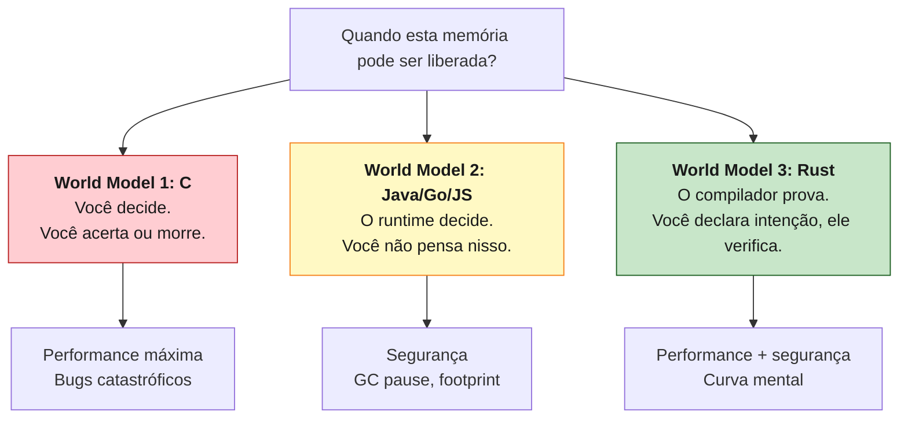
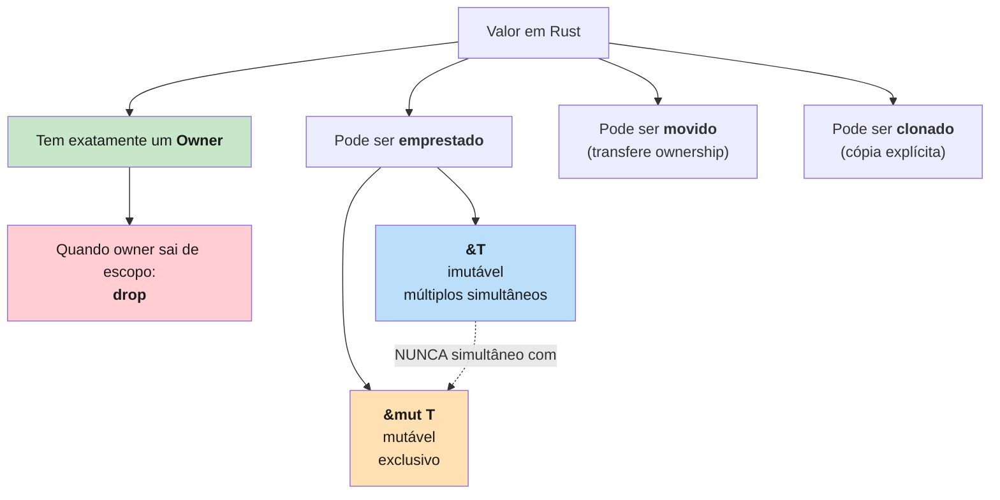

<a id="capitulo-3"></a>
# Capítulo 3: O Modelo Mental — Ownership Como Filosofia

> *"A language that doesn't affect the way you think about programming is not worth knowing."*
> — Alan Perlis, *Epigrams on Programming*

> *"Ownership is Rust's most unique feature, and it enables Rust to make memory safety guarantees without needing a garbage collector."*
> — *The Rust Programming Language*, capítulo 4

## 3.1 Antes da Sintaxe, o Modelo

Há um erro pedagógico clássico em livros de Rust: começar pela sintaxe. Apresentar `&`, `&mut`, `'a`, `Box<T>`, `Rc<T>` como se fossem novas palavras de um vocabulário maior. O resultado é um leitor que decora sinais sem entender o que eles representam.

Este capítulo se recusa a fazer isso. Antes de uma única linha de Rust, vamos instalar o **modelo mental**: a maneira de pensar sobre dados que torna a sintaxe inevitável.

A tese é simples. **Ownership não é uma regra do compilador. É uma propriedade do mundo real que toda linguagem de programação ignora — exceto Rust.**

## 3.2 Três World Models

Toda linguagem responde, implícita ou explicitamente, a uma pergunta:

> *"Quando este pedaço de memória pode ser liberado?"*

A resposta define o **world model** da linguagem — o jeito como o programador é forçado a pensar sobre dados em movimento.



### World Model 1 — Você Gerencia (C, C++ raw, Assembly)

Em C, memória é território selvagem. Você reserva (`malloc`), usa, libera (`free`). Esquecer de liberar é leak. Liberar duas vezes é UB. Usar depois de liberar é UB. Passar um ponteiro para outra função sem documentar quem libera é uma fonte infinita de bugs.

O modelo mental do programador C é **paranoico**: cada ponteiro carrega um contrato implícito que não está em lugar nenhum exceto na sua cabeça.

### World Model 2 — O Runtime Gerencia (Java, Go, Python, JS)

Em Java ou Go, você nunca pensa em liberação. Você cria objetos, eles vivem, em algum momento o GC os recolhe. A pergunta "quando isso é liberado?" é literalmente *fora do alcance* do programador.

O modelo mental é **delegado**: a memória é problema do runtime. O custo é que o runtime sempre está lá — pausando, alocando, copiando objetos entre gerações.

### World Model 3 — O Compilador Prova (Rust)

Rust faz algo radicalmente diferente. Ele te pede para **declarar a posse explicitamente** no código, e em troca:

- Garante segurança como Java.
- Gera código tão rápido quanto C.
- Não tem runtime de garbage collection.

A diferença não é que Rust seja "C com checagens". É que **Rust te força a tornar visível um contrato que sempre existiu**, mas que C escondia e Java terceirizava. Cada valor tem um dono. Quando o dono sai de escopo, o valor é liberado. Não há ambiguidade.

## 3.3 As Três Regras (Verbatim)

A documentação oficial de Rust enuncia três regras de ownership. Vale memorizá-las literalmente:

1. **Cada valor em Rust tem um *owner*.**
2. **Só pode haver um owner por vez.**
3. **Quando o owner sai de escopo, o valor é descartado (`drop`).**

Note o que essas regras *não* dizem. Não falam de heap nem de stack. Não falam de ponteiros. Não falam de threads. São regras sobre **valores e escopos** — conceitos que existem em qualquer linguagem.

A novidade é que Rust as **enforce em compile time**.

## 3.4 Analogia 1 — As Chaves da Casa

Imagine uma casa. Há um chaveiro físico, único, que abre a porta. Quem tem o chaveiro tem direito de entrar, mexer nos móveis, mudar a fechadura. Esse é o **owner**.

Você pode fazer três coisas com o chaveiro:

1. **Dar para outra pessoa** (move). A partir desse momento, *você* não tem mais o chaveiro. Tentar entrar na casa é falha.
2. **Fazer cópia do chaveiro** (clone). Agora há dois chaveiros, mas isso requer uma chaveira, custa dinheiro, e Rust só faz se você pedir explicitamente.
3. **Emprestar** (borrow). Você passa o chaveiro temporariamente, mas ele volta. Enquanto está emprestado, há regras: ou *uma* pessoa pode estar usando para reformar (mutável), ou *várias* pessoas podem estar usando para visitar (imutáveis), mas **nunca os dois ao mesmo tempo**.

A última regra parece arbitrária. Não é. É o princípio universal sobre o qual Rust é construído.

## 3.5 Aliasing XOR Mutability

Existe um princípio que toda linguagem de sistemas tropeça e Rust eleva a axioma fundacional:

> **Em qualquer instante, você tem acesso aliased *ou* acesso mutável a um dado, nunca os dois.**

Aliasing significa "duas referências que apontam para o mesmo valor". Mutability significa "permissão para modificar". Se você tem ambos ao mesmo tempo, criou as condições para todas as classes de bug que destroem sistemas:

- **Iterator invalidation**: você lê um vetor enquanto outro código o modifica. C++ tem isso. Java tem `ConcurrentModificationException` em runtime.
- **Use-after-free**: dois ponteiros para o mesmo bloco; um libera, outro lê.
- **Data race**: duas threads, uma escrita, sem sincronização. Comportamento indefinido.
- **Reentrância sutil**: callback recursivo que modifica estrutura sendo iterada.
- **Compiler optimization breakage**: compilador assume que `*p` não muda entre duas leituras, mas outra referência mudou.

Todos esses bugs são **a mesma classe de erro**: alguém modificou um valor enquanto outro ponto do código achava que ele estava estável. Rust elimina a classe inteira com uma regra de tipo:

```rust
// Rust — aliasing XOR mutability na prática
fn main() {
    let mut v = vec![1, 2, 3];

    let r1 = &v;       // empréstimo imutável (alias)
    let r2 = &v;       // outro empréstimo imutável (alias)
    println!("{r1:?} {r2:?}");

    let m = &mut v;    // empréstimo mutável (exclusivo)
    m.push(4);
    println!("{m:?}");

    // Erro: não pode coexistir &v e &mut v
    // let bad = &v;
    // m.push(5);
    // println!("{bad:?} {m:?}");
}
```

A regra é tão profunda que outros designers de linguagem começaram a citá-la como princípio independente. Niko Matsakis, um dos arquitetos do borrow checker, costuma dizer: *"aliasing XOR mutability não é uma regra de Rust, é uma regra do universo. Rust apenas é honesto sobre ela."*

## 3.6 Comparando os Modelos em Código

Vamos olhar o mesmo programa — copiar um valor, passar adiante, modificar — em quatro linguagens.

### C — Você jura solenemente

```c
#include <stdlib.h>
#include <string.h>

char* criar(void) {
    char* s = malloc(16);
    strcpy(s, "hello");
    return s;
}

void usar(char* s) {
    // s é meu agora? ou só emprestado? quem libera?
    // o tipo não diz nada. comentário diz o que o programador lembrou.
}

int main(void) {
    char* p = criar();
    usar(p);
    free(p); // espero que `usar` não tenha liberado também
    return 0;
}
```

O contrato de posse vive nos comentários ou na cabeça. Compilador não verifica nada.

### Go — Tudo é por referência, GC limpa

```go
package main

func criar() *string {
    s := "hello"
    return &s
}

func usar(s *string) {
    // s pode estar sendo modificado por outra goroutine?
    // `s` pode estar nil?
    // tipo não me diz.
}

func main() {
    p := criar()
    usar(p)
    // sem free; GC eventualmente coleta
    // mas se uma goroutine ainda segura `p`, ele vive
}
```

Posse é ignorada. GC garante que nada é liberado prematuramente, mas data races e null deref ainda compilam.

### TypeScript — Igual a Go, com tipos

```typescript
function criar(): { texto: string } {
  return { texto: "hello" };
}

function usar(obj: { texto: string }): void {
  // obj pode ser compartilhado com qualquer outra parte do código
  // pode ser mutado por callback assíncrono
  // tipo não me protege
}

const p = criar();
usar(p);
// V8 coleta quando ninguém mais aponta
```

Mesma história. Aliasing é ilimitado, mutação é livre, GC esconde o problema de liberação. Em troca, ganhamos null deref, race conditions em código assíncrono, e debugging mais barato em produção.

### Rust — Posse é parte do tipo

```rust
fn criar() -> String {
    String::from("hello")
}

fn usar_emprestado(s: &String) {
    // só leio. compilador garante que ninguém mais escreve em s.
    println!("{s}");
}

fn usar_e_consumir(s: String) {
    // sou dono agora. quando saio de escopo, libero.
    println!("{s}");
}

fn main() {
    let p = criar();          // p é dono
    usar_emprestado(&p);      // empresto: ainda sou dono
    usar_emprestado(&p);      // empresto de novo: ok
    usar_e_consumir(p);       // movo: deixo de ser dono
    // usar_emprestado(&p);   // erro: p foi movido
}
```

A assinatura da função carrega o contrato. `&String` é "empréstimo imutável". `&mut String` seria "empréstimo mutável exclusivo". `String` (sem `&`) é "transferência de posse". O compilador verifica.

Você nunca precisa olhar o corpo da função para saber o que ela faz com seu valor. **O tipo é a documentação executável**.

## 3.7 O Contrato de Aluguel

Empréstimo (`borrow`) merece uma analogia própria. Pense num apartamento alugado.

- **Você é o owner do imóvel** (`String`).
- **O inquilino tem uma referência** (`&String` ou `&mut String`).
- **Enquanto o contrato de aluguel está em vigor, você não pode demolir o prédio.** Em Rust: você não pode mover ou destruir o valor enquanto há borrows ativos.
- **O contrato tem prazo (lifetime).** O inquilino sai antes ou no momento em que o imóvel é desocupado. Em Rust: a referência não pode viver mais que o owner.

Se o inquilino tenta alugar o imóvel para um sublocatário cujo contrato dura mais que o dele, o cartório recusa. Em Rust, o borrow checker recusa. A mensagem `lifetime may not live long enough` é literalmente isso: você prometeu uma referência válida por um período maior do que o owner pode garantir.

Lifetimes — que aparecem como `'a`, `'static` — não são sintaxe arcana. São o nome técnico desse contrato.

## 3.8 Por Que Esse Modelo Elimina Classes Inteiras de Bug

Uma vez que aliasing XOR mutability está enforced, observe o que cai junto:

| Bug | Por que não pode acontecer |
|---|---|
| **Use-after-free** | Você não pode usar uma referência depois que o owner foi dropado — borrow checker rejeita. |
| **Double free** | Só há um owner; o `drop` acontece exatamente uma vez. |
| **Iterator invalidation** | Iterar é um borrow; modificar o container precisa de `&mut`; ambos não coexistem. |
| **Data race em escrita compartilhada** | Escrever exige `&mut`, que é exclusivo; outra thread não tem acesso simultâneo. |
| **Null pointer dereference** | Não há ponteiros null em Rust safe. `Option<T>` força tratamento explícito. |
| **Buffer overflow** | Slices e arrays carregam tamanho; acesso fora de bounds causa panic, não corrupção. |
| **Dangling pointer** | Lifetime do borrow está atrelado ao do owner; impossível sobreviver. |

Cada um desses bugs custou bilhões à indústria. Heartbleed (use-after-free conceitual em buffer). Cloudbleed (buffer overflow em parser HTML). Boa parte dos kernel exploits no Linux antes de 2020.

Rust não detecta esses bugs. **Rust os torna inexpressíveis.**

## 3.9 O Que Você Perde

Honestidade: o modelo cobra um preço.

- **Estruturas auto-referenciais**: árvores com ponteiros parent/child, listas duplamente ligadas, grafos. Todas viáveis em Rust, mas exigem `Rc`, `RefCell`, ou `unsafe`. Em Go, basta um campo struct.
- **"Apenas funciona" inicial**: protótipos rápidos em Rust são mais lentos do que em Python. Você paga upfront por garantias futuras.
- **Refatoração estrutural**: mudar de `&str` para `String`, ou introduzir um campo compartilhado, propaga por toda a árvore de chamadas. Em Java, você só muda um campo.

A pergunta correta não é "Rust é a melhor linguagem para tudo?" — não é. A pergunta é "para sistemas que precisam viver dez anos em produção sem me acordar às três da manhã, vale o investimento upfront?". A resposta empírica de Cloudflare, Discord, Microsoft e AWS tem sido sim.

## 3.10 Como o Resto do Livro Encaixa

Os capítulos restantes deste livro são, todos, **elaboração desse modelo mental**. Considere-os como zoom em pedaços específicos:

- **Capítulo 4** entra na sintaxe: `&`, `&mut`, `let mut`, drop. A gramática do que vimos aqui.
- **Capítulo 5** ataca lifetimes. O contrato de aluguel formalizado.
- **Capítulo 6** apresenta os tipos algébricos: `Option`, `Result`. Onde Rust resolve null e exceptions.
- **Capítulo 7** traz traits e generics. Polimorfismo zero-cost.
- **Capítulo 8** mergulha em concorrência: `Send`, `Sync`, `Arc`, `Mutex`. Aplicação direta de aliasing XOR mutability a múltiplas threads.
- **Capítulo 9** discute `unsafe`. A escotilha de emergência.
- **Capítulos 10+** entram em ferramentas, ecossistema, produção.

Se em algum ponto você se sentir perdido na sintaxe, volte aqui. Toda regra de Rust é uma sombra de uma das três:

1. Cada valor tem um owner.
2. Só um owner por vez.
3. Aliasing XOR mutability.

Memorize. Repita. Internalize. O resto é elaboração.

## 3.11 Um Diagrama Para Levar



Esse diagrama é o livro inteiro em uma imagem. Tudo que vem a seguir é detalhe.

---

> *"You don't have to be a memory expert to write Rust. You have to be willing to think about who owns what — and once you start, you'll wonder how you ever programmed without it."*
> — Niko Matsakis

[← Anterior: Capítulo 2 — A Trindade Impossível](ch02-trindade-impossivel.md) · [Próximo: Capítulo 4 — Sintaxe da Posse →](ch04-sintaxe-da-posse.md)
