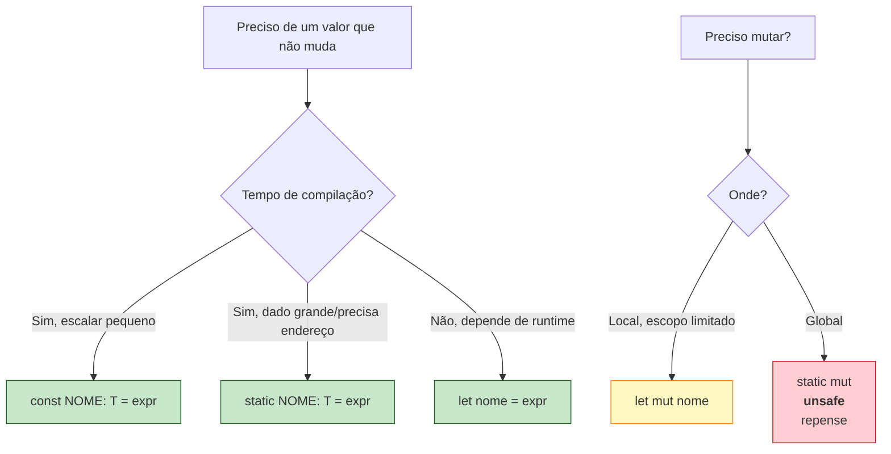
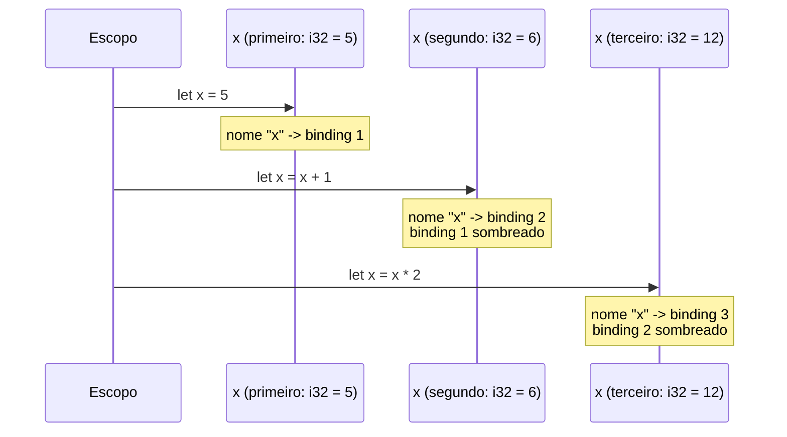

<a id="capitulo-4"></a>
# Capítulo 4: Variáveis, Mutabilidade e Shadowing

> *"Mutable state is the root of all evil."*
> — Rich Hickey

> *"In the beginning, the Universe was created. This has made a lot of people very angry and been widely regarded as a bad move."*
> — Douglas Adams, *The Restaurant at the End of the Universe*

## 4.1 A Pergunta Errada

Quase todo programador que chega a Rust faz a mesma pergunta no terceiro dia:

> *"Por que `let` cria uma variável imutável? Variável é, por definição, algo que **varia**."*

A pergunta é razoável. E está errada.

A palavra "variável" é uma herança da matemática. Em Cálculo, `x` é uma variável porque pode assumir vários valores ao longo de uma função — mas em qualquer ponto fixo da função, `x` tem **um** valor. A matemática nunca disse que `x = 5` num momento e `x = 6` no momento seguinte. Quem disse isso foi Fortran, em 1957, traduzindo a notação matemática para uma máquina que tinha registradores e endereços de memória que precisavam ser sobrescritos. A mutação não é a essência da variável; é um detalhe de implementação que ficou.

Setenta anos depois, ainda estamos pagando o preço dessa confusão. A maior parte dos bugs em sistemas concorrentes — race conditions, estado inconsistente, deadlocks por leitura suja — são bugs de mutação. Não de concorrência: de mutação. Tira a mutação, sobra concorrência inofensiva.

Rust não inventou imutabilidade por padrão. Haskell, OCaml, Erlang, Clojure já faziam isso. O que Rust fez foi trazer essa decisão para uma linguagem de sistemas onde mutação ainda é necessária — e tornar a mutação **explícita**, **localizada** e **auditável**.

## 4.2 `let` e o Default Imutável

```rust
fn main() {
    let x = 5;
    x = 6; // erro de compilação
}
```

```
error[E0384]: cannot assign twice to immutable variable `x`
 --> src/main.rs:3:5
  |
2 |     let x = 5;
  |         - first assignment to `x`
3 |     x = 6;
  |     ^^^^^ cannot assign twice to immutable variable
  |
help: consider making this binding mutable
  |
2 |     let mut x = 5;
  |         +++
```

A mensagem é didática. O compilador não só recusa: ele explica como concertar. Isso não é cortesia — é doutrinação. Toda vez que você quiser mutar, o compilador vai te lembrar de marcar com `mut`. E `mut` é visível em revisão de código.

Compare com TypeScript:

```typescript
let x = 5;
x = 6; // ok, sem aviso, sem nada
```

Em TypeScript, `let` permite reassociação. Para "imutabilidade" você usa `const`:

```typescript
const x = 5;
x = 6; // erro de compilação
```

Mas `const` em TypeScript é **rasa**. Ela impede *rebind* da variável, não mutação do conteúdo:

```typescript
const user = { name: "Felipe" };
user.name = "Outro"; // ok! const não impede isso
```

Em Rust, `let` é fundo. Sem `mut`, nem o binding nem o conteúdo podem ser alterados:

```rust
struct User { name: String }

fn main() {
    let user = User { name: String::from("Felipe") };
    user.name = String::from("Outro"); // erro de compilação
}
```

```
error[E0594]: cannot assign to `user.name`, as `user` is not declared as mutable
```

Essa é a primeira lição filosófica de Rust: **mutabilidade é uma propriedade transitiva**. Se você não declarou o dono como mutável, nada dentro dele pode ser mutado.

## 4.3 `let mut` — A Permissão Explícita

```rust
fn main() {
    let mut x = 5;
    x = 6; // ok
    x = 7; // ok
}
```

`mut` é uma palavra que aparece **toda vez** que mutação é permitida. Em revisão de código, isso é um sinal visual. Quando você lê:

```rust
let mut total = 0;
for n in &numbers {
    total += n;
}
```

Você sabe imediatamente que `total` será modificado. Em Go:

```go
total := 0
for _, n := range numbers {
    total += n
}
```

Você precisa ler o loop inteiro para descobrir. Toda variável em Go é mutável até prova em contrário. Toda variável em Rust é imutável até pedido explícito.

Isso parece detalhe estilístico. Não é. Em uma codebase de cem mil linhas, `mut` aparece em talvez 15% das variáveis. Os outros 85% são, por construção, dados que não vão mudar — e o compilador garante. A revisão de código fica focada nos 15% perigosos.

## 4.4 `const` — Constante de Verdade

Rust também tem `const`, mas ele é diferente do `let`:

```rust
const TRES_HORAS_EM_SEGUNDOS: u32 = 60 * 60 * 3;
const MAX_TENTATIVAS: u8 = 5;
```

Regras de `const`:

1. Sempre imutável. Não existe `const mut`.
2. Tipo é **obrigatório**. O compilador não infere.
3. Valor deve ser uma **expressão constante** — avaliável em tempo de compilação.
4. Pode ser declarada em qualquer escopo, inclusive global.
5. Convenção de nome: `SCREAMING_SNAKE_CASE`.

A diferença principal entre `const` e `let` (mesmo imutável) é o momento da avaliação. `let` é avaliado em tempo de execução; `const` é avaliado em tempo de compilação e literalmente **inlineado** onde for usado:

```rust
const PI: f64 = 3.14159265358979;

fn area(raio: f64) -> f64 {
    PI * raio * raio
    // O compilador substitui PI por 3.14159... no código de máquina.
    // Não há leitura de memória.
}
```

Compare com C:

```c
const double PI = 3.14159265358979;
// Em C, isso é uma variável de só-leitura em memória.
// Para inline real, use #define ou constexpr (C23).
```

Compare com TypeScript:

```typescript
const PI = 3.14159265358979;
// Em TS, é uma constante de runtime. Sem garantia de inline.
// Exceto literais — o compilador pode otimizar, mas não promete.
```

Compare com Go:

```go
const Pi = 3.14159265358979
// Em Go, const é tempo de compilação como Rust, mas só aceita
// tipos básicos (números, strings, bool). Sem expressões complexas.
```

## 4.5 `static` — A Variável Que Vive Para Sempre

Existe uma terceira forma, que parece `const` mas não é:

```rust
static IDIOMA: &str = "pt-BR";
static mut CONTADOR: u32 = 0; // raríssimo — exige `unsafe` para usar
```

Diferenças:

- `const` é inlineado onde for usado. Não tem endereço fixo.
- `static` tem **endereço fixo de memória** durante toda a execução.
- `static mut` existe, mas exige `unsafe` em todo acesso (porque é estado global mutável — exatamente o que Rust combate).

Use `const` para constantes de domínio (limites, fatores, configurações). Use `static` quando o endereço importa — buffers globais, tabelas grandes que você não quer copiar, dados de FFI.



## 4.6 Shadowing — A Reencarnação do Nome

Aqui Rust faz algo estranho à primeira vista:

```rust
fn main() {
    let x = 5;
    let x = x + 1;
    let x = x * 2;
    println!("{}", x); // 12
}
```

Três `let x`. O mesmo nome, três bindings diferentes. Isso compila. Isso é idiomático. Isso **não é mutação**.

Cada `let x = ...` cria uma **variável nova** que **sombreia** a anterior. A variável anterior continua existindo na memória até o fim do escopo (ou até o compilador descartar) — mas o nome `x` agora aponta para o novo binding. O termo técnico é *rebind*.



Por que isso importa? Porque shadowing **permite trocar o tipo**:

```rust
fn main() {
    let entrada = "   42   ";              // &str
    let entrada = entrada.trim();          // &str (mas aparado)
    let entrada: i32 = entrada.parse().unwrap(); // i32

    println!("{}", entrada + 1); // 43
}
```

O nome `entrada` viaja pelos tipos `&str` → `&str` → `i32`. Cada estágio da transformação reusa o mesmo nome porque conceitualmente é a mesma coisa — o input do usuário, em estados sucessivos de processamento.

Tente o mesmo com `mut`:

```rust
fn main() {
    let mut entrada = "   42   ";
    entrada = entrada.trim();           // ok, mesmo tipo
    entrada = entrada.parse().unwrap(); // erro: tipo i32 != &str
}
```

```
error[E0308]: mismatched types
expected `&str`, found `i32`
```

`mut` permite mudar o **valor**, não o **tipo**. Shadowing permite ambos, porque cada `let` cria uma variável genuinamente nova.

## 4.7 A Diferença Filosófica

Há uma distinção sutil mas central entre as linguagens da família C-like e Rust:

| Conceito | TypeScript `const` | Rust `let` |
|---|---|---|
| O que proíbe | Rebind do nome | Mutação do conteúdo |
| Permite mutar interior? | Sim (`const obj = {}; obj.x = 1;` ok) | Não |
| Permite shadowing? | Não (em mesmo escopo) | Sim |
| Filosofia | "este nome aponta sempre pro mesmo valor" | "este valor não muda" |

```typescript
const a = { count: 0 };
a.count = 1;        // ok — const não impede isso
const a = 5;        // erro — não pode redeclarar no mesmo escopo
```

```rust
let a = (0,);
// a.0 = 1;         // erro — let proíbe mutação
let a = 5;          // ok — shadowing redeclara
```

TypeScript proibe **rebind do nome** mas permite mutação do conteúdo. Rust proíbe **mutação do conteúdo** mas permite rebind via shadowing.

Os dois resolvem problemas diferentes. TS resolve "alguém vai apontar `a` pra outra coisa por engano". Rust resolve "alguém vai modificar `a` por engano". Para sistemas, o segundo é o problema mais grave.

## 4.8 Tabela de Equivalências

| Intenção | TypeScript | Go | C | Rust |
|---|---|---|---|---|
| Variável imutável | `const x = 5` (raso) | (não tem) | `const int x = 5` | `let x = 5` |
| Variável mutável | `let x = 5` | `var x = 5` ou `x := 5` | `int x = 5` | `let mut x = 5` |
| Constante compile-time | `const X = 5` | `const X = 5` | `#define X 5` ou `constexpr` | `const X: i32 = 5` |
| Global persistente | `globalThis.X` (evite) | `var X = 5` (package) | `static int X = 5` | `static X: i32 = 5` |
| Global mutável | (evite) | (evite) | `int X = 5` | `static mut X` (`unsafe`) |
| Trocar tipo do nome | (não dá em mesmo escopo) | (não dá) | (não dá) | shadowing: `let x = ...; let x: T = ...` |

## 4.9 Quando Usar Shadowing Idiomaticamente

### Parsing e validação

```rust
fn ler_idade() -> Result<u8, String> {
    let entrada = std::io::stdin().lines().next().unwrap()?; // String
    let entrada = entrada.trim();                            // &str
    let entrada: u8 = entrada.parse()                        // u8
        .map_err(|_| "não é um número".to_string())?;
    Ok(entrada)
}
```

Cada estágio do pipeline tem o mesmo nome conceitual (`entrada`) mas tipo diferente. Inventar `entrada_str`, `entrada_trimada`, `entrada_num` seria ruído.

### Transformação de tipos sem perder o significado

```rust
let user_id = "42";                          // &str do parâmetro HTTP
let user_id: u64 = user_id.parse().unwrap(); // u64 para o banco
```

### Conversão imutável após mutação local

```rust
fn processar(items: Vec<i32>) -> Vec<i32> {
    let items = {
        let mut items = items; // mutável só dentro do bloco
        items.sort();
        items
    };
    // a partir daqui, items é imutável de novo
    items
}
```

Isso é um padrão poderoso: você precisa de mutação para uma operação específica (ordenar), mas quer garantir que depois ninguém mais mexa. Shadowing devolve a imutabilidade.

## 4.10 Quando `mut` é Realmente Necessário

Shadowing não substitui `mut` em todos os casos. Use `mut` quando:

### A mutação é o ponto da operação

```rust
let mut buffer = Vec::with_capacity(1024);
for chunk in stream {
    buffer.extend_from_slice(&chunk);
}
```

Acumular em um buffer é mutação genuína. Cada `extend` modifica o conteúdo existente. Não há transformação conceitual — é o mesmo buffer, sendo preenchido.

### Counters e estado de loops

```rust
let mut tentativas = 0;
loop {
    if conectar().is_ok() { break; }
    tentativas += 1;
    if tentativas >= 5 { return Err("limite excedido"); }
}
```

### Estruturas que oferecem APIs mutáveis

```rust
let mut mapa = HashMap::new();
mapa.insert("a", 1);
mapa.insert("b", 2);
```

`HashMap::insert` é uma operação mutável por natureza. Tentar fazer isso com shadowing seria esquisito e ineficiente:

```rust
// ruim — copia o mapa inteiro a cada inserção
let mapa = HashMap::new();
let mapa = { let mut m = mapa; m.insert("a", 1); m };
let mapa = { let mut m = mapa; m.insert("b", 2); m };
```

A regra prática: **se o conceito é "mesmo valor, evolução de estado", use `mut`. Se é "valor novo derivado do anterior, possivelmente outro tipo", use shadowing.**

## 4.11 O Caso de Borda: Shadowing dentro de Escopos

Shadowing respeita escopos. Isso pode confundir quem vem de TypeScript:

```rust
fn main() {
    let x = 5;
    {
        let x = x * 2; // novo x dentro do bloco
        println!("interno: {}", x); // 10
    }
    println!("externo: {}", x); // 5 — o externo não foi tocado
}
```

O `x` interno é uma variável **completamente diferente** da externa. Quando o bloco termina, ela é descartada e o `x` externo volta a estar visível. Isso é igual a TypeScript com `let` em blocos:

```typescript
const x = 5;
{
    const x = x * 2; // erro em TS — ReferenceError em runtime
}
```

Mas TypeScript tem um quirk com TDZ (Temporal Dead Zone) que torna o exemplo acima quebrado. Em Rust funciona limpo porque o `x` da expressão `x * 2` se refere ao `x` externo (ainda visível até a nova declaração completar), e só depois o novo `x` toma o nome.

## 4.12 Exemplo Sintético

Para fechar, um exemplo que combina tudo:

```rust
const TIMEOUT_MS: u64 = 5000;
static USER_AGENT: &str = "ferro-espirito/1.0";

fn buscar_usuario(id: &str) -> Result<User, Error> {
    let id = id.trim();                          // &str -> &str
    let id: u64 = id.parse()?;                   // &str -> u64
    let id = UserId::new(id);                    // u64 -> UserId

    let mut tentativas = 0;
    let user = loop {
        match fetch(id, TIMEOUT_MS) {
            Ok(u) => break u,
            Err(_) if tentativas < 3 => tentativas += 1,
            Err(e) => return Err(e),
        }
    };

    let user = user.with_user_agent(USER_AGENT); // transformação final
    Ok(user)
}
```

Note:

- `TIMEOUT_MS` é `const` — escalar inline.
- `USER_AGENT` é `static` — string estática, endereço fixo.
- `id` viaja por três tipos via shadowing.
- `tentativas` é `mut` — estado evolui.
- `user` shadowa o original para adicionar headers — transformação, não mutação.

Isso é Rust idiomático. Cada decisão de `let`, `mut`, `const`, `static`, shadowing carrega significado. Não há ruído.

---

> *"A linguagem que assume mutabilidade tem que provar a ausência dela. A linguagem que assume imutabilidade tem que justificar a presença dela. A segunda é a abordagem honesta."*

[Próximo: Capítulo 5 — Tipos Primitivos: A Honestidade dos Bits →](ch05-tipos-primitivos.md)
