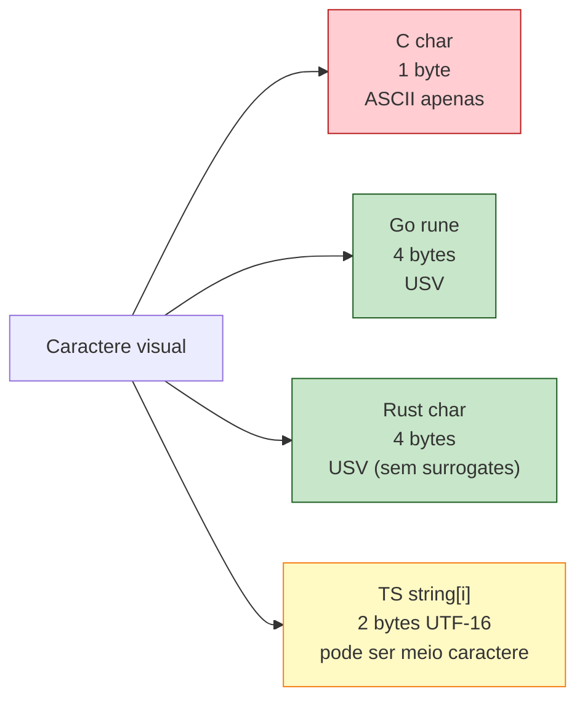

<a id="capitulo-5"></a>
# Capítulo 5: Tipos Primitivos — A Honestidade dos Bits

> *"There are only two hard things in Computer Science: cache invalidation and naming things."*
> — Phil Karlton

> *"All numbers are equal, but some numbers are more equal than others."*
> — adaptado de George Orwell, *Animal Farm*

## 5.1 O Pecado de Chamar Tudo de Número

JavaScript tem um único tipo numérico: `number`. É um IEEE-754 de 64 bits, ponto flutuante de precisão dupla. Você usa o mesmo `number` para o id de um usuário, para a idade dele, para o saldo bancário em centavos, para a coordenada GPS em graus. O motor faz o melhor que pode.

O resultado é conhecido:

```javascript
0.1 + 0.2          // 0.30000000000000004
9007199254740993   // 9007199254740992 — perdeu o último bit
2 ** 53 + 1 === 2 ** 53 + 2  // true!
```

A última linha é especialmente cruel. Em JavaScript, dois números diferentes são iguais porque ambos foram arredondados para o mesmo `f64`. Se você está somando centavos de uma transferência bancária acima de 90 trilhões, o JavaScript te entrega um bug em produção sem nenhum aviso.

TypeScript não conserta isso, porque TypeScript é JavaScript com tipos. `number` em TS continua sendo `f64`. A solução pragmática — `BigInt` — só apareceu em 2020 e ainda é citizen de segunda classe (não interopera com `number` sem conversão explícita).

Rust escolheu o caminho oposto. Não existe um tipo "número" em Rust. Existem **doze tipos inteiros** e **dois tipos float**, cada um com semântica precisa. Isso parece complexo. É **honesto**.

## 5.2 Os Doze Inteiros

| Tamanho | Signed | Unsigned | Faixa (signed) | Faixa (unsigned) |
|---|---|---|---|---|
| 8 bits | `i8` | `u8` | -128 a 127 | 0 a 255 |
| 16 bits | `i16` | `u16` | -32.768 a 32.767 | 0 a 65.535 |
| 32 bits | `i32` | `u32` | ~±2,1 bi | 0 a ~4,3 bi |
| 64 bits | `i64` | `u64` | ~±9,2 quintilhões | 0 a ~18,4 quintilhões |
| 128 bits | `i128` | `u128` | ±170 undecilhões | 340 undecilhões |
| arch | `isize` | `usize` | depende da máquina | depende da máquina |

`isize` e `usize` têm o tamanho de um ponteiro: 64 bits em máquinas modernas, 32 em embedded. São os tipos usados para indexar arrays e medir tamanhos de coleções.

O default é `i32`. Quando você escreve `let x = 5` sem anotação, Rust infere `i32`. Não é arbitrário: `i32` é o sweet spot entre faixa útil (±2 bi cobre a maioria dos casos) e desempenho (32 bits cabem em um registrador da maioria das arquiteturas).

```rust
let id: u64 = 1_000_000_000_000;     // id de banco de dados
let idade: u8 = 35;                  // idade humana cabe em 8 bits
let saldo_centavos: i64 = -42_500;   // dinheiro em centavos, signed
let temperatura: i16 = -273;         // pode ser negativo
let tamanho: usize = vec![1,2,3].len(); // sempre usize
```

Compare com Go:

```go
var id uint64 = 1_000_000_000_000
var idade uint8 = 35
var saldo int64 = -42_500
var temp int16 = -273
var tamanho int = len([]int{1, 2, 3}) // int em Go é arch-dep, como isize
```

Go tem uma família parecida (`int8/16/32/64`, `uint*`, `int`/`uint` arch-dep), mas chama `byte` o que Rust chama `u8`, e `rune` o que Rust chama `char`. Mais sobre isso na seção 5.7.

Compare com C:

```c
int id = 1000000000000;     // pode dar overflow! int em C não tem tamanho garantido
int8_t idade = 35;          // só funciona se você incluir <stdint.h>
long long saldo = -42500;   // tamanho varia entre plataformas
short temp = -273;          // pelo menos 16 bits, pode ser mais
size_t tamanho = 3;         // sem garantia de signedness em todas APIs
```

C é o caos absoluto aqui. `int` é "pelo menos 16 bits, geralmente 32, às vezes 64". `long` é "pelo menos 32, geralmente 64 em Linux, 32 em Windows". A solução foi `<stdint.h>` em 1999 — um quarto de século depois da linguagem nascer. Rust nasceu com `<stdint.h>` embutido.

## 5.3 Literais e Notação

```rust
let decimal = 98_222;          // _ é separador visual
let hex = 0xff;                // 255
let octal = 0o77;              // 63
let binario = 0b1111_0000;     // 240
let byte_ascii = b'A';         // u8 = 65 (só ASCII)
let tipado = 57u8;             // sufixo de tipo
let grande = 1_000_000_i64;    // sufixo + separadores
```

O underline `_` é puro estilo: o compilador ignora. `1_000_000` e `1000000` são idênticos. Use para legibilidade.

`b'A'` é uma forma curta para o byte ASCII de `A` (65). Funciona só para caracteres ASCII (0-127). Para qualquer caractere acima de 127, use `char` ou escape Unicode.

## 5.4 Overflow — A Pergunta Que C Nunca Responde

O que acontece quando você soma `255u8 + 1u8`? A resposta correta é: **depende da linguagem**, e a maioria delas mente sobre isso.

### C: comportamento indefinido (signed) ou wrap silencioso (unsigned)

```c
unsigned char x = 255;
x = x + 1; // x == 0, wrap silencioso, OK pelo padrão

signed char y = 127;
y = y + 1; // UNDEFINED BEHAVIOR! Compilador pode otimizar para qualquer coisa.
```

Signed overflow em C é UB. Isso significa que o compilador pode assumir que **nunca acontece** e otimizar agressivamente em cima dessa premissa. Loops infinitos, branches removidos, código que sumiu — tudo já foi visto em produção.

### Java/C#/Go: wrap silencioso, sempre

```java
byte x = 127;
x = (byte)(x + 1); // x == -128, wrap silencioso
```

Sem UB, mas sem alarme. Você deu overflow e ninguém te avisou.

### TypeScript: não tem overflow porque não tem inteiro

```typescript
let x: number = Number.MAX_SAFE_INTEGER;
x = x + 1; // ainda funciona, porque é float
x = x + 1; // 9007199254740993 — agora começam os erros silenciosos de precisão
```

JavaScript não overflowa, perde precisão. Pior, em certo sentido: o programa continua rodando com dados errados.

### Rust: panica em debug, wrap em release, mas você escolhe

```rust
fn main() {
    let x: u8 = 255;
    let y = x + 1;
    println!("{}", y);
}
```

Em **debug** (`cargo run`):

```
thread 'main' panicked at 'attempt to add with overflow', src/main.rs:3:13
```

Em **release** (`cargo run --release`):

```
0
```

Espera. **Comportamentos diferentes em debug e release?** Sim. Isso parece bizarro, mas é deliberado — uma resposta direta ao trade-off de C:

- Debug panica para você **detectar overflow durante desenvolvimento**.
- Release wrap silencioso para **não pagar custo de checagem em produção**.
- O comportamento de wrap em release é **especificado** (two's complement), não UB. Diferente de C.

A premissa: se seu código pode dar overflow em produção, você **deve saber disso e tratar explicitamente**. Não use `+`. Use os métodos explícitos que Rust te dá.

## 5.5 Aritmética Explícita

Rust oferece quatro famílias de métodos para cada operação aritmética:

```rust
let x: u8 = 250;

x.checked_add(10);        // Option<u8>: None (overflow)
x.checked_add(5);         // Some(255)

x.wrapping_add(10);       // u8: 4 (wrap silencioso, sempre)
x.wrapping_add(5);        // 255

x.saturating_add(10);     // u8: 255 (clampa no max)
x.saturating_add(5);      // 255

x.overflowing_add(10);    // (u8, bool): (4, true)
x.overflowing_add(5);     // (255, false)
```

A escolha não é estilística. Cada método codifica uma decisão de negócio:

| Método | Quando usar | Custo |
|---|---|---|
| `checked_*` | "se der overflow, é erro de domínio" | branch barato |
| `wrapping_*` | "wrap é o comportamento certo" (hashes, criptografia) | zero overhead |
| `saturating_*` | "clampa no limite, não estoura" (HUDs, barras de progresso) | branch barato |
| `overflowing_*` | "preciso saber se houve, mas continuo" (algoritmos numéricos) | branch + bool |

Existe ainda o tipo `Wrapping<T>` para quando você quer wrap em **todas** operações:

```rust
use std::num::Wrapping;
let x: Wrapping<u8> = Wrapping(250);
let y = x + Wrapping(10); // 4, sem panic, mesmo em debug
```

Compare isso com a pobreza de C, onde `+` significa "espero que não dê overflow, e se der, boa sorte". Em Rust, `+` significa "preciso disso e tenho certeza que não dá overflow no meu domínio — se eu estiver errado, prefiro panic em debug do que bug em produção".

## 5.6 Floats: f32 e f64

```rust
let pi: f32 = 3.14159;          // precisão simples, 32 bits
let pi_preciso: f64 = 3.14159265358979; // precisão dupla, 64 bits
let inferido = 2.0;             // inferido como f64
```

Default é `f64`. Use `f32` apenas quando importa: SIMD, GPU, embedded, redes neurais. Para tudo mais, `f64` é o caminho.

Floats em Rust seguem IEEE-754 — mesmo padrão de TypeScript, Java, C, Python. Mesmo problemas:

```rust
let a = 0.1 + 0.2;
println!("{}", a); // 0.30000000000000004
println!("{}", a == 0.3); // false
```

A diferença com TS é apenas que em Rust você **escolheu** lidar com floats. Em TS você não tinha alternativa.

Para dinheiro, jamais use float. Use inteiro de centavos (`i64`) ou um crate como `rust_decimal`.

## 5.7 `char` — 4 Bytes de Honestidade Unicode

Aqui Rust faz algo que choca quem vem de C:

```rust
let c: char = 'A';
println!("{}", std::mem::size_of::<char>()); // 4
```

Quatro bytes para um caractere. Em C, `char` é um byte. Em TS, "char" não existe — strings são UTF-16, e indexar uma string te dá metade de um caractere se você tiver azar.

Por que 4 bytes? Porque `char` em Rust representa um **Unicode Scalar Value (USV)**: qualquer code point Unicode entre `U+0000` e `U+10FFFF`, **excluindo** os surrogates `U+D800–U+DFFF` (que existem só por acidente histórico do UTF-16). Esse range cabe em 21 bits, mas a CPU prefere palavras alinhadas — então `char` é `u32`.

```rust
let a: char = 'A';            // U+0041, ASCII
let z: char = 'ℤ';            // U+2124, símbolo matemático
let coracao: char = '❤';      // U+2764, emoji
let cat: char = '😻';          // U+1F63B, emoji 4-byte em UTF-8
let nao: char = '\u{D800}';   // erro de compilação — surrogate proibido
```

Tudo isso é **um único** `char`. Quatro bytes cada. Sem surpresa.

Compare com Go:

```go
var c rune = 'A'      // rune é alias de int32, 4 bytes — equivalente a char
var b byte = 'A'      // byte é alias de uint8 — só ASCII
```

Go acertou aqui. `rune` e `char` são primos.

Compare com C:

```c
char c = 'A';         // 1 byte, só ASCII (ou local-dependent)
wchar_t w = L'❤';     // tamanho de wchar_t varia: 2 em Windows, 4 em Linux
```

`wchar_t` é uma piada cruel. No Windows é UTF-16, no Linux é UTF-32. Código portátil que lida com Unicode em C tipicamente usa bibliotecas externas (ICU) ou faz a conta de UTF-8 manualmente.

Compare com TypeScript:

```typescript
const s = "😻";
console.log(s.length);     // 2 — porque UTF-16 surrogate pair!
console.log(s[0]);         // "\uD83D" — meio caractere, lixo
console.log([...s].length); // 1 — iteração corretamente faz USV
```

JavaScript expõe sua entranha UTF-16 ao programador. `s.length` mente. `s[0]` mente. Você precisa saber disso ou seu código quebra com qualquer coisa fora do BMP.



Há uma sutileza importante: `char` em Rust é **um USV**, não necessariamente um *grapheme cluster* (o que o usuário vê como "uma letra"). O `é` pode ser um único USV (`U+00E9`) ou dois (`e` + acento combinante `U+0301`). Para iterar grapheme clusters, use o crate `unicode-segmentation`. Para 95% dos casos, `char` é o que você quer.

## 5.8 Booleanos

```rust
let t: bool = true;
let f = false; // inferido bool
```

Um byte. Sem coerção implícita: `if 0 { ... }` não compila. `if "" { ... }` não compila. `if value { ... }` exige que `value` seja `bool`. Truthy/falsy não existe em Rust.

```rust
let n: i32 = 0;
if n { println!("zero"); } // erro: expected `bool`, found `i32`
```

Em TypeScript isso compila. Em C também. Em Rust, não. Você é forçado a escrever a condição que realmente quer:

```rust
if n != 0 { ... }
if n > 0 { ... }
```

A intenção fica explícita. Bug clássico de C — `if (str)` em vez de `if (str != NULL)` — não acontece em Rust porque o compilador exige especificidade.

## 5.9 Tuplas

```rust
let ponto: (i32, i32) = (3, 4);
let mistura: (i32, f64, char) = (42, 3.14, 'A');

// acesso por índice
let x = ponto.0;
let y = ponto.1;

// destructuring
let (px, py) = ponto;
let (n, pi, c) = mistura;
```

Tuplas têm tamanho fixo conhecido em tempo de compilação. Tipos podem misturar. Não cresce, não encolhe. Comparada a:

```typescript
const ponto: [number, number] = [3, 4]; // tuple em TS
const x = ponto[0];
const [px, py] = ponto;
```

```go
// Go não tem tuplas — usa structs ou returns múltiplos
type Ponto struct { X, Y int }
// ou
func dividir(a, b int) (int, int) { return a / b, a % b }
```

```c
// C também não tem tuplas
struct Ponto { int x, y; };
```

Em Rust, retorno múltiplo é uma tupla:

```rust
fn dividir(a: i32, b: i32) -> (i32, i32) {
    (a / b, a % b)
}
let (q, r) = dividir(10, 3);
```

A tupla unidade `()` — chamada *unit* — é o equivalente de `void`/`undefined`. Funções sem retorno explícito retornam `()`.

## 5.10 Arrays — Tamanho Fixo é uma Decisão

```rust
let a: [i32; 5] = [1, 2, 3, 4, 5];
let zeros: [u8; 1024] = [0; 1024]; // 1024 zeros
let primeiro = a[0];
let tamanho = a.len(); // 5
```

A sintaxe `[T; N]` é gritante: tipo do elemento E tamanho fazem parte do tipo. `[i32; 5]` e `[i32; 6]` são tipos **diferentes**. O tamanho é compile-time.

Isso parece restrição. É feature: o compilador sabe exatamente quanto espaço alocar, quanto tempo levar, e — crucialmente — sabe quando você está saindo dos limites.

```rust
let a = [1, 2, 3];
let x = a[10]; // panic em runtime: index out of bounds
```

Note: **panic**, não comportamento indefinido. Em C:

```c
int a[] = {1, 2, 3};
int x = a[10]; // UB! Pode ler memória aleatória, pode segfault, pode "funcionar".
```

A diferença não é teórica. Heartbleed (2014) foi exatamente isso: um servidor C lendo além dos limites de um array porque o compilador não checou. Em Rust, o mesmo bug seria um panic em desenvolvimento — feio, mas não vetor de exfiltração.

Para checar com segurança em vez de panicar:

```rust
let a = [1, 2, 3];
match a.get(10) {
    Some(v) => println!("valor: {}", v),
    None => println!("fora dos limites"),
}
```

`get` retorna `Option<&T>`. Sem panic, sem leitura inválida, sem segfault. O programador é forçado a tratar o caso `None`.

## 5.11 Arrays vs Slices vs Vec

Três conceitos relacionados, frequentemente confundidos:

```rust
let array: [i32; 3] = [1, 2, 3];        // tamanho fixo, stack
let slice: &[i32] = &array[..];          // visão de tamanho desconhecido
let vec: Vec<i32> = vec![1, 2, 3];       // tamanho dinâmico, heap
```

| Tipo | Tamanho | Local | Cresce? |
|---|---|---|---|
| `[T; N]` | fixo, em compile-time | stack | não |
| `&[T]` | conhecido em runtime | aponta para algo | não |
| `Vec<T>` | dinâmico | heap | sim |

```mermaid
graph LR
    Array["[i32; 5]<br/>5 inteiros<br/>stack"]
    Slice["&[i32]<br/>ponteiro + tamanho<br/>aponta pra outra coisa"]
    Vec["Vec(i32)<br/>ponteiro + tamanho + capacidade<br/>heap"]

    Array -->|&array[..]| Slice
    Vec -->|&vec[..]| Slice

    style Array fill:#c8e6c9,stroke:#1b5e20
    style Slice fill:#bbdefb,stroke:#0d47a1
    style Vec fill:#fff9c4,stroke:#f57f17
```

A maioria das funções de biblioteca aceita `&[T]` (slice) em vez de array fixo ou `Vec`, porque slice é o denominador comum. Você passa qualquer um dos três:

```rust
fn soma(s: &[i32]) -> i32 {
    s.iter().sum()
}

let a = [1, 2, 3];
let v = vec![4, 5, 6];

soma(&a);      // ok, array vira slice
soma(&v);      // ok, Vec vira slice
soma(&a[1..]); // ok, slice de slice
```

Em C, isso seria pelo menos três funções diferentes, ou uma com `(int* ptr, size_t len)` onde o programador é responsável por garantir que `len` está correto. Em Rust, slice carrega o tamanho consigo e o compilador checa.

## 5.12 O Caso Heartbleed em 30 Linhas

Para ilustrar concretamente: a vulnerabilidade Heartbleed, em essência, foi isto em C:

```c
// Pseudocódigo simplificado de Heartbleed (CVE-2014-0160)
typedef struct {
    char* payload;
    size_t payload_length;
} HeartbeatRequest;

void handle_heartbeat(HeartbeatRequest* req) {
    char* response = malloc(req->payload_length);
    memcpy(response, req->payload, req->payload_length);
    // envia response de volta
}
```

O bug: `req->payload_length` vinha do cliente, sem checagem contra o tamanho real de `req->payload`. Cliente mandava "ei, meu payload tem 64KB", servidor copiava 64KB a partir do ponteiro — incluindo dados de outras conexões, chaves privadas, senhas em memória.

Em Rust, isso simplesmente não compila do mesmo jeito:

```rust
struct HeartbeatRequest {
    payload: Vec<u8>,
    // payload_length não existe — Vec sabe seu próprio tamanho
}

fn handle_heartbeat(req: &HeartbeatRequest) -> Vec<u8> {
    req.payload.clone()
    // tamanho é o tamanho REAL do payload. Não há campo separado para mentir.
}
```

Se um atacante quisesse forçar leitura além do buffer:

```rust
fn handle_heartbeat(req: &HeartbeatRequest, claimed_len: usize) -> Vec<u8> {
    let mut response = vec![0u8; claimed_len];
    response.copy_from_slice(&req.payload[..claimed_len]); // panic se claimed_len > payload.len()
    response
}
```

`&req.payload[..claimed_len]` faz checagem de bounds **antes** de gerar o slice. Se `claimed_len` excede o tamanho real, panic em runtime. Não há leitura fora dos limites. Não há vazamento.

Heartbleed teria sido um crash chato em Rust. Em C, foi uma das vulnerabilidades mais devastadoras da história da internet.

## 5.13 Resumindo a Honestidade

Os tipos primitivos de Rust não são apenas "mais tipos que outras linguagens". Eles são uma **declaração de princípios**:

1. Inteiros têm tamanho explícito. Sem `int` enigmático.
2. Overflow tem semântica definida. Panic em debug, wrap em release, ou explicitamente escolhido.
3. `char` é Unicode de verdade, não um byte.
4. Booleano não coage de inteiro. Verdade é verdade, não "qualquer coisa diferente de zero".
5. Arrays sabem seu tamanho. Slices carregam tamanho. Não se passa ponteiros nus.
6. Floats são IEEE-754 e você sabe o tamanho.

Cada decisão dessas é uma classe de bug que você não vai escrever. E cada uma delas custou alguma coisa: mais tipos para aprender, mais decisões na ponta dos dedos.

A pergunta não é se Rust é mais complexo que JavaScript. Obviamente é. A pergunta é: a complexidade está no lugar certo? E a resposta de Rust é: **a complexidade do mundo real existe; melhor que ela esteja no compilador do que num CVE de 2026**.

---

> *"Toda linguagem que esconde os bits está apostando que você nunca vai precisar deles. Rust assume que um dia você vai — e te dá os bits desde o primeiro dia."*

[Próximo: Capítulo 6 — Funções, Expressões e o Retorno do `;` →](ch06-funcoes-expressoes.md)
