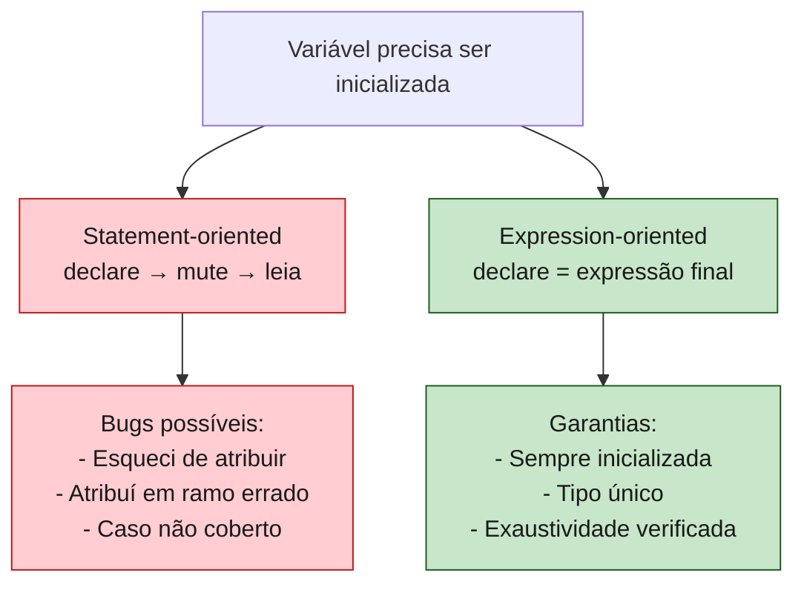

<a id="capitulo-6"></a>
# Capítulo 6: Funções e Controle de Fluxo

> *"Programs must be written for people to read, and only incidentally for machines to execute."*
> — Harold Abelson, *Structure and Interpretation of Computer Programs*

> *"Everything is an expression."*
> — Niklaus Wirth, sobre Algol-W (1966), o ancestral esquecido de Rust

> *"The expression problem is the fundamental tension at the heart of programming language design."*
> — Philip Wadler

## 6.1 Duas Famílias de Linguagens

Existe uma fronteira invisível que divide as linguagens de programação em duas tribos. De um lado, as linguagens **statement-oriented** — onde o código é uma sequência de comandos imperativos, e expressões são apenas pequenos átomos dentro deles. Do outro, as linguagens **expression-oriented** — onde quase tudo *retorna um valor*, e o programa inteiro é uma cascata de expressões aninhadas.

C, Go, Java e TypeScript moderno são, na alma, **statement-oriented**. Eles permitem expressões em alguns lugares (no lado direito de um `=`, dentro de um `if`), mas o esqueleto do programa é feito de comandos: faça isto, depois aquilo, depois aquilo outro.

Lisp, ML, Haskell, OCaml, Scala e — surpreendentemente para muitos — **Rust** são **expression-oriented**. Aqui, `if` retorna um valor. `match` retorna um valor. Um bloco `{ ... }` retorna um valor. A função inteira é, literalmente, uma única expressão que se desdobra.

Essa distinção parece acadêmica. Não é. Ela muda como você escreve loops, como você lida com erros, como você desenha funções. E, principalmente, ela muda **quantos bugs você comete**. Bugs clássicos de C — o `else` ambíguo, o `switch` sem `break`, o caso esquecido — são *gramaticalmente impossíveis* em Rust, não por virtude do programador, mas porque a linguagem não oferece o galho da árvore sintática onde esses bugs nascem.

Este capítulo é sobre essa diferença. Vamos ver como Rust escreve funções, condições e loops, e por que cada decisão de design fecha uma classe inteira de erros.

## 6.2 A Anatomia de uma Função

Comecemos com o trivial. Uma função em Rust:

```rust
fn dobrar(x: i32) -> i32 {
    x * 2
}
```

Quatro coisas chamam atenção:

1. **`fn`** — a palavra-chave, herdada de ML e Haskell, não de C.
2. **Tipos depois do nome** — `x: i32`, não `i32 x`. Sintaxe pós-fixada, igual a TypeScript, Go, Kotlin, Swift. Lê-se da esquerda para a direita: "x é um i32".
3. **`-> i32`** — a *seta de retorno*. Empréstimo direto de Haskell.
4. **`x * 2`** — sem `return`, sem ponto e vírgula. **A última expressão do bloco é o valor de retorno.**

Compare com as outras tribos:

```typescript
// TypeScript
function dobrar(x: number): number {
  return x * 2;
}
```

```go
// Go
func dobrar(x int) int {
    return x * 2
}
```

```c
// C
int dobrar(int x) {
    return x * 2;
}
```

```rust
// Rust
fn dobrar(x: i32) -> i32 {
    x * 2
}
```

A diferença mais visível é a ausência do `return`. Mas isso é só a ponta do iceberg. O que está por baixo é a regra fundamental:

> **Em Rust, todo bloco `{ ... }` é uma expressão. O valor do bloco é o valor da sua última expressão sem ponto e vírgula.**

O ponto e vírgula tem um significado específico: ele *descarta* o valor de uma expressão e a transforma em um *statement*. Sem ele, o valor flui para fora.

```rust
fn exemplo() -> i32 {
    let x = 5;
    let y = 10;
    x + y      // expressão final — retorna 15
}

fn quebrado() -> i32 {
    let x = 5;
    let y = 10;
    x + y;     // statement (com ;) — retorna () e dá erro de tipo
}
```

A segunda função não compila. O compilador dirá: *"expected i32, found ()"*. O `()` é o **unit type** — o "void" de Rust, mas mais honesto: é um tipo real, com um único valor. Quando você termina um bloco com `;`, está dizendo ao compilador "descarte este valor", e o bloco passa a retornar `()`.

## 6.3 Statement vs Expression: A Distinção Ressuscitada

A distinção entre **statement** e **expression** é antiga. Algol-60 a tinha. C herdou e a borrou. JavaScript, herdeira distante de C, herdou a confusão.

- **Expression**: avalia para um valor. `2 + 3`, `foo()`, `x > 0`.
- **Statement**: executa uma ação, mas *não produz valor*. `let x = 5;`, `if (x) { ... }`, `return y;`.

Em C e Go, `if` é statement. Não tem valor. Você não pode escrever `int z = if (cond) { 1 } else { 2 };`. Para isso, C inventou o operador ternário `? :` — um patch sintático para imitar uma expressão dentro de uma linguagem que não a tem nativamente:

```c
int z = cond ? 1 : 2;  // ternário, porque if não é expressão
```

Em Rust, `if` **é** expressão:

```rust
let z = if cond { 1 } else { 2 };  // sem ternário, sem mistério
```

Não há operador ternário em Rust. Não precisa. O `if` já faz o trabalho.

```typescript
// TypeScript: if é statement, mas há expressão ternária
const z = cond ? 1 : 2;

// e também (ES2020+) o nullish coalescing, optional chaining etc.
// O resultado: três sintaxes para exprimir condicionais.
```

```go
// Go: if é statement. Não há ternário. Você é forçado ao verboso:
var z int
if cond {
    z = 1
} else {
    z = 2
}
```

A consequência é cultural. Em Go, código condicional tende a ser **imperativo** (declare a variável, mute-a no `if`). Em Rust, código condicional tende a ser **declarativo** (o valor é o resultado da condição). O segundo é mais fácil de ler e mais fácil de testar, porque elimina mutação intermediária.

## 6.4 If como Expressão

A regra: ambos os ramos de um `if` que produz valor devem retornar o **mesmo tipo**.

```rust
let numero = if true { 5 } else { 6 };       // ok, ambos i32
let bug = if true { 5 } else { "seis" };    // erro: tipos divergem
```

Sem isso, Rust não conseguiria inferir o tipo da variável. Compare com JavaScript:

```javascript
const x = cond ? 5 : "seis";  // tipo: number | string. Bomba relógio.
```

Em TypeScript, isso seria `number | string`, e cada uso subsequente exige um type guard. Em Rust, o problema é eliminado na origem: ou os tipos batem, ou nada compila.

Um `if` sem `else` que retorna valor também é erro. Faz sentido: e se a condição for falsa? Que valor a expressão tem?

```rust
let x = if cond { 5 };  // erro: missing else clause
```

A única forma de um `if` sem `else` ser válido é como statement (descartando o valor):

```rust
if cond {
    println!("oi");
}  // ok, retorna (), valor descartado
```

### O bug clássico do C: dangling else

Em C, este código é uma armadilha histórica:

```c
if (cond1)
    if (cond2)
        printf("ambos");
    else
        printf("nem cond1 nem cond2?");  // a quem pertence o else?
```

A indentação sugere que o `else` pertence ao primeiro `if`. A linguagem decide que pertence ao segundo. Décadas de bugs vieram dessa ambiguidade.

Em Rust, a sintaxe **exige** chaves:

```rust
if cond1 {
    if cond2 {
        println!("ambos");
    } else {
        println!("cond1 mas não cond2");
    }
}
```

Não há ambiguidade gramatical. O `else` está dentro das chaves do segundo `if`. Visualmente óbvio, sintaticamente obrigatório.

## 6.5 O Bloco Como Expressão

Toda chave `{ ... }` em Rust é uma expressão. Isso tem consequências bonitas. Você pode usar um bloco para limitar o escopo de variáveis temporárias e ainda assim retornar um valor:

```rust
let resultado = {
    let a = caro_de_calcular();
    let b = outro_calculo_caro();
    a + b   // valor do bloco
};
// a e b já saíram de escopo aqui. Apenas resultado existe.
```

Isso é particularmente útil em `match`, onde cada braço é, frequentemente, um bloco com várias linhas e uma expressão final.

```rust
let descricao = match status {
    Status::Ativo => "ok",
    Status::Inativo => {
        log("usuário inativo detectado");
        registrar_metric();
        "inativo"
    }
};
```

O `match` é a estrela do show, e merece sua própria seção.

## 6.6 Match: O Switch Que Cresceu

`switch` em C é um dos pontos mais perigosos da linguagem. Três armadilhas históricas:

```c
switch (estado) {
    case ATIVO:
        fazer_algo();
        // esqueci o break! Cai no INATIVO.
    case INATIVO:
        fazer_outro();
        break;
    case PENDENTE:
        terceiro();
        break;
    // E se chegar SUSPENSO? Default não existe. Silêncio.
}
```

1. **Fall-through implícito**: esquecer um `break` é silencioso.
2. **Não-exaustividade**: o compilador não exige que você cubra todos os casos.
3. **Apenas inteiros e chars**: switch de C é estruturalmente pobre.

Go corrigiu (1) — em Go, o `case` não cai por padrão, é preciso `fallthrough` explícito. Mas Go não corrigiu (2): o compilador de Go não exige exaustividade em switch sobre tipos.

TypeScript tenta com `never`-checks manuais:

```typescript
type Status = "ativo" | "inativo" | "pendente";

function descrever(s: Status): string {
  switch (s) {
    case "ativo": return "ok";
    case "inativo": return "ko";
    // se eu esquecer "pendente", o TS pega — só se eu fizer o
    // exhaustiveness check com `never`. Manual. Frágil.
    default:
      const _: never = s;
      throw new Error(`unreachable: ${s}`);
  }
}
```

Em Rust, exaustividade é **lei**:

```rust
enum Status { Ativo, Inativo, Pendente }

fn descrever(s: Status) -> &'static str {
    match s {
        Status::Ativo => "ok",
        Status::Inativo => "ko",
        // Se eu esquecer Pendente, ERRO DE COMPILAÇÃO:
        // "non-exhaustive patterns: `Pendente` not covered"
    }
}
```

O compilador conta os braços do `match` contra todos os variantes do enum. Se faltar um, ele se recusa a compilar. Isso muda o jogo. Em refatorações, quando você adiciona um novo variante a um enum, o compilador aponta cada `match` da base de código que precisa ser atualizado. Em Go ou C, esses pontos viram bugs em produção.

`match` em Rust é também uma expressão (claro), e suporta:

- **Padrões literais**: `1`, `"hello"`.
- **Ranges**: `1..=5`.
- **Bindings**: `x @ 1..=5` (captura o valor).
- **Guards**: `x if x > 0`.
- **Destructuring**: `(a, b)`, `Point { x, y }`, `Some(v)`.
- **Wildcard**: `_`.

```rust
let mensagem = match codigo {
    0 => "sucesso",
    1..=99 => "info",
    100..=199 => "redirecionamento",
    n if n >= 500 => "erro do servidor",
    _ => "desconhecido",
};
```

Essa é a expressividade que fez `match` o coração estilístico de Rust.

## 6.7 Loops: Três Sabores

Rust oferece três construtos de loop. Cada um existe por uma razão.

### `loop` — o loop infinito

```rust
loop {
    println!("para sempre");
    if condicao_de_saida() { break; }
}
```

Equivalente ao `while (true)` ou `for (;;)` de C. A diferença é que **`loop` também é uma expressão** — você pode quebrar dele com um valor:

```rust
let resultado = loop {
    let tentativa = pegar_valor();
    if tentativa.is_ok() {
        break tentativa.unwrap();   // este valor sai do loop
    }
};
```

Isso é singular. Em nenhuma das outras linguagens (C, Go, TS) você pode "retornar" de um loop dessa forma. Você precisa de uma variável externa, um `break`, e uma leitura posterior. Rust elimina esse padrão de boilerplate.

### `while` — o condicional

```rust
let mut n = 10;
while n > 0 {
    println!("{n}");
    n -= 1;
}
```

Igual a TS, Go, C. Sem novidades. `while` **não é uma expressão de valor** — sempre retorna `()`. Por que? Porque um `while` pode terminar com a condição falsa (sem `break` com valor), e o compilador não saberia o que retornar nesse caso.

### `for` — sobre iteradores

```rust
for i in 0..5 {
    println!("{i}");   // 0, 1, 2, 3, 4
}

for nome in ["Alice", "Bob", "Carol"] {
    println!("oi, {nome}");
}
```

O `for` de Rust não é o `for` de C (`for (i = 0; i < n; i++)`). É o `for-of` de TypeScript, o `range` de Go, o `for ... in` de Python. **Itera sobre qualquer coisa que implemente `IntoIterator`.**

Comparativo:

```c
// C: for clássico, três expressões
for (int i = 0; i < 5; i++) {
    printf("%d\n", i);
}
// Bug típico: off-by-one. < vs <=.
// Bug típico: incrementar i++ duas vezes.
// Bug típico: alterar i dentro do loop e perder o controle.
```

```go
// Go: três sintaxes diferentes para o mesmo for
for i := 0; i < 5; i++ { ... }   // estilo C
for i < 5 { ... }                // estilo while
for i, v := range slice { ... }  // estilo for-each
```

```rust
// Rust: uma sintaxe, sobre iteradores
for i in 0..5 { ... }
for v in slice { ... }
for (i, v) in slice.iter().enumerate() { ... }
```

A vantagem é que iteradores em Rust são **lazy** e **zero-cost**: o compilador inlinea tudo. Você escreve declarativo e paga o custo de imperativo.

```rust
let soma: i32 = (1..=100)
    .filter(|n| n % 2 == 0)
    .map(|n| n * n)
    .sum();
```

Esse pipeline gera o mesmo assembly de um `for` em C, mas é menos sujeito a bugs e mais legível.

## 6.8 Break, Continue e Labeled Loops

`break` e `continue` funcionam como você espera. O detalhe é o **labeled loop**:

```rust
'externo: for i in 0..10 {
    for j in 0..10 {
        if i * j > 30 {
            break 'externo;   // sai dos DOIS loops
        }
    }
}
```

Em C, isso exigiria `goto` ou uma flag booleana. Em Go, a mesma sintaxe existe (`break ROTULO`). Em TypeScript, também (`break externo:`). Em Rust, labels começam com aspas simples, herança de OCaml e família ML.

O label também aceita `break com valor`:

```rust
let achado = 'busca: loop {
    for item in colecao() {
        if condicao(item) {
            break 'busca item;
        }
    }
    break 'busca default();
};
```

Esses recursos parecem pequenos, mas eliminam dezenas de linhas de gambiarra que escritores de C aprenderam a aceitar como normais.

## 6.9 Por Que Expression-Orientation Reduz Bugs

Uma observação empírica, refinada por décadas de experiência em comunidades de ML, OCaml, Haskell, Scala e agora Rust:

> **Quanto mais a linguagem é expression-oriented, menos variáveis mutáveis o programa precisa.**

E menos mutação significa menos espaço para bugs. Considere:

```typescript
// TypeScript imperativo (statement-oriented)
let mensagem: string;
if (status === "ativo") {
  mensagem = "ok";
} else if (status === "inativo") {
  mensagem = "ko";
} else {
  mensagem = "desconhecido";
}
// mensagem agora é... esperamos que seja string. O TS valida.
// Mas se eu adicionar um caso novo a status e esquecer o else?
// mensagem fica unassigned. Em runtime, vai dar undefined.
```

```rust
// Rust expression-oriented
let mensagem = match status {
    Status::Ativo => "ok",
    Status::Inativo => "ko",
    Status::Pendente => "pendente",   // exhaustivo. Compilador exige.
};
// mensagem é &str, sempre inicializada, sempre coberta.
```

Não há momento entre "declarei a variável" e "atribuí seu valor". Não há janela para o bug.



A diferença de paradigma se traduz em diferença de superfície de bugs.

## 6.10 Return Explícito: Quando Usar

Rust permite `return` explícito:

```rust
fn dobrar_se_positivo(x: i32) -> i32 {
    if x < 0 {
        return 0;       // early return
    }
    x * 2               // expressão final, sem return
}
```

A convenção idiomática:

- **Use `return` apenas para early return** (sair antes do final da função).
- **Não use `return` na última linha.** É ruído visual; a expressão final já é o retorno.

Compare:

```rust
// Não-idiomático
fn somar(a: i32, b: i32) -> i32 {
    return a + b;
}

// Idiomático
fn somar(a: i32, b: i32) -> i32 {
    a + b
}
```

Linters como `clippy` vão te lembrar disso.

## 6.11 O Ponto de Vista de Quem Vem de TS

Se você vem de TypeScript, o salto mental é este:

| TypeScript | Rust |
|---|---|
| `if` é statement; ternário para expressão | `if` é expressão; sem ternário |
| `switch` exige `break` manual | `match` sem fall-through |
| Exaustividade via `never` (manual) | Exaustividade nativa (compilador) |
| `for` em três sabores (`for`, `for...of`, `for...in`) | `for` único, sobre iteradores |
| `return` em quase toda função | `return` opcional, último valor flui |
| `void` é um tipo um tanto fictício | `()` é um valor real, primeira-classe |

Em outras palavras: Rust é o que TypeScript queria ser quando crescesse, se TypeScript não estivesse acorrentado à compatibilidade com JavaScript.

## 6.12 Fechamento

Funções e controle de fluxo, no fim, são gramática. Mas a gramática molda como você pensa. Uma linguagem onde quase tudo retorna valor te empurra para um estilo declarativo e composicional. Uma linguagem onde tudo é statement te empurra para mutação e for-loops imperativos.

Rust escolheu o primeiro caminho — não por moda funcional, mas porque o compilador é mais inteligente quando o programador é mais explícito. Cada `match` exaustivo é uma rede de segurança. Cada `if` como expressão é uma variável a menos para gerenciar. Cada `for` sobre iterador é um bug de off-by-one que não vai acontecer.

No próximo capítulo, vamos mergulhar no tipo mais traiçoeiro de toda linguagem moderna — aquele em que C falha catastroficamente, Go simplifica demais, TypeScript mente sutilmente, e Rust escolhe a verdade dolorosa: **strings**.

---

> *"Se a sintaxe de uma linguagem te força a pensar em termos seguros, você acaba escrevendo código seguro mesmo quando está cansado. É essa, afinal, a única segurança que importa."*

[Próximo: Capítulo 7 — Strings: O Pesadelo Necessário →](ch07-strings.md)
