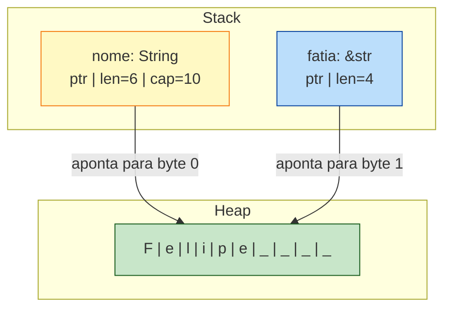
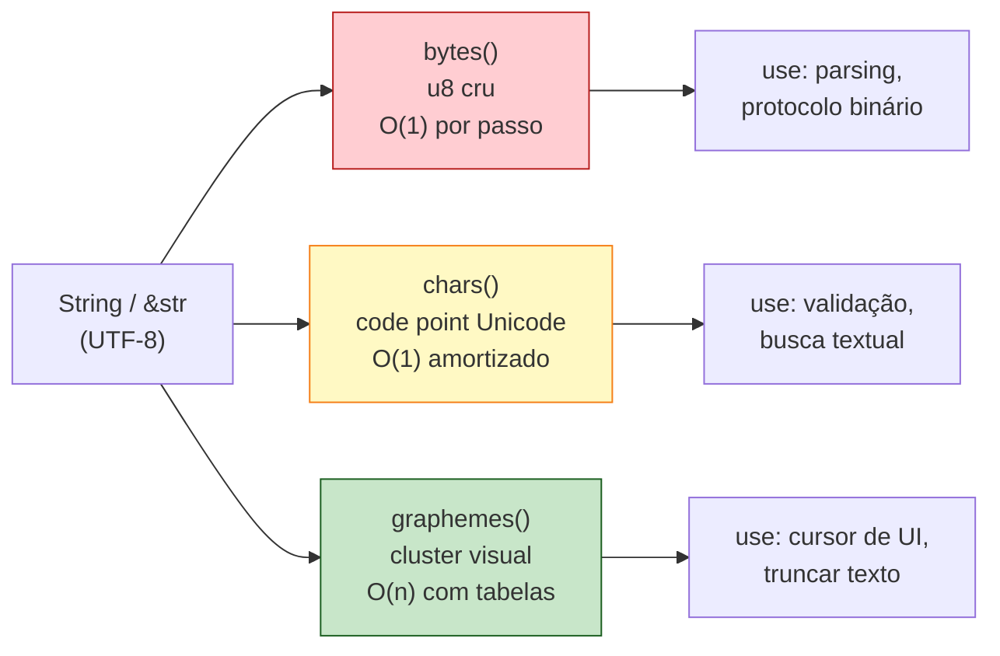

<a id="capitulo-7"></a>
# Capítulo 7: Strings — O Pesadelo Necessário

> *"There is no such thing as plain text."*
> — Joel Spolsky, *The Absolute Minimum Every Software Developer Absolutely, Positively Must Know About Unicode*

> *"The string type is the most-frequently-used type, the most error-prone type, and the most performance-sensitive type. Pick two."*
> — Aaron Turon, ex-líder do time de Rust

> *"Length of a string? It depends on whether you're asking the disk, the parser, the screen, or the user."*
> — Henri Sivonen, *It's Not Wrong That "🤦🏼‍♂️".length == 7*

## 7.1 A Mentira Mais Antiga do Software

Toda linguagem mente sobre strings. C mente dizendo que uma string é um `char*` que termina em `\0`. JavaScript mente dizendo que uma string é uma sequência de "caracteres". Go mente dizendo que uma string é uma sequência de bytes UTF-8 (quase verdade, mas apenas por convenção). Java mente dizendo que `length()` é o tamanho da string (na verdade, é o número de unidades UTF-16).

Rust toma a decisão filosófica oposta: **prefere a verdade dolorosa à mentira conveniente**. O resultado é que strings em Rust parecem absurdamente complicadas para quem chega de JavaScript. Há `String`, `&str`, `&String`, `CString`, `OsString`, `Path`, `PathBuf`. Há `chars()`, `bytes()`, e nem sequer um método `length()` consensual.

Essa complexidade não é gratuita. Cada um desses tipos resolve um problema real que outras linguagens fingem que não existe. O preço de ignorar Unicode é pago em produção, não em compile time. O preço de ignorar ownership é pago em segfaults, não em mensagens de erro. Rust te força a pagar antes — e você só percebe o quanto economizou anos depois, quando o sistema continua rodando enquanto o concorrente em C derrubou produção pela terceira vez no trimestre.

Este capítulo é o mais denso da fundação da linguagem. Respira. Reler vai ajudar.

## 7.2 Os Quatro Mundos de uma String

Antes de Rust, é preciso entender como as outras tribos lidam com string.

### C: o pesadelo arqueológico

```c
char* nome = "Felipe";
printf("%lu\n", strlen(nome));  // 6
```

Uma `string` em C é, literalmente, um ponteiro para o primeiro byte de uma sequência que termina em `\0` (null terminator). Consequências:

1. **Sem encoding definido.** Pode ser ASCII, ISO-8859-1, UTF-8, EBCDIC. C não sabe.
2. **Sem bound checking.** Acessar `nome[100]` compila, roda, e lê lixo da memória — ou dá segfault, ou — pior — vaza dados confidenciais. (Lembra do Heartbleed? Foi exatamente isso.)
3. **`strlen` é O(n).** Tem que escanear até achar o `\0`.
4. **Sem owned vs borrowed.** Você nunca sabe se deve fazer `free(nome)` ou não. Cada API tem sua própria convenção. Bugs de double-free e memory leak nascem dessa ambiguidade.

```c
char destino[10];
char origem[] = "esta string tem mais de dez caracteres";
strcpy(destino, origem);   // buffer overflow. Compila. Roda. Pwned.
```

`strcpy` é um exploit em forma de função padrão. Ela não verifica o tamanho do destino. Décadas de CVEs nasceram dessa única função.

### JavaScript / TypeScript: a mentira sedutora

```typescript
const nome = "Felipe";
console.log(nome.length);    // 6 — parece certo
console.log("🤦🏼‍♂️".length);   // 7 — perdão, COMO ASSIM?
```

JavaScript representa strings internamente como **UTF-16**. A `length` retorna o número de **code units UTF-16**, não de caracteres visuais nem de code points Unicode.

O emoji acima — facepalm com tom de pele claro e gênero masculino — é composto por:
- 1 caractere base (🤦)
- 1 modificador de tom de pele (🏼)
- 1 zero-width joiner (invisível)
- 1 símbolo masculino (♂)
- 1 variation selector (invisível)

Em UTF-16, alguns desses precisam de **surrogate pairs** (2 code units cada). Total: 7. Em UTF-8, seriam 17 bytes. Em code points Unicode, 5. Em grapheme clusters (o que o humano percebe como "uma coisa"), **1**.

JavaScript te dá o número que é mais fácil de calcular para o motor — não o número que faz sentido para o usuário. E nunca te avisa.

### Go: bytes honestos

```go
nome := "Felipe"
fmt.Println(len(nome))    // 6
fmt.Println(len("José"))  // 5 — porque é UTF-8: J(1) o(1) s(1) é(2)
```

Go é mais honesto: `string` em Go é um slice de bytes imutável. `len()` retorna o número de **bytes**, não de caracteres. Para iterar por code points:

```go
for i, r := range "José" {
    fmt.Printf("%d: %c\n", i, r)
}
// 0: J
// 1: o
// 2: s
// 3: é   (mas o próximo i seria 5, porque é tem 2 bytes)
```

Go se aproxima da verdade: ele te força a saber que strings são bytes e que indexar por byte pode estar no meio de um caractere. Mas ainda permite indexar com `s[0]` (que retorna um byte, não um rune), e essa armadilha vive na cultura Go até hoje.

### Rust: a verdade brutal

```rust
let nome = String::from("Felipe");
println!("{}", nome.len());     // 6 — bytes
// nome[0]  ← ERRO DE COMPILAÇÃO. Não existe Index<usize> para String.
```

Rust se recusa a deixar você indexar uma string com inteiro. Não é "depreciado". É **gramaticalmente impossível**. Por quê? Porque a operação é ambígua: você quer o byte, o code point, ou o grapheme? Cada um tem custo e semântica diferentes. Rust te obriga a ser explícito.

Vamos destrinchar.

## 7.3 String e &str: A Dualidade Fundamental

Os dois tipos centrais são `String` (com inicial maiúsculo) e `&str` (com `&` na frente).

```rust
let dono: String = String::from("Felipe");   // owned, growable, heap
let emprestado: &str = "Felipe";              // borrowed, fixed, qualquer lugar
```

A relação entre eles é a mesma que vimos em capítulos anteriores entre `Vec<T>` e `&[T]`. De fato, internamente:

- `String` ≈ `Vec<u8>` com a invariante de que os bytes são UTF-8 válido.
- `&str` ≈ `&[u8]` com a mesma invariante.



`String` é uma estrutura na stack que aponta para bytes na heap. Carrega capacidade extra para crescer sem realocar a cada `push`. Quando o `String` sai de escopo, a memória da heap é liberada (Drop).

`&str` é uma **slice**: um par `(ponteiro, tamanho)`. Não é dono de nada. Apenas observa uma sequência contígua de bytes UTF-8. Pode apontar para:

- Uma string literal (que vive no segmento de dados do binário, com lifetime `'static`).
- Uma fatia de uma `String`.
- Uma fatia de outra slice.

A pergunta que sempre aparece: **qual usar como parâmetro de função?**

```rust
// Versão A — aceita só String
fn cumprimentar(nome: String) {
    println!("oi, {nome}");
}

// Versão B — aceita &str (e String com &, via deref coercion)
fn cumprimentar(nome: &str) {
    println!("oi, {nome}");
}
```

A versão B é quase sempre a correta. Aceita literais (`"Felipe"`), referências de `String` (`&minha_string`), e fatias. A versão A consome o `String` (move ownership) e força o chamador a passar um valor owned, mesmo que ele só queira ler.

> **Regra prática**: aceite `&str` em parâmetros, retorne `String` quando precisar produzir uma string nova.

## 7.4 Por Que Rust Não Permite `s[0]`

Volte à epígrafe do Sivonen. A pergunta "qual o caractere na posição 0?" não tem resposta única.

```rust
let s = String::from("नमस्ते");   // "Olá" em Hindi/Devanagari
```

Quanto mede essa string?

- **Bytes**: 18 (cada caractere Devanagari ocupa 3 bytes em UTF-8).
- **`char`s** (code points Unicode): 6 — `न`, `म`, `स`, `्`, `त`, `े`. Note que `्` e `े` são *diacríticos*, modificadores que se ligam ao caractere anterior.
- **Grapheme clusters** (o que o humano vê): 4 — `न`, `म`, `स्`, `ते`.

Qual deles `s[0]` deveria retornar?

- Se for byte, custa O(1) mas retorna um número (208) que não significa nada para o usuário.
- Se for `char`, custa O(n) em pior caso (precisa decodificar) e ainda assim retorna um diacrítico isolado, sem sentido visual.
- Se for grapheme, custa O(n) com tabelas Unicode enormes e ainda depende da versão do Unicode instalada no sistema (Sivonen mostra que a mesma string vira 1 ou 3 grapheme clusters dependendo da versão da ICU library).

**Não há resposta certa.** Então Rust se recusa a dar uma resposta errada disfarçada de óbvia. A linguagem te obriga a escolher:

```rust
let s = String::from("Зд");

// Quero bytes? Iterador de bytes:
for b in s.bytes() {
    println!("{b}");
}
// 208, 151, 208, 180

// Quero code points? Iterador de chars:
for c in s.chars() {
    println!("{c}");
}
// З
// д

// Quero grapheme clusters? Crate externo:
// use unicode_segmentation::UnicodeSegmentation;
// for g in s.graphemes(true) { println!("{g}"); }
```

A decisão de não incluir grapheme iteration na biblioteca padrão é deliberada: ela depende de tabelas Unicode que mudam entre versões. Manter isso na std seria assumir um compromisso que nenhuma std consegue cumprir bem. Por isso vive em `unicode-segmentation`, uma crate mantida pela própria comunidade Rust.

## 7.5 Slicing: Cuidado com a Faca

Embora você não possa indexar com `s[0]`, **pode** fatiar com ranges:

```rust
let hello = "Здравствуйте";
let s = &hello[0..4];   // "Зд" — primeiros 4 bytes
```

Cada caractere cirílico ocupa 2 bytes. `0..4` pega exatamente dois caracteres. Mas:

```rust
let s = &hello[0..1];   // PANIC em runtime!
// thread panicked: byte index 1 is not a char boundary
```

Fatiar no meio de um caractere UTF-8 é um erro de runtime, não de compilação. O compilador não consegue saber, em geral, se o range está numa fronteira de caractere. Mas o runtime sim — e ele explode imediatamente. Melhor explodir cedo do que silenciar e produzir lixo.

A alternativa segura: `s.chars().take(n).collect::<String>()`. Mais verboso, mas correto.

## 7.6 Concatenação: Três Caminhos

Há três formas idiomáticas de concatenar strings em Rust, cada uma com sua semântica.

### `+` operator: rouba o primeiro

```rust
let a = String::from("Olá, ");
let b = String::from("mundo!");
let c = a + &b;
// a foi MOVIDO. Não pode mais ser usado.
// b ainda existe.
```

A definição de `+` em `String` é, simplificadamente:

```rust
fn add(self, other: &str) -> String { ... }
```

Note: `self` (consome), `&str` (empresta). O lado esquerdo é movido, o lado direito é emprestado. Esse é um dos primeiros choques que TypeScripters levam:

```typescript
// TS: + nunca consome, sempre cria novo
const c = a + b;   // a e b ainda intactos
```

```rust
// Rust: + consome o lado esquerdo
let c = a + &b;
// println!("{a}");  ← erro: borrow of moved value
```

A razão é performance: Rust reusa a alocação de `a` quando possível, ao invés de alocar uma terceira string. É o tipo de detalhe que parece irritante até você precisar dele para evitar 10000 alocações por segundo.

### `format!`: o macro elegante

```rust
let a = String::from("Olá");
let b = String::from("mundo");
let c = format!("{a}, {b}!");
// a e b intactos.
```

`format!` é o equivalente de template literals em TypeScript. Não consome ninguém. Aloca uma nova `String`. É a forma preferida quando legibilidade importa mais que performance — na maioria dos casos.

### `push_str` / `push`: a edição in-place

```rust
let mut s = String::from("Olá");
s.push_str(", mundo");   // adiciona &str ao final
s.push('!');             // adiciona um único char
```

Essa é a forma mais eficiente quando você está construindo uma string em vários passos. Sem realocação se a `capacity` da `String` já couber.

Comparativo final:

```rust
// Você quer: concatenar duas strings
let c = a + &b;            // consome a, mais rápido
let c = format!("{a}{b}");  // ambos intactos, mais lento
let mut c = a; c.push_str(&b);  // consome a, controle total
```

## 7.7 Iteração: Escolha Sua Granularidade

Resumo das três formas de percorrer uma string:

```rust
let s = "café";   // c, a, f, é (4 chars; 5 bytes em UTF-8)

// Bytes — sempre O(n) total, cada passo O(1)
for b in s.bytes() {
    println!("{b}");
}
// 99, 97, 102, 195, 169

// Chars (code points) — O(n) total, cada passo amortizado O(1)
for c in s.chars() {
    println!("{c}");
}
// c, a, f, é

// Graphemes — exige crate externo
use unicode_segmentation::UnicodeSegmentation;
for g in s.graphemes(true) {
    println!("{g}");
}
// c, a, f, é
```

Para a maioria das aplicações de negócio, `chars()` é o que você quer: trata texto como sequência de code points, suficiente para 99% dos casos europeus e asiáticos. Para emojis e scripts complexos (Hindi, Tâmil, Khmer), use `graphemes`.



## 7.8 Os Outros Tipos: CString, OsString, Path

Rust tem mais quatro tipos de string. Cada um existe por uma razão sistêmica.

### `CString` e `&CStr`

Para interoperar com C. C strings terminam em `\0`. Rust strings podem conter `\0` no meio (são bytes UTF-8 arbitrários). Antes de passar uma string para uma API C, você converte:

```rust
use std::ffi::CString;
let c = CString::new("hello").unwrap();
// c agora tem hello\0, garantido sem null no meio.
```

Se a string Rust tiver `\0` interno, `CString::new` retorna `Err`. Você é forçado a tratar.

### `OsString` e `&OsStr`

Para nomes de arquivos e variáveis de ambiente. Aqui mora um detalhe que poucos sabem:

- Em **Linux**, nomes de arquivo são bytes arbitrários (não necessariamente UTF-8).
- Em **Windows**, nomes de arquivo são UTF-16 *mal-formada* (pode ter surrogates desemparelhados).

Nenhum dos dois cabe num `String` Rust (que exige UTF-8 estrito). Daí `OsString`: um tipo opaco que respeita o sistema operacional.

```rust
use std::ffi::OsString;
let s: OsString = std::env::var_os("PATH").unwrap();
```

Você só converte para `String` quando souber que o conteúdo é válido UTF-8.

### `Path` e `PathBuf`

Wrappers tipados em torno de `OsStr` e `OsString`, especializados para caminhos de arquivo. Têm métodos como `parent()`, `file_name()`, `extension()`, `join()`. Use sempre que estiver trabalhando com filesystem — não use `String`.

```rust
use std::path::PathBuf;
let mut p = PathBuf::from("/home/felipe");
p.push("rust-book");
p.push("ch07.md");
// p é "/home/felipe/rust-book/ch07.md"
```

Compare com a alternativa de string concat:

```rust
// Errado, frágil, multiplataforma quebrado
let s = "/home/felipe".to_string() + "/" + "rust-book" + "/" + "ch07.md";
// E no Windows? Backslash? Ah não, vai dar problema.
```

`PathBuf` cuida do separador correto, lida com paths absolutos vs relativos, faz tudo o que `path/filepath` em Go faz, mas com type safety mais forte.

## 7.9 O Bug Clássico: strcpy vs Rust

Para fechar, o exemplo prometido na introdução. O bug que matou Heartbleed e centenas de CVEs:

```c
// C — bomba relógio
void copiar_nome(char *destino, const char *origem) {
    strcpy(destino, origem);
}

int main() {
    char buffer[10];
    char input[] = "esta string tem muito mais que dez caracteres";
    copiar_nome(buffer, input);   // buffer overflow
    // Memória adjacente sobrescrita.
    // Stack canary destruído.
    // Possível RCE.
}
```

Esse código compila sem warning e roda. O destrutor da memória adjacente é silencioso até o momento em que algo importante é sobrescrito.

A "versão segura" de C é `strncpy`, mas ela tem outros bugs (não termina com `\0` se origem for maior que destino). A "versão moderna" é `strlcpy` (BSD) ou `strncpy_s` (C11), mas nenhuma é universalmente disponível.

Em Rust, o equivalente é literalmente impossível de escrever errado:

```rust
fn copiar_nome(origem: &str) -> String {
    origem.to_string()   // aloca exatamente o tamanho necessário
}

fn main() {
    let input = "esta string tem muito mais que dez caracteres";
    let dest = copiar_nome(input);
    // dest tem exatamente o tamanho de input. Sem overflow possível.
}
```

`String` cresce dinamicamente. Não há buffer fixo para estourar. A única forma de ter um buffer fixo seria usar um `[u8; 10]` — e tentar copiar mais bytes do que cabe seria um panic, não um buffer overflow silencioso.

Esse é o ganho concreto. A complexidade de `String` vs `&str` vs `OsString` parece excessiva quando você está aprendendo. Mas cada vez que você foi obrigado a parar e pensar "qual tipo eu uso aqui?", você fechou uma porta de bug.

## 7.10 O Cardápio Completo

| Tipo | Owned? | Growable? | Encoding | Quando usar |
|---|---|---|---|---|
| `&str` | Não | Não | UTF-8 | Parâmetro de função, fatia de outra string |
| `String` | Sim | Sim | UTF-8 | Construção dinâmica, retorno de função |
| `&CStr` | Não | Não | bytes terminados em `\0` | FFI com C, leitura |
| `CString` | Sim | Não | bytes terminados em `\0` | FFI com C, escrita |
| `&OsStr` | Não | Não | OS-specific | Leitura de path/env |
| `OsString` | Sim | Sim | OS-specific | Manipulação de path/env |
| `&Path` | Não | Não | OS-specific (path) | Leitura de filesystem |
| `PathBuf` | Sim | Sim | OS-specific (path) | Construção de filesystem |

Para o dia-a-dia de aplicação web ou backend: `String` e `&str` cobrem 95% dos casos. Os outros aparecem quando você toca filesystem, processo, FFI ou rede de baixo nível.

## 7.11 Fechamento

Strings em Rust são complicadas. Strings em C são simples e perigosas. Strings em JavaScript são simples e mentirosas. Strings em Go são simples e ambíguas. Strings em Rust são complicadas e *honestas*.

A complexidade não está em Rust. A complexidade está em **texto humano**. Texto é o protocolo mais antigo da humanidade; tem 5000 anos de cruft acumulado: alfabetos, ideogramas, abjads, abugidas, scripts da direita para esquerda, scripts verticais, ligaduras, diacríticos, emojis, surrogate pairs, normalização NFC/NFD/NFKC/NFKD. Linguagens que prometem strings simples estão te enganando — ou sobre o que você está fazendo, ou sobre quanto isso vai custar.

Rust escolhe o caminho oposto. Te mostra a complexidade. Te força a tomar decisões. E em troca, quando seu código compila, ele lida com texto japonês, hindi, árabe, e emojis com a mesma robustez que com ASCII. Esse contrato — "se compila, funciona com qualquer texto" — é raro e valioso.

No próximo capítulo, vamos sair do território das primitivas e entrar nas estruturas de dados que dão forma a programas inteiros: **structs e enums**, e por que a combinação dos dois é o segredo da expressividade de Rust.

---

> *"As linguagens que escondem a complexidade do texto são as que mais te traem em produção. As que a expõem te ensinam a respeitar 5000 anos de história escrita."*

[Próximo: Capítulo 8 — Structs e Enums →](ch08-structs-e-enums.md)
