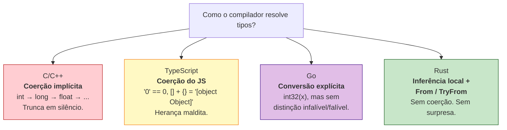
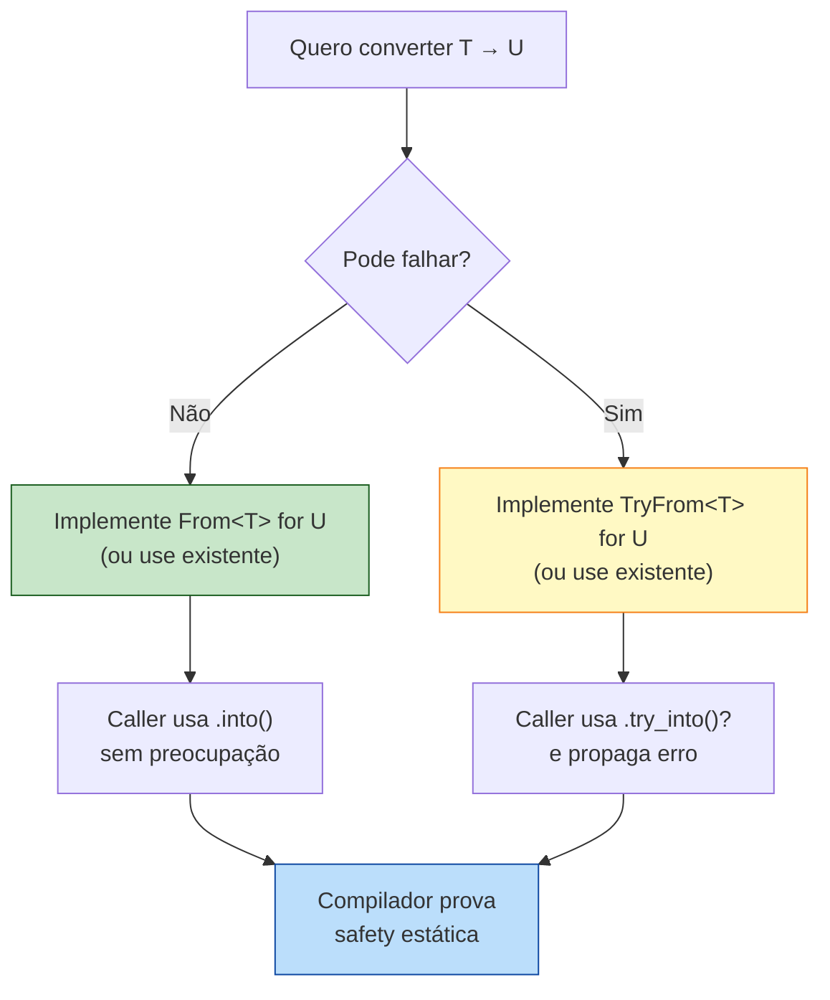

<a id="capitulo-8"></a>
# Capítulo 8: Inferência, Coerção e Conversão

> *"Make illegal states unrepresentable."*
> — Yaron Minsky

> *"A linguagem deve adivinhar o que você quis dizer apenas quando há uma única resposta certa. Em todos os outros casos, deve perguntar."*
> — Niko Matsakis, sobre o design de inferência em Rust

## 8.1 O Problema das Três Promessas

Toda linguagem com tipos faz três promessas ao programador, e a forma como ela equilibra essas promessas define seu caráter.

A primeira é **economia**: você não deveria precisar escrever `int x: int = 5: int`. O compilador é uma máquina; deixe que ele descubra o óbvio.

A segunda é **previsibilidade**: quando o compilador adivinha, ele deve adivinhar como você esperava. Surpresa em sistema de tipos é bug em produção.

A terceira é **honestidade**: quando uma conversão pode falhar — porque você está espremendo um `i64` num `i32` e não cabe — a linguagem deve dizer isso. Não silenciar. Não truncar. Não fingir.

C, TypeScript e Go fizeram escolhas diferentes nesse triângulo, e cada uma das escolhas gerou uma classe inteira de bugs históricos. Rust, fiel à sua tese de "prove no compilador o que você teria provado de cabeça", escolheu o vértice mais incômodo: economia *limitada*, previsibilidade *absoluta*, honestidade *forçada*.



Este capítulo é sobre essa quarta caixa.

## 8.2 Inferência: Hindley-Milner Domesticado

Em 1969, J. Roger Hindley provou que era possível, dado um trecho de código sem nenhuma anotação de tipo, deduzir o tipo de cada expressão automaticamente — desde que a linguagem fosse pura o suficiente. Em 1978, Robin Milner publicou o algoritmo. ML, Haskell, OCaml e F# foram construídos sobre ele.

A promessa de Hindley-Milner é sedutora:

```ocaml
(* OCaml *)
let dobra x = x + x
(* O compilador deduz: int -> int. Sem anotação. *)
```

Funciona porque ML não tem subtyping, não tem overloading ad-hoc, não tem `null`. Tudo é total, tudo é puro, e o algoritmo HM consegue resolver o sistema de equações de tipo globalmente.

Rust quis essa magia. Mas Rust também queria *traits* (overloading ad-hoc), referências com lifetimes, métodos com receiver, e integração com C. Hindley-Milner global, nesse contexto, tornou-se irresoluto: o compilador adivinharia, e adivinharia errado, e a mensagem de erro seria ilegível.

A escolha de design foi pragmática e deliberada:

> **Inferência em Rust é local.** O compilador deduz dentro de uma função. Cruzando a fronteira de uma função — assinatura, struct, trait — você escreve os tipos.

```rust
fn dobra(x: i32) -> i32 {  // assinatura: explícita, obrigatória
    let y = x + x;          // corpo: y é inferido como i32
    let dobro = y;          // dobro também: i32
    dobro
}
```

Compare com TypeScript, onde a inferência é "local *com vazamentos*":

```typescript
// TS: assinatura pode ser inferida do retorno
function dobra(x: number) {
    return x + x; // tipo de retorno inferido como number
}
// Mas isso vaza para callers: refatorar muda contratos sem aviso.
```

E com Go, onde só locais são inferidos via `:=`:

```go
// Go: igual a Rust em escopo, mas sem traits, mais simples
func dobra(x int32) int32 {
    y := x + x   // y é int32, inferido
    return y
}
```

A regra rusty: **se outra parte do código depende daquele tipo, declare**. Inferência é uma conveniência interna, não uma economia de contrato.

### O caso específico de `let`

Dentro de uma função, `let x = 5` é ambíguo: `5` pode ser `i8`, `i16`, `i32`, `i64`, `u8`, `u16`, `u32`, `u64`, `usize`, `isize`. O compilador escolhe `i32` por *default* — é o "número inteiro razoável" da linguagem.

```rust
let x = 5;          // i32 (default)
let y = 5_u8;       // u8 (sufixo literal)
let z: u64 = 5;     // u64 (anotação)
let w = 5.0;        // f64 (default para floats)
```

Mas o compilador é mais inteligente que um *default*: se houver pista posterior, ele a usa.

```rust
let mut nums = Vec::new();   // tipo? ainda indefinido
nums.push(42_u8);            // ah, u8. Vec é Vec<u8>.
```

Esse mecanismo se chama *bidirectional type checking*, e é o que permite código rusty parecer enxuto sem cair no mistério.

## 8.3 Por Que Não Há Coerção Implícita

Em C, este código compila e roda:

```c
// C
int main(void) {
    int x = 1000000;
    char c = x;        // silêncio. trunca. c = 0x40 = '@'.
    long big = x;      // promove. ok.
    float f = x;       // converte. perde precisão silenciosamente.
    if (-1 < 1U) { }   // -1 vira 4294967295U. condição é FALSA.
    return 0;
}
```

Cada uma dessas linhas é um bug clássico. Truncamento de inteiros causou o **Ariane 5** (1996), uma explosão de US$ 370 milhões: um `double` foi convertido para `int16` e estourou. A comparação `-1 < 1U` virando falsa é a fonte de metade dos buffer overflows da história — porque `strlen() - 1 < buffer_size_unsigned` engana o programador.

C herdou essas regras dos PDP-11 e nunca as removeu. C++ herdou de C. Java suavizou, mas manteve promoções automáticas. JavaScript foi pior:

```javascript
// JavaScript / TypeScript em modo permissivo
"5" + 1       // "51"
"5" - 1       // 4
[] + []       // ""
[] + {}       // "[object Object]"
{} + []       // 0  (em alguns contextos)
true + true   // 2
0 == "0"      // true
0 == []       // true
"0" == []     // false  (quebra transitividade!)
```

TypeScript, em modo strict, mata uma fração disso, mas a runtime continua sendo JavaScript. O `==` não-tripla-igual ainda existe. A coerção de `+` ainda existe. ESLint patcha; a linguagem não.

Go melhorou: **toda conversão entre tipos numéricos é explícita**.

```go
// Go
var x int32 = 1000000
var c int8 = int8(x)  // trunca, mas é EXPLÍCITO
// var y int64 = x    // ❌ erro: cannot use x (int32) as int64
var y int64 = int64(x) // ok
```

Isso é um avanço sobre C. Mas Go ainda permite truncamento silencioso *quando você pede explicitamente*: `int8(1000000)` compila, roda, e devolve `64`. O programador escreveu `int8(...)`, então Go assume que ele sabe o que faz.

Rust não assume.

```rust
// Rust
let x: i32 = 1_000_000;
let c: i8 = x;       // ❌ erro: expected i8, found i32
let c: i8 = x as i8; // compila. trunca. mas você ESCREVEU `as`.
let big: i64 = x;    // ❌ mesmo widening exige conversão explícita
let big: i64 = x.into(); // ok: i32 → i64 é infalível
```

Há três níveis de honestidade aqui:

1. **Sem `as`, sem `into()`, sem `try_into()`**: o código não compila. O compilador recusa a adivinhar.
2. **`as`**: você está dizendo "eu sei que isso pode truncar, faça assim mesmo". É a saída de emergência. Use com medo.
3. **`From`/`Into`**: conversões garantidamente sem perda. `i32 → i64`, `u8 → u32`, `&str → String`. Não falham. Não truncam. O compilador prova isso.
4. **`TryFrom`/`TryInto`**: conversões que podem falhar. `i64 → i32`, `String → IpAddr`, `u32 → char`. Retornam `Result`. Você é forçado a tratar o erro.

### A tabela mental

| Conversão | Mecanismo | Falha? | Perda? |
|---|---|---|---|
| `i32 → i64` | `From`/`.into()` | Não | Não |
| `u8 → u16` | `From`/`.into()` | Não | Não |
| `&str → String` | `From`/`.into()` | Não | Não (aloca) |
| `i64 → i32` | `TryFrom`/`.try_into()` | Sim | Possível |
| `String → i32` | `parse::<i32>()` | Sim | Possível |
| `i32 → i8` | `as` (truncamento) ou `TryFrom` | `as` cala, `TryFrom` avisa | Possível |
| `f64 → f32` | `as` (truncamento) | Cala | Possível |
| `i32 → u32` | `as` (reinterpreta bits) | Cala | Bits viram outro número |

A regra de bolso: **prefira `From`/`Into`. Quando não couber, use `TryFrom`/`TryInto`. `as` é o último recurso, e só para casos onde truncar é *o que você quer* — bit manipulation, FFI, ou perda intencional.**

## 8.4 `From` e `Into`: O Pacto Infalível

`From` é um trait. A definição é desarmadoramente simples:

```rust
pub trait From<T>: Sized {
    fn from(value: T) -> Self;
}
```

Não retorna `Result`. Não pode falhar. Implementar `From<T> for U` é fazer um juramento: *toda* instância de `T` produz uma instância válida de `U`, sem panic, sem perda.

```rust
// std::convert
impl From<i32> for i64 {
    fn from(n: i32) -> Self { n as i64 }  // widening: sempre cabe
}

impl From<&str> for String {
    fn from(s: &str) -> Self { s.to_owned() }
}
```

`Into` é o reflexo. Você quase nunca implementa `Into` manualmente; o compilador deriva `Into<U> for T` automaticamente quando existe `From<T> for U`. Isso quer dizer que você ganha duas APIs por uma:

```rust
let s: String = String::from("hello");  // estilo From
let s: String = "hello".into();         // estilo Into
let n: i64 = i64::from(42_i32);
let n: i64 = 42_i32.into();
```

O ergonomic-trick é que assinaturas que aceitam `Into<String>` ficam abertas a qualquer coisa que vire String:

```rust
fn cumprimenta(nome: impl Into<String>) {
    let nome: String = nome.into();
    println!("Olá, {nome}");
}

cumprimenta("Felipe");                  // &str
cumprimenta(String::from("Felipe"));    // String
cumprimenta(format!("Felipe {}", 1));   // String formatada
```

Em TypeScript você faria isso com union types: `string | StringBuilder | { toString(): string }`. Em Go, com interfaces ad-hoc. Em Rust, é polimorfismo zero-cost: cada chamada se monomorfiza para o tipo concreto.

## 8.5 `TryFrom` e `TryInto`: A Honestidade do `Result`

```rust
pub trait TryFrom<T>: Sized {
    type Error;
    fn try_from(value: T) -> Result<Self, Self::Error>;
}
```

Aqui mora a diferença filosófica. Quando uma conversão *pode* falhar, Rust se recusa a deixar você esquecer disso. O retorno é `Result<Self, Self::Error>`. Você não pode fingir que recebeu o valor sem desempacotar o erro.

```rust
use std::convert::TryFrom;

let grande: i64 = 1_000_000_000_000;
let pequeno: i32 = match i32::try_from(grande) {
    Ok(n) => n,
    Err(_) => {
        eprintln!("estourou; usando MAX");
        i32::MAX
    }
};
```

Compare com Go, que tem conversão explícita mas sem o degrau "infalível vs. falível":

```go
// Go
var grande int64 = 1_000_000_000_000
var pequeno int32 = int32(grande) // trunca em silêncio. compila feliz.
// Você precisa lembrar de checar:
if grande > math.MaxInt32 || grande < math.MinInt32 {
    return errors.New("overflow")
}
pequeno = int32(grande)
```

Em Go, **lembrar é responsabilidade sua**. Se você esquecer o `if`, o programa segue com `pequeno` corrompido. Em Rust, o tipo `Result` é uma intimação: você abre, ou propaga com `?`, ou explicitamente declara `unwrap()` (e aceita o panic).

### O caso do literal que não cabe

```rust
let x: u8 = 256;
//          ^^^ erro: literal out of range for `u8`
//          help: the literal `256` does not fit into u8
//                whose range is `0..=255`
```

Não em runtime. Em **compile-time**. Antes do binário existir.

C cala. JavaScript aceita e converte para alguma coisa estranha. Go cala se você escreveu `uint8(256)`. Rust se recusa a gerar o programa.

Esse é, em miniatura, o ethos da linguagem: bugs detectáveis em compile-time são proibidos de existir em runtime.

## 8.6 `as`: A Saída de Emergência

`as` é o operador de cast bruto. Ele faz o que você manda — inclusive coisas perigosas. A doc oficial é honesta:

> "The `as` keyword performs a primitive cast, which can be lossy."

```rust
let x: i32 = 300;
let c: u8 = x as u8;   // c = 44 (300 % 256). Silêncio absoluto.

let f: f64 = 1.7e308;
let g: f32 = f as f32; // g = inf. Silêncio absoluto.

let n: i32 = -1;
let u: u32 = n as u32; // u = 4_294_967_295. Reinterpreta bits.
```

Por que existe? Porque há domínios onde truncamento *é a operação*. Codecs, hash, criptografia, FFI com C, drivers. Você está na fronteira do hardware e quer dizer ao compilador "saia da frente".

A regra cultural na comunidade Rust é cirúrgica:

- Use `as` quando você está fazendo bit manipulation deliberada.
- Use `as` quando o tipo de saída é matematicamente garantido caber e o overhead de `TryFrom` é injustificável.
- **Em qualquer outro caso, use `From`/`Into` ou `TryFrom`/`TryInto`.**
- Crates como `clippy::cast_possible_truncation` flagam `as` perigoso e te empurram para `TryFrom`.

Há, inclusive, um lint clippy literalmente chamado `cast_lossless` que detecta `as` desnecessário e sugere `.into()`.

## 8.7 Comparação Lado a Lado

```c
// C — coerção universal, drama silencioso
int main() {
    long big = 1000000000000L;
    int small = big;        // trunca. compila. UB para alguns valores.
    unsigned u = -1;        // u = UINT_MAX. legal por padrão.
    char c = 256;           // c = 0. Silêncio.
    float f = big;          // perde precisão. Silêncio.
}
```

```typescript
// TypeScript — strict ajuda, runtime trai
const x: number = 1000000000000;
const small: number = x; // number é 64-bit float; perde precisão >2^53
const s: string = "5";
const r = s + 1;         // "51". número virou string.
const t = +s + 1;        // 6. unary + força coerção. legal.

// "Conversão" para tipos menores não existe — number é só number.
// Para inteiros pequenos: bitwise ops truncam (x | 0 → int32).
```

```go
// Go — explícito, sem nuance
var big int64 = 1000000000000
var small int32 = int32(big) // trunca. compila. roda.
// quer segurança? você implementa:
func toInt32(n int64) (int32, error) {
    if n > math.MaxInt32 || n < math.MinInt32 {
        return 0, errors.New("overflow")
    }
    return int32(n), nil
}
```

```rust
// Rust — três degraus de comprometimento
let big: i64 = 1_000_000_000_000;

// 1. Compile-time refuse
// let small: i32 = big;
// ❌ expected i32, found i64

// 2. as: você assume risco
let small_unsafe: i32 = big as i32;  // trunca

// 3. TryInto: você lida com erro
let small: i32 = big.try_into().unwrap_or(i32::MAX);

// 4. From: o caminho infalível, quando aplicável
let bigger: i128 = big.into();       // sempre cabe, sempre ok
```

A diferença não é de sintaxe. É de **postura epistemológica**. C/Go assumem que o programador sabe; Rust assume que o programador erra, e exige prova.

## 8.8 Composição com Genéricos

`From`/`Into`/`TryFrom`/`TryInto` formam uma das fundações dos genéricos em Rust. Você verá assinaturas como esta:

```rust
fn parse_id<T>(s: &str) -> Result<T, T::Error>
where
    T: TryFrom<u64>,
    T::Error: std::error::Error,
{
    let n: u64 = s.parse()?;
    T::try_from(n).map_err(Into::into)
}
```

A função aceita qualquer tipo de saída que tenha uma conversão falível de `u64` — `u32`, `i32`, custom IDs, qualquer coisa. O compilador monomorfiza para cada uso. Zero-cost.

Em TS você teria que passar parser functions ou usar generics com constraints estruturais. Em Go, antes de generics 1.18, era impossível; depois, é verboso. Em Rust, o sistema de traits torna isso natural.

## 8.9 O Princípio Generalizado

A lição transcende numbers. Toda conversão em Rust segue o mesmo padrão:



Esse padrão se repete em:

- `String::from_utf8(bytes)` → `Result<String, FromUtf8Error>`. UTF-8 inválido é erro.
- `IpAddr::try_from("not-ip")` → `Result<IpAddr, _>`. String inválida é erro.
- `Path::new(s).canonicalize()` → `Result<PathBuf, io::Error>`. Filesystem pode falhar.
- `Box<dyn Error>::from(my_error)` → upcast infalível para trait object.

A linguagem inteira é construída no degrau que você está aprendendo agora.

## 8.10 Erros Comuns Vindos de TS

Programadores chegando de TypeScript repetem três pecados:

**1. Tentar coagir com `+` ou template strings.**

```rust
let n = 5;
let s = "x" + n;        // ❌ no implementation of `Add<i32>` for `&str`
let s = format!("x{n}"); // ✅
let s = ["x", &n.to_string()].concat(); // ✅
```

Rust não tem `+` polimórfico para concatenar tipos diferentes. `String + &str` funciona porque há um `Add` implementado, mas é assimétrico e raramente o que você quer. Use `format!` ou `to_string()`.

**2. `as` por hábito.**

```rust
let len = vec.len();      // usize
let i: i32 = len as i32;  // perigoso se vec for grande
```

Em servidor real, `usize` é 64-bit. Vetores em produção podem passar de 2 bilhões de elementos (cache de IDs, por exemplo). `as` trunca. Use `len.try_into()` quando o tamanho não é trivialmente limitado.

**3. Esquecer `?` em `try_into`.**

```rust
fn pega_porta(s: &str) -> Result<u16, Box<dyn std::error::Error>> {
    let n: i32 = s.parse()?;
    let porta: u16 = n.try_into()?;  // sem `?`, é Result<u16, _> sobrando
    Ok(porta)
}
```

`?` propaga `Err`. Sem ele, você fica com um `Result` que precisa explicitamente desempacotar.

## 8.11 O Custo da Honestidade

Há um custo. Código rusty parece, em primeira vista, *barulhento*:

```typescript
// TS
const id = parseInt(req.query.id, 10);
const user = users[id];
```

```rust
// Rust
let id: u32 = req.query.get("id")
    .ok_or("missing id")?
    .parse()
    .map_err(|_| "invalid id")?;
let user = users.get(id as usize)
    .ok_or("user not found")?;
```

Mais linhas. Mais explícito. Mais chances de o desenvolvedor pensar "isso é cerimônia".

Mas cada uma daquelas linhas representa um bug que TS apenas adiou para runtime. `id` ausente: TS dá `NaN`, depois `users[NaN]` é `undefined`, depois `undefined.name` é o famoso "Cannot read property 'name' of undefined" às 3 da manhã. Em Rust, o `?` te força a decidir: 400 Bad Request? Default? Log e ignore? *Algo*.

A "cerimônia" é o preço de não ter a paginação chamando o suporte às 3 da manhã.

> "Inferência poupa caracteres. Conversão explícita poupa carreiras."
> — adágio anônimo da comunidade Rust

## 8.12 Resumo

- **Inferência em Rust é local**. Assinaturas (funções, structs, traits) são sempre explícitas. Inferência é uma economia interna, nunca um contrato.
- **Não há coerção implícita**. `i32 → i64` exige `.into()` ou `as`. `&str → String` exige `.to_owned()` ou `.into()`. Sem surpresa.
- **`From`/`Into`** são para conversões *infalíveis* — provadamente sem perda. Usadas em APIs ergonômicas com `impl Into<T>`.
- **`TryFrom`/`TryInto`** são para conversões *falíveis* — retornam `Result`, forçando o programador a tratar o erro.
- **`as`** é a saída de emergência: cast bruto, possivelmente truncante, sem aviso. Usar com clippy ligado.
- O compilador rejeita literais que não cabem (`u8 = 256` falha em compile-time), uma classe inteira de bugs de C/JS desaparece por construção.
- Comparado a TS (coerção runtime), Go (conversão explícita mas sem distinção de fal/infalível), e C (caos por padrão), Rust se posiciona no extremo da honestidade tipada.

A próxima peça do quebra-cabeça é entender como Rust deixa você operar sobre dados sem possuí-los, sem copiá-los, sem riscos. É o conceito de *slice* — uma forma de olhar para dados sem assumir responsabilidade por eles.

---

> *"A linguagem não pode te impedir de cometer todo erro. Mas cada erro que ela impede é um sprint que você não vai gastar caçando."*

[Próximo: Capítulo 9 — Slices: A Visão Sem Posse →](ch09-slices.md)
