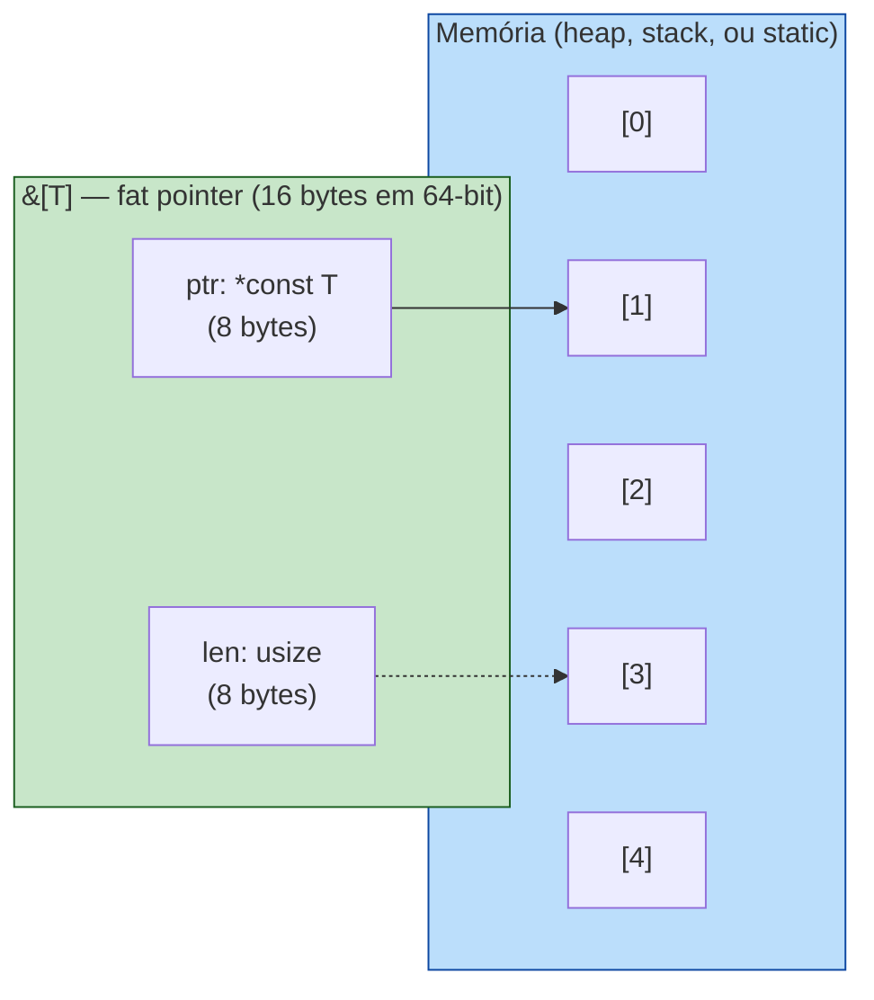

<a id="capitulo-9"></a>
# Capítulo 9: Slices — A Visão Sem Posse

> *"A pointer to a buffer with no length is a loaded gun pointed at the future."*
> — Robert Seacord, autor de *Secure Coding in C and C++*

> *"Slices são o que C deveria ter inventado em 1972, e não inventou; e por isso temos Heartbleed."*
> — comentário de Aleksey Kladov (matklad), no fórum interno do Rust

## 9.1 O Pecado Original do Ponteiro Cru

Em 7 de abril de 2014, três engenheiros — Neel Mehta do Google, Riku, Antti e Matti da Codenomicon — divulgaram simultaneamente uma vulnerabilidade no OpenSSL que ficaria conhecida como **Heartbleed**. Era um bug em quatro linhas de C. Permitia que qualquer atacante na internet lesse 64 KB de memória arbitrária de qualquer servidor que usasse OpenSSL — chaves privadas, sessões de usuários, senhas em claro. Estima-se que dois terços dos servidores web do planeta estavam vulneráveis. O custo de remediação foi calculado, conservadoramente, em **bilhões de dólares**.

A causa raiz cabe num parágrafo: a função `dtls1_process_heartbeat` recebia um buffer de bytes do cliente e um *campo de tamanho* dentro do próprio pacote. O código alocava uma resposta usando o tamanho declarado pelo cliente, copiava bytes da memória do servidor, e devolvia. Não havia verificação de que o tamanho declarado *batia* com o tamanho real do payload recebido.

```c
// Heartbleed, simplificado
unsigned char *p = &s->s3->rrec.data[0];
unsigned short payload;
n2s(p, payload);              // lê tamanho declarado pelo cliente
unsigned char *pl = p;
// ...
unsigned char *bp = OPENSSL_malloc(1 + 2 + payload + 16);
memcpy(bp, pl, payload);      // copia payload bytes — mas pl é só
                              // um ponteiro. Não tem comprimento.
                              // Se payload > tamanho real, copia
                              // memória adjacente. Heartbleed.
```

O problema não foi falta de habilidade. Os mantenedores do OpenSSL são especialistas em criptografia. O problema foi que **C não tem como expressar "este ponteiro aponta para N bytes válidos"**. `unsigned char *p` é um endereço. Acabou. O comprimento mora num inteiro separado, em outra variável, em outra estrutura, e manter os dois em sincronia é responsabilidade do humano. Por trinta anos, humanos têm falhado nessa tarefa.

A pergunta de design: *e se o tipo do ponteiro carregasse o comprimento dentro de si?* Essa é a definição de **slice** em Rust.

## 9.2 O Que é um Slice

Um slice em Rust é um *fat pointer*: dois `usize` justapostos em memória. O primeiro aponta para o início dos dados; o segundo é o comprimento.



A representação canônica:

```rust
let v: Vec<i32> = vec![10, 20, 30, 40, 50];
let s: &[i32] = &v[1..4];  // slice cobrindo índices 1, 2, 3
//                            ptr aponta para v.as_ptr() + 1
//                            len = 3
```

Três tipos de slice convivem na linguagem:

| Tipo | Significado | Mutável? |
|---|---|---|
| `&[T]` | Visão imutável de uma sequência de `T` | Não |
| `&mut [T]` | Visão mutável (única) de uma sequência de `T` | Sim |
| `&str` | Visão imutável de uma sequência de bytes UTF-8 válidos | Não |

`&str` é, fisicamente, um `&[u8]` com a *invariante* extra de UTF-8 bem-formado. O compilador trata como tipo separado para preservar essa garantia. Você não consegue construir um `&str` a partir de bytes arbitrários sem `from_utf8`, que retorna `Result`.

### O tamanho importa

`&[T]` ocupa 16 bytes (em 64-bit). É o dobro de uma referência normal `&T`. Esse "fat" é literal: ponteiro + comprimento.

```rust
use std::mem::size_of;

assert_eq!(size_of::<&i32>(), 8);
assert_eq!(size_of::<&[i32]>(), 16);
assert_eq!(size_of::<&str>(), 16);
```

Esse byte extra paga, em runtime, todo o teatro de segurança. Cada acesso `s[i]` chama `len` antes; bounds check é matemática trivial. Custo: uns nanossegundos. Benefício: zero buffer overflows.

## 9.3 Range Syntax e Construção

```rust
let v = vec![10, 20, 30, 40, 50];

let inteiro: &[i32]   = &v[..];     // [10, 20, 30, 40, 50]
let cabeca:  &[i32]   = &v[..3];    // [10, 20, 30]
let cauda:   &[i32]   = &v[2..];    // [30, 40, 50]
let meio:    &[i32]   = &v[1..4];   // [20, 30, 40]
let inclus:  &[i32]   = &v[1..=3];  // [20, 30, 40]
```

`Range` em Rust é um tipo (`Range<usize>`), não sintaxe especial — funciona porque slices implementam `Index<Range<usize>>`. É composicional: você pode passar um range como variável.

```rust
fn fatia(v: &[i32], r: std::ops::Range<usize>) -> &[i32] {
    &v[r]
}
```

Bounds check é em runtime. Se você passar `&v[10..20]` num vetor de 5 elementos, o programa entra em panic com mensagem clara:

```
thread 'main' panicked at 'range end index 20 out of range for slice of length 5'
```

Compare com C, onde acessar índice fora do array não é erro definido — é *undefined behavior*: pode crashar, pode ler lixo, pode reler memória de outro processo. Em Rust, você sempre ganha um panic, e nunca um exploit.

## 9.4 Por Que Slices Existem: A Pergunta da API Dupla

Sem slices, qualquer função utilitária precisa decidir: aceito `Vec<T>` ou `[T; N]`? Aceito `String` ou `&str`? Aceito `Box<[T]>`?

```rust
// SEM slices — pesadelo da API
fn soma_vec(v: &Vec<i32>) -> i32 { v.iter().sum() }
fn soma_arr(v: &[i32; 5]) -> i32 { v.iter().sum() }
fn soma_box(v: &Box<[i32]>) -> i32 { v.iter().sum() }
fn soma_static(v: &'static [i32]) -> i32 { v.iter().sum() }
// ... todas fazem a mesma coisa
```

C++ tem isso. `std::string`, `const char*`, `std::string_view` (chegou em C++17). Java tem `String` versus `CharSequence`. JavaScript tem `Array`, `TypedArray`, `Buffer`, `Uint8Array` — APIs incompatíveis.

Slices unificam. Toda função utilitária em Rust aceita `&[T]`:

```rust
fn soma(v: &[i32]) -> i32 {
    v.iter().sum()
}

let vetor = vec![1, 2, 3];
let array = [4, 5, 6];
let estatico: &'static [i32] = &[7, 8, 9];

soma(&vetor);     // Vec<i32> coage para &[i32] via Deref
soma(&array);     // [i32; 3]   coage para &[i32]
soma(estatico);   // já é &[i32]
```

Esse mecanismo se chama *deref coercion*. `Vec<T>` implementa `Deref<Target = [T]>`, o que significa que `&Vec<T>` automaticamente vira `&[T]` em chamadas de função. O compilador insere a conversão; você nem percebe.

A regra cultural rusty:

> **APIs públicas devem aceitar `&[T]`, não `&Vec<T>`. Devem aceitar `&str`, não `&String`.**

Por quê? Porque `&[T]` é estritamente mais geral. Quem tem `Vec<T>` consegue passar; quem tem `[T; N]` também; quem tem outro slice também. `&Vec<T>` é desnecessariamente restritivo.

## 9.5 Slices Mutáveis e a Lei do Borrow Checker

`&mut [T]` é a versão mutável. A regra do borrow checker se aplica em força total: você só pode ter *um* `&mut [T]` ativo ao mesmo tempo, e *nenhum* `&[T]` enquanto ele existe.

```rust
let mut v = vec![1, 2, 3, 4, 5];
let s: &mut [i32] = &mut v[..];
s[0] = 100;
// let s2 = &v[..]; // ❌ cannot borrow `v` as immutable because also borrowed as mutable
```

Mas slices têm uma operação especial: `split_at_mut`, que divide um `&mut [T]` em dois slices mutáveis disjuntos.

```rust
let mut v = vec![1, 2, 3, 4, 5, 6];
let (esq, dir) = v.split_at_mut(3);
esq[0] = 100;  // mexe nos primeiros 3
dir[0] = 200;  // mexe nos últimos 3
// Funciona — o compilador prova que esq e dir não se sobrepõem.
```

Isso é o que permite `quicksort` paralelo, `rayon::par_chunks_mut`, e qualquer algoritmo que precise dividir-para-conquistar. C precisa que você jure por escrito que os ponteiros não se cruzam (`__restrict`, com semântica frágil). Rust prova.

## 9.6 Comparação: Quatro Linguagens, Quatro Abordagens

### C — ponteiro nu, dor real

```c
// C: cada função inventa sua convenção
void imprime(const char *s, size_t len) {
    for (size_t i = 0; i < len; i++)
        putchar(s[i]);
}

void imprime_terminado(const char *s) {
    while (*s) putchar(*s++);  // depende de '\0' no final
}

int soma(const int *arr, size_t n) {
    int total = 0;
    for (size_t i = 0; i < n; i++) total += arr[i];
    return total;
}
// Esquecer de passar n? Compila. Lê memória aleatória. Heartbleed.
```

### TypeScript / JavaScript — copy by default

```typescript
const arr = [1, 2, 3, 4, 5];
const slice = arr.slice(1, 4);  // [2, 3, 4]
// slice é uma CÓPIA. arr.slice(1,4) percorre e aloca novo array.
slice[0] = 99;
console.log(arr[1]);  // 2 — original intacto

// TypedArrays têm subarray (sem cópia, similar a slice):
const buf = new Uint8Array([1, 2, 3, 4, 5]);
const sub = buf.subarray(1, 4);  // SHARES memory
sub[0] = 99;
console.log(buf[1]);  // 99 — compartilha buffer
// Sem garantia de borrow check em runtime.
```

JS/TS oscila entre cópia silenciosa (`Array.slice`) e visão compartilhada (`TypedArray.subarray`), sem nada no tipo indicando qual é qual. Em servidor real isso vira bug por aliasing inesperado.

### Go — slices são reslices

```go
// Go nasceu com slices. É a primitiva, não Vec.
arr := []int{1, 2, 3, 4, 5}
s := arr[1:4]  // [2 3 4]

s[0] = 99
fmt.Println(arr[1])  // 99 — compartilha memória
fmt.Println(len(s), cap(s))  // 3 4 — len e cap

s = append(s, 100)
fmt.Println(arr[4])  // 100 — append mutou arr! ou não, depende do cap.
// Aqui mora o bug clássico de Go: append pode realocar
// e quebrar relações de aliasing. Você não sabe sem checar cap.
```

Go acertou em fazer slices a primitiva. Errou em deixar o `append` ser ambíguo: às vezes muta o array original, às vezes aloca um novo. Sem o sistema de borrow do Rust, isso é fonte de surpresas reais em produção.

### Rust — fat pointer, borrow check em compile-time

```rust
let mut v = vec![1, 2, 3, 4, 5];
let s: &[i32] = &v[1..4];        // [2, 3, 4]
println!("{:?}", s);

// v.push(6);                    // ❌ cannot borrow `v` as mutable
// s ainda vivo. compilador recusa.

// Quando s sai de escopo, borrow encerra:
{
    let s = &v[1..4];
    println!("{:?}", s);
}
v.push(6);  // ok agora
```

A diferença não é cosmética. Em C, o programador *promete* não invalidar o ponteiro. Em Go, o programador *espera* que append não realoque. Em Rust, o compilador *prova* que enquanto `s` existe, `v` não muda — ou recusa o programa.

## 9.7 Slices Como Universal Interface

Uma das transformações mentais ao escrever Rust idiomático é parar de pensar em "que coleção?" e começar a pensar em "que visão?".

```rust
// ❌ rígido demais
fn maior(v: &Vec<i32>) -> Option<&i32> {
    v.iter().max()
}

// ✅ aceita qualquer fonte
fn maior(v: &[i32]) -> Option<&i32> {
    v.iter().max()
}

// Funciona com:
maior(&vec![3, 1, 4]);
maior(&[1, 5, 9, 2]);
maior(&[10; 100][..]);
maior(buffer.as_slice());
```

A mesma lógica vale para `&str`:

```rust
// ❌
fn primeiras_letras(s: &String, n: usize) -> &str { &s[..n] }
// ✅
fn primeiras_letras(s: &str, n: usize) -> &str { &s[..n] }

primeiras_letras("hello", 3);                   // string literal: &'static str
primeiras_letras(&String::from("hello"), 3);    // String → &str via deref
primeiras_letras(&format!("oi {}", nome), 3);   // resultado de format!
```

Essa é a regra que faz código rusty *parecer* simples uma vez que você internaliza: **escreva contra a visão, não contra a coleção**.

## 9.8 Heartbleed em Rust: Por Construção, Impossível

Como ficaria, em Rust, o código equivalente ao bug do OpenSSL?

```rust
// Hipotético equivalente Rust
fn process_heartbeat(payload: &[u8], requested_len: usize) -> Vec<u8> {
    let mut response = Vec::with_capacity(1 + 2 + requested_len + 16);
    // ❌ Não conseguimos copiar `requested_len` bytes de `payload`
    //    se requested_len > payload.len() — slice indexing entra em panic.
    //    Mas a forma idiomática nem chega lá:
    let to_copy = &payload[..requested_len.min(payload.len())];
    response.extend_from_slice(to_copy);
    response
}
```

Três defesas em camadas:

1. **`payload: &[u8]`** — o tamanho está dentro do tipo. Não há "ponteiro solto sem comprimento" possível.
2. **`&payload[..requested_len]`** — se `requested_len > payload.len()`, isso entra em panic *seguro* em vez de ler memória adjacente. Panic é uma falha controlada; buffer over-read é exploit.
3. **`extend_from_slice`** — opera sobre slice, não ponteiro. Não há como "copiar mais bytes do que tem".

E, se você esquecesse o `.min()` e o `requested_len` viesse maior que `payload.len()`, o resultado seria um panic em vez de um vazamento. Crash é ruim. Vazar a chave privada do servidor para a internet inteira é catastrófico. A linguagem força o erro a ser do tipo recuperável.

> Robert O'Callahan (ex-Mozilla) disse, em 2017, que Rust *não teria evitado todos os bugs do Firefox*, mas teria evitado **a maioria das vulnerabilidades exploráveis**. Slices são uma fração grande desse "maioria".

## 9.9 Métodos Notáveis de Slice

A API de `[T]` é extensa. Algumas das mais usadas:

```rust
let v = vec![3, 1, 4, 1, 5, 9, 2, 6];
let s: &[i32] = &v;

s.len();                    // 8
s.is_empty();               // false
s.first();                  // Some(&3)
s.last();                   // Some(&6)
s.get(2);                   // Some(&4) — não-panicking
s.get(100);                 // None    — não-panicking
s.iter().max();             // Some(&9)
s.contains(&4);             // true
s.windows(3).count();       // 6 — janelas deslizantes
s.chunks(3).count();        // 3 — pedaços fixos
s.split_at(3);              // (&[3,1,4], &[1,5,9,2,6])
s.starts_with(&[3, 1]);     // true
```

`get` versus indexação por colchete merece destaque:

```rust
let x = s[100];          // panic em runtime
let x = s.get(100);      // Option<&i32> — None se fora
```

A sintaxe `[]` é conveniente para casos onde você *prova* que o índice é válido (loop, matemática garantida). `get` é a opção segura quando o índice vem de fora (input de usuário, network, parsing).

## 9.10 `&str` em Profundidade

```rust
let literal: &'static str = "hello";       // estático, embutido no binário
let owned: String = String::from("hello");
let slice: &str = &owned[1..4];            // "ell"
let bytes: &[u8] = slice.as_bytes();       // [101, 108, 108]
```

UTF-8 importa. Indexação por *byte* numa string com caracteres multi-byte pode entrar em panic se você cortar no meio de um codepoint:

```rust
let s = "café";
let bytes = s.as_bytes();
println!("{}", bytes.len());  // 5  (café = c, a, f, é=2 bytes)
// let pedaco = &s[..4];      // ❌ panic: byte index 4 is not a char boundary
let pedaco = &s[..3];         // ok: "caf"
```

Em TS/Java, você indexa por *code unit* (UTF-16), o que tem outras armadilhas. Em Go, por byte. Em Rust, por byte *com verificação*: cortes inválidos viram panic, não corrupção silenciosa.

Para iterar caracteres "lógicos":

```rust
for c in "café".chars() {
    println!("{c}");  // c, a, f, é
}
```

## 9.11 Box<[T]>: O Slice Possuído

Há uma quarta forma de slice, menos comum mas crucial em código performance-sensitive: `Box<[T]>`.

```rust
let v: Vec<i32> = vec![1, 2, 3, 4, 5];
let b: Box<[i32]> = v.into_boxed_slice();
```

`Box<[T]>` é dono dos dados, mas tem tamanho fixo conhecido. Comparado a `Vec<T>`:

| Aspecto | `Vec<T>` | `Box<[T]>` |
|---|---|---|
| Tamanho do struct | 24 bytes (ptr, len, cap) | 16 bytes (ptr, len) |
| Crescível? | Sim (`push`) | Não |
| Caso de uso | Coleção dinâmica | Buffer de tamanho final |

Em estruturas onde você sabe que o tamanho não vai mudar — assets carregados, configuração, payloads imutáveis — `Box<[T]>` economiza 8 bytes por instância e indica intent.

## 9.12 Resumo

- Um **slice** é uma referência fat (ptr + len) para uma sequência contígua de elementos.
- Três variantes: `&[T]`, `&mut [T]`, `&str`. Todas com bounds check em runtime, panic seguro em vez de UB.
- **Slices existem para evitar a "API dupla"** entre `Vec`/`array`/`String`/`&str`. Escreva funções contra `&[T]` e `&str`; o compilador faz o resto via deref coercion.
- `&mut [T]` permite mutação compartilhada *segura*: o borrow checker impede aliasing simultâneo, e `split_at_mut` permite divisão para algoritmos paralelos.
- Comparado a C (ponteiro sem tamanho — origem de Heartbleed, Stagefright, et al.), TS (cópia vs. visão indistinguíveis no tipo), e Go (slices nativos mas com `append` ambíguo), Rust oferece a única combinação de zero-copy + bounds check estaticamente provado.
- A regra de ouro: **APIs aceitam visões (`&[T]`, `&str`), não posses (`&Vec<T>`, `&String`)**.
- Slices não impedem todos os bugs — mas eliminam, por construção, a classe inteira de buffer overflows e over-reads que define três décadas de CVEs em C.

Slices são o ponto onde fica claro que Rust não é "C com sintaxe melhor". É uma renegociação do que um *ponteiro* significa, e essa renegociação muda a forma de toda a API standard.

O próximo capítulo entra no parente próximo dos slices: **strings de verdade** — `String` versus `&str`, owned versus borrowed, UTF-8 versus bytes, e por que a parte mais aparentemente simples da linguagem é, na verdade, uma das mais densas.

---

> *"C te dá um ponteiro e diz 'boa sorte'. Rust te dá um slice e diz 'a verdade está no tipo'."*

[Próximo: Capítulo 10 — Strings: Owned vs Borrowed →](ch10-strings.md)
