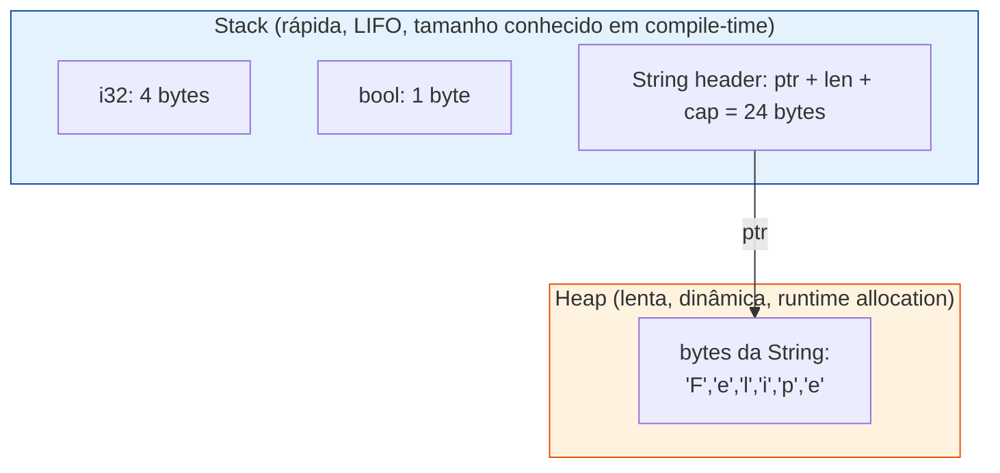
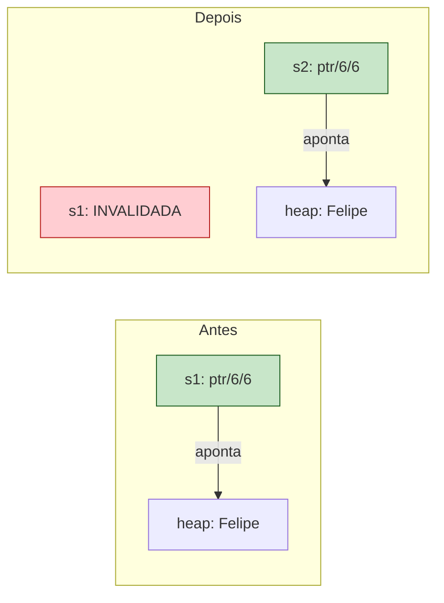
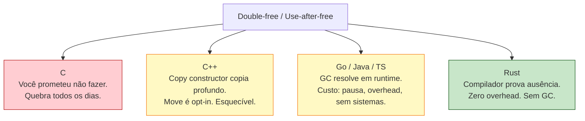
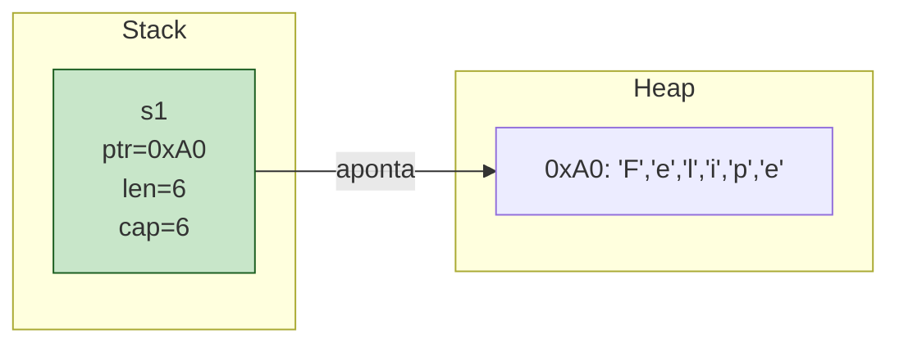
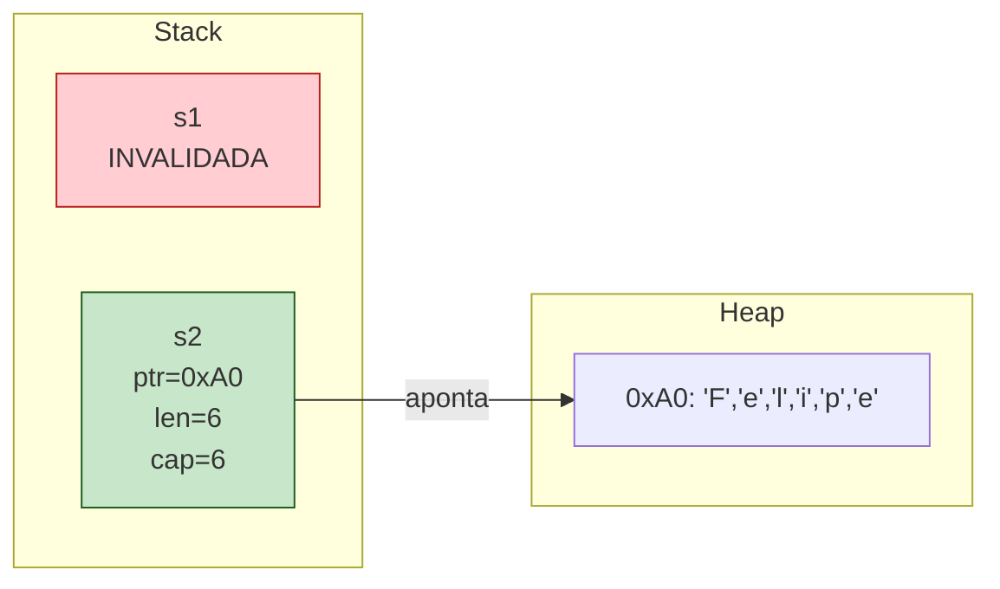
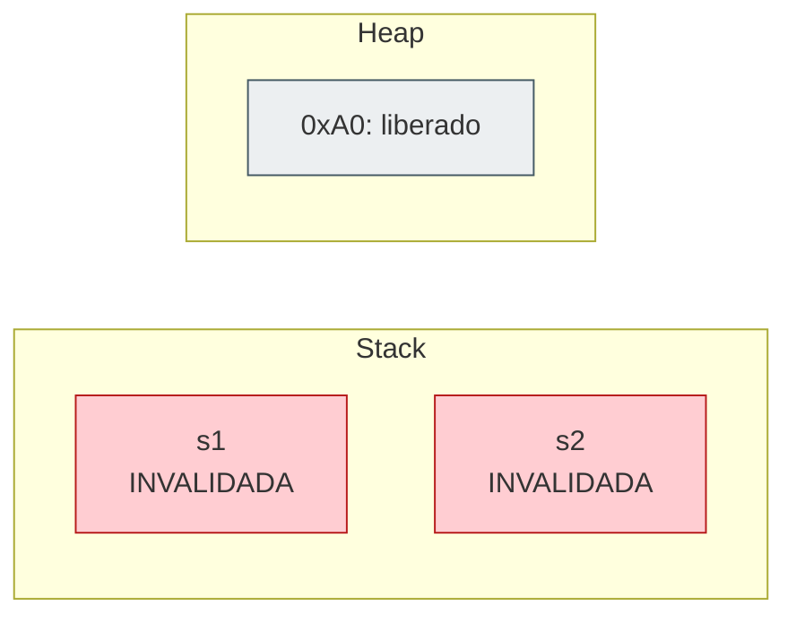
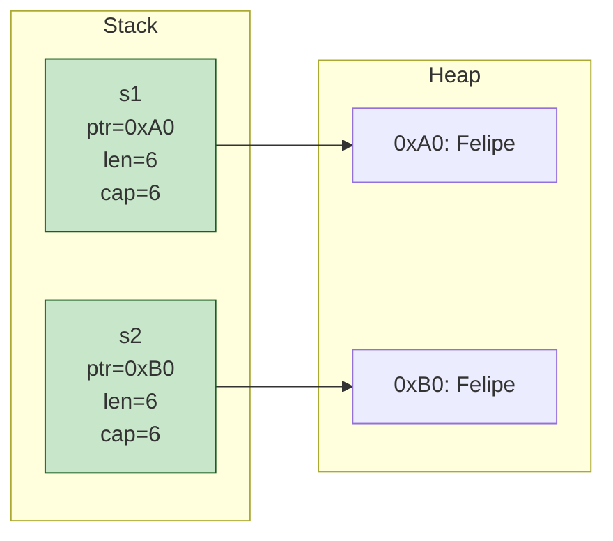

<a id="capitulo-10"></a>
# Capítulo 10: Ownership — As Três Regras

> *"For every complex problem there is an answer that is clear, simple, and wrong."*
> — H. L. Mencken

> *"Ownership is Rust's most unique feature, and it enables Rust to make memory safety guarantees without needing a garbage collector."*
> — The Rust Programming Language

> *"Ownership is not a feature. It is the feature. Tudo o resto em Rust — borrowing, lifetimes, traits, async — é consequência."*

## 10.1 O Problema que Ninguém Resolveu

Volte ao Capítulo 1 por um instante. A pergunta que define toda linguagem de programação foi formulada como: *quem é dono desta memória, e quando ela pode ser liberada?*

C respondeu: **você**. Você aloca com `malloc`, você libera com `free`, você se vira. O custo é que humanos esquecem. Esquecem de liberar (leak). Liberam duas vezes (double-free). Usam depois de liberar (use-after-free). E nenhum dos três é detectado pelo compilador.

Java, Go, JavaScript, Python responderam: **o runtime**. Existe um garbage collector que rastreia em tempo de execução quem ainda referencia o quê, e libera quando a contagem chega a zero (ou quando o tracing alcança a região). O custo é triplo: memória extra para metadata, pausas imprevisíveis (stop-the-world), e impossibilidade de uso em domínios sem runtime — kernels, drivers, firmware, código que precisa rodar em 1 KB de RAM.

Rust respondeu com algo diferente. Algo que, até 2010, era considerado teoricamente interessante mas praticamente inviável:

> *Não há dono em runtime. O dono é uma propriedade do código fonte, verificada estaticamente pelo compilador, e materializada em zero overhead em runtime.*

Essa é a tese de **ownership**. E ela cabe em três regras.

## 10.2 As Três Regras Canônicas

O capítulo 4 do *The Rust Programming Language* enuncia ownership em três frases curtas. Você vai ler essas três frases dezenas de vezes ao longo da sua carreira em Rust. Memorize-as agora:

> 1. **Cada valor em Rust tem um dono.**
> 2. **Pode haver apenas um dono por vez.**
> 3. **Quando o dono sai de escopo, o valor é descartado (dropped).**

Três frases. Uma página de prosa. Mas é a partir delas que o resto de Rust se desdobra — borrowing (Capítulo 11), lifetimes (Parte 9), `Send`/`Sync` (Parte 11), `Pin` (Parte 12). Tudo é consequência dessas três frases.

Vamos olhar uma de cada vez.

### Regra 1 — Cada valor tem um dono

Em Rust, *todo* valor — um inteiro, uma `String`, um `Vec`, uma struct customizada, um arquivo aberto, um lock — está associado a uma variável que é seu **dono**. O dono é o lugar no código fonte responsável pela vida útil daquele valor.

```rust
fn main() {
    let s = String::from("Felipe"); // s é dona da String
} // aqui s sai de escopo. A String é desalocada automaticamente.
```

Não há `free`. Não há GC. O compilador inseriu, em tempo de compilação, uma chamada à função `Drop` da `String` exatamente no fim do escopo. RAII puro, herdado de C++ — mas, ao contrário de C++, *enforced* pela linguagem, não pela disciplina do programador.

### Regra 2 — Apenas um dono por vez

Esta é a regra que choca quem vem de TS, Java ou Go.

```rust
fn main() {
    let s1 = String::from("Felipe");
    let s2 = s1; // ownership MOVIDA. s1 não é mais dona.

    println!("{}", s1); // ❌ erro: borrow of moved value: `s1`
}
```

Em TypeScript, `const s2 = s1` para uma string seria uma cópia trivial (strings são primitivos). Para um objeto, seria *aliasing* — duas variáveis apontando para o mesmo heap, ambas válidas. Em Rust, para qualquer tipo que possua memória no heap (`String`, `Vec<T>`, `Box<T>`), `let s2 = s1` é um **move**. A propriedade migrou. `s1` se torna inválida estaticamente — não em runtime, mas no nível do tipo. O compilador rejeita o programa.

### Regra 3 — Quando o dono sai de escopo, o valor é dropped

Você não chama `free`. Você não chama `delete`. Você não invoca um GC. O compilador injeta a desalocação no ponto exato do escopo onde o dono morre.

```rust
fn main() {
    {
        let v = vec![1, 2, 3]; // alocado no heap
    } // v sai de escopo aqui — Vec::drop() é chamado, heap é liberado
    // v não existe mais. Tentar usá-lo é erro de compilação.
}
```

Esse é o ponto: **a desalocação é determinística e visível no código fonte**. Você consegue, lendo o código, dizer exatamente quando cada byte é liberado. Em Java ou Go, essa pergunta é literalmente irrespondível — só o GC sabe, e ele decide quando quer.

## 10.3 Stack vs Heap: Por Que Importa

Em qualquer linguagem que você usou, valores vivem em duas regiões de memória diferentes: **stack** e **heap**. Em TS, isso é abstraído (V8 decide). Em Go, escape analysis decide. Em Rust, *você* decide — e ownership só faz sentido contra o pano de fundo dessas duas regiões.



A `String` é um **trio na stack** (ponteiro, comprimento, capacidade — 24 bytes em x86_64) que aponta para uma **região no heap** onde os bytes vivem.

Quando você escreve `let s1 = String::from("Felipe")`:

1. O runtime aloca 6 bytes no heap para `"Felipe"`.
2. Na stack, `s1` recebe um struct de 24 bytes contendo o ponteiro pra esses 6 bytes, comprimento (6), e capacidade (≥ 6).

Agora a pergunta crítica. Quando você escreve `let s2 = s1`, o que acontece?

**Opção A** — copiar só o struct da stack (raso, 24 bytes). Resultado: `s1` e `s2` apontam para os mesmos 6 bytes do heap. Os dois donos. Quando ambos saírem de escopo, `Drop` será chamado *duas vezes* — **double-free**. Bug catastrófico em C++.

**Opção B** — copiar struct E os bytes do heap (profundo). Resultado: dois donos com cópias independentes. Performance ruim — você paga uma alocação a cada atribuição.

**Opção C** (escolha de Rust) — copiar o struct da stack, mas **invalidar o original**. Apenas um dono. Sem double-free. Sem cópia profunda. *Move semantics*.

```rust
let s1 = String::from("Felipe");
let s2 = s1; // os 24 bytes da stack são copiados pra s2.
             // s1 é marcada estaticamente como "moved", inacessível.
```



O heap não mudou. Apenas o struct na stack migrou de variável. E o compilador agora se recusa a deixar você usar `s1`.

## 10.4 Copy vs Move: A Linha Divisória

Nem todo valor sofre move. Inteiros, booleanos, floats — coisas que vivem inteiramente na stack, com tamanho fixo, sem heap — são **copiados**. O custo é trivial (memcpy de 4 ou 8 bytes), e não existe risco de double-free porque não há heap envolvido.

```rust
fn main() {
    let x = 42;
    let y = x;        // i32 implementa Copy. y é uma cópia de x.
    println!("{x}");  // OK. x ainda é válido.
    println!("{y}");  // OK.
}
```

```rust
fn main() {
    let s1 = String::from("Felipe");
    let s2 = s1;       // String NÃO implementa Copy. s1 é movida.
    println!("{s1}");  // ❌ erro de compilação.
}
```

A regra mecânica é: tipos que implementam o trait `Copy` são copiados; tipos que não implementam são movidos.

A regra mental é: **se possui heap, move; se vive inteiramente na stack, copia**.

| Tipo                  | Stack/Heap        | Comportamento em `let b = a` |
|-----------------------|-------------------|------------------------------|
| `i32`, `i64`, `u8`    | Stack             | Copy                         |
| `f32`, `f64`          | Stack             | Copy                         |
| `bool`                | Stack             | Copy                         |
| `char`                | Stack             | Copy                         |
| Tuplas só de Copy     | Stack             | Copy                         |
| Arrays `[T; N]` de Copy | Stack           | Copy                         |
| `String`              | Stack header + heap | **Move**                   |
| `Vec<T>`              | Stack header + heap | **Move**                   |
| `Box<T>`              | Stack pointer + heap | **Move**                  |
| `&T` (referência)     | Stack             | Copy                         |
| Structs com `String` dentro | Misto       | **Move**                     |

Por que `&T` (uma referência) é Copy? Porque uma referência é só um ponteiro de 8 bytes na stack. Copiar o ponteiro não causa double-free — ninguém possui o heap através de `&T` (você vai ver isso no Capítulo 11).

Você pode opt-in em `Copy` para suas próprias structs:

```rust
#[derive(Copy, Clone)]
struct Ponto {
    x: f64,
    y: f64,
}

let p1 = Ponto { x: 1.0, y: 2.0 };
let p2 = p1;
println!("{} {}", p1.x, p2.x); // OK. Copia, não move.
```

Mas você só pode derivar `Copy` se *todos* os campos forem `Copy`. Adicione um `String` na struct, e o compilador recusa. A linha entre Copy e Move é uma propriedade do tipo, e o compilador a rastreia transitivamente.

## 10.5 O Trait `Drop`: RAII Sem Cerimônia

A Regra 3 — "quando o dono sai de escopo, o valor é dropped" — não é mágica. É uma chamada de função que o compilador insere automaticamente.

Toda vez que uma variável dona de um valor sai de escopo, o compilador injeta uma chamada ao método `drop` daquele tipo (se ele implementar o trait `Drop`).

```rust
struct Conexao {
    nome: String,
}

impl Drop for Conexao {
    fn drop(&mut self) {
        println!("Fechando conexão {}", self.nome);
    }
}

fn main() {
    let _c = Conexao { nome: String::from("db-prod") };
    println!("Trabalhando...");
} // saída: "Fechando conexão db-prod"
```

Saída:

```
Trabalhando...
Fechando conexão db-prod
```

Isso é **RAII** — *Resource Acquisition Is Initialization* —, ideia originada em C++ por Bjarne Stroustrup. A diferença é cultural: em C++, RAII é um padrão que o programador deve aplicar com disciplina. Em Rust, ownership *garante* que `Drop` será chamado exatamente uma vez, no momento certo, sem você fazer nada. É a única forma de liberar recursos não-Copy.

`Drop` cobre não só memória, mas **qualquer recurso**: arquivos (`File::drop` chama `close`), locks (`MutexGuard::drop` libera o mutex), threads (`JoinHandle::drop` ainda permite a thread continuar), conexões TCP (`TcpStream::drop` chama `shutdown`).

> *Em Rust, o destructor é uma promessa do tipo. Em C, fechar o arquivo é uma promessa do programador — quebrada todos os dias.*

## 10.6 Movendo Por Funções: O Comportamento Padrão

A consequência prática mais imediata de ownership: **passar um valor para uma função consome esse valor**.

```rust
fn imprime_e_consome(s: String) {
    println!("{}", s);
} // s é dropped aqui.

fn main() {
    let nome = String::from("Felipe");
    imprime_e_consome(nome);
    println!("{}", nome); // ❌ erro: borrow of moved value: `nome`
}
```

Quem vem de TypeScript sente isto como uma traição. Em TS:

```typescript
function imprimeEConsome(s: string): void {
  console.log(s);
}

const nome = "Felipe";
imprimeEConsome(nome);
console.log(nome); // OK. nome continua válido.
```

Em TS, parâmetros são copiados (primitivos) ou aliasados (objetos). O contrato semântico padrão é: *"a função pode usar, mas a variável original continua viva"*. Em Rust, o contrato padrão é o oposto: *"a função recebeu a propriedade, e você não tem mais acesso, a menos que ela devolva"*.

Para "devolver" a posse, você retorna o valor:

```rust
fn imprime_e_devolve(s: String) -> String {
    println!("{}", s);
    s // devolve a propriedade ao chamador
}

fn main() {
    let nome = String::from("Felipe");
    let nome = imprime_e_devolve(nome); // shadow: nome volta a ser o dono
    println!("{}", nome); // OK
}
```

Funciona, mas é horrendo. Imagine uma função que precisa de cinco parâmetros — você teria que retornar uma 5-tupla só para devolver tudo. É evidente que ownership puro não é suficiente para escrever código real. Há uma peça faltando.

Essa peça é **borrowing** (Capítulo 11): uma forma de emprestar acesso a um valor sem transferir a propriedade. É o que torna Rust escrevível.

Mas antes de entrar lá, deixe a Regra 2 assentar. Pegue o tempo necessário.

## 10.7 Uma Comparação Direta: Quatro Linguagens, Um Bug

O bug que estamos perseguindo é o **double-free**. Você tem uma string, ela é "copiada" para outra variável, ambas saem de escopo, e o destruidor roda duas vezes. Em C++, isso corrompe o heap. Em alguns runtimes, ataca o cache de TLB. Em produção, derruba o serviço.

### C: total liberdade, total responsabilidade

```c
#include <stdlib.h>
#include <string.h>

int main(void) {
    char* s1 = malloc(7);
    strcpy(s1, "Felipe");
    char* s2 = s1;
    free(s1);
    free(s2); // double-free. UB. corrompe o heap.
}
```

C não tem nem o conceito de "dono". Cada `free` é um ato de fé. O compilador não tem informação para te ajudar.

### C++: RAII, mas opt-in

```cpp
#include <string>

int main() {
    std::string s1 = "Felipe";
    std::string s2 = s1; // copy constructor — alocação profunda
    // ambos são donos independentes. ~string roda duas vezes,
    // cada um sobre seu próprio heap. OK, mas pagou cópia.
}
```

C++ resolveu o double-free em 1985 via *copy constructors* — `s2 = s1` aloca novo heap e copia tudo. O custo é silencioso e cumulativo. C++11 adicionou `std::move` para opt-in em move semantics, mas continua opcional. Esquecer um `std::move` é um leak de performance que ninguém vê.

### Go / TypeScript: GC

```go
func main() {
    s1 := "Felipe"
    s2 := s1
    fmt.Println(s1, s2) // ambos válidos. GC limpa quando ninguém referencia.
}
```

```typescript
const s1 = "Felipe";
const s2 = s1; // mesma coisa. GC eventualmente coletará.
console.log(s1, s2);
```

Sem double-free. Sem decisão. Custo: pausas de GC, overhead de metadata, e — em sistemas concorrentes — data races (Go) ou single-thread por design (JS). Não dá pra escrever um kernel assim.

### Rust: o compilador prova ausência do bug

```rust
fn main() {
    let s1 = String::from("Felipe");
    let s2 = s1;
    println!("{s1}"); // ❌ erro: borrow of moved value: `s1`
}
```

```
error[E0382]: borrow of moved value: `s1`
 --> src/main.rs:4:16
  |
2 |     let s1 = String::from("Felipe");
  |         -- move occurs because `s1` has type `String`,
  |            which does not implement the `Copy` trait
3 |     let s2 = s1;
  |              -- value moved here
4 |     println!("{s1}");
  |               ^^^^ value borrowed here after move
```

Sem alocação extra. Sem GC. Sem possibilidade de double-free. **O bug não pode existir** — é classe inteira eliminada na fronteira da compilação.



## 10.8 Visualizando um Move

Esta é a hora de internalizar a mecânica. Vamos rastrear, passo a passo, o que acontece quando você move uma `String`.

```rust
fn main() {
    let s1 = String::from("Felipe"); // (1)
    let s2 = s1;                     // (2)
    drop(s2);                        // (3)
}
```

**Passo (1):** alocação inicial.



A `String::from("Felipe")` chamou o alocador, recebeu o endereço `0xA0`, gravou os 6 bytes e construiu um header de 24 bytes na stack apontando para lá.

**Passo (2):** o move. `s2` recebe o conteúdo do header de `s1`. *O heap não é tocado.*



`s1` ainda existe fisicamente na stack — os bytes do header podem até estar lá, idênticos. Mas, no nível do tipo, o compilador marcou `s1` como `moved`. Qualquer leitura de `s1` agora é erro de compilação. É um conceito puramente *estático*: nada acontece em runtime para "marcar" `s1`. O compilador simplesmente recusa o programa.

**Passo (3):** `drop(s2)`. O alocador é chamado, libera o heap em `0xA0`, e `s2` se torna inválida também.



Note: `Drop` foi chamado *uma vez* — sobre `s2`. Nunca duas vezes. A Regra 2 ("um dono por vez") é exatamente o que torna isso seguro.

## 10.9 Clone: O Escape Hatch Explícito

Você quer mesmo duplicar a `String`, com cópia profunda do heap? Existe — mas é *opt-in*, com nome próprio:

```rust
fn main() {
    let s1 = String::from("Felipe");
    let s2 = s1.clone(); // alocação nova; heap copiado
    println!("{s1} {s2}"); // ambos válidos
}
```



`clone()` paga o preço: nova alocação, novo heap, dois donos genuinamente independentes. Cada um será dropped uma vez sobre seu próprio heap. Sem double-free, sem aliasing, sem problema.

A diferença filosófica em relação a C++ é crucial. Em C++:

```cpp
std::string s2 = s1; // copy constructor — silencioso. Aloca. Copia.
```

A cópia é o *padrão*. Você paga sem perceber. Em Rust, o padrão é mover (zero custo); cópia profunda exige `.clone()` — visível no código, *grep-ável*, auditável. Isso é um princípio: **o que custa caro deve ser visível**.

## 10.10 O Padrão Mental: "Quem é o Dono Agora?"

Para escrever Rust, você precisa internalizar uma pergunta que TS, Go, Java nunca te forçaram a fazer:

> *Em qualquer ponto deste código, quem é o dono deste valor?*

Em TS você raramente pensa nisso — o GC e o aliasing irrestrito te poupam. Em Go também — escape analysis decide stack vs heap por baixo dos panos, e o GC limpa o resto. Em Rust, é a primeira pergunta de toda função.

```rust
fn main() {
    let nome = String::from("Felipe"); // nome é dono
    cumprimenta(nome);                 // dono migrou pra cumprimenta
    // aqui, nome NÃO É MAIS DONO. Acessá-lo é erro.
}

fn cumprimenta(s: String) { // s é dono agora
    println!("Olá, {s}!");
} // s sai de escopo, String é dropped
```

Trace mental:

| Ponto                             | Dono de "Felipe"           |
|-----------------------------------|----------------------------|
| Após `String::from`               | `nome` (em `main`)         |
| Durante `cumprimenta(nome)`       | `s` (em `cumprimenta`)     |
| Após retorno                      | ninguém — foi dropped      |

Esta tabela mental é o coração de pensar em Rust. Inicialmente custa atenção. Depois de algumas semanas, vira reflexo, e você começa a *sentir* falta dela em outras linguagens — porque ela responde antecipadamente perguntas que em TS/Go você só descobre via crash em produção.

## 10.11 O Que Falta: Borrowing

Ownership puro, como descrito até aqui, é seguro mas inflexível. Veja o problema:

```rust
fn comprimento(s: String) -> usize {
    s.len()
} // s é dropped. Adeus, String.

fn main() {
    let nome = String::from("Felipe");
    let n = comprimento(nome); // moveu nome
    println!("{nome}");        // ❌ erro: nome foi movida
}
```

Você só queria saber o comprimento da string. Para isso, perdeu a string. A solução naive é devolver:

```rust
fn comprimento(s: String) -> (String, usize) {
    let n = s.len();
    (s, n) // devolve junto
}
```

Isto é absurdo. Toda função que apenas *lê* um valor teria que devolvê-lo. O código vira um espetáculo de tuplas sendo passadas pra cá e pra lá.

A solução é deixar funções acessarem valores **sem tomar a propriedade**. Tomar emprestado, em vez de tomar. *Emprestar*. Isto é **borrowing**, e é o assunto do Capítulo 11.

A regra preview: você pode pegar uma referência (`&`) ao valor, passar a referência para a função, e a função lê sem se tornar dona. O dono permanece quem era. Quando a função retorna, a referência morre, mas o valor original está lá, intacto.

```rust
fn comprimento(s: &String) -> usize { // empresta, não toma
    s.len()
}

fn main() {
    let nome = String::from("Felipe");
    let n = comprimento(&nome); // passa empréstimo
    println!("{nome} tem {n} letras"); // OK! nome continua dona
}
```

Mas borrowing introduz seus próprios mistérios. Quantos empréstimos simultaneamente? Mutáveis ou imutáveis? Pode-se modificar enquanto se itera? Isso é o próximo capítulo.

## 10.12 Resumo Ferro

Internalize estas afirmações antes de seguir:

1. **Toda alocação tem um dono. Sem exceções.** Mesmo `42` tem um dono — só que `i32` é Copy, então parece que não.
2. **Move é o padrão. Copy é a exceção.** Tipos com heap movem; tipos puramente stack copiam.
3. **`Drop` é determinístico.** O compilador insere a chamada exatamente no fim do escopo do dono. Você consegue ler o código e dizer quando cada byte é liberado.
4. **`Clone` é o escape hatch visível.** Cópia profunda existe, mas o nome explícito impede você de pagar sem perceber.
5. **Passar para função consome.** Para apenas ler/usar sem consumir, você precisa de borrowing — Capítulo 11.

E uma observação meta: ownership não é uma feature *anti-bug*. É uma feature *anti-classe-de-bugs*. Use-after-free, double-free, dangling pointer, leaks por aliasing — todos são impossíveis em Rust seguro. Não porque o programador é cuidadoso, mas porque o programa que contém um deles **não compila**.

> *"In Rust, you don't write bug-free code. You write code that the compiler refuses to make buggy."*
> — Niko Matsakis

E é por isso que ownership é a feature de Rust. Tudo o resto vem daqui.

---

[← Anterior: Capítulo 9](../part-03-types-and-syntax/ch09-pattern-matching.md) · [Próximo: Capítulo 11 — Borrowing →](ch11-borrowing.md)
