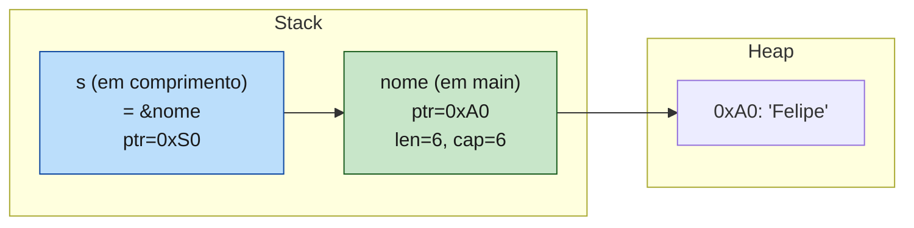
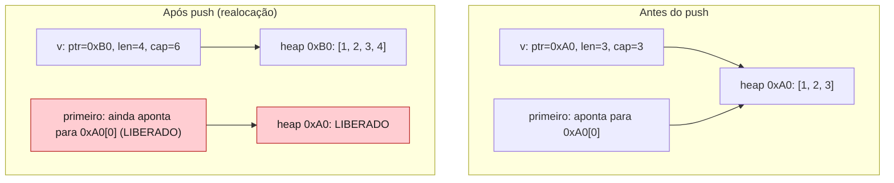
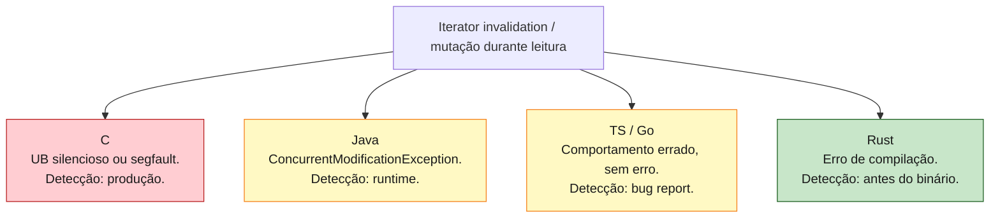
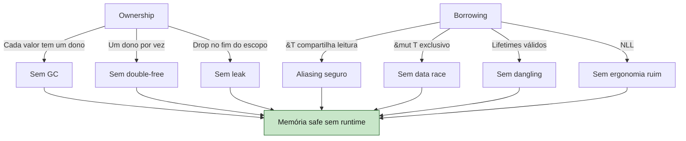

<a id="capitulo-11"></a>
# Capítulo 11: Borrowing — Empréstimos Verificados

> *"Mutability and aliasing — that's the source of all bugs."*
> — Niko Matsakis, principal architect do borrow checker

> *"At any given time, you can have either one mutable reference or any number of immutable references. References must always be valid."*
> — The Rust Programming Language, Capítulo 4

> *"Aliasing XOR mutability. Escolha uma. O compilador escolhe por você."*

## 11.1 O Bug que Borrowing Mata

Em 2010, no servidor de e-commerce de uma empresa cujo nome todo mundo conhece, um engenheiro escreveu, em Java, código equivalente a este:

```java
List<Pedido> pedidos = carrinho.getPedidos();
for (Pedido p : pedidos) {
    if (p.expirado()) {
        pedidos.remove(p); // ConcurrentModificationException em runtime
    }
}
```

Em produção, isto crashou em 1 a cada 10.000 requisições, dependendo de timing e tamanho da lista. O bug é conhecido: **iterator invalidation**. Você está iterando uma estrutura e a modificando ao mesmo tempo. Em Java, lança exceção em runtime. Em C++, leva a undefined behavior — o iterador aponta para memória reallocada, segfault aleatório, vetor de exploit. Em Go, pode "funcionar" mas pular elementos silenciosamente.

A causa raiz, em todas as linguagens, é a mesma: **alguém está lendo uma estrutura enquanto outro alguém a modifica**, e o invariante interno (o ponteiro do iterador, o tamanho do vetor, o layout do hashmap) não sobrevive.

A pergunta que define este capítulo é: **e se a linguagem proibisse isso na fronteira da compilação?**

A resposta é o conjunto de regras do *borrow checker* — a engenharia mais distintiva de Rust. Em Rust, o código equivalente acima **não compila**. Não falha em runtime. Não é detectado por linter. Não compila. E essa rigidez, que parece insuportável nas primeiras semanas, é o que elimina classes inteiras de bugs em produção.

## 11.2 Referências: Empréstimo Sem Tomada

O Capítulo 10 deixou um problema aberto: passar um valor a uma função o consome. A solução é passar uma **referência** — um ponteiro com regras.

```rust
fn comprimento(s: &String) -> usize {
    s.len()
}

fn main() {
    let nome = String::from("Felipe");
    let n = comprimento(&nome); // passa &nome — uma referência
    println!("{nome} tem {n} letras"); // nome continua sendo dona
}
```

`&nome` é uma **referência compartilhada** ou **imutável**. Mecanicamente, é um ponteiro de 8 bytes (em x86_64) para os bytes da `String`. Semanticamente, é um *empréstimo*: a função pode ler, não pode tomar para si, e ao retornar, a referência morre. O dono continua sendo o dono.



Note a diferença em relação a um move: `s` não é uma cópia do header de `nome`. `s` é um ponteiro **para o header de `nome`**. Quando `comprimento` retorna, `s` desaparece, mas `nome` está intacta — não foi tocada.

Isto é o que torna Rust escrevível. Funções podem agora *operar sobre* dados sem *consumi-los*. Mas há regras.

## 11.3 As Duas Regras Fundamentais do Borrow Checker

Existem duas regras. Apenas duas. Mas elas, combinadas, provam ausência de toda uma família de bugs:

> 1. **A qualquer momento, você pode ter *ou* uma referência mutável (`&mut T`) *ou* qualquer número de referências imutáveis (`&T`). Nunca os dois ao mesmo tempo.**
> 2. **Referências devem sempre ser válidas (apontar para dados ainda vivos).**

A primeira regra é o coração. Ela é geralmente abreviada como **aliasing XOR mutability**:

- *Aliasing* — múltiplos nomes/referências para o mesmo dado.
- *Mutability* — capacidade de modificar o dado.

Você pode ter aliasing **ou** mutability sobre o mesmo valor, mas **nunca os dois simultaneamente**. Esta é a invariante que o borrow checker preserva.

```rust
fn main() {
    let mut v = vec![1, 2, 3];

    // Caso 1: muitas referências imutáveis. OK.
    let r1 = &v;
    let r2 = &v;
    let r3 = &v;
    println!("{:?} {:?} {:?}", r1, r2, r3);
}
```

```rust
fn main() {
    let mut v = vec![1, 2, 3];

    // Caso 2: uma referência mutável. OK.
    let r = &mut v;
    r.push(4);
    println!("{:?}", r);
}
```

```rust
fn main() {
    let mut v = vec![1, 2, 3];

    // Caso 3: imutável + mutável simultaneamente. ❌ não compila.
    let r1 = &v;
    let r2 = &mut v;
    println!("{:?} {:?}", r1, r2);
}
```

```
error[E0502]: cannot borrow `v` as mutable because it is also borrowed as immutable
 --> src/main.rs:5:14
  |
4 |     let r1 = &v;
  |              -- immutable borrow occurs here
5 |     let r2 = &mut v;
  |              ^^^^^^ mutable borrow occurs here
6 |     println!("{:?} {:?}", r1, r2);
  |                           -- immutable borrow later used here
```

```rust
fn main() {
    let mut v = vec![1, 2, 3];

    // Caso 4: duas mutáveis simultaneamente. ❌ não compila.
    let r1 = &mut v;
    let r2 = &mut v;
    r1.push(4);
    r2.push(5);
}
```

```
error[E0499]: cannot borrow `v` as mutable more than once at a time
```

Tabela canônica:

| Você tem            | Pode pegar `&T`? | Pode pegar `&mut T`? |
|---------------------|------------------|----------------------|
| nada                | sim              | sim                  |
| um `&T`             | sim              | **não**              |
| muitos `&T`         | sim              | **não**              |
| um `&mut T`         | **não**          | **não**              |

A regra é simétrica e exclusiva: ou você está num mundo *somente leitura, multi-acesso* ou num mundo *escrita única, acesso exclusivo*. Nunca há mistura.

## 11.4 Por Que Não Pode Haver Dois `&mut`

Imagine se Rust permitisse:

```rust
let mut v = vec![1, 2, 3];
let r1 = &mut v;
let r2 = &mut v;

// thread A executa r1.push(4)
// thread B executa r2.push(5) ao mesmo tempo
```

`Vec::push` faz três coisas: lê `cap`, possivelmente realloca, escreve em `len`. Se duas threads fazem isso simultaneamente sobre o mesmo `Vec`, a estrutura interna se corrompe. O ponteiro pode acabar inválido. Os dados podem se perder. Em C++, isso é UB. Em Go, é uma data race detectável só em runtime com `-race`. Em Java, depende do nível de sincronização — pode lançar `ConcurrentModificationException` ou pior, silenciosamente perder updates.

Rust torna o cenário **impossível de expressar**. Você não consegue ter dois `&mut` para o mesmo `Vec`, então não consegue passar um para cada thread, então não tem data race. Não é runtime check — é tipo. O compilador prova ausência.

> *"Data races não são prevenidas por sincronização em Rust. Elas são prevenidas pelo sistema de tipos."*

## 11.5 Por Que Não Pode `&` e `&mut` Juntos

Esta é a regra que parece arbitrária mas é a mais profunda das duas.

```rust
fn main() {
    let mut v = vec![1, 2, 3];
    let primeiro = &v[0]; // referência para o primeiro elemento
    v.push(4);            // ❌ tentativa de modificar enquanto há &
    println!("{}", primeiro);
}
```

Pergunta: por que isso é um problema?

Resposta: `v.push(4)` pode realocar o `Vec`. Quando o `Vec` está cheio (`len == cap`), `push` aloca um buffer novo (geralmente o dobro), copia os elementos, libera o antigo, e atualiza o ponteiro interno. **Os dados na posição original deixam de existir.**

Se Rust permitisse esse código, `primeiro` agora aponta para memória liberada — *use-after-free clássico*. O `println!` no final leria lixo, e o exploit de segurança estaria servido.



Em C++, este é o bug clássico que `std::vector::push_back` causa. Iteradores guardados antes de `push_back` podem ser invalidados — está documentado, mas é um erro humano comum. Em Rust, o compilador rejeita o programa: você tem um `&` vivo, não pode chamar nada que peça `&mut self` no mesmo `Vec`.

Esta é a generalização: **toda mutação é, em potencial, uma realocação ou uma quebra de invariante interno**. Rust não distingue mutações "seguras" (escrever num int) de mutações "perigosas" (`push` num `Vec`). A regra é uniforme: se há leitor, ninguém escreve; se há escritor, ninguém lê.

## 11.6 Iterator Invalidation: O Bug Clássico

Volte ao exemplo do começo. Aqui está em Rust:

```rust
fn main() {
    let mut pedidos = vec!["a", "b", "c"];

    for p in &pedidos {
        if p == &"b" {
            pedidos.remove(0); // ❌ não compila
        }
    }
}
```

```
error[E0502]: cannot borrow `pedidos` as mutable because it is also borrowed as immutable
 --> src/main.rs:5:13
  |
3 |     for p in &pedidos {
  |              --------
  |              |
  |              immutable borrow occurs here
  |              immutable borrow later used here
4 |         if p == &"b" {
5 |             pedidos.remove(0);
  |             ^^^^^^^^^^^^^^^^^ mutable borrow occurs here
```

O `for p in &pedidos` mantém um `&Vec` ativo durante o corpo do loop. Tentar chamar `pedidos.remove(0)` (que precisa de `&mut self`) viola a regra: aliasing + mutation. Não compila.

Compare com TypeScript:

```typescript
const pedidos = ["a", "b", "c"];
pedidos.forEach((p, i) => {
    if (p === "b") {
        pedidos.splice(0, 1); // sem erro. Mas pula elementos silenciosamente.
    }
});
console.log(pedidos); // ["b", "c"] — comportamento confuso.
```

JavaScript não invalida o iterador, mas você acabou de modificar o array que está sendo iterado. O resultado é um iterador rodando sobre índices que não existem mais. Não há erro, há *comportamento errado*.

Compare com Java:

```java
List<String> pedidos = new ArrayList<>(List.of("a", "b", "c"));
for (String p : pedidos) {
    if (p.equals("b")) {
        pedidos.remove(0); // ConcurrentModificationException em runtime
    }
}
```

Java *detecta*, mas em runtime, lançando exceção. Em produção, isto vira o stack trace às 03:00 da manhã.

Compare com Go:

```go
pedidos := []string{"a", "b", "c"}
for _, p := range pedidos {
    if p == "b" {
        pedidos = pedidos[1:] // "ok", mas semântica imprevisível
    }
}
```

Go permite. O `range` capturou o slice no início do loop, e mutar `pedidos` durante a iteração leva a comportamento dependente do tamanho do slice e do índice — basicamente bug indetectável.

Compare com C++:

```cpp
std::vector<std::string> pedidos = {"a", "b", "c"};
for (auto it = pedidos.begin(); it != pedidos.end(); ++it) {
    if (*it == "b") {
        pedidos.erase(pedidos.begin()); // ub. it agora dangling.
    }
}
```

C++ permite e silenciosamente corrompe o programa. O iterador `it` está agora apontando para memória inválida.

| Linguagem | O que acontece              | Quando você descobre |
|-----------|-----------------------------|----------------------|
| C++       | undefined behavior          | crash em produção, ou exploit de segurança |
| Java      | `ConcurrentModificationException` | runtime, em produção |
| TS/JS     | sem erro, semântica errada  | bug report, dias depois |
| Go        | sem erro, semântica errada  | bug report, dias depois |
| **Rust**  | **erro de compilação**      | **antes do binário ser gerado** |

Rust transforma um bug de runtime em diagnóstico do compilador. Para corrigir, você reescreve com a intenção explícita:

```rust
fn main() {
    let mut pedidos = vec!["a", "b", "c"];
    pedidos.retain(|p| *p != "b"); // método dedicado, semântica clara
    println!("{:?}", pedidos);
}
```

Ou, em estilo funcional:

```rust
let pedidos: Vec<&str> = pedidos.into_iter().filter(|p| *p != "b").collect();
```

A pressão da linguagem te empurra para padrões corretos.

## 11.7 NLL: Non-Lexical Lifetimes

Você pode estar pensando: "essas regras são tão rígidas que código real seria impossível". E, até 2018, você teria razão. Veja este exemplo:

```rust
fn main() {
    let mut s = String::from("Felipe");
    let r1 = &s;
    let r2 = &s;
    println!("{r1} {r2}"); // último uso de r1 e r2 aqui

    let r3 = &mut s; // OK?
    r3.push_str("!");
    println!("{r3}");
}
```

Antes de 2018, o compilador rejeitava este programa. A razão: `r1` e `r2` foram declarados num escopo, e a linguagem inferia que sua "vida" era *lexical* — duravam até o fim do bloco onde foram declaradas. Mesmo que você nunca mais os usasse, eles seguiam "vivos" para o borrow checker, bloqueando `&mut s` até a chave `}`.

Era uma frustração diária. Você tinha que adicionar escopos artificiais:

```rust
fn main() {
    let mut s = String::from("Felipe");
    {
        let r1 = &s;
        let r2 = &s;
        println!("{r1} {r2}");
    } // forçar fim do escopo de r1 e r2

    let r3 = &mut s;
    r3.push_str("!");
}
```

Hideous. Em 2018, a edição 2018 do Rust trouxe **Non-Lexical Lifetimes (NLL)**: o borrow checker passou a entender que uma referência morre quando ela é *usada pela última vez*, não quando seu escopo lexical termina. Em 2022 (Rust 1.63), NLL passou a ser o default para *todos* os edições.

```rust
fn main() {
    let mut s = String::from("Felipe");
    let r1 = &s;
    let r2 = &s;
    println!("{r1} {r2}"); // último uso. r1 e r2 morrem aqui.

    let r3 = &mut s; // OK. nenhum & vivo.
    r3.push_str("!");
    println!("{r3}");
}
```



```mermaid
gantt
    title Vida das referências (NLL)
    dateFormat X
    axisFormat %s
    section Pré-NLL (2015 ed.)
    s mutável bloqueada    :crit, 0, 5
    r1 vivo (lexical)      :active, 1, 4
    r2 vivo (lexical)      :active, 1, 4
    r3 (impossível)        :done, 4, 5
    section NLL (2018+ default)
    s mutável bloqueada    :crit, 0, 3
    r1 vivo (até último uso) :active, 1, 3
    r2 vivo (até último uso) :active, 1, 3
    r3 vivo                :active, 3, 5
```

NLL não relaxou as duas regras. Apenas as aplicou com mais precisão: a referência tem um *lifetime* que cobre os pontos do programa onde ela é potencialmente usada — não escopos arbitrários. O compilador faz análise de fluxo de dados (control-flow graph) para determinar isso.

A consequência prática: padrões que pareciam impossíveis ficam expressíveis sem `{}` artificiais. O borrow checker se tornou muito mais agradável de conviver após NLL.

## 11.8 Mutável + Imutável Sequencialmente: OK

Combinando as duas regras com NLL:

```rust
fn main() {
    let mut nome = String::from("Felipe");

    // bloco 1: leitura compartilhada
    let r1 = &nome;
    let r2 = &nome;
    println!("{r1}, {r2}"); // r1, r2 morrem aqui

    // bloco 2: escrita exclusiva
    let r3 = &mut nome;
    r3.push_str(" Coelho");
    println!("{r3}"); // r3 morre aqui

    // bloco 3: leitura compartilhada de novo
    let r4 = &nome;
    let r5 = &nome;
    println!("{r4}, {r5}");
}
```

Tudo legal. Os "fases" de leitura e escrita não se sobrepõem, então a regra `aliasing XOR mutability` é respeitada. O compilador rastreia automaticamente quando cada referência morre.

## 11.9 Dangling References: A Segunda Regra

A segunda regra do borrow checker — *"references must always be valid"* — bloqueia o segundo grande bug histórico de C: **dangling pointers**.

Em C, isto compila e roda:

```c
char* perigoso(void) {
    char nome[] = "Felipe";
    return nome; // retorna ponteiro para stack desalocada
}

int main(void) {
    char* p = perigoso();
    printf("%s\n", p); // UB. p aponta para stack já reusada.
}
```

`nome` vive na stack frame de `perigoso`. Quando `perigoso` retorna, a frame é descartada — outros valores podem ocupar a mesma memória. Retornar `nome` é retornar um ponteiro morto.

Em Rust, o equivalente:

```rust
fn perigoso() -> &String {
    let nome = String::from("Felipe");
    &nome // ❌ não compila
}
```

```
error[E0106]: missing lifetime specifier
 --> src/main.rs:1:18
  |
1 | fn perigoso() -> &String {
  |                  ^ expected named lifetime parameter
  |
  = help: this function's return type contains a borrowed value,
          but there is no value for it to be borrowed from
```

O compilador exige que toda referência tenha um *lifetime* — uma garantia estática de que ela aponta para algo ainda vivo. Como `nome` é local da função, ela morrerá ao retornar; nenhum lifetime válido pode ser associado à referência. **O programa que contém o bug não compila.**

A correção é não devolver referência, mas sim a propriedade:

```rust
fn seguro() -> String {
    let nome = String::from("Felipe");
    nome // move para fora — propriedade transferida
}
```

Lifetimes serão tratados em profundidade na Parte 9. Por ora, registre: a Regra 2 do borrow checker garante que toda referência aponta para dados que ainda existem. Sem dangling. Nunca. Sem unsafe.

## 11.10 Borrowing em Funções: O Padrão Idiomático

Veja como o estilo idiomático de Rust se forma a partir de borrowing:

```rust
// recebe leitura — não consome
fn imprime(s: &String) {
    println!("{}", s);
}

// recebe escrita — não consome, mas modifica
fn adiciona_ponto(s: &mut String) {
    s.push('.');
}

// consome — toma posse, talvez para devolver transformada
fn em_caixa_alta(s: String) -> String {
    s.to_uppercase()
}

fn main() {
    let mut nome = String::from("Felipe");

    imprime(&nome);              // empresta leitura
    adiciona_ponto(&mut nome);   // empresta escrita
    imprime(&nome);              // empresta leitura de novo
    let grito = em_caixa_alta(nome); // CONSOME nome
    // nome não pode mais ser usada aqui
    imprime(&grito);
}
```

Padrão mental para escrever assinaturas:

| Intenção                            | Assinatura          |
|-------------------------------------|---------------------|
| ler sem modificar, sem consumir     | `fn f(x: &T)`       |
| modificar, sem consumir             | `fn f(x: &mut T)`   |
| consumir (transformar, armazenar)   | `fn f(x: T)`        |

A assinatura **comunica a intenção da função no nível do tipo**. Em Java, você precisaria ler a documentação para saber se o parâmetro é mutado. Em Rust, está no tipo.

## 11.11 Comparação Direta: Quatro Linguagens, Mesmo Bug

Mesmo padrão do Capítulo 10. O bug agora é "modificar enquanto itera".

### C: liberdade total, segfault frequente

```c
int v[] = {1, 2, 3, 4, 5};
int* p = &v[0];
v[0] = 99;       // ok, é stack
// Mas com vector dinâmico:
// int* dyn = malloc(sizeof(int)*5);
// int* p2 = dyn; free(dyn); printf("%d", *p2); // UB
```

C nunca soube o que é "iterador". Não há proteção. Não há aviso. Roda até quebrar.

### TypeScript: tudo permitido, semântica imprevisível

```typescript
const arr = [1, 2, 3, 4, 5];
arr.forEach((n, i) => {
    if (n === 3) arr.splice(i, 1); // pula um elemento silenciosamente
});
console.log(arr); // [1, 2, 4, 5]
```

Sem erro. Sem aviso. Apenas comportamento errado.

### Go: data races em concorrência

```go
m := map[string]int{"a": 1, "b": 2}
go func() {
    for k := range m {
        m[k+"!"] = 0 // race: leitura + escrita em map
    }
}()
go func() {
    delete(m, "a") // race
}()
```

Em Go, isto causa pânico em runtime se compilado com `-race`. Sem `-race`, é UB silencioso. Maps em Go não são thread-safe — você precisa de `sync.Mutex`, e o compilador não te lembra.

### Rust: o programa não compila

```rust
let mut v = vec![1, 2, 3, 4, 5];
let primeiro = &v[0];
v.push(6); // ❌ não compila. & vivo, &mut requerido.
println!("{primeiro}");
```



## 11.12 Por Que `aliasing XOR mutability` é Mais Profundo do Que Parece

A regra parece, à primeira vista, sobre prevenir bugs específicos: iterator invalidation, data race, dangling pointer. Mas é mais geral. Ela é uma propriedade *algébrica* do programa.

Considere: a fonte de quase toda dificuldade de raciocinar sobre código mutável é justamente a combinação de aliasing e mutação. Quando uma função `f(x, y)` recebe duas referências, e *ambas podem apontar para o mesmo dado*, qualquer leitura de `x` pode estar lendo uma escrita feita via `y`. O comportamento da função depende de invariantes que o leitor não consegue ver localmente.

Compiladores otimizadores sofrem desse mesmo problema. Em C, o compilador frequentemente não pode reordenar acessos a memória porque dois ponteiros podem aliasar (a "regra de aliasing estrito" foi uma tentativa parcial de resolver isto). Em Rust, o compilador *sabe* — pelo tipo — que `&mut T` jamais aliasa com qualquer outra referência ao mesmo dado. Isso libera otimizações que LLVM aplica em Rust mas não em C equivalente.

| Propriedade                          | C       | C++     | Java/TS/Go | Rust                  |
|--------------------------------------|---------|---------|------------|------------------------|
| Aliasing irrestrito                  | sim     | sim     | sim        | apenas `&T` compartilhado |
| Mutação via aliases                  | sim     | sim     | sim        | **proibida**           |
| Iteradores invalidáveis              | sim     | sim     | sim (java throws) | **impossível em compile-time** |
| Data races em multi-thread           | sim     | sim     | sim (go), sim (java) | **impossível em compile-time** |
| Compilador pode assumir `&mut` único | não     | não     | n/a        | sim                    |

A última linha é importante e raramente notada: a regra do borrow checker permite *otimizações que C não pode fazer*. Rust é, em alguns benchmarks, mais rápido que C — não por mágica, mas porque o compilador tem informação sobre aliasing que o frontend de C jamais terá.

## 11.13 O Custo: Fighting the Borrow Checker

Não vou romantizar. Aprender a borrow checker dói. Você vai escrever loops que parecem corretos e o compilador vai recusar. Você vai pensar em padrões de Java ou Go e vai bater em parede. Vai querer fazer uma struct com referências circulares, e descobrir que precisa de `Rc<RefCell<T>>` ou `Arc<Mutex<T>>` (Parte 10). Vai sentir vontade de gritar.

Essa fase tem nome — "fighting the borrow checker" — e dura entre uma semana e três meses, dependendo de quanto Java/C++ você trazia na bagagem. Saiba que é normal. Saiba também que o que parece "luta contra o compilador" é, quase sempre, o compilador tentando te dizer que seu modelo mental ainda está errado.

Niko Matsakis, um dos arquitetos do borrow checker, é taxativo: *"se você precisa de aliasing mais mutability, você precisa de sincronização (Mutex), de contagem de referências (Rc), ou de unsafe — e em todos os três casos, queremos que você seja explícito sobre isso, no código."*

Ou seja: a luta contra o borrow checker não é *contra*. É *com*. O compilador está te empurrando para um modelo mental que, depois de internalizado, faz código melhor *em qualquer linguagem* — você passa a ver bugs em Go, em TS, em Java, que antes nem registrava.

## 11.14 Padrões que Funcionam

Algumas heurísticas para escapar de fight-the-borrow-checker:

**1. Empreste no menor escopo possível.**

```rust
fn main() {
    let mut v = vec![1, 2, 3];

    let primeiro = v[0]; // copia o valor — dropa o &
    v.push(4);           // OK
    println!("{primeiro}");
}
```

Em vez de manter `&v[0]` por todo o escopo, copie o valor (se for `Copy`). Solta a referência imediatamente.

**2. Separe leitura de escrita por blocos.**

```rust
fn main() {
    let mut config = vec!["a", "b"];

    // fase de leitura
    let len = config.len();
    let primeiro = config[0];

    // fase de escrita
    config.push("c");
    config[0] = "z";

    println!("antes: {primeiro}, len: {len}, agora: {:?}", config);
}
```

**3. Use métodos que devolvem dados, não referências persistentes.**

```rust
let mut v = vec![1, 2, 3];
let n = v.len();        // copia usize
v.push(n as i32 * 10);  // OK
```

**4. Quando precisar de aliasing + mutação, peça permissão explícita.**

```rust
use std::cell::RefCell;

let v = RefCell::new(vec![1, 2, 3]);
{
    let r1 = v.borrow();      // empréstimo dinâmico
    println!("{:?}", r1);
}
{
    let mut r2 = v.borrow_mut();
    r2.push(4);
}
```

`RefCell` move a checagem de borrow para *runtime*, mantendo as regras (panics se você violar). É uma escapatória legítima — visível, auditável, opt-in. Em vez do compilador checar, o runtime checa. Capítulo da Parte 10.

## 11.15 O Quadro Maior: Ownership + Borrowing = Memória Sem Custo

Volte e olhe o que foi construído nos Capítulos 10 e 11:



Sete bugs históricos eliminados:
1. Use-after-free (impossível: dono determinístico).
2. Double-free (impossível: um dono por vez).
3. Memory leak por aliasing (impossível: drop é determinístico).
4. Iterator invalidation (impossível: aliasing XOR mutability).
5. Data race em variáveis (impossível: `&mut` exclusivo, `&` somente leitura).
6. Dangling pointer (impossível: lifetimes garantem validade).
7. Null pointer dereference (impossível: não há null em Rust seguro — Capítulo 12 sobre `Option`).

Tudo isso, **sem garbage collector e sem runtime**. O binário Rust é tão pequeno e rápido quanto o equivalente C. Mas todos os sete bugs acima, que custaram bilhões em CVEs e horas de debug à indústria, são **impossíveis de escrever**.

## 11.16 Um Exemplo Final: Cache de Pedidos

Para fechar, um exercício realista. Você quer escrever um cache simples:

```rust
use std::collections::HashMap;

struct CachePedidos {
    dados: HashMap<u64, String>,
}

impl CachePedidos {
    fn novo() -> Self {
        Self { dados: HashMap::new() }
    }

    fn obter(&self, id: u64) -> Option<&String> {
        self.dados.get(&id)
    }

    fn inserir(&mut self, id: u64, nome: String) {
        self.dados.insert(id, nome);
    }

    fn remover(&mut self, id: u64) -> Option<String> {
        self.dados.remove(&id)
    }
}

fn main() {
    let mut cache = CachePedidos::novo();
    cache.inserir(1, String::from("Pedido A"));
    cache.inserir(2, String::from("Pedido B"));

    if let Some(nome) = cache.obter(1) {
        println!("Pedido 1: {nome}");
    }

    let removido = cache.remover(2);
    println!("Removido: {:?}", removido);
}
```

Note as três assinaturas:
- `obter(&self, ...)` — lê. Recebe referência imutável a `self`. Pode ser chamado por múltiplos leitores.
- `inserir(&mut self, ...)` — escreve. Exclusivo.
- `remover(&mut self, ...)` — escreve. Exclusivo.

Agora, tente este código:

```rust
fn main() {
    let mut cache = CachePedidos::novo();
    cache.inserir(1, String::from("Pedido A"));

    let nome = cache.obter(1); // empréstimo imutável de cache
    cache.remover(1);          // ❌ tentativa de empréstimo mutável
    println!("{:?}", nome);    // empréstimo imutável ainda vivo
}
```

```
error[E0502]: cannot borrow `cache` as mutable because it is also borrowed as immutable
```

O compilador detecta: `nome` é uma referência viva para algo dentro de `cache`. Chamar `cache.remover(1)` exigiria `&mut cache`, mas há um `&` ativo (via `nome`). Não compila.

A correção é fazer o trabalho na ordem certa:

```rust
fn main() {
    let mut cache = CachePedidos::novo();
    cache.inserir(1, String::from("Pedido A"));

    if let Some(nome) = cache.obter(1) {
        println!("Antes de remover: {nome}");
    } // empréstimo imutável morre aqui

    cache.remover(1); // OK
}
```

Ou, mais idiomático, usando o valor retornado pelo próprio `remover`:

```rust
if let Some(nome) = cache.remover(1) {
    println!("Removido: {nome}");
}
```

Em Java, este código compilaria sem comentário, e em produção poderia te entregar uma `String` referenciando memória que o cache já considerou descartada. Em TS, o mesmo. Em Rust, o compilador te ensina a sequência certa.

## 11.17 Resumo Ferro

1. **Referências (`&T`, `&mut T`) são empréstimos**, não transferências de propriedade. O dono original permanece dono.
2. **Aliasing XOR mutability**. A qualquer momento: ou múltiplos `&T`, ou exatamente um `&mut T`. Nunca os dois.
3. **NLL** estende essa regra com precisão temporal: a referência morre no último uso, não no fim do escopo.
4. **Dangling references são impossíveis**: o compilador exige que toda referência aponte para dados ainda vivos. A análise é estática.
5. **Padrões reais usam `&` para leitura, `&mut` para escrita, e `T` consumido apenas quando faz sentido transferir posse.**
6. Bugs eliminados: use-after-free, double-free, iterator invalidation, dangling pointer, data race em variáveis. Todos no compile-time. Zero overhead em runtime.

Borrowing é, com ownership, o coração de Rust. Tudo o que vem a seguir — lifetimes nomeados (Parte 9), traits e trait objects (Parte 8), `Send`/`Sync` (Parte 11), `async`/`await` (Parte 12) — é refinamento e generalização desses dois conceitos. Internalize-os. O resto vem fácil.

> *"Borrow checker is the friend you didn't know you needed. He saves you from yourself, every day, before you even noticed you were in danger."*
> — Esteban Küber, mantenedor do compilador Rust

---

[← Anterior: Capítulo 10 — Ownership](ch10-ownership-regras.md) · [Próximo: Capítulo 12 — Option e a Morte do Null →](../part-05-composite-types/ch12-option.md)
