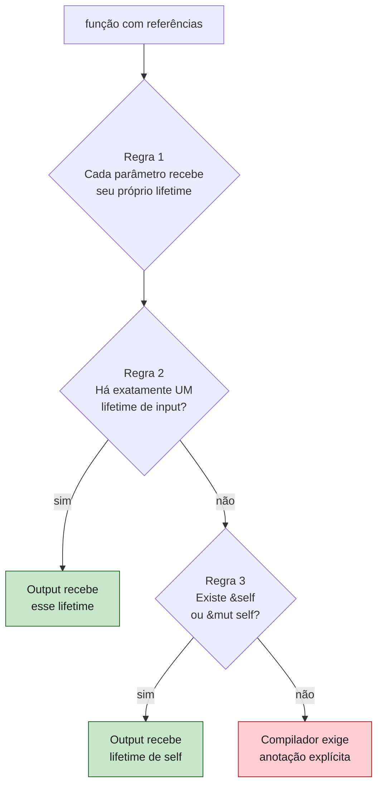
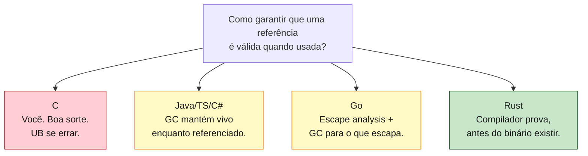

<a id="capitulo-12"></a>
# Capítulo 12: Lifetimes — Por Que e Como

> *"A reference is alive from its creation to its last use, not until the end of its scope."*
> — The Rustonomicon

> *"Lifetimes don't create life. They describe lives that already exist."*
> — Niko Matsakis, ex-líder do Borrow Checker

## 12.1 O Mal-Entendido Fundamental

Quando um programador encontra `'a` pela primeira vez, a reação universal é a mesma: *parece magia hostil*. A apóstrofe lembra OCaml, a sintaxe lembra generics, e o compilador parece exigir um ritual cuja necessidade não é óbvia.

A confusão tem um nome: as pessoas acham que `'a` **cria** uma lifetime. Como se escrever `<'a>` fosse construir um tempo de vida, alocar uma região de memória, definir até quando algo dura.

Não é. Lifetimes em Rust não criam nada. Elas **descrevem** algo que já existe.

```rust
let x = 5;        // x existe daqui...
let r = &x;       // r aponta pra x
println!("{r}");
                  // ...até aqui. Esse é o lifetime de x.
                  // Você não criou. O compilador inferiu da estrutura léxica.
```

O lifetime de `x` não é definido pela palavra `'a`. Ele é definido pela **chave de fechamento** do bloco onde `x` foi declarado. Toda variável já tem um lifetime — ele é a região do código onde a variável é válida. O que `'a` faz é dar um *nome* a essa região, para que o compilador possa **comparar** dois lifetimes e provar que um cabe dentro do outro.

Lifetimes não são prazos. São **provas**. Provas de que uma referência nunca vai sobreviver ao dado que ela referencia.

## 12.2 O Bug Que Lifetimes Existem Para Impedir

Antes de explicar a sintaxe, é preciso lembrar do inimigo. O bug que lifetimes existem para impedir é o mais famoso da história do C:

```c
// C — clássico, mortal, compila sem warning
char* nome_do_usuario() {
    char buffer[64];
    strcpy(buffer, "Felipe");
    return buffer;  // retorna ponteiro pra stack local
}                   // buffer destruído aqui — ponteiro vira lixo

int main() {
    char* nome = nome_do_usuario();
    printf("%s\n", nome);  // dangling pointer. UB. Roleta russa.
}
```

`buffer` mora na *stack frame* da função `nome_do_usuario`. Quando a função retorna, a stack frame é destruída. O ponteiro retornado aponta para memória que oficialmente não pertence mais a ninguém. O programa pode imprimir `"Felipe"`, pode imprimir lixo, pode crashar, pode imprimir uma senha que ficou flutuando ali. **A linguagem não tem como saber.**

Cada CVE de "use-after-return", cada exploit de stack pivoting, cada hora de debug perdida em código C com Valgrind — tem essa forma. O programador escreveu uma promessa que a linguagem não verificou.

Java/TypeScript/C# resolvem isso com garbage collection: o objeto referenciado vive enquanto alguém apontar para ele, ponto. O GC nunca destrói memória ainda referenciada. O custo é o GC em si — pausas, overhead, runtime.

Go resolve com **escape analysis**: o compilador detecta que `buffer` "escapa" da função (porque é retornado) e o aloca no heap em vez da stack. O GC limpa depois. Mais barato que Java, mas ainda há GC e ainda há heap pressure que poderia ser evitada.

Rust resolve **sem GC e sem heap escape automático**. Como? Recusando-se a compilar:

```rust
fn nome_do_usuario() -> &str {
    let buffer = String::from("Felipe");
    &buffer
}
//          ^^^^^^^ erro: cannot return reference to local variable `buffer`
//          buffer dropa aqui, referência ficaria dangling
```

A linguagem provou, *antes do binário existir*, que esse código tem um bug. Não em runtime. Não com Valgrind. Não em produção depois do incidente. **Em compile time.**

## 12.3 A Sintaxe Como Notação

A sintaxe de lifetime é apenas uma notação para uma relação que o compilador precisa verificar. Considere:

```rust
fn primeiro<'a>(s: &'a str) -> &'a str {
    &s[..1]
}
```

Lendo da direita pra esquerda na declaração:

| Token | Significado |
|---|---|
| `<'a>` | Declara um parâmetro de lifetime chamado `a`. |
| `s: &'a str` | `s` é uma referência válida durante a região `'a`. |
| `-> &'a str` | O retorno é uma referência válida pela mesma região `'a`. |

Em prosa: *"Existe alguma região de código `'a` durante a qual a entrada e a saída são, ambas, válidas."*

Note o que **não está sendo dito**:
- `'a` não diz quão longa a região é.
- `'a` não diz onde a região começa ou termina.
- `'a` não pede ao compilador que estenda nada.

`'a` é uma **variável universal**. O compilador, ao chamar a função, vai escolher uma região concreta que satisfaça a restrição — e se nenhuma satisfizer, a chamada não compila.

## 12.4 A Função Que Demanda Anotação

A função canônica do livro oficial é `longest`:

```rust
fn longest(x: &str, y: &str) -> &str {
    if x.len() > y.len() { x } else { y }
}
```

Esse código não compila. O erro é literal:

```
error[E0106]: missing lifetime specifier
help: this function's return type contains a borrowed value, but the
      signature does not say whether it is borrowed from `x` or `y`
```

Por que o compilador exige anotação aqui mas não exigiu em `primeiro`? Porque há **ambiguidade**. O retorno pode vir de `x` ou de `y` — depende do conteúdo em runtime. O compilador, fazendo análise estática, precisa saber por **quanto tempo** o retorno é válido. A resposta honesta é: *enquanto ambos forem válidos*. Mas isso precisa estar escrito.

```rust
fn longest<'a>(x: &'a str, y: &'a str) -> &'a str {
    if x.len() > y.len() { x } else { y }
}
```

Agora o contrato é explícito: existe alguma região `'a` durante a qual `x`, `y` e o retorno são todos válidos. Quem chama a função paga o custo:

```rust
let s1 = String::from("longa pra caramba");
let resultado;
{
    let s2 = String::from("xyz");
    resultado = longest(s1.as_str(), s2.as_str());
}                          // s2 dropa aqui
println!("{resultado}");   // erro: s2 nao vive o suficiente
```

O compilador raciocina: `'a` é a interseção dos lifetimes de `s1` e `s2`. Como `s2` morre no fim do bloco interno, `'a` termina ali. Mas `resultado` é usado depois. **Contradição. Não compila.**

A mesma chamada em outra estrutura de código compila:

```rust
let s1 = String::from("longa pra caramba");
{
    let s2 = String::from("xyz");
    let resultado = longest(s1.as_str(), s2.as_str());
    println!("{resultado}");  // ok: s1, s2 e resultado todos vivos
}
```

A diferença é puramente estrutural — onde as chaves estão. O compilador não roda o código. Ele apenas verifica que existe uma região durante a qual a promessa é cumprida.

## 12.5 As Três Regras de Elisão

Se cada `&str` exigisse `<'a>` explícito, Rust seria insuportável. Por isso o compilador aplica **três regras de elisão** que cobrem cerca de 95% dos casos. Quando elas resolvem a ambiguidade sozinhas, você não escreve nada.



**Regra 1.** Cada referência de input ganha seu próprio parâmetro de lifetime distinto:

```rust
fn f(x: &i32, y: &i32)
// é tratada como
fn f<'a, 'b>(x: &'a i32, y: &'b i32)
```

**Regra 2.** Se há exatamente uma lifetime de input, ela é atribuída a todas as lifetimes de output:

```rust
fn primeiro(s: &str) -> &str
// é tratada como
fn primeiro<'a>(s: &'a str) -> &'a str
```

Por isso `primeiro` da seção 12.3 funciona sem anotação.

**Regra 3.** Se uma das inputs é `&self` ou `&mut self` (ou seja, é um método), a lifetime de `self` é atribuída a todas as outputs:

```rust
impl Documento {
    fn primeira_palavra(&self, separador: &str) -> &str { ... }
    // é tratada como
    fn primeira_palavra<'a, 'b>(&'a self, separador: &'b str) -> &'a str { ... }
}
```

A regra 3 codifica o comum: métodos retornam fatias do objeto, não dos argumentos. Quando essa intuição é falsa, anote.

Quando as três regras juntas **não conseguem** resolver toda lifetime de output, o compilador falha. É o caso de `longest` — duas inputs (regra 1 dá `'a` e `'b`), nenhuma é `self` (regra 3 não aplica), há mais de uma lifetime (regra 2 não aplica). Sem informação suficiente. Anotação obrigatória.

## 12.6 `&'static`: O Lifetime Especial

Há um lifetime cujo nome é fixo: `'static`. Ele significa "vive durante todo o programa".

Literais de string têm `&'static str`:

```rust
let s: &'static str = "Felipe";
// "Felipe" é embutida no binário, na seção .rodata.
// Existe enquanto o processo existir.
```

Isso explica por que strings literais não precisam de anotação em quase lugar nenhum: elas têm o lifetime mais permissivo possível, então sempre satisfazem qualquer `'a`. Subtipagem de lifetimes funciona assim — `'static` é subtipo de qualquer `'a`, porque viver mais que `'a` certamente satisfaz a obrigação de viver pelo menos `'a`.

A tentação do iniciante é, ao apanhar do borrow checker, anotar tudo com `'static`:

```rust
fn pega_referencia() -> &'static str {
    let s = String::from("hello");
    &s   // erro: tentando devolver &'static que aponta pra heap local
}
```

`'static` não é uma escotilha de fuga. É uma **promessa muito forte** que o compilador vai cobrar. Se o tipo do dado não pode ser `'static` de fato, anotar `'static` apenas muda a mensagem de erro — não conserta o bug.

## 12.7 Comparação: Quatro Filosofias de "Quem Garante Validade?"



O mesmo bug, em quatro linguagens:

```c
// C: dangling pointer. Compila. Crash em runtime.
int* obter() {
    int x = 42;
    return &x;
}
```

```typescript
// TypeScript: impossível ter dangling. GC mantém x vivo
// enquanto a closure que captura existir.
function obter(): () => number {
    const x = 42;
    return () => x;
}
```

```go
// Go: escape analysis percebe que x escapa,
// aloca no heap, GC limpa depois.
func obter() *int {
    x := 42
    return &x   // compila — Go silenciosamente põe x no heap
}
```

```rust
// Rust: detecta o problema em compile time, recusa.
fn obter() -> &i32 {
    let x = 42;
    &x          // error: returns reference to local variable
}
```

Cada solução tem um custo:

| Linguagem | Custo runtime | Custo cognitivo | Erros possíveis |
|---|---|---|---|
| C | zero | enorme (você é o GC) | dangling, double-free, leak, UB |
| Java/TS | GC + alocação heap | mínimo | leak (referências esquecidas) |
| Go | GC + escape pra heap | baixo | leak, data race em refs compartilhadas |
| Rust | zero | médio (lifetimes) | nenhum (compilador prova) |

Rust escolheu **mover o custo para o programador** em troca de zero runtime. Não há atalho. Você paga, ou em ciclos de CPU (GC), ou em segfaults (C), ou em sintaxe (Rust).

## 12.8 Lifetimes em Estruturas

Até agora todas as lifetimes apareceram em funções. Estruturas que **contêm referências** também as exigem:

```rust
struct Citacao<'a> {
    texto: &'a str,
    autor: &'a str,
}

impl<'a> Citacao<'a> {
    fn maior(&self) -> &str {
        if self.texto.len() > self.autor.len() {
            self.texto
        } else {
            self.autor
        }
        // regra 3: retorno tem lifetime de &self
    }
}
```

A presença de `<'a>` na struct significa: "uma instância de `Citacao` não pode viver mais que as referências que ela contém". Se o `texto` original morre, a `Citacao` morre junto.

Esse padrão é poderoso mas vicia. Estruturas com lifetimes são **mais difíceis de mover** entre escopos, threads, async tasks. Uma regra prática vinda da comunidade Rust: **prefira estruturas que possuem seus dados** (`String`) a estruturas que emprestam (`&str`), exceto quando o caminho hot demanda evitar a alocação.

```rust
// Versão emprestada — rápida, mas viral
struct Email<'a> {
    from: &'a str,
    body: &'a str,
}

// Versão dona — uma alocação, vida fácil
struct Email {
    from: String,
    body: String,
}
```

A versão dona é trivialmente movível, sendable entre threads (se atende `Send`), serializável com `serde`, armazenável em `Vec<Email>` sem amarrações. A versão emprestada exige que cada chamador entenda o lifetime contracted. Em código de aplicação, escolha dona. Em parsers e zero-copy formats, escolha emprestada.

## 12.9 Por Que Tudo Isso Vale a Pena

A razão pela qual o trabalho intelectual de aprender lifetimes vale o esforço é simples: **a alternativa não é programar sem lifetimes — é programar sem saber que elas existem**.

Em C, lifetimes existem. O compilador não as conhece. Você as carrega na cabeça, e quando esquece, é CVE.

Em Java/Go, lifetimes existem. O GC as gerencia em runtime, com custo. Quando você esquece de remover uma referência num cache estático, é memory leak silencioso.

Em Rust, lifetimes existem **e são parte do tipo**. Você as escreve quando o compilador não consegue inferir. O compilador prova que tudo bate. Quando você esquece, ele te lembra.

A diferença não é "Rust tem lifetimes e as outras não". É "Rust **trouxe lifetimes para o nível da linguagem**, em vez de deixá-las como folclore na cabeça do programador ou como overhead invisível em runtime".

Nenhum debugger vai te ajudar a achar um use-after-free em C de forma consistente. Mas o compilador de Rust te ajuda a *evitar criá-lo*, todo dia, em cada commit.

> *"Lifetime annotations are not a tax. They are documentation that the compiler verifies."*
> — Pascal Hertleif

---

[← Capítulo 11: Borrow Checker em Profundidade](ch11-borrow-checker.md) · [Próximo: Capítulo 13 — Move Semantics: A Morte do Alias →](ch13-move-semantics.md)
