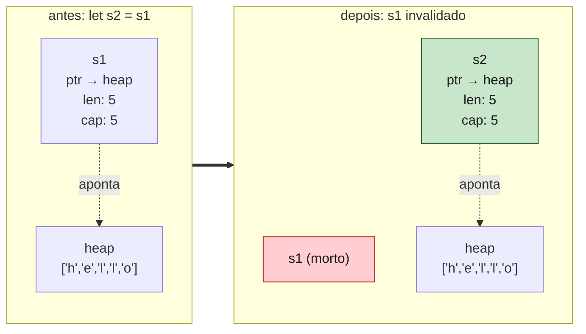
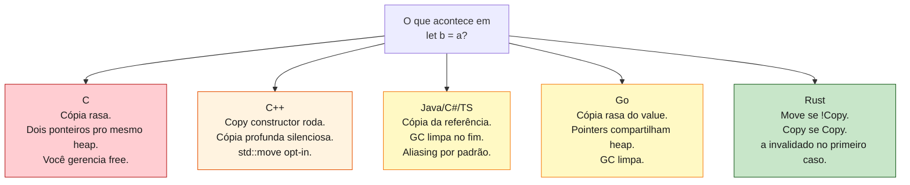
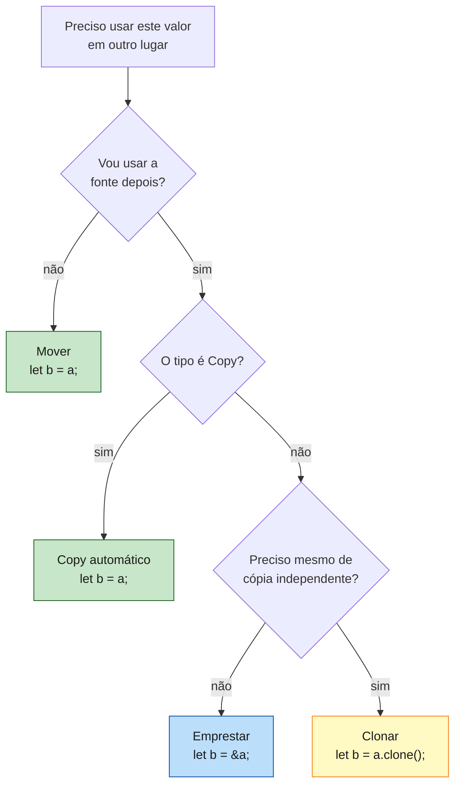

<a id="capitulo-13"></a>
# Capítulo 13: Move Semantics — A Morte do Alias

> *"In C++, every assignment is a love letter to undefined behavior."*
> — Bjarne Stroustrup, parafraseado pela comunidade

> *"The default in Rust is move. The default in C++ is copy. That single inversion is half the language."*
> — Niko Matsakis

## 13.1 O Problema Que Vem Antes da Solução

Imagine duas variáveis apontando para o mesmo bloco de memória no heap. Quando a primeira sai de escopo, ela libera o bloco. Quando a segunda sai de escopo, ela também tenta liberar — o mesmo bloco. **Double-free.** Em C, é um dos bugs mais ruidosos que existem: às vezes silencioso, às vezes corromperia o allocator interno e crasharia em outro lugar minutos depois, sempre exploitable.

```c
// C — escrito com a melhor das intenções
char* s1 = malloc(6);
strcpy(s1, "hello");
char* s2 = s1;          // dois ponteiros, um buffer

free(s1);
free(s2);               // double free. Heap corrupted. Game over.
```

C++ tentou domesticar com **RAII** (Resource Acquisition Is Initialization): destrutores liberam recursos automaticamente. Funcionou até alguém escrever:

```cpp
// C++ — RAII tropeça em si mesmo
std::string s1 = "hello";
std::string s2 = s1;    // copy constructor — duas allocations agora
                        // (deep copy automática, salva da double-free)
                        // mas: alocou heap duas vezes pra dado idêntico
```

C++ resolveu o double-free, mas pagou com **deep copy automática silenciosa**. Você escreve `s2 = s1` e o compilador roda um construtor de cópia que aloca, copia byte a byte, retorna. Vec/string de 1 GB? Boa sorte. Por isso C++11 introduziu *move semantics* — `std::move(s1)` para sinalizar "não copie, transfira". Voluntário. Opcional. Frequentemente esquecido.

Rust olhou para isso e perguntou: *e se move fosse o default?*

## 13.2 A Inversão

Em Rust, atribuição é movimento. Não cópia. Não referência compartilhada. **Movimento.**

```rust
let s1 = String::from("hello");
let s2 = s1;            // s1 moveu pra s2
println!("{s1}");       // erro: borrow of moved value `s1`
```

Tecnicamente, na CPU, o que acontece é uma `memcpy` dos três campos do header da `String` (ponteiro, length, capacity) — 24 bytes em x86-64. Sem cópia do heap. O conteúdo do heap **não é tocado**.



A diferença essencial em relação a C é: **Rust marca `s1` como inválido em compile time**. Tentar usá-lo é erro do compilador, não bug em runtime. Quando `s2` sair de escopo, ele será o único a chamar `drop`. O heap será liberado uma vez. Sem double-free, sem leak.

## 13.3 As Três Operações

Rust tem três formas distintas de duplicar um valor. Cada uma com semântica explícita, custo conhecido, propósito diferente:

```rust
let s1 = String::from("hello");

let s2 = s1;            // MOVE — s1 morre, s2 ganha
let s3 = s2.clone();    // CLONE — s2 vive, s3 é cópia profunda

let n1 = 42;
let n2 = n1;            // COPY — n1 vive, n2 é cópia rasa, sem custo
```

Resumo em uma tabela:

| Operação | Sintaxe | Fonte sobrevive? | Heap copiado? | Custo | Quando usar |
|---|---|---|---|---|---|
| Move | `let b = a;` (default) | Não | Não | memcpy header | Sempre que possível |
| Copy | `let b = a;` (se `Copy`) | Sim | N/A (sem heap) | memcpy bits | Tipos triviais |
| Clone | `let b = a.clone();` | Sim | Sim | depende | Quando precisa de duplicata real |

Note que **Move e Copy têm a mesma sintaxe**. A diferença é o tipo. Se o tipo implementa o trait `Copy`, a atribuição é tratada como cópia bit-a-bit e a fonte permanece válida. Caso contrário, é movimento.

## 13.4 O Trait `Copy`: Quem Pode, Quem Não Pode

`Copy` é um trait sem métodos. Não há nada para implementar — você apenas **declara** que o tipo é tão trivial que duplicá-lo é gratuito e seguro.

```rust
#[derive(Copy, Clone)]
struct Ponto { x: i32, y: i32 }

let p1 = Ponto { x: 1, y: 2 };
let p2 = p1;                    // copia, p1 vive
println!("{}", p1.x);           // ok
```

Quem pode ser `Copy`? A regra é dura: **tudo no tipo deve ser `Copy`, e o tipo não pode implementar `Drop`**.

Tipos primitivos numéricos são `Copy`: `i32`, `u64`, `f32`, `bool`, `char`. Tuplas de `Copy` são `Copy`. Arrays de `Copy` com tamanho conhecido são `Copy`. Referências imutáveis `&T` são `Copy` (mas `&mut T` não, porque permitir cópia de referência mutável quebraria a regra de uma só por vez).

Quem **não** pode? Qualquer tipo que possua heap, file descriptor, lock, conexão de rede — qualquer coisa que tenha `Drop`. Por isso `String`, `Vec<T>`, `HashMap<K,V>`, `Box<T>`, `File`, `Mutex<T>` não são e nunca serão `Copy`.

```rust
// nao compila: Vec implementa Drop
#[derive(Copy)]
struct Errado { dados: Vec<i32> }
//             ^^^^^^^^^^^^^^^^
// the trait `Copy` may not be implemented for this type:
// field `dados` does not implement `Copy`
```

A razão é elegante. Se `Vec` fosse `Copy`, `let v2 = v1` produziria duas `Vec` apontando para o mesmo heap. Quando ambas fossem dropadas, o destructor rodaria duas vezes. **Double-free** — o bug que o sistema todo de ownership existe para impedir. Permitir `Copy` em tipos com `Drop` seria contradição interna.

## 13.5 `Clone`: O Custo Honesto

Quando você precisa de duas cópias **independentes** de um dado heap, escreve `.clone()`:

```rust
let s1 = String::from("hello");
let s2 = s1.clone();        // alocou novo heap, copiou bytes
println!("{s1} {s2}");      // ambos vivos
```

`clone()` é **explícito por design**. Em C++, `std::string s2 = s1;` aloca e copia silenciosamente. Em Rust, você é forçado a digitar seis caracteres (`.clone()`) toda vez. Isso é intencional. O custo de uma cópia profunda — alocar, copiar bytes, eventualmente liberar — é grande o suficiente para merecer notação visível.

Programadores vindos de Java/TS frequentemente escrevem `.clone()` em todo lugar nas primeiras semanas, frustrados com o borrow checker. Veteranos enxergam `.clone()` em PR como red flag — significa "alguém não pensou em ownership e jogou clone para calar o compilador". Existem usos legítimos (dividir dado entre threads, romper ciclo de borrow), mas devem ser justificados.

| Linguagem | Cópia profunda explícita? | Default |
|---|---|---|
| C++ | Não — operator= copia | Cópia |
| Java/C# | Não existe nativamente — `.clone()` ad-hoc | Reference semantics |
| Go | Não existe nativamente — atribuição é shallow | Shallow copy/reference |
| Python | `copy.deepcopy()` | Reference semantics |
| Rust | `.clone()` obrigatório, visível | Move |

## 13.6 Move Em Funções

A passagem por valor é movimento:

```rust
fn consome(s: String) {
    println!("{s}");
}                       // s dropa aqui

fn main() {
    let nome = String::from("Felipe");
    consome(nome);
    // println!("{nome}");  // erro: nome moveu pra `consome`
}
```

A função recebe ownership. Quando termina, ou ela retorna ownership, ou o valor dropa. Isso transforma a assinatura da função em **documentação contratual**:

```rust
fn ler(s: &String)         { /* só lê, devolve */ }
fn modifica(s: &mut String) { /* altera, devolve */ }
fn consome(s: String)      { /* dono agora, talvez devolva, talvez não */ }
fn devolve(s: String) -> String { s }  // recebe e devolve
```

Em Java, qualquer dos quatro casos é um `String s` no parâmetro. Você lê o corpo da função para descobrir o que ela faz. Em Rust, a assinatura **contém a intenção**. Code review fica drasticamente mais barato.

## 13.7 Comparação Sistemática Com Outras Linguagens



O mesmo código, cinco realidades:

```c
// C
char* s1 = malloc(6); strcpy(s1, "hello");
char* s2 = s1;
// s1 e s2 apontam pro mesmo heap. Quem libera?
```

```cpp
// C++
std::string s1 = "hello";
std::string s2 = s1;            // copy: aloca outro heap, deep copy
std::string s3 = std::move(s1); // move: s1 fica em "valid but unspecified state"
```

```java
// Java/TS
String s1 = "hello";
String s2 = s1;     // s1 e s2 referenciam o mesmo objeto
                    // GC libera quando ninguém aponta mais
```

```go
// Go
s1 := "hello"
s2 := s1            // string é value type, header copiado
                    // dado subjacente compartilhado (cow no header)
```

```rust
// Rust
let s1 = String::from("hello");
let s2 = s1;        // s1 morre, s2 ganha. Sem cópia de heap.
                    // s1 não pode mais ser usado.
```

Note o que cada linguagem otimiza:

- **C**: zero overhead, máxima responsabilidade no programador.
- **C++**: segurança via RAII + deep copy implícita; performance via `std::move` opcional.
- **Java/TS**: ergonomia máxima via aliasing universal; custo via GC.
- **Go**: simplicidade via value types + GC pra heap.
- **Rust**: zero overhead **e** segurança, pagando com aprendizado de ownership.

## 13.8 O Bug Que Move Impede Por Construção

Considere o clássico bug de C++ pré-move-semantics:

```cpp
class Buffer {
public:
    Buffer(size_t n) : data(new char[n]), size(n) {}
    ~Buffer() { delete[] data; }      // libera heap

    char* data;
    size_t size;
};

void f() {
    Buffer a(1024);
    Buffer b = a;                     // copy constructor default:
                                      // copia ponteiro e size!
}                                     // ~Buffer roda em b: delete[] data
                                      // ~Buffer roda em a: delete[] data MESMO PONTEIRO
                                      // double-free. Crash. CVE.
```

A solução em C++11 foi pedir para o programador escrever:
- Copy constructor (deep copy)
- Move constructor (transferir ponteiro, zerar fonte)
- Copy assignment, move assignment
- Destrutor

Conhecido como **Rule of Five**. Cinco métodos para acertar uma operação. Errar um único deles é UB silencioso.

Em Rust, o equivalente:

```rust
struct Buffer {
    data: Vec<u8>,
}

fn main() {
    let a = Buffer { data: vec![0; 1024] };
    let b = a;          // move: ponteiro transferido, a invalidado
                        // estaticamente
}                       // só b dropa. Vec é dropado uma vez. Sem bug.
```

Não há Rule of Five. Não há copy constructor para escrever. Não há `std::move` para lembrar. **Move é o default**, e o compilador prova que cada valor é dropado exatamente uma vez. O bug acima — épocas inteiras de CVEs em C++ — é literalmente irrepresentável em Rust seguro.

A frase de Stroustrup parafraseada na epígrafe ganha aqui o seu verdadeiro peso: em C++, atribuir é uma decisão complexa com cinco regras e múltiplos caminhos pra UB. Em Rust, é uma operação com semântica única e provada.

## 13.9 Quando Usar Cada Um

Heurística prática:



Em ordem de preferência decrescente:
1. **Move**, quando você não vai mais usar a fonte. Custo zero além do memcpy do header.
2. **Borrow** (`&a` ou `&mut a`), quando precisa de leitura/escrita temporária. Custo zero.
3. **Copy**, automático para tipos triviais. Custo de uma memcpy de bits.
4. **Clone**, último recurso. Custo de alocação + cópia de heap. Visível no código por design.

Programador júnior em Rust escreve `.clone()` por toda parte. Programador sênior reescreve com borrows. A diferença é literalmente performance — clones desnecessárias são alocações desnecessárias, que viram pressão de allocator, que viram latência. Em hot paths de Pingora (Cloudflare) ou Firecracker (AWS), uma clone esquecida pode ser a diferença entre 99p latency aceitável e SLA violation.

## 13.10 A Morte do Alias

O título deste capítulo é literal. Em Rust, **aliasing mutável é proibido**. Em qualquer ponto do programa, ou existem N referências imutáveis para um valor, ou existe **uma** referência mutável. Nunca os dois.

Move semantics é a manifestação mais radical desse princípio: após `let b = a`, não há sequer uma referência para `a`. Ele simplesmente não existe mais como nome utilizável. O compilador apaga `a` da realidade.

Linguagens com aliasing por default (Java, Go, Python, TS) pagam por isso de duas formas:

1. **Race conditions**: dois threads, mesmo objeto, escritas concorrentes. Java tem `synchronized`, Go tem `sync.Mutex`, mas os dois exigem disciplina. Rust **impede em compile time**.
2. **Bugs de aliasing**: você passa um objeto para uma função, ela guarda a referência num cache, depois você modifica o objeto, e dias depois algo lê do cache esperando o estado antigo. Em Rust isso é detectado: ou o cache toma ownership, ou ele toma `&` e te impede de modificar enquanto guarda.

A morte do alias é o que torna Rust seguro para concorrência sem GC. Sem alias, sem race. É também o que torna Rust difícil de aprender — porque grande parte de sua experiência prévia, em qualquer outra linguagem, **dependia de aliasing implícito**.

> *"Move semantics in Rust is the C++ feature that learned to be the default."*
> — comunidade Rust, anônima

---

[← Capítulo 12: Lifetimes — Por Que e Como](ch12-lifetimes.md) · [Próximo: Capítulo 14 — Borrowing Avançado e Reborrows →](ch14-borrowing-avancado.md)
