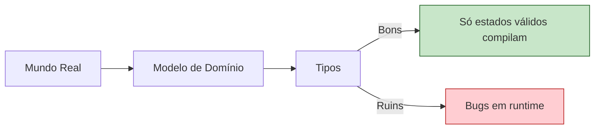
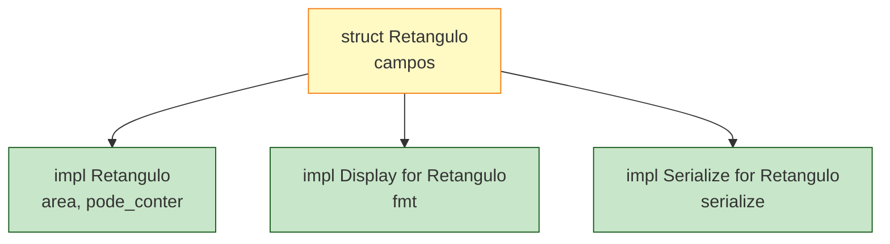
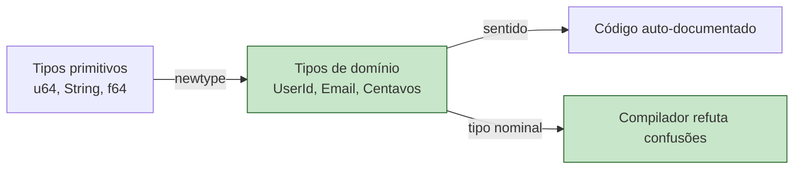

<a id="capitulo-14"></a>
# Capítulo 14: Structs — Modelando o Domínio

> *"Programs must be written for people to read, and only incidentally for machines to execute."*
> — Harold Abelson

> *"Make illegal states unrepresentable."*
> — Yaron Minsky

## 14.1 O Problema da Modelagem

Toda aplicação séria começa com a mesma pergunta: *como represento as coisas do mundo dentro do código?*

Um pedido tem um id, um cliente, uma lista de itens, um valor total e um estado. Em C, você junta isso num `struct` e escreve funções soltas que recebem ponteiros. Em Java, você cria uma classe com getters, setters e construtores. Em TypeScript, você decide entre `interface` e `class` na hora — e a escolha não é trivial. Em Go, você define um `struct` e pendura métodos com receivers. Em Rust, você define um `struct` e abre um bloco `impl` ao lado.

Cada linguagem oferece uma resposta diferente, e cada resposta carrega consigo um modelo mental de **encapsulamento**, de **identidade** e de **comportamento**. Antes de despejar sintaxe, vale uma pergunta: o que separa um bom modelo de domínio de um modelo ruim?

A resposta, vinda de Yaron Minsky, é dura e libertadora: **um bom modelo torna estados ilegais impossíveis de representar**. Não impossíveis de criar por convenção. Não impossíveis se você lembrar de validar. *Impossíveis de digitar.*

Rust não inventou esse princípio. Mas Rust dá ao programador as ferramentas mais afiadas que a indústria já teve para aplicá-lo em código de produção, sem custo de runtime, sem hierarquia de classes, sem cerimônia.



Este capítulo é sobre as três variedades de `struct` em Rust, sobre métodos e funções associadas, e sobre o padrão que talvez seja a coisa mais subestimada da linguagem: o **newtype**.

## 14.2 Struct Clássico

A forma mais comum de struct em Rust é a forma com campos nomeados. Sintaticamente, ela se parece com um objeto literal de TypeScript invertido.

```rust
struct Usuario {
    id: u64,
    email: String,
    ativo: bool,
}

let u = Usuario {
    id: 42,
    email: String::from("felipe@ness.dev"),
    ativo: true,
};
```

Em TypeScript, o equivalente é uma `interface` ou um `type`:

```ts
interface Usuario {
  id: number;
  email: string;
  ativo: boolean;
}

const u: Usuario = {
  id: 42,
  email: "felipe@ness.dev",
  ativo: true,
};
```

Em Go:

```go
type Usuario struct {
    ID    uint64
    Email string
    Ativo bool
}

u := Usuario{ID: 42, Email: "felipe@ness.dev", Ativo: true}
```

Em C:

```c
struct Usuario {
    uint64_t id;
    char* email;
    bool ativo;
};

struct Usuario u = { .id = 42, .email = "felipe@ness.dev", .ativo = true };
```

A semelhança superficial esconde diferenças profundas. Em TypeScript, `Usuario` é apenas uma forma — um nome para uma estrutura. Dois objetos com os mesmos campos satisfazem a mesma interface ainda que tenham sido criados por contextos completamente diferentes (typing estrutural). Em Rust, Go e C, `Usuario` é um **tipo nominal**: um valor de `Usuario` é distinto de qualquer outro struct com os mesmos campos. O compilador trata nomes como coisas.

Essa diferença não é estética. Em TypeScript, você pode passar um `{ id: 42, email: "...", ativo: true }` para qualquer função que espere `Usuario` mesmo que a intenção fosse `Cliente` (que tem os mesmos campos). Em Rust, isso não compila. O nome importa.

## 14.3 Field Init Shorthand e Update Syntax

Rust tem dois açúcares sintáticos que reduzem a verbosidade.

O **field init shorthand**: quando a variável local tem o mesmo nome do campo, omite a repetição.

```rust
fn novo_usuario(id: u64, email: String) -> Usuario {
    Usuario { id, email, ativo: true }
}
```

Equivale ao object shorthand de TypeScript. Em Go, não existe — `Usuario{ID: id, Email: email}` é obrigatório.

O **struct update syntax**, com `..`, copia campos de outro struct sobrescrevendo só o que muda:

```rust
let u2 = Usuario { email: String::from("novo@ness.dev"), ..u };
```

Lê como "todos os campos vêm de `u`, exceto `email`". A diferença com o spread de TypeScript: **`..u` move ou copia os campos de acordo com as regras de ownership**. Se `u` continha um `String` (não-`Copy`), `u` pode ficar inutilizável depois do update porque os campos não-`Copy` foram *movidos*. Em TS, o spread é cópia rasa de referências; em Rust, é movimentação semântica.

## 14.4 Tuple Struct e Unit Struct

Duas variantes menos comuns. O **tuple struct** tem campos sem nome, apenas posições:

```rust
struct Ponto(f64, f64);
struct Cor(u8, u8, u8);

let origem = Ponto(0.0, 0.0);
println!("x = {}, y = {}", origem.0, origem.1);
```

Parece anêmico, mas o nome carrega tipo: `Ponto(0.0, 0.0)` e três `f64` quaisquer não se confundem. Em TypeScript, tuplas são só arrays — `[number, number]` aceita qualquer par.

O **unit struct** não tem campo algum:

```rust
struct AlwaysEqual;
```

Útil para marcadores, traits em tipos vazios, fantom types. Em Go, equivale a `struct{}`; em C, não há equivalente.

## 14.5 Métodos e o Bloco impl

Em Rust, definir um struct e definir métodos sobre ele são duas etapas separadas. O struct vai num lugar, os métodos vão num bloco `impl Tipo`.

```rust
struct Retangulo {
    largura: u32,
    altura: u32,
}

impl Retangulo {
    fn area(&self) -> u32 {
        self.largura * self.altura
    }

    fn pode_conter(&self, outro: &Retangulo) -> bool {
        self.largura > outro.largura && self.altura > outro.altura
    }

    fn dobrar(&mut self) {
        self.largura *= 2;
        self.altura *= 2;
    }

    fn consumir(self) -> u32 {
        self.largura * self.altura
    }
}
```

Quatro métodos, quatro receivers diferentes. Vale isolar cada um.

`&self` é uma referência imutável. O método pode ler qualquer campo, mas não modificar nada. A maioria dos métodos cai aqui.

`&mut self` é uma referência mutável. O método pode modificar campos. Por causa das regras de borrow, *só pode existir uma referência mutável de cada vez* — o que elimina por construção uma classe inteira de bugs de aliasing.

`self` é o próprio valor, movido para dentro do método. Depois da chamada, o valor original deixa de existir. É raro, mas útil para builders e para conversões irreversíveis (`v.into_iter()`, por exemplo).

A separação entre struct e impl faz duas coisas que, juntas, são uma das maiores diferenças culturais entre Rust e Java.

Primeiro, ela permite que você abra **vários blocos `impl`** para o mesmo tipo, em arquivos diferentes, conforme o domínio. Você pode ter um `impl Retangulo` no módulo de geometria e outro no módulo de renderização. Não há a tirania da classe-mãe.

Segundo, ela permite implementar traits em qualquer lugar, sem mexer na definição do struct. Um struct é um conjunto de campos. Comportamento é externo. Essa orientação — dados de um lado, comportamento do outro — está mais perto de Go do que de Java, e é deliberadamente o oposto da herança clássica.



## 14.6 Funções Associadas

Algumas funções pertencem ao tipo, mas não a uma instância específica. Pense em construtores. Em Rust, elas vão no mesmo `impl`, mas sem o receiver `self`:

```rust
impl Retangulo {
    fn novo(largura: u32, altura: u32) -> Self {
        Self { largura, altura }
    }

    fn quadrado(lado: u32) -> Self {
        Self { largura: lado, altura: lado }
    }
}

let r = Retangulo::novo(10, 20);
let q = Retangulo::quadrado(5);
```

`Self` (com `S` maiúsculo) é um alias para o tipo do `impl`. Você poderia escrever `Retangulo` no lugar, mas `Self` é o estilo idiomático e sobrevive a renames.

A chamada usa `::` em vez de `.` porque não há instância. Isso é diretamente análogo ao `::new` que aparece em quase toda biblioteca Rust. **Rust não tem construtores especiais como Java tem `new` ou C++ tem o nome do tipo**. Convenções tomam o lugar de regras, e a comunidade convergiu em `new`, `with_capacity`, `from`, `try_from`, `default` e variantes. Cada uma é apenas uma função associada.

Comparação:

```ts
class Retangulo {
  constructor(public largura: number, public altura: number) {}

  static quadrado(lado: number): Retangulo {
    return new Retangulo(lado, lado);
  }
}

const r = new Retangulo(10, 20);
const q = Retangulo.quadrado(5);
```

```go
type Retangulo struct {
    Largura uint32
    Altura  uint32
}

func NovoRetangulo(largura, altura uint32) Retangulo {
    return Retangulo{Largura: largura, Altura: altura}
}

func Quadrado(lado uint32) Retangulo {
    return Retangulo{Largura: lado, Altura: lado}
}
```

Em Go, não há "função associada". Construtores são funções de pacote por convenção. O `Retangulo::quadrado` de Rust se torna `geometria.Quadrado`, e a relação com o tipo se torna textual, não estrutural.

## 14.7 Visibilidade

Em Rust, **todos os campos são privados ao módulo por padrão**. Para expor um campo fora do módulo, você usa `pub`:

```rust
pub struct Pedido {
    pub id: u64,
    pub cliente: String,
    valor_centavos: u64,  // privado: só código do mesmo módulo lê e escreve
}
```

Isso é diferente de Go, onde a regra é a **letra inicial** — campo com inicial maiúscula é exportado, com inicial minúscula é privado ao pacote. Diferente de TypeScript, onde por padrão tudo é público (exceto se você usar `private` em uma classe). Diferente de C, onde simplesmente *não há* o conceito — todos os campos são acessíveis a quem inclui o header.

A consequência: em C, encapsulamento é uma promessa cultural. Você escreve funções acessoras e *espera* que ninguém vá no campo direto. Em Rust, encapsulamento é **mecânico**. O compilador recusa.

Esse detalhe escala: você pode publicar uma struct cujo único campo público é o nome, manter os internos privados, e refatorar a representação sem quebrar usuários. É a mesma promessa de Java, mas sem ter que escrever 30 getters.

## 14.8 O Newtype Pattern

Chegamos no padrão que, na minha experiência, separa código Rust profissional de código Rust escrito por gente que ainda pensa em Go. O newtype é trivial em sintaxe e profundo em consequência.

A ideia é simples: envolver um tipo existente em um tuple struct com nome novo, para distinguir nomes em nível de tipo.

```rust
struct UserId(u64);
struct PostId(u64);

fn deletar_usuario(id: UserId) { /* ... */ }

let uid = UserId(42);
let pid = PostId(42);

deletar_usuario(uid);  // ok
deletar_usuario(pid);  // erro de compilação: tipos diferentes
```

Os dois são `u64` por baixo. Em runtime, `UserId(42)` e `PostId(42)` são bit a bit idênticos. O compilador, no entanto, **se recusa a confundi-los**. Trocar UserId por PostId em uma chamada de função é um erro de compilação, não um bug de produção.

Em TypeScript, você pode tentar emular com *branded types*, mas precisa de truques:

```ts
type UserId = number & { readonly __brand: "UserId" };
type PostId = number & { readonly __brand: "PostId" };

function userId(n: number): UserId { return n as UserId; }
function postId(n: number): PostId { return n as PostId; }

function deletarUsuario(id: UserId) { /* ... */ }

const uid = userId(42);
const pid = postId(42);

deletarUsuario(uid);  // ok
deletarUsuario(pid);  // erro de compilação — mas só por convenção
```

Funciona, mas o `__brand` é uma fantasma do sistema de tipos. Em runtime, é só `number`. A "marca" é falsa. E o `as UserId` é uma asserção que o TypeScript aceita sem questionar — qualquer chamada errada do construtor `userId(...)` quebra a garantia.

Em Go, branded types são quase impraticáveis. Você pode declarar `type UserId uint64`, e isso é genuíno tipo nominal. Mas todo método herdado se perde, e a conversão é frequente:

```go
type UserId uint64
type PostId uint64

func DeletarUsuario(id UserId) { /* ... */ }

var uid UserId = 42
var pid PostId = 42

DeletarUsuario(uid)         // ok
DeletarUsuario(UserId(pid)) // compila, mas você acabou de jogar a segurança fora
```

Conversão livre entre tipos numéricos é tão fácil em Go que o newtype perde força. É possível fazer disciplinadamente, mas a linguagem não pune o desleixo.

Em C, simplesmente não existe. `typedef uint64_t UserId;` cria um alias, não um tipo novo. `typedef` é puramente cosmético — qualquer `uint64_t` passa.

Por que o newtype é poderoso em Rust e morno em outras linguagens?

Três razões.

A primeira é **custo zero**. Um `struct UserId(u64)` em Rust tem o mesmo layout, o mesmo tamanho e o mesmo desempenho de um `u64`. O compilador remove a cerimônia. Em Java, você pagaria um header de objeto. Em TypeScript runtime, nada acontece (e por isso a marca é fake).

A segunda é o sistema de **traits**. Você pode pendurar `Display`, `Serialize`, `From`, `Hash` no `UserId` sem mexer no `u64`. Você adiciona conversões explícitas entre tipos quando faz sentido, e omite quando não faz. Em Go, métodos podem ser pendurados em tipos novos, mas as bibliotecas-padrão não conhecem seu tipo.

A terceira, e a mais importante, é **inferência de propósito**. Quando você lê `fn deletar(id: UserId)`, você sabe imediatamente o que esperar. O nome do tipo carrega significado de domínio. Em código com `id: u64`, você precisa caçar o contexto. Em código com `id: UserId`, o contexto está no tipo.

```rust
struct Centavos(u64);
struct Reais(f64);
struct Email(String);
struct Cpf(String);

fn cobrar(de: UserId, valor: Centavos) { /* ... */ }
```

Compare com um equivalente Go canônico:

```go
func Cobrar(deID uint64, valor uint64) { /* ... */ }
```

Os nomes dos parâmetros ajudam, mas eles vivem na assinatura. Bater de UserId em ProductId num refactor de Go é o tipo de bug que escapa de revisão. Em Rust, o compilador se recusa.



## 14.9 Modelando um Pedido

Vamos juntar tudo num exemplo concreto: um pedido de e-commerce.

```rust
struct PedidoId(u64);
struct ClienteId(u64);
struct Centavos(u64);

struct ItemPedido {
    sku: String,
    quantidade: u32,
    preco_unitario: Centavos,
}

pub struct Pedido {
    id: PedidoId,
    cliente: ClienteId,
    itens: Vec<ItemPedido>,
}

impl Pedido {
    pub fn novo(id: PedidoId, cliente: ClienteId) -> Self {
        Self {
            id,
            cliente,
            itens: Vec::new(),
        }
    }

    pub fn adicionar(&mut self, item: ItemPedido) {
        self.itens.push(item);
    }

    pub fn total(&self) -> Centavos {
        let soma = self.itens
            .iter()
            .map(|i| i.preco_unitario.0 * i.quantidade as u64)
            .sum();
        Centavos(soma)
    }
}
```

Repare em três coisas.

Primeiro, `PedidoId`, `ClienteId` e `Centavos` são newtypes. A função `novo` recebe `PedidoId` e `ClienteId` em ordem específica — *trocar a ordem na chamada é erro de compilação*. Em Go ou C, com dois `uint64`, a troca compilaria silenciosamente.

Segundo, os campos de `Pedido` são privados. Quem usa `Pedido` não tem como mexer no `Vec<ItemPedido>` por fora. Toda mutação passa por `adicionar`. Quem precisa do total chama `total()`, e a unidade do retorno é `Centavos`, não `u64` — você não vai somar centavos com reais por acidente.

Terceiro, `total` retorna `Centavos`. É o newtype trabalhando como tipo de domínio. Se algum dia você quiser trocar a representação interna por `u128` ou por uma estrutura de duas partes (parte inteira e parte decimal), você muda em um lugar, e o compilador encontra todos os pontos do código que precisam acompanhar.

## 14.10 Comparação Final

Voltemos ao ponto de partida com mais peso. **C**: struct é layout de bytes; encapsulamento é convenção; `typedef` é cosmético. **Go**: struct nominal com métodos; conversões são livres demais para newtype escalar culturalmente. **TypeScript**: `interface` é estrutural, `class` é nominal; branded types vivem só no compilador. **Rust**: struct nominal forte, `impl` separado, receiver explícito, newtype barato, traits externos.

Nenhum desses idiomas é melhor em abstrato — são apostas diferentes sobre o que importa. O que Rust faz, e que vale a pena entender mesmo que você nunca escreva uma linha em produção, é levar a sério a ideia de que **o compilador é um aliado**. Cada decisão — campos privados por padrão, receiver explícito, newtype barato, tipos nominais fortes — empurra o programador para um modelo de domínio que o compilador pode validar.

A próxima pergunta é a complementar. Structs combinam dados. Mas como modelamos *escolhas*? Como expressamos que um pedido é *ou* pendente *ou* aprovado *ou* cancelado, cada estado carregando informação distinta?

A resposta — e ela vai mais fundo do que você imagina — é o tema do próximo capítulo: **enums e pattern matching**.

---

> *"Tipos não são restrições. São documentação que o compilador verifica. Toda vez que você cria um tipo que carrega significado, você ganha um leitor incansável."*

[Próximo: Capítulo 15 — Enums e Pattern Matching →](ch15-enums-e-matching.md)
