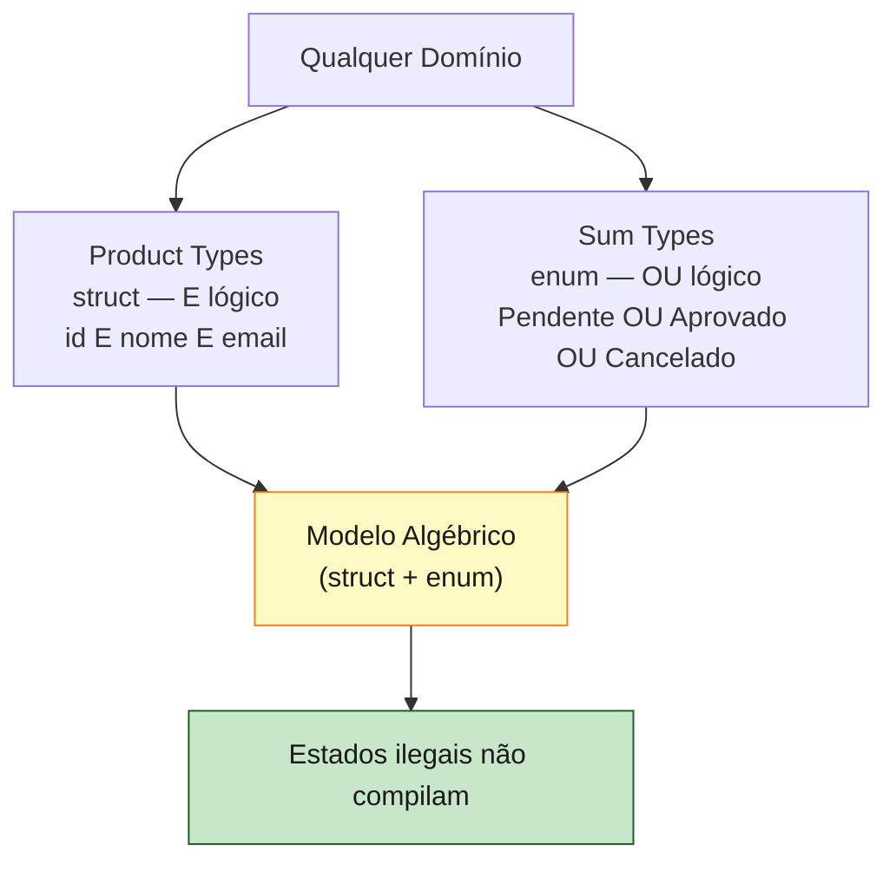
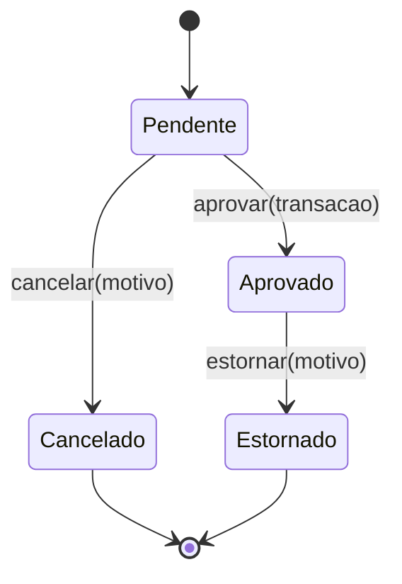

<a id="capitulo-15"></a>
# Capítulo 15: Enums e Pattern Matching — A Álgebra dos Tipos

> *"Make illegal states unrepresentable."*
> — Yaron Minsky

> *"A type system is a syntactic method for proving the absence of certain program behaviors."*
> — Benjamin C. Pierce, *Types and Programming Languages*

## 15.1 O Que um Enum Não É

Se você vem de C, Go ou Java pré-modernas, a palavra `enum` evoca uma coisa pequena: uma lista de constantes inteiras com nome.

```c
enum Estado {
    PENDENTE,    // 0
    APROVADO,    // 1
    CANCELADO    // 2
};
```

```go
type Estado int
const (
    Pendente Estado = iota
    Aprovado
    Cancelado
)
```

Esse `enum` é, no fundo, um `int` com fantasia. Ele lista nomes para valores. Não carrega dados. Não é exaustivo (em Go, `var e Estado = 99` compila sem reclamação). Não te ajuda a modelar nada além do trivial.

O `enum` de Rust é uma criatura completamente diferente. Ela vem da família ML/Haskell e se chama, na literatura de tipos, **sum type** ou **tagged union**. Esqueça `enum` de C. O nome enganou uma geração inteira.

Um sum type é a expressão da palavra **ou**. "Um pedido é *ou* pendente *ou* aprovado (com data de aprovação) *ou* cancelado (com motivo)." Cada variante pode carregar dados diferentes. O compilador rastreia qual variante você tem e impede que você acesse os dados da variante errada.

```rust
enum EstadoPedido {
    Pendente,
    Aprovado { aprovado_em: DateTime<Utc> },
    Cancelado { motivo: String },
}
```

Três variantes. A primeira não carrega nada. A segunda carrega uma data. A terceira carrega uma string. Um `EstadoPedido` *é exatamente uma* dessas três coisas em qualquer instante. Não pode ser duas. Não pode ser nenhuma.

Esse é o verdadeiro `enum` de Rust. E é a fundação sobre a qual o resto do capítulo se constrói.

## 15.2 Álgebra dos Tipos, Em Português

A teoria por trás vem do mundo funcional, mas o vocabulário cabe num parágrafo.

Um **product type** é a operação **e**. Um struct `(a, b)` carrega *um a* **e** *um b*. O número de valores possíveis é o produto: `|A| * |B|`.

Um **sum type** é a operação **ou**. Um enum `A | B` carrega *um a* **ou** *um b*. O número de valores possíveis é a soma: `|A| + |B|`.

Em Rust, structs são produtos e enums são somas. **Combinando os dois, você modela qualquer domínio.** É essa a frase que dá nome a este capítulo: a álgebra dos tipos.



A descoberta importante: linguagens com sum types decentes (Rust, Haskell, OCaml, F#, Scala, TypeScript com discriminated unions, Swift) ganham uma ferramenta que linguagens sem (Go, Java até 17, C) não têm. E essa ferramenta é o que permite seguir o conselho de Minsky.

## 15.3 Variantes Que Carregam Dados

A sintaxe é direta. Cada variante pode ser:

- **Sem dados**, como um unit struct: `Pendente`.
- **Com tupla**, como um tuple struct: `Erro(String, u32)`.
- **Com campos nomeados**, como um struct: `Aprovado { em: DateTime<Utc> }`.

```rust
enum Mensagem {
    Sair,
    Mover { x: i32, y: i32 },
    Escrever(String),
    Cor(u8, u8, u8),
}
```

Quatro variantes, quatro formas. Tudo no mesmo tipo `Mensagem`. Um `Vec<Mensagem>` pode conter as quatro misturadas, e cada elemento sabe o que é.

Em TypeScript, o equivalente é o **discriminated union**:

```ts
type Mensagem =
  | { tipo: "sair" }
  | { tipo: "mover"; x: number; y: number }
  | { tipo: "escrever"; texto: string }
  | { tipo: "cor"; r: number; g: number; b: number };
```

A semântica é parecida em compile-time, mas com diferenças importantes:

1. Em Rust, a "tag" é gerenciada pelo compilador automaticamente, e o layout pode ser otimizado (niche optimization). Em TS, você gerencia o discriminator (`tipo`) à mão.
2. Em Rust, a exaustividade do match é **enforced pelo compilador**. Em TS, depende de você usar `never` no default (e nem sempre o linter ajuda).
3. Em Rust, se você adicionar uma variante nova ao enum, *todo* match não-exaustivo quebra a build. Em TS, depende de configuração e do estilo do código.

Em Go, simplesmente não há equivalente direto. Você emula com interface vazia + type switch, mas é pesado:

```go
type Mensagem interface{ isMensagem() }

type Sair struct{}
type Mover struct{ X, Y int }
type Escrever struct{ Texto string }
type Cor struct{ R, G, B byte }

func (Sair) isMensagem()     {}
func (Mover) isMensagem()    {}
func (Escrever) isMensagem() {}
func (Cor) isMensagem()      {}
```

Funciona, mas o compilador Go não sabe se você tratou todas as alternativas no `switch`. Não há exaustividade.

Em C, ainda pior. Você usa `union` mais um campo de tag, e tudo é manual:

```c
enum Tag { SAIR, MOVER, ESCREVER, COR };

struct Mensagem {
    enum Tag tag;
    union {
        struct { int x, y; } mover;
        char* escrever;
        struct { unsigned char r, g, b; } cor;
    };
};
```

Você precisa lembrar de só ler o campo da union que corresponde à tag corrente. Se errar, comportamento indefinido. **Toda vez que você lê uma tagged union em C, está confiando em si mesmo para não enganar a si mesmo.**

## 15.4 Match Exhaustivo

A contraparte do enum em Rust é o `match`. Não é apenas um `switch` melhor. É a única forma idiomática de extrair dados de um enum, e o compilador exige que você trate **todas** as variantes.

```rust
fn descrever(m: Mensagem) -> String {
    match m {
        Mensagem::Sair => String::from("até logo"),
        Mensagem::Mover { x, y } => format!("mover para ({}, {})", x, y),
        Mensagem::Escrever(texto) => format!("escrever: {}", texto),
        Mensagem::Cor(r, g, b) => format!("cor #{:02x}{:02x}{:02x}", r, g, b),
    }
}
```

Tente omitir uma variante:

```rust
fn descrever(m: Mensagem) -> String {
    match m {
        Mensagem::Sair => String::from("até logo"),
        Mensagem::Mover { x, y } => format!("mover para ({}, {})", x, y),
        Mensagem::Escrever(texto) => format!("escrever: {}", texto),
        // Mensagem::Cor faltando!
    }
}
```

Erro de compilação:

```
error[E0004]: non-exhaustive patterns: `Mensagem::Cor(_, _, _)` not covered
```

Esse erro é o que mantém código Rust seguro através de refatorações. Você adiciona uma variante nova ao enum e o compilador te leva, *ferida por ferida*, a cada lugar que precisa atualizar. Em Go ou C, você precisa caçar manualmente. Em TS, depende do strict.

`match` também é uma **expressão**, não uma instrução. Ela retorna valor:

```rust
let descricao = match m {
    Mensagem::Sair => "saída",
    _ => "outra coisa",
};
```

O `_` casa qualquer valor — é o catch-all. Use com cuidado: ele desliga a verificação de exaustividade para os casos posteriores.

## 15.5 if let, while let, let else

Match exaustivo é poderoso, mas verboso quando você só quer um caso. Rust oferece três açúcares.

`if let` extrai um único padrão e ignora o resto:

```rust
if let Mensagem::Escrever(texto) = m {
    println!("recebeu texto: {}", texto);
}
```

`while let` continua loopando enquanto o padrão casa:

```rust
let mut pilha = vec![1, 2, 3];
while let Some(topo) = pilha.pop() {
    println!("{}", topo);
}
```

`let else` é mais novo e mais útil do que parece. Ele extrai o padrão ou aborta o caminho atual:

```rust
fn processar(m: Mensagem) -> String {
    let Mensagem::Escrever(texto) = m else {
        return String::from("ignorado");
    };
    // a partir daqui, `texto` está disponível e tipado como String
    texto.to_uppercase()
}
```

Esse `let else` é o pareamento idiomático para guardas iniciais. Em vez de aninhar:

```rust
fn processar(m: Mensagem) -> String {
    if let Mensagem::Escrever(texto) = m {
        texto.to_uppercase()
    } else {
        String::from("ignorado")
    }
}
```

Você acha plano:

```rust
fn processar(m: Mensagem) -> String {
    let Mensagem::Escrever(texto) = m else { return String::from("ignorado"); };
    texto.to_uppercase()
}
```

Early return + happy path no nível principal. É a versão Rust do guard clause.

## 15.6 Match Guards

Às vezes o padrão precisa de uma condição extra. Match guards adicionam uma cláusula `if`:

```rust
fn classificar(n: i32) -> &'static str {
    match n {
        x if x < 0 => "negativo",
        0 => "zero",
        x if x % 2 == 0 => "positivo par",
        _ => "positivo ímpar",
    }
}
```

O guard é avaliado depois do padrão casar, e só permite o braço se for `true`. Cuidado: **guards desabilitam a checagem de exaustividade**. O compilador não consegue provar que `x if x < 0` mais `x if x >= 0` cobrem tudo, então você precisa do `_` no fim.

## 15.7 Padrões Avançados

`match` aceita uma riqueza de padrões. Os mais úteis no dia a dia:

```rust
match (a, b) {
    (0, 0) => "origem",
    (x, 0) => "no eixo x",
    (0, y) => "no eixo y",
    _ => "geral",
}

match cor {
    Cor { r: 255, g: 0, b: 0 } => "vermelho puro",
    Cor { r, g, b } if r == g && g == b => "tom de cinza",
    _ => "outra",
}

match n {
    1 | 2 | 3 => "pequeno",
    4..=10 => "médio",
    _ => "grande",
}

match valor {
    n @ 1..=99 => format!("ainda dois dígitos: {}", n),
    _ => String::from("fora"),
}
```

Tuplas, structs, alternativas com `|`, ranges com `..=`, e `@` que liga uma variável ao valor casado para você usar dentro do braço. Tudo composável.

Padrões em Rust não vivem só em `match`. Eles aparecem em `let`, em parâmetros de função, em `for`, em `if let`. Aprender padrões é aprender a destruturação universal da linguagem.

## 15.8 Estados de Pedido nas Quatro Linguagens

Vamos sair do abstrato. Imagine que você precisa modelar o estado de um pedido em e-commerce: pendente, aprovado (com data e id da transação), cancelado (com motivo), e estornado (com data, id da transação original e motivo).

Em **C**:

```c
enum EstadoTag {
    PENDENTE,
    APROVADO,
    CANCELADO,
    ESTORNADO
};

struct Pedido {
    enum EstadoTag tag;
    char* aprovado_em;        // só válido se APROVADO ou ESTORNADO
    char* transacao_id;        // só válido se APROVADO ou ESTORNADO
    char* cancelado_motivo;    // só válido se CANCELADO ou ESTORNADO
    char* estornado_em;        // só válido se ESTORNADO
};
```

Cinco campos, todos sempre presentes na struct. A regra de qual é válido em qual estado vive em **comentários**. Compilador não sabe nada. Cada acesso é uma promessa.

Em **Go**:

```go
type Estado int
const (
    Pendente Estado = iota
    Aprovado
    Cancelado
    Estornado
)

type Pedido struct {
    Estado            Estado
    AprovadoEm        *time.Time
    TransacaoID       *string
    CanceladoMotivo   *string
    EstornadoEm       *time.Time
}
```

Pouco melhor: ponteiros nulos sinalizam ausência. Mas qualquer combinação compila. Você pode ter `Estado: Pendente` com `AprovadoEm` preenchido, e nada explode até alguém ler. A integridade vive em validações em runtime espalhadas pela base.

Em **TypeScript**:

```ts
type EstadoPedido =
  | { tipo: "pendente" }
  | { tipo: "aprovado"; aprovadoEm: Date; transacaoId: string }
  | { tipo: "cancelado"; motivo: string }
  | { tipo: "estornado"; aprovadoEm: Date; transacaoId: string; estornadoEm: Date; motivo: string };

type Pedido = { id: string; estado: EstadoPedido };
```

Bom. Discriminated union impede de você acessar `aprovadoEm` num pedido cujo `tipo` é `"pendente"`. Match exaustivo via `switch (estado.tipo)` com `never` no default funciona se o tsconfig estiver afinado. **Em runtime, no entanto, o `tipo` é só um campo string** — se você desserializar um JSON malformado, pode acabar com um `Pedido` que o sistema de tipos garante mas a realidade não.

Em **Rust**:

```rust
struct PedidoId(String);
struct TransacaoId(String);

enum EstadoPedido {
    Pendente,
    Aprovado {
        aprovado_em: DateTime<Utc>,
        transacao: TransacaoId,
    },
    Cancelado {
        motivo: String,
    },
    Estornado {
        aprovado_em: DateTime<Utc>,
        transacao: TransacaoId,
        estornado_em: DateTime<Utc>,
        motivo: String,
    },
}

struct Pedido {
    id: PedidoId,
    estado: EstadoPedido,
}
```

Cada variante carrega *exatamente* os campos que fazem sentido. Não existe `Pendente` com `transacao_id` preenchido — não compila. Não existe `Aprovado` sem data — não compila. O compilador exige que toda função que manipula `EstadoPedido` trate todas as variantes.

```rust
fn pode_estornar(estado: &EstadoPedido) -> bool {
    matches!(estado, EstadoPedido::Aprovado { .. })
}

fn registrar_estorno(estado: EstadoPedido, motivo: String) -> EstadoPedido {
    match estado {
        EstadoPedido::Aprovado { aprovado_em, transacao } => EstadoPedido::Estornado {
            aprovado_em,
            transacao,
            estornado_em: Utc::now(),
            motivo,
        },
        outro => outro,  // estados que não permitem estorno passam direto
    }
}
```

A função `registrar_estorno` é total: ela trata o caso `Aprovado` (a única transição válida) e captura o resto sem perder nenhuma variante. Adicione uma variante nova `Estornado` ao enum amanhã, e o compilador vai encontrar essa função e te avisar.



Compare a quantidade de comentários, regras culturais e validações em runtime que C e Go precisam para garantir o que Rust e TS garantem com tipos. E compare a qualidade da garantia entre Rust e TS: Rust te protege em compile-time *e* em runtime (a tag é parte do layout, não um campo de string).

## 15.9 Matches Aninhados e Composição

Padrões compõem. Você pode casar uma variante de enum com um struct que carrega outro enum por dentro:

```rust
enum Resposta {
    Ok(EstadoPedido),
    Erro(String),
}

fn descrever(r: Resposta) -> String {
    match r {
        Resposta::Ok(EstadoPedido::Pendente) => String::from("ok, ainda processando"),
        Resposta::Ok(EstadoPedido::Aprovado { transacao, .. }) => {
            format!("aprovado: transação {}", transacao.0)
        }
        Resposta::Ok(_) => String::from("ok, outro estado"),
        Resposta::Erro(msg) => format!("erro: {}", msg),
    }
}
```

Cada padrão pode ir tão fundo quanto você precisa. O compilador continua exigindo exaustividade. Em TypeScript, esse aninhamento é feito com `if`/`switch` aninhados, e a exaustividade fica difícil de manter manualmente. Em Go ou C, vira código declarativo de validação.

## 15.10 Estados Impossíveis Impossíveis

A frase de Minsky no topo deste capítulo é mais que slogan. Ela é um critério de design.

Voltemos ao struct C que tinha cinco campos opcionais conforme a tag. Pergunta: quantos estados aquela struct pode representar?

Tag tem 4 valores. Cada um dos quatro `char*` pode ser `NULL` ou não-`NULL`. São `4 * 2^4 = 64` combinações no total. Quantas são válidas? Quatro:

- `PENDENTE` com tudo `NULL`.
- `APROVADO` com `aprovado_em` e `transacao_id` preenchidos, resto `NULL`.
- `CANCELADO` com `cancelado_motivo` preenchido, resto `NULL`.
- `ESTORNADO` com tudo preenchido.

**Sessenta dos sessenta e quatro estados são ilegais.** A linguagem permite todos. Sua disciplina, suas validações em runtime, seus testes de integração — eles existem para impedir os 60 estados que a linguagem não impede.

Em Rust, com o enum bem modelado, o tipo tem **exatamente 4 estados representáveis**. Os 60 inválidos não existem. Não precisam ser validados. Não podem ser construídos. O compilador, ele mesmo, garante a integridade do modelo.

É essa redução — de 64 estados para 4 — que se quer dizer com "estados ilegais impossíveis". A álgebra dos tipos transforma "validar que o estado é coerente" em "o estado é coerente por construção".

Quanto custa em runtime? Quase nada. O enum em Rust ocupa o tamanho da maior variante mais uma tag pequena. Niche optimization aproveita padrões de bits que não aparecem em campos válidos para representar a tag, e em alguns casos `Option<&T>` tem o mesmo tamanho de `&T`. A álgebra é puramente compile-time.

## 15.11 Por Que Isso Muda Como Você Programa

Programar com sum types decentes muda a postura do programador.

Em vez de pensar "o que pode dar errado em runtime", você pensa "como modelo isso para que dar errado seja impossível". É a mesma virada mental que `String` vs `char*` produz: você para de programar defensivamente porque o compilador é o defensor.

O custo é o investimento inicial em modelagem. Você precisa pensar em estados, transições, dados que cada estado carrega. Você precisa ler o domínio antes de digitar. Mas esse pensamento, que em Go ou C teria virado validações espalhadas e bugs em produção, em Rust é capturado *uma vez* na definição do enum.

Vale repetir: enum em Rust não é uma lista de constantes. É a meia que faltava do par com structs. Combinando os dois, você modela qualquer coisa. E o compilador trabalha junto com você o caminho inteiro.

A próxima pergunta segue naturalmente. Vimos o `enum` carregando dados em qualquer variante. E o caso mais comum, mais elegante e mais transformador desse padrão? **Representar a presença ou ausência de um valor.** Representar sucesso ou falha. Fazer com que `null` deixe de existir.

É sobre isso o próximo capítulo: `Option` e `Result`, e a morte do bilhão-de-dólares-em-bugs que Tony Hoare colocou no mundo em 1965.

---

> *"Tipos não são uma camada de validação. Tipos são o domínio. O resto é teatro."*

[Próximo: Capítulo 16 — Option e Result →](ch16-option-e-result.md)
