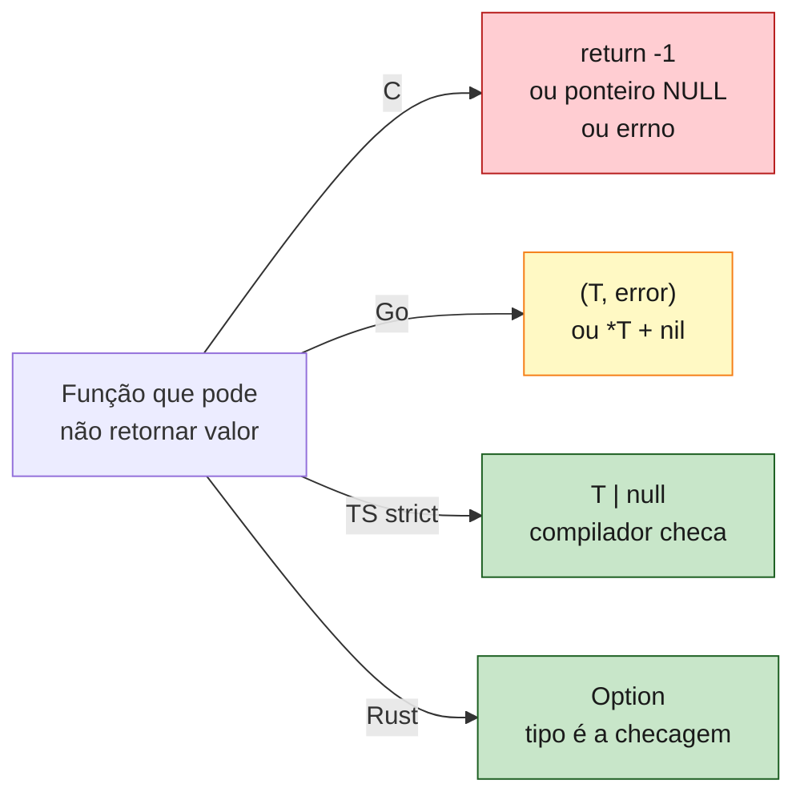
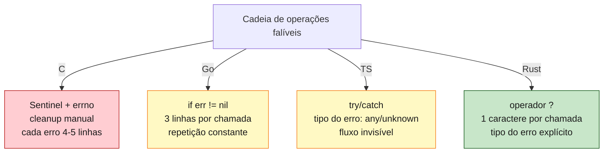

<a id="capitulo-16"></a>
# Capítulo 16: Option e Result — A Morte do Null

> *"I call it my billion-dollar mistake. It was the invention of the null reference in 1965."*
> — Tony Hoare

> *"Errors are values."*
> — Rob Pike

## 16.1 O Erro de Mil Milhões de Dólares

Em 2009, Tony Hoare subiu num palco em Londres e fez uma confissão pública. Em 1965, projetando o ALGOL W, ele introduziu o conceito de **null reference** porque era fácil de implementar. Ele admitiu, quarenta e quatro anos depois, que essa decisão custou à indústria mais de um bilhão de dólares em bugs, *crashes* e horas perdidas.

A confissão dele é específica. Hoare não disse que valores opcionais são uma má ideia. Ele disse que confundir "ausência" com "qualquer referência" foi catastrófico. Em qualquer linguagem com null, **toda referência mente**. `String s` em Java promete ser uma string e pode ser `null`. `*Customer` em C pode estar apontando para nada. Cada acesso a um campo é uma roleta russa, e a única defesa é uma cultura de checagem que ninguém sustenta em escala.

A história do null é um dos casos mais claros de como uma decisão de linguagem propaga bugs por décadas. Heartbleed teve null pointer dereferences. Stagefright teve null pointer dereferences. Quase todo NullPointerException de Java é, no fundo, o programador esquecendo que aquela referência podia ser nada.

A pergunta do capítulo é a seguinte: **e se a linguagem te impedisse de confundir presença com ausência?**

A resposta de Rust é `Option<T>`, e ela é, na minha opinião, um dos três motivos mais fortes para usar Rust em produção.

## 16.2 Option<T>

Em Rust, o tipo de um valor diz, no nível do tipo, se ele pode ou não estar ausente.

```rust
enum Option<T> {
    Some(T),
    None,
}
```

É um enum com duas variantes. `Some(T)` carrega um valor de tipo `T`. `None` representa ausência. Não existe `null` em Rust. Não existe referência inválida. Se uma função pode não retornar valor, ela retorna `Option<T>`.

```rust
fn buscar_usuario(id: u64) -> Option<Usuario> {
    if id == 0 {
        None
    } else {
        Some(Usuario { id, nome: String::from("Felipe") })
    }
}
```

Quem chama precisa lidar com a possibilidade de `None`. Não dá para pegar o `Usuario` direto. O compilador exige que você abra o envelope.

```rust
let u = buscar_usuario(42);
println!("{}", u.nome);  // erro de compilação: u é Option<Usuario>, não Usuario
```

Isso é a diferença. Em Java, `Usuario u = buscarUsuario(42)` compila. Você descobre em runtime que `u` é `null` quando faz `u.getNome()` e o sistema explode. Em Rust, **a explosão é em compile-time**. Você não consegue gerar um binário que confunda `Option<Usuario>` com `Usuario`.

Em TypeScript, a melhor aproximação é `Usuario | null` ou `Usuario | undefined`. O compilador (com `strictNullChecks`) força você a checar. É bom — é a coisa mais próxima de Rust nesse aspecto. Mas há uma diferença: em runtime, `null` e `undefined` são valores especiais que o JavaScript carrega. Você ainda pode esbarrar em `undefined` que veio de fora (de um JSON, de uma chamada não tipada, de uma biblioteca antiga). Em Rust, `Option<T>` é um tipo. Não há um valor universal de "nada" que possa se infiltrar.

Em Go, a convenção é retornar `(T, error)` ou `(T, bool)` ou um ponteiro. Cada uma é uma pequena variação:

```go
func BuscarUsuario(id uint64) (*Usuario, error) {
    if id == 0 {
        return nil, errors.New("id inválido")
    }
    return &Usuario{ID: id, Nome: "Felipe"}, nil
}
```

Compila bem. O compilador, no entanto, **não te impede** de fazer `u.Nome` sem checar se `u` é `nil`. Você ganha um nil pointer dereference em runtime, igual a Java. A convenção de checar `err != nil` ajuda — mas é cultural, não estrutural.

Em C, a referência aponta para qualquer canto da memória. Não há nem um conceito.



## 16.3 Métodos do Option

Trabalhar com `Option<T>` em Rust não é um exercício de `match` infinito. O tipo carrega uma biblioteca rica de métodos que tornam o uso natural.

`unwrap` extrai o valor ou panica:

```rust
let u = buscar_usuario(42).unwrap();  // panica se for None
```

Use só quando você sabe, por construção, que o valor existe. Em código de produção, `unwrap` é red flag em quase toda revisão. Em testes e protótipos, é confortável.

`expect` é como `unwrap`, mas com mensagem:

```rust
let u = buscar_usuario(42).expect("usuário 42 deveria existir aqui");
```

A mensagem aparece no panic. É melhor que `unwrap` quando você precisa documentar a invariante. Use `expect` para invariantes verdadeiras (algo que *não pode* acontecer), não para erros esperados.

`unwrap_or` retorna o valor ou um default:

```rust
let nome = buscar_usuario(42)
    .map(|u| u.nome)
    .unwrap_or(String::from("anônimo"));
```

`unwrap_or_else` é a versão preguiçosa, que aceita uma closure para gerar o default só se necessário. Use quando o default é caro de calcular.

`map` transforma o valor de dentro sem se preocupar com `None`:

```rust
let tamanho_nome: Option<usize> = buscar_usuario(42).map(|u| u.nome.len());
```

Se for `Some(u)`, vira `Some(u.nome.len())`. Se for `None`, continua `None`. Você nunca precisa escrever o `if`.

`and_then` é o `map` para funções que também retornam `Option`. Em outras linguagens chama `flatMap`:

```rust
fn email_do_usuario(id: u64) -> Option<String> {
    buscar_usuario(id).and_then(|u| u.email)
}
```

Se `buscar_usuario` retornar `None`, o resultado é `None`. Se retornar `Some(u)` mas `u.email` for `None`, o resultado é `None`. Se ambos derem certo, é `Some(email)`. Sem aninhamento. Sem if/else.

`or_else` é o gêmeo de `and_then` para o caso `None`:

```rust
let u = buscar_usuario(42)
    .or_else(|| buscar_no_cache(42))
    .or_else(|| Some(usuario_padrao()));
```

Cadeia de fallbacks. Cada `or_else` só é chamado se o anterior deu `None`.

`ok_or` converte `Option<T>` em `Result<T, E>`:

```rust
let u: Result<Usuario, &str> = buscar_usuario(42).ok_or("usuário não encontrado");
```

É a ponte entre o mundo de "ausência aceitável" e o mundo de "ausência é erro". Você usa muito em código de aplicação que recebe um `Option` de uma camada baixa e quer transformar a falta em erro propagável.

Compare com TypeScript. Para encadear "buscar usuário, pegar email, transformar em uppercase":

```ts
const email = (() => {
  const u = buscarUsuario(42);
  if (u === null) return null;
  if (u.email === null) return null;
  return u.email.toUpperCase();
})();
```

Em Rust:

```rust
let email = buscar_usuario(42)
    .and_then(|u| u.email)
    .map(|e| e.to_uppercase());
```

Linear, declarativo, sem aninhamento. O tipo guia.

## 16.4 Result<T, E>

`Option<T>` é para ausência. **Erros** são uma história mais rica: você quer não só dizer "deu errado", você quer dizer **por que**. O tipo para isso em Rust é `Result<T, E>`.

```rust
enum Result<T, E> {
    Ok(T),
    Err(E),
}
```

Outro enum genérico. `Ok(T)` carrega o valor de sucesso. `Err(E)` carrega o erro. O parâmetro `E` é seu — você define que tipo representa as falhas do seu domínio.

```rust
fn dividir(a: i32, b: i32) -> Result<i32, String> {
    if b == 0 {
        Err(String::from("divisão por zero"))
    } else {
        Ok(a / b)
    }
}
```

Quem chama trata os dois lados:

```rust
match dividir(10, 2) {
    Ok(n) => println!("resultado: {}", n),
    Err(msg) => eprintln!("erro: {}", msg),
}
```

A diferença com Go é instrutiva. Em Go:

```go
func Dividir(a, b int) (int, error) {
    if b == 0 {
        return 0, errors.New("divisão por zero")
    }
    return a / b, nil
}

n, err := Dividir(10, 2)
if err != nil {
    log.Println("erro:", err)
    return
}
fmt.Println("resultado:", n)
```

Funciona. Mas o `n` *já é um valor* mesmo no caminho de erro (vale `0`, o zero value). Nada impede você de usar `n` antes de checar `err`. A regra "sempre cheque o erro primeiro" é cultural, e a linguagem entrega o valor "vazio" como se fosse legítimo.

Em Rust, o `n` só existe dentro de `Ok(n)`. Você é forçado a abrir o envelope. Não há "valor padrão" que esteja por aí enganando ninguém.

Em C, o padrão histórico é pior. Funções retornam `-1`, `NULL`, ou um código global em `errno`. O valor de retorno carrega uma sinalização específica do contexto, sem tipo:

```c
int dividir(int a, int b) {
    if (b == 0) {
        errno = EINVAL;
        return -1;  // mas e se -1 é resultado válido?
    }
    return a / b;
}

int n = dividir(10, 0);
if (n == -1) {  // como diferenciar erro de resultado -1?
    perror("erro");
}
```

Você tem que conhecer cada função para saber qual valor é o sentinel. Cada API inventa o seu. Em projetos grandes, ninguém checa todos os returns. Erros somem na poeira. CVEs nascem assim.

## 16.5 O Operador `?`

Lidar com cadeia de `Result` no estilo `match` viraria pesadelo:

```rust
fn carregar_config(caminho: &str) -> Result<Config, Erro> {
    let arquivo = match abrir(caminho) {
        Ok(f) => f,
        Err(e) => return Err(e),
    };
    let texto = match ler(&arquivo) {
        Ok(t) => t,
        Err(e) => return Err(e),
    };
    let config = match parsear(&texto) {
        Ok(c) => c,
        Err(e) => return Err(e),
    };
    Ok(config)
}
```

Rust resolve isso com o operador `?`. Posfixo, um caractere, *propaga o erro*:

```rust
fn carregar_config(caminho: &str) -> Result<Config, Erro> {
    let arquivo = abrir(caminho)?;
    let texto = ler(&arquivo)?;
    let config = parsear(&texto)?;
    Ok(config)
}
```

Cada `?` significa: "se for `Err`, retorne agora; se for `Ok`, extraia o valor". A função fica linear, lendo como se erros não existissem — mas eles existem, e cada `?` é um ponto de saída visível.

`?` também funciona com `Option<T>`, propagando `None`:

```rust
fn dominio_do_email(id: u64) -> Option<String> {
    let u = buscar_usuario(id)?;
    let email = u.email?;
    let dominio = email.split('@').nth(1)?;
    Some(dominio.to_string())
}
```

Compare com Go:

```go
func CarregarConfig(caminho string) (Config, error) {
    arquivo, err := Abrir(caminho)
    if err != nil {
        return Config{}, err
    }
    texto, err := Ler(arquivo)
    if err != nil {
        return Config{}, err
    }
    config, err := Parsear(texto)
    if err != nil {
        return Config{}, err
    }
    return config, nil
}
```

Três `if err != nil { return ...err }` consecutivos. É o ritmo característico de Go. A linguagem fez essa escolha deliberadamente — sem `?`, sem exceções, todo erro é tratado explicitamente. Mas a verbosidade é real, e ela torna fácil esquecer um caso.

Em C, é prece e disciplina:

```c
int carregar_config(const char* caminho, struct Config* out) {
    FILE* f = fopen(caminho, "r");
    if (!f) return -1;

    char* texto = ler_tudo(f);
    if (!texto) { fclose(f); return -2; }

    int parse_err = parsear(texto, out);
    free(texto);
    fclose(f);
    if (parse_err) return -3;

    return 0;
}
```

Cada falha precisa lembrar de liberar os recursos abertos antes. Esquecer um `fclose` ou um `free` é leak. Isso é exatamente o tipo de coisa que produz CVEs em código C robusto.

Em TypeScript, o equivalente clássico é exception throwing:

```ts
async function carregarConfig(caminho: string): Promise<Config> {
  const arquivo = await abrir(caminho);
  const texto = await ler(arquivo);
  return parsear(texto);
}
```

Limpo, mas o sistema de tipos não diz **quais** erros podem vir. Você precisa ler a doc, olhar a implementação ou rezar para o try/catch que envolve isso lá em cima saber tratar tudo. Java tem checked exceptions, mas elas são tão amadas quanto câncer. Rust escolheu tornar erros parte do tipo de retorno, mas com sintaxe leve.



## 16.6 Antes e Depois: Parsing nas Quatro Linguagens

Vamos a um exemplo concreto. Função: receber uma string, parsear como inteiro, dividir por outro inteiro recebido também como string.

**C:**

```c
#include <errno.h>
#include <stdlib.h>
#include <stdio.h>

int parsear_e_dividir(const char* a, const char* b, int* out) {
    char* fim;
    errno = 0;
    long va = strtol(a, &fim, 10);
    if (errno != 0 || *fim != '\0') return -1;

    errno = 0;
    long vb = strtol(b, &fim, 10);
    if (errno != 0 || *fim != '\0') return -2;

    if (vb == 0) return -3;

    *out = (int)(va / vb);
    return 0;
}
```

A função retorna um `int` que codifica três tipos de erro diferentes (`-1`, `-2`, `-3`) e o sucesso (`0`), e o resultado real vem por ponteiro de saída. Parsing usa `strtol`, que sinaliza erro pela combinação de `errno`, valor de retorno e ponteiro `fim`. Quem chama precisa saber tudo isso.

**Go:**

```go
func ParsearEDividir(a, b string) (int, error) {
    va, err := strconv.Atoi(a)
    if err != nil {
        return 0, fmt.Errorf("a inválido: %w", err)
    }
    vb, err := strconv.Atoi(b)
    if err != nil {
        return 0, fmt.Errorf("b inválido: %w", err)
    }
    if vb == 0 {
        return 0, errors.New("divisão por zero")
    }
    return va / vb, nil
}
```

Razoável. O retorno é tipado. Cada `if err != nil` adiciona linhas. O resultado de sucesso é `(va / vb, nil)`; o resultado de erro é `(0, err)` — onde o `0` é semanticamente lixo, mas o Go te força a colocar.

**TypeScript:**

```ts
function parsearEDividir(a: string, b: string): number {
  const va = Number(a);
  if (Number.isNaN(va)) throw new Error(`a inválido: ${a}`);

  const vb = Number(b);
  if (Number.isNaN(vb)) throw new Error(`b inválido: ${b}`);

  if (vb === 0) throw new Error("divisão por zero");

  return Math.trunc(va / vb);
}
```

Curto, mas o `throw` é invisível na assinatura. Quem chama não sabe pelo tipo que esta função pode lançar. Para tornar explícito, muita gente está adotando `Result` em TypeScript via libs (`neverthrow`, `effect`), mas é convenção, não linguagem. E `Number(a)` é traiçoeiro: `Number(" ")` é `0`, não `NaN`. Você precisa de um parse mais cuidadoso.

**Rust:**

```rust
use std::num::ParseIntError;

#[derive(Debug)]
enum Erro {
    ParseA(ParseIntError),
    ParseB(ParseIntError),
    DivPorZero,
}

fn parsear_e_dividir(a: &str, b: &str) -> Result<i32, Erro> {
    let va: i32 = a.parse().map_err(Erro::ParseA)?;
    let vb: i32 = b.parse().map_err(Erro::ParseB)?;
    if vb == 0 {
        return Err(Erro::DivPorZero);
    }
    Ok(va / vb)
}
```

A assinatura te diz tudo: pode falhar, e o erro é do tipo `Erro`. O caller pode `match` sobre `Erro` e tratar cada variante. O `?` propaga sem cerimônia. `map_err` converte um erro de uma camada (parse de inteiro) em um erro do seu domínio (variante específica de `Erro`).

Linhas de código no fluxo principal? Quatro. Pontos de saída por erro? Três, todos visíveis (`?` e `return Err`). Tipo de erro? Conhecido em compile-time, exaustivo no `match`.

## 16.7 Padrão de Composição

Uma das marcas de código Rust idiomático é a composição de `Result` e `Option`:

```rust
fn cobrar_de_email(email: &str, valor: u32) -> Result<Recibo, Erro> {
    let usuario = buscar_por_email(email)
        .ok_or(Erro::UsuarioNaoEncontrado)?;
    let cartao = usuario.cartao_padrao
        .ok_or(Erro::SemMetodoDePagamento)?;
    let cobranca = processar_pagamento(&cartao, valor)?;
    Ok(Recibo::novo(usuario.id, cobranca))
}
```

Cada linha é uma operação que pode falhar. `ok_or` transforma `Option` em `Result`. `?` propaga. O happy path está plano, no nível mais externo. Erros saem cedo. É o equivalente a guard clauses, mas com tipo carregando o motivo da saída.

Compare a mesma função em Go:

```go
func CobrarDeEmail(email string, valor uint32) (Recibo, error) {
    usuario, err := BuscarPorEmail(email)
    if err != nil {
        return Recibo{}, err
    }
    if usuario == nil {
        return Recibo{}, ErrUsuarioNaoEncontrado
    }
    if usuario.CartaoPadrao == nil {
        return Recibo{}, ErrSemMetodoDePagamento
    }
    cobranca, err := ProcessarPagamento(usuario.CartaoPadrao, valor)
    if err != nil {
        return Recibo{}, err
    }
    return NovoRecibo(usuario.ID, cobranca), nil
}
```

Não é ruim. É legível. Mas tem o triplo do código de cerimônia, e duas das verificações (`usuario == nil`, `CartaoPadrao == nil`) são *manuais* — em Rust, o tipo `Option` te força a fazer, e o `ok_or` é o adaptador idiomático.

## 16.8 Por Que Option É Um Dos Maiores Motivos Pra Usar Rust

Voltemos ao começo. Tony Hoare disse "billion-dollar mistake" em 2009 sobre uma decisão de 1965. Quase todo bug crítico em C, C++, Java, ou qualquer linguagem com referências nullable, traz no fundo a mesma pergunta: *e se essa coisa fosse nula?*

Linguagens responderam com paliativos. Java adicionou `Optional<T>` em 2014, mas referências continuam nullable. Kotlin marcou nullability no tipo (`String?` vs `String`), grande passo, mas convive com Java em runtime. Swift fez o mesmo. TypeScript com `strictNullChecks` é genuinamente seguro em compile-time, mas o JavaScript por baixo carrega `null` e `undefined` como cidadãos de primeira.

Rust eliminou null. Não há `null`. Não há referência inválida. Não há `nil`. O custo dessa decisão é zero em runtime: `Option<&T>` ocupa o mesmo tamanho de `&T`, porque o compilador usa o ponteiro nulo internamente como tag de `None`. **Você ganha segurança total sem pagar nem um byte.**

E ela permite uma postura diferente. Quando você programa em Rust, você para de pensar "essa referência pode ser nula". Você pensa "essa função retorna o quê — `T`, `Option<T>`, `Result<T, E>`?". O tipo te diz a resposta. O tipo é o contrato. A regra "sempre cheque" deixa de ser cultural e vira mecânica.

Tem razão para esse capítulo ser o último da parte sobre tipos compostos. Os três anteriores te deram structs, enums e patterns. Este te deu o uso mais transformador deles: a substituição completa do null por dois enums simples.

Programadores que migram para Rust e ficam costumam dizer que `Option` e `Result` são as features que mais sentem falta quando voltam a outras linguagens. Quando você experimenta um sistema de tipos onde "função pode falhar" e "função pode não retornar nada" são tão visíveis quanto o nome da função, você não consegue mais aceitar a alternativa.

Se este livro te der só uma coisa, que seja a intuição de que **a ausência de null não é luxo. É o estado natural de uma linguagem que leva o programador a sério.**

A Parte 5 se fecha aqui. Você tem agora a álgebra completa: structs para combinar, enums para escolher, `Option` para ausência, `Result` para falha. Com esse vocabulário, você consegue modelar qualquer domínio.

A próxima parte do livro vai além de modelar dados. Ela trata de **abstrair comportamento** — generics e traits, o sistema que permite que esse vocabulário se estenda para qualquer tipo, com performance de C e flexibilidade de Haskell.

---

> *"O melhor erro é o que não compila. O segundo melhor é o que tem tipo. O pior é aquele que ninguém viu até o cliente ligar."*

[Próximo: Capítulo 17 — Generics e Traits →](../part-06-abstractions/ch17-generics-e-traits.md)

