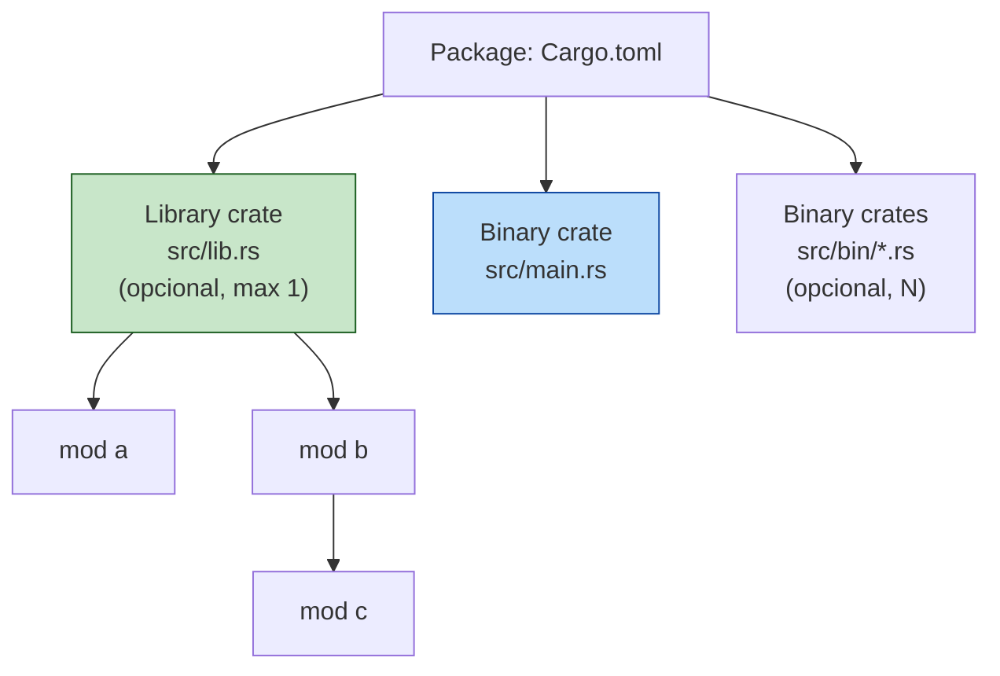

<a id="capitulo-17"></a>
# Capítulo 17: Crates, Módulos e Paths

> *"Um sistema deveria ser visto como uma família de sistemas, e não como um único sistema."*
> — David Parnas, *On the Criteria To Be Used in Decomposing Systems into Modules* (1972)

> *"There are only two hard things in Computer Science: cache invalidation and naming things."*
> — Phil Karlton

## 17.1 O Problema de Crescer

Todo programa começa pequeno. Um arquivo, dezenas de linhas, três funções, um `main`. O autor entende tudo de cabeça. Não há módulos porque não há nada para separar.

Aí o programa cresce. Aparecem 200, 500, 2.000 linhas no mesmo arquivo. Nomes começam a colidir — duas funções `parse`, três tipos `Config`. O autor faz a primeira manobra inevitável: divide o arquivo. E nesse momento — antes de qualquer linha de código novo — ele entrou no domínio mais antigo e mais subestimado da engenharia de software: **o sistema de módulos**.

Linguagens diferem brutalmente em como respondem a esse momento.

| Linguagem | Como nasce um módulo | Como se referencia |
|---|---|---|
| **C** | `#include "foo.h"` — o pré-processador *cola texto* | global. Nomes únicos no programa inteiro. |
| **TypeScript** | cada arquivo é um módulo. `export` declara saída. | `import { x } from "./foo"` — path do arquivo. |
| **Go** | a *pasta* é um pacote. Sem hierarquia interna. | `import "github.com/x/y/foo"` — pasta. |
| **Rust** | módulo é uma *árvore* de itens, separável de arquivos. | `crate::foo::bar`, `super::`, `self::` — caminho na árvore. |

Note a diferença categórica: em Go e TS, módulo é *artefato do filesystem*. Em Rust, módulo é *artefato da linguagem* — o filesystem é só uma conveniência opcional.

Este capítulo explica como Rust enxerga decomposição: a unidade de compilação (**crate**), a árvore de namespaces (**módulos**), e a sintaxe que viaja por essa árvore (**paths**).

## 17.2 Crate: A Unidade Real de Compilação

Em C, a unidade de compilação é o *arquivo `.c`*. Cada `.c` vira um `.o`, e o linker une tudo no fim. O resultado é que o "programa" não existe enquanto entidade da linguagem — só o linker sabe.

Em Rust, a unidade de compilação é o **crate**. Um crate é uma *árvore inteira de módulos* compilada de uma vez como um conjunto. O compilador (`rustc`) recebe um arquivo raiz e segue todas as declarações `mod` recursivamente. Tudo isso vira *uma* unidade — um binário, ou uma `.rlib`.

Há exatamente dois tipos:

```rust
// 1. BINARY CRATE — tem fn main(), produz um executável.
// Arquivo raiz: src/main.rs
fn main() {
    println!("um executável");
}
```

```rust
// 2. LIBRARY CRATE — não tem fn main(), produz uma rlib reusável.
// Arquivo raiz: src/lib.rs
pub fn somar(a: i32, b: i32) -> i32 {
    a + b
}
```

Um *package* (definido no `Cargo.toml`, capítulo 19) pode conter:

- no máximo **um** library crate (em `src/lib.rs`)
- zero ou mais **binary crates** (em `src/main.rs` e `src/bin/*.rs`)

Essa distinção é deliberada. Um package típico de aplicação tem `lib.rs` (toda a lógica reutilizável e testável) + `main.rs` (apenas o entry point que chama o lib). Isso permite testes de integração contra o lib sem expor o `main`.



Compare com Go. Em Go, a unidade equivalente seria o *package*, e a unidade de "tudo junto" é o *module* (Go module, com `go.mod`). Mas Go não distingue lib de bin no nível do package: o package vira binário se tiver `package main` e `func main()`, senão é importável. Funciona, mas é menos explícito.

Compare com TypeScript. TS não tem unidade de compilação no sentido de Rust — o `tsc` compila arquivos para `.js`, e o "programa" só existe quando um runtime (Node, Deno, browser) os carrega. A "compilação" de um app TS é em larga medida feita pelo bundler (esbuild, webpack, rollup). Rust não tem essa ambiguidade: `cargo build` produz *o* artefato.

## 17.3 Módulos: Árvores Dentro do Crate

Dentro de um crate, módulos formam uma *árvore*. A raiz da árvore é o arquivo raiz (`lib.rs` ou `main.rs`), implicitamente chamada de `crate`.

A forma mais direta de declarar um módulo é **inline**:

```rust
// src/lib.rs
mod restaurante {
    mod salao {
        fn atender_cliente() {}
        fn anotar_pedido() {}
    }

    mod cozinha {
        fn preparar_prato() {}
    }
}
```

Isso é uma árvore:

```
crate
└── restaurante
    ├── salao
    │   ├── atender_cliente
    │   └── anotar_pedido
    └── cozinha
        └── preparar_prato
```

Note que `mod foo { ... }` cria um *namespace nomeado*. Não há nenhuma alusão a arquivos. Em projetos pequenos, é razoável manter tudo num arquivo só.

A diferença com Go é direta: em Go, você não pode aninhar pacotes dentro de um arquivo. Cada pacote é uma pasta. Rust permite hierarquia *dentro* de um arquivo — é uma propriedade da linguagem, não do filesystem.

A diferença com C é categórica: C não tem módulos. Tem `#include`, que é colagem textual antes da compilação. Dois `.c` que incluem o mesmo `.h` veem definições duplicadas a menos que o `.h` use *include guards* (`#ifndef FOO_H`). Não há namespace, não há encapsulamento, não há árvore — só um pool global de símbolos com convenções de prefixo (`SDL_Init`, `glClear`).

## 17.4 Paths: Endereço na Árvore

Para *referenciar* um item em outra parte do crate, Rust usa **paths**. Um path é uma sequência de identificadores separados por `::`, análogo a `/` no filesystem ou `.` em Java.

Existem duas formas:

- **Absoluto**: começa em `crate::` (a raiz).
- **Relativo**: começa em `self::` (o módulo atual), `super::` (o pai), ou no nome de um módulo filho diretamente.

```rust
mod restaurante {
    pub mod salao {
        pub fn atender_cliente() {
            // chamando irmão via super
            super::cozinha::preparar_prato();
        }
    }

    pub mod cozinha {
        pub fn preparar_prato() {}
    }
}

pub fn abrir() {
    // chamando da raiz: caminho absoluto
    crate::restaurante::salao::atender_cliente();

    // ou caminho relativo (estamos na raiz)
    restaurante::salao::atender_cliente();
}
```

O equivalente em TypeScript seria misturar `import` absoluto e relativo:

```ts
// TS — sintaxe diferente, ideia parecida
import { atender } from "./restaurante/salao";          // relativo
import { abrir } from "@/restaurante";                  // absoluto (path mapping)
```

Mas note: em TS, *caminhos* são caminhos *de arquivo*. Em Rust, são caminhos *na árvore lógica de módulos*, que pode ou não corresponder a arquivos. É um nível de indireção a mais — e mais flexibilidade.

Em Go, o equivalente é o import path completo: `import "github.com/foo/bar/baz"`. Não há `super::` em Go. Para subir um nível, você re-importa explicitamente. Go troca expressividade por simplicidade declarada.

### 17.4.1 `self::`, `super::`, `crate::` — quando usar qual

Regra prática:

- **`crate::`** — quando o item está em outra subárvore. Estável a refactors locais.
- **`super::`** — quando o item está no módulo pai. Bom para módulos irmãos que se conhecem.
- **`self::`** — raramente necessário; serve para desambiguar quando o nome colide com algo externo.
- **path nu** (sem prefixo) — para módulos filhos diretos.

```rust
mod a {
    pub fn x() {}

    pub mod b {
        pub fn y() {
            super::x();           // sobe para a, chama a::x
            crate::a::x();        // absoluto, mesmo efeito
            self::z();            // explícito; idêntico a só "z()"
        }
        pub fn z() {}
    }
}
```

## 17.5 Arquivos: A Convenção, não a Linguagem

Tudo até aqui foi *árvore lógica* de módulos. Em projetos reais, queremos *arquivos separados*. Rust permite, mas a separação é convenção sobre uma feature explícita.

A regra: `mod foo;` (sem chaves, com ponto-e-vírgula) **diz ao compilador para procurar o conteúdo de `foo` em outro arquivo**.

Onde? Em uma de duas localizações, na ordem:

1. `src/foo.rs` (preferido, idiomatic moderno)
2. `src/foo/mod.rs` (estilo antigo, ainda válido)

```
src/
├── lib.rs           // contém: mod restaurante;
├── restaurante.rs   // o conteúdo do módulo
```

Para módulos com submódulos, qualquer estilo serve, mas misturar é o canônico hoje:

```
src/
├── lib.rs                  // mod restaurante;
├── restaurante.rs          // mod salao; mod cozinha;
├── restaurante/
│   ├── salao.rs            // conteúdo de restaurante::salao
│   └── cozinha.rs          // conteúdo de restaurante::cozinha
```

Note: `restaurante.rs` está **fora** da pasta `restaurante/`, no mesmo nível. Esse é o estilo novo, idiomatic desde a edition 2018.

O estilo antigo era:

```
src/
├── lib.rs
├── restaurante/
│   ├── mod.rs              // o que hoje é restaurante.rs
│   ├── salao.rs
│   └── cozinha.rs
```

Funciona, mas leva à praga conhecida do "n abas chamadas `mod.rs`" no editor. Prefira o estilo novo a menos que esteja num projeto legado consistente.

### 17.5.1 Comparação rápida com TS, Go e C

```ts
// TS: arquivo = módulo, inferido. Sem declaração mod.
// src/restaurante/salao.ts
export function atender() {}

// src/index.ts
import { atender } from "./restaurante/salao";
```

```go
// Go: pasta = pacote. Sem hierarquia. Todos os .go da pasta compõem um pacote.
// restaurante/salao.go
package restaurante
func Atender() {}
```

```c
// C: sem módulos. Texto colado pelo pré-processador.
// restaurante.h
#ifndef RESTAURANTE_H
#define RESTAURANTE_H
void atender_cliente(void);
#endif
```

Diferenças decisivas:

- **TS** infere módulo do filesystem; Rust *exige* `mod foo;` declarado. Para Rust o filesystem é só paginação; a árvore lógica é fonte da verdade.
- **Go** não permite módulos aninhados — pasta `salao/` seria outro pacote independente. Rust permite hierarquia *dentro* de um pacote, com acesso privilegiado em cada nível.
- **C** não tem namespace. `atender_cliente` é símbolo global; duas libs com o mesmo nome se chocam no linker. Em Rust, o crate é namespace implícito.

## 17.6 `use`: O Atalho

Escrever `crate::restaurante::salao::atender_cliente()` toda vez é insuportável. `use` traz um path para o escopo:

```rust
use crate::restaurante::salao::atender_cliente;

pub fn abrir() {
    atender_cliente();   // direto
    atender_cliente();   // de novo, sem repetir o path
}
```

`use` é apenas um *alias* léxico. Não move código, não compila nada extra. É equivalente moralmente a `import` em TS ou `import` em Go.

### 17.6.1 Convenções idiomáticas de `use`

A comunidade convergiu em três regras:

**1. Para funções, importe o módulo pai, não a função.**

```rust
// Idiomatic
use crate::restaurante::salao;
salao::atender_cliente();

// Não idiomatic
use crate::restaurante::salao::atender_cliente;
atender_cliente();   // de onde veio essa função?
```

A primeira forma deixa óbvio na chamada de onde veio a função. A segunda esconde.

**2. Para tipos (struct, enum, trait), importe o tipo direto.**

```rust
use std::collections::HashMap;

let mut m: HashMap<String, i32> = HashMap::new();
```

Tipos têm nome único o suficiente para não causar confusão.

**3. Quando há colisão, use `as` ou importe o pai.**

```rust
use std::fmt::Result;
use std::io::Result as IoResult;       // alias

fn render() -> Result { /* ... */ }
fn ler() -> IoResult<String> { /* ... */ }
```

### 17.6.2 Re-exports com `pub use`

`pub use` faz duas coisas: traz o item para o escopo (como `use`) **e** o re-exporta como se estivesse declarado aqui. É a ferramenta primária para *desenhar* a API pública de um crate sem se acoplar à organização interna.

```rust
// src/lib.rs
mod implementacao_chata {
    pub mod detalhes_internos {
        pub struct Cliente { /* ... */ }
    }
}

// API pública: o usuário escreve `restaurante::Cliente`,
// não `restaurante::implementacao_chata::detalhes_internos::Cliente`.
pub use implementacao_chata::detalhes_internos::Cliente;
```

Isso é central. Volta no capítulo 18 com mais peso.

## 17.7 Glob, Grupos, e o Bom Senso

Sintaxes adicionais úteis:

```rust
// Grupo: várias coisas do mesmo pai
use std::collections::{HashMap, HashSet, BTreeMap};

// self dentro de grupo: traz o próprio módulo + um item
use std::io::{self, Read, Write};
// equivale a:
// use std::io;
// use std::io::Read;
// use std::io::Write;

// Glob: traz tudo que é público
use std::collections::*;
```

**Aviso sobre `use ... ::*`**: úteis em testes (`use super::*;` para puxar tudo do módulo pai num bloco `#[cfg(test)] mod tests`) e em preludes deliberados. Em código normal, evite. Glob esconde a origem dos nomes e quebra ferramentas de "go to definition" mais cedo do que se gostaria.

## 17.8 Um Exemplo Completo

Um pequeno crate de biblioteca, `gestao_pedido`. A API pública expõe `Pedido` e `criar`; a implementação tem detalhes que não queremos vazar.

```
gestao_pedido/
└── src/
    ├── lib.rs
    ├── pedido.rs
    └── pedido/
        ├── itens.rs
        └── total.rs
```

```rust
// src/lib.rs
mod pedido;
pub use pedido::{criar, Pedido};
```

```rust
// src/pedido.rs
mod itens;
mod total;

use itens::Item;

pub struct Pedido { itens: Vec<Item> }

pub fn criar() -> Pedido { Pedido { itens: Vec::new() } }

impl Pedido {
    pub fn adicionar(&mut self, nome: &str, preco_centavos: u32) {
        self.itens.push(Item::novo(nome, preco_centavos));
    }
    pub fn total_centavos(&self) -> u32 { total::somar(&self.itens) }
}
```

```rust
// src/pedido/itens.rs
pub struct Item { pub nome: String, pub preco_centavos: u32 }
impl Item {
    pub fn novo(nome: &str, preco_centavos: u32) -> Self {
        Self { nome: nome.to_string(), preco_centavos }
    }
}

// src/pedido/total.rs
use super::itens::Item;
pub fn somar(itens: &[Item]) -> u32 {
    itens.iter().map(|i| i.preco_centavos).sum()
}
```

O consumidor escreve `use gestao_pedido::{criar, Pedido};` e nunca precisa saber que existe um módulo `total`, um tipo `Item`, ou um campo `itens`. Toda essa estrutura é *invisível*. O `lib.rs` definiu uma fachada com duas linhas — a árvore exportada não precisa ser a árvore interna. Capítulo 18 trata dessa escolha com disciplina.

## 17.9 Onde Estamos

| Conceito | Em uma linha |
|---|---|
| **crate** | Unidade de compilação. Binário ou lib. Raiz: `main.rs` ou `lib.rs`. |
| **mod foo { ... }** | Cria namespace inline. |
| **mod foo;** | Carrega de `foo.rs` (ou `foo/mod.rs`). |
| **path** | `crate::a::b`, `super::a`, `self::a`, ou `a::b` (relativo). |
| **use** | Atalho léxico. Traz nome para escopo. |
| **pub use** | Re-exporta. Define a API. |

Ainda falta a peça mais política do sistema: *quem vê o quê*. `pub`, `pub(crate)`, `pub(super)`, e a filosofia por trás de "tudo privado por padrão". É o que vem a seguir.

---

> *"O sistema de módulos não é sobre organizar código. É sobre proteger o futuro do código de você mesmo no presente."*

[Próximo: Capítulo 18 — Visibilidade e Organização →](ch18-visibilidade.md)
