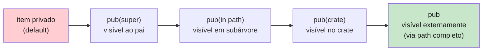
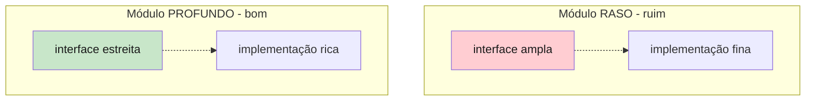

<a id="capitulo-18"></a>
# Capítulo 18: Visibilidade e Organização

> *"Modules whose interfaces are simple are deep modules — they hide enormous complexity behind a tiny surface."*
> — John Ousterhout, *A Philosophy of Software Design*

> *"A primary goal of programming language design is to limit the scope of mistakes."*
> — Tony Hoare

## 18.1 O Default Importa

Em toda decisão de design de linguagem, o padrão é mais influente do que qualquer outra coisa. O programador médio escreve o código no caminho que oferece menos resistência. Se o caminho de menor resistência é "tudo público", a base de código fica pública. Se é "tudo privado", o programador precisa *justificar* cada exposição — e a base de código fica encapsulada.

Compare os defaults:

| Linguagem | Default de exposição | Como tornar público |
|---|---|---|
| **Java** | package-private (sem keyword) | `public` |
| **C#** | `internal` (assembly) | `public` |
| **Python** | público (convenção `_` para "privado") | nada |
| **JavaScript/TS** | privado a menos que `export` | `export` |
| **Go** | privado a menos que capitalize | nomear com maiúscula |
| **C** | global a menos que `static` | nada (usar `extern`) |
| **Rust** | privado | `pub` (com variantes finas) |

Rust escolheu o caminho mais conservador possível: tudo privado por padrão, com as exposições graduadas. É o oposto de C, e mais explícito que Go.

A consequência prática: em Rust, *escrever uma API pública é um ato deliberado*. Você não vaza acidentalmente. Você precisa digitar `pub` em cada item que quer expor.

## 18.2 `pub`: A Forma Bruta

A keyword `pub` torna um item visível **um nível acima** na árvore de módulos. Não mais. É um detalhe que confunde quem vem de Java, onde `public` significa "visível ao universo".

```rust
mod a {
    mod b {
        pub fn x() {}    // pública DENTRO de a, não fora dele
    }

    pub fn chama() {
        b::x();          // OK — estamos em a, vemos b::x
    }
}

fn main() {
    // crate::a::b::x();   // ❌ erro: módulo b é privado
    crate::a::chama();      // OK — chama é pub em a, e a é alcançável
}
```

Para que `a::b::x` seja chamável da raiz, *todos* os elementos do path precisam ser visíveis daquele ponto: `a` precisa ser pub na raiz, `b` precisa ser pub em `a`, `x` precisa ser pub em `b`. Encadeamento de visibilidade.

Isso é deliberado. Permite exatamente o caso "este módulo é público mas a maquinaria interna não".

### 18.2.1 `pub` em structs e enums

Structs e enums têm uma sutileza própria.

**Em uma struct, `pub` no tipo é independente de `pub` nos campos.**

```rust
mod modelo {
    pub struct Cliente {
        pub nome: String,
        idade: u32,           // privado mesmo com a struct sendo pub
    }

    impl Cliente {
        pub fn novo(nome: &str, idade: u32) -> Self {
            Self { nome: nome.to_string(), idade }
        }

        pub fn idade(&self) -> u32 { self.idade }
    }
}

fn main() {
    let c = modelo::Cliente::novo("Maria", 30);
    println!("{}", c.nome);          // OK — campo pub
    // println!("{}", c.idade);      // ❌ campo privado
    println!("{}", c.idade());       // OK — método pub
}
```

Esse design força o que em outras linguagens é convenção: para invariantes que dependem de mais de um campo, exponha *métodos*, não campos. Java e TypeScript permitem mas não forçam — todo dev sênior já viu o pesadelo de uma classe que evolui campos públicos.

**Em uma enum, `pub` torna *todas* as variantes públicas.**

```rust
pub enum Status {
    Ativo,
    Inativo,
    Banido(String),
}
```

Não há `pub` por variante. A justificativa: se o usuário pode chegar à enum, ele precisa fazer `match` exaustivo, e isso exige conhecer todas as variantes. Esconder uma variante quebra o pattern matching.

### 18.2.2 Compare com TypeScript

```ts
// TS: visibilidade por campo, em runtime ou só em compilação
class Cliente {
  public nome: string;
  private idade: number;        // só TS — apagado em runtime
  #pin: string;                  // ECMAScript private — runtime real

  constructor(nome: string, idade: number, pin: string) {
    this.nome = nome;
    this.idade = idade;
    this.#pin = pin;
  }

  getIdade() { return this.idade; }
}
```

TS tem três níveis (`public`, `protected`, `private`) que existem só em compilação, mais a sintaxe `#privado` que existe em runtime. Confuso. Rust não tem essa dualidade — privacidade é estática e absoluta.

### 18.2.3 Compare com Go

```go
// Go: capitalização decide visibilidade
type Cliente struct {
    Nome  string  // exportado (visível fora do package)
    idade int     // não exportado
}

func (c Cliente) Idade() int { return c.idade }
```

Go é simples e direto, mas tem um problema: a *intenção* de exportar fica embutida no nome. Renomear `idade` para `Idade` é uma mudança semântica grande disfarçada de tipográfica. Em Rust, `pub` é uma keyword distinta — visível em diff, em revisões, em busca textual.

## 18.3 As Variantes Finas: `pub(crate)`, `pub(super)`, `pub(in path)`

`pub` simples é binário: privado ou aberto. Rust oferece visibilidades intermediárias para casos comuns.

### 18.3.1 `pub(crate)` — público no crate, privado fora

Item visível em qualquer lugar dentro do mesmo crate, mas *não* exposto a consumidores externos.

```rust
// src/lib.rs
mod interno {
    pub(crate) fn ferramenta() {}
}

// pode ser chamada de qualquer módulo do crate
fn uso() {
    interno::ferramenta();
}

// fora do crate, `interno::ferramenta` é invisível
```

Esse é provavelmente o nível mais útil em projetos médios. A maior parte do código de um lib não é "API" nem "detalhe local" — é *infraestrutura interna do crate*. `pub(crate)` é a etiqueta para isso.

Análogo direto: o `internal` de C# (visível ao assembly), e o "package-private" do Java (visível ao package). Go não tem equivalente — em Go, ou é exportado para todo o mundo ou nada.

### 18.3.2 `pub(super)` — público ao módulo pai

```rust
mod a {
    mod b {
        pub(super) fn x() {}    // visível em a, mas não em a::b::c
    }

    fn uso() { b::x(); }       // OK
}
```

Útil quando um módulo filho oferece uma "view" ao pai sem expor lateralmente. Raro mas tem seu lugar.

### 18.3.3 `pub(in path)` — público em um caminho específico

```rust
mod a {
    pub mod b {
        pub(in crate::a) fn x() {}    // visível em qualquer descendente de a
    }

    pub mod c {
        pub fn uso() { super::b::x(); }   // OK, c está em a
    }
}
```

Granularidade máxima. Use quando você tem uma família de módulos que precisa compartilhar um helper, mas não quer expandir a visibilidade desse helper para o crate inteiro.

### 18.3.4 Quadro mental



Lendo da esquerda para a direita: cada nível afrouxa a privacidade um pouco mais. Comece da esquerda e *só* afrouxe quando precisar.

## 18.4 Por Que "Default Privado" Importa

Encapsulamento não é estética. É *opcionalidade*. Um campo privado pode ser renomeado, retipado, removido, dividido em dois — sem quebrar consumidor algum. Um campo público é um contrato com todos os usuários conhecidos e desconhecidos.

Toda linha de código pública é um *passivo de manutenção*. Se você vaza um detalhe que mais tarde quer mudar, suas opções são: (a) quebrar usuários (nas libs maduras, isso é catastrófico), (b) manter o detalhe para sempre, mesmo prejudicando o design.

Hyrum's Law: *"with a sufficient number of users of an API, all observable behaviors of your system will be depended on by somebody"*. Tudo o que é visível é, eventualmente, depended-upon. Default privado é a profilaxia.

Compare o ônus em cada linguagem:

```rust
// Rust: para vazar é preciso digitar pub. Você sabe quando vazou.
pub struct Config {
    pub porta: u16,
}
```

```python
# Python: o universo é público. _privado é convenção. _privado é esperança.
class Config:
    porta = 8080  # público de fato. Use _porta? Os usuários ignoram.
```

```ts
// TS: privado em compilação. Em runtime, qualquer um pode ler.
class Config {
  private porta = 8080;  // tsc reclama. Reflection passa.
}
```

```c
// C: visível a quem incluir o header. Sem header? "static" no .c.
struct Config { int porta; };  // todo .c que incluir o .h vê o campo
```

A força de Rust não é apenas oferecer níveis finos — é que o caminho de menor resistência é o mais seguro.

## 18.5 Re-exports: Desenhando a Fachada

A árvore *interna* de módulos serve à clareza dos autores. A árvore *exposta* serve à sanidade dos usuários. As duas raramente devem coincidir.

`pub use` é o instrumento para divergir as duas. Re-exporta um item de profundidade arbitrária como se ele fosse um filho direto da raiz (ou de qualquer módulo intermediário).

```rust
// src/lib.rs
mod core_engine {
    pub mod scheduler {
        pub struct Job { /* ... */ }
        pub fn agendar(_: Job) {}
    }

    pub mod execution {
        pub struct Resultado { /* ... */ }
    }
}

mod transport {
    pub mod http {
        pub fn iniciar() {}
    }
}

// API CURADA — apenas isto é o contrato externo
pub use core_engine::scheduler::{Job, agendar};
pub use core_engine::execution::Resultado;
pub use transport::http::iniciar as iniciar_servidor;
```

O usuário escreve:

```rust
use minha_lib::{Job, agendar, Resultado, iniciar_servidor};

let j = Job { /* ... */ };
agendar(j);
iniciar_servidor();
```

Ele não sabe — e nunca precisará saber — que `Job` mora em `core_engine::scheduler`, que existe um módulo `transport`, que `http::iniciar` foi renomeado a `iniciar_servidor` na fachada. Tudo isso pode mudar; a API permanece.

Esse padrão tem nome em outros idiomas. Em TS, é o famigerado **barrel file** (`index.ts` re-exportando seus vizinhos). Em Java, é *less common* mas se faz com classes de fachada. Em Go, em geral, *não se faz*: você reorganiza pacotes, e usuários reimportam.

A diferença: em TS, o barrel file é uma *prática*; em Rust, `pub use` é parte da sintaxe. Não tem alternativa — não há `export *` automático. Se você não escrever `pub use`, nada vaza. O sistema *exige* a curadoria.

### 18.5.1 Renomeando na fronteira

Combinar `pub use ... as` permite renomear a API pública sem renomear a implementação:

```rust
mod implementacao {
    pub fn fazer_o_b_de_alta_complexidade_v2() { /* ... */ }
}

pub use implementacao::fazer_o_b_de_alta_complexidade_v2 as fazer_b;
```

Útil quando o nome interno é histórico ou descritivo demais e o nome externo deve ser conciso.

### 18.5.2 O padrão `lib.rs` como índice

Uma forma idiomática de organizar libs maduras:

```rust
// src/lib.rs

// 1. módulos privados (implementação)
mod parser;
mod analyzer;
mod codegen;
mod optimizations;

// 2. módulos públicos (subdivisão deliberada da API)
pub mod errors;     // tipos de erro precisam ser nomeados
pub mod config;     // config é uma área legítima

// 3. re-exports do "core" para a raiz
pub use parser::{parse, Ast};
pub use analyzer::analyze;
pub use codegen::compile;

// 4. preludes opcionais
pub mod prelude {
    pub use super::{parse, analyze, compile};
    pub use super::errors::Error;
}
```

Quem usa o lib pode escolher:

- `use minha_lib::parse;` — pegar item por item.
- `use minha_lib::prelude::*;` — pegar o conjunto canônico.
- `use minha_lib::errors::Error;` — entrar num subnamespace deliberado.

O `lib.rs` virou *o índice editorial* do crate. É a primeira coisa que um leitor abre para entender o que a lib faz, sem precisar mapear a árvore inteira.

## 18.6 Deep Modules: A Filosofia Por Trás

John Ousterhout argumenta em *A Philosophy of Software Design* que a métrica certa de um módulo bom é a *razão entre profundidade e largura da interface*. Um módulo profundo *esconde muito* atrás de uma *superfície pequena*. Um módulo raso expõe quase tudo o que faz.



O sistema de módulos de Rust *favorece* módulos profundos:

1. Default privado força a pergunta "isso *precisa* ser público?".
2. `pub(crate)` e `pub(super)` permitem compartilhar sem expor.
3. `pub use` permite uma fachada estreita sobre uma implementação ramificada.

Um sintoma de módulo raso em Rust: `lib.rs` com `pub mod` para todo módulo do crate, sem `pub use`, deixando o usuário importar pelos paths internos. Isso é, na prática, "barrel automático" — o pior dos dois mundos: nenhum encapsulamento e nenhuma curadoria. Evite.

Um sintoma de módulo bem desenhado: `lib.rs` lista poucos itens públicos, alguns submódulos públicos *com nome semântico* (`config`, `errors`, `prelude`), e a maior parte da estrutura interna invisível.

## 18.7 Caso Real: Como `serde` se Apresenta

`serde` é a biblioteca de serialização padrão de Rust. Sua árvore interna tem dezenas de módulos. Sua API:

```rust
// O que o usuário escreve, 99% do tempo:
use serde::{Serialize, Deserialize};

#[derive(Serialize, Deserialize)]
struct Pedido { /* ... */ }
```

Apenas dois nomes. Por trás, há módulos para cada formato (`ser`, `de`), para macros, para implementações por tipo, para lifetimes especiais. O usuário típico nunca sabe — e quando precisa, encontra subnamespaces nomeados (`serde::de::Visitor`, `serde::ser::SerializeMap`).

Esse é o padrão a copiar. Pequena fachada para o caso comum. Subnamespaces nomeados para quem precisa de mais.

## 18.8 Onde Estamos

| Mecanismo | Quando usar |
|---|---|
| (sem `pub`) | Default. Item de implementação local. |
| `pub(super)` | Cooperação entre irmãos próximos. |
| `pub(in path)` | Compartilhar dentro de uma sub-árvore específica. |
| `pub(crate)` | Infraestrutura interna do crate. **O mais comum em libs grandes.** |
| `pub` | API exportável. Trate cada uma como contrato. |
| `pub use` | Curar a fachada. Esconder a estrutura interna. |
| `pub mod prelude` | Conjunto canônico para `use prelude::*;`. |

O sistema é fino, mas o uso é direto se você se lembrar de uma regra:

> **Comece privado. Promova só sob demanda. Use `pub use` para que a árvore externa não seja a árvore interna.**

Falta agora a peça que faz tudo isso operacional: a ferramenta que compila, testa, formata, lint-a, publica e resolve dependências. Essa ferramenta é Cargo.

---

> *"Visibility is not a feature. It is a discipline that the language helps you keep."*

[Próximo: Capítulo 19 — Cargo: O Maestro →](ch19-cargo.md)
