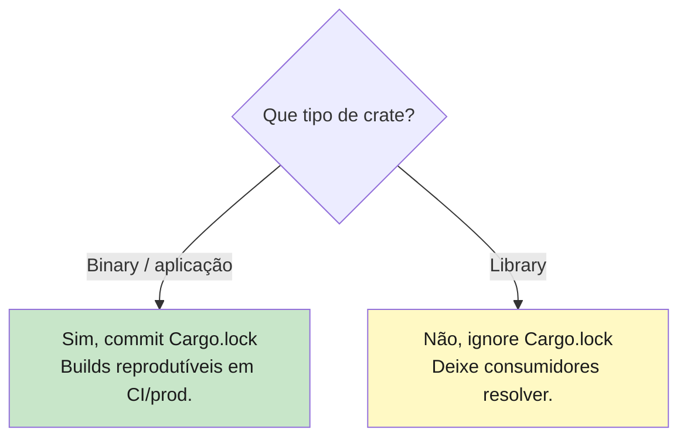
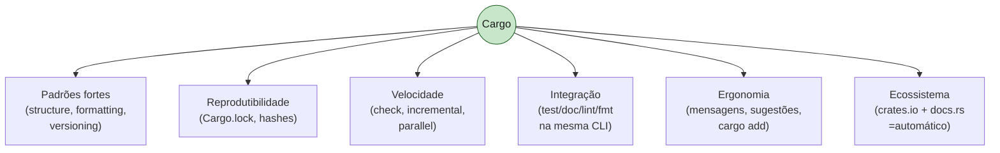

<a id="capitulo-19"></a>
# Capítulo 19: Cargo, O Maestro

> *"A great tool teaches you how to use it; a mediocre tool requires you to learn how."*
> — Brian Kernighan, parafraseado

> *"Cargo is the best dependency manager I've ever used. Period."*
> — comentário recorrente em surveys de devs vindos de C, C++ e Python

## 19.1 O Que Cargo Resolve

Toda linguagem séria precisa responder, com uma ferramenta única, a sete perguntas:

1. Como crio um projeto novo?
2. Como compilo?
3. Como rodo testes?
4. Como adiciono uma dependência?
5. Como garanto builds reprodutíveis?
6. Como formato e lint-o o código?
7. Como gero documentação?

Linguagens *novas* respondem essas sete com uma ferramenta. Linguagens *antigas* respondem com um zoológico de ferramentas independentes que mal se falam.

Compare:

| Linguagem | Pergunta 1 (criar) | 2 (build) | 3 (test) | 4 (deps) | 5 (lock) | 6 (lint) | 7 (docs) |
|---|---|---|---|---|---|---|---|
| **C** | manual / `autoconf` | `make` / `cmake` / `meson` | catch2/gtest manual | sistema operacional / vcpkg | nenhum oficial | clang-format / clang-tidy | doxygen |
| **TypeScript** | `npm init` / `pnpm init` | `tsc` / bundler | `vitest` / `jest` | `npm`/`pnpm`/`yarn` | `package-lock.json` | `eslint` + `prettier` | `typedoc` |
| **Go** | `go mod init` | `go build` | `go test` | `go get` | `go.sum` | `gofmt` / `golangci-lint` | `go doc` |
| **Rust** | `cargo new` | `cargo build` | `cargo test` | `cargo add` | `Cargo.lock` | `cargo fmt` / `cargo clippy` | `cargo doc` |

Go e Rust são as duas linguagens da era moderna que chegaram com tudo na mesma ferramenta. C é o oposto extremo: uma combinação artesanal de programas que a comunidade jamais conseguiu unificar. TS está em algum lugar no meio — `npm` resolve quase tudo, mas linting, build e tipos vivem em ferramentas separadas.

Cargo não é apenas conveniente. É *ideológico*. A premissa: o ecossistema só prospera se a fricção operacional for próxima de zero.

## 19.2 Anatomia de um Package

```bash
$ cargo new meu_app
     Created binary (application) `meu_app` package
```

Isso gera:

```
meu_app/
├── Cargo.toml
├── .gitignore
└── src/
    └── main.rs
```

Para uma library:

```bash
$ cargo new minha_lib --lib
     Created library `minha_lib` package
```

```
minha_lib/
├── Cargo.toml
├── .gitignore
└── src/
    └── lib.rs
```

`Cargo.toml` é o manifesto do package. É TOML — sintaxe deliberadamente boba, sem aspas malucas como JSON, sem indentação significativa como YAML. Ler um `Cargo.toml` é como ler `.ini` arrumado.

```toml
[package]
name = "meu_app"
version = "0.1.0"
edition = "2024"

[dependencies]
```

Apenas três campos obrigatórios: `name`, `version`, `edition`.

- `name` — identificador único na cadeia de dependências.
- `version` — SemVer.
- `edition` — qual *edition* da linguagem você está usando (2015, 2018, 2021, 2024). Edition é o mecanismo de Rust para evoluir a linguagem sem quebrar código antigo: cada edition pode mudar reservas de palavras, defaults, etc., e crates de editions diferentes inter-operam.

## 19.3 Os Seis Comandos Cotidianos

```bash
cargo new <nome>     # criar package
cargo check          # validação rápida (não gera binário)
cargo build          # compilar (debug por padrão)
cargo run            # build + executar
cargo test           # build de teste + executar
cargo build --release  # otimização total para produção
```

### 19.3.1 `cargo check` — o segredo da produtividade

`cargo check` faz *toda a análise estática* — type-check, borrow-check, name resolution, trait resolution — mas *não gera código*. Para um codebase Rust de tamanho médio, é entre 3 e 10× mais rápido que `cargo build`.

```bash
$ cargo check
    Checking serde v1.0.193
    Checking tokio v1.35.1
    Checking meu_app v0.1.0
    Finished dev [unoptimized] target(s) in 8.42s

$ cargo build
   Compiling serde v1.0.193
   Compiling tokio v1.35.1
   Compiling meu_app v0.1.0
    Finished dev [unoptimized] target(s) in 47.13s
```

Em desenvolvimento, **rode `cargo check` o tempo todo, `cargo build` raramente**. Isso é uma diferença material no fluxo. Em TS, `tsc --noEmit` cumpre função similar. Em Go, `go build` já é tão rápido que não compensa separar. Em C, "validar sem compilar" não é uma opção que existe.

### 19.3.2 `cargo run` — atalho

`cargo run` é equivalente a `cargo build && ./target/debug/meu_app`. Aceita argumentos:

```bash
cargo run -- --porta 8080 --verbose
# os args após `--` vão para o binário, não para o cargo.
```

Para múltiplos binários (lembre do capítulo 17: `src/bin/*.rs`), escolhe-se com `--bin`:

```bash
cargo run --bin servidor
cargo run --bin cli_admin
```

### 19.3.3 `cargo test`

Roda todos os testes do crate: testes unitários (em módulos `#[cfg(test)] mod tests`), testes de integração (em `tests/`), e doc-tests (capítulo a definir).

```bash
cargo test                   # roda tudo
cargo test parse             # filtra por nome
cargo test -- --nocapture    # mostra prints durante testes
cargo test -- --test-threads=1   # serial
```

Em comparação com TS (Jest, Vitest) ou Go (`go test`), Cargo se diferencia em uma coisa: doc-tests são executáveis. Qualquer bloco ` ```rust` em comentário `///` vira um teste. Isso garante que exemplos na documentação não envelhecem em silêncio.

### 19.3.4 Build modes: debug vs release

Por padrão, `cargo build` produz build *debug*. Símbolos completos, sem otimizações, compila rápido, executa devagar. Para o binário final:

```bash
cargo build --release
# binário em target/release/meu_app
```

O delta de performance é frequentemente *grande* — código numérico em release pode ser 10-50× mais rápido. Desenvolvedores vindos de Java ficam surpresos. A regra: **nunca compare performance de Rust em modo debug**. Sempre `--release`.

## 19.4 `Cargo.toml` em Detalhe

Manifest completo de um app real:

```toml
[package]
name = "ferro_e_espirito"
version = "0.3.1"
edition = "2024"
authors = ["Felipe Ness <felipe@example.com>"]
description = "Exemplo de aplicação"
license = "MIT OR Apache-2.0"
repository = "https://github.com/felipness/ferro"
readme = "README.md"
keywords = ["cli", "exemplo"]
categories = ["command-line-utilities"]

[dependencies]
serde = { version = "1.0", features = ["derive"] }
tokio = { version = "1", features = ["full"] }
clap = { version = "4", features = ["derive"] }
anyhow = "1"
tracing = "0.1"

[dev-dependencies]
criterion = "0.5"
proptest = "1"
mockito = "1"

[build-dependencies]
cc = "1"

[features]
default = ["json"]
json = ["dep:serde_json"]
yaml = ["dep:serde_yaml"]

[profile.release]
opt-level = 3
lto = true
codegen-units = 1
```

### 19.4.1 `[dependencies]` vs `[dev-dependencies]` vs `[build-dependencies]`

- **`[dependencies]`** — sempre incluídas, em qualquer build.
- **`[dev-dependencies]`** — apenas para `cargo test`, `cargo bench`, exemplos. *Não* fazem parte do crate publicado. Útil para frameworks de teste (criterion, proptest) que não devem virar dependência transitiva dos seus usuários.
- **`[build-dependencies]`** — apenas para `build.rs`, scripts de build executados *antes* da compilação principal. Típico para crates que linkam C nativo (`cc`, `bindgen`).

Em TS, isso mapeia a `dependencies` vs `devDependencies`. TS não tem `build-dependencies` distinto — qualquer ferramenta de build vai em devDependencies.

Em Go, é mais bobo: o `go.mod` tem só uma seção. Dev tools são puxadas com `// +build tools` em arquivos especiais. Funciona, mas é menos explícito.

### 19.4.2 `[features]` — compilação condicional

Features permitem ligar/desligar pedaços do crate na hora de compilar:

```toml
[features]
default = ["json"]                # ativadas por padrão
json = ["dep:serde_json"]         # feature "json" puxa o crate serde_json
yaml = ["dep:serde_yaml"]
fast = []                          # feature sem deps, só liga código
```

```rust
// src/lib.rs
#[cfg(feature = "json")]
pub mod json;

#[cfg(feature = "yaml")]
pub mod yaml;

pub fn carregar() {
    #[cfg(feature = "fast")]
    let _ = "código rápido especial";
}
```

Consumidores escolhem:

```toml
[dependencies]
minha_lib = { version = "1", default-features = false, features = ["yaml"] }
```

Não existe equivalente direto em TS. O mais próximo são *conditional exports* no `package.json`, mas é menos uniforme. Em C, é #ifdef e flags do compilador — funciona, mas sem ergonomia.

## 19.5 Versionamento Semântico, Tilde e Caret

Um `Cargo.toml` típico tem:

```toml
[dependencies]
serde = "1.0"
```

A versão `"1.0"` é *requerimento*, não versão fixa. Cargo entende operadores SemVer:

| Sintaxe | Significado | Aceita |
|---|---|---|
| `"1.2.3"` | igual a `^1.2.3` | `>=1.2.3, <2.0.0` |
| `"^1.2.3"` | compatible updates | `>=1.2.3, <2.0.0` |
| `"~1.2.3"` | só patch | `>=1.2.3, <1.3.0` |
| `"~1.2"` | só patch | `>=1.2.0, <1.3.0` |
| `"=1.2.3"` | exato | `1.2.3` apenas |
| `"1.*"` | wildcard | `>=1.0.0, <2.0.0` |
| `">=1.2, <1.5"` | múltiplos | conjunção |

A regra que confunde quem vem de outro idioma: *para `0.x.y`, qualquer mudança de `x` é considerada breaking*. Então `^0.2.3` significa `>=0.2.3, <0.3.0`. SemVer trata pre-1.0 como instável, e Cargo respeita.

### 19.5.1 Comparação com npm

NPM usa `^` e `~` com a mesma semântica de Cargo, com uma exceção: `^0.2.3` em npm também é restrito a `0.2.x`, igual a Cargo. Compatibilidade conceitual.

A diferença prática: em npm, é comum ver `"latest"` ou `"*"` em manifests apressados. Em Cargo, é desencorajado e crates.io recusa `"*"` em publicações.

## 19.6 `Cargo.lock`: O Snapshot da Verdade

Quando Cargo resolve dependências, gera um `Cargo.lock` com a versão *exata* de cada crate na árvore transitiva. É um arquivo grande, gerado, legível.

A pergunta política: *deve commitar no git?*

A resposta canônica: **depende do tipo de crate**.



A justificativa:

- Aplicações *executáveis* querem que **a produção rode exatamente o que CI testou**. Cargo.lock garante isso.
- Libraries *publicadas* não rodam por si mesmas — quem roda é o consumer. O lock do consumer manda. Se a lib commita o seu, ele é simplesmente ignorado quando outra crate a inclui — então só polui o repositório.

Mesma regra de `package-lock.json` em npm para projetos vs libs. Mesma regra de `go.sum` em Go (mas Go *commita sempre*, mesmo em libs, porque go.sum também guarda hashes para integridade — é uma decisão de design distinta).

## 19.7 `cargo fmt`, `cargo clippy`, `cargo doc`

Três ferramentas que vêm com a toolchain (`rustup component add` se faltarem) e mudam a vida de uma equipe.

### 19.7.1 `cargo fmt` — formatador opinativo

```bash
cargo fmt
```

Formata todo o código segundo as regras da rustfmt — não há discussão sobre tabs vs spaces, posição de chaves, quebra de linha. Configuração via `rustfmt.toml`, mas a comunidade quase sempre usa o default.

Equivalente a `gofmt` em Go (também opinativo) e `prettier` em TS (também opinativo, mas configurável). C tem `clang-format`, mas há mil estilos diferentes em uso (Google, LLVM, Mozilla, GNU...) e a comunidade nunca convergiu.

Convenção: rodar em pre-commit hook. O efeito cultural é forte: PRs param de discutir estilo.

### 19.7.2 `cargo clippy` — o linter sênior

`clippy` é um linter com mais de 700 lints. Vai além de formatação: detecta padrões idiomáticos, possíveis bugs, performance, antipatterns.

```bash
$ cargo clippy
warning: this `if let` can be a `let else`
   --> src/main.rs:42:5
    |
42  |     if let Some(x) = compute() { x } else { return };
    |     ^^^^^^^^^^^^^^^^^^^^^^^^^^^^^^^^^^^^^^^^^^^^^^^^
help: try
    |
42  |     let Some(x) = compute() else { return };
    |
```

Clippy é como ter um colega sênior revisando cada commit. Em CI, `cargo clippy -- -D warnings` falha o build em qualquer warning — prática recomendada para projetos novos.

Equivalentes: `golangci-lint` (Go), `eslint` (TS), `clang-tidy` (C). Clippy se distingue por: (a) vir junto com a toolchain oficial (sem instalar zoológico de plugins), (b) ter dezenas de categorias (`pedantic`, `nursery`, `cargo`, `complexity`, `correctness`, `perf`, `style`, `suspicious`).

### 19.7.3 `cargo doc` — documentação como cidadão de primeira

```bash
cargo doc --open
```

Compila a documentação de todos os crates do projeto (incluindo dependências) e abre no browser. A documentação vem dos comentários `///` no código:

```rust
/// Soma dois inteiros.
///
/// # Exemplos
///
/// ```
/// use minha_lib::somar;
/// assert_eq!(somar(2, 3), 5);
/// ```
pub fn somar(a: i32, b: i32) -> i32 { a + b }
```

O bloco ` ```rust` é executado como teste em `cargo test`. Doc, exemplo e teste — uma coisa só. Esta integração não tem paralelo direto: `godoc` em Go é só doc, `typedoc` em TS é só doc, `doxygen` em C é só doc. Doc-tests são vantagem específica de Rust.

A documentação completa do ecossistema Rust vive em [docs.rs](https://docs.rs) — toda crate publicada em crates.io tem sua doc gerada automaticamente. Você nunca precisa abrir o repositório para entender uma lib.

## 19.8 Workspaces: Mais de Um Crate Junto

Para projetos grandes com múltiplos crates relacionados — uma lib, um CLI, um servidor, helpers compartilhados — Cargo oferece **workspaces**.

```toml
# Cargo.toml na raiz
[workspace]
members = [
    "core",
    "cli",
    "server",
    "shared",
]
resolver = "2"
```

```
meu_projeto/
├── Cargo.toml         # workspace
├── Cargo.lock         # único, compartilhado
├── target/            # único, compartilhado
├── core/
│   ├── Cargo.toml
│   └── src/lib.rs
├── cli/
│   ├── Cargo.toml
│   └── src/main.rs
├── server/
│   ├── Cargo.toml
│   └── src/main.rs
└── shared/
    ├── Cargo.toml
    └── src/lib.rs
```

Comandos no nível do workspace operam em todos os membros:

```bash
cargo build              # builda tudo
cargo test               # testa tudo
cargo run -p cli         # roda só o crate cli
cargo build -p server    # builda só server
```

Vantagem: o `target/` é único. Compilando 100 crates de um workspace, dependências comuns são compiladas uma vez. Em projetos com 30+ crates, isso economiza minutos por build.

Equivalente: monorepos via `pnpm workspaces`, `yarn workspaces`, `nx`, `turborepo` em TS. Em Go, `go work`. Em C, *boa sorte*. Workspaces são abordados em mais detalhe num capítulo próprio mais adiante.

## 19.9 Por Que Cargo é Considerado Excelente

Quando devs experientes elogiam Cargo, geralmente citam um conjunto de propriedades que aparecem juntas raramente:



1. **Padrões fortes**. Estrutura de projeto canônica (`src/`, `tests/`, `examples/`, `benches/`). Formatador único. Linter único. Versioning canônico. Você abre qualquer crate em crates.io e a topografia é familiar.

2. **Reprodutibilidade**. `Cargo.lock` + checksums + `--frozen` em CI. O build em produção é, byte-a-byte, o mesmo testado.

3. **Velocidade**. Compilação incremental, paralela, `cargo check`, build cache compartilhado de workspace. Build pipelines de Rust não são lentos por causa de Cargo — são lentos por causa do que `rustc` faz (análise pesada).

4. **Integração**. Doc, teste, formato, lint, build, publish — uma CLI. Programadores não memorizam ferramentas; memorizam subcomandos.

5. **Ergonomia**. Mensagens de erro de Cargo apontam o problema e sugerem a correção. `cargo add` adiciona a dep mais recente automaticamente. Mensagens em português ajudariam, mas ler "could not find `serde_json` in dependencies" é claríssimo.

6. **Ecossistema curado**. crates.io exige SemVer estrito. docs.rs gera doc automaticamente para tudo publicado. Não é pasto sem cerca como npm; é jardim com regras.

C tem nada disso. C++ tem Conan, vcpkg, mas a adoção é dividida — projetos grandes ainda dependem de CMake mais shell. Java tem Maven e Gradle, ambos opinativos — mas com configuração XML/Groovy mais barroca. Python tem pip + poetry + uv + hatch + setuptools — falta convergência. Node tem npm + yarn + pnpm + bun — todas próximas, mas sem o lint+test+doc unificados.

A história importa: Cargo foi construído *junto com* a linguagem, com a comunidade pequena, *antes* de cada ecossistema firmar dialetos divergentes. Uma vantagem de chegar tarde — aprender com os erros dos outros.

## 19.10 Comandos Que Você Vai Decorar

Crie este aliás na cabeça:

```bash
# desenvolvimento
cargo new <nome> [--lib]    # criar
cargo add <crate>           # adicionar dep
cargo remove <crate>        # remover dep
cargo check                 # validar (rápido)
cargo build                 # compilar
cargo run [-- args]         # rodar
cargo test [filtro]         # testar
cargo fmt                   # formatar
cargo clippy                # lintar
cargo doc --open            # documentar

# release / publicação
cargo build --release       # build otimizado
cargo publish               # publicar em crates.io
cargo install <crate>       # instalar binário globalmente

# investigação
cargo tree                  # árvore de deps
cargo update [-p <crate>]   # atualizar Cargo.lock
cargo bench                 # rodar benchmarks
```

Tudo isto está disponível na hora `rustup` é instalado. Não há plugin, instalação extra, ou configuração inicial.

## 19.11 Onde Estamos

A história dos capítulos 17, 18 e 19, em uma frase: **Rust torna a estrutura interna explícita (mod, paths), a estrutura externa deliberada (pub, pub use), e o ferramental zero-fricção (Cargo)**. Isso não é três decisões; é uma postura.

Compare uma última vez:

| Eixo | C | TS | Go | Rust |
|---|---|---|---|---|
| Unidade compilação | arquivo | arquivo | package (pasta) | crate (árvore) |
| Hierarquia em namespace | não | sim (path) | não | sim (mod) |
| Default de visibilidade | global | privado | privado | privado |
| Granularidade de pub | extern/static | export | maiúscula | pub/pub(crate)/pub(super)/pub(in) |
| Re-export deliberado | n/a | barrel files | reorganizar pasta | `pub use` |
| Build/test/lint/doc | tools separadas | tools separadas | unificada | unificada (Cargo) |
| Lock file | n/a | package-lock | go.sum | Cargo.lock |
| Deps transitivas | manual | npm | go mod | Cargo |

Os próximos capítulos saem do *como organizar* para o *como construir bem*: começamos a parte sobre **collections e tratamento de erros**, onde tipos como `Vec`, `HashMap`, `Result` e `Option` viram protagonistas. Levamos junto a infraestrutura mental que aprendemos aqui: tudo é um crate, módulos descrevem encapsulamento, e Cargo está sempre por perto.

---

> *"As linguagens duram quando suas ferramentas se apagam. Cargo se apaga: você não pensa nele, ele só funciona. É o maior elogio que se pode fazer a uma ferramenta."*

[Próximo: Capítulo 20 — Vec, HashMap, e Companhia →](../part-07-collections-and-errors/ch20-collections.md)
