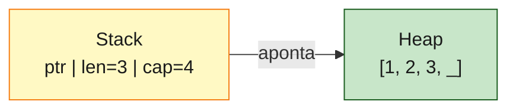
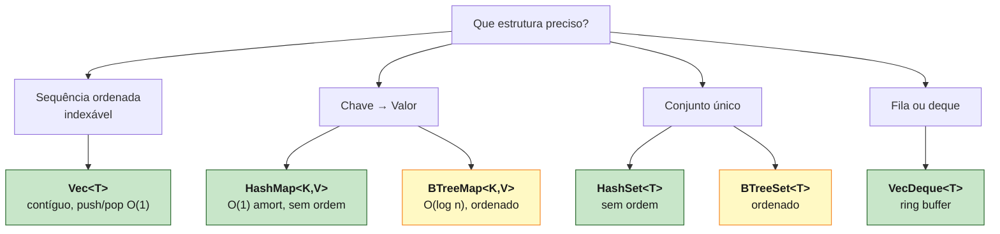

<a id="capitulo-20"></a>
# Capítulo 20: Coleções Padrão — Vec, HashMap, BTreeMap

> *"Show me your flowcharts and conceal your tables, and I shall continue to be mystified. Show me your tables, and I won't usually need your flowcharts; they'll be obvious."*
> — Fred Brooks, *The Mythical Man-Month*

> *"A linguagem te dá três coleções. O resto é disciplina."*

## 20.1 O Que Uma Coleção Resolve

Toda linguagem de propósito geral precisa responder a três perguntas operacionais antes de você escrever qualquer lógica de negócio:

1. Como guardo uma sequência ordenada de coisas que cresce em runtime?
2. Como associo uma chave a um valor com lookup em tempo constante?
3. Como mantenho um conjunto ordenado quando a ordem importa?

Em TypeScript a resposta é uma só: `Array`, `Map`, `Set`. Em Go: `slice`, `map` — e *set não existe*, você simula com `map[T]struct{}`. Em C: nada nativo, você liga uma lib externa ou reescreve a roda em cima de `malloc`.

Em Rust a resposta é deliberadamente fragmentada. `Vec<T>` para sequência. `HashMap<K,V>` para chave-valor amortizado O(1). `BTreeMap<K,V>` para chave-valor ordenado O(log n). Mais `HashSet<T>`, `BTreeSet<T>`, `VecDeque<T>`, `LinkedList<T>` (que ninguém usa), `BinaryHeap<T>`. Cada uma é uma escolha consciente sobre **layout de memória**, **complexidade**, e **invariantes**.

A pergunta deste capítulo não é *"como uso `Vec`"*. É *"qual coleção usar, e por quê o tipo do iterador importa"*.

## 20.2 Vec<T> — O Cavalo de Batalha

Um `Vec<T>` é três palavras na stack: ponteiro, comprimento, capacidade. Os elementos vivem no heap, contíguos.

```rust
let mut v: Vec<i32> = Vec::new();
v.push(1);
v.push(2);
v.push(3);
// stack: [ptr, len=3, cap=4]
// heap:  [1, 2, 3, _]
```

Quando `len == cap`, o `push` aloca um buffer maior (em geral 2x), copia, libera o antigo. É o mesmo algoritmo do `std::vector` em C++ e do `slice` em Go. A diferença mora nas garantias de quem é dono.



Em TypeScript:

```typescript
const arr: number[] = [];
arr.push(1, 2, 3);
// V8 começa com hidden class "packed SMI", troca para "holey double" se você
// fizer arr[100] = 1.5. Você não controla. A engine decide.
```

V8 mantém *hidden classes* internas — `PACKED_SMI_ELEMENTS`, `HOLEY_DOUBLE_ELEMENTS`, `DICTIONARY_ELEMENTS` — e migra entre elas conforme você abusa do array. Cada migração custa. Você não vê. Em Rust, `Vec<i32>` é `Vec<i32>` do começo ao fim da função. Sem promoção, sem demote.

Em Go, `s := make([]int, 0, 4); s = append(s, 1, 2, 3)` é idêntico em runtime — porém `append` pode realocar e devolver um novo slice; esquecer o reassignment é bug clássico. Em C, `int* v = malloc(4*sizeof(int))` te dá o array — quem libera? você. quando? espero que antes do return.

Operações comuns em `Vec<T>`:

```rust
let mut v = vec![1, 2, 3, 4, 5];
v.push(6);                      // O(1) amortizado
let last = v.pop();             // O(1) — Option<T>
let bound = v.get(100);         // Option<&T> — não panica
let crash = v[100];             // panica. é o seu unwrap implícito.
v.insert(0, 0);                 // O(n) — shift do resto
v.swap_remove(0);               // O(1) — troca com o último, perde ordem
v.sort_by(|a, b| b.cmp(a));     // ordem decrescente
v.retain(|x| *x % 2 == 0);      // filtra in-place
```

`v[100]` panicar é deliberado. Acessar fora dos limites é um bug, não um erro de negócio. Se você quer tratar o caso, pede `v.get(100)` e recebe `Option<&T>`. A linguagem te dá as duas APIs e te força a escolher.

## 20.3 Os Três Iteradores — A Distinção Crucial

Aqui a maioria dos iniciantes em Rust se perde. `Vec<T>` (e quase toda coleção) oferece **três** formas de iterar, e a diferença não é cosmética — é sobre quem fica com os dados.

```rust
let v = vec![String::from("a"), String::from("b"), String::from("c")];

// 1. iter() — empresta imutável. v continua existindo.
for s in v.iter() {
    println!("{}", s);   // s: &String
}
println!("ainda tenho v: {:?}", v);

// 2. iter_mut() — empresta mutável. v continua existindo, mutado.
let mut v = v;
for s in v.iter_mut() {
    s.push('!');         // s: &mut String
}

// 3. into_iter() — consome. v não existe mais depois.
for s in v.into_iter() {
    println!("{}", s);   // s: String — sou dono
}
// println!("{:?}", v); // ❌ erro: v foi movido
```

O `for x in coll` sem método explícito é açúcar para `coll.into_iter()`. Por isso `for s in v` costuma consumir `v`. Se você quer só ler, escreva `for s in &v` (que chama `iter()`) ou `for s in v.iter()`.

A regra mnemônica:

| Forma | Tipo do item | O que acontece com a coleção |
|---|---|---|
| `coll.iter()` | `&T` | continua existindo, intocada |
| `coll.iter_mut()` | `&mut T` | continua existindo, mutada in-place |
| `coll.into_iter()` | `T` | é consumida, deixa de existir |

Em TS não há essa distinção porque tudo é referência e strings são imutáveis. Em Go também não — `for _, s := range v` te dá uma cópia, e mutação se faz via índice. Em Rust, escolher entre `iter` e `into_iter` é declarar **intenção de posse**, e o compilador aceita ou recusa baseado nisso.

## 20.4 Iteradores São Lazy

Iteradores em Rust são lazy. Um `.map(|x| x * 2)` não executa nada — devolve um `Map<I, F>`, uma struct que sabe como produzir o próximo item *quando perguntada*. Nada é computado até alguém pedir.

```rust
let v = vec![1, 2, 3, 4, 5];

let dobrados = v.iter().map(|x| {
    println!("computei {}", x);
    x * 2
});
// nada imprimiu ainda.

let total: i32 = dobrados.sum();
// agora sim — sum() pediu cada item, cada map executou.
println!("total = {}", total);
```

A consequência prática: você compõe uma pipeline e ela só roda quando há um *consumer* terminal — `sum`, `collect`, `count`, `for`, `fold`, `any`, `all`, `find`. O compilador inlinea tudo num único loop de máquina. **Iteradores são gratuitos.** O assembly de:

```rust
let total: i32 = (0..1_000_000)
    .filter(|x| x % 2 == 0)
    .map(|x| x * x)
    .sum();
```

é o mesmo de:

```c
long total = 0;
for (long x = 0; x < 1000000; x++) {
    if (x % 2 == 0) total += x * x;
}
```

Compare com TypeScript:

```typescript
const total = Array.from({length: 1_000_000}, (_, i) => i)
    .filter(x => x % 2 === 0)   // aloca novo array
    .map(x => x * x)             // aloca outro
    .reduce((a, b) => a + b, 0);
// três passes na memória, dois arrays intermediários.
```

Em TS você paga alocação a cada estágio (a menos que use `Iterator helpers` do ES2025, ainda em adoção). Em Go a equivalência idiomática é um for loop manual — não há `.map`/`.filter` na stdlib.

## 20.5 Coletando — `.collect()`

Um iterador volta a ser uma coleção via `.collect()`. O ponto sutil: **o tipo destino é parte da chamada**.

```rust
let v = vec![1, 2, 3, 4, 5];
let dobrados: Vec<i32> = v.iter().map(|x| x * 2).collect();
let dobrados = v.iter().map(|x| x * 2).collect::<Vec<_>>(); // _ = inferido

// Pode coletar em outras coleções:
use std::collections::HashSet;
let unicos: HashSet<i32> = vec![1, 2, 2, 3, 3, 3].into_iter().collect();

// Ou — e aqui Rust brilha — em Result<Vec<T>, E>:
let entradas = vec!["1", "2", "tres", "4"];
let nums: Result<Vec<i32>, _> = entradas.iter().map(|s| s.parse::<i32>()).collect();
// Se algum parse falhar, o collect inteiro é Err. Se todos passarem, Ok(Vec<i32>).
```

Esse último idioma — `collect::<Result<Vec<_>, _>>()` — é uma das ergonomias mais limpas da stdlib. Você escreve a pipeline ignorando o erro, e o `collect` decide se foi tudo ou nada. Em TS você escreveria isso com `Promise.all` mais um wrapper de erro. Em Go, com um for loop, um if err, e um early return.

## 20.6 HashMap<K, V>

`HashMap` é o mapa hash da stdlib. Por padrão usa **SipHash 1-3** como hasher, que é resistente a HashDoS (ataques de colisão). Isso é mais seguro que Java (`HashMap` clássico vulnerável até Java 8) e mais lento que `std::unordered_map` em C++ ou o `map` em Go (que usam hashers mais frágeis).

```rust
use std::collections::HashMap;

let mut scores: HashMap<String, u32> = HashMap::new();
scores.insert(String::from("felipe"), 100);
scores.insert(String::from("ana"), 85);

// get devolve Option<&V> — sem panic, sem null
if let Some(s) = scores.get("felipe") {
    println!("felipe: {}", s);
}

// remoção
let antigo = scores.remove("ana"); // Option<V>

// iteração — ordem NÃO é estável (intencional)
for (k, v) in &scores {
    println!("{}: {}", k, v);
}
```

### O `.entry()` — A API que Define HashMap em Rust

Cenário clássico: contar ocorrências.

Em TS, `counts.set(w, (counts.get(w) ?? 0) + 1)` — dois lookups. Em Go, `counts[w]++` — um lookup, mas só funciona porque `int` tem zero útil. Em Rust idiomático:

```rust
use std::collections::HashMap;

let mut counts: HashMap<&str, u32> = HashMap::new();
for w in words {
    *counts.entry(w).or_insert(0) += 1;
}
```

`entry(w)` devolve um `Entry`, que é uma view escrevível na posição daquela chave — esteja ela ocupada ou vaga. `or_insert(0)` insere o default se vaga, e em ambos os casos devolve `&mut V`. **Um lookup, sem aliasing, sem branch explícito.**

Variantes úteis:

```rust
// or_insert_with — só constrói o default se realmente precisar
counts.entry(w).or_insert_with(|| caro_de_construir());

// and_modify — só age se já existe
counts.entry(w).and_modify(|c| *c += 1).or_insert(1);
```

`or_insert_with` é importante quando o default é caro: alocar uma `String`, abrir um socket, lazy-load de algo. Em TS você simula isso com `if (!map.has(k)) map.set(k, ...)`. Em Go, com `if _, ok := m[k]; !ok { ... }`. Em Rust, é uma chamada.

### Por que HashMap<String, V> Custa Caro

Eis um detalhe que separa código aceitável de código rápido em Rust. A chave de um `HashMap<K, V>` precisa ser hasheável e comparável. `String` é, mas **toda lookup com `&str` em um `HashMap<String, _>` não realoca**, graças à trait `Borrow`:

```rust
let mut m: HashMap<String, u32> = HashMap::new();
m.insert(String::from("hello"), 1);

let v = m.get("hello"); // ok — &str funciona como chave de busca
```

Mas a **inserção** sim. Cada `insert` exige uma `String` dona — alocação no heap, cópia dos bytes, drop do antigo se existir. Se você está construindo um mapa a partir de fatias estáticas, prefira:

```rust
let mut m: HashMap<&'static str, u32> = HashMap::new();
m.insert("hello", 1); // sem alocação. a chave é um ponteiro+len.
```

Para chaves dinâmicas vindas de parsing onde você lê uma vez e descarta o input, `String` é correto. Para tabelas de configuração, lookup de protocolos, headers HTTP conhecidos, `&'static str` ou `Cow<'static, str>` economiza milhões de alocações.

Sobre o hasher: `SipHash` é seguro mas não o mais rápido. Para cargas onde você controla o input (cache interno, índice de IDs), troque por `ahash`, `rustc-hash`, ou `fxhash`:

```rust
use std::collections::HashMap;
use ahash::RandomState;

let mut m: HashMap<u64, u64, RandomState> = HashMap::default();
// 2x a 5x mais rápido que SipHash, sem proteção HashDoS.
```

Use o hasher rápido só quando as chaves não vêm de input externo. Caso contrário, mantenha o padrão.

## 20.7 BTreeMap<K, V>

`BTreeMap` é um mapa baseado em B-Tree, ordenado pela chave. Operações são O(log n), não O(1) amortizado, mas:

1. As iterações saem em ordem de chave.
2. Você pode pedir um *range*: `m.range("a".."m")`.
3. A ordem é estável e reproduzível — útil para outputs, snapshots, hashing de estado.
4. Não exige `Hash`, só `Ord`.

```rust
use std::collections::BTreeMap;

let mut events: BTreeMap<i64, String> = BTreeMap::new();
events.insert(1714579200, String::from("login"));
events.insert(1714579205, String::from("checkout"));
events.insert(1714579210, String::from("logout"));

// iteração em ordem cronológica
for (ts, e) in &events {
    println!("{}: {}", ts, e);
}

// range query
for (ts, e) in events.range(1714579200..1714579208) {
    println!("janela: {} {}", ts, e);
}
```

Quando escolher qual:

| Cenário | Use |
|---|---|
| Lookup puro, ordem irrelevante | `HashMap` |
| Iteração em ordem de chave importa | `BTreeMap` |
| Range queries (`a..z`) | `BTreeMap` |
| Output determinístico (snapshot, hash) | `BTreeMap` |
| Chaves não implementam `Hash` | `BTreeMap` |
| Hot path com milhões de lookups | `HashMap` (com hasher rápido) |

Em TS você não tem `BTreeMap` na stdlib. `Map` preserva ordem de inserção, não de chave — coisa diferente. Em Go também não há ordenado nativo: ordene um slice de chaves. Em C++ existe `std::map` (red-black tree, equivalente moral) e `std::unordered_map`. Rust seguiu o mesmo split.

## 20.8 HashSet, BTreeSet — Conjuntos

`HashSet<T>` é literalmente `HashMap<T, ()>` por baixo dos panos. A API é diferente, o trade-off de memória é o mesmo.

```rust
use std::collections::HashSet;

let mut visitados: HashSet<u64> = HashSet::new();
visitados.insert(42);
visitados.insert(42); // não duplica
assert!(visitados.contains(&42));
assert_eq!(visitados.len(), 1);

// operações de conjunto
let a: HashSet<i32> = [1, 2, 3].into_iter().collect();
let b: HashSet<i32> = [2, 3, 4].into_iter().collect();
let intersec: HashSet<i32> = a.intersection(&b).copied().collect();
let uniao: HashSet<i32> = a.union(&b).copied().collect();
let dif: HashSet<i32> = a.difference(&b).copied().collect();
```

`BTreeSet<T>` é o análogo ordenado.

Em Go isso é o **buraco mais infame da stdlib**. Não há set. O idioma é:

```go
seen := make(map[int]struct{})
seen[42] = struct{}{}
if _, ok := seen[42]; ok { /* ... */ }
```

`struct{}` é zero bytes — não desperdiça memória — mas a API é hostil. Em TS, `Set<T>` existe e é bem feito. Em C, você implementa.

## 20.9 VecDeque — A Fila de Mão Dupla

`VecDeque<T>` é um *ring buffer*: array circular com dois cursores. `push_front`, `push_back`, `pop_front`, `pop_back` — todos O(1) amortizado. Quando você precisa de uma fila ou deque, **não use `Vec`** (porque `remove(0)` é O(n)) **e não use `LinkedList`** (porque cache miss em cada nó). Use `VecDeque`.

```rust
use std::collections::VecDeque;

let mut fila: VecDeque<Tarefa> = VecDeque::new();
fila.push_back(t1);
fila.push_back(t2);
let proxima = fila.pop_front(); // O(1)
```

BFS, scheduler de jobs, sliding window, undo/redo — todos pedem `VecDeque`.

## 20.10 Operações Compostas — O Vocabulário Real

Você raramente vai escrever loops em Rust idiomático. Você compõe iteradores. Vocabulário mínimo:

```rust
// transformações (lazy)
v.iter().map(|x| x * 2);
v.iter().filter(|x| **x % 2 == 0);
v.iter().filter_map(|x| if *x > 5 { Some(x * 10) } else { None });
v.iter().enumerate();              // ((0, &1), (1, &2), ...)
v.iter().zip(outra.iter()).take(3).skip(2).chain(outra.iter()).rev();

// terminadores (executam)
let total: i32 = v.iter().sum();
let max = v.iter().max();                  // Option<&i32>
let count = v.iter().filter(|x| **x > 3).count();
let primeiro = v.iter().find(|x| **x > 5); // Option<&i32>
let pos = v.iter().position(|x| *x > 5);   // Option<usize>
let tem = v.iter().any(|x| *x > 100);      // bool
let todos = v.iter().all(|x| *x > 0);      // bool
let soma = v.iter().fold(0, |acc, x| acc + x); // mãe dos agregadores
```

A nomenclatura de Rust é mais consistente que JS (`.any`/`.all`/`.find`/`.position` vs o mix `.some`/`.every`/`.find`/`.findIndex`). Em Go, nada disso na stdlib até 1.21 — você escrevia for loop. A partir de 1.23 chegaram iteradores em forma de `range func(yield)`, mas a biblioteca padrão de combinadores ainda é magra.

## 20.11 Quando Cada Coleção



A heurística é simples e raramente erra:

- **`Vec<T>`** salvo prova em contrário. 90% dos casos.
- **`HashMap<K,V>`** quando você precisa de lookup por chave e ordem não importa.
- **`BTreeMap<K,V>`** quando ordem ou range importa.
- **`HashSet<T>`/`BTreeSet<T>`** quando duplicatas não fazem sentido.
- **`VecDeque<T>`** quando você acrescenta numa ponta e remove na outra.
- **`LinkedList<T>`** nunca, na prática. Existe pela completude da stdlib.
- **`BinaryHeap<T>`** quando você precisa de priority queue (pop sempre devolve o maior).

## 20.12 O Que Fica

Coleções em Rust são, por construção, **explícitas sobre custo**. `Vec::new()` não aloca. `Vec::with_capacity(1024)` aloca 1024 slots de uma vez. `HashMap::with_hasher(custom)` deixa você escolher o hasher. `into_iter` declara que você quer mover, `iter` que quer emprestar. Não há decisão escondida.

A diferença com TS, Go e C é menos sobre o que você consegue *fazer* — todas as quatro linguagens te dão array, mapa, conjunto. É sobre o que você consegue *ver*. Em Rust, alocações têm nome. Iteradores têm tipo. Lookups falhos retornam `Option`, não `null`. Coletar uma sequência de operações que podem falhar devolve `Result<Vec<_>, _>`, e o compilador propaga o erro pelo caminho.

No próximo capítulo, esse `Result` ganha sua sintaxe própria — o operador `?` — e vamos ver por que tratamento de erros em Rust é uma das poucas coisas em programação que envelheceu *bem*.

---

> *"Coleções não são containers. São contratos sobre quem aloca, quem libera, quem ordena, e quem itera."*

[← Capítulo 19: Lifetimes Avançados](ch19-lifetimes-avancados.md) | [Próximo: Capítulo 21 — Tratamento de Erros Idiomático →](ch21-tratamento-erros.md)
