<a id="capitulo-21"></a>
# Capítulo 21: Tratamento de Erros Idiomático

> *"The two hardest problems in programming are: cache invalidation, naming things, and off-by-one errors."*
> — anônimo

> *"Rust requires you to acknowledge the possibility of an error and take some action before your code will compile."*
> — *The Rust Book*, capítulo 9

## 21.1 Duas Famílias de Erro

Antes de qualquer sintaxe, uma distinção. Existem dois tipos de erro num programa, e confundi-los é a raiz de quase toda dor com error handling em qualquer linguagem.

**Bugs.** O programa entrou em um estado que não devia existir. Um índice negativo onde nunca pode haver negativo. Um invariante violado dentro de uma struct. Um `match` que cobriu o que era logicamente exaustivo. Bugs não devem ser tratados em runtime — devem **explodir**, ruidosamente, idealmente em CI antes do deploy. O caller não pode "se recuperar" de um bug porque o caller também não sabe o que está partido.

**Erros esperados.** A rede caiu. O usuário digitou uma data inválida. O arquivo não existe. O parser recebeu JSON malformado. O banco recusou a conexão. Esses não são bugs do seu programa — são **fatos do mundo**. Devem aparecer no tipo de retorno, ser propagados, e em algum nível serem tratados.

Rust te dá ferramentas separadas para cada um.

```rust
// BUG — programa em estado impossível
panic!("internal: aggregate state corrupted");

// ERRO ESPERADO — fato do mundo
fn ler_config(path: &Path) -> Result<Config, ConfigError> {
    let texto = std::fs::read_to_string(path)?;
    let cfg = serde_json::from_str(&texto)?;
    Ok(cfg)
}
```

A maioria das linguagens funde os dois mundos. Java lança `RuntimeException` para bug E `IOException` para erro de mundo, e o caller não sabe a diferença. C usa `errno` para erro de mundo e `abort()` para bug, mas você pode "tratar" um `errno` ignorando-o. Rust força a separação no tipo.

## 21.2 panic! — A Saída de Emergência

`panic!` aborta a thread atual. Por padrão faz unwind (chama destrutores até a borda da thread, libera recursos), opcionalmente pode ser configurado para `abort` direto (binário menor, sem unwinding). Em CLI, panicking termina o processo. Em servidor, panicking termina **só a thread/task**, deixando o resto do servidor vivo (se você está usando um runtime como Tokio que isola tasks).

```rust
fn dividir(a: i32, b: i32) -> i32 {
    if b == 0 {
        panic!("divisão por zero — chamador violou contrato");
    }
    a / b
}
```

Use `panic!` quando:

1. **Invariante interno foi violado.** "Eu acabei de ordenar este vetor, mas o primeiro elemento é maior que o segundo." Algo profundamente errado aconteceu.
2. **Estado impossível.** Um `match` exaustivo que tem um braço `_ => unreachable!()` para informar ao compilador que aquele caminho não roda.
3. **Argumento viola precondição documentada.** Slice indexing com índice fora do range. Você assinou um contrato e quebrou.
4. **Inicialização que falha torna o programa inútil.** `main` que não consegue carregar config — pode panicar (ou retornar `Result`, que é equivalente em termos de UX se o `main` simplesmente printa o erro).

**Não** use `panic!` para erros de I/O, parsing de input do usuário, validação de dados externos. Esses são fatos do mundo.

```rust
// ❌ errado
let n: i32 = input.parse().unwrap_or_else(|_| panic!("input inválido"));

// ✅ certo
let n: i32 = input.parse().map_err(|_| AppError::InvalidInput(input.into()))?;
```

## 21.3 Result<T, E> — O Tipo Que Carrega o Erro

`Result` é uma enum exatamente como `Option`:

```rust
enum Result<T, E> {
    Ok(T),
    Err(E),
}
```

Não há mágica. É uma soma com dois braços. O compilador *te força* a tratá-la — ignorar o retorno é warning, e usar o valor exige `match`, `if let`, ou um dos métodos como `unwrap`, `expect`, `?`.

```rust
fn ler_porta(s: &str) -> Result<u16, std::num::ParseIntError> {
    s.parse::<u16>()
}

match ler_porta("8080") {
    Ok(p) => println!("porta = {}", p),
    Err(e) => eprintln!("erro: {}", e),
}
```

Compare com o equivalente em outras linguagens.

**TypeScript** — o erro **não está no tipo**:

```typescript
function parsePort(s: string): number {
    const n = parseInt(s, 10);
    if (isNaN(n)) throw new Error(`invalid: ${s}`);
    return n;
}

const p = parsePort("8080");  // pode lançar. nada no tipo te avisa.
```

A função tem tipo `(s: string) => number`. O fato de que ela pode lançar é invisível. Você descobre lendo a doc, lendo o source, ou em produção. TypeScript não tem `throws` declaration (Java tinha — checked exceptions — e o ecossistema rejeitou).

**Go** — explícito mas verboso. `n, err := strconv.ParseUint(s, 10, 16); if err != nil { return 0, fmt.Errorf("parse port: %w", err) }`. O erro está no tipo, mas cada chamada vira três linhas. E nada impede `p, _ := parsePort("8080")` — Go não força tratamento, só sugere.

**C** — convenção, não tipo. Função retorna `-1` e seta `errno`, valor sai por ponteiro out. Cada lib reinventa convenções (POSIX usa -1, Win32 HRESULT, OpenSSL 0/1 invertido). Esquecer de checar é silencioso.

Rust, em comparação:

```rust
let p: u16 = ler_porta("8080")?;
```

Uma linha. Tipo correto. Erro propagado. Não é mágica. É o `?`.

## 21.4 O Operador `?` — A Joia da Coroa

`?` é açúcar para esta expressão:

```rust
let x = expr?;

// expande para:
let x = match expr {
    Ok(v) => v,
    Err(e) => return Err(From::from(e)),
};
```

Três coisas acontecem em sequência:

1. **Pattern match** sobre `Result`.
2. **Early return** se `Err`.
3. **Conversão automática** do erro via `From::from` para o tipo de erro da função atual.

A terceira é o que torna `?` poderoso. Quando uma função retorna `Result<T, AppError>` e dentro dela você chama uma função que retorna `Result<U, IoError>`, `?` chama `AppError::from(io_error)` se você implementou `From<IoError> for AppError`. Sem isso, não compila — o compilador te força a declarar a conversão.

```rust
use std::fs;
use std::path::Path;

#[derive(Debug)]
enum ConfigError {
    Io(std::io::Error),
    Parse(serde_json::Error),
    MissingField(&'static str),
}

impl From<std::io::Error> for ConfigError {
    fn from(e: std::io::Error) -> Self { ConfigError::Io(e) }
}

impl From<serde_json::Error> for ConfigError {
    fn from(e: serde_json::Error) -> Self { ConfigError::Parse(e) }
}

fn ler_config(path: &Path) -> Result<Config, ConfigError> {
    let texto = fs::read_to_string(path)?;        // io::Error → ConfigError::Io
    let cfg: Config = serde_json::from_str(&texto)?; // serde_json::Error → ConfigError::Parse
    if cfg.host.is_empty() {
        return Err(ConfigError::MissingField("host"));
    }
    Ok(cfg)
}
```

Sem `?`, cada `?` vira um `match … return Err(ConfigError::Io(e))` de quatro linhas. Onze linhas viram quatro com `?`, com **exatamente as mesmas garantias estáticas**. O assembly é idêntico.

A mesma função em Go tem o mesmo design — erro no tipo, propagação explícita — mas cada `?` em Rust vira três linhas em Go (`if err != nil { return Config{}, fmt.Errorf("...: %w", err) }`). Multiplicado por uma codebase, é uma diferença de tom.

## 21.5 O Fluxo do `?`

```mermaid
graph TB
    Start["expr?"]
    Match{"é Ok ou Err?"}
    Unwrap["extrai T"]
    Convert["From::from(e)"]
    Return["return Err(convertido)"]
    Continue["continua função"]

    Start --> Match
    Match -->|Ok&#40;v&#41;| Unwrap --> Continue
    Match -->|Err&#40;e&#41;| Convert --> Return

    style Continue fill:#c8e6c9,stroke:#1b5e20
    style Return fill:#ffcdd2,stroke:#b71c1c
```



`?` também funciona com `Option`, propagando `None` da mesma forma. Não funciona em funções que retornam `()` — você precisa de uma função que retorna `Result` ou `Option`. `main` pode retornar `Result<(), Box<dyn Error>>` desde Rust 2018, então `?` no `main` é viável:

```rust
fn main() -> Result<(), Box<dyn std::error::Error>> {
    let cfg = ler_config(Path::new("config.json"))?;
    rodar(cfg)?;
    Ok(())
}
```

## 21.6 unwrap, expect — Pecado ou Pragmatismo?

`unwrap` e `expect` são as ferramentas mais difamadas e mais úteis da stdlib. Ambos extraem o `Ok(T)` e panicam no `Err`.

```rust
let n: i32 = "42".parse().unwrap();
let n: i32 = "42".parse().expect("a string '42' deveria ser número");
```

`expect` é estritamente melhor que `unwrap` — a mensagem aparece no panic e diz pra você o que o código *pensava* estar garantido. Trate `expect` como uma "afirmação documentada".

Quando `unwrap`/`expect` é OK:

1. **Testes.** Falhar é o ponto. `expect` deixa a mensagem de falha clara.
2. **Exemplos pedagógicos.** Como neste livro. Quem lê entende que é pra didática.
3. **Prototype/script throwaway.** Você vai jogar fora amanhã.
4. **Quando você acabou de checar a invariante.** Por exemplo, depois de `if let Some(_) = x { ... x.unwrap() }` — embora aqui o idiomático seja só usar o `Some` direto.
5. **Constantes que não podem falhar.** `Regex::new("[a-z]+").unwrap()` em código de inicialização — se o regex está hardcoded e válido, você está afirmando que ele é válido.

Quando *não* é OK:

1. **Input do usuário.** Sempre.
2. **I/O de qualquer tipo.** Disco enche, rede cai, permissão muda.
3. **Bibliotecas.** Você não sabe quem vai chamar. Devolva `Result`.
4. **Qualquer fronteira do sistema.** Parsing de HTTP body, leitura de DB, deserialização.

A regra mental: se o panic é um bug do programa, `expect` está OK. Se o panic é uma reação ao mundo, **não**.

## 21.7 Box<dyn Error> — O Atalho Pragmático

Para aplicações onde você quer apenas *propagar* erros sem categorizá-los — uma CLI, um script, um job — o tipo de retorno mais simples é `Box<dyn std::error::Error>`:

```rust
use std::error::Error;
use std::fs;

fn rodar() -> Result<(), Box<dyn Error>> {
    let texto = fs::read_to_string("config.json")?;
    let cfg: Config = serde_json::from_str(&texto)?;
    let conn = postgres::Client::connect(&cfg.url, postgres::NoTls)?;
    Ok(())
}
```

Por que funciona: qualquer tipo que implementa `Error` pode ser convertido em `Box<dyn Error>` via `From`, gratuitamente. `?` propaga. Você não precisa de enum, de `From` impls, de pattern matching.

O preço: o caller perde a habilidade de *inspecionar* o erro. Tudo vira "algo deu errado". Para CLI isso é aceitável — você vai imprimir e morrer. Para uma biblioteca, é hostil — quem chama precisa decidir reagir diferente a um timeout vs um auth failure.

Andrew Gallant resume bem: **bibliotecas devolvem enum, aplicações usam `Box<dyn Error>`**. Aplicações fazem otimização local (velocidade), bibliotecas pensam em downstream (composabilidade).

## 21.8 Custom Error Types — Para o Que Importa

Quando você está escrevendo uma biblioteca ou uma aplicação grande, defina um enum de erro. O contrato:

```rust
#[derive(Debug)]
pub enum PaymentError {
    InsufficientFunds { available: u64, required: u64 },
    InvalidCard(String),
    GatewayTimeout,
    Network(reqwest::Error),
    Db(sqlx::Error),
}

impl std::fmt::Display for PaymentError { /* match em cada variante */ }

impl std::error::Error for PaymentError {
    fn source(&self) -> Option<&(dyn std::error::Error + 'static)> {
        match self {
            Self::Network(e) => Some(e),
            Self::Db(e) => Some(e),
            _ => None,
        }
    }
}

impl From<reqwest::Error> for PaymentError {
    fn from(e: reqwest::Error) -> Self { Self::Network(e) }
}
impl From<sqlx::Error> for PaymentError {
    fn from(e: sqlx::Error) -> Self { Self::Db(e) }
}
```

Um pacote: enum com variantes representando *o que* deu errado (não *onde*), `Display` para humanos, `Error` com `source()` para a cadeia de causalidade, `From` para cada erro upstream que você propaga.

Por que separar variantes por *o que*, não por *onde*: o caller decide reagir baseado em significado de negócio. `InsufficientFunds` permite mostrar UI específica. `GatewayTimeout` permite retry. `InvalidCard` é definitivo, não retentar. Variantes nomeadas pela camada que falhou (`DbError`, `ApiError`) reduzem a uma string opaca o que era informação. O caller faz `match` sobre os casos relevantes (mostrar topup, agendar retry) e propaga o resto com `?`.

## 21.9 anyhow + thiserror — O Padrão de Mercado

Escrever `Display`, `Error`, e cinco `From` impls para cada enum vira repetição. A comunidade convergiu em duas crates que dominam o ecossistema:

**`thiserror`** — para bibliotecas. Macro derive que gera todo o boilerplate de enum de erro:

```rust
use thiserror::Error;

#[derive(Debug, Error)]
pub enum PaymentError {
    #[error("saldo insuficiente: tem {available}, precisa {required}")]
    InsufficientFunds { available: u64, required: u64 },

    #[error("cartão inválido: {0}")]
    InvalidCard(String),

    #[error("timeout no gateway")]
    GatewayTimeout,

    #[error("falha de rede")]
    Network(#[from] reqwest::Error),

    #[error("falha no banco")]
    Db(#[from] sqlx::Error),
}
```

`#[error("...")]` gera `Display`. `#[from]` gera `From`. `Debug` vem do derive padrão. `Error` é implementado pela macro. Trinta linhas viram quinze, sem perder estrutura.

**`anyhow`** — para aplicações. Uma única struct `anyhow::Error` que captura qualquer erro, anexa contexto via `.context("...")`, e renderiza uma cadeia bonita:

```rust
use anyhow::{Context, Result};

fn rodar() -> Result<()> {
    let texto = std::fs::read_to_string("config.json")
        .context("lendo config.json")?;
    let cfg: Config = serde_json::from_str(&texto)
        .context("parseando config.json")?;
    conectar(&cfg)
        .context("conectando ao DB")?;
    Ok(())
}
```

Output em falha:

```
Error: conectando ao DB

Caused by:
    0: parseando config.json
    1: expected `,` or `}` at line 4 column 3
```

`anyhow::Result<T>` é alias para `Result<T, anyhow::Error>`. `Context` adiciona uma frase humana a cada nível. **Você não escreve enum, não escreve `From`, não escreve `Display`.** Para uma CLI ou um job, isso é o suficiente. O capítulo 22 detalha as duas crates.

A regra de bolso:

| Cenário | Ferramenta |
|---|---|
| CLI, script, job interno | `anyhow` |
| Biblioteca que outros vão usar | `thiserror` |
| Aplicação grande com domínios separados | `thiserror` por domínio + `anyhow` na borda |

## 21.10 O Que TS, Go e C Não Conseguem Replicar

```mermaid
graph TB
    subgraph TS["TypeScript / JavaScript"]
        TS1["throw — não está no tipo"]
        TS2["catch &#40;e: unknown&#41;"]
        TS3["sem garantia estática"]
    end

    subgraph Go["Go"]
        Go1["&#40;T, error&#41; explícito"]
        Go2["if err != nil { ... }"]
        Go3["pode ignorar com _"]
    end

    subgraph C["C"]
        C1["return -1 + errno"]
        C2["convenção, não tipo"]
        C3["esquecer = silencioso"]
    end

    subgraph Rust["Rust"]
        R1["Result&lt;T, E&gt; no tipo"]
        R2["? compõe e converte"]
        R3["compilador exige tratamento"]
    end

    style TS fill:#fff9c4,stroke:#f57f17
    style Go fill:#fff9c4,stroke:#f57f17
    style C fill:#ffcdd2,stroke:#b71c1c
    style Rust fill:#c8e6c9,stroke:#1b5e20
```



Quatro propriedades convergem em Rust e em mais nenhuma das três:

1. **O erro está no tipo.** Não em comentário, doc, ou convenção.
2. **Ignorar é erro de compilação.** Você precisa decidir o que fazer.
3. **A propagação é uma sintaxe.** `?` é uma palavra que faz pattern match e early return e conversão.
4. **Você ainda paga zero.** `Result<T, E>` é uma soma com tag de um byte. Sem heap, sem table de exceptions, sem unwinding metadata em paths felizes.

Java tem (1) com checked exceptions, mas a comunidade rejeitou (2) ao adicionar runtime exceptions. Go tem (1) e quase (2) (linter força você a tratar `err`), mas perde (3). C# segue Java. Swift adicionou `try`/`throws` que é mais perto de Rust, mas perde (4) — exceptions ainda usam unwinding.

O `?` parece pequeno. É o caractere mais carregado de design da linguagem. Cada vez que você escreve `algo()?`, está fazendo o que em C seria seis linhas, em Go três, em Java zero (porque você só ignorou), e em Rust uma — sem perder nenhuma garantia.

## 21.11 Anti-padrões Específicos de Erro

Mesmo com a stdlib certa, dá pra errar feio. Os clássicos:

```rust
// ❌ engolir o erro
let _ = arquivo.write_all(b"hello");

// ❌ unwrap em path quente
fn handle(req: Request) -> Response {
    let user_id = req.user_id().unwrap(); // crasha o handler na primeira req sem user
    // ...
}

// ❌ stringly-typed errors
fn fazer() -> Result<(), String> {
    Err("algo deu errado".into())
}
// quem recebe não pode pattern match. perdeu estrutura.

// ❌ converter erro em string cedo demais
.map_err(|e| format!("erro: {}", e))?
// perdeu a cadeia de causalidade. anyhow::context preserva.

// ❌ catch-all e log no meio do call stack
match fazer() {
    Ok(_) => {}
    Err(e) => {
        log::error!("erro: {}", e);
        return Ok(()); // simulando sucesso? não.
    }
}
```

A regra: **não trate o erro até a borda**. Propague com `?` o caminho inteiro. Trate uma vez, no nível certo — geralmente HTTP handler, CLI main, ou worker loop. Logue uma vez, com a cadeia inteira (`{:#}` no `anyhow::Error`).

## 21.12 O Que Fica

Tratamento de erros em Rust não é uma feature isolada. É a convergência de três escolhas estruturais:

1. **Soma types** (capítulo 12) que tornam `Result` expressível e exhaustive.
2. **Trait `From`** (capítulo 18) que permite conversão sem boilerplate por chamada.
3. **`?` operator** que dá ergonomia sem perder rigor.

Tirando qualquer uma das três, você tem Java (sem 1), Go (sem 3), ou Haskell (que tem tudo, mas sem o ecossistema de aplicações de Rust). A combinação é o que faz o estilo idiomático ser ao mesmo tempo *seguro* e *enxuto*.

No próximo capítulo, descemos um nível e olhamos `anyhow` e `thiserror` em detalhe — qual macro usar quando, como compor erros entre camadas, e por que essas duas crates são o de-facto de toda crate séria publicada após 2019.

---

> *"Erros não são exceções. Erros são valores. E valores se compõem."*

[← Capítulo 20: Coleções Padrão](ch20-colecoes.md) | [Próximo: Capítulo 22 — anyhow e thiserror →](ch22-anyhow-thiserror.md)
