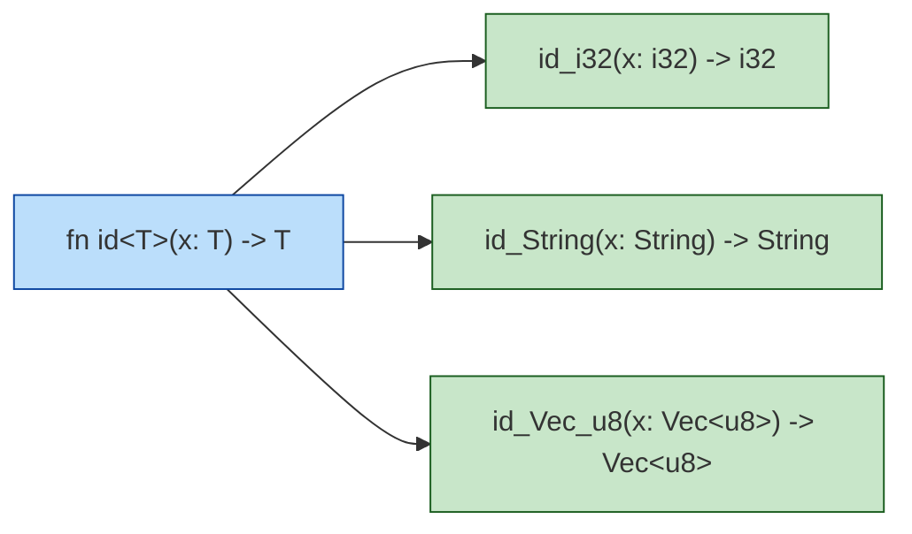

<a id="capitulo-22"></a>
# Capítulo 22: Generics — Polimorfismo Paramétrico

> *"A linguagem que não te deixa escrever a mesma função duas vezes não está te respeitando — está te subestimando."*
> — comentário anônimo num PR de 2014

> *"Generics são o jeito que uma linguagem fala que confia em você para abstrair sem cobrar pedágio em runtime."*

## 22.1 O Problema que Generics Resolvem

Você quer uma função que pegue o maior elemento de uma lista. Em C, sem genéricos, você tem três opções, todas ruins:

```c
// Opção 1: uma função por tipo. Copy-paste industrial.
int max_int(int* arr, size_t n) { /* ... */ }
double max_double(double* arr, size_t n) { /* ... */ }

// Opção 2: macros. O pré-processador finge ser um sistema de tipos.
#define MAX(T) T max_##T(T* arr, size_t n) { /* ... */ }

// Opção 3: void* + função de comparação. Type-unsafe, indireto, lento.
void* max_generic(void* arr, size_t n, size_t size,
                  int (*cmp)(const void*, const void*));
```

`qsort` da libc usa a opção 3. Cada chamada paga: indireção de ponteiro, função de comparação por elemento (sem inline), e zero verificação de tipos — você jura para o compilador que o `void*` aponta pro tipo certo.

Java resolveu com **erasure**: `List<Integer>` no código fonte vira `List<Object>` em runtime. Boxing, autoboxing, e a humilhação eterna de `List<int>` não existir.

C# fez **reified generics**: o runtime sabe o tipo, sem boxing. Custou um runtime mais pesado.

TypeScript fez **erasure também** — só que não tem runtime. `function id<T>(x: T): T` em runtime é `function id(x) { return x }`. Os genéricos existem só no compilador.

Go demorou 12 anos para adicionar generics (1.18, 2022). Quando chegaram, foram com **monomorphization parcial** baseada em GCShape: tipos com a mesma representação em memória compartilham código. Funciona, mas tem casos onde a indireção volta.

Rust fez a coisa certa: **monomorphization total**. Cada uso de uma função genérica com um tipo concreto gera uma cópia especializada. Zero indireção. Zero boxing. Velocidade idêntica ao código escrito à mão para cada tipo.



O custo é binário maior — cada tipo concreto multiplica o código gerado. O ganho é que o compilador pode otimizar cada especialização individualmente: inline, vetorização, eliminação de branches mortos.

## 22.2 Funções Genéricas

A sintaxe é direta:

```rust
fn primeiro<T>(lista: &[T]) -> &T {
    &lista[0]
}

fn main() {
    let nums = vec![10, 20, 30];
    let palavras = vec!["alfa", "beta"];

    println!("{}", primeiro(&nums));     // 10
    println!("{}", primeiro(&palavras)); // "alfa"
}
```

`<T>` declara um parâmetro de tipo. Pode ser qualquer letra, mas a convenção é:

- `T` — tipo genérico genérico (de "Type").
- `E` — erro (em `Result<T, E>`).
- `K`, `V` — chave e valor (em `HashMap<K, V>`).
- `T1`, `T2` ou `A`, `B` — quando tem múltiplos.

Comparação direta com TypeScript:

```typescript
// TypeScript: idêntico em sintaxe, completamente diferente em runtime.
function primeiro<T>(lista: T[]): T {
  return lista[0];
}
// Em runtime, T não existe. Apagado.
```

Em Rust, depois da compilação:

```rust
// O que o compilador realmente gera (simplificado):
fn primeiro_i32(lista: &[i32]) -> &i32 { &lista[0] }
fn primeiro_String(lista: &[String]) -> &String { &lista[0] }
```

Não tem reflexão de tipo em runtime. Não tem `typeof T`. O compilador apaga o `T` *especializando*, não esquecendo.

## 22.3 Structs e Enums Genéricos

Genéricos não são exclusivos de funções — qualquer tipo pode ter parâmetros:

```rust
struct Wrapper<T> {
    valor: T,
}

impl<T> Wrapper<T> {
    fn new(valor: T) -> Self {
        Wrapper { valor }
    }

    fn into_inner(self) -> T {
        self.valor
    }
}

fn main() {
    let w1 = Wrapper::new(42);          // Wrapper<i32>
    let w2 = Wrapper::new("hello");     // Wrapper<&str>
    let w3 = Wrapper::new(vec![1, 2]);  // Wrapper<Vec<i32>>
}
```

Repare na sintaxe `impl<T> Wrapper<T>`. O `<T>` depois de `impl` declara o parâmetro; o `<T>` depois de `Wrapper` usa ele. Isso parece redundante mas é necessário porque você pode também escrever `impl Wrapper<i32>` — uma `impl` específica para um tipo concreto:

```rust
impl Wrapper<i32> {
    fn double(self) -> i32 {
        self.valor * 2
    }
}

// double() só existe para Wrapper<i32>, não para Wrapper<String>.
```

Enums genéricos são onde Rust brilha. O caso canônico é `Either`:

```rust
enum Either<L, R> {
    Left(L),
    Right(R),
}

fn analisar(s: &str) -> Either<i32, String> {
    match s.parse::<i32>() {
        Ok(n)  => Either::Left(n),
        Err(_) => Either::Right(format!("não é número: {}", s)),
    }
}
```

`Option<T>` e `Result<T, E>` da std são exatamente isso — enums genéricos. O sistema de tipos os trata como cidadãos comuns; nada na linguagem é "especial" sobre eles.

## 22.4 Trait Bounds — Restringindo o Genérico

Polimorfismo paramétrico puro tem um limite: se `T` pode ser *qualquer* tipo, você não pode fazer *nada* com ele além de mover. Não pode comparar. Não pode imprimir. Não pode somar.

```rust
fn maior<T>(a: T, b: T) -> T {
    if a > b { a } else { b }  // ❌ erro de compilação
}
// error[E0369]: binary operation `>` cannot be applied to type `T`
```

O compilador exige uma promessa: *todo `T` que entrar aqui sabe se comparar*. Essa promessa se chama **trait bound**:

```rust
fn maior<T: PartialOrd>(a: T, b: T) -> T {
    if a > b { a } else { b }
}
```

`T: PartialOrd` significa "T deve implementar a trait `PartialOrd`". Trait é o que será o assunto do próximo capítulo — por enquanto, pense nela como uma interface. `PartialOrd` define `<`, `>`, etc.

Múltiplos bounds com `+`:

```rust
fn imprimir_e_somar<T: std::fmt::Display + std::ops::Add<Output = T>>(a: T, b: T) {
    let s = a + b;
    println!("soma: {}", s);
}
```

Compare com TypeScript — semelhante, mas o tipo é estrutural, não nominal:

```typescript
// TS: T precisa ter as propriedades exigidas, não declarar a interface.
function imprimirESomar<T extends { toString(): string }>(a: T, b: T) {
  console.log(a.toString());
}
```

Em TS, qualquer objeto com `toString()` serve — sem precisar declarar nada. Em Rust, o tipo precisa ter sido *explicitamente declarado* como implementador de `Display`. Mais rígido, mais previsível, e impossível de quebrar por acidente.

## 22.5 Where Clauses — Quando os Bounds Multiplicam

Quando você tem três genéricos com cinco bounds cada, a assinatura vira poluição visual:

```rust
// Ilegível.
fn processar<T: Clone + std::fmt::Debug + Send + Sync, U: Iterator<Item = T> + Clone>(
    entrada: U,
) -> Vec<T> {
    entrada.collect()
}
```

`where` move os bounds para depois da assinatura, deixando a assinatura limpa:

```rust
fn processar<T, U>(entrada: U) -> Vec<T>
where
    T: Clone + std::fmt::Debug + Send + Sync,
    U: Iterator<Item = T> + Clone,
{
    entrada.collect()
}
```

Funcionalmente idênticos. A regra prática: **se cabe inline sem precisar quebrar linha, inline; senão, where**. O `rustfmt` te empurra na direção certa.

`where` também é a *única* forma de expressar certos bounds, especificamente os que envolvem tipos associados de traits — assunto do capítulo 23.

## 22.6 Const Generics — Genéricos sobre Valores

Quase todas as linguagens com genéricos abstraem sobre *tipos*. Rust também abstrai sobre *valores constantes*. O caso mais comum é o tamanho de arrays:

```rust
fn primeiro_e_ultimo<T, const N: usize>(arr: [T; N]) -> (T, T)
where
    T: Copy,
{
    (arr[0], arr[N - 1])
}

fn main() {
    let a: [i32; 3] = [10, 20, 30];
    let b: [i32; 5] = [1, 2, 3, 4, 5];

    println!("{:?}", primeiro_e_ultimo(a)); // (10, 30)
    println!("{:?}", primeiro_e_ultimo(b)); // (1, 5)
}
```

`const N: usize` é um parâmetro genérico cujo valor é uma constante de tipo `usize`. `[T; N]` é um array de `T` com tamanho exato `N`, conhecido em tempo de compilação.

Por que isso importa? Porque o tamanho do array vira parte do tipo. Você não pode passar um `[i32; 3]` para uma função que espera `[i32; 5]`. O compilador te protege de bounds checks que você nem precisaria fazer.

C++ tem isso há décadas (`template<int N>`). C tem com `_Generic` e macros, dolorosamente. Go não tem. TypeScript tem uma versão fraca com tuple types (`[T, T, T]`), mas não números arbitrários.

Const generics permitem coisas como matrizes com dimensões verificadas:

```rust
struct Matriz<const ROWS: usize, const COLS: usize> {
    dados: [[f64; COLS]; ROWS],
}

impl<const ROWS: usize, const COLS: usize> Matriz<ROWS, COLS> {
    fn transposta(&self) -> Matriz<COLS, ROWS> {
        // ... transpor ...
        # unimplemented!()
    }
}

fn multiplicar<const A: usize, const B: usize, const C: usize>(
    x: &Matriz<A, B>,
    y: &Matriz<B, C>,
) -> Matriz<A, C> {
    // O compilador *garante* que as dimensões batem.
    # unimplemented!()
}
```

Tentar multiplicar `Matriz<3, 4>` por `Matriz<5, 6>` é erro de compilação. Em NumPy (Python) ou em C, seria erro de runtime — ou pior, silently wrong.

## 22.7 Monomorphization — Por Dentro

Quando você escreve:

```rust
fn dobrar<T: std::ops::Add<Output = T> + Copy>(x: T) -> T {
    x + x
}

fn main() {
    let a = dobrar(3);       // i32
    let b = dobrar(3.14);    // f64
    let c = dobrar(2u64);    // u64
}
```

O compilador gera (conceitualmente) três funções distintas:

```rust
fn dobrar_i32(x: i32) -> i32 { x + x }
fn dobrar_f64(x: f64) -> f64 { x + x }
fn dobrar_u64(x: u64) -> u64 { x + x }
```

Cada chamada vira chamada direta para a versão especializada. O LLVM, vendo `x + x` em `i32`, pode inlinear, vetorizar (`shl x, 1`), eliminar o frame da função inteira. Você não paga indireção. Você não paga vtable. Você paga *binário maior*.

Comparação tabela:

| Linguagem | Estratégia | Custo runtime | Custo binário | Type info preservada |
|---|---|---|---|---|
| C | Macros / `void*` | zero / alto | zero / médio | não |
| C++ | Templates (monomorph.) | zero | alto | sim, parcial |
| Java | Erasure | boxing, indireção | baixo | não |
| C# | Reified | indireção pequena | médio | sim |
| Go | Monomorphization parcial (GCShape) | indireção em alguns casos | médio | parcial |
| TypeScript | Erasure (compilação apaga) | zero (tipos sumiram) | zero | não |
| **Rust** | **Monomorph. total** | **zero** | **alto** | **sim, em compile-time** |

A escolha de Rust é a mesma de C++: trocar tamanho de binário por velocidade. Para sistemas de baixíssimo nível, é a escolha óbvia.

## 22.8 Quando Generics Não Servem

Generics são monomorphização. Monomorphização exige saber o tipo concreto em compile-time. Há cenários onde isso não é possível:

```rust
fn animais_diversos() -> Vec<???> {
    vec![Cao::new(), Gato::new(), Pato::new()]
    // Cada elemento tem tipo diferente. Vec<T> exige um único T.
}
```

Você não pode escrever `Vec<T>` aqui — `T` precisa ser um tipo único. Se você precisa de heterogeneidade em runtime — uma lista onde cada elemento pode ter um tipo concreto diferente, desde que todos compartilhem uma trait — você precisa de **trait objects** (`Box<dyn Animal>`). Esse é o assunto do capítulo 24.

Regra prática:

- **Generics** quando os tipos são conhecidos em compile-time e você quer máxima performance.
- **Trait objects (`dyn Trait`)** quando os tipos só são conhecidos em runtime (plugins, coleções heterogêneas).

## 22.9 Inferência — Você Quase Nunca Escreve `<T>` na Chamada

```rust
let v: Vec<i32> = Vec::new();           // anotação no binding
let v = Vec::<i32>::new();              // turbofish na chamada
let v: Vec<_> = (0..10).collect();      // _ pede pro compilador inferir item
let v = (0..10).collect::<Vec<i32>>();  // turbofish no método
```

O `::<>` é chamado de **turbofish**. Você precisa dele quando o compilador não tem como inferir — tipicamente em `parse`, `collect`, `from_iter`. A maior parte do tempo, deixa o compilador deduzir.

## 22.10 Resumo

Generics em Rust são polimorfismo paramétrico estrito, monomorfizado em compile-time, com bounds nominais explícitos via traits. O contraste com TypeScript é instrutivo: a sintaxe parece a mesma, mas o significado em runtime é o oposto. TS apaga; Rust especializa.

Próxima parada: **traits**, o sistema de contratos que torna esses bounds expressivos.

---

> *"Em TS, `<T>` é uma promessa que some no compile. Em Rust, `<T>` é uma promessa que vira código."*

[Próximo: Capítulo 23 — Traits: Contratos Compostáveis →](ch23-traits.md)
