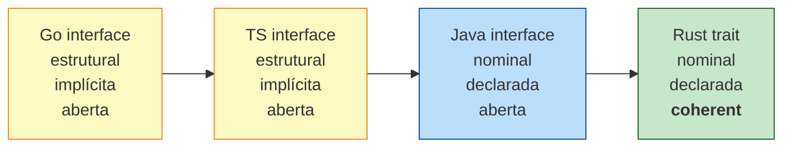

<a id="capitulo-23"></a>
# Capítulo 23: Traits — Contratos Compostáveis

> *"A interface é o contrato. A implementação é o suborno."*
> — autoria perdida, espalhada em comentários de Stack Overflow

> *"Traits não são interfaces. São o que interfaces deveriam ter sido se Java tivesse aprendido com ML antes de aprender com Smalltalk."*

## 23.1 O Que Uma Trait É

Uma trait declara comportamento que tipos podem implementar. Em primeira aproximação, parece com `interface` de Java/TS. Em segunda aproximação, é radicalmente diferente:

```rust
trait Saudacao {
    fn ola(&self) -> String;
}

struct Pessoa { nome: String }
struct Robo   { id: u32 }

impl Saudacao for Pessoa {
    fn ola(&self) -> String {
        format!("Oi, sou {}", self.nome)
    }
}

impl Saudacao for Robo {
    fn ola(&self) -> String {
        format!("BEEP. UNIDADE {} ATIVA.", self.id)
    }
}
```

Note o ponto crucial: a trait é declarada *em separado* do tipo. Em Java, você diria `class Pessoa implements Saudacao` no momento de declarar `Pessoa`. Em Rust, você pode adicionar `impl Saudacao for Pessoa` em qualquer lugar do crate, *depois* da declaração de `Pessoa`. Isso é parecido com **extension methods** do C# ou Kotlin, mas com sistema de tipos completo por trás.

Comparação inicial das três famílias:

| Linguagem | Tipagem da interface | Implementação |
|---|---|---|
| Java | nominal | declarada na classe (`implements`) |
| Go | estrutural | implícita (se tem os métodos, implementa) |
| TypeScript | estrutural | implícita |
| **Rust** | **nominal** | **declarada separadamente** (`impl Trait for Type`) |

A diferença Rust vs Go é sutil mas vital. Em Go, qualquer tipo que tenha `Read(p []byte) (int, error)` implementa `io.Reader` automaticamente — mesmo que o autor não soubesse que `io.Reader` existe. Isso parece bom até você ter um tipo que casa por acidente com uma interface que você não quer implementar.

Em Rust, você implementa porque escreveu `impl X for Y`. Não há acidente. Há intenção.

## 23.2 Métodos Default — A Trait Carrega Comportamento

Diferente de interfaces clássicas (Java pré-8, TS), traits Rust podem carregar implementação default:

```rust
trait Resumo {
    fn titulo(&self) -> String;

    // Método default — quem implementa pode sobrescrever, ou usar este.
    fn resumo(&self) -> String {
        format!("(Leia mais sobre: {})", self.titulo())
    }
}

struct Artigo { titulo: String, corpo: String }

impl Resumo for Artigo {
    fn titulo(&self) -> String { self.titulo.clone() }
    // resumo() não foi implementado — usa o default.
}

fn main() {
    let a = Artigo {
        titulo: String::from("Rust e o futuro"),
        corpo:  String::from("..."),
    };
    println!("{}", a.resumo()); // "(Leia mais sobre: Rust e o futuro)"
}
```

Java 8 trouxe isso como `default` methods. Scala chamou de traits desde sempre. C++ tem com classes abstratas. TypeScript não tem em interfaces puras (precisa abstract class).

## 23.3 Trait Bounds Revisitados

Toda restrição em genérico é uma trait. `T: Clone` significa "T implementa Clone". Combinações:

```rust
fn imprimir_se_par<T>(x: T)
where
    T: std::fmt::Display + Into<i64>,
{
    let n: i64 = x.into();
    if n % 2 == 0 {
        println!("par: {}", n);
    }
}
```

O leitor de TS reconhece o padrão como `T extends X & Y`. A diferença é que em Rust o conjunto de traits é finito e explicitamente declarado pelo autor do tipo, não inferido por estrutura.

## 23.4 Generic Params vs Associated Types

Traits podem ter "buracos" para tipos. Existem duas formas de expressar isso, e a escolha entre elas é uma das decisões mais sutis em Rust:

```rust
// (a) Generic parameter
trait Convert<T> {
    fn convert(self) -> T;
}

// (b) Associated type
trait IntoOther {
    type Output;
    fn convert(self) -> Self::Output;
}
```

Em (a), o mesmo tipo pode implementar `Convert<T>` para *vários* `T` distintos:

```rust
impl Convert<String> for u32 { fn convert(self) -> String { self.to_string() } }
impl Convert<f64>    for u32 { fn convert(self) -> f64    { self as f64 } }
```

`u32` se converte tanto em `String` quanto em `f64` — duas implementações diferentes da mesma trait com `T` diferente.

Em (b), o tipo só pode implementar `IntoOther` *uma única vez*. O `Output` está fixado por implementação:

```rust
impl IntoOther for u32 {
    type Output = f64;
    fn convert(self) -> f64 { self as f64 }
}

// Você NÃO pode adicionar uma segunda impl com Output = String.
```

Regra prática:

- **Generic param**: quando faz sentido um tipo implementar a trait *múltiplas vezes* com tipos diferentes (`From<T>`, `Into<T>`, `Add<Rhs>`).
- **Associated type**: quando há *uma escolha óbvia* de tipo associado por implementação (`Iterator::Item`, `Deref::Target`, `Future::Output`).

`Iterator` usa associated type porque um `Vec<i32>` itera sempre sobre `i32`, não há ambiguidade:

```rust
trait Iterator {
    type Item;
    fn next(&mut self) -> Option<Self::Item>;
}
```

Se fosse generic param (`Iterator<T>`), `Vec<i32>` poderia teoricamente implementar `Iterator<i32>`, `Iterator<String>`, e a inferência ficaria confusa. Associated types eliminam essa ambiguidade.

## 23.5 A Orphan Rule — Coerência

Você pode implementar qualquer trait para qualquer tipo, *desde que* a trait OU o tipo tenha sido definido no seu crate.

```rust
// Seu crate
struct MeuTipo;

impl Display for MeuTipo { ... }      // OK: MeuTipo é seu
impl MinhaTrait for Vec<u8> { ... }   // OK: MinhaTrait é sua

// PROIBIDO:
impl Display for Vec<u8> { ... }      // Vec é da std, Display é da std
```

Isso é a **orphan rule** (também chamada de coherence). O nome vem da ideia de que uma `impl` "órfã" — onde nem trait nem tipo são seus — fica solta no ecossistema.

Por que essa regra existe? Imagine sem ela. Crate A implementa `Display` para `Vec<u8>` formatando como hex. Crate B implementa `Display` para `Vec<u8>` formatando como base64. Você importa os dois. Qual `impl` ganha? A linguagem precisaria de um sistema de resolução de conflitos, ou silenciosamente escolher um. Pior: trocar a versão de uma dependência poderia mudar qual `Display` é usado, sem nenhum aviso. **Quebra silenciosa em transitive deps**.

A orphan rule garante: para cada par (trait, tipo), existe *no máximo* uma `impl` em todo o universo de crates. O custo é prático: às vezes você quer estender um tipo de outro crate com uma trait de outro crate, e não pode. A solução canônica é o **newtype pattern**:

```rust
// Não posso impl Display para Vec<u8> diretamente.
// Mas posso embrulhar:
struct HexBytes(Vec<u8>);

impl std::fmt::Display for HexBytes {
    fn fmt(&self, f: &mut std::fmt::Formatter) -> std::fmt::Result {
        for b in &self.0 {
            write!(f, "{:02x}", b)?;
        }
        Ok(())
    }
}
```

`HexBytes` é meu, `Display` é da std mas o tipo é meu — orphan rule satisfeita.

Java tem o mesmo problema sem solução elegante (você não pode "adicionar" interfaces a tipos alheios). C# tem extension methods, mas elas não satisfazem interfaces. TypeScript com declaration merging permite esticar tipos de qualquer biblioteca — *poderoso demais*, fonte de bugs em escala.

## 23.6 Sealed Trait — Limitando Quem Implementa

Às vezes você quer que uma trait seja implementável por *você* mas ninguém de fora. Rust não tem `sealed` como keyword (Kotlin tem), mas há um padrão:

```rust
mod sealed {
    pub trait Sealed {}
}

pub trait MeuFormato: sealed::Sealed {
    fn formatar(&self) -> String;
}

// Você implementa Sealed (privado) para tipos que escolher.
impl sealed::Sealed for u8  {}
impl sealed::Sealed for u16 {}

impl MeuFormato for u8  { fn formatar(&self) -> String { format!("{:08b}",  self) } }
impl MeuFormato for u16 { fn formatar(&self) -> String { format!("{:016b}", self) } }
```

De fora do seu crate, ninguém consegue `impl MeuFormato for X` porque exigiria implementar `sealed::Sealed`, que é privada. Você travou a extensibilidade. Use quando quer poder *adicionar* métodos default novos sem quebrar implementadores externos.

## 23.7 Marker Traits — Capabilities sem Métodos

Algumas traits não têm métodos. Elas existem só para *marcar* que um tipo tem alguma propriedade:

```rust
trait Send {}    // pode ser movido entre threads
trait Sync {}    // pode ser referenciado por múltiplas threads
trait Sized {}   // tem tamanho conhecido em compile-time
trait Copy {}    // bit-copy é semântica de cópia válida
```

Marker traits são o jeito de Rust expressar capabilities no sistema de tipos. `fn spawn<F: Send + 'static>(f: F)` exige que `F` seja `Send` — verificação em compile-time de que o que você está mandando para outra thread é seguro.

`Send` e `Sync` são particularmente especiais: o compilador *inferencia* automaticamente para você baseado nos campos. Se todos os campos de uma struct são `Send`, a struct é `Send`. Você raramente implementa manualmente — apenas em código `unsafe` quando o compilador não consegue provar.

C++ tem algo parecido com type traits (`std::is_copyable`), mas elas não restringem comportamento — só consultam. Em Rust, marker traits restringem em compile-time.

## 23.8 Trait Objects vs Generics — Spoiler do Próximo Capítulo

Você pode usar uma trait de duas formas. Como bound em genérico (despacho estático) ou como `dyn Trait` (despacho dinâmico):

```rust
fn estatico<T: Saudacao>(x: T)        { println!("{}", x.ola()); }
fn dinamico(x: &dyn Saudacao)         { println!("{}", x.ola()); }
```

A primeira é monomorfizada — uma cópia por tipo concreto, zero overhead. A segunda usa vtable em runtime, igual a `interface{}` em Go ou `interface` em Java. O capítulo 24 disseca isso.

## 23.9 Comparação Final — O Espectro de Interfaces



Da esquerda pra direita: mais flexível à mais seguro. Go e TS te deixam implementar interfaces sem saber que existem (o compilador deduz). Java te força a declarar. Rust te força a declarar *e* aplica a orphan rule.

Não existe escolha objetivamente melhor. Existe a escolha *certa para o domínio*:

- Para scripts, plugins dinâmicos, prototipagem rápida → estrutural ganha.
- Para sistemas de longa vida, com dezenas de dependências transitivas, onde quebra silenciosa é catástrofe → nominal + coherence ganha.

Rust escolheu o segundo. Pelo mesmo motivo que escolheu ownership: a vida útil do código é mais longa que a paciência do programador.

## 23.10 Resumo

- Trait = contrato nominal, declarado separado do tipo.
- `impl Trait for Type` no seu crate (orphan rule).
- Default methods reduzem boilerplate.
- Associated types quando há uma escolha óbvia; generic params quando há múltiplas.
- Sealed pattern para travar quem implementa.
- Marker traits para capabilities sem métodos (`Send`, `Sync`, `Sized`, `Copy`).
- Newtype pattern contorna orphan rule sem violá-la.

A próxima fronteira: o que acontece quando você precisa de heterogeneidade em runtime — quando o tipo concreto só é conhecido depois que o programa rodou.

---

> *"A trait é a promessa. A impl é o cumprimento. A orphan rule é o cartório que garante que ninguém forjou a sua assinatura."*

[Próximo: Capítulo 24 — Trait Objects e Despacho Dinâmico →](ch24-trait-objects.md)
