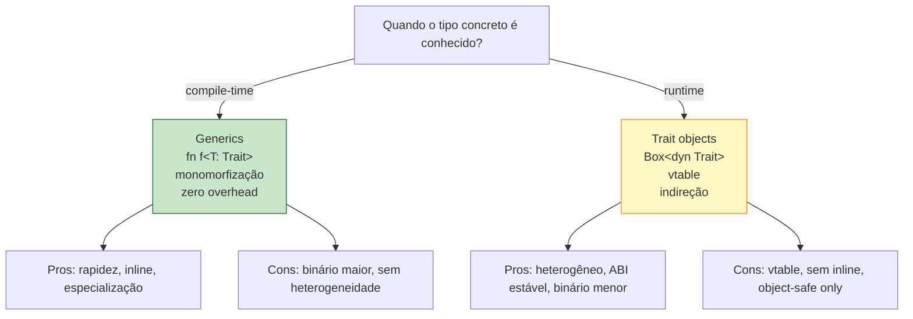

<a id="capitulo-24"></a>
# Capítulo 24: Trait Objects e Despacho Dinâmico

> *"Polimorfismo é uma promessa de que duas coisas diferentes podem ser tratadas igual. A questão é quando você descobre o tipo verdadeiro: na hora de compilar, ou na hora de rodar."*

> *"Toda vtable é um relógio que bate quando o programador não pôde decidir antes."*

## 24.1 O Limite de Generics

Generics são monomorfizados. Para monomorfizar, o compilador precisa saber, em compile-time, todos os tipos concretos. Há cenários onde isso é impossível por construção:

```rust
trait Animal {
    fn som(&self) -> String;
}

struct Cao;
struct Gato;
struct Pato;

impl Animal for Cao  { fn som(&self) -> String { String::from("au")  } }
impl Animal for Gato { fn som(&self) -> String { String::from("miau") } }
impl Animal for Pato { fn som(&self) -> String { String::from("quack") } }

fn zoo() -> Vec<???> {
    vec![Cao, Gato, Pato]  // três tipos diferentes
}
```

Não posso escrever `Vec<Cao>` — não cabe gato. Não posso escrever `Vec<T: Animal>` — `Vec` exige um único `T` concreto, e tem três aqui. Generics não resolvem.

A solução é **trait objects**: tratar a trait como um tipo. Nasce a sintaxe `dyn Animal`:

```rust
fn zoo() -> Vec<Box<dyn Animal>> {
    vec![
        Box::new(Cao),
        Box::new(Gato),
        Box::new(Pato),
    ]
}

fn main() {
    for animal in zoo() {
        println!("{}", animal.som());
    }
}
```

`Box<dyn Animal>` significa "um ponteiro para alguma coisa em heap que implementa `Animal`, mas eu não sei o quê". O `dyn` é literalmente "dinâmico" — o tipo concreto será conhecido só em runtime.

Esse mecanismo é conceitualmente idêntico a `interface{}` em Go (com método set), `Object` com interface em Java, ou variáveis tipadas como interface em TS.

## 24.2 O Que `dyn Trait` Realmente É

`dyn Animal` é um tipo **unsized** — o compilador não sabe quanto ele ocupa. Pode ser `Cao` (zero bytes), pode ser `Pato` (24 bytes), pode ser uma struct de 1KB. Por isso você nunca usa `dyn Trait` direto, sempre por trás de uma indireção:

```rust
&dyn Animal           // referência a algum animal em algum lugar
&mut dyn Animal       // referência mutável
Box<dyn Animal>       // ponteiro pra heap, ownership
Rc<dyn Animal>        // ponteiro com refcount
Arc<dyn Animal>       // ponteiro thread-safe
```

Cada um desses é um **fat pointer**: dois ponteiros lado a lado:

```text
Box<dyn Animal>
┌──────────────┬──────────────┐
│ data ptr     │ vtable ptr   │
└──────────────┴──────────────┘
       │              │
       ▼              ▼
   [dados]      [ vtable do Cao ]
                 ├ destructor
                 ├ size, align
                 └ fn som() -> String
```

O primeiro ponteiro aponta para os dados. O segundo aponta para a **vtable** do tipo concreto. A vtable é uma tabela estática, criada pelo compilador para cada par (tipo, trait), contendo:

1. Um ponteiro para o destructor (`drop_in_place`).
2. O tamanho e alinhamento do tipo.
3. Um ponteiro para cada método da trait, na ordem.

Quando você chama `animal.som()`, o compilador gera:

```text
1. carregar ponteiro pra vtable
2. ler o slot de "som" da vtable (offset fixo)
3. chamar a função apontada, passando data ptr como self
```

São duas indireções. Comparado a uma chamada estática (chamada direta + inline), tem custo:

- **Cache miss potencial**: a vtable está em outra região de memória.
- **Branch prediction degradada**: o CPU não sabe qual função vai ser até carregar a vtable.
- **Sem inline**: o compilador não sabe qual função vai ser chamada, então não pode inlinar.

Em hot loops, o custo é mensurável (ordem de 5-30% dependendo do código). Em chamadas eventuais, é irrelevante.

## 24.3 Comparação com Outras Linguagens

### TypeScript — Sempre Dinâmico

```typescript
interface Animal {
  som(): string;
}

const zoo: Animal[] = [new Cao(), new Gato(), new Pato()];
zoo.forEach(a => console.log(a.som()));
```

Em TS, *toda* chamada de método em interface é dinâmica. JavaScript debaixo é prototype-based; cada método é um lookup no prototype chain. Não há escolha estática vs dinâmica — é sempre lookup. O JIT (V8) otimiza com inline caches, mas conceitualmente é despacho dinâmico permanente.

### Go — Interface = Trait Object Sempre

```go
type Animal interface {
    Som() string
}

var zoo []Animal = []Animal{Cao{}, Gato{}, Pato{}}
for _, a := range zoo {
    fmt.Println(a.Som())
}
```

`interface` em Go é exatamente o que `dyn Trait` é em Rust: um fat pointer (data + itab, sendo itab quase idêntica a vtable). Toda variável de tipo interface paga vtable. Go não tem o equivalente a generics monomorfizados com bound de trait — você sempre paga o custo dinâmico ao falar com interfaces. Generics (1.18+) ajudaram, mas não são tão integrados a interfaces quanto `T: Trait` é a `dyn Trait` em Rust.

### Java — Sempre Vtable

```java
List<Animal> zoo = List.of(new Cao(), new Gato(), new Pato());
zoo.forEach(a -> System.out.println(a.som()));
```

JVM despacha tudo via vtable. JIT (HotSpot) faz devirtualização agressiva quando consegue provar que o tipo é único, mas o modelo conceitual é sempre dinâmico.

### C — Não Tem

C não tem polimorfismo de subtipo. Você emula com `struct` contendo ponteiros para função:

```c
typedef struct {
    char* (*som)(void* self);
    void* self;
} Animal;
```

É uma vtable manual. Trabalhosa, sem segurança de tipos, e cada autor reinventa a roda (compare GTK, COM, vtables do kernel Linux).

### Resumo

| Linguagem | Default | Tem opção estática? |
|---|---|---|
| C | manual com ponteiros pra função | sim, mas você escreve tudo |
| C++ | virtual = dinâmico | não-virtual = estático |
| Java | sempre dinâmico (JIT devirtualiza) | não diretamente |
| Go | sempre dinâmico em interfaces | não |
| TypeScript | sempre dinâmico em runtime | só compile-time (apagado) |
| **Rust** | **estático com generics** | **`dyn` opt-in para dinâmico** |

Rust é a única linguagem mainstream onde o default é estático — você precisa escrever `dyn` explicitamente para optar pelo custo dinâmico. Em todas as outras, você paga vtable a menos que o compilador descubra que pode otimizar.

## 24.4 Quando Usar `dyn` vs Generics

A decisão é mecânica:

```rust
// (a) Heterogeneidade em runtime → dyn
fn renderizar_widgets(ws: Vec<Box<dyn Widget>>) { ... }

// (b) Homogêneo, performance crítica → generics
fn ordenar<T: Ord>(items: &mut [T]) { ... }

// (c) Plugin/lib pública sem explosão de binário → dyn
fn registrar(handler: Box<dyn Fn(Request) -> Response>) { ... }

// (d) Hot loop, tipo único conhecido → generics
fn somar<I: Iterator<Item = i32>>(it: I) -> i32 { it.sum() }
```

Heurísticas:

- **Coleção de tipos diferentes que compartilham trait** → `dyn`.
- **Função genérica chamada em hot path com tipo conhecido** → generics.
- **Callback opaco passado entre módulos** → `Box<dyn Fn>` (evita propagar genéricos).
- **Quer estabilidade de ABI** → `dyn` (genéricos não têm ABI estável).
- **Binário precisa ser pequeno** → `dyn` (uma cópia em vez de N).

A regra do polegar: **comece com `dyn` quando a heterogeneidade é o ponto, com generics quando a performance é o ponto**.

## 24.5 Object Safety — Quem Pode Ser `dyn`

Nem toda trait pode virar trait object. Algumas restrições impedem o compilador de construir vtable consistente. As regras são técnicas, mas tem três grandes proibições:

### Proibição 1 — `Self` em retorno ou parâmetro (exceto self)

```rust
trait Clonavel {
    fn clonar(&self) -> Self;   // ❌ Self é o tipo concreto, vtable não sabe qual é
}

// Não pode &dyn Clonavel — qual é o Self?
```

Se o método retorna `Self`, o tipo de retorno depende do tipo concreto, que está apagado. A vtable precisaria de um slot por implementação concreta. Inviável.

### Proibição 2 — Métodos genéricos

```rust
trait Processador {
    fn processar<T>(&self, item: T);  // ❌ não sei quais T existem
}
```

A vtable precisaria de um slot por monomorfização — essencialmente, infinito. Por isso métodos genéricos não são object-safe.

### Proibição 3 — Constantes associadas, etc

Algumas features mais novas (`async fn` em traits estabilizou recentemente, RPITIT) tem restrições especiais para `dyn`. A regra geral é simples: **se o método depende do tipo concreto de uma forma que a vtable não consegue codificar, não é object-safe**.

A solução prática quando você quer ambos:

```rust
trait Animal {
    fn som(&self) -> String;          // object-safe
    fn debug(&self) where Self: Sized; // só funciona com tipo concreto
}
```

`where Self: Sized` esconde o método do `dyn` — ele só existe em chamada estática. Padrão comum.

## 24.6 Trait Upcasting — Estabilizado Recente

Por muito tempo, isto não compilava em Rust:

```rust
trait Animal {}
trait Mamifero: Animal {}

fn upcast(m: &dyn Mamifero) -> &dyn Animal {
    m  // anteriormente: erro
}
```

Faz sentido lógico: todo mamífero é animal, então `&dyn Mamifero` deveria virar `&dyn Animal`. Mas a vtable do trait object não tem ponteiro pra vtable do supertrait — precisava de um lookup adicional. Só foi estabilizado em Rust 1.86 (2025).

Hoje, upcasting funciona transparente. Se você está com versão antiga ou em código pré-1.86, o workaround é adicionar um método explícito:

```rust
trait Mamifero: Animal {
    fn como_animal(&self) -> &dyn Animal;
}
```

## 24.7 Custo Concreto — Medindo

Vamos comparar versão estática vs dinâmica:

```rust
trait Som {
    fn som(&self) -> &'static str;
}

struct A;
struct B;
struct C;
impl Som for A { fn som(&self) -> &'static str { "a" } }
impl Som for B { fn som(&self) -> &'static str { "b" } }
impl Som for C { fn som(&self) -> &'static str { "c" } }

// Versão estática — monomorfizada
fn estatico<T: Som>(x: T) -> &'static str {
    x.som()
}

// Versão dinâmica
fn dinamico(x: &dyn Som) -> &'static str {
    x.som()
}
```

Em `cargo bench` rodando 10 milhões de iterações com tipos misturados:

```text
estatico_loop:    8 ms     (LLVM inlinou tudo)
dinamico_loop:   31 ms     (vtable lookup por iteração)
```

Quase 4x mais lento. Mas em código real, onde a chamada do método é uma fração pequena do trabalho, o impacto é fortemente diluído. Profile antes de otimizar.

## 24.8 Padrões Comuns

### Plugin registry

```rust
struct Engine {
    plugins: Vec<Box<dyn Plugin>>,
}

impl Engine {
    fn registrar(&mut self, p: Box<dyn Plugin>) {
        self.plugins.push(p);
    }

    fn rodar(&self) {
        for p in &self.plugins {
            p.executar();
        }
    }
}
```

Plugin externo registra qualquer struct que implemente `Plugin`. Heterogeneidade em runtime — `dyn` é a única opção.

### Callback opaco

```rust
struct Servidor {
    handlers: HashMap<String, Box<dyn Fn(Request) -> Response + Send + Sync>>,
}
```

`Fn(Request) -> Response` é uma trait. `dyn Fn(...)` é um trait object dela. Permite armazenar closures de tipos diferentes na mesma estrutura.

### Erro como dyn

```rust
fn main() -> Result<(), Box<dyn std::error::Error>> {
    // ...
    Ok(())
}
```

`Box<dyn Error>` é o "qualquer erro". Comum em `main` e em código de aplicação onde você só quer propagar.

## 24.9 Diagrama Mental



## 24.10 Resumo

- `dyn Trait` é tipo unsized, sempre por trás de indireção (`&`, `Box`, `Rc`, `Arc`).
- Implementado como fat pointer: dados + vtable.
- Custo: indireção, sem inline, possível cache miss.
- Use quando precisa heterogeneidade em runtime.
- Use generics quando o tipo é homogêneo e a performance importa.
- Object safety: `Self` no retorno, métodos genéricos, e `Sized` no contexto errado quebram.
- Rust é a única mainstream onde o default é estático — `dyn` é opt-in.

No próximo capítulo, vamos ao chão de fábrica das traits: as dezenas que você vai usar todo santo dia (`Display`, `Debug`, `Clone`, `Copy`, `Drop`, `Default`, `From`, `Into`, `Iterator`, `PartialEq`, `Eq`, `PartialOrd`, `Ord`, `Hash`).

---

> *"`dyn` é o pedágio que você paga quando o tipo só foi decidido depois do binário pronto."*

[Próximo: Capítulo 25 — Traits Cotidianos: Display, Debug, Clone, Copy, Drop →](ch25-traits-cotidianos.md)
