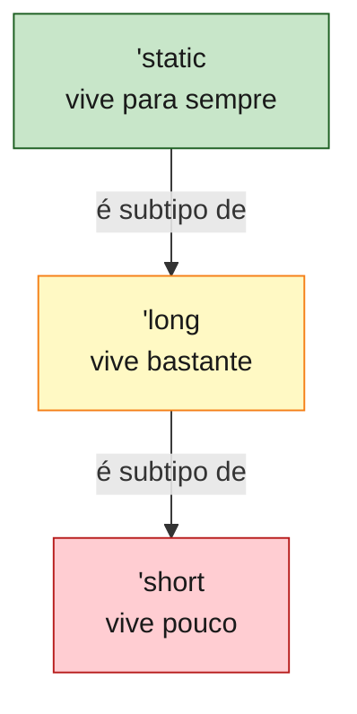

<a id="capitulo-26"></a>
# Capítulo 26: Lifetimes Avançados — Variance, HRTB, `'static`

> *"Los compiladores no sueñan con cordeiros eléctricos. Sueñan con relaciones de subtipo que el programador olvidó declarar."*
> — anônimo, no canal `#rustc-dev` de 2019

> *"A lifetime is not a duration. It's a constraint."*
> — Niko Matsakis, RFC 2094 (NLL)

No Capítulo 12 vimos lifetimes como anotações: `'a`, `'b`, sintaxe para dizer ao borrow checker *"esta referência não pode viver mais do que aquela"*. Funciona para 80% do código que você escreverá. Mas existe um andar acima — onde lifetimes têm **subtipos**, structs genéricos têm **variância**, e funções de ordem superior precisam de uma anotação que parece um exorcismo: `for<'a>`.

Este capítulo é sobre esse andar.

Você não precisa dominar tudo aqui para escrever código de aplicação. Mas precisa para **ler bibliotecas sérias** — `serde`, `tokio`, `axum`, `rayon` — sem se sentir um turista em país estrangeiro. E precisa para o dia em que o compilador disser *"the lifetime requirement is not satisfied"* e a única saída for um `for<'a> Fn(...)`.

## 26.1 Subtyping de Lifetimes

Subtyping é a relação `Sub <: Super` — *Sub pode ser usado onde Super é esperado*. Em linguagens orientadas a objeto, é herança: `Cachorro <: Animal`. Em Rust, classes não existem; o subtyping vive quase inteiramente no domínio dos **lifetimes**.

A regra é uma só, e é contraintuitiva da primeira vez:

> Se `'long` contém `'short` no tempo, então **`'long <: 'short`** — `'long` é **subtipo** de `'short`.

Por quê? Porque qualquer lugar que aceite uma referência válida por um curto período (`'short`) também aceita uma referência válida por um longo período (`'long`). Coisas que vivem mais podem ser *substituídas* onde se pediam coisas que vivem menos. **Quem vive mais é mais específico**. É contraintuitivo porque "subtipo" sugere "menor", mas em lifetimes "subtipo" significa "tempo de vida maior".

```rust
fn imprime(s: &str) {
    println!("{}", s);
}

fn main() {
    let estatico: &'static str = "constante";
    let dinamica = String::from("alocada");
    let curta: &str = &dinamica;

    imprime(estatico); // ok
    imprime(curta);    // ok

    // 'static <: 'qualquer-coisa, então &'static str
    // pode ser passado onde se espera &'a str.
}
```

`&'static str` é um *subtipo* de `&'a str` para qualquer `'a`. Por isso literais entram em qualquer slot de `&str` — eles são as referências mais "específicas" possíveis.



A direção da seta — *"é subtipo de"* — vai do **mais longo** para o **mais curto**. O compilador faz **coerção implícita** descendo essa hierarquia: ele pode encurtar lifetimes silenciosamente. Nunca alongar.

### Comparando: TS, Go, C

- **TypeScript**: tem subtyping estrutural (`{ a: string, b: number } <: { a: string }`). Não tem nada como subtyping de tempo de vida porque o GC mantém tudo vivo o suficiente.
- **Go**: não tem subtyping nominal nenhum (interfaces são structurais). Sem GC explícito de tempo de vida, não há análogo.
- **C**: ponteiro é ponteiro. O compilador não distingue um ponteiro para uma string global de um para uma local. É por isso que C tem use-after-free.

Rust é a única dessas linguagens onde o tempo de vida participa do **sistema de tipos** — e portanto pode ter subtipos.

## 26.2 Variance: Como Tipos Compostos Herdam Subtipo

Subtipo direto é fácil. A pergunta interessante é:

> Se `'long <: 'short`, qual é a relação entre `Container<'long>` e `Container<'short>`?

A resposta depende do **container**. Existem três opções, e Rust derivou todas elas para você — mas você precisa saber qual é qual quando escreve `unsafe` ou `PhantomData` (Capítulo 27).

### Covariância

`F<T>` é **covariante em T** quando `Sub <: Super` implica `F<Sub> <: F<Super>`. O subtipo "passa por dentro".

`&'a T` é covariante em `'a`. Por isso isto compila:

```rust
fn pega_curta<'curta>(_s: &'curta str) {}

fn main() {
    let estatica: &'static str = "vive para sempre";
    pega_curta(estatica); // 'static <: 'curta — passa
}
```

A função pediu `&'curta str`. Você passou `&'static str`. O compilador *encurtou* o lifetime de `'static` para `'curta` porque referências imutáveis são covariantes. Você nem percebeu que isso aconteceu.

### Contravariância

`F<T>` é **contravariante em T** quando `Sub <: Super` implica `F<Super> <: F<Sub>` — a relação **inverte**.

O caso clássico: argumentos de função. `fn(&'a str)` é contravariante em `'a`.

```rust
fn aceita_qualquer(_: &str) {}            // fn(for<'a> &'a str)
fn aceita_so_static(_: &'static str) {}   // fn(&'static str)

fn usa_callback(f: fn(&'static str)) {
    f("hello");
}

fn main() {
    usa_callback(aceita_qualquer);   // ok — função mais GERAL no slot
    // usa_callback(aceita_so_static); // tautológico: equivalente
}
```

A intuição: se eu precisava de uma função que aceita `&'static str`, qualquer função que aceite **qualquer** `&'a str` serve — afinal, `'static` é uma das possibilidades. O contrário não vale: uma função que só aceita `'static` não consegue lidar com referências de vida curta.

Argumentos consomem; quanto mais o consumidor aceita, mais ele serve. Isso é contravariância.

### Invariância

`F<T>` é **invariante em T** quando não existe nenhuma relação de subtipo entre `F<Sub>` e `F<Super>`. Os tipos têm que bater **exatamente**.

O caso doloroso: `&mut T`. Mais doloroso ainda: `Vec<T>` quando T contém um lifetime, e `Cell<T>`, `RefCell<T>`, `UnsafeCell<T>`.

Por que `&mut T` é invariante em `T`? Porque referência mutável permite **escrever**. Se fosse covariante, isto compilaria:

```rust,ignore
fn substitui<'curta, T>(slot: &mut &'curta T, val: &'curta T) {
    *slot = val;
}

fn main() {
    let mut alvo: &'static str = "hello";
    {
        let dinamica = String::from("world");
        substitui(&mut alvo, &dinamica); // não compila, GRAÇAS A DEUS
    }
    println!("{}", alvo); // alvo apontaria para memória liberada
}
```

Se `&mut &'static str` aceitasse ser tratado como `&mut &'curta str` (covariância), `substitui` poderia gravar uma referência de vida curta numa variável que se promete `'static`. Use-after-free silencioso. Invariância proíbe isso.

### Por Que `Vec<T>` é Covariante em T (Mas Não Quando T é `&mut`)

Aqui é onde a maioria erra. `Vec<T>` **é** covariante em `T` — mas só funciona como você espera quando `T` em si é covariante.

```rust
// Vec<&'static str> pode ser usado onde se espera Vec<&'a str>?
fn pega_vec<'a>(_v: Vec<&'a str>) {}

fn main() {
    let v: Vec<&'static str> = vec!["a", "b"];
    pega_vec(v); // ok — Vec é covariante, &'static str <: &'a str
}
```

Mas `Vec<&mut T>` herda a invariância de `&mut T`. Variância de struct genérico é a **interseção** das variâncias dos seus campos. Um campo invariante contamina o todo. *Invariância vence*.

### Tabela de Variância de Campos Conhecidos

| Tipo | Variância em `'a` | Variância em `T` |
|---|---|---|
| `&'a T` | covariante | covariante |
| `&'a mut T` | covariante | **invariante** |
| `Box<T>` | — | covariante |
| `Vec<T>` | — | covariante |
| `*const T` | — | covariante |
| `*mut T` | — | **invariante** |
| `Cell<T>`, `RefCell<T>`, `UnsafeCell<T>` | — | **invariante** |
| `fn(T) -> U` | — | **contravariante em T**, covariante em U |
| `PhantomData<T>` | — | covariante (ver Cap. 27) |

A regra prática para escrever bibliotecas:

- Se você só **lê** `T`: covariante.
- Se você **escreve** `T` por trás de uma referência: invariante.
- Se você **consome** `T` como argumento de função armazenada: contravariante.

## 26.3 HRTB — Higher-Ranked Trait Bounds

Existe um problema que não se resolve com subtyping: *"esta closure tem que aceitar referências de **qualquer** lifetime, não de um lifetime específico"*.

Considere:

```rust,ignore
fn aplica<F>(f: F)
where
    F: Fn(&str) -> usize,
{
    let s = String::from("uma");
    f(&s);
    let t = String::from("outra");
    f(&t);
}
```

A função quer chamar `f` com **referências diferentes**, criadas em escopos diferentes, com lifetimes diferentes. Se você anotasse:

```rust,ignore
fn aplica<'a, F>(f: F)
where
    F: Fn(&'a str) -> usize,
```

…o lifetime `'a` seria fixado no momento em que `aplica` é chamada. Você não conseguiria passar `&s` e `&t` se eles tivessem lifetimes distintos. O sistema de tipos precisa de uma forma de dizer *"f aceita qualquer `&'a str`, escolhido a cada chamada"*.

Essa forma é o **HRTB** — Higher-Ranked Trait Bound:

```rust
fn aplica<F>(f: F)
where
    F: for<'a> Fn(&'a str) -> usize,
{
    let s = String::from("uma");
    f(&s);
    let t = String::from("outra");
    f(&t);
}

fn main() {
    aplica(|s: &str| s.len());
}
```

Leia `for<'a> Fn(&'a str) -> usize` como *"para todo lifetime `'a`, esta closure aceita `&'a str`"*. É **quantificação universal sobre lifetimes**. O lifetime não é parâmetro de `aplica`; é parâmetro do **trait bound em si**. A closure carrega a habilidade de funcionar para qualquer `'a`.

### O Açúcar Que Você Não Notou

Quando você escreve:

```rust,ignore
fn map<F: Fn(&str) -> usize>(f: F) { ... }
```

…o compilador **inseriu silenciosamente** um `for<'a>` na sua frente. A elisão de lifetime para `Fn`/`FnMut`/`FnOnce` traduz `Fn(&str)` em `for<'a> Fn(&'a str)`. HRTB é o caso geral; a sintaxe sem `for` é o açúcar comum.

Você só **digita** `for<'a>` quando a elisão não consegue inferir — tipicamente quando o trait bound aparece em uma struct, em um trait associate type, ou em uma posição onde o compilador exige a forma desugar.

```rust
struct Validador<F>
where
    F: for<'s> Fn(&'s str) -> bool,
{
    regra: F,
}

impl<F> Validador<F>
where
    F: for<'s> Fn(&'s str) -> bool,
{
    fn checa(&self, entradas: &[String]) -> bool {
        entradas.iter().all(|s| (self.regra)(s))
    }
}
```

Sem `for<'s>`, a struct precisaria de um lifetime parameter `'s` próprio, e cada instância da struct ficaria amarrada a strings de um único lifetime — exatamente o que queremos evitar.

### Comparando: TS e Go

TypeScript tem o equivalente: generics em parâmetros de função são higher-ranked.

```typescript
type Validador = <S extends string>(s: S) => boolean;
```

`<S extends string>` ali dentro do tipo é o `for<S>` de Rust — quantificação universal por chamada. TypeScript não chama de HRTB porque o termo vem do mundo de Hindley-Milner / System F, mas o mecanismo é o mesmo.

Go não tem. Generics em Go (1.18+) são prenex — o parâmetro de tipo vive na função, não no trait bound. Não há como dizer *"esta closure funciona para qualquer T"* no tipo de um campo struct sem amarrar T à struct.

C nem tem closures.

## 26.4 `'static` — Quando, Como, Por Que

`'static` é o lifetime mais incompreendido de Rust. A confusão começa pelo nome.

> **`'static` não significa "vive para sempre". Significa "PODE viver para sempre".**

Releia. É a diferença entre obrigação e permissão. Uma referência `&'static str` *pode* permanecer válida até o fim do programa — mas você pode escolher não usá-la, dropar antes, fazer o que quiser. O compilador só exige que ela **não dependa** de nada que tenha tempo de vida menor.

### Três Maneiras de Algo Ser `'static`

**1. Literais e estáticos verdadeiros**

```rust
let s: &'static str = "Felipe";          // string literal, vive na seção .rodata
static GLOBAL: u32 = 42;                  // dado estático
let r: &'static u32 = &GLOBAL;
```

São embutidos no binário. Vivem do `main` até o fim.

**2. `Box::leak` — vazamento intencional**

```rust
fn vaza() -> &'static str {
    let s: String = String::from("dinamicamente alocado");
    Box::leak(s.into_boxed_str())
}
```

`Box::leak` desativa o `Drop`. A memória **nunca** é liberada — efetivamente promovida a estática em runtime. Útil para configurações que carregam uma vez e duram o programa todo (rotas HTTP, schemas).

**3. Tipos *owned* satisfazem `T: 'static`**

Aqui mora a confusão. Existem **dois usos** de `'static`:

- `&'static T` — referência que vive para sempre. Restritivo.
- `T: 'static` — bound que diz *"T não contém referências com lifetime menor que `'static`"*. Permissivo.

Um `String`, um `Vec<u32>`, um `User` que só tenha campos owned — todos satisfazem `T: 'static`. Por quê? Porque eles **não dependem** de nenhuma referência externa. Você pode mantê-los pelo tempo que quiser. Eles podem ser dropados a qualquer momento. *Podem* viver até o fim.

```rust
fn quer_static<T: 'static>(_x: T) {}

fn main() {
    let s: String = String::from("alocada em runtime, dropada no fim do main");
    quer_static(s);             // ok — String: 'static
    quer_static(42i32);         // ok — i32: 'static
    quer_static(vec![1, 2, 3]); // ok — Vec<i32>: 'static

    let temporaria = String::from("x");
    let r: &str = &temporaria;
    // quer_static(r);          // ERRO — &'a str não satisfaz 'static
}
```

Quando você vê `T: 'static` em assinaturas de tokio (`spawn`), rayon, ou de qualquer `Box<dyn Trait>` sem lifetime explícito, é **esse** sentido. *"T pode viver tanto quanto for preciso"*. Não *"T tem que ser literal"*.

### A Tabela Que Resolve Discussões

| Sintaxe | Significado | Exemplo que satisfaz |
|---|---|---|
| `&'static T` | referência válida pela vida do programa | string literal, dado em `.rodata`, `Box::leak` |
| `T: 'static` | T não contém referência mais curta que `'static` | `String`, `i32`, `User` (owned), `&'static str` |

`String: 'static` é verdade. `&'static String` é (quase sempre) absurdo.

## 26.5 Self-Referential Structs — O Tabu

A pergunta inevitável de todo programador vindo de C++:

> *"Como faço uma struct onde um campo aponta para outro campo da mesma struct?"*

```rust,ignore
struct Doc {
    texto: String,
    primeira_linha: &str, // aponta para dentro de `texto`
}
```

Em C, simples — guarda um ponteiro. Em C++, idem (com cuidado). Em Rust, **impossível** sem ferramentas extras.

Por quê? Porque move semantics (Capítulo 13) faz a struct se mover de endereço sem aviso. Se `primeira_linha` apontasse para dentro de `texto`, e a struct fosse movida, o ponteiro ficaria pendurado — violação de soundness.

Tente anotar lifetime:

```rust,ignore
struct Doc<'a> {
    texto: String,
    primeira_linha: &'a str,
}
```

`'a` precisaria ser *"o lifetime da própria struct"*, e Rust não tem essa noção. Não existe `'self`. O sistema de lifetimes foi desenhado para relações **entre** valores, não dentro de um.

### Soluções

1. **Indireção: armazene índices, não referências.**

```rust
struct Doc {
    texto: String,
    primeira_linha_inicio: usize,
    primeira_linha_fim: usize,
}

impl Doc {
    fn primeira_linha(&self) -> &str {
        &self.texto[self.primeira_linha_inicio..self.primeira_linha_fim]
    }
}
```

Idiomático. Resolve 90% dos casos.

2. **`Pin<Box<T>>`** — fixa a struct no heap (Capítulo 38).

3. **Crates externas**: `ouroboros`, `self_cell`, `yoke`. Usam macros para gerar `unsafe` correto que mantém a invariante por você.

A regra cultural de Rust: *"se você precisa de self-referential, repense o design primeiro"*. Quase sempre dá para evitar.

### Compare

- **TypeScript**: trivial — referências são GC-vivas. `{ texto, primeiraLinha }` funciona. Mas você não tem garantia de que `primeiraLinha` aponta para dentro de `texto` — pode estar desincronizada.
- **Go**: trivial — escape analysis joga no heap, tudo aponta tudo. Sem invariante de consistência.
- **C**: trivial e perigoso — basta um `realloc` numa string e o ponteiro morre. É o caso onde Rust se recusa a fingir.

## 26.6 Lifetime no Retorno vs no Argumento

Última distinção do capítulo, e a mais útil no dia-a-dia.

> **No argumento**: o caller escolhe o lifetime. *"Você me dá uma referência de algum tempo de vida que eu nem sei qual; eu prometo não usá-la mais que isso"*.

> **No retorno**: a função promete que a referência vive **pelo menos** o tempo `'a`. O caller usa essa promessa para encadear.

```rust
// Argumento: 'a vem do caller. A função recebe e devolve preservando.
fn primeira_palavra<'a>(s: &'a str) -> &'a str {
    s.split_whitespace().next().unwrap_or("")
}

fn main() {
    let dono = String::from("Felipe Coelho Ness");
    let palavra = primeira_palavra(&dono);
    println!("{}", palavra); // ok, dono vive
}
```

O lifetime `'a` está no retorno **porque** estava no argumento. É elidido na maioria dos casos por uma das três regras de elisão (Capítulo 12). Você só escreve explicitamente quando há ambiguidade — múltiplas entradas, retorno relacionado a uma específica.

```rust
fn maior_de_dois<'a>(x: &'a str, y: &'a str) -> &'a str {
    if x.len() >= y.len() { x } else { y }
}
```

A unificação para `'a` aqui obriga `x` e `y` a compartilharem lifetime — efetivamente, o **mais curto** dos dois. O compilador encurta o longo para casar com o curto (covariância de `&T`). O retorno só é válido enquanto **ambos** estiverem.

### O Erro Clássico: Retorno Sem Argumento

```rust,ignore
fn cria_referencia<'a>() -> &'a str {
    let s = String::from("local");
    &s // ERRO: retorna referência para algo que será dropado
}
```

Não tem lifetime de entrada para "espelhar". O `'a` no retorno é uma promessa que a função **não consegue cumprir**. O compilador recusa.

Soluções: devolver `String` (owned), devolver `&'static str` (literal), ou aceitar input e retornar derivado dele.

### Diferenças Entre Argumento e Retorno em Inferência

| Posição | Quem escolhe | O que o compilador infere |
|---|---|---|
| Argumento `&'a T` | caller | lifetime mais curto que ainda satisfaz a função |
| Retorno `&'a T` (sem input) | função (impossível) | requer `'static` ou owned |
| Retorno `&'a T` (com input) | função, espelhando input | mesmo lifetime do input correspondente |
| `&self` em método | objeto | retorno default tem o lifetime de `self` |

A última linha é a regra de elisão #3, e é por isso que você quase nunca escreve lifetime em métodos: o retorno *ganha* o lifetime de `&self` automaticamente.

## 26.7 Onde Isto Aparece na Prática

Você não escreverá `for<'a>` toda semana. Mas você vai **ler** isso em:

- `serde::Deserialize<'de>` — o lifetime `'de` é HRTB nas implementações genéricas.
- `tokio::spawn<F>` exige `F: Future + Send + 'static` — é o `T: 'static` permissivo, não restritivo.
- `axum` handlers — composição de closures com HRTB sob o capô.
- `dyn Trait` sem lifetime — implícito `'static`. Por isso `Box<dyn Error>` quase sempre dá certo.
- `rayon::scope` vs `rayon::spawn` — scope permite lifetimes não-`'static`; spawn exige `'static`. Mesma distinção.

Quando o compilador reclamar de `lifetime requirement`, faça três perguntas, nessa ordem:

1. **Subtyping**: posso encurtar uma `'static` para o lifetime requerido? Geralmente sim, automaticamente.
2. **Variance**: meu container é invariante em algum parâmetro? `&mut`, `Cell`, mutáveis em geral?
3. **HRTB**: meu trait bound precisa funcionar para *qualquer* lifetime, não para um fixo? Se sim, `for<'a>`.

E quando ler `'static` numa assinatura, lembre da regra-mantra:

> *`'static` não significa "vive para sempre". Significa "não depende de nada que morra antes".*

## 26.8 Encerramento

Lifetime básico — o que você viu no Capítulo 12 — é uma anotação. Lifetime avançado é uma **álgebra**: subtipos formam uma hierarquia, containers herdam variâncias, traits quantificam universalmente, e `'static` é uma permissão, não um decreto.

O preço dessa álgebra é cognitivo. O ganho é que **nenhum bug de memória sobrevive ao compilador**. Não em runtime. Não em produção. Antes do binário existir.

C te dá liberdade total e cobra em CVEs. Go te dá GC e cobra em pausas. TypeScript te dá tipos rasos e cobra em bugs no runtime. Rust te dá esta álgebra — e cobra a paciência de aprendê-la. É um preço único, pago uma vez. O retorno é vitalício.

No próximo capítulo, vamos para o lugar onde essa álgebra encontra o sistema de tipos cheio: **PhantomData**. O marcador zero-sized que diz ao compilador *"finja que esta struct contém um T, mesmo que não contenha"* — e com isso, abre as portas para type-state machines, sealed traits, e programação a nível de tipos.

---

> *"Variance is what the compiler is doing while you're not looking. Once you start looking, you understand half of `unsafe`."*

[← Capítulo 25: Traits Cotidianos](../part-08-generics-and-traits/ch25-traits-cotidianos.md) | [Próximo: Capítulo 27 — PhantomData e Type-Level Programming →](ch27-phantomdata.md)
