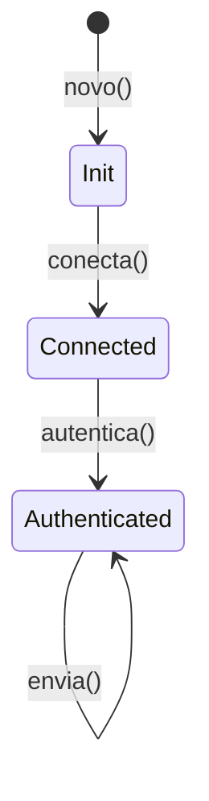

<a id="capitulo-27"></a>
# Capítulo 27: PhantomData e Type-Level Programming

> *"Toda abstração suficientemente avançada de tipos é indistinguível de magia. Toda magia suficientemente analisada é indistinguível de PhantomData."*
> — paráfrase de Clarke, posta numa thread do `/r/rust` em 2021

> *"The type system is not a constraint. It's a programming language for the compiler."*
> — Edwin Brady, criador do Idris

No capítulo anterior, vimos que a variância de uma struct vem dos **campos**. Mas e se você precisa que o sistema de tipos rastreie um parâmetro genérico que **não aparece em nenhum campo**? Por exemplo, um iterador inseguro que carrega um `*const T` cru e precisa fingir que possui referências `&'a T`?

A resposta é `PhantomData<T>` — uma struct de tamanho zero que existe apenas para o compilador, nunca para o programa. Ela ocupa zero bytes em runtime. No tempo de compilação, é a diferença entre código correto e código que vaza memória.

Este capítulo é sobre `PhantomData` e o universo que ela abre: type-state machines, sealed traits, const generics, e a ideia mais ampla de **type-level programming** — usar o sistema de tipos como uma linguagem própria para descrever invariantes que o runtime nunca vai checar, porque ele não vai precisar.

## 27.1 O Problema: Parâmetro Genérico Que Não Vai a Lugar Nenhum

Considere um iterador caseiro que percorre um buffer cru:

```rust,ignore
struct Iter<'a, T> {
    ptr: *const T,
    end: *const T,
}
```

Compila? Não:

```
error[E0392]: parameter `'a` is never used
```

O compilador detectou: você declarou `'a` na struct, mas ele não aparece em campo nenhum. Para ele, `'a` é cosmético. Mas você sabe que **é importante** — porque `ptr` é, na verdade, um ponteiro para algo que vive `'a`. Você só usou `*const T` em vez de `&'a T` para evitar overhead de verificação.

A solução não é colocar uma referência fictícia. É marcar o parâmetro como **conceitualmente presente**:

```rust
use std::marker::PhantomData;

struct Iter<'a, T> {
    ptr: *const T,
    end: *const T,
    _marker: PhantomData<&'a T>,
}
```

`PhantomData<&'a T>` ocupa zero bytes — `std::mem::size_of::<PhantomData<&'a T>>() == 0`. Mas para o compilador, é como se a struct contivesse uma `&'a T`. Variância, drop check, auto traits — tudo passa a se comportar como deveria.

> **Regra**: use `PhantomData` quando seu parâmetro de tipo ou de lifetime tem **significado** mas não tem **representação** em nenhum campo.

## 27.2 As Variantes de `PhantomData` — Cada Uma Diz Algo Diferente

`PhantomData<T>` não é uma coisa só. É uma família. Cada variante codifica uma **semântica diferente** de posse e variância. Escolher a errada não é erro de compilação — é bug de soundness.

A tabela canônica, do Nomicon:

| Variante | Variância de `T` | `Send`/`Sync` herdados | Drop check considera owns T? |
|---|---|---|---|
| `PhantomData<T>` | covariante | de `T` | **sim** |
| `PhantomData<&'a T>` | covariante (em `'a` e `T`) | requer `T: Sync` | não |
| `PhantomData<&'a mut T>` | invariante em `T` | de `T` | não |
| `PhantomData<*const T>` | covariante | `!Send + !Sync` | não |
| `PhantomData<*mut T>` | **invariante** em `T` | `!Send + !Sync` | não |
| `PhantomData<fn(T)>` | **contravariante** em `T` | `Send + Sync` | não |
| `PhantomData<fn() -> T>` | covariante | `Send + Sync` | não |

Tradução prática:

- **"Eu possuo um T por valor, eventualmente vou dropá-lo"**: `PhantomData<T>`. Drop checker vai te exigir que `T` seja válido até o fim.
- **"Eu finjo guardar uma referência imutável a T"**: `PhantomData<&'a T>`. Para iteradores read-only.
- **"Eu finjo guardar uma referência mutável a T"**: `PhantomData<&'a mut T>`. Invariância em T entra. Para iteradores mutáveis.
- **"Eu uso T em um contexto que produz, não consome"**: `PhantomData<fn() -> T>`. Marca de domínio sem auto-traits restritivos.
- **"Eu quero T fora do auto-Send/Sync"**: `PhantomData<*const T>` ou `*mut T`. Para tipos que carregam ponteiros crus.

### Vec, no Stdlib

```rust,ignore
pub struct Vec<T, A: Allocator = Global> {
    buf: RawVec<T, A>,
    len: usize,
}

pub struct RawVec<T, A: Allocator = Global> {
    ptr: NonNull<T>,
    cap: Cap,
    alloc: A,
    _marker: PhantomData<T>, // declara que possui T
}
```

`PhantomData<T>` ali existe para que o **drop checker** entenda que `Vec<T>` possui valores `T` e precisa garantir que `T` esteja válido durante o drop do Vec. Sem isso, o drop checker permitiria drops em ordem errada quando `T` contém referências.

### Iter, no Stdlib

```rust,ignore
pub struct Iter<'a, T: 'a> {
    ptr: NonNull<T>,
    end: *const T,
    _marker: PhantomData<&'a T>,
}
```

Aqui é `&'a T` porque o iterador **não possui** os elementos — só os referencia. Ele é um observador covariante e Send se `T: Sync`.

## 27.3 Type-State Pattern com PhantomData

Agora a aplicação que paga o investimento. **Type-state**: usar o sistema de tipos para garantir que operações só sejam chamadas em estados válidos.

Exemplo: um cliente HTTP que tem três estados — `Init`, `Connected`, `Authenticated`. `send` só pode ser chamado em `Authenticated`.

Em TypeScript, você escreveria isso com discriminated unions e narrow no runtime. Em Go, você teria três structs e funções que retornam a próxima. Em Rust, você usa **um único struct** parametrizado por um marcador de estado:

```rust
use std::marker::PhantomData;

// Marcadores de estado — zero-sized, nunca instanciados em runtime.
struct Init;
struct Connected;
struct Authenticated;

struct Cliente<Estado> {
    socket: Option<std::net::TcpStream>,
    token: Option<String>,
    _state: PhantomData<Estado>,
}

impl Cliente<Init> {
    fn novo() -> Self {
        Self { socket: None, token: None, _state: PhantomData }
    }

    fn conecta(self, _addr: &str) -> Cliente<Connected> {
        // setup do socket...
        Cliente { socket: None, token: None, _state: PhantomData }
    }
}

impl Cliente<Connected> {
    fn autentica(self, _credenciais: &str) -> Cliente<Authenticated> {
        Cliente { socket: self.socket, token: Some("xxx".into()), _state: PhantomData }
    }
}

impl Cliente<Authenticated> {
    fn envia(&self, _mensagem: &str) -> Result<(), std::io::Error> {
        Ok(())
    }
}

fn main() {
    let cliente = Cliente::<Init>::novo();
    let cliente = cliente.conecta("127.0.0.1:8080");
    let cliente = cliente.autentica("token-secreto");
    cliente.envia("hello").unwrap();

    // Cliente::<Init>::novo().envia("hello");   // ERRO de compilação
    // Cliente::<Connected>::...envia(...);       // ERRO de compilação
}
```



Cada transição **consome** o cliente (`self`, não `&self`) e devolve uma struct nova com estado novo. Não há como voltar atrás. Não há como pular. Não há como chamar `envia` num cliente que não foi autenticado — o método **nem existe** no tipo `Cliente<Init>`.

Custo em runtime: zero. `PhantomData<Init>` ocupa zero bytes. O compilador apaga tudo. Você acabou de codificar uma máquina de estados no sistema de tipos com **zero overhead**.

### Compare com TypeScript: Phantom via Branding

TS não tem PhantomData literal. Mas tem um truque idiomático — **branded types**:

```typescript
type Init = { readonly __brand: 'Init' };
type Connected = { readonly __brand: 'Connected' };
type Authenticated = { readonly __brand: 'Authenticated' };

type Cliente<S> = { socket: unknown; token: string | null; _state: S };

declare function novo(): Cliente<Init>;
declare function conecta(c: Cliente<Init>, addr: string): Cliente<Connected>;
declare function autentica(c: Cliente<Connected>, cred: string): Cliente<Authenticated>;
declare function envia(c: Cliente<Authenticated>, msg: string): void;

const c0 = novo();
const c1 = conecta(c0, "127.0.0.1");
const c2 = autentica(c1, "token");
envia(c2, "hello");
// envia(c0, "hello"); // ERRO: tipo Init não compatível com Authenticated
```

A diferença operacional é grande. Em TS, o `__brand` **existe** em runtime (mesmo que como propriedade marcada `readonly`) porque o tipo não tem como ser apagado sem suporte do compilador. Em Rust, `PhantomData` **garantidamente** desaparece — `size_of` prova isso. Em Go, simplesmente não dá: generics não permitem apagar parâmetros desse jeito.

| Linguagem | Mecanismo de phantom | Custo em runtime |
|---|---|---|
| Rust | `PhantomData<T>` | zero (struct ZST) |
| TypeScript | branded types (`& { __brand }`) | mínimo (campo extra opcional) |
| Go | — | impossível |
| C | — | impossível |

## 27.4 Sealed Traits: Privado-Mas-Genérico

Outro caso onde PhantomData/marker types brilham: **sealed traits**.

Um sealed trait é um trait público que **só pode ser implementado pelo seu próprio crate**. Útil quando você quer dar um trait como API mas reservar o direito de adicionar métodos sem quebrar usuários.

A receita idiomática:

```rust
// Em src/lib.rs
mod private {
    pub trait Sealed {}
}

pub trait Formato: private::Sealed {
    fn extensao(&self) -> &str;
}

pub struct Json;
pub struct Yaml;

impl private::Sealed for Json {}
impl private::Sealed for Yaml {}

impl Formato for Json {
    fn extensao(&self) -> &str { "json" }
}
impl Formato for Yaml {
    fn extensao(&self) -> &str { "yaml" }
}
```

Um usuário externo pode **usar** `dyn Formato`, pode passar `Json` ou `Yaml` como argumentos. Mas **não pode implementar `Formato`** para o seu próprio tipo, porque não tem como implementar `private::Sealed` — esse trait é privado.

```rust,ignore
// Em outro crate:
struct MeuFormato;
impl Formato for MeuFormato { ... } // ERRO: trait `Sealed` é privado
```

PhantomData não aparece aqui literalmente, mas o **espírito** é o mesmo: usar visibilidade e marker types como controles a nível de tipo. Você está programando o compilador.

## 27.5 Const Generics — Computação no Sistema de Tipos

PhantomData rastreia **tipos**. Const generics rastreiam **valores constantes**. Juntos, eles transformam o sistema de tipos numa pequena linguagem de programação.

```rust
struct Matriz<const LINHAS: usize, const COLUNAS: usize> {
    dados: [[f64; COLUNAS]; LINHAS],
}

impl<const M: usize, const N: usize> Matriz<M, N> {
    fn nova() -> Self where [(); M * N]: {
        Self { dados: [[0.0; N]; M] }
    }
}

// Multiplicação de matrizes só compila com dimensões compatíveis
impl<const M: usize, const N: usize, const P: usize> Matriz<M, N> {
    fn multiplica(self, _outra: Matriz<N, P>) -> Matriz<M, P> {
        // multiplicação 3xN com NxP -> 3xP, sempre
        Matriz { dados: [[0.0; P]; M] }
    }
}

fn main() {
    let a = Matriz::<3, 4>::nova();
    let b = Matriz::<4, 5>::nova();
    let c = a.multiplica(b); // c: Matriz<3, 5>

    let d = Matriz::<3, 4>::nova();
    let e = Matriz::<5, 6>::nova();
    // let f = d.multiplica(e); // ERRO: 4 != 5
}
```

Dimensões são **parâmetros de tipo**. Multiplicar matrizes incompatíveis é erro de compilação. Sem assert, sem pânico, sem teste.

### Estado da Arte

Const generics em Rust evoluíram em ondas:

- **`min_const_generics` (Rust 1.51, 2021)** — parâmetros const de tipos primitivos (`usize`, `bool`, char, ...). Estável. É o que você usa em 95% dos casos.
- **`generic_const_exprs` (nightly)** — permite expressões aritméticas em const generics (`[T; N + 1]`, `Matriz<{ M * N }>`). Ainda incompleto, mas onde a fronteira está.
- **`typenum`** — crate que emula naturais como tipos via traits encadeados. Era o estado da arte antes de min_const_generics. Hoje é legacy, mas ainda aparece em deps de bibliotecas mais antigas (criptografia, álgebra linear).
- **`arrayvec`** — `ArrayVec<T, const N: usize>`: vec de tamanho fixo no stack, sem alocação. Implementação canônica de min_const_generics aplicado a coleções.

Em `nestjs` ou em backends Go, você nunca toca isso. Em sistemas onde dimensões importam — gráficos, álgebra, criptografia, parsers binários — const generics é como passar de assembly para Fortran.

### Compare

- **TypeScript**: tem **literal types** (`type Vetor3 = [number, number, number]`) e **template literal types** (computação simples sobre strings). Não tem aritmética numérica em tipos sem ginástica recursiva limitada por uma profundidade fixa. Próximo, mas claramente um tier abaixo.
- **C++**: tem `template <size_t N>` desde 1998. Conceito mais antigo. Sintaxe mais hostil.
- **Go**: nada. Generics em Go aceitam tipos, não valores.
- **C**: nada. `#define` não conta.

## 27.6 Quando NÃO Usar Type-Level Programming

A síndrome óbvia: programador descobre PhantomData, type-state, const generics, sealed traits — e começa a codificar **tudo** no sistema de tipos. Isso é um caminho conhecido para código que ninguém lê.

Heurísticas para parar no tempo:

1. **Custou-lhe mais que dois `match` no runtime?** Provavelmente não vale.
2. **Outra pessoa no time vai precisar entender em três minutos?** Type-state ajuda quando o domínio tem 3-5 estados e fica documentado pela própria assinatura. Não ajuda quando vira um labirinto de marker types.
3. **A invariante é local ou cruza módulos?** Type-level brilha em invariantes que cruzam APIs públicas. Para invariantes internas, um `assert!` ou `Result` é mais legível.
4. **Você está pagando cognitivamente em troca de quê?** Performance? Já estava em zero-cost. Correção? Compare com testes table-driven.

A regra que segue do CLAUDE.md aplicada aqui: *"toda regra é heurística, não lei. Se aplicar a regra cria mais complexidade do que violá-la, documente o motivo e siga em frente"*.

Type-state é poderoso porque é **declarativo**: o tipo conta a história. Mas custa **legibilidade reversa**: alguém vendo `Cliente<Authenticated>` precisa saber que esse `<Authenticated>` é um phantom, não um campo. Documente. Sempre.

## 27.7 Trilha de Bibliotecas Para Estudar

Se você quer ver type-level programming em Rust real:

- **`typed-builder`** — gera builders onde o `.build()` só compila quando todos os campos obrigatórios foram setados. Type-state via PhantomData.
- **`http`** — `Request<Body>` com phantom de método: `Request<GET>` vs `Request<POST>` em algumas APIs.
- **`embedded-hal`** — pinos de microcontrolador com type-state (`Pin<Input>`, `Pin<Output>`, `Pin<Floating>`). Trocar de modo é uma transformação de tipo, não uma flag.
- **`serde`** — `Deserializer` carrega lifetime `'de` que serpenteia por trait bounds com HRTB e PhantomData internamente.
- **`nalgebra`** — matrizes com const generics e dimensões dinâmicas misturadas via `Dyn`/`Const<N>`.

Cada uma dessas bibliotecas paga o custo de complexidade de tipos para entregar **API impossível de usar errado**. É um trade-off honesto, e quando bem feito, brilhante.

## 27.8 Encerramento da Parte IX

Lifetimes são a contribuição original de Rust. C, C++, Go, TypeScript — nenhum deles modela tempo de vida no sistema de tipos. Java e C# não precisam, porque o GC absorve. Mas Rust o faz, e o faz **sem GC**, **sem pausas**, **sem custo em runtime**.

Os Capítulos 12, 26 e 27 cobrem o arco:

- **Capítulo 12**: o que é um lifetime, por que existe, sintaxe básica.
- **Capítulo 26**: subtyping, variance, HRTB, `'static`, retorno vs argumento.
- **Capítulo 27**: PhantomData, type-state, sealed traits, const generics.

Você pode escrever Rust por anos sem precisar dos Capítulos 26 e 27. Se você for um *application developer*, escreva. Mas no dia em que você for ler `serde` ou desenhar uma biblioteca pública — não há como pular.

A próxima parte muda de assunto: **smart pointers** — `Box`, `Rc`, `Arc`, e as estruturas de mutabilidade interior. É onde a posse vira **compartilhada**, e onde Rust admite, controladamente, padrões que C te dá de graça e que o GC esconde.

---

> *"Type-level programming é o que sobra quando você tira tudo que pode ser checado em runtime e ainda quer dormir tranquilo."*

[← Capítulo 26: Lifetimes Avançados](ch26-lifetimes-avancados.md) | [Próximo: Capítulo 28 — Box, Rc, Arc — Posse Compartilhada →](../part-10-smart-pointers/ch28-box-rc-arc.md)
