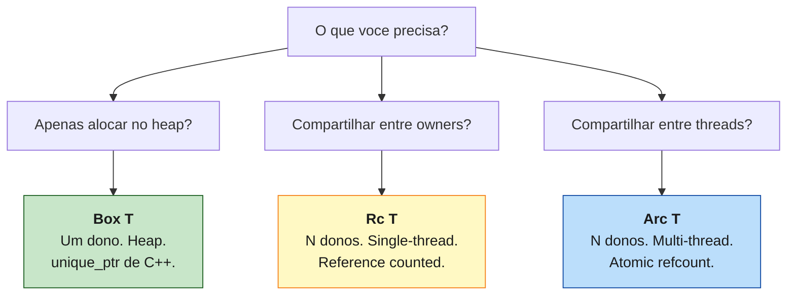
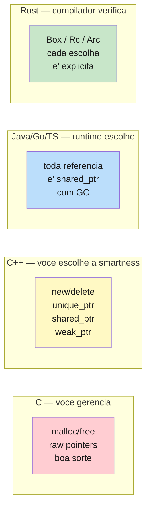

<a id="capitulo-28"></a>
# Capítulo 28: Box, Rc, Arc — Posse Compartilhada

> *"A pointer is a promise. A smart pointer is a promise the compiler can verify."*
> — Aaron Turon, ex-líder do time de linguagem do Rust

> *"Choose your guarantees. Each wrapper type is a different point on the safety-flexibility curve."*
> — Manish Goregaokar

## 28.1 O Problema: Posse Não É Suficiente

Os capítulos anteriores ensinaram a regra de ferro de Rust: **um valor, um dono**. Quando o dono sai de escopo, `drop` é chamado, memória é liberada. Sem GC, sem `free` manual, sem dúvida.

Essa regra resolve 90% dos casos. O problema são os outros 10%.

Considere uma linked list:

```rust
// Tentativa ingenua — nao compila
enum List {
    Cons(i32, List),
    Nil,
}
```

O compilador recusa com a mensagem clássica: *"recursive type `List` has infinite size"*. Faz sentido — para guardar um `List` na stack, o compilador precisa saber o tamanho. Mas `List` contém um `List`, que contém um `List`, e assim por diante. A stack frame teria tamanho infinito.

Considere um grafo onde dois nós apontam para o mesmo filho:

```rust
// Tambem nao compila
let filho = Node { valor: 42 };
let pai_a = Node { filho: filho };
let pai_b = Node { filho: filho };  // erro: value moved
```

`filho` foi movido para `pai_a`. Não pode ser movido de novo para `pai_b`. Mas o domínio exige justamente isso — dois pais, um filho.

Considere um observer pattern, ou um contador compartilhado entre threads, ou uma árvore com referências para os pais. Cada um desses casos quebra a regra "um dono". E nenhum deles é exótico.

A resposta de Rust não é abandonar a regra. É **delegar a posse a um intermediário** — um tipo que sabe contar quantos donos existem, ou que sabe alocar no heap, ou que sabe coordenar entre threads. Esses intermediários se chamam **smart pointers**.

## 28.2 A Família

Toda linguagem tem ponteiros. C tem `T*`. C++ tem `T*`, `unique_ptr<T>`, `shared_ptr<T>`, `weak_ptr<T>`. Java/TS/Go fingem que não têm — mas toda variável de objeto é um ponteiro implícito gerenciado pelo GC.

Rust tem uma família explícita, e cada membro responde a uma pergunta diferente:



Os três compartilham o mesmo princípio: **eles são donos**. Cada um implementa `Deref` para parecer uma referência e `Drop` para limpar quando ninguém mais precisa. A diferença é a regra de contagem.

| Tipo | Donos | Thread | Custo de clone | Análogo C++ |
|---|---|---|---|---|
| `Box<T>` | 1 | qualquer (move) | move (não clona) | `unique_ptr<T>` |
| `Rc<T>` | N | single-thread | incrementa contador | `shared_ptr<T>` (sem atomic) |
| `Arc<T>` | N | multi-thread | incrementa atômico | `shared_ptr<T>` (atômico) |
| `Weak<T>` | 0 (observador) | depende | incrementa contador weak | `weak_ptr<T>` |

A coluna que importa é a do custo. Em Rust, você paga apenas pelo que pede. `Box` é grátis (uma alocação). `Rc` paga um incremento por clone. `Arc` paga um incremento atômico — algumas dezenas de ciclos a mais — por clone. Você escolhe.

## 28.3 Box: O Ponteiro Honesto

`Box<T>` é o smart pointer mais simples. Ele aloca um valor no heap e dá a você um ponteiro de tamanho conhecido para esse valor. Quando o `Box` sai de escopo, o valor é dropado e a memória liberada.

```rust
fn main() {
    let n = Box::new(42);   // 42 vai para o heap
    println!("{}", *n);     // 42 — Deref faz parecer referencia
}                            // n sai de escopo, 42 e' liberado
```

Não há contador. Não há atomicidade. `Box` é simplesmente *"este i32 vive no heap, e eu sou o dono"*.

### Caso 1: Tipos recursivos

A linked list ingênua não compila porque o tamanho é infinito. `Box` resolve porque um `Box` tem tamanho fixo (um ponteiro), independentemente do tamanho do conteúdo:

```rust
enum Lista {
    Cons(i32, Box<Lista>),  // o proximo vive no heap
    Nil,
}

use Lista::{Cons, Nil};

let lista = Cons(1, Box::new(Cons(2, Box::new(Cons(3, Box::new(Nil))))));
```

Em TS/Java/Go, isso não é um problema porque toda referência a objeto é implicitamente um ponteiro. `class Node { next: Node | null }` em TS funciona porque `next` já é um ponteiro gerenciado pelo GC. Em Rust, a alocação é explícita — você vê o `Box::new` e sabe exatamente onde a memória vai parar.

### Caso 2: Trait objects

Quando você quer guardar "qualquer coisa que implementa o trait `T`" em uma coleção, precisa de um trait object. Trait objects têm tamanho dinâmico (você não sabe se é uma `Pato` ou uma `Pinguim`), e Rust exige tamanho conhecido na stack. `Box` resolve:

```rust
trait Animal {
    fn falar(&self) -> String;
}

struct Cachorro;
struct Gato;

impl Animal for Cachorro { fn falar(&self) -> String { "au".into() } }
impl Animal for Gato     { fn falar(&self) -> String { "miau".into() } }

let zoo: Vec<Box<dyn Animal>> = vec![
    Box::new(Cachorro),
    Box::new(Gato),
];

for bicho in &zoo {
    println!("{}", bicho.falar());
}
```

Isso é o equivalente de uma `List<Animal>` em Java. A diferença é que em Java toda chamada de método é virtual por padrão (overhead constante). Em Rust, a chamada virtual só acontece através do `dyn` — chamadas em tipos concretos são sempre estáticas, monomorfizadas, inlinables. Você paga vtable apenas quando pede.

### Caso 3: Valores grandes

Se você tem uma struct gigante que normalmente moveria pela stack, pode ser mais barato alocá-la no heap uma vez e mover apenas o ponteiro:

```rust
struct EnormeContexto {
    buffer: [u8; 1_000_000],
    // ... mais campos
}

fn processar(ctx: Box<EnormeContexto>) -> Box<EnormeContexto> {
    // mover ctx aqui e' mover 8 bytes (o ponteiro)
    // sem o Box, seria mover 1MB pela stack
    ctx
}
```

### Comparação direta

```cpp
// C++17
auto p = std::make_unique<int>(42);   // unique_ptr — um dono
*p = 43;                               // deref
// fim do escopo — destrutor libera

// Bug classico: dangling
int* raw = p.get();
p.reset();
*raw;                                  // use-after-free, compila, UB
```

```rust
// Rust
let mut p = Box::new(42);
*p = 43;
// fim do escopo — drop libera

// O bug equivalente:
let p = Box::new(42);
let raw = &*p;                         // emprestou
drop(p);                               // erro de compilacao
println!("{}", raw);                   //   "borrow of moved value"
```

C++ moderno te dá `unique_ptr` com semântica similar a `Box`. Mas C++ não te impede de chamar `get()` e guardar o ponteiro raw, depois soltar o `unique_ptr`. Você acabou de criar um dangling pointer e o compilador deixou. Em Rust, o borrow checker rastreia que `raw` empresta de `p`, e recusa o `drop(p)` enquanto o empréstimo existe.

A diferença não é a sintaxe. É que Rust **não confia em você** — e essa desconfiança é a feature.

## 28.4 Rc: Quando Um Dono Não Basta

`Box` é "um dono, no heap". E quando você precisa de **múltiplos donos**?

Considere um documento em uma editor colaborativa. O mesmo bloco de texto pode aparecer em três lugares: na árvore do DOM, no índice de busca, no histórico de undo. Quem é o dono? *Todos*. O bloco deve ser liberado quando o último dos três sair de cena, não antes.

Em Java/TS/Go, isso é trivial — todos referenciam o objeto, o GC libera quando ninguém mais aponta. Em C++, é `shared_ptr`. Em Rust, é `Rc`:

```rust
use std::rc::Rc;

let texto = Rc::new(String::from("paragrafo importante"));

let na_arvore   = Rc::clone(&texto);
let no_indice   = Rc::clone(&texto);
let no_historico = Rc::clone(&texto);

// strong_count = 4 (texto + 3 clones)
println!("{} donos", Rc::strong_count(&texto));

drop(na_arvore);
drop(no_indice);
// strong_count = 2

drop(no_historico);
drop(texto);
// strong_count = 0 — String e' liberada
```

`Rc::clone` é importante de notar. Ele **não clona o conteúdo**. Apenas incrementa o contador e devolve outra `Rc` apontando para o mesmo `String`. O custo é um `+= 1` em um inteiro.

Isso é convenção de leitura também. Quando você vê `Rc::clone(&x)`, você sabe que é barato. Se fosse `x.clone()` chamando o `Clone` do tipo interno, poderia ser caro (clonar uma `String` aloca). A forma `Rc::clone(&x)` torna a intenção explícita.

### A regra que `Rc` quebra (e a que ele preserva)

`Rc` quebra a regra de "um dono". Mas preserva a outra regra essencial: **acesso compartilhado é imutável**. Por dentro, `Rc<T>` te dá apenas `&T`, nunca `&mut T`. Múltiplos donos podem ler, ninguém pode escrever.

```rust
let s = Rc::new(String::from("ola"));
let outra = Rc::clone(&s);

// s.push_str(" mundo");  // erro — Rc nao expoe &mut
```

Faz sentido. Se três pessoas têm `Rc` apontando para o mesmo `String`, e qualquer uma pudesse mutá-lo, voltaríamos para o caos. A combinação de "múltiplos donos" + "mutação compartilhada" é proibida pela regra de aliasing — exceto através de mutabilidade interior, que é o tema do próximo capítulo.

### Quando usar Rc

A regra prática: use `Rc` quando você não consegue identificar **um único dono natural**. Se houver, prefira referências (`&T`) — são mais baratas e o compilador entende melhor. Use `Rc` quando:

- A vida do dado depende do *último* a usá-lo (ex.: cache compartilhado).
- A estrutura é um grafo ou árvore com referências para múltiplos pontos.
- Você está implementando algo como uma persistent data structure (estilo Clojure/Immutable.js).

### Custo

`Rc` paga:

1. **Uma alocação** para o "control block" (que guarda o contador).
2. **Um incremento** por clone, **um decremento** por drop.
3. **Memória** — `Rc<T>` ocupa o mesmo espaço que `&T` (um ponteiro), mas o control block tem dois `usize` extras (strong count e weak count).

`Rc` **não é thread-safe**. O contador não é atômico. Se você tentar enviar uma `Rc` para outra thread, o compilador recusa:

```rust
use std::rc::Rc;
use std::thread;

let s = Rc::new(String::from("ola"));
thread::spawn(move || {
    println!("{s}");  // erro: Rc<String> nao implementa Send
});
```

A mensagem é literalmente "the trait `Send` is not implemented for `Rc<String>`". Para multi-thread, use `Arc`.

## 28.5 Arc: Atômico, Multi-Thread, Mais Caro

`Arc<T>` (Atomic Reference Counted) é a versão thread-safe de `Rc`. A interface é idêntica:

```rust
use std::sync::Arc;
use std::thread;

let s = Arc::new(String::from("ola das threads"));

let mut handles = vec![];
for i in 0..4 {
    let s = Arc::clone(&s);   // mesma sintaxe de Rc::clone
    handles.push(thread::spawn(move || {
        println!("thread {i}: {s}");
    }));
}

for h in handles {
    h.join().unwrap();
}
// quando todas as threads terminam, contador zera, String libera
```

A diferença interna: `Arc` usa operações atômicas (`fetch_add`, `fetch_sub`) em vez de incremento/decremento simples. Em arquiteturas modernas, isso custa algumas dezenas de ciclos por operação — uma fração de um cache miss, mas mensurável em hot paths.

Por isso a regra é: **use `Rc` por padrão, e troque para `Arc` quando precisar atravessar uma thread**. Não use `Arc` "por garantia" — você está pagando atomicidade que não vai usar.

```rust
// errado: usar Arc onde Rc bastaria
struct Cache {
    items: Arc<HashMap<String, Vec<u8>>>,  // se nao cruza thread, Arc e' overhead
}

// certo: cruza thread, entao Arc
struct WorkerPool {
    config: Arc<Config>,
}
```

### Custo comparado

```text
Rc::clone   ~  1ns  (incremento simples)
Arc::clone  ~ 10ns  (incremento atomico)
&T          ~  0ns  (so' copia o ponteiro)
```

Os números são ordem de magnitude — variam por CPU, contenção, etc. O importante é a hierarquia: referência é grátis, `Rc` é quase grátis, `Arc` custa um pouco.

## 28.6 Onde Box/Rc/Arc Vivem Em Outras Linguagens



**C** te dá `malloc`/`free`. Você é responsável por todo. Se você esquecer um `free`, leak. Se você der `free` duas vezes, double-free. Se você der `free` enquanto alguém ainda usa o ponteiro, use-after-free. Cada CVE de buffer overflow no Linux nasceu de um humano falhando essa contabilidade.

**C++** moderno tem `unique_ptr` e `shared_ptr`. A semântica é quase a mesma de `Box` e `Arc`. A diferença é que C++ não tem borrow checker. Você pode chamar `.get()`, guardar o pointer raw, e usar depois que o `shared_ptr` foi destruído. O compilador sorri e libera o footgun.

**Java/Go/TypeScript** decidem por você: toda referência é uma espécie de `Arc` com GC. Você nunca vê o ponteiro, nunca pensa em ownership, e paga as pausas do GC e o overhead de memória sempre. Funciona muito bem para 90% dos sistemas de negócio. É um pesadelo para kernels, drivers, embedded, e hot paths.

**Rust** te dá `Box`/`Rc`/`Arc` como tipos explícitos. Cada um diz ao leitor — e ao compilador — exatamente que garantia você quer. E o borrow checker se recusa a compilar se você usar a garantia errada.

## 28.7 O Bug Clássico: Cycle Leak

Há um problema com `Rc` que você descobre exatamente no momento mais inconveniente: **ciclos não são liberados**.

`Rc` decrementa o contador quando o último dono sai de escopo. Se A aponta para B e B aponta para A, e ambos têm `Rc` um do outro, o contador de cada um nunca chega a zero — mesmo que ninguém de fora aponte para o ciclo:

```rust
use std::rc::Rc;
use std::cell::RefCell;

struct No {
    valor: i32,
    proximo: RefCell<Option<Rc<No>>>,
}

let a = Rc::new(No {
    valor: 1,
    proximo: RefCell::new(None),
});

let b = Rc::new(No {
    valor: 2,
    proximo: RefCell::new(Some(Rc::clone(&a))),
});

// fechar o ciclo: a aponta pra b
*a.proximo.borrow_mut() = Some(Rc::clone(&b));

// strong_count(a) = 2 (a + b apontando)
// strong_count(b) = 2 (b + a apontando)

drop(a);
drop(b);
// strong_count(a) = 1 (b ainda aponta — mas b foi dropado? nao, b ainda existe via a!)
// strong_count(b) = 1
// nada chega a zero. memoria vazada.
```

Esse é um leak silencioso. O programa não crasha, não vaza para o usuário, mas a memória não é devolvida. Em sistemas long-running, vira um problema operacional sério.

Java/Go/TS resolvem isso porque o GC mark-and-sweep detecta ciclos não alcançáveis a partir das raízes. Rust, sem GC, não tem como detectar. A responsabilidade volta para você — e a ferramenta é `Weak`.

## 28.8 Weak: A Referência Que Não Conta

`Weak<T>` é uma referência que **não incrementa o contador strong**. Ela observa o valor sem reivindicar posse. Para usá-la, você precisa fazer `upgrade()` para uma `Rc` temporária — que pode falhar se o valor já foi liberado.

```rust
use std::rc::{Rc, Weak};
use std::cell::RefCell;

struct No {
    valor: i32,
    pai: RefCell<Weak<No>>,           // pai e' weak — nao conta como dono
    filhos: RefCell<Vec<Rc<No>>>,     // filhos sao strong — pais sao donos dos filhos
}

let raiz = Rc::new(No {
    valor: 1,
    pai: RefCell::new(Weak::new()),
    filhos: RefCell::new(vec![]),
});

let folha = Rc::new(No {
    valor: 2,
    pai: RefCell::new(Rc::downgrade(&raiz)),  // weak ref pra raiz
    filhos: RefCell::new(vec![]),
});

raiz.filhos.borrow_mut().push(Rc::clone(&folha));

// strong_count(raiz) = 1 (so' a propria variavel raiz)
// strong_count(folha) = 2 (folha + raiz.filhos)
// weak_count(raiz) = 1 (folha.pai)

// Acessar o pai a partir da folha:
if let Some(pai) = folha.pai.borrow().upgrade() {
    println!("pai e' {}", pai.valor);
}

// Quando raiz sai de escopo, strong_count chega a 0 — raiz e' dropada.
// Mesmo com folha.pai apontando, a memoria libera.
// folha.pai.upgrade() agora retorna None.
```

A regra para árvores e grafos com ciclos potenciais:

- **Strong onde há posse real**: pai possui filho, lista possui nó.
- **Weak onde há referência reversa**: filho observa pai, nó observa lista.

Essa assimetria quebra o ciclo. Se A possui B com `Rc` e B observa A com `Weak`, dropar A faz `strong_count(A) = 0`, A é liberado, e o `Weak` em B vira inválido (mas seguro — `upgrade()` retorna `None`).

C++ tem o mesmo padrão com `weak_ptr<T>`. A semântica é praticamente idêntica. A diferença, novamente, é que Rust te força a chamar `upgrade()` — uma operação que retorna `Option`, te obrigando a tratar o caso de "o valor já não existe". Em C++, `weak_ptr::lock()` retorna um `shared_ptr` que pode estar vazio, e nada te força a checar.

## 28.9 Composição

Smart pointers compõem. Os tipos compostos comuns são:

```rust
Rc<RefCell<T>>     // multiplos donos, mutacao single-thread
Arc<Mutex<T>>      // multiplos donos, mutacao multi-thread
Arc<RwLock<T>>     // multiplos donos, multi-thread, leituras paralelas
Box<dyn Trait>     // um dono, polimorfismo dinamico
Rc<dyn Trait>      // multiplos donos, polimorfismo dinamico
```

A ordem importa. `Rc<RefCell<T>>` significa "vários donos compartilham um valor mutável". `RefCell<Rc<T>>` significa "um dono mutável de uma referência compartilhada" — coisas diferentes. O conselho de Manish Goregaokar se aplica: *"figure out which guarantees we want, and at which point of the composition we need them."*

A escolha de cada camada é uma decisão consciente — não dogma, não magia. O capítulo seguinte aprofunda na camada interna, a `RefCell` e família — os tipos que permitem mutação a partir de uma referência imutável.

## 28.10 Resumo

| Pergunta | Resposta |
|---|---|
| Preciso alocar no heap, um dono só. | `Box<T>` |
| Preciso de múltiplos donos, mesma thread. | `Rc<T>` |
| Preciso de múltiplos donos, threads diferentes. | `Arc<T>` |
| Preciso observar sem possuir (evitar ciclo). | `Weak<T>` ou `&T` |
| Preciso mutar com múltiplos donos. | `Rc<RefCell<T>>` ou `Arc<Mutex<T>>` |

A regra-mãe é: **comece com referências (`&T`/`&mut T`)**. Se o dono natural existe, use-o. Quando o domínio exige posse compartilhada, suba a escada — `Box` para heap, `Rc` para compartilhar, `Arc` para threads, `Weak` para quebrar ciclos.

Cada degrau tem um custo. Cada degrau é explícito. Em C, você não vê o custo (e descobre na produção). Em Java, você não vê o custo (e o GC paga por você, sempre). Em Rust, você escolhe, e o compilador verifica.

> *"A linguagem não esconde o custo, e não decide por você. Te dá os tipos certos e exige que você decida. Esse é o contrato de Rust."*
> — Niko Matsakis

[Próximo: Capítulo 29 — Cell, RefCell, OnceCell: Mutabilidade Interior →](ch29-mutabilidade-interior.md)
