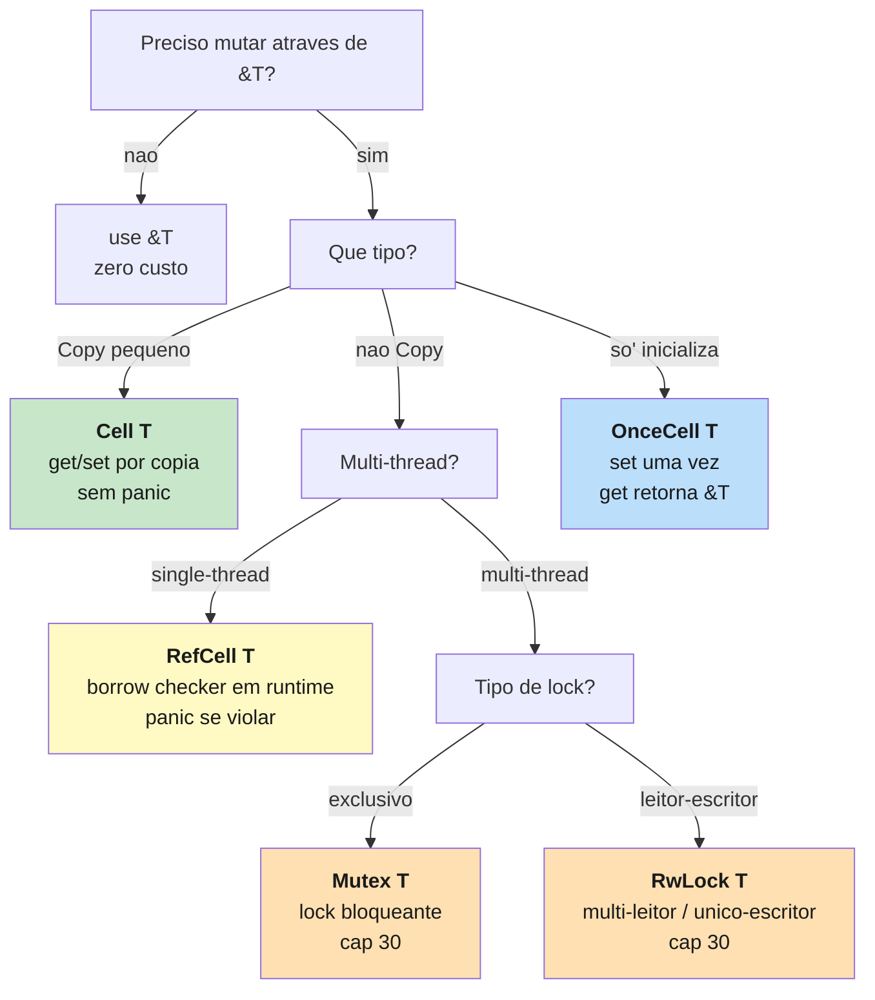

<a id="capitulo-29"></a>
# Capítulo 29: Cell, RefCell, OnceCell — Mutabilidade Interior

> *"The borrow checker is a linter, not an oracle. Sometimes you know more than it does — and it lets you say so, at runtime."*
> — Aaron Turon

> *"Interior mutability is the art of mutating through a shared reference without breaking the rules — by moving the check from compile time to runtime."*
> — Manish Goregaokar

## 29.1 A Regra Que Vamos Quebrar (Com Permissão)

Os capítulos sobre ownership repetiram um mantra: **uma referência mutável OU várias imutáveis, nunca os dois**. Essa regra é o coração do borrow checker. É o que impede data races, dangling references, iterator invalidation, todas as classes de bugs que assombram C, C++ e — em formas mais sutis — Java, Go, TypeScript.

E agora vamos quebrá-la.

Não literalmente. A regra continua sendo verdade do ponto de vista do compilador. O que vamos fazer é **mover a verificação para runtime** — pegar `&T` (referência imutável) e, mesmo assim, mutar o que está dentro.

Por que faríamos isso? Porque o borrow checker é conservador. Ele rejeita programas seguros que ele simplesmente não consegue *provar* serem seguros. Ele é um teorema-prover com regras simples, e às vezes a verdade do seu programa não cabe nessas regras.

Considere:

```rust
struct Cache<K, V> {
    inner: HashMap<K, V>,
}

impl<K: Hash + Eq, V> Cache<K, V> {
    fn get_or_compute(&self, k: K, f: impl FnOnce() -> V) -> &V {
        // queremos: se nao existe, calcular e inserir.
        // mas inserir precisa de &mut self — e nos so' temos &self.
        // o borrow checker vai recusar.
        todo!()
    }
}
```

Lógicamente, é seguro. O método não expõe a mutação para fora — quem chama `get_or_compute` vê uma operação que parece pura. Mas o compilador não consegue raciocinar sobre "lógicamente seguro". Ele vê `&self` e exige `&self`.

A solução: **mutabilidade interior**. Um conjunto de tipos que aceita `&T` mas oferece, controladamente, a capacidade de mutar.


Por fora, o `Cache` parece imutável. Por dentro, ele muta. O contrato com o usuário não muda. A invariante de aliasing continua sendo respeitada — só que agora é o tipo que se responsabiliza, não o compilador.

## 29.2 O Princípio: Compile-Time vs Runtime

Manish Goregaokar formulou isso melhor: cada wrapper type é um ponto diferente em um mesmo eixo — *quando* a regra de aliasing é verificada.

| Tipo | Quem verifica | Quando | Custo |
|---|---|---|---|
| `&T` / `&mut T` | Borrow checker | Compile time | Zero |
| `Cell<T>` | Tipo (sem refs) | Não verifica — copia | Quase zero |
| `RefCell<T>` | Tipo (runtime) | A cada `borrow()` | Algumas instruções |
| `Mutex<T>` | OS / atomic | Runtime, multi-thread | Lock + system call |
| `RwLock<T>` | OS / atomic | Runtime, multi-thread | Lock + system call |
| `OnceCell<T>` | Tipo (uma vez) | No primeiro `set` | Zero após init |

Quanto mais cedo a verificação, mais barata e mais restrita. Quanto mais tarde, mais flexível e mais cara. Você escolhe o ponto.

Em TS, Java, Go — não há essa escolha. Toda referência a objeto é mutável a qualquer momento, e a "verificação" é... nenhuma. Confia-se no programador. Em C, idem. Em C++, há `const`, mas é trivial fazer `const_cast` e quebrar. Rust é a única linguagem mainstream onde **a imutabilidade é a regra**, e mutar requer um tipo explícito que documenta o trade-off.

## 29.3 Cell: Mutação Por Cópia

`Cell<T>` é a forma mais simples e mais barata de mutabilidade interior. A regra: **só funciona com tipos `Copy`**, e a interface não te dá referências para o interior — apenas `get` e `set`.

```rust
use std::cell::Cell;

struct Contador {
    valor: Cell<u32>,
}

impl Contador {
    fn new() -> Self {
        Self { valor: Cell::new(0) }
    }

    fn incrementar(&self) {                    // &self, nao &mut self
        let atual = self.valor.get();           // copia
        self.valor.set(atual + 1);              // sobrescreve
    }

    fn ler(&self) -> u32 {
        self.valor.get()
    }
}

let c = Contador::new();
c.incrementar();
c.incrementar();
assert_eq!(c.ler(), 2);
```

`Cell` não permite referências internas porque, se permitisse, alguém poderia ter `&u32` apontando para o interior, e outra chamada `set` poderia mover o valor — invalidando a referência. Em vez de detectar isso, `Cell` simplesmente **proíbe a referência**. Você só pode `get` (que copia) e `set` (que sobrescreve).

Por isso o requisito `Copy`. Sem `Copy`, `get` precisaria mover, e mover invalidaria o `Cell`. Como `Copy` é trivial (para tipos pequenos como números, booleans, chars, references), `get` simplesmente copia.

### Quando usar Cell

- Contadores, flags, IDs sequenciais — qualquer estado pequeno mutável dentro de um struct conceitualmente imutável.
- Configurações que mudam raramente.
- Padrões observer onde você só precisa de `bool`, `u32`, `enum`-com-`Copy`.

```rust
struct ParserState {
    pos: Cell<usize>,
    debug: Cell<bool>,
}

impl ParserState {
    fn avancar(&self, n: usize) {
        self.pos.set(self.pos.get() + n);
    }
}
```

`Cell` é praticamente grátis. Algumas instruções de load/store. Não tem locks, não tem borrow tracking, não tem allocation.

## 29.4 RefCell: Borrow Checker Em Runtime

`Cell` resolve casos `Copy`. E para tipos não-`Copy` — `String`, `Vec`, `HashMap`, structs grandes? Aí entra `RefCell<T>`.

A diferença é que `RefCell` te dá referências. `borrow()` retorna `Ref<T>` (que se comporta como `&T`). `borrow_mut()` retorna `RefMut<T>` (que se comporta como `&mut T`). Internamente, ele mantém um contador de empréstimos e *aplica em runtime* a regra do borrow checker:

```rust
use std::cell::RefCell;

let lista: RefCell<Vec<i32>> = RefCell::new(vec![1, 2, 3]);

{
    let leitura = lista.borrow();          // & emprestimo
    println!("{:?}", *leitura);
}                                           // emprestimo termina aqui

{
    let mut escrita = lista.borrow_mut();  // &mut emprestimo
    escrita.push(4);
}                                           // termina aqui

println!("{:?}", lista.borrow());          // [1, 2, 3, 4]
```

Funciona. Agora o que acontece se você violar a regra:

```rust
let lista = RefCell::new(vec![1, 2, 3]);

let r1 = lista.borrow();
let r2 = lista.borrow_mut();   // PANIC em runtime
//   already borrowed: BorrowMutError
```

Em vez de erro de compilação, você ganha um panic. Isso é o trade-off central de `RefCell` — você troca rigidez compile-time por flexibilidade runtime, e paga com a possibilidade de explodir em produção se errar.

### O motivo de existir

Considere o cache que mencionei no início:

```rust
use std::cell::RefCell;
use std::collections::HashMap;
use std::hash::Hash;

struct Cache<K, V> {
    inner: RefCell<HashMap<K, V>>,
}

impl<K: Hash + Eq + Clone, V: Clone> Cache<K, V> {
    fn new() -> Self {
        Self { inner: RefCell::new(HashMap::new()) }
    }

    fn get_or_compute(&self, k: K, f: impl FnOnce() -> V) -> V {
        if let Some(v) = self.inner.borrow().get(&k) {
            return v.clone();
        }
        let v = f();
        self.inner.borrow_mut().insert(k, v.clone());
        v
    }
}
```

A interface pública é `&self` em todos os métodos — o cache é, do ponto de vista do usuário, imutável. Internamente, ele muta o HashMap. O `RefCell` é a tradução técnica dessa intenção.

Sem `RefCell`, você teria que exigir `&mut self` em `get_or_compute` — e aí o cache se contamina por todo o código. Toda função que chama `cache.get_or_compute()` precisaria também ter `&mut`. Isso é viral, e quebra a abstração.

### Padrão clássico: Rc<RefCell<T>>

A combinação mais comum em código real:

```rust
use std::rc::Rc;
use std::cell::RefCell;

type EstadoCompartilhado = Rc<RefCell<Vec<String>>>;

let estado: EstadoCompartilhado = Rc::new(RefCell::new(vec![]));

let observador1 = Rc::clone(&estado);
let observador2 = Rc::clone(&estado);

observador1.borrow_mut().push("evento A".into());
observador2.borrow_mut().push("evento B".into());

assert_eq!(estado.borrow().len(), 2);
```

`Rc` dá os múltiplos donos. `RefCell` dá a mutação compartilhada. Juntos, eles emulam o que TS/Java/Go te dão por padrão (um objeto com vários references mutando livremente) — mas com a verificação de empréstimo em runtime, e a documentação explícita de que é isso que você quer.

### Bug clássico: panic por re-borrow

```rust
let dados = RefCell::new(vec![1, 2, 3]);

let r = dados.borrow();
for _ in r.iter() {
    dados.borrow_mut().push(0);   // PANIC — leitura ainda viva
}
```

Você tem um `Ref` vivo (o `r`), e tenta pegar um `RefMut`. Compila — porque o compilador só vê tipos, não a lógica de quando os empréstimos vivem. Em runtime, panic.

Em Java/TS, esse mesmo código causaria um `ConcurrentModificationException` (ou silenciosamente corromperia o iterator). Em Go, com slice, o iterator não pega — você só vê resultado errado. Em C++, com `vector`, é UB e o programa pode crashar quando o vector realoca. Rust te dá um panic estruturado e localizado, com a stack trace exata.

Não é grátis. É um trade-off. Você escolhe `RefCell` quando a alternativa seria pior.

## 29.5 OnceCell: Inicialização Preguiçosa

Há um caso especial de mutabilidade interior tão comum que mereceu seu próprio tipo: **inicializar uma vez, ler para sempre**.

```rust
use std::cell::OnceCell;

struct Config {
    derivado: OnceCell<String>,
    base: String,
}

impl Config {
    fn new(base: String) -> Self {
        Self { base, derivado: OnceCell::new() }
    }

    fn derivado(&self) -> &str {
        self.derivado.get_or_init(|| {
            // calculo caro, executado uma vez
            format!("{}-derivado", self.base)
        })
    }
}

let cfg = Config::new("prod".into());
println!("{}", cfg.derivado());  // calcula
println!("{}", cfg.derivado());  // cache hit, mesma referencia
```

`OnceCell` é a melhor parte de `Cell` (sem locks, sem panic) com a melhor parte de `RefCell` (te dá `&T`, sem copiar). A restrição é: **uma vez setado, não muda mais**. `set` falha se já foi setado. `get_or_init` calcula apenas no primeiro acesso.

A versão thread-safe é `OnceLock<T>`, que faz a mesma coisa atomicamente entre threads. Usada bastante em singletons globais:

```rust
use std::sync::OnceLock;

fn config_global() -> &'static Config {
    static CONFIG: OnceLock<Config> = OnceLock::new();
    CONFIG.get_or_init(|| Config::carregar())
}
```

Em Java, isso seria `static final` com lazy init manual e `synchronized`. Em Go, `sync.Once`. Em TS, um IIFE ou um lazy getter. `OnceLock` é a versão idiomática e correta em Rust — sem race conditions, sem double-init, sem overhead após o primeiro acesso.

## 29.6 Comparação: Mutação Em Outras Linguagens

Aqui está o segredo cultural de Rust: **as outras linguagens já fazem mutabilidade interior — elas só não te dizem**.

```typescript
// TypeScript
class Contador {
  private count = 0;

  increment(): void {
    this.count++;        // mutacao via this — sempre permitida
  }

  read(): number {
    return this.count;
  }
}

const c = new Contador();
const ref1 = c;
const ref2 = c;
ref1.increment();        // ref2.read() agora retorna 1.
                         // mutacao atraves de uma "imutavel" referencia.
```

Em TS, `const c = new Contador()` significa "a variável `c` não pode ser reatribuída". Não significa "o objeto não pode ser mutado". Toda referência em TS é uma forma de `Rc<RefCell<T>>` implícita — múltiplos donos, mutação compartilhada, sem verificação.

```go
// Go
type Contador struct {
    n int
}

func (c *Contador) Increment() { c.n++ }
func (c *Contador) Read() int  { return c.n }

c := &Contador{}
ref1 := c
ref2 := c
ref1.Increment()         // ref2.Read() retorna 1
```

Mesmo padrão. `*Contador` é compartilhado, mutável, sem race detector ativo (tem com `-race`, mas é opt-in).

```cpp
// C++
class Contador {
    mutable int count = 0;   // mutable — pode mudar mesmo em const

    public:
    void increment() const {  // const method, mas muta
        count++;
    }
    int read() const { return count; }
};
```

C++ tem `mutable` exatamente para isso. É a versão de C++ de `Cell`. Mas a maioria dos campos não são `mutable`, e a regra "const method não muta" é violável com `const_cast`. Sem garantia.

```rust
// Rust
use std::cell::Cell;

struct Contador {
    n: Cell<i32>,
}

impl Contador {
    fn increment(&self) {       // &self, nao &mut self
        self.n.set(self.n.get() + 1);
    }
    fn read(&self) -> i32 {
        self.n.get()
    }
}
```

A diferença não é se a mutação acontece. **Acontece em todas elas.** A diferença é:

- Em TS/Java/Go: a mutação é o default, e nada documenta isso.
- Em C++: a mutação é proibida por padrão, mas há escapatórias (`mutable`, `const_cast`).
- Em Rust: a mutação é proibida por padrão, e quebrar requer um tipo explícito (`Cell`/`RefCell`/`OnceCell`/`Mutex`) que documenta o trade-off no próprio tipo.

Quando você lê `struct Foo { bar: RefCell<Vec<i32>> }`, você sabe imediatamente que `bar` muta apesar de `&Foo`. É auto-documentação. Em TS, você precisa ler todo o código para descobrir.

## 29.7 A Hierarquia Completa



A árvore inteira responde a perguntas:

1. **Preciso mutar via `&T`?** Se não, use `&mut T` ou re-arquitetura. Sempre prefira a verificação compile-time.
2. **O tipo é `Copy`?** Se sim, `Cell` é o mais barato.
3. **Inicializa uma vez só?** `OnceCell` (ou `OnceLock` para threads).
4. **Multi-thread?** `Mutex<T>` ou `RwLock<T>` (capítulo 30).
5. **Caso geral, single-thread?** `RefCell<T>`.

## 29.8 O Padrão Que Faz Tudo Funcionar: Encapsulamento

A regra de ouro de mutabilidade interior é: **encapsule o tipo mutável, exponha API de alto nível**.

```rust
// ruim: vazar RefCell para o usuario
pub struct Cache {
    pub inner: RefCell<HashMap<String, Vec<u8>>>,
}

// bom: encapsular
pub struct Cache {
    inner: RefCell<HashMap<String, Vec<u8>>>,
}

impl Cache {
    pub fn get(&self, k: &str) -> Option<Vec<u8>> {
        self.inner.borrow().get(k).cloned()
    }

    pub fn put(&self, k: String, v: Vec<u8>) {
        self.inner.borrow_mut().insert(k, v);
    }
}
```

Quando o `RefCell` vaza para o consumidor, você perde o controle de quem chama `borrow_mut` e quando. O risco de panic em runtime se espalha. Quando você encapsula, todas as transições borrow→borrow_mut acontecem dentro de métodos que você escreveu, e você consegue raciocinar sobre elas.

É o mesmo princípio de qualquer encapsulamento — só que aqui o custo da quebra é mais alto, porque a violação é runtime, não compile-time.

## 29.9 Quando NÃO Usar Mutabilidade Interior

Antes de alcançar `RefCell`, pergunte:

- **Posso re-arquitetar para `&mut self`?** Geralmente sim. Mutabilidade interior é a *última* opção, não a primeira.
- **Posso passar a mutabilidade para fora?** Em vez de mutar interno, retorne o novo valor. Estilo funcional.
- **Posso usar `Cell` em vez de `RefCell`?** Se o tipo é `Copy`, `Cell` evita o panic de runtime e tem custo zero.
- **O dado é multi-thread?** Aí o tipo certo é `Mutex` ou `RwLock`, não `RefCell`.

Mutabilidade interior é uma ferramenta para casos específicos: caches, observers, contadores compartilhados, lazy init. Não é "como eu mudo o estado de um struct". Para isso, `&mut self` continua sendo o caminho.

## 29.10 Resumo

Rust é a única linguagem mainstream onde imutabilidade é o **default não-negociável**, e mutabilidade compartilhada precisa ser explicitamente nomeada por um tipo. Esse tipo é uma família:

| Tipo | Quando usar | Custo | Falha |
|---|---|---|---|
| `Cell<T>` | T é `Copy`, sem refs internas | quase zero | impossível |
| `RefCell<T>` | T não é `Copy`, single-thread | borrow tracking | panic runtime |
| `OnceCell<T>` | inicialização única | zero após init | `set` falha se já setado |
| `Mutex<T>` | multi-thread, exclusivo | lock | deadlock se mal usado |
| `RwLock<T>` | multi-thread, leitor-escritor | lock | deadlock se mal usado |

Cada tipo é uma escolha consciente. Cada escolha aparece no nome do tipo, na assinatura, na inspeção do código. Não há mutação invisível.

Em TS, Java, Go — toda mutação é "interior", e você nem sabe. Em Rust, a mutação imutável é uma exceção bem nomeada à regra. Essa é a inversão filosófica que define o universo dos smart pointers.

> *"Rust não te força a ser puro. Te força a admitir quando você não está sendo. E essa admissão, no nome do tipo, é a feature."*

Próximo passo: a versão multi-thread dessa mesma família. `Mutex`, `RwLock`, `Atomic*`, `Send` e `Sync` — a parte da biblioteca padrão onde a mutabilidade interior encontra a concorrência, e onde Rust justifica seu slogan de **"fearless concurrency"**.

[Próximo: Capítulo 30 — Mutex, RwLock, Atomics: Fearless Concurrency →](../part-11-concurrency/ch30-mutex-rwlock-atomics.md)
