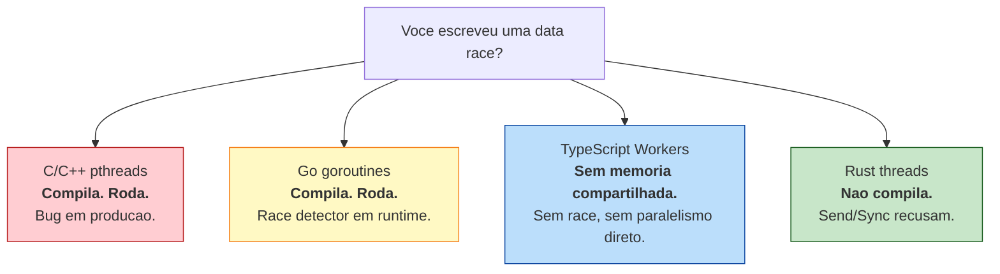
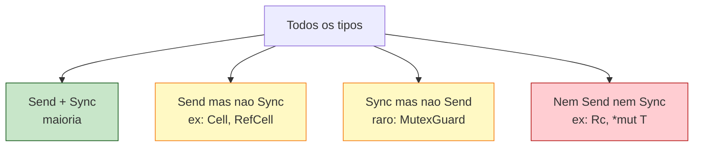
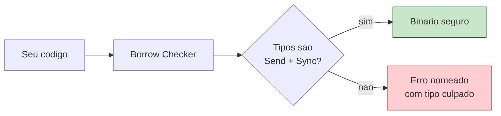

<a id="capitulo-30"></a>
# Capítulo 30: Threads e o Modelo Send/Sync

> *"In Rust, you don't pay for thread safety with vigilance. You pay for it with a one-time tax: making the compiler understand what your data is."*
> — Aaron Turon, ex-líder do time de linguagem

> *"Data races are the goto of concurrency: convenient, ubiquitous, and a guaranteed source of suffering. Rust simply refuses to compile them."*
> — Niko Matsakis

## 30.1 O Bug Que Não Pode Existir

Considere o programa em C abaixo. Ele compila sem warning. Roda. E está errado.

```c
// C — pthreads, 1995
#include <pthread.h>
#include <stdio.h>

int counter = 0;

void* increment(void* arg) {
    for (int i = 0; i < 1000000; i++) {
        counter++;             // read-modify-write nao-atomico
    }
    return NULL;
}

int main() {
    pthread_t t1, t2;
    pthread_create(&t1, NULL, increment, NULL);
    pthread_create(&t2, NULL, increment, NULL);
    pthread_join(t1, NULL);
    pthread_join(t2, NULL);
    printf("%d\n", counter);   // raramente 2_000_000
}
```

Duas threads incrementam um inteiro. O resultado deveria ser 2 milhões. Quase nunca é. Cada `counter++` é, em assembly, três instruções — `load`, `add`, `store`. Quando duas threads intercalam essas instruções, atualizações se perdem. Isso é uma **data race**: dois acessos concorrentes ao mesmo endereço de memória, pelo menos um sendo escrita, sem sincronização.

Em Go, o mesmo bug sobrevive:

```go
// Go — goroutines, 2012
package main

import (
    "fmt"
    "sync"
)

func main() {
    counter := 0
    var wg sync.WaitGroup
    for i := 0; i < 2; i++ {
        wg.Add(1)
        go func() {
            defer wg.Done()
            for j := 0; j < 1_000_000; j++ {
                counter++  // data race. compila. roda. valor errado.
            }
        }()
    }
    wg.Wait()
    fmt.Println(counter)
}
```

Go tem um detector de race em runtime (`go run -race`). É excelente. Mas é **runtime**: ele encontra o bug se a execução ativa o caminho errado. Em produção, sem `-race` (porque é caro), o bug volta a ser invisível.

Em TypeScript, o problema parece ausente — o event loop é single-threaded. Você terceiriza o paralelismo para Web Workers, que se comunicam só por `postMessage` (cópia estrutural). Não há memória compartilhada e, portanto, não há data race. Mas tampouco há paralelismo real sobre o mesmo dado: para somar um vetor em paralelo, você fatia, envia, e remonta — pagando cópia.

Rust faz uma promessa que nenhuma dessas linguagens faz: **o programa com data race nem chega ao binário**. Esse capítulo é sobre o mecanismo que sustenta essa promessa — duas marker traits chamadas `Send` e `Sync`.



## 30.2 thread::spawn e JoinHandle

A entrada para concorrência em Rust é `std::thread::spawn`. A função recebe uma closure e devolve um `JoinHandle<T>`, onde `T` é o tipo de retorno da thread.

```rust
use std::thread;
use std::time::Duration;

fn main() {
    let handle = thread::spawn(|| {
        for i in 1..=5 {
            println!("thread filha: {i}");
            thread::sleep(Duration::from_millis(10));
        }
        42
    });

    for i in 1..=5 {
        println!("thread principal: {i}");
        thread::sleep(Duration::from_millis(10));
    }

    let valor = handle.join().unwrap();
    println!("filha retornou {valor}");
}
```

Três coisas merecem atenção:

1. **`spawn` devolve imediatamente**. A thread filha começa a rodar em paralelo.
2. **`join()` bloqueia** até a filha terminar e devolve `Result<T, _>`. O `Err` aparece se a thread *paniquou*.
3. **A thread principal terminando mata as filhas**. Sem `join`, você pode perder output.

Compare com Go:

```go
// Go — goroutine + WaitGroup
go func() {
    fmt.Println("oi")
}()
// main pode terminar antes; runtime nao espera
```

Go não devolve um handle. A goroutine "some" no runtime, e você sincroniza por canais ou `WaitGroup`. Em Rust, o `JoinHandle` é um valor que carrega a thread — se você dropá-lo sem `join`, a thread vira detached e continua rodando, mas você perdeu a referência.

Compare com pthreads:

```c
pthread_t t;
pthread_create(&t, NULL, worker, NULL);
pthread_join(t, NULL);  // sem ergonomia: void*, casts, errno
```

Em C, todo retorno de thread é `void*`. Você converte na mão e reza para o tipo bater. Em Rust, `JoinHandle<T>` é genérico — o compilador sabe o tipo de retorno.

## 30.3 O Problema do `move`

Veja o que acontece quando a thread tenta usar uma variável capturada do escopo de fora:

```rust
use std::thread;

fn main() {
    let v = vec![1, 2, 3];

    let handle = thread::spawn(|| {
        println!("vetor: {:?}", v);  // erro: pode nao viver o suficiente
    });

    handle.join().unwrap();
}
```

Erro do compilador:

```
error[E0373]: closure may outlive the current function, but it borrows `v`,
which is owned by the current function
  |
6 |     let handle = thread::spawn(|| {
  |                                ^^ may outlive borrowed value `v`
7 |         println!("vetor: {:?}", v);
  |                                 - `v` is borrowed here

help: to force the closure to take ownership of `v` (and any other referenced
variables), use the `move` keyword
```

A closure por padrão captura por **referência**. Mas a thread pode viver mais que `main` — em tese, mais que `v`. O compilador exige que a closure assuma posse: `move`.

```rust
let v = vec![1, 2, 3];

let handle = thread::spawn(move || {
    println!("vetor: {:?}", v);  // ok: closure agora dona de v
});

handle.join().unwrap();
// println!("{:?}", v); // erro: v foi movido
```

Em Go isso simplesmente não existe. Você captura `v` numa goroutine e o garbage collector mantém vivo enquanto houver referência. Em Rust, sem GC, a única forma de garantir que o dado vive enquanto a thread o usa é **transferir a posse**.

## 30.4 As Marker Traits: Send e Sync

Aqui chegamos ao núcleo. Rust define duas traits — vazias, sem métodos, chamadas *marker traits* — que descrevem o que um tipo permite em concorrência:

```rust
// na biblioteca padrao, simplificado:
pub unsafe auto trait Send { }
pub unsafe auto trait Sync { }
```

- **`Send`**: um tipo `T` implementa `Send` se for seguro **transferir posse** de um valor `T` para outra thread.
- **`Sync`**: um tipo `T` implementa `Sync` se for seguro **compartilhar uma referência `&T`** entre threads. Equivalência formal: `T: Sync` se e somente se `&T: Send`.

A palavra `auto` significa que o compilador deduz a implementação automaticamente: se todos os campos de uma struct são `Send`, a struct é `Send`. Se algum campo *não* é `Send`, a struct também não é. Você não precisa anotar nada — a propagação acontece sozinha.

Quase todo tipo da std é `Send + Sync`:

```rust
// Send + Sync automaticos:
i32, u64, bool, char, String, Vec<T> (se T: Send/Sync),
Box<T>, Arc<T>, Mutex<T>, ...
```

A pergunta interessante é: **quem não é?**



## 30.5 Por Que Rc Não É Send

Lembre do Capítulo 18: `Rc<T>` é reference counting de uma só thread. Cada `clone` incrementa um contador. Cada `drop` decrementa. Quando chega a zero, libera.

```rust
// dentro de Rc, conceitualmente:
struct RcInner<T> {
    count: usize,   // contador NAO-ATOMICO
    value: T,
}
```

`count` é um `usize` comum. Incrementar e decrementar são read-modify-write não-atômicos. Se duas threads tivessem `Rc`s para o mesmo dado, suas escritas no contador se intercalariam — exatamente a data race do início do capítulo. O contador divergiria. O dado seria liberado cedo demais (use-after-free) ou tarde demais (leak).

A solução é `Arc<T>` (Atomic Reference Counted), que usa `AtomicUsize`:

```rust
use std::sync::Arc;
use std::thread;

fn main() {
    let dados = Arc::new(vec![1, 2, 3]);

    let mut handles = vec![];
    for i in 0..3 {
        let dados = Arc::clone(&dados);  // incrementa contador atomicamente
        handles.push(thread::spawn(move || {
            println!("thread {i} viu {:?}", dados);
        }));
    }

    for h in handles {
        h.join().unwrap();
    }
}
```

`Arc<T>` é `Send + Sync` se `T: Send + Sync`. `Rc<T>` não é nenhum dos dois.

Tente trocar `Arc` por `Rc` no código acima. O compilador recusa:

```
error[E0277]: `Rc<Vec<i32>>` cannot be sent between threads safely
   --> src/main.rs:9:23
    |
9   |         handles.push(thread::spawn(move || {
    |                      ^^^^^^^^^^^^^ `Rc<Vec<i32>>` cannot be sent between threads safely
    |
    = help: the trait `Send` is not implemented for `Rc<Vec<i32>>`
note: required because it appears within the type `[closure@...]`
```

Esta é a mensagem que paga o preço deste capítulo inteiro. Em C, isso é uso indevido sem aviso. Em Go, é uma data race silenciosa. Em Rust, é um erro de compilação com nome próprio.

## 30.6 Por Que RefCell Não É Sync

`RefCell<T>` (Capítulo 19) faz borrow checking em **runtime**. Ele tem um contador interno de empréstimos e dispara `panic!` se você violar as regras.

```rust
// dentro de RefCell, conceitualmente:
struct RefCell<T> {
    borrow_state: Cell<isize>,  // contador NAO-ATOMICO
    value: UnsafeCell<T>,
}
```

O `borrow_state` é não-atômico. Se duas threads chamassem `borrow_mut` ao mesmo tempo, as duas veriam o contador zerado, ambas decrementariam, e ambas obteriam acesso mutável simultâneo — quebrando a regra fundamental ("uma referência mutável OU várias imutáveis, nunca os dois") e produzindo undefined behavior.

Por isso `RefCell<T>` não é `Sync`. Você não consegue compartilhar `&RefCell<T>` entre threads. Para mutabilidade interior segura entre threads, use `Mutex<T>` ou `RwLock<T>` (Capítulo 32).

| Tipo                | Send       | Sync       | Uso                                       |
|---------------------|------------|------------|-------------------------------------------|
| `i32`, `String`     | sim        | sim        | dados comuns                              |
| `Rc<T>`             | **nao**    | **nao**    | refcount single-thread                    |
| `Arc<T>` (T: S+S)   | sim        | sim        | refcount entre threads                    |
| `Cell<T>`           | se T: Send | **nao**    | mutabilidade interior single-thread       |
| `RefCell<T>`        | se T: Send | **nao**    | borrow check runtime, single-thread       |
| `Mutex<T>` (T: Send)| sim        | sim        | mutabilidade interior entre threads       |
| `*mut T`, `*const T`| **nao**    | **nao**    | raw pointers (sem garantias)              |

## 30.7 A Definição Formal Importa

A definição "`T: Sync` se e somente se `&T: Send`" parece técnica, mas é o que faz tudo encaixar. `Mutex<T>` é `Sync` porque enviar `&Mutex<T>` para outra thread é seguro: para acessar o `T` de dentro, a outra thread precisa pegar o lock. `RefCell<T>` não é `Sync` porque enviar `&RefCell<T>` permitiria à outra thread chamar `borrow_mut` sem sincronização.

```rust
// pseudo-prova: Sync deriva de Send sobre referencia
fn requer_sync<T: Sync>(x: &T) {
    requer_send(x);  // &T tem que ser Send
}

fn requer_send<T: Send>(_: T) { }
```

Essa decomposição é o que permite ao compilador propagar as garantias por composição. Uma `struct { a: Mutex<u32>, b: AtomicUsize }` é `Send + Sync` automaticamente. Uma `struct { a: Mutex<u32>, b: Rc<u32> }` não é nada — o `Rc` envenena a composição inteira.

## 30.8 A Compilação Que Não Acontece

Voltemos ao bug do início. Em Rust:

```rust
use std::thread;

fn main() {
    let mut counter = 0;

    let h1 = thread::spawn(|| {
        for _ in 0..1_000_000 {
            counter += 1;
        }
    });

    let h2 = thread::spawn(|| {
        for _ in 0..1_000_000 {
            counter += 1;
        }
    });

    h1.join().unwrap();
    h2.join().unwrap();
    println!("{counter}");
}
```

Rust recusa em **três frentes simultâneas**:

```
error[E0373]: closure may outlive the current function, but it borrows `counter`
error[E0499]: cannot borrow `counter` as mutable more than once at a time
error[E0373]: closure may outlive the current function, but it borrows `counter`
```

O borrow checker identifica que duas closures querem `&mut counter` ao mesmo tempo. A regra "uma só referência mutável" — que vimos no Capítulo 6 — é a *mesma* regra que previne data races. O borrow checker é o detector de race em compile-time.

A versão correta:

```rust
use std::sync::{Arc, Mutex};
use std::thread;

fn main() {
    let counter = Arc::new(Mutex::new(0u64));
    let mut handles = vec![];

    for _ in 0..2 {
        let counter = Arc::clone(&counter);
        handles.push(thread::spawn(move || {
            for _ in 0..1_000_000 {
                let mut guard = counter.lock().unwrap();
                *guard += 1;
            }
        }));
    }

    for h in handles {
        h.join().unwrap();
    }

    println!("{}", *counter.lock().unwrap());  // sempre 2_000_000
}
```

Veremos `Mutex` em detalhe no Capítulo 32. Por ora, observe: o programa só compila quando você diz explicitamente como sincronizar. **Não há atalho silencioso para a versão buggy.**

## 30.9 O Mesmo Programa em Quatro Linguagens

Programa: somar 0..10\_000\_000 dividindo o trabalho em 4 threads.

**C (pthreads):**

```c
#include <pthread.h>
#include <stdio.h>

#define N 10000000
#define T 4

typedef struct { long start, end, partial; } Job;

void* work(void* arg) {
    Job* j = arg;
    j->partial = 0;
    for (long i = j->start; i < j->end; i++) j->partial += i;
    return NULL;
}

int main() {
    pthread_t threads[T];
    Job jobs[T];
    long step = N / T;

    for (int i = 0; i < T; i++) {
        jobs[i] = (Job){ i*step, (i+1)*step, 0 };
        pthread_create(&threads[i], NULL, work, &jobs[i]);
    }

    long total = 0;
    for (int i = 0; i < T; i++) {
        pthread_join(threads[i], NULL);
        total += jobs[i].partial;
    }
    printf("%ld\n", total);
}
```

**Go:**

```go
package main

import (
    "fmt"
    "sync"
)

func main() {
    const N, T = 10_000_000, 4
    parts := make([]int64, T)
    var wg sync.WaitGroup

    for i := 0; i < T; i++ {
        wg.Add(1)
        go func(i int) {
            defer wg.Done()
            var s int64
            for j := int64(i * N / T); j < int64((i+1)*N/T); j++ {
                s += j
            }
            parts[i] = s
        }(i)
    }
    wg.Wait()

    var total int64
    for _, p := range parts {
        total += p
    }
    fmt.Println(total)
}
```

**TypeScript (Workers):**

```typescript
// main.ts — overhead de cloning estrutural
const T = 4, N = 10_000_000;
const workers = Array.from({ length: T }, () => new Worker("./worker.ts"));
const promises = workers.map((w, i) => new Promise<number>((res) => {
    w.onmessage = (e) => res(e.data);
    w.postMessage({ start: i * N / T, end: (i + 1) * N / T });
}));
const total = (await Promise.all(promises)).reduce((a, b) => a + b, 0);
console.log(total);
```

**Rust:**

```rust
use std::thread;

fn main() {
    const N: u64 = 10_000_000;
    const T: u64 = 4;

    let mut handles = vec![];
    for i in 0..T {
        handles.push(thread::spawn(move || {
            let start = i * N / T;
            let end = (i + 1) * N / T;
            (start..end).sum::<u64>()
        }));
    }

    let total: u64 = handles.into_iter()
        .map(|h| h.join().unwrap())
        .sum();

    println!("{total}");
}
```

Diferenças que importam:

- **C** exige struct manual para passar input/output. O `void*` apaga o tipo.
- **Go** compila com `parts[i] = s`. Sem race, porque cada goroutine escreve numa posição distinta — mas o compilador não verifica isso. Se você errasse e duas escrevessem em `parts[0]`, racewould silently corrupt.
- **TS** paga `postMessage` (cópia) duas vezes (input e output).
- **Rust** carrega o tipo de retorno (`u64`) no `JoinHandle`. O `move` força transferência de posse de `i`. Sem unsafe, sem cast, sem race possível.

## 30.10 Fearless Concurrency: O Que Significa

A frase "fearless concurrency" virou marketing, mas tem conteúdo técnico exato. Significa três coisas:

1. **Ausência garantida de data races em código safe**. Não "raras", não "improváveis". Garantida.
2. **Composição transparente**. Um tipo seu construído a partir de tipos `Send + Sync` é automaticamente `Send + Sync`. Você não anota traits manualmente.
3. **Erros precoces e nominais**. Quando algo não é thread-safe, o compilador aponta o tipo culpado por nome (`Rc<...> cannot be sent between threads`).

A consequência prática é uma inversão na vida do programador concorrente:

| Linguagem | Onde voce gasta tempo                                          |
|-----------|----------------------------------------------------------------|
| C/C++     | Caçando data races em produção com `tsan`, `valgrind`, sorte. |
| Java      | Conferindo `synchronized`, `volatile`, `ConcurrentHashMap`.    |
| Go        | Rodando race detector, esperando que o teste cubra o caminho.  |
| Rust      | Brigando com o compilador 30 minutos. Depois, paz.             |

Mara Bos resume melhor que ninguém em *Rust Atomics and Locks*:

> *"Send and Sync are the foundation. Everything else — Mutex, RwLock, channels — is built so that the compiler can prove safety using only these two traits."*

## 30.11 O Que Send/Sync Não Resolve

É honesto demarcar o limite. Send/Sync previnem **data races**, definidas como acessos concorrentes não-sincronizados ao mesmo endereço. Não previnem:

- **Race conditions lógicas**: dois locks pegos em ordens diferentes deadlockam. O compilador não sabe a ordem.
- **Vazamento de memória**: ciclos de `Arc` não são quebrados (Capítulo 18).
- **Bugs de protocolo**: enviar dois `Result::Err` quando o consumidor espera só um.
- **Quebra de invariantes de domínio**: dois saques do mesmo saldo, cada um respeitando o lock, mas a ordem produz overdraft.

Rust te entrega um programa **livre de UB**. Continua sendo seu trabalho fazer o programa **fazer a coisa certa**. Como diz a comunidade: *"Rust prevents you from shooting yourself in the foot, not from typing the wrong message in the gun."*

## 30.12 Resumo

- `thread::spawn` recebe uma closure (geralmente `move`) e devolve `JoinHandle<T>`.
- O borrow checker força closures que vivem além do escopo a tomar posse dos dados — daí o `move`.
- `Send` é "posso transferir entre threads"; `Sync` é "posso compartilhar `&` entre threads", definido como `&T: Send`.
- Send/Sync são auto traits: o compilador propaga por composição. Você raramente implementa à mão.
- `Rc<T>` e `RefCell<T>` não são thread-safe **por construção** — usam contadores não-atômicos.
- `Arc<T>` (atômico) e `Mutex<T>` (lock) são as versões para concorrência.
- Data races em Rust safe são erro de compilação, não bug em produção.



No próximo capítulo, vamos ao primeiro mecanismo de comunicação que Rust empresta de Go: **channels**.

---

> *"O preço do paralelismo seguro em Rust é uma tarde de briga com o compilador. O preço em C é uma carreira de plantões noturnos."*

[Próximo: Capítulo 31 — Channels: A Influência de Go →](ch31-channels.md)
