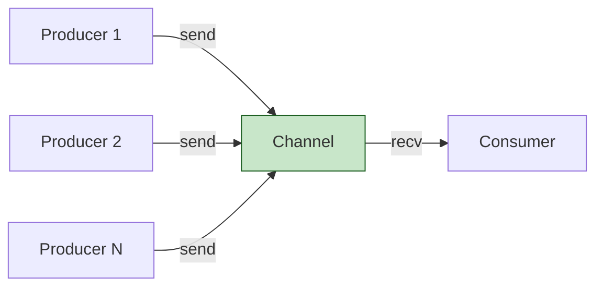
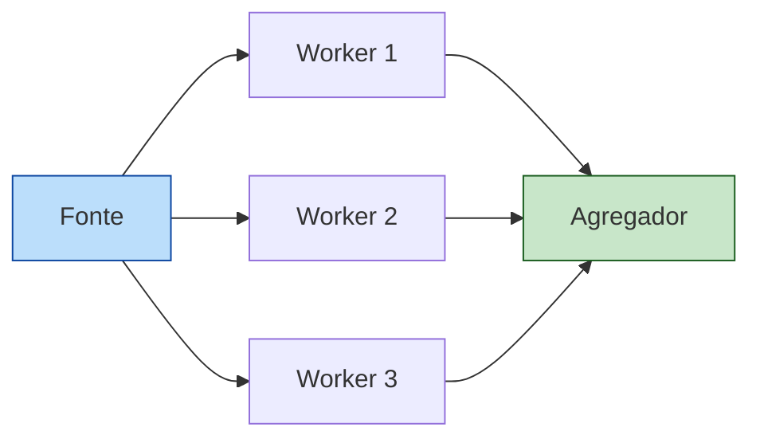
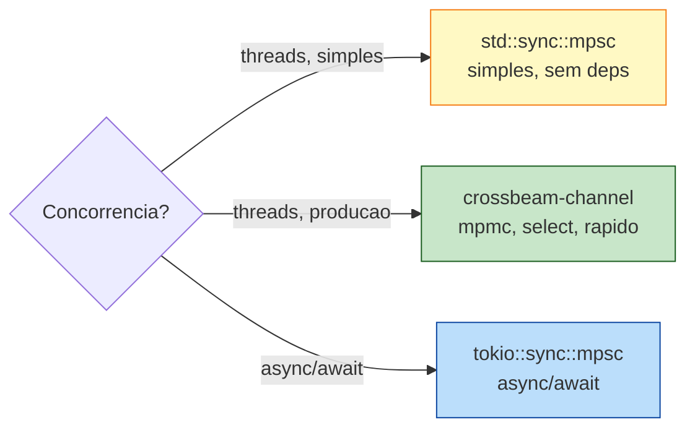

<a id="capitulo-31"></a>
# Capítulo 31: Channels — A Influência de Go

> *"Do not communicate by sharing memory; instead, share memory by communicating."*
> — Rob Pike, Go Proverbs

> *"Go made channels famous. Rust made them safe."*
> — Aaron Turon, *Fearless Concurrency*

## 31.1 A Ideia Roubada com Crédito

Em 1978, C. A. R. Hoare publicou um paper chamado *Communicating Sequential Processes* — CSP. A ideia era radical: em vez de threads compartilharem memória e protegerem com locks, processos comunicam-se por mensagens explícitas em canais. Não há estado compartilhado; há filas.

Por trinta anos, CSP foi linguagem de pesquisa. Em 2009, Rob Pike e Ken Thompson colocaram CSP no centro de Go. Channels viraram primitivo de primeira classe — com sintaxe própria, `chan T`, `<-`, `select`. A frase "share memory by communicating" virou a tag de Go.

Rust, criada com o histórico de Go já visível, fez algo parecido sem ser idêntico: forneceu channels na biblioteca padrão (`std::sync::mpsc`), mas **não privilegiou** channels sobre locks. A escolha em Rust é explícita: você usa o que faz sentido. Channels para fluxo de dados; mutex para estado compartilhado.

Este capítulo é sobre o lado dos channels.



## 31.2 mpsc: Multi-Producer, Single-Consumer

A biblioteca padrão de Rust tem um channel num módulo de nome desconfortavelmente honesto: `std::sync::mpsc`. A sigla diz tudo:

- **m**ulti-**p**roducer
- **s**ingle-**c**onsumer

Você pode clonar quantos `Sender<T>` quiser e enviar de várias threads. Mas existe **um** `Receiver<T>`. Esta é uma escolha de design: o caso de uso dominante é "vários produtores, um agregador". Para mpmc (multi-consumer), Rust te empurra para o crate `crossbeam`, que veremos.

```rust
use std::sync::mpsc;
use std::thread;

fn main() {
    let (tx, rx) = mpsc::channel::<String>();

    thread::spawn(move || {
        tx.send(String::from("ola")).unwrap();
    });

    let msg = rx.recv().unwrap();
    println!("recebi: {msg}");
}
```

`mpsc::channel()` devolve uma tupla `(Sender<T>, Receiver<T>)`. `tx.send(valor)` envia (transferindo posse). `rx.recv()` bloqueia até receber, devolvendo `Result<T, RecvError>`. O `Err` aparece quando *todos* os senders foram dropados — o canal está fechado e nada virá.

Em Go, o equivalente:

```go
package main

import "fmt"

func main() {
    ch := make(chan string)

    go func() {
        ch <- "ola"
    }()

    msg := <-ch
    fmt.Println("recebi:", msg)
}
```

A sintaxe de Go é mais magra — `<-` é operador. A semântica é parecida, com diferenças que examinaremos.

## 31.3 send Move

Aqui está a regra que faz channels em Rust não vazarem dados acidentalmente:

```rust
use std::sync::mpsc;
use std::thread;

fn main() {
    let (tx, rx) = mpsc::channel();

    thread::spawn(move || {
        let msg = String::from("ola");
        tx.send(msg).unwrap();
        // println!("{msg}"); // erro: msg foi movido para o channel
    });

    println!("{}", rx.recv().unwrap());
}
```

`send(valor)` toma `valor` por **valor**, não por referência. A posse vai para o canal e, em seguida, para quem chamar `recv`. A thread emissora perde o acesso ao dado. Isso é exatamente o que você quer: nenhuma das pontas pode mutar uma `String` que a outra está lendo.

Em Go, channels não têm posse — o GC mantém o dado vivo, e nada impede a goroutine emissora de continuar usando uma referência ao mesmo objeto. Se for um `*Foo`, as duas goroutines podem mutar o mesmo `Foo`. Cabe a você não fazer isso.

```go
// Go: nada impede aliasing
type Conta struct{ saldo int }

ch := make(chan *Conta)
c := &Conta{saldo: 100}
go func() { ch <- c }()
c2 := <-ch
c.saldo = 0    // emissor mutou
fmt.Println(c2.saldo)  // 0 — surpresa
```

Em Rust, o mesmo padrão não compila se você tenta usar `c` depois do `send`. Para compartilhar um valor mutável entre threads via channel, você teria que envolver em `Arc<Mutex<Conta>>` — o que torna o aliasing visível na assinatura de tipo.

## 31.4 Múltiplos Produtores

`Sender` é `Clone`. Cada clone permite uma nova thread emitir.

```rust
use std::sync::mpsc;
use std::thread;
use std::time::Duration;

fn main() {
    let (tx, rx) = mpsc::channel();

    for i in 0..3 {
        let tx = tx.clone();
        thread::spawn(move || {
            for j in 0..3 {
                tx.send(format!("worker {i} msg {j}")).unwrap();
                thread::sleep(Duration::from_millis(10));
            }
        });
    }
    drop(tx);  // dropamos o original; canal fecha quando os clones terminarem

    for msg in rx {  // iterador para por quando todos os senders sao dropados
        println!("{msg}");
    }
}
```

Dois detalhes valem nota:

1. **`drop(tx)`**: como `Receiver::recv` só retorna `Err` quando *todos* os senders saíram, esquecer de dropar o original mantém o iterador travado para sempre. Esse é um bug clássico de iniciantes.
2. **`for msg in rx`**: `Receiver<T>` implementa `IntoIterator`. O loop termina quando o canal fecha — sem `Result` para tratar.

Em Go o equivalente fecha pelo emissor:

```go
func main() {
    ch := make(chan string)
    var wg sync.WaitGroup

    for i := 0; i < 3; i++ {
        wg.Add(1)
        go func(i int) {
            defer wg.Done()
            for j := 0; j < 3; j++ {
                ch <- fmt.Sprintf("worker %d msg %d", i, j)
            }
        }(i)
    }

    go func() {
        wg.Wait()
        close(ch)  // fecha quando todos os emissores terminam
    }()

    for msg := range ch {
        fmt.Println(msg)
    }
}
```

Diferenças semânticas:

- **Go**: você pode `close(ch)` explicitamente. Receber de canal fechado devolve zero value imediatamente. Enviar para canal fechado **panica**.
- **Rust**: `Sender` não tem `close()`. O canal fecha quando o último `Sender` é dropado. Isso é mais seguro — não há "enviar em canal fechado", porque para enviar você precisaria de um `Sender`, e dropar todos é a única forma de fechar.

## 31.5 send vs try_send vs sync_channel

`mpsc::channel()` cria um canal **assíncrono ilimitado**: `send` nunca bloqueia (o buffer cresce conforme necessário). Isso é cômodo, mas perigoso: se o consumidor for mais lento que os produtores, a memória cresce sem limite.

Para canal **bounded** (limitado), use `mpsc::sync_channel(N)`:

```rust
use std::sync::mpsc;
use std::thread;

fn main() {
    let (tx, rx) = mpsc::sync_channel::<u32>(2);  // buffer de 2

    let producer = thread::spawn(move || {
        for i in 0..5 {
            println!("enviando {i}");
            tx.send(i).unwrap();   // bloqueia se buffer cheio
            println!("enviado  {i}");
        }
    });

    thread::sleep(std::time::Duration::from_millis(100));
    while let Ok(v) = rx.recv() {
        println!("  recebi  {v}");
    }
    producer.join().unwrap();
}
```

O `sync_channel(0)` é especialmente interessante: capacidade zero, **rendezvous**. Cada `send` bloqueia até alguém chamar `recv`, e vice-versa. É o mesmo que `make(chan T)` (unbuffered) em Go.

| Construtor                  | Capacidade | send bloqueia?                      |
|-----------------------------|------------|-------------------------------------|
| `mpsc::channel()`           | infinita   | nunca (perigo: OOM)                 |
| `mpsc::sync_channel(0)`     | 0          | sempre, ate haver `recv`            |
| `mpsc::sync_channel(N)`     | N          | quando buffer cheio                 |
| Go `make(chan T)`           | 0          | sempre (rendezvous)                 |
| Go `make(chan T, N)`        | N          | quando buffer cheio                 |

Em produção, prefira **bounded**. Backpressure é uma feature, não um inconveniente — sinaliza ao produtor que o consumidor está atrasado.

## 31.6 Worker Pool: O Mesmo Programa em Go e Rust

Um padrão clássico: um pool fixo de workers consome jobs de um canal.

**Go:**

```go
package main

import (
    "fmt"
    "sync"
)

type Job struct {
    ID    int
    Input int
}

type Result struct {
    ID     int
    Output int
}

func worker(id int, jobs <-chan Job, results chan<- Result, wg *sync.WaitGroup) {
    defer wg.Done()
    for j := range jobs {
        results <- Result{ID: j.ID, Output: j.Input * j.Input}
    }
}

func main() {
    jobs := make(chan Job, 100)
    results := make(chan Result, 100)
    var wg sync.WaitGroup

    for w := 1; w <= 4; w++ {
        wg.Add(1)
        go worker(w, jobs, results, &wg)
    }

    go func() {
        for i := 1; i <= 10; i++ {
            jobs <- Job{ID: i, Input: i}
        }
        close(jobs)
    }()

    go func() {
        wg.Wait()
        close(results)
    }()

    for r := range results {
        fmt.Printf("job %d -> %d\n", r.ID, r.Output)
    }
}
```

**Rust:**

```rust
use std::sync::mpsc;
use std::thread;

#[derive(Debug)]
struct Job { id: u32, input: u32 }

#[derive(Debug)]
struct JobResult { id: u32, output: u32 }

fn main() {
    let (jobs_tx, jobs_rx) = mpsc::channel::<Job>();
    let (res_tx, res_rx) = mpsc::channel::<JobResult>();

    // Receiver e single-consumer: para 4 workers, embrulhamos em Arc<Mutex<...>>
    let jobs_rx = std::sync::Arc::new(std::sync::Mutex::new(jobs_rx));

    let mut workers = vec![];
    for _ in 0..4 {
        let jobs_rx = std::sync::Arc::clone(&jobs_rx);
        let res_tx = res_tx.clone();
        workers.push(thread::spawn(move || loop {
            let job = match jobs_rx.lock().unwrap().recv() {
                Ok(j) => j,
                Err(_) => break,  // canal de jobs fechou
            };
            res_tx.send(JobResult {
                id: job.id,
                output: job.input * job.input,
            }).unwrap();
        }));
    }
    drop(res_tx);  // soltar nosso clone para que res_rx feche quando workers terminarem

    // produtor
    for i in 1..=10 {
        jobs_tx.send(Job { id: i, input: i }).unwrap();
    }
    drop(jobs_tx);

    for r in res_rx {
        println!("job {} -> {}", r.id, r.output);
    }

    for w in workers {
        w.join().unwrap();
    }
}
```

Pare e olhe a parte feia: `Arc<Mutex<Receiver<Job>>>`. Por quê? Porque `mpsc::Receiver` não é `Clone` — só uma thread pode chamar `recv`. Para vários workers consumirem do mesmo canal, eles disputam o lock para chamar `recv`.

Em Go, `chan T` é multi-consumer naturalmente — N goroutines podem fazer `<-ch` no mesmo canal e o runtime distribui. A diferença é que Rust escolheu mpsc na std e empurra mpmc para crates externos. Vamos lá.

## 31.7 crossbeam: mpmc, Mais Rápido, Select

O crate `crossbeam-channel` é a alternativa que a comunidade endossou para casos onde mpsc é insuficiente. Características:

- **mpmc**: vários consumidores, vários produtores. `Receiver` é `Clone`.
- **Mais rápido**: implementação otimizada. Em benchmarks típicos, 2-5x acima de `std::sync::mpsc`.
- **Select**: análogo ao `select` de Go.

O worker pool acima, em crossbeam:

```rust
use crossbeam_channel::{bounded, unbounded};
use std::thread;

struct Job { id: u32, input: u32 }
struct JobResult { id: u32, output: u32 }

fn main() {
    let (jobs_tx, jobs_rx) = bounded::<Job>(100);
    let (res_tx, res_rx) = unbounded::<JobResult>();

    let mut workers = vec![];
    for _ in 0..4 {
        let jobs_rx = jobs_rx.clone();   // clonar receiver — sem Arc<Mutex<>>
        let res_tx = res_tx.clone();
        workers.push(thread::spawn(move || {
            for job in jobs_rx {
                res_tx.send(JobResult {
                    id: job.id,
                    output: job.input * job.input,
                }).unwrap();
            }
        }));
    }
    drop(res_tx);

    for i in 1..=10 {
        jobs_tx.send(Job { id: i, input: i }).unwrap();
    }
    drop(jobs_tx);

    for r in res_rx {
        println!("job {} -> {}", r.id, r.output);
    }
    for w in workers { w.join().unwrap(); }
}
```

A diferença é cosmética e estrutural ao mesmo tempo: `jobs_rx.clone()` substitui `Arc<Mutex<...>>`. O custo desaparece, e o código volta a parecer Go.

## 31.8 Select: Esperando em Vários Canais

`select` é o que tornou channels em Go realmente úteis. Ele permite uma goroutine esperar simultaneamente em múltiplas operações de canal e responder à primeira que ficar pronta.

**Go:**

```go
select {
case v := <-ch1:
    fmt.Println("ch1:", v)
case v := <-ch2:
    fmt.Println("ch2:", v)
case <-time.After(1 * time.Second):
    fmt.Println("timeout")
}
```

**Rust com crossbeam:**

```rust
use crossbeam_channel::{select, unbounded, after};
use std::time::Duration;

fn main() {
    let (tx1, rx1) = unbounded::<i32>();
    let (tx2, rx2) = unbounded::<i32>();

    std::thread::spawn(move || {
        std::thread::sleep(Duration::from_millis(200));
        tx1.send(1).unwrap();
    });
    std::thread::spawn(move || {
        std::thread::sleep(Duration::from_millis(100));
        tx2.send(2).unwrap();
    });

    select! {
        recv(rx1) -> v => println!("rx1: {:?}", v),
        recv(rx2) -> v => println!("rx2: {:?}", v),
        recv(after(Duration::from_secs(1))) -> _ => println!("timeout"),
    }
}
```

A `select!` macro é resolvida em compile-time para uma máquina de estados eficiente. O comportamento é idêntico ao Go: a primeira branch pronta executa; se mais de uma estão prontas, escolhe pseudo-aleatoriamente para evitar starvation.

`std::sync::mpsc` **não tem** select. Esta é uma das razões pelas quais código Rust de produção raramente fica só na std — `crossbeam` ou `tokio` aparecem rapidamente.

## 31.9 Fan-Out / Fan-In

Padrão útil: distribuir trabalho para vários workers (fan-out) e agregar resultados (fan-in).



```rust
use crossbeam_channel::{bounded, unbounded};
use std::thread;

fn pipeline<F>(num_workers: usize, items: Vec<u64>, work: F) -> Vec<u64>
where
    F: Fn(u64) -> u64 + Send + Sync + 'static + Clone,
{
    let (in_tx, in_rx) = bounded(num_workers * 2);
    let (out_tx, out_rx) = unbounded();

    // fan-out
    let mut handles = vec![];
    for _ in 0..num_workers {
        let in_rx = in_rx.clone();
        let out_tx = out_tx.clone();
        let work = work.clone();
        handles.push(thread::spawn(move || {
            for x in in_rx {
                out_tx.send(work(x)).unwrap();
            }
        }));
    }
    drop(in_rx);
    drop(out_tx);

    // produtor
    let producer = thread::spawn(move || {
        for x in items {
            in_tx.send(x).unwrap();
        }
    });

    // fan-in
    let resultados: Vec<u64> = out_rx.iter().collect();

    producer.join().unwrap();
    for h in handles { h.join().unwrap(); }

    resultados
}

fn main() {
    let res = pipeline(4, (1..=20).collect(), |x| x * x);
    println!("{:?}", res);
}
```

Note como o fluxo de fechamento é explícito: `drop(in_rx)` e `drop(out_tx)` no escopo principal sinalizam aos workers e ao agregador o término do canal. Em Go, `close(ch)` faz o mesmo papel — Rust consegue o efeito sem uma operação dedicada, porque o canal "se fecha" quando o último handle some.

## 31.10 mpsc da std vs crossbeam vs tokio

Três bibliotecas, três casos de uso.

| Biblioteca           | Modelo | Async? | Select | Tipico                                 |
|----------------------|--------|--------|--------|----------------------------------------|
| `std::sync::mpsc`    | mpsc   | nao    | nao    | Codigo simples, sem deps externas      |
| `crossbeam-channel`  | mpmc   | nao    | sim    | Concorrencia thread-based de producao  |
| `tokio::sync::mpsc`  | mpsc   | sim    | sim    | Async/await, no proximo capitulo       |

Em código real:

- Para um script utilitário, `std::sync::mpsc` resolve.
- Para um servidor com pool de threads, **crossbeam**.
- Para um servidor async (axum, tonic), **tokio::sync::mpsc**.

Veremos `tokio` no Capítulo 33. A diferença mental: `tokio::mpsc::Receiver::recv()` é uma `async fn`, não bloqueia a thread, suspende a *task*.

## 31.11 Erros Que o Compilador Pega de Graça

A combinação channels + Send/Sync (Capítulo 30) elimina classes inteiras de bug que em Go e C requerem disciplina:

```rust
use std::sync::mpsc;
use std::rc::Rc;
use std::thread;

fn main() {
    let (tx, _rx) = mpsc::channel();
    let dado = Rc::new(42);

    thread::spawn(move || {
        tx.send(dado).unwrap();  // erro: Rc nao e Send
    });
}
```

```
error[E0277]: `Rc<i32>` cannot be sent between threads safely
   --> src/main.rs:8:9
    |
8   |         tx.send(dado).unwrap();
    |            ^^^^ ----  required by a bound introduced by this call
    |            |
    |            `Rc<i32>` cannot be sent between threads safely
```

`Sender::send` exige `T: Send`. `Rc` não é. O canal recusa. Em Go, isso compilaria — o `runtime` lidaria. Em Rust, o tipo do canal é a documentação executável de quem pode atravessá-lo.

Outro caso: enviar um `&str` que aponta para uma string local:

```rust
fn main() {
    let s = String::from("hello");
    let (tx, _rx) = std::sync::mpsc::channel::<&str>();
    std::thread::spawn(move || {
        tx.send(&s).unwrap();  // erro: lifetime
    });
}
```

```
error[E0597]: `s` does not live long enough
```

A thread pode viver mais que `s`. O compilador exige que você ou envie a `String` por valor (transferindo posse), ou use uma `String` num `Arc<String>` que vive enquanto a thread precisar.

## 31.12 Channels vs Mutex: Quando Cada Um

Rob Pike disse "share memory by communicating". Mas Pike também disse, anos depois, que a frase virou um slogan que as pessoas levaram longe demais. *Às vezes locks são a resposta certa.*

Heurística:

- **Use channels quando** o dado tem um fluxo: produtor -> consumidor, pipeline de etapas, fan-out/fan-in.
- **Use mutex quando** o dado é um **estado** consultado de várias threads: cache, contador, mapa de conexões.

Em Rust, isso é uma escolha sem viés ideológico. Você escreve o que se ajusta:

```rust
// canal: fluxo de eventos
let (events_tx, events_rx) = crossbeam_channel::unbounded::<Evento>();

// mutex: estado de conexoes
let conexoes: Arc<Mutex<HashMap<UserId, TcpStream>>> = Arc::new(Mutex::new(HashMap::new()));
```

O próximo capítulo é sobre o lado do mutex.

## 31.13 Resumo

- `std::sync::mpsc::channel()` cria canal **mpsc unbounded**; `sync_channel(N)` cria **bounded**.
- `send` move o valor; o emissor perde acesso. Não há aliasing acidental.
- O canal fecha quando o último `Sender` é dropado. Não há `close()` em mpsc.
- `Sender` é `Clone` (multi-producer). `Receiver` não é (single-consumer).
- Para mpmc, select e performance, use `crossbeam-channel`.
- Para async, `tokio::sync::mpsc` (próximo capítulo).
- Compare a Go: sintaxe diferente (`send/recv` em vez de `<-`), semântica de fechamento diferente (drop vs close), garantia de ausência de aliasing diferente (Send/Sync vs convenção).



---

> *"Channels resolvem o caso fácil — fluxo. Mutex resolve o caso difícil — estado. Rust te dá os dois sem te cobrar uma religião."*

[Próximo: Capítulo 32 — Mutex, RwLock e Atômicos →](ch32-mutex-atomics.md)
