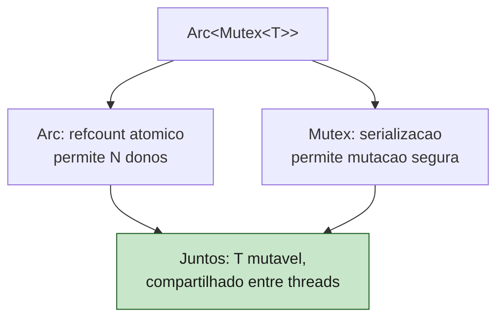
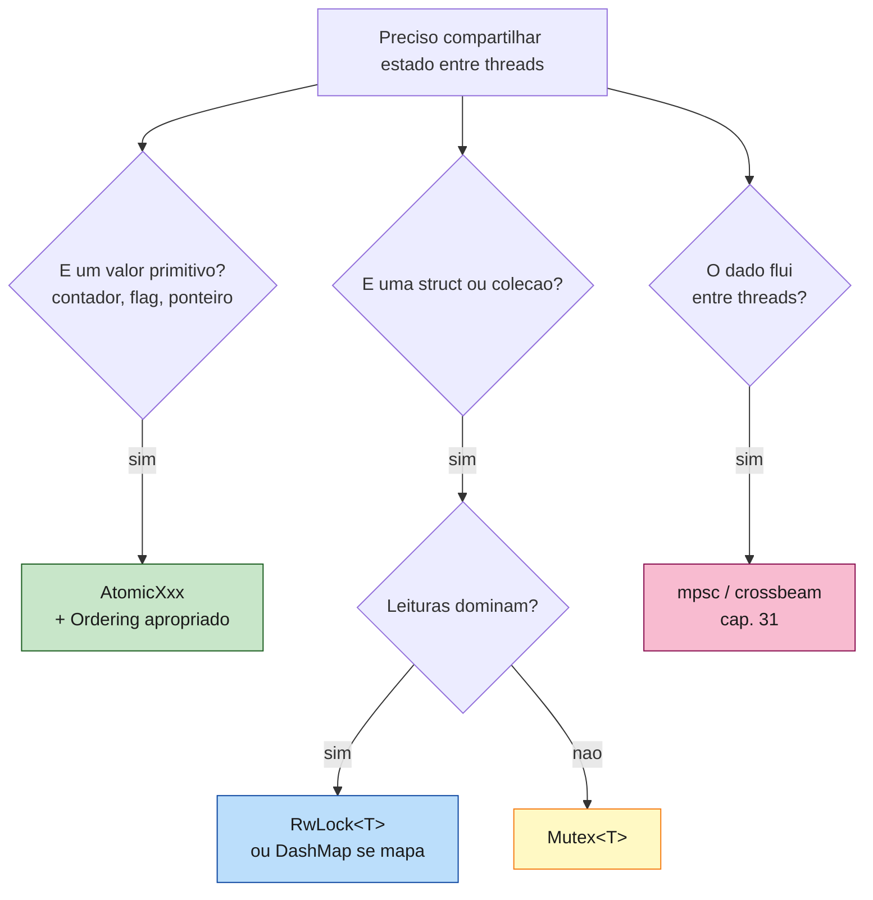

<a id="capitulo-32"></a>
# Capítulo 32: Mutex, RwLock e Atômicos

> *"A mutex is not a feature; it's an admission. You admit that two threads need to look at the same byte, and you pay for it with serialization."*
> — Mara Bos, *Rust Atomics and Locks*

> *"Locks are easy to use wrong. RAII makes them easy to use right."*
> — Bjarne Stroustrup, parafraseando seu próprio princípio

## 32.1 O Outro Lado da Concorrência

O capítulo anterior foi sobre fluxo: dados que viajam entre threads em canais. Este é sobre **estado**: dados que vivem num lugar fixo e são lidos ou escritos por várias threads. Para isso, Rust oferece três ferramentas, em ordem crescente de "perto do metal":

1. **`Mutex<T>`**: exclusão mútua. Uma thread por vez.
2. **`RwLock<T>`**: vários leitores OU um escritor.
3. **Tipos atômicos** (`AtomicUsize`, `AtomicBool`, ...): sincronização sem lock, com memory ordering explícita.

Todos os três são `Sync` quando seu conteúdo é `Send` — o que significa que `&Mutex<T>` pode ser compartilhado entre threads (combinado com `Arc`, é o pão com manteiga da concorrência shared-state em Rust).

## 32.2 Mutex<T>: O Lock Que Embrulha o Dado

A definição assinatura, simplificada:

```rust
pub struct Mutex<T: ?Sized> {
    inner: sys::Mutex,        // primitiva do SO (ou parking_lot)
    poison: poison::Flag,     // estado de envenenamento
    data: UnsafeCell<T>,      // o dado em si
}
```

Note o ponto fundamental: o `Mutex` **embrulha o dado**. Em Java, C, Go, o lock e o dado são entidades separadas — você cria um mutex `m` e um campo `x`, e *combina* na sua cabeça que `x` só pode ser tocado quando `m` está pego. Em Rust, é fisicamente impossível tocar `x` sem pegar o lock, porque `x` mora dentro do lock.

```rust
use std::sync::Mutex;

let m = Mutex::new(5);

{
    let mut guard = m.lock().unwrap();
    *guard += 1;
    // guard sai de escopo aqui — unlock automatico
}

println!("{}", *m.lock().unwrap());  // 6
```

Três coisas acontecem:

1. **`lock()` devolve `Result<MutexGuard<'_, T>, PoisonError<...>>`**. O `Result` existe por causa de poisoning — vamos chegar nisso.
2. **`MutexGuard` é um proxy para `T`**. Implementa `Deref<Target = T>` e `DerefMut`, então `*guard` te dá `&T` ou `&mut T`.
3. **Quando o `MutexGuard` sai de escopo, `Drop` chama unlock**. Esquecer de soltar é impossível: o ferro do RAII faz por você.

Compare com C:

```c
pthread_mutex_t m = PTHREAD_MUTEX_INITIALIZER;
int x = 0;

pthread_mutex_lock(&m);
x += 1;
// esqueceu pthread_mutex_unlock(&m); deadlock no proximo lock
```

Compare com Go:

```go
var (
    mu sync.Mutex
    x  int
)

mu.Lock()
x += 1
mu.Unlock()  // tem que lembrar; Go nao protege via tipo
```

Em Go, nada impede a sequência:

```go
mu.Lock()
x += 1
return  // esqueci o Unlock
```

Em Rust, o `MutexGuard` não pode "vazar" sem dropar — quando vaza (sai de função, panic), o `Drop` libera. E você não tem como acessar o `T` sem o guard. **Não existe a operação "esquecer de unlock".**

## 32.3 Arc<Mutex<T>>: O Idiom Compartilhado

Um `Mutex<T>` sozinho protege o dado, mas você ainda precisa **compartilhá-lo entre threads**. O idiom é `Arc<Mutex<T>>`:

```rust
use std::sync::{Arc, Mutex};
use std::thread;

fn main() {
    let counter = Arc::new(Mutex::new(0u64));

    let mut handles = vec![];
    for _ in 0..10 {
        let counter = Arc::clone(&counter);
        handles.push(thread::spawn(move || {
            let mut guard = counter.lock().unwrap();
            *guard += 1;
        }));
    }

    for h in handles { h.join().unwrap(); }
    println!("{}", *counter.lock().unwrap());  // 10
}
```

A leitura do tipo `Arc<Mutex<T>>` é precisa:

- **`Mutex<T>`**: dado mutável compartilhável entre threads.
- **`Arc<...>`**: porque queremos N donos, então refcount atômico.

Sem `Arc`, cada thread precisaria pegar emprestado `&Mutex<T>` da main, mas a main não pode emprestar para threads que vivem mais tempo (lifetime). Sem `Mutex`, `Arc<T>` seria imutável (você não pode mutar dado dentro de `Arc` sem `Mutex` ou `RwLock`).



## 32.4 Poisoning: O Result em lock()

Por que `lock()` devolve `Result`?

Cenário: thread A pega o lock, panica no meio da operação, e o `Drop` libera o lock. O dado dentro pode estar em estado inconsistente — uma estrutura quebrada, um invariante violado. Thread B agora pega o lock e recebe... o quê?

A resposta de Rust é: o lock fica **envenenado**. Próximas chamadas a `lock()` devolvem `Err(PoisonError)`, que carrega o guard mesmo assim — você pode recuperar o dado se souber o que faz, ou propagar o erro.

```rust
use std::sync::{Arc, Mutex};
use std::thread;

let m = Arc::new(Mutex::new(vec![1, 2, 3]));
let m2 = Arc::clone(&m);

let _ = thread::spawn(move || {
    let mut g = m2.lock().unwrap();
    g.push(4);
    panic!("oops");  // poison
}).join();

match m.lock() {
    Ok(g) => println!("ok: {:?}", g),
    Err(poisoned) => {
        let g = poisoned.into_inner();
        println!("envenenado, mas dado: {:?}", g);
    }
}
```

A escolha pragmática mais comum é `unwrap()` — se o lock está envenenado, panic, não tente continuar. É raríssimo querer recuperar.

Go não tem nada equivalente. Se uma goroutine panica segurando um lock, o lock continua segurado (deadlock) ou, se você usa `defer mu.Unlock()`, libera com o dado talvez inconsistente, sem aviso ao próximo.

## 32.5 RwLock<T>: Muitos Leitores OU Um Escritor

`Mutex` serializa tudo: até dois leitores que não se atrapalhariam ficam um esperando o outro. Para casos read-heavy, `RwLock<T>`:

```rust
use std::sync::{Arc, RwLock};
use std::thread;

fn main() {
    let cache = Arc::new(RwLock::new(std::collections::HashMap::new()));

    // escritor inicial
    {
        let mut w = cache.write().unwrap();
        w.insert("a", 1);
        w.insert("b", 2);
    }

    let mut handles = vec![];
    for _ in 0..5 {
        let cache = Arc::clone(&cache);
        handles.push(thread::spawn(move || {
            let r = cache.read().unwrap();   // varios podem ler simultaneamente
            println!("a={:?}", r.get("a"));
        }));
    }
    for h in handles { h.join().unwrap(); }
}
```

API:

- `read()` -> `RwLockReadGuard<T>`. Vários podem coexistir.
- `write()` -> `RwLockWriteGuard<T>`. Exclusivo: nenhum leitor, nenhum outro escritor.

Cuidado:

1. **Starvation**: dependendo da implementação, escritores podem esperar para sempre se há fluxo contínuo de leitores. Implementações modernas (`parking_lot`, std recente) fazem write-preferring para evitar isso.
2. **Custo**: `RwLock` é mais caro que `Mutex` na operação leitura simples. Só vale a pena se as operações são *longas* o bastante para que o paralelismo de leitores compense.
3. **Não é "lock-free"**: ainda há sincronização. Para contadores quentes, atomics.

| Operacao             | Mutex | RwLock                  |
|----------------------|-------|-------------------------|
| Um leitor sozinho    | OK    | OK                      |
| Varios leitores      | serializa | paralelo            |
| Escritor sozinho     | OK    | OK                      |
| Leitor + escritor    | serializa | escritor espera     |
| Custo por op simples | ~10ns | ~30-100ns               |

Em Java: `ReentrantReadWriteLock`. Em Go: `sync.RWMutex`. Em C++: `std::shared_mutex`. A semântica é a mesma — o tipo é diferente, e em Rust a posse do guard prova a relação leitor/escritor.

## 32.6 parking_lot: A Versão Mais Rápida

A `std` usa as primitivas do SO (`pthread_mutex` no Linux, `SRWLOCK` no Windows). Funcionam, mas têm overhead. O crate `parking_lot` reimplementa Mutex, RwLock e Condvar em Rust puro com algoritmos modernos:

- **Sem alocação**: `Mutex::new` é um simples `usize`. A `std` antigamente alocava em algumas plataformas (não mais, mas o backlog ficou).
- **Mais rápido**: spinning + parking adaptativos. Em workloads sob baixa contenção, frequentemente 2-5x mais rápido.
- **Sem `Result` em `lock`**: parking_lot não faz poisoning. `lock()` devolve `MutexGuard` direto.

```rust
use parking_lot::Mutex;
use std::sync::Arc;

let m = Arc::new(Mutex::new(0));
{
    let mut g = m.lock();   // sem unwrap()
    *g += 1;
}
```

A escolha entre `std::sync::Mutex` e `parking_lot::Mutex`:

- **std**: zero deps, suficiente para a maioria.
- **parking_lot**: padrão de fato em código de produção que precisa de performance ou rejeita poisoning.

## 32.7 Atomics: Sincronização Sem Lock

Para um único valor primitivo (contador, flag), pegar um lock é exagero. Os tipos atômicos da `std::sync::atomic` permitem operações primitivas indivisíveis suportadas pelo hardware:

- `AtomicBool`, `AtomicUsize`, `AtomicI32`, `AtomicI64`, `AtomicU8`, ...
- Ponteiros: `AtomicPtr<T>`.

Operações: `load`, `store`, `swap`, `compare_exchange`, `fetch_add`, `fetch_sub`, `fetch_and`, `fetch_or`, `fetch_xor`, `fetch_min`, `fetch_max`.

```rust
use std::sync::atomic::{AtomicUsize, Ordering};
use std::sync::Arc;
use std::thread;

fn main() {
    let counter = Arc::new(AtomicUsize::new(0));
    let mut handles = vec![];

    for _ in 0..4 {
        let c = Arc::clone(&counter);
        handles.push(thread::spawn(move || {
            for _ in 0..1_000_000 {
                c.fetch_add(1, Ordering::Relaxed);
            }
        }));
    }

    for h in handles { h.join().unwrap(); }
    println!("{}", counter.load(Ordering::Relaxed));  // 4_000_000
}
```

Sem `Mutex`. Sem `Arc<Mutex<...>>`. Sem `lock`. O hardware garante que `fetch_add` é indivisível. Em x86 isso vira uma instrução `LOCK XADD`. Em ARM, um par `LDXR`/`STXR`.

## 32.8 Memory Ordering: O Problema da CPU Reordenadora

A CPU moderna não executa instruções na ordem em que você escreve. Reordena para esconder latência de memória, manter pipelines cheios, agradar caches. Para uma única thread, isso é invisível — a CPU mantém a ilusão de ordem sequencial. Para múltiplas threads, é catastrófico.

Considere:

```
// thread 1            thread 2
x = 1                  while (flag == 0) {}
flag = 1               assert(x == 1)
```

Em hardware fraco-ordenado (ARM, POWER), a thread 2 pode ver `flag == 1` mas ainda `x == 0` — porque a CPU 1 reordenou as escritas, ou porque a CPU 2 reordenou as leituras. Sem barreiras, o assert falha.

Atomics resolvem isso permitindo (e exigindo) que você diga *que ordenação você precisa*. O parâmetro `Ordering` é a tradução literal das opções do C++11 — Rust herdou o modelo:

| Ordering         | Significado                                                                 |
|------------------|------------------------------------------------------------------------------|
| `Relaxed`        | Atomicidade so. Sem garantia de ordem entre operacoes diferentes.            |
| `Acquire`        | Loads. Operacoes posteriores nao reordenam para antes.                       |
| `Release`        | Stores. Operacoes anteriores nao reordenam para depois.                      |
| `AcqRel`         | Para read-modify-write: Acquire na leitura + Release na escrita.             |
| `SeqCst`         | Ordem total global. Mais caro, mais facil de raciocinar.                     |

A regra de ouro: **use `SeqCst` quando duvidar.** É um pouco mais lento, mas dá semântica intuitiva. Use `Relaxed` apenas para contadores que você lê só no fim. Use `Acquire`/`Release` quando entender a relação happens-before.

Padrão clássico de flag entre threads:

```rust
use std::sync::atomic::{AtomicBool, Ordering};
use std::sync::Arc;
use std::thread;

fn main() {
    let ready = Arc::new(AtomicBool::new(false));
    let data = Arc::new(std::sync::atomic::AtomicU64::new(0));

    let r2 = Arc::clone(&ready);
    let d2 = Arc::clone(&data);
    thread::spawn(move || {
        d2.store(42, Ordering::Relaxed);
        r2.store(true, Ordering::Release);   // publica
    });

    while !ready.load(Ordering::Acquire) {}  // sincroniza
    let v = data.load(Ordering::Relaxed);
    println!("{v}");                          // garantido 42
}
```

`Release` na escrita de `ready` "publica" todas as escritas anteriores. `Acquire` no `load` de `ready` "vê" essas publicações. É isto que estabelece o happens-before — sem mutex, sem channel, na velocidade do hardware.

## 32.9 Comparação: Mutex em Quatro Linguagens

**C (pthreads):**

```c
pthread_mutex_t m = PTHREAD_MUTEX_INITIALIZER;
int counter = 0;

pthread_mutex_lock(&m);
counter++;
pthread_mutex_unlock(&m);   // se voce esquecer: deadlock
```

**Java:**

```java
private final Object lock = new Object();
private int counter = 0;

synchronized (lock) {
    counter++;
}  // unlock automatico via bloco; mas o lock e separado do dado
```

**Go:**

```go
var mu sync.Mutex
var counter int

mu.Lock()
counter++
mu.Unlock()
// ou: defer mu.Unlock() apos Lock(), idiomatico
```

**Rust:**

```rust
let counter: Mutex<i32> = Mutex::new(0);

{
    let mut g = counter.lock().unwrap();
    *g += 1;
}   // unlock automatico via Drop
```

| Aspecto                             | C   | Java | Go  | Rust |
|-------------------------------------|-----|------|-----|------|
| Lock e dado fisicamente acoplados   | nao | nao  | nao | sim  |
| Esquecer de unlock e impossivel     | nao | sim* | nao | sim  |
| Compilador pega "acessei sem lock"  | nao | nao  | nao | sim  |
| Poisoning explicito                 | nao | nao  | nao | sim  |

\* Java escapa via `synchronized`, mas não previne acessar o campo *fora* do bloco.

A linha "compilador pega acesso sem lock" é o ponto. Em Java, nada impede:

```java
// outra thread
counter++;  // sem o synchronized — bug silencioso
```

Em Rust, `counter` *é* o `Mutex<i32>`. Você não tem como acessar o `i32` sem chamar `lock()`. **A regra existe no tipo.**

## 32.10 Padrão: Mutex<HashMap> vs DashMap

Caso comum: cache compartilhado entre threads.

```rust
use std::sync::{Arc, Mutex};
use std::collections::HashMap;

let cache = Arc::new(Mutex::new(HashMap::<String, u64>::new()));
// inserir
cache.lock().unwrap().insert("k".into(), 1);
```

Funciona, mas serializa toda operação. Se duas threads inserem chaves diferentes, esperam uma à outra à toa. Soluções:

1. **`RwLock<HashMap<...>>`**: leituras paralelas, escrita exclusiva.
2. **`DashMap`** (crate): hashmap concorrente com sharding interno. Diferentes chaves vão para diferentes shards, paralelizam.
3. **`Arc<HashMap<K, Mutex<V>>>`**: lock por valor. Inserção ainda lockaria o mapa todo (ou usa-se `RwLock` no externo).

Para serviços com cache quente, `DashMap` é frequentemente a escolha:

```rust
use dashmap::DashMap;
use std::sync::Arc;

let cache: Arc<DashMap<String, u64>> = Arc::new(DashMap::new());
cache.insert("k".into(), 1);   // sem .lock()
let v = cache.get("k").map(|r| *r);
```

A API parece um `HashMap` normal, mas a sincronização vive nos shards.

## 32.11 Quando Cada Ferramenta



Heurística:

- **Atomic** se o estado é um inteiro/booleano e operações são hardware-supported.
- **Mutex** se o estado é uma struct/coleção e a maioria das operações muta.
- **RwLock** se a leitura domina (cache, configuração).
- **Channel** se o dado segue um pipeline.
- **DashMap** se o estado é um mapa quente.

## 32.12 Erros Comuns em Concorrência (Que o Compilador Não Pega)

Send/Sync eliminam data races. Não eliminam:

**Deadlock por ordem de locks:**

```rust
// thread 1: lock(a) -> lock(b)
// thread 2: lock(b) -> lock(a)
// trava
```

A solução clássica: estabelecer uma ordem global de aquisição. Compila igual.

**Lock segurado tempo demais:**

```rust
let g = m.lock().unwrap();
funcao_lenta_de_io();   // lock segurado durante I/O
// melhor: clonar dado, soltar lock, fazer I/O
```

**Locks aninhados desnecessários:**

```rust
let g1 = a.lock().unwrap();
let g2 = b.lock().unwrap();   // raramente precisa dos dois ao mesmo tempo
```

**Confiar em SeqCst quando Acquire/Release basta** (problema oposto também existe — usar Relaxed quando precisava de Acquire).

## 32.13 Resumo

- `Mutex<T>` embrulha o dado. `lock()` devolve `MutexGuard<T>` que faz unlock no Drop.
- `Result` em `lock()` é poisoning: lock pego em thread que panicou. `unwrap()` é o caminho idiomático.
- `Arc<Mutex<T>>` é o idiom para compartilhar estado mutável entre threads.
- `RwLock<T>` permite vários leitores OU um escritor. Use quando leitura domina.
- `parking_lot` reimplementa em Rust puro: mais rápido, sem poisoning. Padrão em produção.
- Atomics (`AtomicBool`, `AtomicUsize`, ...) são lock-free, com `Ordering` (`Relaxed`/`Acquire`/`Release`/`AcqRel`/`SeqCst`).
- O modelo de memória de Rust = o modelo de C++11. `SeqCst` na dúvida.
- Mutex em Rust não pode ser usado errado por esquecimento de unlock — RAII garante. Pode ser usado errado por **ordem de locks** (deadlock) — isso é responsabilidade sua.
- Para mapas concorrentes, `DashMap` frequentemente bate `Mutex<HashMap>` e `RwLock<HashMap>`.

| Primitiva     | Bloqueio | Uso tipico                              | Custo aproximado |
|---------------|----------|-----------------------------------------|------------------|
| `AtomicXxx`   | nao      | contador, flag, ponteiro                | ~1-10 ns         |
| `Mutex<T>`    | sim      | qualquer estado mutavel                 | ~10-30 ns        |
| `RwLock<T>`   | sim      | estado read-heavy                       | ~30-100 ns       |
| `DashMap<K,V>`| sharded  | mapa concorrente                        | ~10-50 ns/op     |
| Channel       | depende  | fluxo entre threads                     | ~50-200 ns/msg   |

A última frase do capítulo, devolvida a Mara Bos:

> *"Concurrency is hard. Rust doesn't pretend otherwise. It just refuses to let you compile the worst kinds of wrong."*

O capítulo 33 leva tudo isso para `async/await` e `tokio` — onde concorrência deixa de ser sobre threads e passa a ser sobre tasks.

---

> *"Em C, o lock é um costume. Em Java, é uma palavra-chave. Em Go, é uma boa prática. Em Rust, é o nome do dado."*

[Próximo: Capítulo 33 — Async/Await e o Modelo Tokio →](ch33-async-await.md)
