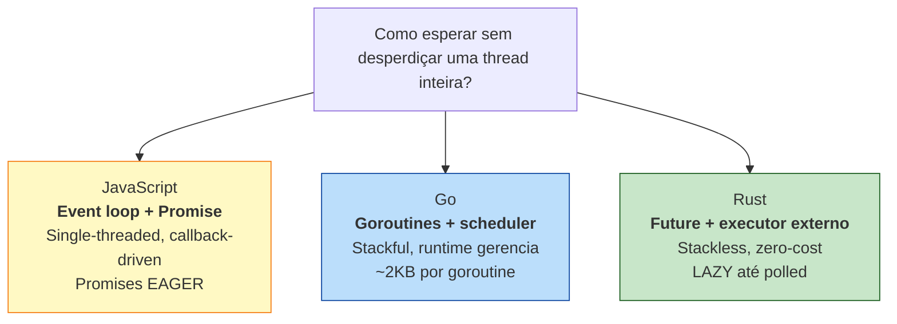
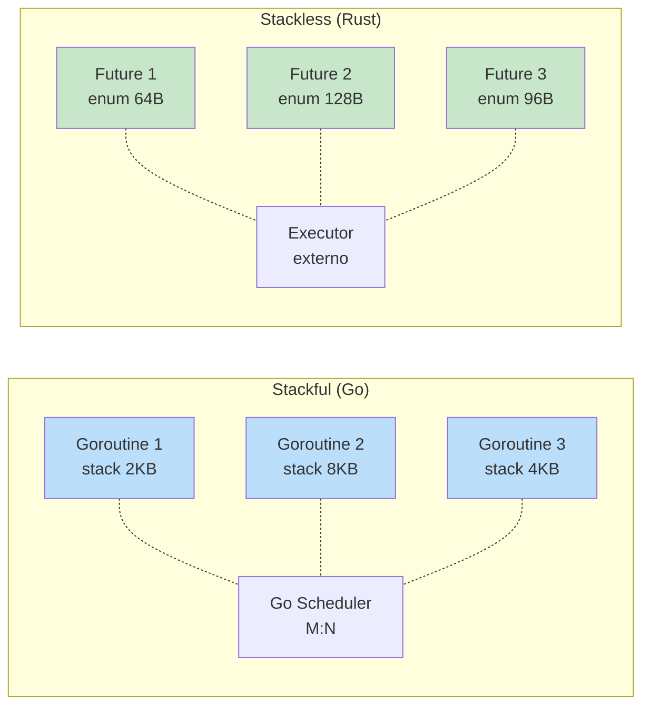

<a id="capitulo-33"></a>
# Capítulo 33: Futures e o Modelo Async

> *"Don't communicate by sharing memory; share memory by communicating."*
> — Rob Pike, sobre Go

> *"A future in Rust is a value that does nothing until you ask it to."*
> — Aaron Turon, sobre o desenho original do `Future` trait

## 33.1 Três Filosofias de Espera

Todo programa moderno passa a maior parte da vida **esperando**. Esperando o disco. Esperando a rede. Esperando um usuário clicar. Esperando outro processo terminar. Um servidor HTTP típico, mesmo sob carga, consome menos de 5% de CPU — os outros 95% são *blocking time* disfarçado.

A história da concorrência é a história de como cada linguagem tentou transformar essa espera em algo útil.



JavaScript escolheu o caminho mais simples: **uma thread**, um event loop, callbacks empilhados em filas. A linguagem nasceu no navegador, onde a UI exige uma única thread por construção. Promises são **eager** — quando você escreve `fetch(url)`, a requisição **dispara imediatamente**, mesmo que ninguém faça `.then` nela.

Go escolheu o caminho do escala-por-runtime: cada goroutine é uma thread cooperativa de espaço de usuário, com uma stack pequena que cresce sob demanda. O scheduler do Go runtime multiplexa N goroutines em M threads do SO. Você escreve código *como se fosse síncrono*, e o compilador insere os pontos de yield.

Rust escolheu o caminho mais radical e mais raro: **não escolher um runtime**. A linguagem define o que é um "trabalho async" — o trait `Future` — e deixa o usuário escolher (ou escrever) quem executa. Não há GC. Não há stack secundária. Não há thread escondida. Só uma máquina de estados que o compilador gera, e um *executor* externo que a alimenta.

Cada caminho tem um custo. JavaScript paga em capacidade (uma CPU só). Go paga em runtime (~10MB de overhead, GC). Rust paga em complexidade do tipo — o famoso `Pin<&mut Self>`, que veremos adiante.

## 33.2 O Trait `Future`

O coração do async em Rust cabe em uma definição:

```rust
pub trait Future {
    type Output;

    fn poll(self: Pin<&mut Self>, cx: &mut Context<'_>) -> Poll<Self::Output>;
}

pub enum Poll<T> {
    Ready(T),
    Pending,
}
```

Leia devagar. Um `Future` é algo que tem **um método**: `poll`. Você "pergunta" ao future se ele já terminou. Ele responde uma de duas coisas:

- `Poll::Ready(valor)` — terminei, aqui está o resultado.
- `Poll::Pending` — ainda não, me chame de novo depois.

E só. Não há thread escondida. Não há callback. Não há promessa de execução em background. Um `Future` é apenas um **valor** que sabe responder uma pergunta.

A consequência disso é a propriedade mais surpreendente do async em Rust:

> **Futures em Rust são preguiçosos.**

```rust
async fn baixar(url: &str) -> String {
    println!("baixando {}", url);
    // ... lógica de download
    String::from("conteúdo")
}

fn main() {
    let f = baixar("https://example.com");
    // Nada foi impresso. Nada foi baixado.
    // `f` é um Future que ainda não foi polled.
    drop(f); // Tudo bem. Nenhum trabalho foi feito.
}
```

Compare com JavaScript:

```typescript
async function baixar(url: string): Promise<string> {
    console.log(`baixando ${url}`);
    // ... lógica de download
    return "conteúdo";
}

function main() {
    const p = baixar("https://example.com");
    // Já imprimiu "baixando ...". Já disparou o fetch.
    // A Promise está EM EXECUÇÃO no event loop.
}
```

Em TypeScript, chamar uma função async **inicia o trabalho**. A `Promise` retornada já está "rodando" no event loop. Em Rust, chamar uma função async apenas **constrói um valor que descreve o trabalho**. Esse valor não faz nada até alguém chamar `poll` nele.

Essa diferença é a fonte de metade da confusão dos programadores que migram para Rust e a fonte de metade da elegância do modelo. Voltaremos a ela na seção 33.6.

## 33.3 `async fn` e a Máquina de Estados

A pergunta natural é: como o compilador transforma uma função com `await` em algo que implementa `Future`?

A resposta é uma das transformações mais impressionantes do Rust: o compilador gera uma **máquina de estados** anônima.

Considere:

```rust
async fn pipeline() -> u32 {
    let x = passo_a().await;
    let y = passo_b(x).await;
    passo_c(y).await
}
```

Isso desugaring (de forma simplificada) gera algo equivalente a:

```rust
enum PipelineState {
    Inicio,
    EsperandoA(FutureDeA),
    EsperandoB(u32, FutureDeB),
    EsperandoC(u32, FutureDeC),
    Pronto,
}

struct Pipeline {
    estado: PipelineState,
}

impl Future for Pipeline {
    type Output = u32;

    fn poll(self: Pin<&mut Self>, cx: &mut Context<'_>) -> Poll<u32> {
        loop {
            match self.estado {
                PipelineState::Inicio => {
                    let f = passo_a();
                    self.estado = PipelineState::EsperandoA(f);
                }
                PipelineState::EsperandoA(ref mut f) => {
                    match Pin::new(f).poll(cx) {
                        Poll::Pending => return Poll::Pending,
                        Poll::Ready(x) => {
                            let f = passo_b(x);
                            self.estado = PipelineState::EsperandoB(x, f);
                        }
                    }
                }
                // ... demais estados
                PipelineState::Pronto => unreachable!(),
            }
        }
    }
}
```

(O código real é mais sofisticado e usa `Pin` projetado, mas a ideia é essa.)

Cada `.await` é um **ponto de yield**: um lugar onde a função pode pausar, salvar seu estado local, devolver `Poll::Pending`, e voltar exatamente de onde parou na próxima chamada de `poll`.

O resultado é único na história das linguagens:

- **Sem alocação por chamada.** A máquina de estado tem tamanho fixo, conhecido em compile time. Cabe na stack do chamador.
- **Sem thread por future.** Mil futures aninhados são uma única struct.
- **Sem overhead de runtime.** Não existe scheduler implícito.

Em Go, cada goroutine custa uma stack (~2KB inicial, crescendo). Em JS, cada Promise é um objeto no heap com listas de callbacks. Em Rust, um `async fn` é uma `enum` de tamanho fixo na stack. Esse é o sentido literal de **zero-cost async**.

## 33.4 Stackless vs Stackful

A distinção técnica mais importante para entender o porquê do desenho do Rust:



**Stackful coroutines** (Go, Erlang, fibers C++): cada tarefa concorrente tem sua própria stack de execução. Quando ela faz uma operação que bloqueia, o runtime salva a stack inteira e troca para outra. É flexível — a tarefa pode chamar funções normais, recursão, qualquer coisa — mas tem custo de memória e de troca de contexto.

**Stackless coroutines** (Rust, C# async, Kotlin, JS): cada tarefa é uma máquina de estados que vive na stack do chamador. Não há stack secundária. O compilador converte `await` em transições de estado. É mais leve, mas tem uma restrição: você não pode `await` dentro de uma função síncrona arbitrária — a transformação precisa ser visível ao compilador.

A comunidade de Go às vezes dispara: "Rust async é complicado, goroutines são simples". Verdade. Mas o trade-off é honesto: Go paga em memória (~8KB por goroutine, GC, scheduler) o que Rust paga em sintaxe (`async fn`, `.await`, `Pin`). Para um sistema com 1.000 goroutines, ninguém liga. Para um sistema com 1.000.000 de conexões — Discord, Cloudflare, AWS — a diferença é o que define se o produto existe.

## 33.5 Pin, em Uma Página (por enquanto)

Há um detalhe inconveniente. A máquina de estados gerada pelo compilador pode conter **referências internas** — um campo apontando para outro campo da mesma struct. Isso acontece sempre que uma variável local é usada antes e depois de um `.await`.

```rust
async fn exemplo() {
    let buf = [0u8; 1024];
    let slice = &buf[..];      // referência para campo da própria future
    aguarda_algo().await;       // ponto de yield
    println!("{}", slice.len()); // usa a referência depois do await
}
```

A struct gerada precisa armazenar `buf` *e* `slice` (que aponta para `buf`). Se essa struct for **movida** na memória (típico em Rust — `Vec` realoca, `Box::new` move, `mem::swap` troca), `slice` ficaria apontando para lixo.

Para resolver, Rust introduziu o tipo `Pin<&mut T>`: uma referência **garantidamente imóvel**. Por isso `Future::poll` recebe `Pin<&mut Self>` em vez de `&mut self`. A garantia: enquanto o future está sendo polled, ele não pode ser movido.

Cloudflare resumiu isso bem em seu post sobre Pin:

> *"Self-referential types can be really useful, but they're also hard to make memory-safe."*

Pin é a peça de tipo que torna self-references seguras sem `unsafe` no código de usuário. É elegante, mas tem fama de obscuro. Dedicaremos um capítulo inteiro a ele depois (capítulo 36). Por ora, basta saber que `Pin` existe para tornar a máquina de estados do compilador **segura ao redor de pontos de await**.

## 33.6 O Executor Externo

Em Go, escrever `go funcao()` invoca o runtime e sua thread já está rodando. Em JavaScript, retornar uma `Promise` insere callbacks numa fila microtask gerenciada pelo motor V8 ou similar.

Em Rust, **não existe runtime padrão**. A linguagem define o trait `Future`, o trait `Wake`, e a sintaxe `async`/`await`. Mas quem chama `poll` em loop? Quem decide a ordem? Quem mapeia futures para threads?

Resposta: você escolhe.

```rust
// futures crate, executor minimalista
use futures::executor::block_on;

async fn dizer_oi() {
    println!("oi do future");
}

fn main() {
    let f = dizer_oi();         // construir o future
    block_on(f);                 // BLOQUEAR esta thread até f terminar
}
```

`block_on` é o executor mais simples possível: toma um future, chama `poll` em loop, dorme quando recebe `Pending`, retorna quando recebe `Ready`. Útil para testes. Inútil para servidor de produção.

Para algo sério, usamos **Tokio**, **smol**, **async-std**, ou **embassy** (embedded). Veremos Tokio em detalhe no próximo capítulo.

A pergunta natural: por que Rust não embute um runtime? Três razões.

**Domínios diferentes pedem schedulers diferentes.** Um servidor web quer multi-threaded com work-stealing. Um firmware embedded quer single-threaded sem alocação. Um runtime de UI quer cooperativo com prioridades. Embutir um na linguagem traíria os outros.

**Zero-cost significa não pagar pelo que não usa.** Se o runtime fosse parte da std, programas síncronos carregariam código morto. Em Rust, um binário sem `tokio` não tem nem um byte de scheduler.

**Inovação fica fora do compilador.** Tokio v0.2, v1.0, work-stealing, io_uring — toda a evolução do mundo async em Rust aconteceu sem mudar a linguagem. Comparado a Python, que mudou `asyncio` três vezes em sete anos quebrando código, é uma vantagem decisiva.

O custo é honesto: você precisa escolher um runtime, e crates assíncronas nem sempre são portáveis entre runtimes. A comunidade tem trabalhado em traits comuns (`AsyncRead`, `AsyncWrite`) para mitigar isso.

## 33.7 Exemplo Comparativo: Baixando N URLs

Nada esclarece como código real. Considere a tarefa: dadas N URLs, baixar todas concorrentemente e somar o tamanho dos corpos.

### TypeScript (Node)

```typescript
async function baixarTudo(urls: string[]): Promise<number> {
    const respostas = await Promise.all(
        urls.map(url => fetch(url).then(r => r.text()))
    );
    return respostas.reduce((acc, texto) => acc + texto.length, 0);
}

baixarTudo([
    "https://example.com/a",
    "https://example.com/b",
    "https://example.com/c",
]).then(total => console.log(`total: ${total}`));
```

Promises são eager: assim que `fetch(url)` é chamado dentro do `map`, a requisição já está em voo. `Promise.all` apenas espera todas. É curto, é limpo, e tem um problema: nenhum limite de paralelismo. Se você passar 10.000 URLs, vai abrir 10.000 conexões simultâneas e o seu Node vai morrer.

### Go

```go
package main

import (
    "fmt"
    "io"
    "net/http"
    "sync"
    "sync/atomic"
)

func baixarTudo(urls []string) int64 {
    var total int64
    var wg sync.WaitGroup
    for _, url := range urls {
        wg.Add(1)
        go func(u string) {
            defer wg.Done()
            resp, err := http.Get(u)
            if err != nil {
                return
            }
            defer resp.Body.Close()
            body, _ := io.ReadAll(resp.Body)
            atomic.AddInt64(&total, int64(len(body)))
        }(url)
    }
    wg.Wait()
    return atomic.LoadInt64(&total)
}
```

Go pede `sync.WaitGroup` para esperar, `atomic` para somar sem race, e captura explícita de variável de loop (a famosa armadilha). Cada `go` dispara uma goroutine que **já está rodando** assim que a linha executa.

### Rust (Tokio + reqwest)

```rust
use futures::future::join_all;
use reqwest;

async fn baixar_tudo(urls: Vec<String>) -> usize {
    let futures = urls.into_iter().map(|url| async move {
        match reqwest::get(&url).await {
            Ok(resp) => match resp.text().await {
                Ok(body) => body.len(),
                Err(_) => 0,
            },
            Err(_) => 0,
        }
    });

    let resultados = join_all(futures).await;
    resultados.iter().sum()
}

#[tokio::main]
async fn main() {
    let urls = vec![
        "https://example.com/a".to_string(),
        "https://example.com/b".to_string(),
        "https://example.com/c".to_string(),
    ];
    let total = baixar_tudo(urls).await;
    println!("total: {}", total);
}
```

Note três pontos importantes.

**Primeiro**, `urls.into_iter().map(|url| async move { ... })` constrói um *iterador de futures*. Nenhuma requisição foi feita ainda. Os futures são valores inertes na stack (ou no heap, dependendo do tamanho).

**Segundo**, `join_all(futures).await` é o que efetivamente executa: o executor do Tokio começa a polling cada future em paralelo, multiplexando-os em threads do pool, e devolve um `Vec` quando todos terminam.

**Terceiro**, não há `WaitGroup`, não há `atomic`, não há `Promise.all`. A composição é estrutural: `join_all` pega `IntoIterator<Item = impl Future>` e devolve `Future<Output = Vec<...>>`. Tudo composição de tipos.

Para limitar paralelismo (o que TypeScript não faz por padrão), Rust oferece `buffer_unordered` em `StreamExt`:

```rust
use futures::stream::{self, StreamExt};

async fn baixar_tudo_limitado(urls: Vec<String>, limite: usize) -> usize {
    stream::iter(urls)
        .map(|url| async move {
            reqwest::get(&url).await
                .ok()
                .and_then(|r| futures::executor::block_on(r.text()).ok())
                .map(|b| b.len())
                .unwrap_or(0)
        })
        .buffer_unordered(limite)
        .fold(0usize, |acc, n| async move { acc + n })
        .await
}
```

`buffer_unordered(50)` mantém **no máximo 50 futures em voo** ao mesmo tempo. À medida que um termina, outro começa. Esse é o tipo de controle que linguagens com Promise eager precisam reimplementar à mão (Node tem `p-limit`, Python tem `asyncio.Semaphore`).

## 33.8 O Que Lazy Compra

A laziness do `Future` em Rust não é capricho — ela é o que permite três coisas que outras linguagens só fazem com gambiarra.

**Composição sem efeitos colaterais.** Construir um future não dispara trabalho. Você pode passá-lo, armazená-lo, descartá-lo. Em JS, criar uma `Promise` é um efeito colateral irrevogável.

```rust
// Construir mas talvez não executar
let f = operacao_cara();
if condicao_inesperada() {
    return; // f é dropado, nada foi feito
}
let resultado = f.await; // só agora a operação roda
```

Em TypeScript, `operacao_cara()` já teria começado, e descartar a Promise seria desperdício (e fonte de leaks de UnhandledPromiseRejection).

**Cancellation por drop.** Para cancelar um future em Rust, basta dropá-lo. Como ele é apenas um valor, o destructor roda, libera recursos, fim. Em JS, cancelar uma Promise é literalmente impossível (precisa do `AbortController`, que cada API precisa suportar manualmente). Em Go, cancelar uma goroutine exige passar `context.Context` e cooperação explícita.

**Timeout como combinator.** `tokio::time::timeout(Duration::from_secs(5), futuro)` envolve um future com prazo. Se o prazo vence, o future é dropado — cancelado. Sem callback. Sem flag. Sem state machine manual.

```rust
use tokio::time::{timeout, Duration};

async fn com_prazo() -> Result<String, &'static str> {
    match timeout(Duration::from_secs(5), reqwest::get("https://lento.com")).await {
        Ok(Ok(resp)) => Ok(resp.text().await.unwrap_or_default()),
        Ok(Err(_)) => Err("erro http"),
        Err(_) => Err("timeout"),
    }
}
```

Tudo isso emerge naturalmente de uma decisão de desenho: futures são valores inertes que descrevem trabalho, não objetos vivos que executam trabalho.

## 33.9 O Custo Honesto

Se Rust async é tão elegante, por que tem fama de difícil?

**Erros do compilador são longos.** Um único `Send` faltando pode gerar três páginas de mensagens, porque o compilador rastreia todas as variáveis vivas em todos os pontos de await.

**`Pin` aparece em assinaturas.** Mesmo que você nunca implemente `Future` à mão, vai esbarrar em `Pin<Box<dyn Future>>` em algum momento — em traits objects, em retornos polimórficos, em libraries de baixo nível.

**Função color.** O famoso "what color is your function": funções async e funções síncronas não compõem livremente. Você não pode chamar `.await` numa função sync. Tem que propagar `async` por toda a árvore. JavaScript, Python e C# sofrem do mesmo problema. Go evita ao não ter async/await — toda função pode bloquear, o scheduler resolve.

**Trait objects exigem `Box::pin`.** `dyn Future` não pode viver na stack porque o tamanho não é conhecido. Toda hora que você precisa de polimorfismo de runtime em async, paga uma alocação.

**Runtimes não são intercambiáveis.** Um crate escrito para Tokio raramente roda em async-std sem adaptação. A comunidade está trabalhando nisso (com traits compartilhados em `futures::io`), mas é um ponto de atrito real.

Esses custos são reais. Eles existem porque Rust se recusa a esconder o modelo de execução do programador. Em troca, você ganha um sistema async que escala para milhões de conexões com perfil de memória previsível, sem GC pause, sem thread starvation, e sem runtime obscuro.

## 33.10 Resumo

Rust async se sustenta em quatro decisões interligadas:

| Decisão | Consequência |
|---|---|
| `Future` é um trait com `poll()` | Trabalho async é um *valor*, não um efeito |
| Futures são lazy | Composição sem side effects, cancellation por drop |
| `async fn` desugaring para state machine | Zero alocação por future, tamanho fixo em compile time |
| Executor é externo | Domínios diferentes, schedulers diferentes, sem custo escondido |

Comparado a TypeScript: você ganha tipos exatos no retorno (`Future<Output = T>` em vez de `Promise<T>` apagado em runtime), cancellation real, paralelismo controlado. Paga em sintaxe (`Pin`, lifetimes, `Send + 'static`).

Comparado a Go: você ganha previsibilidade de memória, ausência de GC, expressão exata de "este future depende daquele". Paga em curva de aprendizado e em "function color".

Nos próximos dois capítulos veremos o runtime que venceu na prática (Tokio) e os padrões idiomáticos para escrever código async de produção (`select!`, streams, cancellation safety).

---

> *"Async em Rust não é uma feature. É uma consequência de levar a sério a pergunta: 'o que é, exatamente, um trabalho que ainda não terminou?'."*

[Próximo: Capítulo 34 — Tokio: O Runtime de Fato →](ch34-tokio.md)
