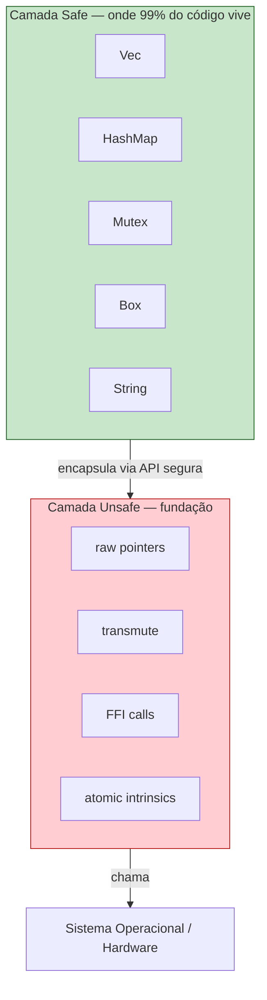
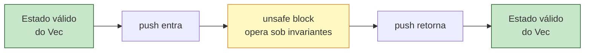
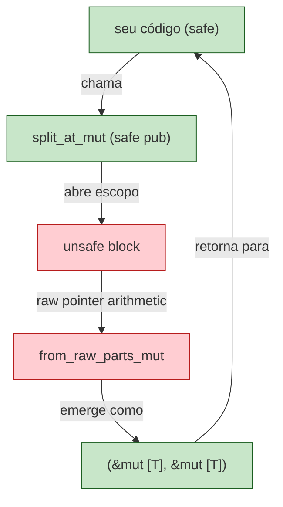

<a id="capitulo-36"></a>
# Capítulo 36: Unsafe Rust — Quando o Compilador Cala

> *"Below the line of safety lies the dark arts. We do not enter lightly. We enter because someone must, and we leave a paved road for those who come after."*
> — Adaptado do Rustonomicon

> *"Unsafe is not a bypass. It's a contract you sign in your own blood, declaring that you — not the compiler — will uphold the invariants from here on."*
> — Niko Matsakis

## 36.1 O Mito do Rust Seguro

Há uma mentira pedagógica que se conta sobre Rust nos primeiros capítulos: que ele é uma linguagem segura. É uma mentira útil, no mesmo sentido em que dizer que a Terra é redonda é útil — é mais perto da verdade do que dizer que é plana, mas a Terra não é uma esfera, é um geoide oblato com montanhas e vales. Rust não é seguro; Rust é uma linguagem de duas camadas onde a camada externa é seguramente construída sobre uma camada interna que não é.

Toda alocação de heap em Rust passa por `unsafe`. Toda primitiva de sincronização (`Mutex`, `RwLock`, atomics). Todo `Vec`, todo `HashMap`, todo `Box`. A `String` que você escreveu no `main` do seu primeiro programa em Rust foi possível porque, em algum lugar do `std`, alguém escreveu `unsafe` e jurou — sob a pena de um soundness bug eterno — que estava certo.

A pergunta correta nunca foi *"Rust é seguro?"*. A pergunta é: *"onde Rust permite que você desça até a camada onde o compilador não pode te proteger, e por quê?"*.



C não tem essa estrutura. C é uma única camada, e essa camada é a camada de baixo. Toda função em C tem o mesmo poder destrutivo do `unsafe { }` de Rust — mas sem a marcação. Em C, você escreve `*p` e ninguém te avisa que aquilo, se `p` estiver dangling, é Undefined Behavior. Em Rust, `*p` em um raw pointer só compila dentro de um bloco `unsafe`, e a presença daquela palavra no código grita: *aqui o programador, e não o compilador, está garantindo a correção*.

## 36.2 O Que `unsafe` Faz (e o Que Não Faz)

A primeira coisa que se ensina sobre `unsafe` é o que ele *não* faz. Ele não desliga o borrow checker. Ele não desliga o type system. Ele não te transforma em um programador de C com `#[allow(everything)]`. Esse mito é responsável por mais bugs em código `unsafe` do que qualquer outra coisa.

```rust
// MITO: dentro de unsafe, eu posso fazer o que quiser.
unsafe {
    let s = String::from("hello");
    let r = &s;
    drop(s);            // ainda erro de compilação
    println!("{}", r);  // borrow checker continua ativo
}
```

O bloco `unsafe` apenas *destrava cinco superpoderes específicos* que estão indisponíveis fora dele. Tudo mais — ownership, borrowing, lifetimes, types — continua valendo com a mesma severidade. Em outras palavras: `unsafe` não te dá mais liberdade no que o compilador *já sabia checar*. Ele te dá acesso a operações que o compilador *não consegue checar*.

### Os Cinco Superpoderes

```rust
// 1. Dereferenciar raw pointers (*const T, *mut T)
let mut x = 5;
let r = &mut x as *mut i32;
unsafe {
    *r = 10;
    println!("{}", *r);
}

// 2. Chamar funções unsafe (incluindo FFI)
unsafe fn perigosa(p: *const u8) -> u8 { *p }
let val = 42u8;
unsafe { perigosa(&val); }

// 3. Acessar / modificar static mut (variáveis globais mutáveis)
static mut CONTADOR: u32 = 0;
unsafe {
    CONTADOR += 1;
}

// 4. Implementar unsafe traits (Send, Sync, GlobalAlloc, etc.)
struct MeuTipo;
unsafe impl Send for MeuTipo {}

// 5. Acessar campos de uma union
#[repr(C)]
union IntOuFloat { i: i32, f: f32 }
let u = IntOuFloat { i: 0x40490FDB };
unsafe {
    println!("como float: {}", u.f); // ~3.14159
}
```

Cada um desses cinco corresponde a uma operação que o compilador *fundamentalmente não consegue verificar*. Considere o caso 1: dado um `*const T`, o compilador não tem como saber se aquele endereço é válido, se o objeto ainda existe, se a leitura respeita aliasing. A informação necessária — o que esse ponteiro está prometendo — vive na cabeça do programador. Forçar o programador a escrever `unsafe` é forçá-lo a *declarar* que carrega aquela informação.

Compare com C:

```c
// C — todas as cinco operações são triviais e silenciosas
int x = 5;
int* r = &x;
*r = 10;            // poder 1, sem cerimonial

void perigosa(unsigned char* p) { /* ... */ }
unsigned char v = 42;
perigosa(&v);       // poder 2, mesma sintaxe de qualquer chamada

static int contador = 0;
contador += 1;      // poder 3, sem aviso

union IntOuFloat { int i; float f; };
union IntOuFloat u = { .i = 0x40490FDB };
printf("%f\n", u.f); // poder 5, type punning sem proteção
```

Em C, *todo ponto do código tem todos os superpoderes ligados o tempo todo*. Não há gradação. O resultado é que, quando algo dá errado, você não tem onde olhar primeiro — qualquer linha pode ter sido o crime. Em Rust, `grep -rn "unsafe"` te dá a lista completa de lugares onde o compilador admite ignorância. É uma propriedade *operacional* de auditoria que C nunca poderá oferecer.

## 36.3 Por Que `unsafe` Existe

Existem três razões legítimas para descer ao `unsafe`, e elas raramente se misturam.

A primeira é **interop**. Você precisa chamar uma função em C, ou expor uma função sua para ser chamada por outro runtime (Python, Node, Java, um kernel). FFI é, por definição, atravessar a fronteira do que o compilador Rust sabe. O outro lado da fronteira fala outro contrato. `unsafe` aqui é honestidade: *eu estou prometendo que do outro lado da ponte os tipos batem e os ponteiros são válidos*. O Capítulo 37 trata disso em detalhe.

A segunda é **performance crítica**. Em 99% dos casos, código safe gera assembly idêntico ao código unsafe equivalente — esse é o significado prático de "zero-cost abstraction". Mas em estruturas de dados de baixo nível (uma fila lock-free, um allocator, um SIMD kernel), você precisa de operações que o `std` simplesmente não expõe via API segura, ou onde a checagem do borrow checker é conservadora demais.

A terceira é **lower-level abstractions**. Algumas coisas só existem porque alguém escreveu `unsafe`. `Vec<T>` precisa gerenciar memória crua. `Mutex<T>` precisa de atomicidade. `Box<T>` precisa de heap. Esses tipos são, em essência, *casca de safe sobre miolo de unsafe*. O programador médio nunca vê o miolo — ele só usa `vec.push(x)` e o programa funciona. Mas alguém, em algum momento, escreveu `unsafe` para que esse vec exista.

```rust
// Recorte simplificado da implementação real de Vec::push
// std/src/vec/mod.rs (adaptado)
pub fn push(&mut self, value: T) {
    if self.len == self.capacity() {
        self.grow();
    }
    unsafe {
        let end = self.as_mut_ptr().add(self.len);
        ptr::write(end, value);     // escrita em memória não inicializada
        self.len += 1;
    }
}
```

Olhe o que está acontecendo ali. `self.as_mut_ptr().add(self.len)` calcula um endereço que poderia estar fora dos limites alocados — só não está porque `grow()` foi chamado antes. `ptr::write` escreve em memória que está atualmente *não inicializada*, sem chamar destrutor do que estava lá (porque não tinha nada lá). Cada uma dessas operações, fora de um `unsafe`, seria recusada pelo compilador. Dentro do `unsafe`, elas formam o coração de uma das estruturas de dados mais usadas em Rust.

E note: `vec.push(x)` é uma chamada *segura*. O usuário do `Vec` nunca escreve `unsafe`. O `unsafe` está encapsulado.

## 36.4 Soundness — O Conceito Central

Soundness é a palavra mais importante do `unsafe` em Rust, e é a que falta no vocabulário de C inteiramente. Uma API é *sound* (sólida, em tradução literal) quando *nenhuma sequência de chamadas a partir de código safe pode produzir Undefined Behavior*. É um critério absoluto. Não é "difícil de quebrar"; é "impossível de quebrar a partir de código seguro".

Considere a função `Vec::push` acima. Ela usa `unsafe` internamente. Mas a função em si é declarada `pub fn push` — sem o `unsafe`. Ela é, portanto, parte da API segura. Ela só pode ser pública desse jeito se o autor de `Vec` puder *demonstrar* que, dado qualquer estado possível de `Vec` produzido apenas por chamadas seguras, `push` não causa UB.

A demonstração depende de invariantes. Para `Vec`, os invariantes incluem:

- `self.len <= self.capacity()` sempre.
- O ponteiro `self.ptr` aponta para um bloco alocado com pelo menos `self.capacity()` slots de `T`.
- Os primeiros `self.len` slots contêm valores válidos de `T`. Os restantes são memória não inicializada.

Se esses invariantes se mantêm na entrada de `push` e se mantêm na saída, e se cada operação `unsafe` interna respeita os invariantes que ela exige, a API é sound.



Soundness é o contrato. Quando você publica um crate com API safe que internamente usa unsafe, você está declarando ao mundo: *passe o que passar pela minha API safe, eu garanto que UB não acontece*. Se acontecer — se alguém conseguir produzir UB sem escrever `unsafe` —, é um *soundness bug*, e em Rust isso é tratado como tratam vulnerabilidades de segurança.

Compare com C. Em C, não existe esse conceito de "API safe encapsulando UB". Em C, *toda* função pode causar UB se chamada com argumentos errados. `strcpy` causa UB se o destino for menor que a fonte. `memcpy` causa UB se as regiões se sobrepuserem. `printf("%d", "string")` é UB. A linguagem não distingue "pública e segura" de "pública e perigosa". Tudo é perigoso por igual, e a documentação serve como o único contrato — informalmente, escrita em prosa, sem checagem mecânica.

## 36.5 Undefined Behavior em Rust

Quando se diz que Rust é "memory safe", o que se quer dizer é: *código que não usa `unsafe` não pode produzir Undefined Behavior*. Mas dentro de `unsafe`, UB existe, e é *exatamente o mesmo UB de C* — porque no fim ambos compilam para o mesmo modelo de máquina.

A lista de UBs em Rust inclui:

| UB | Significado |
|---|---|
| Data race | Acesso simultâneo a memória sem sincronização, com pelo menos um sendo escrita. |
| Out-of-bounds access | Ler ou escrever fora dos limites alocados de um objeto. |
| Use-after-free | Acessar memória depois que foi liberada. |
| Dereferencing dangling pointer | `*p` quando `p` aponta pra lugar inválido. |
| Unaligned access | Ler `i64` de endereço não múltiplo de 8 (em arquiteturas que exigem). |
| Producing invalid value | `bool` que não é 0 nem 1, `char` fora de Unicode, `&T` nulo. |
| Mutating immutable data | Modificar via casting o que foi declarado imutável. |
| Calling fn with wrong signature | Chamar via FFI com tipos errados. |

Note o último item da lista *Producing invalid value*. Em Rust, `bool` *não pode* ter o valor 2. O compilador assume que `bool` é 0 ou 1 e otimiza com base nisso. Se você escrever um 2 em um `bool` via `unsafe`, você não criou um `bool` esquisito — você criou UB, e o programa pode fazer literalmente qualquer coisa, incluindo coisas que parecem rodar bem em testes e explodem em produção.

```rust
// UB clássico — dropável em testes, fatal em release
let x: bool = unsafe { std::mem::transmute(2u8) };
if x { println!("a"); }
if !x { println!("b"); }
// Pode imprimir nada, "a", "b", ou "a" e "b" — depende do otimizador
```

Esse é o ponto crítico que separa "bug" de "UB". Um bug ruim faz o programa errar de forma reproduzível. UB faz o programa entrar em estado *fora da especificação da linguagem*, e a partir daí o otimizador é livre pra reescrever seu programa de qualquer maneira que respeite *programas válidos*. Como o seu programa não é válido, todas as garantias caem.

Em C, UB é tão comum que existe uma sub-cultura de "C lawyers" que estuda a especificação para entender quais construções são UB e quais são "implementation-defined". Em Rust, UB existe — mas é pavimentado em pequenas reservas demarcadas com `unsafe`. A maior parte da cidade é segura.

## 36.6 Filosofia: Responsabilidade Declarada

Há uma frase curta que captura a postura cultural de Rust diante do unsafe:

> *"unsafe não é uma rota de escape. É uma responsabilidade declarada."*

Quando você escreve `unsafe`, você não está fugindo da disciplina do compilador. Você está dizendo, em código, com timestamp e autoria via git blame: *aqui eu, programador, assumi um conjunto de invariantes que o compilador não consegue checar, e a partir daqui sou eu quem garante que UB não acontece*.

Essa postura tem consequências práticas. Em revisões de código Rust, blocos `unsafe` recebem escrutínio desproporcional. Em crates de boa reputação, todo `unsafe` vem acompanhado de um comentário `// SAFETY:` que enumera os invariantes assumidos. Existem ferramentas — `miri`, `cargo-careful`, `cargo-fuzz` — desenhadas para procurar UB em código `unsafe`.

```rust
impl<T> MyVec<T> {
    pub fn get(&self, i: usize) -> Option<&T> {
        if i >= self.len {
            return None;
        }
        // SAFETY: i < self.len, e os primeiros self.len slots de
        // self.ptr contêm Ts inicializados (invariante de MyVec).
        // Portanto self.ptr.add(i) aponta para um T válido.
        Some(unsafe { &*self.ptr.add(i) })
    }
}
```

O comentário `// SAFETY:` é uma convenção, não uma regra do compilador. Mas ele é tão padronizado que o lint `clippy::undocumented_unsafe_blocks` reclama se ele faltar. Crates de infraestrutura crítica — `tokio`, `parking_lot`, `crossbeam` — têm centenas desses comentários. Eles formam, em conjunto, a *prova informal* de soundness do crate.

Compare com a postura de outras linguagens diante do "perigoso":

| Linguagem | Como marca o perigoso | Quem garante segurança |
|---|---|---|
| C | Não marca. Tudo é perigoso. | Programador, sem ajuda. |
| C++ | Marca por convenção (`reinterpret_cast`, `unsafe` lib). | Programador + sanitizers em CI. |
| Go | `unsafe.Pointer` no pacote `unsafe`. | Programador, com auditoria. |
| TypeScript | `any`, `as`, `// @ts-ignore`. | Programador, ofuscado. |
| Rust | Bloco `unsafe { }` explícito, lexicamente delimitado. | Programador + invariantes documentados. |

Go merece uma nota especial. Ele tem `unsafe.Pointer`, e ele é usado em código de baixo nível (incluindo o runtime). Mas Go não tem o conceito de "API safe encapsulando unsafe" como Rust tem. Em Go, se você usa `unsafe.Pointer`, você é um programador que mexe em coisa baixa. Em Rust, você pode ser usuário de `Vec` sem nunca olhar para o `unsafe` interno dele. A modularidade é diferente.

TypeScript e seu primo `any` são interessantes pelo motivo oposto. `any` em TS *não* é unsafe no sentido de Rust — ele é uma capitulação do type checker. Não há UB em TS, porque o runtime de JS é safe (ele falha em vez de corromper memória). `any` te custa segurança de tipos, não segurança de memória. É uma categoria diferente de pecado.

## 36.7 Exemplo Canônico: `split_at_mut`

Para fechar o capítulo, o exemplo arquetípico de "API safe encapsulando unsafe" — `slice::split_at_mut`. Este é provavelmente o exemplo mais citado no livro oficial de Rust, e por boa razão: ele é simples o bastante para caber em uma página, e ilustra com clareza por que `unsafe` precisa existir mesmo em código aparentemente trivial.

O problema: dado um `&mut [T]`, queremos dividi-lo em dois `&mut [T]` que cubram metades disjuntas. O borrow checker recusa o intuitivo:

```rust
fn split_at_mut<T>(slice: &mut [T], mid: usize) -> (&mut [T], &mut [T]) {
    let len = slice.len();
    assert!(mid <= len);
    (&mut slice[..mid], &mut slice[mid..])
    // ❌ erro: cannot borrow `*slice` as mutable more than once at a time
}
```

A reclamação do compilador é honesta. Ele vê duas chamadas de `IndexMut` sobre o mesmo `slice` e não consegue, *só pelos tipos*, provar que os ranges não se sobrepõem. Para o compilador, `&mut slice[..mid]` e `&mut slice[mid..]` são dois empréstimos mutáveis simultâneos do mesmo objeto, e essa é a regra cardinal que ele recusa.

Mas nós, programadores, *sabemos* que os ranges não se sobrepõem. Sabemos porque um vai de `0` a `mid` e o outro vai de `mid` ao final. Essa é uma propriedade aritmética, não estrutural. O borrow checker é por estrutura, não por aritmética. Aqui está o gap.

A resposta é descer um nível, fazer a operação via raw pointers (que não passam pelo borrow checker), e *re-emergir* com os dois `&mut [T]` cuidadosamente construídos:

```rust
use std::slice;

fn split_at_mut<T>(slice: &mut [T], mid: usize) -> (&mut [T], &mut [T]) {
    let len = slice.len();
    let ptr = slice.as_mut_ptr();

    assert!(mid <= len);

    // SAFETY:
    // - ptr é válido para `len` elementos (garantido pelo &mut [T] de entrada).
    // - mid <= len, portanto ptr.add(mid) está dentro ou no fim do bloco.
    // - As duas regiões resultantes ([0, mid) e [mid, len)) são disjuntas.
    // - Não existe outro &mut para o slice enquanto esses dois vivem,
    //   pois consumimos o &mut original ao chamar as_mut_ptr.
    unsafe {
        (
            slice::from_raw_parts_mut(ptr, mid),
            slice::from_raw_parts_mut(ptr.add(mid), len - mid),
        )
    }
}
```

A função pública não é `unsafe`. Ela aceita um `&mut [T]` e devolve dois `&mut [T]`, com lifetimes amarrados ao original (via elisão). Para qualquer código safe que a chame, ela é uma função normal. Se você passar um `mid` maior que `len`, ela *panica* via `assert!` — não causa UB.

Internamente, ela usa `unsafe` em três operações: `as_mut_ptr`, `from_raw_parts_mut` (duas vezes), e `add`. Cada uma tem suas próprias precondições. O comentário `// SAFETY:` enumera quais foram verificadas.

E aqui está a beleza: essa é exatamente a função `<[T]>::split_at_mut` do `std`. Você usa ela todo dia (em iteradores, em `chunks_exact_mut`, em `sort` paralelo). Você nunca escreveu `unsafe`. Mas o `std` escreveu — uma vez, com cuidado, com auditoria — e a partir daí você herda uma capacidade que o tipo system sozinho não te dava.



Esse padrão — *descer ao unsafe, fazer a operação que o type system não modela, voltar com tipos seguros bem construídos* — é o modo de pensamento central de Rust de baixo nível. Ele aparece em `Vec`, em `HashMap`, em `Mutex`, em `Arc`, em todo iterator não-trivial, em todo allocator. Ele é o motivo pelo qual Rust consegue ser, simultaneamente, uma linguagem de aplicação e uma linguagem de sistemas.

C não tem essa estrutura porque C não tem a camada de cima. Em C, `split_at_mut` seria uma função normal, escrita exatamente como a versão `unsafe` acima, e o programador que a chamasse precisaria saber, *de leitura da documentação ou do código*, que ela não pode receber `mid > len`. Em Rust, o `assert!` fica no código, o `unsafe` fica no código, o `// SAFETY:` fica no código. Tudo é parte do contrato auditável.

## 36.8 Onde Unsafe Não Resolve

Vale fechar com uma observação que é frequentemente esquecida: existem coisas que `unsafe` *não* permite fazer, mesmo querendo. Você não pode mutar uma variável `let` (não-`mut`) só porque está dentro de `unsafe`. Você não pode pegar duas `&mut T` da mesma variável só porque escreveu `unsafe`. Você não pode chamar uma função privada de outro módulo só porque escreveu `unsafe`.

`unsafe` libera capacidades que *o compilador não consegue verificar*. Não libera capacidades que *o compilador escolheu não te dar*. Encapsulamento, mutability, visibilidade — essas são propriedades do design da linguagem, e `unsafe` as respeita. Isso reforça a tese: `unsafe` não é um modo "deus", é uma extensão pontual de poderes em pontos específicos onde a verificação estática alcança seu limite.

A maior parte dos programadores Rust pode passar carreiras inteiras sem escrever um único bloco `unsafe`. Não porque seja tabu — é porque o `std` e o ecossistema de crates já encapsularam o necessário. O programador médio em Rust escreve menos `unsafe` que o programador médio em Go escreve `unsafe.Pointer`. Muito menos do que o programador C escreve, bem, qualquer coisa. Essa é a vitória prática: `unsafe` existe, é necessário, e a maioria das pessoas nunca precisa usar.

No próximo capítulo, vamos atravessar a fronteira mais comum onde `unsafe` aparece em código real: FFI. Como Rust fala com C — e por que essa conversa é estranhamente fluida.

---

> *"Toda fundação tem uma camada que não é mais fundação — é chão. Em Rust, esse chão se chama `unsafe`. Você não constrói nele todo dia. Mas sem ele, nada se sustenta."*

[← Anterior: Capítulo 35](../part-12-meta/ch35.md) | [Próximo: Capítulo 37 — FFI: Falando com C →](ch37-ffi.md)
