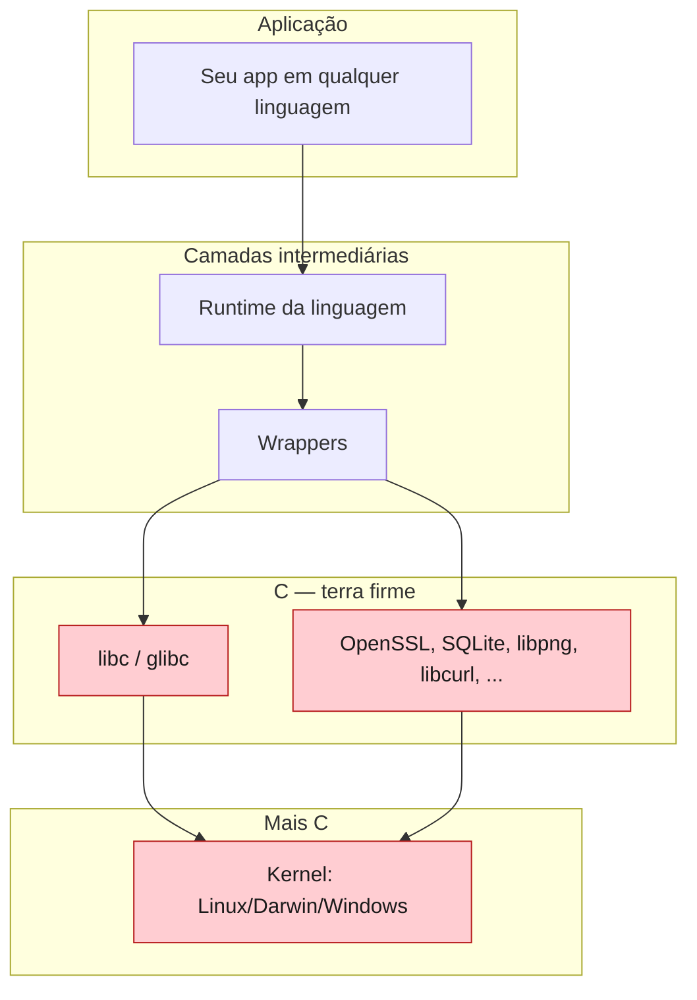
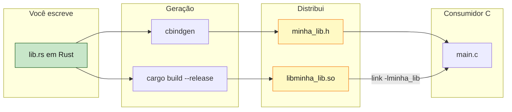
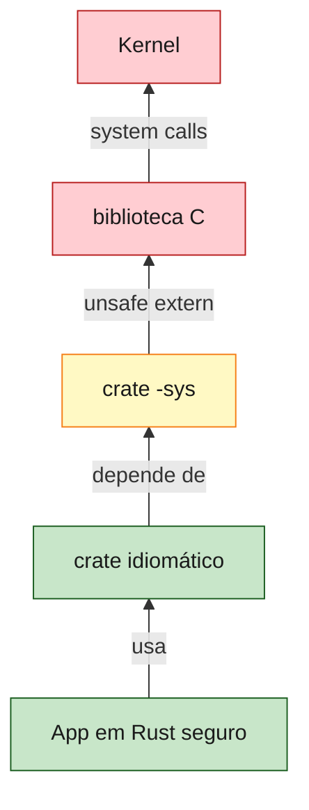

<a id="capitulo-37"></a>
# Capítulo 37: FFI — Falando Com C

> *"Lingua franca não é uma linguagem que todos amam. É a linguagem que todos foram obrigados a aprender."*
> — Provérbio adaptado

> *"C is not a great language. C is the language that we have. Every other language eventually has to talk to it, because everything important is written in it or near it."*
> — Bryan Cantrill

## 37.1 Por Que Toda Linguagem Termina em C

Há um fato incômodo sobre programação de sistemas que raramente se diz em voz alta: praticamente todo software que você usa hoje *eventualmente termina em C*. O kernel do Linux é C. O kernel do macOS é C com C++. O kernel do Windows é C. `glibc` é C. OpenSSL é C. SQLite é C. O Python de referência (CPython) é C. O V8 é C++. O Postgres é C. Redis é C. Nginx é C.

Quando você escreve TypeScript em Node, seu código é interpretado por V8 (C++) que chama libuv (C) que chama syscalls do kernel (C). Quando escreve Python, é o mesmo caminho com camadas a mais. Quando escreve Java, a JVM é C++ chamando libc é C chamando kernel é C.

C não venceu por ser bonito. Venceu por ter chegado primeiro em Unix, por ter sido escolhido como a linguagem do POSIX, e por ter um ABI — Application Binary Interface — extremamente simples. Função em C é "passe argumentos no registrador conforme a convenção, salte para o endereço, leia o retorno do registrador". Não há vtables, não há GC barrier, não há boxing. Esse minimalismo de runtime é o motivo pelo qual *todas* as outras linguagens conseguem chamar C, e o motivo pelo qual quase nenhuma consegue chamar diretamente outras linguagens com runtimes ricos.



Rust, por design, *abraçou* essa realidade. O FFI de Rust com C é tão limpo que crates como `libc`, `openssl-sys`, `pq-sys` permitem usar bibliotecas C diretamente em Rust com overhead exatamente zero — não há marshaling, não há cópia de buffer, não há bridge layer. Uma `extern "C" fn` em Rust gera o mesmo código de máquina que uma função em C. A única coisa que muda é que o compilador Rust te força a admitir que está atravessando a fronteira, via `unsafe`.

Este capítulo é sobre como atravessar essa fronteira sem se perder no caminho.

## 37.2 Importando: `extern "C" { ... }`

A operação mais comum é *chamar* uma função C de Rust. Para isso, declara-se uma assinatura em Rust dentro de um bloco `extern "C"`:

```rust
unsafe extern "C" {
    fn abs(input: i32) -> i32;
    fn sqrt(input: f64) -> f64;
    fn strlen(s: *const i8) -> usize;
}

fn main() {
    let n = unsafe { abs(-42) };
    let r = unsafe { sqrt(2.0) };
    println!("{} {}", n, r);
}
```

Três coisas merecem atenção. Primeiro: o `extern "C"` especifica a *calling convention*. Em x86-64 Linux/macOS, isso é o System V AMD64 ABI; em Windows, é o Microsoft x64. O Rust suporta outras (`extern "system"`, `extern "stdcall"`, `extern "aapcs"` para ARM), mas `"C"` é a default universal.

Segundo: o bloco é `unsafe extern "C"` em Rust 2024 (e era `extern "C"` em edições anteriores, com a chamada exigindo `unsafe`). Esse `unsafe` está dizendo: *não tenho como verificar se a função do outro lado realmente existe, nem se a assinatura que você declarou bate com a real*. Se você declarar `fn sqrt(input: f64) -> f64` mas a função real for `fn sqrt(input: f32) -> f32`, o programa compila e roda, e você lê lixo. UB.

Terceiro: os tipos importados. `i32`, `f64`, `*const i8`, `usize` — esses são tipos Rust mas com layout binário compatível com C. `i32` é `int32_t`. `f64` é `double`. `*const i8` é `const char*`. `usize` é `size_t`. Há uma tabela de correspondência canônica via o crate `libc`, que define apelidos como `c_int`, `c_double`, `c_char` para evitar bugs sutis em plataformas onde, por exemplo, `int` é 16 bits.

```rust
use std::ffi::c_int;
use std::ffi::c_double;
use std::ffi::c_char;

unsafe extern "C" {
    fn abs(input: c_int) -> c_int;
    fn sqrt(input: c_double) -> c_double;
    fn strlen(s: *const c_char) -> usize;
}
```

Em código de produção, *sempre* prefira os apelidos `c_*`. Em sistemas reais, `c_char` pode ser `i8` ou `u8` dependendo da plataforma (AArch64 e PowerPC fazem-no `u8` por default). Hardcodar `i8` te dará compilação verde no laptop e bug em produção quando alguém tentar rodar no Raspberry Pi.

## 37.3 Exportando: `extern "C" fn` e `#[no_mangle]`

A operação inversa — *expor* uma função Rust para que C (ou Python, ou Node) a chame — usa duas anotações:

```rust
#[unsafe(no_mangle)]
pub extern "C" fn dobrar(x: i32) -> i32 {
    x * 2
}
```

`extern "C"` na assinatura faz com que a função use a calling convention C. `#[no_mangle]` (em Rust 2024, `#[unsafe(no_mangle)]`) instrui o compilador a *não* aplicar name mangling — preservar o nome `dobrar` no símbolo do binário, em vez de gerar algo como `_ZN6mycrate6dobrar17h8a3f...`.

Por que mangling existe? Porque Rust suporta sobrecarga via traits, generics monomorfizados, módulos com nomes iguais. O compilador inventa nomes únicos para cada instância. Para FFI, você precisa de um nome estável e previsível, então desabilita.

O lado C verá:

```c
// header.h
extern int dobrar(int x);

// usuario.c
#include "header.h"
int main() {
    return dobrar(21); // chama Rust, recebe 42
}
```

E só. O linker resolve `dobrar` para a função Rust compilada. A calling convention é compatível. Não há marshaling de argumentos, não há boxing de retorno. *Zero overhead*. Essa é a diferença entre FFI em Rust e FFI em linguagens com runtime gordo: em Java, em Go, em Python, chamar C custa. Em Rust, chamar C é como chamar qualquer outra função, exceto que o compilador te lembra que é unsafe.

## 37.4 Structs Cruzando a Fronteira: `#[repr(C)]`

Funções são fáceis. Structs são onde mora a complexidade.

Considere um struct Rust:

```rust
struct Ponto {
    x: f64,
    y: f64,
}
```

O compilador Rust é livre para reorganizar os campos. Pode colocar `y` antes de `x`, pode adicionar padding entre eles, pode reordenar baseado em otimizações de layout. Em C, um struct equivalente:

```c
struct Ponto {
    double x;
    double y;
};
```

tem layout *exatamente especificado*: `x` no offset 0, `y` no offset 8, total 16 bytes (em ABIs comuns). Se você passar um `Ponto` Rust para uma função que espera `Ponto` C, e o Rust reorganizou os campos, *você passou lixo* — tipo bate, semântica não.

A solução é `#[repr(C)]`:

```rust
#[repr(C)]
pub struct Ponto {
    pub x: f64,
    pub y: f64,
}
```

Esse atributo instrui o compilador a usar o layout de C: campos na ordem declarada, padding conforme regras de alinhamento de C. Agora o struct Rust é binariamente intercambiável com o struct C.

Há outras variantes:

```rust
#[repr(C)]              // layout de C
#[repr(transparent)]    // mesmo layout do único campo (newtype zero-cost)
#[repr(u8)] enum E {}   // enum com tag de 1 byte
#[repr(packed)]         // sem padding (cuidado com unaligned access)
```

`#[repr(transparent)]` merece destaque. Ele permite escrever wrappers de tipo *sem* custo de layout:

```rust
#[repr(transparent)]
pub struct UserId(pub u64);

// UserId tem exatamente o mesmo layout que u64.
// Pode ser passado via FFI como se fosse u64.
```

Esse é o padrão de "newtype para FFI": você ganha distinção de tipo em Rust (`UserId` ≠ `PostId`), mas paga zero em layout. Isso é impossível de fazer em C — em C, `typedef uint64_t UserId;` é apenas um apelido, sem distinção de tipo.

## 37.5 Strings: O Pesadelo da Fronteira

Se há um tópico em FFI Rust↔C que produz mais bugs que qualquer outro, é strings. O motivo é que Rust e C têm modelos *fundamentalmente diferentes*:

| Aspecto | Rust `String` / `&str` | C `char*` |
|---|---|---|
| Encoding | UTF-8 garantido | Bytes, encoding implícito |
| Tamanho | Conhecido (ptr + len) | Determinado por busca de `\0` |
| Conteúdo | Não pode conter `\0` interno? Pode! | Não pode conter `\0` interno |
| Ownership | Rastreado pelo borrow checker | Convencional, manual |

Cruzar entre os dois mundos exige tipos intermediários: `CString` e `CStr`.

```rust
use std::ffi::{CString, CStr};
use std::os::raw::c_char;

unsafe extern "C" {
    fn strlen(s: *const c_char) -> usize;
    fn puts(s: *const c_char) -> i32;
}

fn main() {
    // De Rust para C: CString aloca uma cópia null-terminated.
    let s = CString::new("Olá, mundo").unwrap();
    let len = unsafe { strlen(s.as_ptr()) };
    println!("len = {}", len);
    unsafe { puts(s.as_ptr()); }

    // De C para Rust: CStr empresta sem alocar.
    unsafe extern "C" {
        fn getenv(name: *const c_char) -> *const c_char;
    }
    let key = CString::new("HOME").unwrap();
    let raw = unsafe { getenv(key.as_ptr()) };
    if !raw.is_null() {
        let cstr = unsafe { CStr::from_ptr(raw) };
        match cstr.to_str() {
            Ok(s)  => println!("HOME = {}", s),
            Err(_) => println!("HOME não é UTF-8 válido"),
        }
    }
}
```

Note três sutilezas críticas. Primeira: `CString::new` falha (retorna `Err`) se a string Rust contiver `\0` interno. Isso porque do outro lado da fronteira, C terminaria a string no primeiro `\0` e perderia o resto. O `unwrap()` ali é uma assertion: *eu garanto que não tem `\0`*. Em código de produção, trate o erro.

Segunda: `s.as_ptr()` retorna `*const c_char` válido *enquanto `s` viver*. Se você fizer `let p = CString::new("x").unwrap().as_ptr();` e usar `p`, você criou um dangling pointer — o `CString` foi droppado no fim da expressão, e `p` aponta para memória liberada. UB clássico, e o borrow checker não pega esse caso porque você está em raw pointer territory.

Terceira: `CStr::from_ptr(raw)` *empresta* — ele não copia. O `CStr` resultante tem um lifetime amarrado a... nada visível. Por isso é `unsafe`: você está prometendo que o ponteiro `raw` permanecerá válido enquanto o `CStr` existir. Se a biblioteca C invalidar aquele buffer entre a criação do `CStr` e o uso, UB.

Compare com Go:

```go
// Go via cgo
import "C"
import "unsafe"

func main() {
    s := C.CString("Olá")
    defer C.free(unsafe.Pointer(s))
    C.puts(s)
}
```

Visualmente parecido, mas com pegadinhas diferentes. `C.CString` em Go aloca via `malloc` e retorna `*C.char`. Você é responsável pelo `free` (daí o `defer`). E mais grave: ir e voltar entre Go e C em cgo é *caro* — cada chamada cgo custa centenas de nanosegundos por causa de mudança de stack (Go tem stacks crescíveis pequenas; C precisa de stack normal, então cgo precisa fazer um switch). Em Rust, chamada de função extern "C" é zero-overhead; em Go, é tão cara que existe a regra "minimize cgo calls" como mantra.

## 37.6 Lifetimes em FFI: Geralmente `'static` ou Manual

O sistema de lifetimes de Rust é a maior conquista do compilador na fronteira *interna* da linguagem. Mas atravessar para C, lifetimes basicamente desaparecem — porque o lado C não tem como modelá-los.

Há três estratégias:

**1.  `'static`:** quando o ponteiro vem de um string literal C, ou de uma constante global, ele vive para sempre.

```rust
unsafe extern "C" {
    fn programa_nome() -> *const c_char; // retorna ponteiro pra string global
}

let nome: &'static CStr = unsafe { CStr::from_ptr(programa_nome()) };
```

**2.  Lifetime amarrado a um owner Rust:** quando Rust possui o buffer e empresta para C.

```rust
fn imprime(s: &str) {
    let cs = CString::new(s).unwrap();
    unsafe { puts(cs.as_ptr()); }
    // cs é droppado aqui, depois do retorno de puts
}
```

**3.  Manual via convenção:** quando C aloca, Rust usa, e alguém precisa liberar. Geralmente o crate FFI documenta: "chame `lib_free(ptr)` quando terminar". Aqui não há lifetime — há um RAII manual via `Drop`:

```rust
pub struct LibObject(*mut c_void);

impl Drop for LibObject {
    fn drop(&mut self) {
        unsafe { lib_free(self.0); }
    }
}

unsafe extern "C" {
    fn lib_create() -> *mut c_void;
    fn lib_free(p: *mut c_void);
}

impl LibObject {
    pub fn new() -> Self {
        let p = unsafe { lib_create() };
        assert!(!p.is_null());
        LibObject(p)
    }
}
```

Esse padrão — *wrap em struct Rust, implementa Drop com a função de cleanup C* — é o coração de quase todo crate `*-sys` no ecossistema. `openssl-sys`, `pq-sys`, `sdl2-sys` fazem exatamente isso. O usuário do crate vê uma API Rust idiomática com RAII; internamente, há ponteiros C sendo gerenciados.

## 37.7 Geração Automática: `bindgen` e `cbindgen`

Escrever as declarações `extern "C" { ... }` à mão para uma biblioteca C de tamanho real é trabalho mecânico, repetitivo, e propenso a erros. Felizmente, ninguém faz isso. Existem duas ferramentas canônicas, espelhadas:

**`bindgen`:** lê um header `.h` de C e gera código Rust com as declarações `extern "C"` e `#[repr(C)] struct`s. É o que `*-sys` crates usam para wrap de bibliotecas C grandes.

```rust
// build.rs (rodado pelo Cargo na compilação)
fn main() {
    println!("cargo:rustc-link-lib=foo");

    let bindings = bindgen::Builder::default()
        .header("wrapper.h")
        .parse_callbacks(Box::new(bindgen::CargoCallbacks::new()))
        .generate()
        .expect("bindgen falhou");

    let out_path = std::path::PathBuf::from(std::env::var("OUT_DIR").unwrap());
    bindings
        .write_to_file(out_path.join("bindings.rs"))
        .expect("escrita falhou");
}
```

```rust
// src/lib.rs
include!(concat!(env!("OUT_DIR"), "/bindings.rs"));
```

`bindgen` lida com macros, structs aninhadas, tipos opacos, callbacks. O resultado nunca é uma API Rust idiomática — é um espelho fiel da API C. Por convenção, crates `foo-sys` expõem o resultado de `bindgen`, e crates `foo` (sem o sufixo) expõem uma API Rust segura por cima.

**`cbindgen`:** o inverso. Lê código Rust com `extern "C" fn` e `#[repr(C)] struct` e gera um header `.h` C. É o que você usa quando *publica* uma biblioteca Rust para ser consumida de C.

```toml
# cbindgen.toml
language = "C"
[export]
prefix = "minha_lib_"
```

```bash
cbindgen --config cbindgen.toml --crate minha_lib --output minha_lib.h
```

O resultado é um `.h` que C consome diretamente. Combinado com `crate-type = ["cdylib"]` no `Cargo.toml`, você produz uma biblioteca Rust que do ponto de vista de C é indistinguível de uma biblioteca C nativa — exceto por ser melhor.



## 37.8 Para Além de C: Python, Node, WASM

A fronteira Rust↔C é o caso geral, mas o ecossistema construiu camadas elegantes para outras linguagens, todas baseadas no mesmo mecanismo.

**Python via PyO3:** PyO3 é um crate que expõe Rust como módulo Python nativo. Por baixo, ele usa CPython (que é C) e gera as funções `extern "C"` necessárias para a Python C API. Você escreve:

```rust
use pyo3::prelude::*;

#[pyfunction]
fn soma(a: i64, b: i64) -> i64 { a + b }

#[pymodule]
fn meu_modulo(m: &Bound<'_, PyModule>) -> PyResult<()> {
    m.add_function(wrap_pyfunction!(soma, m)?)?;
    Ok(())
}
```

Compila-se com `maturin build` (ferramenta companion), e o resultado é um `.whl` instalável via pip. `import meu_modulo; meu_modulo.soma(1, 2)` em Python chama código Rust com overhead da Python C API — mas zero custo de marshaling além disso. Projetos como `pydantic-core`, `polars`, `cryptography` reescreveram núcleos quentes em Rust via PyO3 e ganharam ordens de grandeza em performance.

**Node via napi-rs:** análogo a PyO3, mas para N-API do Node.js. Macros `#[napi]` geram bindings, `napi build` produz um `.node` consumível por `require()`. Empresas como Netflix, Vercel (Turbopack), Discord usam Rust via napi-rs para ganhos de performance em hot paths.

**WASM:** o caso especial. Rust tem suporte first-class para `wasm32-unknown-unknown` (sem sistema operacional) e `wasm32-wasi` (com WASI). Crates como `wasm-bindgen` geram bindings para JavaScript que rodam no navegador ou em runtimes server-side (Cloudflare Workers, Fastly Compute@Edge, Wasmtime). Essa será a história do próximo capítulo.

## 37.9 Por Que Rust+FFI Sai Tão Limpo

Voltando ao começo. O título prometia "por que Rust+FFI é tão limpo". Tendo passado pelo mecanismo, podemos finalmente nomear as razões.

Primeira: **Rust não tem runtime gordo**. Não há GC, não há scheduler invisível, não há boxing automático. Código Rust compilado é, no metal, indistinguível de código C compilado. Isso significa que a fronteira FFI é *uma chamada de função*, não uma ponte entre dois mundos.

Segunda: **`#[repr(C)]` é explícito mas opt-in**. Você marca os tipos que precisam ser binariamente compatíveis. O resto fica livre para o compilador otimizar. Essa é a diferença com C — em C, *tudo* tem layout fixo, então o compilador tem menos liberdade. Em Rust, você escolhe onde abrir mão dessa liberdade.

Terceira: **`unsafe` é um marcador de auditoria**. Toda chamada FFI passa por `unsafe`. Não porque chamar C seja inerentemente mais perigoso que outras operações — mas porque o compilador não pode verificar a correção. Marcar é honestidade.

Quarta: **o ecossistema construiu camadas seguras**. Você raramente escreve um wrapper FFI do zero. Use `libc` para libc. Use `openssl` (não `openssl-sys`) para OpenSSL. Use `rusqlite` (não `libsqlite3-sys`) para SQLite. As camadas idiomáticas existem, e por baixo delas há o `*-sys` crate cru que fez `bindgen`.

Quinta — e talvez a mais subestimada: **o `cargo` faz a build**. Em C, integrar uma biblioteca de terceiros envolve `pkg-config`, `Makefile`, `CMakeLists.txt`, `autoconf`, e prece. Em Rust, é uma linha em `Cargo.toml`. O `build.rs` faz o linking, faz o `bindgen`, faz a busca de header. Adicionar `openssl = "0.10"` no `Cargo.toml` e usar SSL em Rust funciona em Linux, macOS, Windows, com a mesma compilação. Em C, isso é um sprint de configuração de CI.

Compare com a alternativa em outras linguagens:

| Linguagem | FFI nativo | Custo por chamada | Tooling |
|---|---|---|---|
| Rust | `extern "C"` + `unsafe` | ~0 (igual a chamada interna) | `bindgen`, `cbindgen`, `cargo` |
| Go | cgo | Centenas de ns (stack switch) | manual, `go generate` |
| C | nativo | ~0 | `pkg-config`, `make`, manual |
| TypeScript/Node | N-API | ~10s de ns por chamada | `node-gyp`, `napi-rs` (que usa Rust) |
| Python | C extension API | ~10s de ns por chamada | `setuptools`, `cffi`, ou PyO3 (Rust) |
| Java | JNI | Microsegundos (sério) | `javah`, hand-written |

O TypeScript via Node N-API e o Python via C API têm overhead significativo. Java via JNI é tão lento que existem livros sobre como evitá-lo. Go via cgo é controverso a ponto de existir o ditado "cgo is not Go" (Rob Pike). Rust é, junto com C++, a única linguagem mainstream onde FFI com C é genuinamente *gratuito*.

Esse é o motivo pelo qual Rust está se infiltrando em todos os ecossistemas. Não como substituto. Como acelerador. Você escreve seu app principal em Python (porque o ecossistema científico vive lá), e quando o profiler aponta um hot path, você reescreve aquele 5% em Rust via PyO3 e ganha 50x. O Python continua mandando — Rust é a forja de baixo.

## 37.10 Considerações Finais

FFI em Rust é, ao mesmo tempo, *trivial* e *perigoso*. Trivial no mecanismo: declarar uma função extern, marcar um struct, usar `unsafe` para chamar. Perigoso na semântica: do outro lado da fronteira, todas as garantias do compilador desaparecem. A função C que você está chamando pode ter buffer overflows, pode usar use-after-free, pode ter race conditions. Você herda a insegurança da biblioteca C que está consumindo.

A boa prática, então, é encapsular. O *padrão `*-sys` + crate seguro* existe exatamente por isso. O `*-sys` expõe o cru — todas as funções `unsafe`, todos os structs `#[repr(C)]`, todos os ponteiros. Acima dele, você constrói a camada idiomática que aceita `&str` (não `*const c_char`), retorna `Result<T, Error>` (não código de erro inteiro), implementa `Drop` para cleanup, e que do ponto de vista do usuário Rust *parece um crate Rust normal*.



Esse modelo de camadas é o que torna possível a Mozilla escrever Servo (motor de browser) em Rust, a Cloudflare escrever Pingora (proxy HTTP) em Rust, a AWS escrever Firecracker (microVM) em Rust — todos consumindo bibliotecas C de baixo nível, sem replicar a história de buffer overflows que essas mesmas bibliotecas tiveram em C++.

A fronteira existe. Atravessá-la é um ato consciente, marcado com `unsafe`, encapsulado em uma camada segura, auditado em revisão. Essa é a engenharia de fronteiras de Rust — e é por isso que Rust é, talvez, a melhor linguagem que existe hoje para *substituir incrementalmente* C em sistemas críticos.

No próximo capítulo: o que acontece quando o que você quer pinar não pode mover. Pinning, async state machines, e por que Rust precisou inventar uma das primitivas mais sofisticadas de seu type system.

---

> *"FFI é onde Rust admite que o mundo é maior que ele. E é onde, paradoxalmente, ele se mostra mais útil — não como ilha, mas como ponte."*

[← Anterior: Capítulo 36 — Unsafe](ch36-unsafe.md) | [Próximo: Capítulo 38 — Pinning →](ch38-pinning.md)
