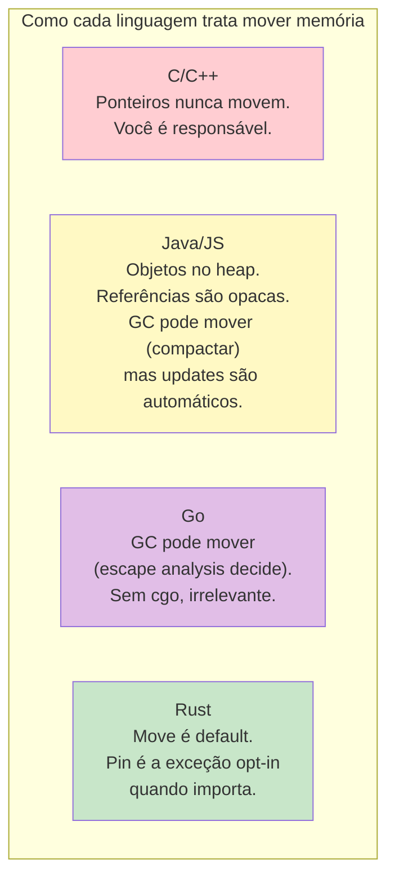

<a id="capitulo-38"></a>
# Capítulo 38: Pinning — A Memória Que Não Move

> *"In Rust, values move. Until they can't."*
> — withoutboats

> *"Pin é a admissão honesta de uma exceção: nem todo valor tolera ser realocado."*

## 38.1 O Problema Que Pin Resolve

Em Rust, valores se movem livremente. Atribuir, retornar, passar por valor — em cada uma dessas operações o compilador pode emitir um `memcpy` que copia bits de um endereço de stack para outro. Para a esmagadora maioria dos tipos, isso é seguro: a `String` continua válida, o `Vec` continua apontando para a mesma heap, o `u64` é trivialmente copiável.

Mas há uma classe de tipos para os quais mover é catástrofe: **estruturas auto-referenciais** — aquelas que mantêm um ponteiro interno apontando para outro campo da própria estrutura.

```rust
struct AutoRef {
    valor: String,
    ponteiro: *const String, // aponta pra `valor` acima
}
```

Se você mover esse `AutoRef`, o campo `valor` vai pra um novo endereço. Mas `ponteiro` ainda guarda o endereço antigo. Resultado: ponteiro pendurado (*dangling*) — exatamente o que Rust foi projetado para impedir.

## 38.2 Por Que Async Precisa Disso

Em qualquer outra linguagem, o problema acima seria acadêmico. Em Rust, ele é cotidiano — porque é assim que `async` funciona.

Quando você escreve:

```rust
async fn ler() -> String {
    let buf = String::new();
    let leitor = &buf;
    socket.read_to_string(leitor).await;
    buf
}
```

O compilador gera uma máquina de estados (`Future`) que **guarda `buf` e `leitor` no mesmo struct**. `leitor` aponta para `buf`. Se essa máquina de estados for movida no meio da execução (por exemplo, ao ser empurrada para a heap), o ponteiro `leitor` aponta para nada.

Esse caso é a razão pela qual `Pin` foi inventado.

## 38.3 A Garantia de Pin

`Pin<P>` é um wrapper sobre um ponteiro `P` (geralmente `Box<T>`, `&mut T`, ou `&T`) que oferece uma garantia: **enquanto este `Pin` existir, o valor apontado por ele não será movido**.

```rust
use std::pin::Pin;

let valor = Box::pin(MeuFuture::new()); // Pin<Box<MeuFuture>>
// valor.as_mut() → Pin<&mut MeuFuture>
// MeuFuture nunca será movido enquanto este Pin existir.
```

Pin não é mágica em runtime: é uma promessa em compile-time, sustentada por uma API que se recusa a expor `&mut T` (de onde você poderia chamar `mem::swap` para mover).

## 38.4 Unpin: Os Tipos Que Não Se Importam

A maioria dos tipos pode ser movida livremente mesmo dentro de um `Pin`. Esses tipos implementam `Unpin` — uma marker trait auto-implementada para todos os tipos que não têm campos auto-referenciais.

```rust
impl Unpin for u32 {}        // automático
impl Unpin for String {}     // automático
impl Unpin for Vec<T> {}     // automático
// Future gerada por async fn: NÃO é Unpin.
```

Para tipos `Unpin`, `Pin<&mut T>` é equivalente a `&mut T` — não há restrição prática. Para tipos `!Unpin` (como state machines de async), `Pin<&mut T>` é o que ativa as garantias.

## 38.5 Como Construir um Pin

Há quatro caminhos comuns:

```rust
use std::pin::{Pin, pin};

// 1. Box::pin — heap, mais comum
let p1: Pin<Box<MeuTipo>> = Box::pin(MeuTipo::new());

// 2. pin! macro — stack, sem alocação (Rust 1.68+)
let p2: Pin<&mut MeuTipo> = pin!(MeuTipo::new());

// 3. Pin::new — apenas para tipos Unpin
let mut x = 42;
let p3: Pin<&mut u32> = Pin::new(&mut x);

// 4. unsafe { Pin::new_unchecked(...) } — você prova a invariante
```

A macro `pin!` é a forma mais idiomática para `Future`s locais; `Box::pin` quando o futuro precisa atravessar limites async.

## 38.6 O Contrato Inquebrável

Uma vez pinned, um valor `!Unpin` jamais pode ser movido. Concretamente:

| Operação proibida | Por quê |
|---|---|
| `mem::swap(&mut *pin, &mut outro)` | Move o conteúdo |
| `mem::replace(&mut *pin, novo)` | Move o conteúdo |
| Reatribuição direta | Move |
| `Drop::drop` deve rodar antes da memória ser reaproveitada | Sem isso, ponteiros internos vazariam |

Esta última regra — chamada **drop guarantee** — é por que `Pin` é cuidadoso com recursos: garante que o `Drop` rode *na mesma localização* onde o valor viveu.

## 38.7 Projeção: pin-project

O problema prático: como acessar campos de um struct pinned? Se você tem `Pin<&mut Outer>`, como obtém `Pin<&mut Outer.campo>`?

Manualmente isso requer `unsafe`. As crates `pin-project` e `pin-project-lite` automatizam:

```rust
use pin_project_lite::pin_project;

pin_project! {
    struct MeuFuture<F> {
        #[pin]
        inner: F,        // este precisa de Pin
        contador: usize, // este não — Unpin
    }
}

impl<F: Future> Future for MeuFuture<F> {
    type Output = F::Output;
    fn poll(self: Pin<&mut Self>, cx: &mut Context) -> Poll<Self::Output> {
        let this = self.project();   // gera Pin<&mut F> e &mut usize
        *this.contador += 1;
        this.inner.poll(cx)
    }
}
```

Isso é boilerplate puro em qualquer lib que escreva combinadores de `Future` ou `Stream`.

## 38.8 Comparação Cross-Language



C jamais tem o problema de pin: ponteiros são endereços fixos. Java/JS resolvem por referência indireta (handles). Rust é a única que escolheu *mover por default* e teve que inventar um mecanismo separado para os casos em que isso quebra.

## 38.9 Quando Você Vai Precisar Pensar Em Pin

Se você só consome `async`/`await` e usa Tokio, pode passar uma carreira sem digitar `Pin` explicitamente. Vai precisar quando:

- **Implementar `Future` manualmente**: o método `poll(self: Pin<&mut Self>, ...)` é o ponto de entrada.
- **Implementar `Stream` ou `Sink`** em uma lib.
- **Trabalhar com state machines auto-referenciais** (parsers em geradores, intrusive linked lists).
- **FFI com APIs C que armazenam ponteiros** (ex: callbacks que voltam o mesmo objeto).

Para o resto, `Pin` opera invisivelmente — é a infraestrutura silenciosa que torna possível `async fn` retornar um `Future` que captura referências locais sem segfault.

## 38.10 O Que Fica

`Pin` é uma das partes menos elegantes de Rust. É frequentemente apontada como evidência de que async em Rust foi enxertado tarde. Há propostas para suceder Pin com algo mais limpo (move-by-default-with-pinning-by-default, never-move types, linear types), mas nenhuma estabilizou.

Por enquanto, conviver com `Pin` é parte do contrato. A boa notícia: a maioria dos programadores Rust vive feliz sem nunca precisar dele. Quando precisar, você saberá o porquê — e este capítulo será sua bússola.

---

> *"Pin é o reconhecimento de que mesmo Rust, com toda sua disciplina, herda do hardware uma realidade simples: endereços de memória importam, e nem tudo é tão portátil quanto parecemos."*

[← Capítulo 37 — FFI](ch37-ffi.md) | [Próximo: Capítulo 39 — Macros Declarativas →](../part-14-macros/ch39-macros-declarativas.md)
