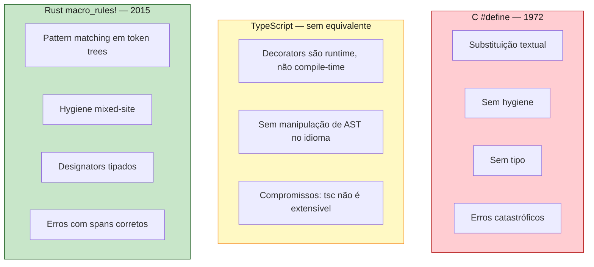

<a id="capitulo-39"></a>
# Capítulo 39: Macros Declarativas — `macro_rules!`

> *"A program that has not been written cannot have bugs."*
> — folclore de compiladores

> *"Macros são a confissão de que sua linguagem não é expressiva o suficiente — e a prova de que ela é extensível o suficiente para sobreviver a isso."*
> — anônimo, lista de discussão de Lisp, anos 80

> *"O texto-substituição é a forma mais primitiva de meta-programação. É também a forma mais perigosa."*
> — comentário no código-fonte do GCC

## 39.1 O Problema que Macros Resolvem

Toda linguagem chega, mais cedo ou mais tarde, num momento desconfortável: existe um padrão de código que aparece dezenas de vezes, idêntico em estrutura, variável apenas em alguns nomes ou tipos, e **a linguagem não consegue abstrair**. Funções não servem porque o que varia é a *forma sintática*, não o valor. Genéricos não servem porque o que varia é a *quantidade de argumentos*, não o tipo.

Em C, isso aparece quando você quer um log com nome de arquivo e linha:

```c
// C: precisa do __FILE__ e __LINE__ no ponto de chamada
// Função não serve — ela teria o __FILE__ dela própria
#define LOG(msg) fprintf(stderr, "[%s:%d] %s\n", __FILE__, __LINE__, msg)
```

Em TypeScript, aparece quando você quer um literal de array com push automático e tipo inferido a partir de N argumentos heterogêneos. Você não consegue. Escreve `[a, b, c]` e termina o assunto.

Em Rust, aparece quando você escreve isto:

```rust
let v: Vec<i32> = Vec::new();
let v = {
    let mut v = Vec::new();
    v.push(1);
    v.push(2);
    v.push(3);
    v
};
```

Repetir isso é insuportável. Funções não resolvem — uma função não recebe número arbitrário de argumentos com tipos uniformes em Rust (não há varargs). Genéricos não resolvem — eles parametrizam tipos, não *contam* argumentos. A solução é uma macro:

```rust
let v = vec![1, 2, 3];
```

`vec!` não é função. Não está na biblioteca padrão como `fn`. É uma **macro declarativa** — um pedaço de código que opera não sobre valores, mas sobre **árvores de tokens** antes da compilação propriamente dita.

Este capítulo é sobre `macro_rules!`. O capítulo seguinte é sobre o irmão mais poderoso e mais perigoso: macros procedurais. Antes de qualquer coisa, é preciso entender por que macros em Rust são radicalmente diferentes do que macros foram em C.

## 39.2 O Pecado Capital de C: `#define`

C tem macros desde 1972. São implementadas pelo **pré-processador** — um programa que roda *antes* do compilador propriamente dito, fazendo substituição textual cega.

```c
#define MAX(a, b) ((a) > (b) ? (a) : (b))

int x = MAX(3, 5);  // expande para: int x = ((3) > (5) ? (3) : (5));
```

Funciona. Até não funcionar:

```c
#define SQUARE(x) x * x

int y = SQUARE(2 + 3);  // expande para: int y = 2 + 3 * 2 + 3;
                         // resultado: 11, não 25
```

A primeira correção é parêntese:

```c
#define SQUARE(x) ((x) * (x))
int y = SQUARE(2 + 3);  // expande para: int y = ((2 + 3) * (2 + 3)); → 25 ✓
```

Mas considere isto:

```c
int i = 5;
int y = SQUARE(i++);  // expande para: int y = ((i++) * (i++));
                       // i é incrementado DUAS vezes, ordem de avaliação é UB
```

O pré-processador de C tem três pecados estruturais, herdados de uma época em que essa era a única ferramenta de meta-programação imaginável:

1. **Substituição textual.** O pré-processador não vê expressões, vê *strings*. Ele não sabe o que é precedência. Não sabe o que é efeito colateral. Não sabe o que é tipo.
2. **Sem hygiene.** Se a macro define um símbolo `tmp`, e o código que chama a macro também tem um `tmp`, eles colidem. Silenciosamente.
3. **Erros catastróficos.** Quando a macro está errada, o erro aparece na linha *expandida*, com identificadores que o programador nunca escreveu, mencionando colunas que não existem no arquivo fonte.

Um exemplo clássico do problema 2:

```c
#define SWAP(a, b) { int tmp = a; a = b; b = tmp; }

int tmp = 10;
int x = 1;
SWAP(tmp, x);  // expande para: { int tmp = tmp; tmp = x; x = tmp; }
                //               ^^^^^^^^^^^^^^^^ — qual tmp é qual?
```

C++ herdou `#define` e tentou compensar com `templates`, `constexpr`, `consteval`. O preprocessor sobreviveu por inércia e por compatibilidade. Linus Torvalds, em 2004, na lista do kernel, escreveu:

> *"Macros estão para o C como ponteiros para void: poderosos, indispensáveis, e a primeira coisa que você ensina seu sucessor a temer."*

TypeScript não tem nada parecido com `#define`. Decorators (`@Component`, `@Injectable`) parecem macros mas são outra coisa — são **funções de runtime** que recebem a referência da classe e a modificam. Não geram código antes da compilação. Não fazem pattern-matching em sintaxe. Vamos voltar a essa diferença no capítulo 40.

Rust resolveu o problema de forma fundamentalmente diferente. Em Rust, macros operam sobre **árvores de tokens já parseadas**, com **hygiene** garantida pelo compilador, e os erros aparecem com **spans corretos** apontando para o código fonte original.

## 39.3 A Anatomia de uma Macro

Uma macro declarativa em Rust é declarada com `macro_rules!` e tem a seguinte forma:

```rust
macro_rules! NOME {
    (PADRAO_1) => { EXPANSAO_1 };
    (PADRAO_2) => { EXPANSAO_2 };
    // ...
}
```

Cada *braço* é um par padrão-expansão. Quando a macro é invocada, o compilador tenta cada padrão na ordem; o primeiro que casa é expandido. É essencialmente uma `match` que opera sobre **token trees** em vez de valores.

A macro mais simples possível:

```rust
macro_rules! ola {
    () => {
        println!("Olá, mundo!");
    };
}

fn main() {
    ola!();  // expande para: println!("Olá, mundo!");
}
```

Repare: a invocação é `ola!()`, com a exclamação. Em Rust, **toda macro é chamada com `!`**. Isso não é decoração — é uma promessa do compilador para o leitor: *"o que vem aqui não é uma chamada de função; pode expandir para qualquer coisa, inclusive múltiplas linhas, declarações de variáveis, blocos inteiros."*

O `!` é a confissão visível da meta-programação. Em C, `LOG(x)` parece função. Em Rust, `log!(x)` grita "sou macro".

## 39.4 Designators: Tipando Pedaços de Sintaxe

Macros não casam strings. Casam **fragmentos sintáticos tipados**. Os tipos disponíveis chamam-se *designators* (também chamados *fragment specifiers*) e são uma das ideias mais subestimadas de Rust.

```rust
macro_rules! mostra {
    ($e:expr) => {
        println!("{:?}", $e);
    };
}

mostra!(2 + 2);            // expressão: 2 + 2
mostra!(vec![1, 2, 3]);    // expressão: vec![1, 2, 3]
mostra!("texto");          // expressão: "texto"
```

`$e:expr` declara: *"capture um fragmento que seja uma expressão Rust válida e chame ele de `e`."* O compilador parseia a expressão de verdade — não é texto. Se você passar algo que não é expressão, o erro acontece no ponto de invocação, com mensagem clara.

A tabela completa de designators relevantes:

| Designator     | Casa com                                              | Exemplo                          |
|----------------|-------------------------------------------------------|----------------------------------|
| `expr`         | qualquer expressão                                    | `2 + 2`, `f(x)`, `if a { b }`    |
| `ident`        | um identificador                                      | `foo`, `x`, `MeuTipo`            |
| `ty`           | um tipo                                               | `i32`, `Vec<String>`, `&'a str`  |
| `pat`          | um pattern (de `match` ou `let`)                      | `Some(x)`, `(a, b)`, `_`         |
| `stmt`         | uma statement                                         | `let x = 5`, `f();`              |
| `block`        | um bloco delimitado por chaves                        | `{ a; b; c }`                    |
| `item`         | um item (fn, struct, mod, impl)                       | `fn f() {}`                      |
| `path`         | um caminho de namespace                               | `std::vec::Vec`                  |
| `meta`         | conteúdo de atributo                                  | `derive(Debug)`                  |
| `lifetime`     | uma lifetime                                          | `'a`, `'static`                  |
| `literal`      | um literal                                            | `42`, `"hello"`, `true`          |
| `vis`          | qualificador de visibilidade (possivelmente vazio)    | `pub`, `pub(crate)`, ``          |
| `tt`           | uma única *token tree* (átomo ou par delimitado)      | `x`, `(a, b)`, `{ stuff }`       |

`tt` é o coringa: casa com qualquer coisa que seja um token ou um par balanceado de delimitadores. É menos específico, então é menos informativo, mas é o mais flexível e o que se usa quando se precisa "passar adiante" sintaxe que a macro não vai inspecionar internamente.

Exemplo prático com vários designators:

```rust
macro_rules! cria_funcao {
    ($nome:ident, $tipo:ty, $valor:expr) => {
        fn $nome() -> $tipo {
            $valor
        }
    };
}

cria_funcao!(idade, u32, 30);
cria_funcao!(nome, &'static str, "Felipe");

fn main() {
    println!("{} tem {} anos", nome(), idade());
}
```

A macro recebeu três fragmentos — um identificador, um tipo, uma expressão — e gerou duas funções completas. Isso, em C, exigiria três `#define` separados ou uma cadeia de macros que se chamam. Em Rust, uma macro de seis linhas resolve.

## 39.5 Repetition: O Coração de `vec!`

A construção que diferencia macros de funções é a **repetição**. Sintaxe:

```text
$( ... ) SEPARADOR REPETICAO
```

Onde `REPETICAO` é `*` (zero ou mais), `+` (uma ou mais), ou `?` (zero ou uma, sem separador). O `SEPARADOR` é opcional e fica entre as repetições.

A macro `vec!` da biblioteca padrão é, em essência, esta:

```rust
macro_rules! vec {
    ( $( $x:expr ),* ) => {
        {
            let mut temp_vec = Vec::new();
            $(
                temp_vec.push($x);
            )*
            temp_vec
        }
    };
}
```

Vamos dissecar:

- `$( $x:expr ),*` no padrão: *"casa zero ou mais expressões separadas por vírgula; cada uma se chama `x`."*
- `$( temp_vec.push($x); )*` na expansão: *"para cada `x` capturado, emita esta linha."*

Quando você escreve `vec![1, 2, 3]`, o compilador expande para:

```rust
{
    let mut temp_vec = Vec::new();
    temp_vec.push(1);
    temp_vec.push(2);
    temp_vec.push(3);
    temp_vec
}
```

Repare em três coisas:

1. **A macro gera um bloco**, não uma expressão solta. Por isso `let v = vec![1,2,3];` funciona — o bloco avalia para `temp_vec`.
2. **`Vec::new()` é chamado em runtime**, não é mágica do compilador. A macro só *escreveu o código* que faz isso.
3. **`temp_vec` não vaza para fora.** Se você tem um `temp_vec` no escopo onde chama `vec!`, ele não é afetado. Isso é hygiene, e é o assunto da próxima seção.

Repetição aninhada também é possível:

```rust
macro_rules! matriz {
    ( $( [ $( $x:expr ),* ] ),* ) => {
        vec![
            $(
                vec![ $( $x ),* ]
            ),*
        ]
    };
}

let m = matriz!([1, 2, 3], [4, 5, 6], [7, 8, 9]);
// m: Vec<Vec<i32>> com 3 linhas e 3 colunas
```

A regra é: **o nível de repetição na expansão deve casar com o nível de repetição no padrão**. Se você capturou `$x` dentro de dois `$( ... )*` aninhados, precisa expandir dentro de dois também.

## 39.6 Hygiene: Por que `vec!` Não Quebra Seu Código

Considere a macro `vec!` simplificada e este uso aparentemente capcioso:

```rust
let temp_vec = "minha string";
let v = vec![1, 2, 3];
println!("{}", temp_vec);  // o que imprime?
```

Em C, com substituição textual, o `temp_vec` da macro **destruiria** o `temp_vec` do programador. Em Rust, não. Imprime `"minha string"`. O `temp_vec` introduzido pela macro vive num universo paralelo.

Isso é **hygiene**. A regra é simples mas profunda: **identificadores introduzidos pela macro são distinguidos pelo compilador dos identificadores escritos no código que invoca a macro**. Mesmo que o nome textual seja idêntico, eles têm origens diferentes — internamente, o compilador anexa a cada token uma marca chamada *syntax context* que registra de onde aquele token veio.

```mermaid
graph TB
    Source[Código fonte:<br/>let temp_vec = ...;<br/>vec![1,2,3]]

    subgraph Expansao [Após expansão]
        T1[temp_vec<br/>contexto: usuário]
        T2[temp_vec<br/>contexto: macro vec!]
    end

    Source --> T1
    Source --> T2

    T1 -.->|nomes diferentes<br/>para o compilador| T2

    style T1 fill:#c8e6c9,stroke:#1b5e20,color:#1a1a1a
    style T2 fill:#bbdefb,stroke:#0d47a1,color:#1a1a1a
```

O modelo formal de Rust chama-se **mixed-site hygiene**:

- **Variáveis locais, labels de loop, labels de bloco** são resolvidos no *site de definição* (dentro da macro).
- **Funções, tipos, traits, módulos** são resolvidos no *site de invocação* (onde a macro é chamada).

Isso é o equilíbrio certo na prática. Se variáveis locais resolvessem no site de invocação, voltaríamos para C. Se *tudo* resolvesse no site de definição, a macro não conseguiria chamar nem `println!` sem conhecer todos os imports do chamador.

Um exemplo que mostra a regra:

```rust
let x = 1;

macro_rules! checa {
    () => {
        assert_eq!(x, 1);  // vai usar o x do site de definição
    };
}

fn main() {
    let x = 2;
    checa!();  // ainda assim vê x = 1, do site da definição
}
```

Esse código não compila por outro motivo (na verdade `x` nem está no escopo da definição), mas o ponto é: **a macro não enxerga o `x = 2` do site de invocação para variáveis locais**. Se você quer que a macro use uma variável do chamador, **passe-a como argumento**:

```rust
macro_rules! checa {
    ($var:expr) => {
        assert_eq!($var, 1);
    };
}

fn main() {
    let x = 1;
    checa!(x);  // agora sim, x é capturado como expressão
}
```

Esse contraste com C é a diferença entre meta-programação que ajuda e meta-programação que mata. Em C, `SWAP(tmp, x)` colide com `int tmp` interno. Em Rust, isso não acontece. Ponto.

## 39.7 `#[macro_export]` e o Mistério de `$crate`

Macros em Rust têm um sistema de escopo próprio, diferente do de tipos e funções. Por padrão, uma macro definida num módulo é visível **a partir do ponto de definição em diante, em ordem textual**. Não obedece `pub`. Não é exportada.

Para que uma macro seja usável de fora do crate, é preciso anotá-la com `#[macro_export]`:

```rust
// crate "minha_lib"
#[macro_export]
macro_rules! grita {
    ($s:expr) => {
        println!("{}!!!", $s.to_uppercase());
    };
}
```

Agora `minha_lib::grita!("oi")` funciona em qualquer crate que importe `minha_lib`. A macro vive no **root** do crate, independentemente do módulo onde foi declarada.

Mas há uma armadilha. Suponha que sua macro chame outra função do seu próprio crate:

```rust
// minha_lib/src/lib.rs
pub fn formatar(s: &str) -> String { format!(">>> {}", s) }

#[macro_export]
macro_rules! mostra {
    ($e:expr) => {
        println!("{}", formatar($e));  // ❌ qual formatar?
    };
}
```

Quando o usuário invoca `mostra!("oi")` no crate dele, a expansão fica:

```rust
println!("{}", formatar("oi"));
```

Mas `formatar` não está no escopo do crate do usuário. A macro quebra. Solução: o token mágico `$crate`.

```rust
#[macro_export]
macro_rules! mostra {
    ($e:expr) => {
        println!("{}", $crate::formatar($e));
    };
}
```

`$crate` expande para um caminho que aponta de volta para o crate onde a macro foi definida, seja qual for o nome com que foi importado. É como `__FILE__` em C, mas com semântica correta.

## 39.8 Quando Usar — e Quando Não

Macros declarativas resolvem três classes de problemas que funções não conseguem:

**1. "Variádico" (número arbitrário de argumentos):**

```rust
println!("{} + {} = {}", 1, 2, 3);
vec![1, 2, 3, 4, 5];
```

Rust não tem varargs em funções. Macros são a saída.

**2. Capturar contexto de invocação:**

```rust
panic!("oh não");          // captura file:line implicitamente
dbg!(x);                   // imprime "x = ..." — captura o nome
assert_eq!(a, b);          // mostra a expressão na mensagem de erro
```

`dbg!(x)` precisa saber que a expressão se chama `"x"`. Função não consegue. Macro consegue porque vê o token literal.

**3. DSLs pequenas e estruturadas:**

```rust
// uma linguagem de roteamento
router! {
    GET  "/users"      => list_users,
    POST "/users"      => create_user,
    GET  "/users/:id"  => get_user,
}
```

A macro pode validar a estrutura, gerar handlers, criar enums. Tudo em compile-time.

E há os casos onde **não** se deve usar macro:

| Sintoma                              | Use no lugar          |
|--------------------------------------|-----------------------|
| Quero abstrair lógica de negócio     | função                |
| Quero parametrizar tipo              | genérico              |
| Quero polimorfismo                   | trait                 |
| Quero constantes                     | `const` / `static`    |
| Quero código condicional por target  | `cfg!` / `#[cfg]`     |

A regra de Felipe Ness, depois de anos vendo macros mal usadas em código alheio: **se uma função resolve, use função. Se um genérico resolve, use genérico. Macro é o último recurso — e quando é o recurso certo, é insubstituível.**

## 39.9 As Limitações que Empurram para Procedurais

Macros declarativas têm um teto. Você bate nele cedo:

**1. Não inventam sintaxe nova.** Tudo que a macro recebe precisa ser uma sequência válida de fragmentos Rust (ou uma sequência de `tt` arbitrários, mas balanceados). Não dá para escrever uma macro que aceite `<html><body>...</body></html>` cru, porque `<html>` não é token Rust.

**2. Não introspectam estruturas.** Você não consegue, com `macro_rules!`, escrever uma macro que recebe uma `struct` e gera código baseado nos *nomes dos campos dela*. Você consegue casar `struct Foo { a: i32, b: String }` com `tt`s, mas não consegue extrair "o nome do segundo campo é `b`" de forma utilizável.

**3. Não fazem cálculo arbitrário.** A "execução" de uma macro é pattern-matching e substituição. Não há `if`. Não há loops genéricos (só repetição estrutural). Não há acesso ao sistema de arquivos para ler um schema. Não há rede.

**4. Erros podem ser opacos.** Quando a macro é grande e a invocação está mal formada, a mensagem de erro vira poesia hostil:

```text
error: no rules expected the token `;`
  --> src/main.rs:5:18
   |
5  |     minha_macro!(x;);
   |                  ^ no rules expected this token in macro call
```

O `cargo expand` (ferramenta externa, `cargo install cargo-expand`) é a salvação: mostra o código *expandido*, e o erro aparece num lugar humano.

```bash
$ cargo expand --bin meu_app
```

Para o resto — gerar `impl`s a partir de structs, parsear sintaxe customizada, ler arquivos, integrar com Serde — você precisa do irmão maior: macros procedurais. É o tema do próximo capítulo.

## 39.10 Comparação Final: Três Mundos, Três Filosofias



Resumindo a jornada deste capítulo:

| Característica            | C `#define`           | TS Decorators        | Rust `macro_rules!`     |
|---------------------------|-----------------------|----------------------|-------------------------|
| Quando expande            | pré-processador       | runtime              | compile-time            |
| Vê o quê                  | texto                 | classe/método (objeto) | árvore de tokens      |
| Hygiene                   | nenhuma               | N/A (é runtime)      | mixed-site              |
| Variável temporária segura | não                  | não aplica           | sim                     |
| Captura contexto de chamada | __FILE__ e __LINE__ | this/target          | spans completos         |
| Dá erro de tipo dentro    | só no resultado final | em runtime           | no ponto correto        |
| Performance               | gratuita              | overhead de runtime  | gratuita                |
| Pode inventar sintaxe     | qualquer texto        | não                  | apenas tokens válidos   |

C dá poder bruto sem segurança. TypeScript não dá poder de meta-programação real — decorators são apenas funções de runtime que recebem a referência de uma classe. Rust dá poder real **com** segurança: o compilador sabe o que é expressão, o que é tipo, o que é identificador, e protege o programador de si mesmo.

Mas o teto de `macro_rules!` é baixo demais para certas tarefas. Para gerar `impl Serialize` a partir de uma `struct`, é preciso *ler a struct campo por campo*. Para isso existem macros procedurais — um modelo de meta-programação onde a macro é literalmente um programa Rust que recebe `TokenStream` e devolve `TokenStream`. É o tema do próximo capítulo, e é onde Rust passa a competir não com `#define`, mas com sistemas inteiros como `javac` annotation processing e Lisp `defmacro`.

---

> *"Macros declarativas são uma DSL para reescrita de árvore. Macros procedurais são compiladores embutidos no seu compilador. Quem entende a diferença, evita as duas armadilhas: usar pouco quando deveria, e usar muito quando bastaria menos."*

[← Capítulo 38: FFI e ABI](../part-13-unsafe/ch38-ffi-abi.md) | [Próximo: Capítulo 40 — Macros Procedurais →](ch40-macros-procedurais.md)
