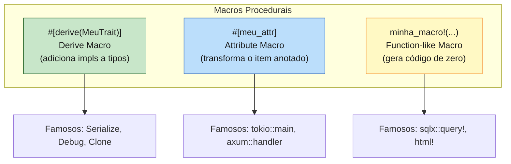
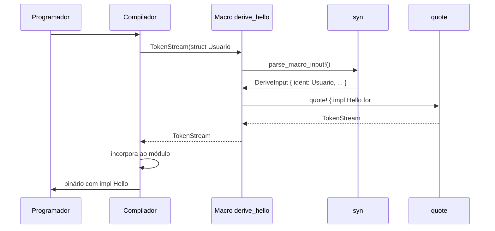
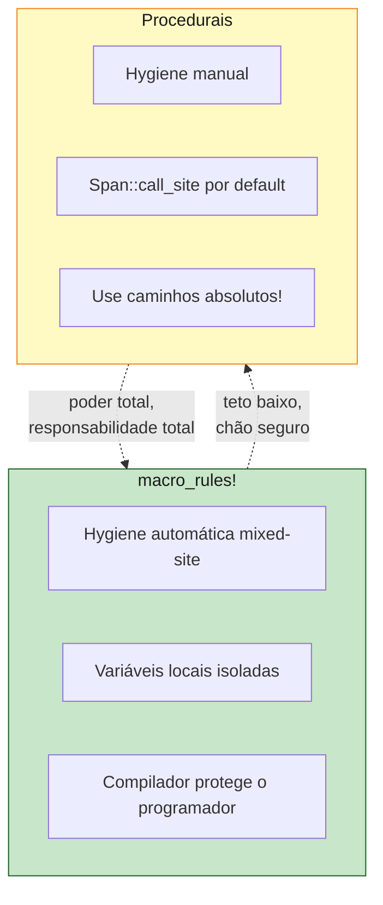
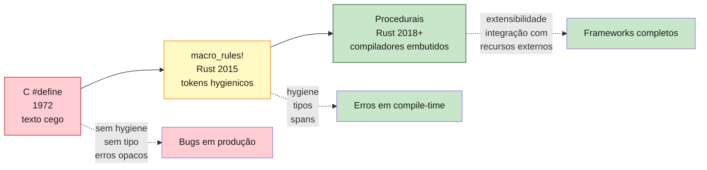

<a id="capitulo-40"></a>
# Capítulo 40: Macros Procedurais — Derive, Attribute, Function-like

> *"The macro is the language. The compiler is just a runtime."*
> — folclore de Lisp

> *"Em Rust, `#[derive(Serialize)]` é o que separa um arquivo de configuração de um SDK inteiro. E é só uma macro."*
> — David Tolnay, autor de Serde

> *"Annotations em Java são metadados. Decorators em TypeScript são funções de runtime. Macros em Rust são programas que escrevem programas. Esses três pontos parecem o mesmo. Não são."*

## 40.1 Onde `macro_rules!` Falha

No capítulo anterior, fechamos com uma promessa: macros declarativas não conseguem ler uma `struct` e gerar `impl` baseado nos campos dela. Isso parece uma limitação técnica menor, mas é a fronteira que separa "ferramenta de conveniência" de "ferramenta de plataforma".

Pense em Serde, a biblioteca canônica de serialização em Rust. O usuário escreve:

```rust
use serde::{Serialize, Deserialize};

#[derive(Serialize, Deserialize)]
struct Usuario {
    id: u64,
    nome: String,
    email: Option<String>,
}
```

E *funciona*. JSON, YAML, MessagePack, CBOR, Bincode — todos os formatos que falam Serde podem ler e escrever esse tipo, sem o usuário escrever uma única linha de glue code. O compilador, ao ver `#[derive(Serialize)]`, gera *automaticamente*:

```rust
impl Serialize for Usuario {
    fn serialize<S: Serializer>(&self, serializer: S) -> Result<S::Ok, S::Error> {
        let mut state = serializer.serialize_struct("Usuario", 3)?;
        state.serialize_field("id", &self.id)?;
        state.serialize_field("nome", &self.nome)?;
        state.serialize_field("email", &self.email)?;
        state.end()
    }
}
```

Isso é centenas de linhas em projetos reais, com centenas de campos. Nenhum programador escreve isso à mão. Nenhuma macro `macro_rules!` consegue gerar isso, porque não consegue iterar sobre os campos da `struct`. É preciso uma macro que **leia a estrutura sintática da struct** e gere código baseado em cada campo individualmente.

Para isso existem **macros procedurais**. Diferente de `macro_rules!`, que é uma DSL declarativa de pattern matching, uma macro procedural é literalmente uma **função Rust** que roda em compile-time, recebe um `TokenStream` (a sequência de tokens que ela vai processar) e devolve outro `TokenStream` (o código gerado).

```rust
pub fn minha_macro(input: TokenStream) -> TokenStream {
    // qualquer código Rust aqui:
    // - parsear input com syn
    // - inspecionar campos, tipos, atributos
    // - gerar código de saída com quote
    // - até ler arquivos do disco se quiser (sqlx::query! faz isso)
}
```

É um compilador embutido dentro do seu compilador. É também a feature mais poderosa — e mais perigosa — do ecossistema Rust.

## 40.2 Os Três Sabores

Macros procedurais vêm em três variantes, cada uma com um propósito sintático distinto:



Cada uma é declarada com um atributo diferente e tem uma assinatura de função diferente:

```rust
// Derive: recebe o item, deve gerar OUTROS itens (não modifica o original)
#[proc_macro_derive(MeuTrait)]
pub fn derive_meu_trait(input: TokenStream) -> TokenStream { ... }

// Attribute: recebe args + item, devolve o item transformado
#[proc_macro_attribute]
pub fn meu_attr(args: TokenStream, item: TokenStream) -> TokenStream { ... }

// Function-like: recebe argumentos, gera código de qualquer forma
#[proc_macro]
pub fn minha_macro(input: TokenStream) -> TokenStream { ... }
```

A diferença não é decorativa — cada sabor tem regras distintas sobre o que pode fazer com o input.

## 40.3 O Crate `proc-macro` e a Restrição que Confunde

Macros procedurais **não podem viver no mesmo crate em que são usadas**. Esta é a regra que mais tropeça quem está começando, e ela existe por motivo simples: macros rodam em compile-time, e o código que gera macros é compilado *antes* do código que usa elas. Para o `cargo` resolver essa ordem, ele exige que macros procedurais estejam num crate separado, marcado explicitamente:

```toml
# minha_macro/Cargo.toml
[package]
name = "minha_macro"
version = "0.1.0"

[lib]
proc-macro = true   # ← este flag muda tudo

[dependencies]
syn = "2"
quote = "1"
proc-macro2 = "1"
```

O flag `proc-macro = true` faz três coisas:

1. Marca o crate como executável em compile-time pelo compilador.
2. Restringe o que ele pode exportar (apenas funções marcadas com `#[proc_macro_*]`).
3. Disponibiliza o crate `proc_macro` da std (que define `TokenStream`).

Na prática, projetos com macros procedurais costumam ter dois crates lado a lado: `minha_lib` (a API pública) e `minha_lib_macros` (as macros). O Serde faz exatamente isso: `serde` e `serde_derive`.

## 40.4 As Ferramentas: `syn` e `quote`

Receber um `TokenStream` cru não é prazeroso. É uma sequência linear de tokens — você teria que escrever um parser de Rust à mão para fazer qualquer coisa séria. A comunidade resolveu isso há muito tempo com duas crates que toda macro procedural usa:

**`syn`** — parseia `TokenStream` em uma AST de Rust. Você diz "isto deve ser uma `struct`" e ele te devolve um `syn::ItemStruct` com campos, atributos, generics, lifetimes, tudo tipado.

**`quote`** — o caminho inverso: você escreve sintaxe Rust dentro de `quote! { ... }` com interpolação `#variavel`, e ele gera o `TokenStream` correspondente.

Juntas, elas reduzem uma macro procedural de "escrever um compilador" para "escrever uma transformação AST → AST".

## 40.5 Exemplo Completo: `#[derive(Hello)]`

Vamos construir uma derive macro que gera uma implementação de um trait `Hello`. O trait define um método `hello()` que retorna o nome do tipo. Trivial, mas mostra o pipeline completo.

Primeiro, o trait, que vive no crate "principal":

```rust
// crate "minha_lib"
pub trait Hello {
    fn hello(&self) -> String;
}
```

Agora o crate de macro:

```rust
// crate "minha_lib_macros"
// src/lib.rs

use proc_macro::TokenStream;
use quote::quote;
use syn::{parse_macro_input, DeriveInput};

#[proc_macro_derive(Hello)]
pub fn derive_hello(input: TokenStream) -> TokenStream {
    // 1. Parsear o input em AST estruturada
    let ast = parse_macro_input!(input as DeriveInput);

    // 2. Extrair o nome do tipo
    let nome = &ast.ident;

    // 3. Gerar o código do impl
    let expanded = quote! {
        impl Hello for #nome {
            fn hello(&self) -> String {
                format!("Olá de {}", stringify!(#nome))
            }
        }
    };

    // 4. Devolver como TokenStream
    TokenStream::from(expanded)
}
```

E o uso:

```rust
use minha_lib::Hello;
use minha_lib_macros::Hello;

#[derive(Hello)]
struct Usuario;

#[derive(Hello)]
struct Pedido;

fn main() {
    let u = Usuario;
    let p = Pedido;
    println!("{}", u.hello()); // → "Olá de Usuario"
    println!("{}", p.hello()); // → "Olá de Pedido"
}
```

O que o compilador faz, ao ver `#[derive(Hello)] struct Usuario;`:

1. Pega os tokens da struct (`struct Usuario;`).
2. Passa-os como `TokenStream` para `derive_hello`.
3. Recebe um `TokenStream` de volta — o `impl Hello for Usuario { ... }`.
4. *Adiciona* esse impl ao módulo (sem remover a `struct` original).
5. Continua a compilação como se o programador tivesse escrito tudo à mão.

Repare no `quote!`: ali dentro, você escreve Rust *literal*, com a interpolação `#nome` substituindo o token do nome da struct. É muito parecido com template strings — mas em vez de gerar uma string, gera tokens já parseáveis.



## 40.6 Atributos de Ajuda: Customização

E se quiséssemos que o usuário pudesse customizar a saudação? Algo como:

```rust
#[derive(Hello)]
#[hello(saudacao = "Bem-vindo")]
struct Usuario;
```

Para isso existe o conceito de **helper attributes**. A derive macro declara que entende um atributo auxiliar:

```rust
#[proc_macro_derive(Hello, attributes(hello))]
pub fn derive_hello(input: TokenStream) -> TokenStream {
    let ast = parse_macro_input!(input as DeriveInput);
    let nome = &ast.ident;

    // Procurar atributo #[hello(...)] na struct
    let saudacao = ast.attrs.iter()
        .find(|a| a.path().is_ident("hello"))
        .and_then(|a| /* parse args */ ...)
        .unwrap_or_else(|| String::from("Olá"));

    let expanded = quote! {
        impl Hello for #nome {
            fn hello(&self) -> String {
                format!("{} de {}", #saudacao, stringify!(#nome))
            }
        }
    };

    TokenStream::from(expanded)
}
```

Helper attributes são **inertes** — eles existem apenas para a macro consumi-los. O compilador não os interpreta sozinho. É assim que `#[serde(rename = "id")]`, `#[serde(skip)]`, `#[serde(default)]` funcionam: tudo é parseado pela própria `serde_derive` ao expandir o `#[derive(Serialize)]`.

## 40.7 Macros de Atributo: Transformando o Item

Attribute macros são mais poderosas: elas recebem o item *e* podem reescrevê-lo completamente. A assinatura tem dois argumentos:

```rust
#[proc_macro_attribute]
pub fn meu_attr(args: TokenStream, item: TokenStream) -> TokenStream {
    // args: o que vem dentro de #[meu_attr(...)]
    // item: o item anotado (fn, struct, impl, etc.)
    // retorno: o item modificado (ou completamente substituído)
}
```

O exemplo canônico é `#[tokio::main]`:

```rust
#[tokio::main]
async fn main() {
    println!("rodando em runtime async");
}
```

O usuário escreveu uma `async fn main()`, o que normalmente Rust não aceita (Rust não tem runtime async embutido). A macro `#[tokio::main]` *transforma* essa função, gerando algo como:

```rust
fn main() {
    tokio::runtime::Builder::new_multi_thread()
        .enable_all()
        .build()
        .unwrap()
        .block_on(async {
            println!("rodando em runtime async");
        });
}
```

A função síncrona original sumiu. Em seu lugar, há uma `fn main()` sincrônica que sobe o runtime, e o corpo virou o argumento de `block_on`. O programador não precisa saber. Ele só escreve `async fn main`. A macro faz a ponte.

Outro exemplo importante são os roteadores do Axum/Actix:

```rust
#[axum::debug_handler]
async fn list_users(State(db): State<Db>) -> Json<Vec<User>> { ... }
```

A macro `#[debug_handler]` injeta verificações em compile-time que dão mensagens de erro humanas quando os tipos não satisfazem o trait `Handler`. Sem ela, o erro é uma das mensagens mais hostis que Rust produz, com 200 linhas de "bound not satisfied".

## 40.8 Function-like: Compiladores Dentro do Compilador

Function-like procedural macros parecem `macro_rules!` na invocação — `minha_macro!(...)` — mas internamente são código procedural arbitrário. O exemplo mais espetacular é `sqlx::query!`:

```rust
let usuarios = sqlx::query!(
    "SELECT id, nome, email FROM usuarios WHERE ativo = $1",
    true
)
.fetch_all(&pool)
.await?;
```

Em compile-time, `sqlx::query!` *conecta no banco de dados de desenvolvimento*, executa um `EXPLAIN` da query, descobre os tipos das colunas (`id: i64`, `nome: String`, `email: Option<String>`), confere com os argumentos, e gera código que retorna uma `struct` anônima com esses campos tipados. **Se a query estiver errada — coluna inexistente, tipo errado, sintaxe SQL inválida — o erro é um erro de compilação**, não um runtime panic seis horas depois em produção.

Isso só é possível porque uma macro procedural pode:

- Ler arquivos do disco (`.sqlx-cache` ou conexão real).
- Abrir conexões de rede (no caso, ao banco).
- Executar qualquer código Rust em compile-time.

Outro exemplo, `html!` (do crate `maud`):

```rust
let pagina = html! {
    h1 { "Bem-vindo" }
    ul {
        @for item in &itens {
            li { (item) }
        }
    }
};
```

A macro parseia *uma sintaxe que não é Rust* (HTML com interpolação) e gera código Rust que constrói a string. É um compilador de HTML embutido dentro do compilador de Rust. Em C ou TypeScript, isso seria impensável sem um build step externo.

## 40.9 Hygiene em Procedurais: A Regra é Outra

Aqui está a parte desconfortável. Macros procedurais **não são hygiênicas no mesmo sentido que `macro_rules!`**.

Por padrão, os tokens emitidos por uma macro procedural usam o `Span::call_site()` — o span da invocação. Isso significa que:

- Se a macro emite `let tmp = ...;`, esse `tmp` **vive no namespace do chamador**.
- Se a macro chama `Vec::new()`, e o chamador definiu seu próprio `Vec`, **a macro pega o do chamador**.

A regra defensiva, prática e ubíqua, é: **use caminhos absolutos**.

```rust
// ruim — pode colidir com tipos do chamador
quote! {
    let v: Vec<u8> = Vec::new();
}

// bom — não colide com nada
quote! {
    let v: ::std::vec::Vec<u8> = ::std::vec::Vec::new();
}
```

Por isso o código gerado por Serde, Tokio, sqlx é cheio de `::core::result::Result::<_, _>::Ok(...)` em vez de `Ok(...)`. Não é por estilo. É defesa. Essa é a arte sombria de proc macros: você está escrevendo código que vai ser inserido em contextos arbitrários, e o compilador não te protege como protegia em `macro_rules!`.

Existe `Span::mixed_site()` para os casos em que você quer hygiene parcial (variáveis locais isoladas mas tipos resolvidos no chamador), mas é manual. Você escolhe.



## 40.10 O Custo: Compilação

Macros procedurais não são gratuitas. Cada macro é um plugin de compilador que precisa ser compilado *antes* do código que usa ela. Em projetos grandes, isso significa:

- O crate de macro precisa compilar primeiro (overhead fixo).
- Cada invocação roda código Rust em compile-time (overhead variável).
- `syn` é uma dependência grande — compila várias features de parsing de Rust.

Em projetos com muito Serde, com `sqlx`, com `axum`, com `clap` derive, com `thiserror` — todos macros procedurais — o tempo de build cresce visivelmente. Soluções:

1. **`cargo check` em vez de `cargo build`** durante desenvolvimento. O check pula codegen.
2. **`sccache`** para cache de compilação compartilhado.
3. **Manter o crate de macros enxuto** — não inclua dependências pesadas se não precisar.
4. **Avaliar quando a macro vale a pena**. Se a regra é simples, escreva à mão.

Para times pequenos isso é invisível. Para monorepos com 200 crates e Serde em todo lugar, é mensurável: 30s vs 90s de incremental.

## 40.11 Comparação Final: Annotations, Decorators, Macros

Esta tabela é o core do capítulo. Decore, ou volte aqui.

| Aspecto                  | Java Annotations            | TS Decorators (estágio 3)   | Rust `#[derive]` / proc macros |
|--------------------------|-----------------------------|-----------------------------|--------------------------------|
| Quando expande           | runtime (default), opcional compile-time (annotation processor) | **runtime**             | **compile-time**               |
| O que recebe             | objeto reflexivo            | `target` (classe/método)    | `TokenStream` (sintaxe)        |
| O que pode gerar         | metadados consumidos por frameworks | nova classe/método modificado em runtime | qualquer código Rust válido |
| Custo de execução        | reflection (caro)           | runtime (mensurável)        | zero — código já gerado        |
| Erros aparecem em        | runtime (geralmente)        | runtime                     | compile-time                   |
| Exemplos                 | `@Override`, `@Inject`, `@Entity` | `@Component`, `@Injectable` | `#[derive(Serialize)]`, `#[tokio::main]` |
| Pode ler banco/disco?    | sim, mas em runtime         | sim, mas em runtime         | sim, em compile-time (sqlx!)   |

A diferença filosófica é mais profunda do que parece:

- **Java** introduziu annotations em 2004 como metadados. Frameworks (Spring, Hibernate) interpretam esses metadados em runtime via reflection. O custo é runtime, e os erros — campo errado, anotação inválida, ciclo de injeção — explodem em produção.

- **TypeScript** adotou decorators (originalmente experimental, depois estágio 3 do TC39). São funções de runtime que recebem a referência de uma classe e podem modificá-la antes de retornar. **Não geram código novo em compile-time** — apenas alteram o comportamento da classe existente. Isso significa: tudo que decoradores fazem, código manual também faria. Eles são *açúcar sintático sobre composição de funções*.

- **Rust** adotou meta-programação em compile-time real. `#[derive(Serialize)]` gera um `impl` completo, com 50 linhas de código de serialização, em compile-time. Em runtime, é só uma chamada de função. Sem reflection. Sem dispatch dinâmico. Sem custo. Os erros aparecem antes do binário sair.

```rust
// Rust: erro em compile-time
#[derive(Serialize)]
struct User {
    nome: String,
    senha: ArquivoSecreto,  // ← Serialize não é implementado!
}
// ❌ error[E0277]: the trait bound `ArquivoSecreto: Serialize` is not satisfied
```

```typescript
// TypeScript com decorator: erro em runtime, talvez nunca
@Serializable
class User {
  nome: string;
  senha: ArquivoSecreto;  // não dá erro de compile, só explode no JSON.stringify
}
```

```java
// Java com annotation: erro em runtime, geralmente em produção
@Entity
class User {
  @Column private String nome;
  @Column private FileHandle senha;  // Hibernate explode na primeira persistência
}
```

A migração do "verifica em runtime" para "verifica em compile-time" é a tese central de Rust, e macros procedurais são a peça que torna essa tese viável em escala. Sem `#[derive(Serialize)]`, ninguém escreveria glue code de serialização à mão para 200 structs. Com ela, é uma linha por struct, e o compilador garante que *funciona*.

## 40.12 Quando Escrever a Sua

Macros procedurais são tentadoras. Você as vê em todo lugar e pensa: *"vou criar um `#[derive(MeuTrait)]` para meu domínio."* Antes de fazer, três perguntas:

**1. Existe trait suficientemente genérico que resolveria com generics?**
Se a resposta é sim, use generics. Macros são *metaprogramação* — devem fazer o que generics não conseguem.

**2. Existe `macro_rules!` que resolveria?**
Se a resposta é sim, use `macro_rules!`. Procedurais são exponencialmente mais caras em build time e em complexidade de manutenção.

**3. O custo de compilação se paga?**
Se a macro vai ser usada em 5 lugares e dá pra escrever os 5 à mão em 50 linhas cada — escreva à mão. Se vai ser usada em 500 lugares, ou se o código gerado depende de inspeção estrutural (campos, tipos, atributos), aí sim.

A heurística empírica: **macros procedurais valem a pena quando o código que elas geram é (a) mecânico, (b) baseado em estrutura tipada, e (c) seria um pesadelo de manter à mão**. Serde se encaixa perfeitamente. `sqlx::query!` se encaixa perfeitamente. `clap::Parser` se encaixa perfeitamente. Uma macro para "chamar uma função e logar entrada/saída" — provavelmente não, escreva uma função genérica e seja feliz.

## 40.13 O Arco Completo: De `#define` a Procedurais

Voltemos ao começo do capítulo 39 e fechemos o círculo.



Cinquenta anos de evolução de um conceito simples — *"como deixo o programador estender a sintaxe da linguagem?"* — foram pagos em vidas humanas (literalmente, no caso de bugs de C em sistemas críticos), em horas perdidas debugando expansões, em vulnerabilidades de segurança causadas por substituição textual mal feita. Rust, nessa área como em outras, é a primeira linguagem que oferece a meta-programação como um cidadão de primeira classe **sem cobrar o preço da insegurança**.

`macro_rules!` resolve 80% dos casos com 20% do poder. Procedurais resolvem os 20% restantes mas exigem 80% da disciplina. Juntas, elas explicam por que um ecossistema de oito anos (Serde nasceu em 2015) tem maturidade comparável ao de plataformas de duas décadas. O custo da meta-programação caiu, e a vazão de bibliotecas que dependem dela explodiu.

Esta é a última grande diferença entre Rust e seus contemporâneos. C te dá poder e te deixa sangrar. Java e TypeScript te dão segurança e te roubam expressividade. Rust escolhe — *poder e segurança*, *expressividade e correção*, *meta-programação e hygiene* — e demonstra que o trade-off não era inerente. Era falta de cuidado de quem desenhou as outras linguagens.

> *"O programa que escreveu Serde é menor que Serde. O programa que escreveu seu próprio framework é, talvez, menor que ele. Macros procedurais são uma alavanca. Use-as para erguer o que outras linguagens deixam pesando no chão."*

## 40.14 Erratum: o Que Macros Não Resolvem

Antes de fechar — é ético dizer o que macros *não* fazem. Algumas ilusões comuns:

- **Macros não substituem testes.** O código gerado pode estar errado. `#[derive(Hash)]` mal especificado já causou bugs. Teste o código gerado.
- **Macros não substituem documentação.** Se o usuário precisa entender 200 linhas geradas para entender o erro, sua macro está mal.
- **Macros não substituem boa API.** Uma macro perfeita em cima de uma API ruim é uma forma elegante de esconder problema.
- **Macros não escalam de graça.** Toda invocação de macro complexa custa milisegundos de build. Multiplicado por mil invocações, por dez compilações diárias, por dez devs no time — vira custo real.

Macros são uma ferramenta. A última do livro. Não porque sejam menos importantes que as anteriores, mas porque exigem que tudo que veio antes (ownership, traits, generics, lifetimes, error handling) esteja sólido na cabeça do programador. Quem escreve `#[derive(Serialize)]` sem entender por que `String` implementa `Serialize` mas `RefCell<String>` precisa de cuidado especial vai criar bugs estranhos.

A jornada de "Por Que Rust Existe" terminou aqui. Não terminou porque acabou o que aprender — Rust tem áreas inteiras (`async`, FFI avançado, embedded, WebAssembly) que são livros próprios. Terminou porque, com macros, fechou-se o conjunto mínimo de ferramentas necessárias para um programador escrever **código de sistemas, seguro, performante, expressivo, e seu**. Daqui para frente, é prática.

---

> *"You don't write Rust. You write what you mean. The compiler then turns that into Rust. And macros — declarative or procedural — are how you teach the compiler new ways to do that translation."*

[← Capítulo 39: Macros Declarativas](ch39-macros-declarativas.md) | [Próximo: Epílogo — Ferro e Espírito →](../epilogo.md)
