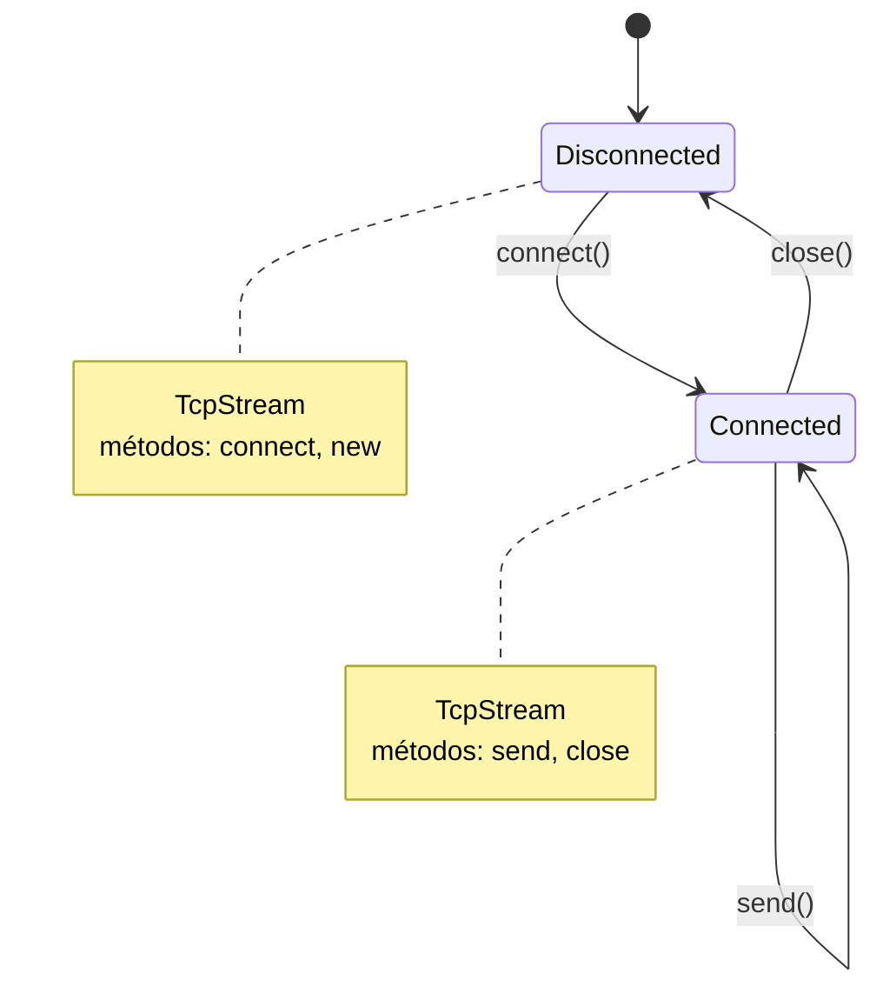
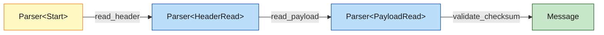

<a id="capitulo-42"></a>
# Capítulo 42: Type-State Pattern: Estados Como Tipos

> *"Make invalid states unrepresentable."*
> — Yaron Minsky

> *"The compiler is not a punishment. It's a colleague who reads every line of your code at 3am and never gets tired."*
> — atribuído à comunidade Rust

## 42.1 A Anatomia de Um Bug Que Compila

Toda aplicação de rede já viu este código, em algum dialeto:

```typescript
class TcpStream {
    private connected = false;

    connect(addr: string): void {
        // ...handshake...
        this.connected = true;
    }

    send(data: Uint8Array): void {
        if (!this.connected) {
            throw new Error("not connected");
        }
        // ...envia...
    }

    close(): void {
        this.connected = false;
    }
}
```

Há um problema estrutural neste design. O método `send` *aceita* ser chamado num stream desconectado. A linguagem não tem como impedir isso. Tudo o que pode fazer é checar uma flag em runtime e jogar uma exceção. O bug existe, vive, e só morre quando o teste certo chega — se chegar.

A pergunta de Rust é a mesma do capítulo anterior: *e se o compilador soubesse que `send` só pode ser chamado num stream conectado?* A resposta é o **type-state pattern**: representar cada estado da máquina como um *tipo distinto*, e tornar métodos disponíveis apenas no tipo correspondente.

## 42.2 A Ideia Central

Em vez de uma classe `TcpStream` com um campo `connected: bool`, modelamos:

```rust
pub struct TcpStream<S> {
    socket: RawSocket,
    _state: std::marker::PhantomData<S>,
}

pub struct Disconnected;
pub struct Connected;
```

`S` é um parâmetro de tipo. `Disconnected` e `Connected` são structs vazios — *marcadores*. `PhantomData<S>` diz ao compilador "este tipo se comporta como se contivesse um `S`, mas na verdade não ocupa byte algum".

Agora os métodos são definidos em *impls* específicos:

```rust
impl TcpStream<Disconnected> {
    pub fn new() -> Self {
        TcpStream { socket: RawSocket::new(), _state: PhantomData }
    }

    pub fn connect(self, addr: &str) -> Result<TcpStream<Connected>, ConnectError> {
        self.socket.handshake(addr)?;
        Ok(TcpStream { socket: self.socket, _state: PhantomData })
    }
}

impl TcpStream<Connected> {
    pub fn send(&mut self, data: &[u8]) -> Result<(), SendError> {
        self.socket.write_all(data)
    }

    pub fn close(self) -> TcpStream<Disconnected> {
        self.socket.shutdown();
        TcpStream { socket: self.socket, _state: PhantomData }
    }
}
```

Agora observe o que acontece com código incorreto:

```rust
let stream: TcpStream<Disconnected> = TcpStream::new();
stream.send(b"hello"); // erro de compilação:
//          ^^^^ method `send` not found on `TcpStream<Disconnected>`
```

O método `send` *literalmente não existe* no tipo `TcpStream<Disconnected>`. Não é um teste em runtime. Não é um lint. É a ausência do método.



A máquina de estados é o sistema de tipos. Transições são funções que consomem um estado e devolvem outro. Operações inválidas não compilam.

## 42.3 Type-State em Builders: Campos Obrigatórios em Compile Time

O capítulo anterior introduziu builders. O builder simples falha em runtime quando um campo obrigatório é omitido:

```rust
let req = HttpRequestBuilder::new()
    .method("GET")
    .build()?; // panic: url não definida
```

Type-state eleva isso a *compile time*. Cada campo obrigatório vira um parâmetro de tipo:

```rust
pub struct No;     // campo não definido
pub struct Yes;    // campo definido

pub struct HttpRequestBuilder<HasUrl, HasMethod> {
    url: Option<String>,
    method: Option<String>,
    headers: Vec<(String, String)>,
    _has_url: PhantomData<HasUrl>,
    _has_method: PhantomData<HasMethod>,
}

impl HttpRequestBuilder<No, No> {
    pub fn new() -> Self {
        HttpRequestBuilder {
            url: None,
            method: None,
            headers: vec![],
            _has_url: PhantomData,
            _has_method: PhantomData,
        }
    }
}

impl<H> HttpRequestBuilder<No, H> {
    pub fn url(self, u: impl Into<String>) -> HttpRequestBuilder<Yes, H> {
        HttpRequestBuilder {
            url: Some(u.into()),
            method: self.method,
            headers: self.headers,
            _has_url: PhantomData,
            _has_method: PhantomData,
        }
    }
}

impl<U> HttpRequestBuilder<U, No> {
    pub fn method(self, m: impl Into<String>) -> HttpRequestBuilder<U, Yes> {
        HttpRequestBuilder {
            url: self.url,
            method: Some(m.into()),
            headers: self.headers,
            _has_url: PhantomData,
            _has_method: PhantomData,
        }
    }
}

impl HttpRequestBuilder<Yes, Yes> {
    pub fn build(self) -> HttpRequest {
        HttpRequest {
            url: self.url.unwrap(),       // safe: type-state garantiu
            method: self.method.unwrap(), // safe: idem
            headers: self.headers,
        }
    }
}
```

Uso:

```rust
// Compila
let req = HttpRequestBuilder::new()
    .url("https://api.example.com")
    .method("GET")
    .build();

// Não compila — falta .url()
let req = HttpRequestBuilder::new()
    .method("GET")
    .build();
//   ^^^^^ method `build` not found on `HttpRequestBuilder<No, Yes>`
```

A crate `typed-builder` automatiza essa coreografia. O custo runtime é zero: `PhantomData` é apagado, e o struct produzido tem o mesmo layout que um builder convencional.

## 42.4 Sealed Traits: Type-State Extensível

Há casos em que se deseja que outros módulos *adicionem* estados, mas não que estados arbitrários sejam possíveis. Para isso, usa-se o pattern *sealed trait*:

```rust
mod private {
    pub trait Sealed {}
}

pub trait State: private::Sealed {}

pub struct Disconnected;
pub struct Connected;
pub struct TlsHandshaking;

impl private::Sealed for Disconnected {}
impl private::Sealed for Connected {}
impl private::Sealed for TlsHandshaking {}

impl State for Disconnected {}
impl State for Connected {}
impl State for TlsHandshaking {}

pub struct TcpStream<S: State> {
    socket: RawSocket,
    _state: PhantomData<S>,
}
```

A trait `private::Sealed` está num módulo privado. Externamente, ninguém consegue implementar `Sealed` para um tipo novo, portanto ninguém consegue implementar `State`. O conjunto de estados é fechado, mas a trait `State` continua sendo um bound legível na documentação. Esse é o mesmo mecanismo que o `std` usa para limitar quais tipos podem implementar `Error::source()` em alguns lugares.

## 42.5 Exemplo Prático: Parser de Protocolo

Um parser de protocolo binário tem fases bem definidas: ler header, ler payload, validar checksum. Type-state torna a sequência inviolável:

```rust
pub struct Parser<S> {
    bytes: Vec<u8>,
    cursor: usize,
    _state: PhantomData<S>,
}

pub struct Start;
pub struct HeaderRead { magic: u32, version: u8, payload_len: u32 }
pub struct PayloadRead { header: HeaderRead, payload: Vec<u8> }

impl Parser<Start> {
    pub fn new(bytes: Vec<u8>) -> Self {
        Parser { bytes, cursor: 0, _state: PhantomData }
    }

    pub fn read_header(mut self) -> Result<Parser<HeaderRead>, ParseError> {
        let magic = self.read_u32()?;
        let version = self.read_u8()?;
        let payload_len = self.read_u32()?;
        if magic != 0xC0FFEE {
            return Err(ParseError::BadMagic);
        }
        Ok(Parser {
            bytes: self.bytes,
            cursor: self.cursor,
            _state: PhantomData,
        })
    }
}

impl Parser<HeaderRead> {
    pub fn read_payload(mut self, header: HeaderRead) -> Result<Parser<PayloadRead>, ParseError> {
        let payload = self.read_bytes(header.payload_len as usize)?;
        Ok(Parser {
            bytes: self.bytes,
            cursor: self.cursor,
            _state: PhantomData,
        })
    }
}

impl Parser<PayloadRead> {
    pub fn validate_checksum(self) -> Result<Message, ParseError> {
        // ...
        Ok(Message { /* ... */ })
    }
}
```

Tentar chamar `validate_checksum` num `Parser<Start>` é erro de compilação. Tentar chamar `read_header` num `Parser<HeaderRead>` é erro de compilação. A *ordem* da máquina é parte da assinatura de tipos.



## 42.6 Comparação: TS, Go, Java

### 42.6.1 TypeScript: Branded Types Aproximam-se, Mas Apagam em Runtime

TypeScript pode simular type-state com tipos discriminados:

```typescript
type Disconnected = { readonly _state: 'disconnected'; socket: RawSocket };
type Connected = { readonly _state: 'connected'; socket: RawSocket };
type TcpStream = Disconnected | Connected;

function connect(s: Disconnected, addr: string): Connected {
    // ...handshake...
    return { _state: 'connected', socket: s.socket };
}

function send(s: Connected, data: Uint8Array): void {
    // ...envia...
}

const s1: Disconnected = { _state: 'disconnected', socket: new RawSocket() };
send(s1, new Uint8Array()); // erro: argumento de tipo Disconnected não é Connected
```

Funciona em compile time. Mas a tag `_state` é um literal de string que existe em runtime — você gasta bytes para algo que o sistema de tipos já sabe. E qualquer cast (`s as Connected`) atravessa a barreira sem alarme. Em Rust, `PhantomData` é gratuito; não existe cast.

### 42.6.2 Go: Sem Suporte

Go não tem genéricos com kinds suficientes para representar estados como tipos distintos no estilo `TcpStream<Connected>`. Genéricos chegaram em 1.18 e cobrem boa parte dos casos de containers, mas para type-state pattern a comunidade recorre a interfaces e checks em runtime:

```go
type ConnectedStream interface {
    Send(data []byte) error
}

type DisconnectedStream interface {
    Connect(addr string) (ConnectedStream, error)
}

// e o programador é responsável por não fazer type assertions erradas
```

Funciona, mas exige interfaces para cada estado e disciplina humana para não usar `.(*ConcreteType)` malicioso. Em Rust, o compilador *garante*.

### 42.6.3 Java: Sem Suporte Idiomático

Java tem genéricos, mas não tem `PhantomData` nem o mecanismo de impl blocks de Rust. A simulação típica usa hierarquias de classes:

```java
abstract class TcpStream { protected RawSocket socket; }

class DisconnectedStream extends TcpStream {
    ConnectedStream connect(String addr) { /* ... */ }
}

class ConnectedStream extends TcpStream {
    void send(byte[] data) { /* ... */ }
    DisconnectedStream close() { /* ... */ }
}
```

Funciona, mas viola o princípio de que herança é menos útil que composição, força alocações distintas, e ainda permite `instanceof` que arruína a invariante. Java moderno tem *sealed classes* (Java 17), que ajudam um pouco, mas a ergonomia continua atrás de Rust.

### 42.6.4 Tabela Comparativa

| Linguagem | Type-state nativo? | Custo runtime | Compilador rejeita uso errado? |
|---|---|---|---|
| **Rust** | sim, via genéricos + `PhantomData` | zero | sempre |
| **TypeScript** | sim, via discriminated unions | tag em runtime | em compile time, com escapes via cast |
| **Go** | não idiomático | objetos extras | apenas com type assertions disciplinadas |
| **Java** | parcial via sealed classes | alocação por estado | parcial; `instanceof` quebra |

## 42.7 Quando Usar — e Quando Não

Type-state é uma ferramenta afiada. Use-a quando:

1. **A ordem de operações é parte da correção do programa.** Parsers, máquinas de protocolo, builders com obrigatórios.
2. **Confundir estados causa bugs sérios.** Enviar antes de conectar, commitar antes de iniciar transação, ler de um stream fechado.
3. **A API é pública e os usuários vão errar.** Quanto maior o blast radius, maior o valor de impedir o uso incorreto na compilação.

Não use type-state quando:

1. **A máquina tem muitos estados ou transições dinâmicas.** Se a tabela de transições é decidida em runtime (input do usuário, estado externo), uma struct com enum interno é mais legível e flexível.
2. **A API é interna e o esforço de manutenção excede o ganho.** Cada novo estado é um impl block. Para máquinas com cinco estados e dez transições, a duplicação de código pode pesar.
3. **Os usuários precisam guardar o stream em coleções heterogêneas.** Se você quer um `Vec<TcpStream<???>>`, type-state passa a ser obstáculo. Use enum com variantes nesse caso.

A regra prática: *type-state vence quando o número de estados é pequeno e a sequência é parte da semântica*. Quando o número cresce, prefira enums com pattern matching exaustivo.

## 42.8 Pegadinhas Comuns

### 42.8.1 PhantomData e Variância

`PhantomData<T>` afeta como o compilador trata variância. Para casos típicos com structs marcadores vazios (`struct Connected;`), a variância correta é covariante e o `PhantomData<S>` direto basta. Em casos avançados (com tempos de vida ou tipos contendo refs), pode ser necessário `PhantomData<fn() -> S>` para forçar invariância.

A regra heurística: para estados marcadores simples, `PhantomData<S>` está certo. Em código onde lifetimes do estado importam, leia o capítulo do *Rustonomicon* sobre subtyping antes de inventar.

### 42.8.2 Consumir Self É Necessário

Note que cada transição consome `self`:

```rust
pub fn connect(self, addr: &str) -> TcpStream<Connected> { /* ... */ }
//             ^^^^ não &mut self, não &self — self por valor
```

Isso é deliberado. Se a transição fosse `&mut self`, o stream antigo (`Disconnected`) ainda existiria após `connect`, e o chamador poderia tentar usá-lo. Consumir `self` *destrói* o estado anterior, garantindo que apenas o novo estado é referenciável.

### 42.8.3 Erros Voltam ao Estado Anterior — ou Não

Se `connect` falha, o que devolver?

```rust
pub fn connect(self, addr: &str) -> Result<TcpStream<Connected>, (TcpStream<Disconnected>, ConnectError)> {
    // ...
}
```

Devolver o estado original junto do erro permite ao chamador tentar de novo. Para máquinas onde o erro é fatal e o stream deve ser descartado, o tipo de erro pode não carregar o stream:

```rust
pub fn connect(self, addr: &str) -> Result<TcpStream<Connected>, ConnectError> {
    // self é destruído se a função retornar Err
}
```

Cada API escolhe sua semântica. A escolha deve estar documentada.

## 42.9 Síntese

Type-state pattern é um exemplo da filosofia mais larga deste livro: *fazer o compilador trabalhar por você*. Cada estado vira um tipo. Cada transição vira uma função. Cada operação inválida vira um erro de compilação que custa zero em runtime.

A pergunta a fazer ao desenhar uma API: *quais sequências de chamadas o programador precisa não cometer?* Toda resposta a essa pergunta é uma oportunidade de codificar a sequência no sistema de tipos. Quando se faz isso bem, o resultado é uma biblioteca onde o IDE praticamente escreve o código correto sozinho — porque qualquer outro código não compila.

> *"The most reliable code is code that doesn't exist. The second most reliable is code that the compiler refuses to compile if it's wrong."*

[Próximo: Capítulo 43 — Error Handling Avançado: anyhow, thiserror, miette →](ch43-error-handling-avancado.md)
