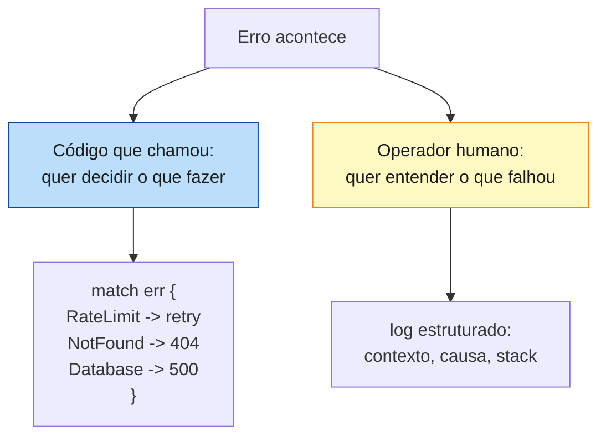
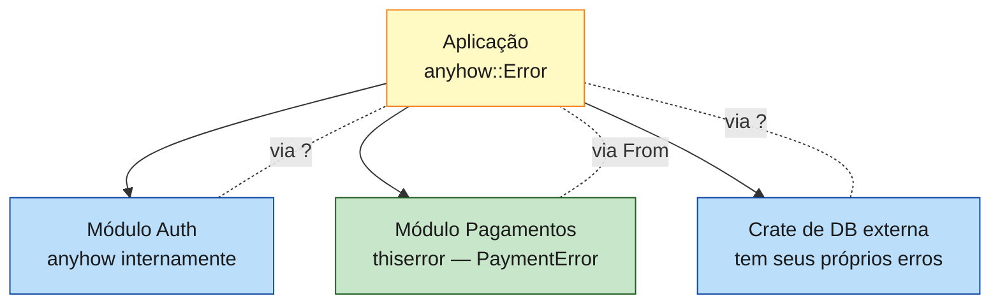
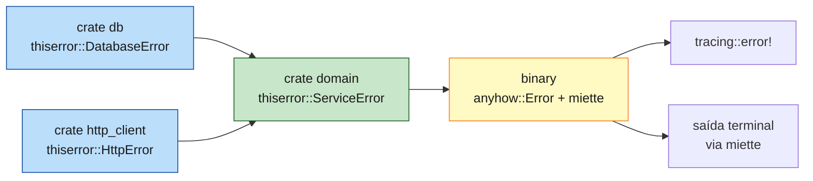

<a id="capitulo-43"></a>
# Capítulo 43: Error Handling Avançado: anyhow, thiserror, miette

> *"Errors are values."*
> — Rob Pike

> *"Errors should be logged when they are handled. If you find yourself logging the same error multiple times, you're handling it wrong."*
> — Luca Palmieri, *Error Handling in Rust*

> *"The error message is the user interface of the failure case. Treat it like one."*

## 43.1 As Duas Funções de Um Erro

Antes de qualquer crate, o ponto de partida: um erro existe para servir a *duas* audiências, e essas audiências têm necessidades opostas.



A primeira audiência é o **código**. Ele precisa ramificar: dado que aconteceu o erro X, o que deve acontecer? Retry? Fallback? Propagar? Para isso, o erro precisa de *estrutura*: um enum, uma classificação, campos identificáveis.

A segunda audiência é o **humano** que vai investigar a falha às 3h da manhã. Ele precisa de *contexto*: o que estava sendo feito, com quais inputs, em qual ambiente, e a cadeia causal completa até a primeira fissura.

Bibliotecas servem majoritariamente a primeira audiência: precisam dar tipos discrimináveis. Aplicações servem majoritariamente a segunda: precisam coletar contexto e reportar.

Essa distinção é a chave para escolher entre **thiserror** e **anyhow**. Não são alternativas — são especializações para públicos distintos.

## 43.2 thiserror: A Ferramenta de Quem Escreve Bibliotecas

`thiserror` é uma macro derive. Ela gera implementações de `std::error::Error`, `Display` e `From` a partir de um enum anotado:

```rust
use thiserror::Error;

#[derive(Error, Debug)]
pub enum DatabaseError {
    #[error("conexão recusada por {host}:{port}")]
    ConnectionRefused { host: String, port: u16 },

    #[error("query inválida: {0}")]
    InvalidQuery(String),

    #[error("timeout após {seconds}s")]
    Timeout { seconds: u64 },

    #[error(transparent)]
    Io(#[from] std::io::Error),
}
```

Os atributos:

- `#[error("...")]` — gera `Display`. Suporta interpolação `{0}` (campos posicionais), `{nome}` (campos nomeados) e `{nome:?}` (debug format).
- `#[from]` — gera `From<std::io::Error> for DatabaseError`, permitindo `?` automático.
- `#[source]` — marca o campo como a causa subjacente (acessível via `.source()`).
- `#[error(transparent)]` — delega `Display` e `source()` ao campo embrulhado, sem adicionar mensagem.
- `#[backtrace]` — em nightly, expõe a backtrace via `Error::provide`.

A propriedade-chave do `thiserror`: **a macro não gera código em runtime**. Ela apenas escreve o que você teria escrito à mão. Não há `Box<dyn Error>`, não há virtualização, não há custo. O enum gerado é tão eficiente quanto qualquer outro enum Rust.

### 43.2.1 Por Que Bibliotecas Precisam de Estrutura

Uma biblioteca não sabe quem vai consumir seus erros. Talvez um servidor web que precise mapear cada variante para um status HTTP. Talvez um CLI que precise renderizar mensagens diferentes. Talvez um cliente que queira fazer retry só em erros transitórios.

Se a biblioteca devolve um erro opaco (`Box<dyn Error>`), o consumidor está cego: não pode discriminar, não pode reagir, só pode reportar. O contrato fica unilateral — a biblioteca obriga "tente de novo ou desista", sem nuance.

```rust
// Cliente da biblioteca, com erro estruturado:
match db.fetch_user(id).await {
    Ok(user) => Ok(user),
    Err(DatabaseError::Timeout { .. }) => {
        retry_with_backoff().await  // erro transitório
    }
    Err(DatabaseError::ConnectionRefused { .. }) => {
        notify_oncall().await;       // erro de infra
        Err(ApiError::ServiceUnavailable)
    }
    Err(DatabaseError::InvalidQuery(_)) => {
        Err(ApiError::InternalServerError) // bug nosso
    }
    Err(DatabaseError::Io(_)) => {
        Err(ApiError::InternalServerError)
    }
}
```

Sem o enum estruturado, esse `match` não é possível. O cliente teria que recorrer a *string matching* na mensagem — patético e frágil.

### 43.2.2 Princípio de Design: Erros Refletem o Contrato

Um erro de uma biblioteca deve refletir as *categorias semanticamente significativas* para o cliente, não a estrutura interna do código. Se três funções internas falham por motivos diferentes mas o cliente só pode reagir de uma forma, agrupe-as numa única variante. Se uma única função tem dois modos de falha que demandam reações diferentes, divida em duas variantes.

A regra heurística é a *câmera do cliente*: o que ele precisa saber para decidir? Tudo que não muda a decisão dele é ruído.

## 43.3 anyhow: A Ferramenta de Quem Escreve Aplicações

`anyhow` é o oposto filosófico. Em vez de tipos de erro estruturados, oferece um único tipo: `anyhow::Error`. É um wrapper sobre `Box<dyn Error + Send + Sync + 'static>` com ergonomia de primeira classe.

```rust
use anyhow::{Context, Result};

fn carregar_configuracao(path: &Path) -> Result<Config> {
    let raw = std::fs::read_to_string(path)
        .with_context(|| format!("ler arquivo de config em {}", path.display()))?;
    let cfg: Config = toml::from_str(&raw)
        .with_context(|| format!("parsear TOML em {}", path.display()))?;
    Ok(cfg)
}
```

A trait `Context` adiciona `.context()` e `.with_context()` a qualquer `Result`. Cada chamada empilha uma camada de descrição na cadeia de causa. O resultado, quando reportado, é uma narrativa completa:

```
Error: ler arquivo de config em /etc/app.toml

Caused by:
    0: ler arquivo de config em /etc/app.toml
    1: No such file or directory (os error 2)
```

Macros companheiras:

- `anyhow!("mensagem")` — constrói um erro ad hoc.
- `bail!("mensagem")` — equivalente a `return Err(anyhow!(...))`.
- `ensure!(cond, "mensagem")` — equivalente a `if !cond { bail!(...) }`.

### 43.3.1 Por Que Aplicações Não Precisam de Estrutura

Numa aplicação (binário, serviço, CLI), 90% do código segue o mesmo padrão: tente fazer isso, se falhar, registre e propague. O código *raramente* discrimina entre tipos de erro — porque já está no topo da pilha de chamadas. Não há ninguém acima para tomar decisão diferente.

Para esse caso, um enum estruturado é over-engineering. `anyhow::Error` aceita *qualquer* erro via `?`, anexa contexto, e quando finalmente é printado em um endpoint ou em log, mostra a cadeia completa.

```rust
async fn handler(req: Request) -> anyhow::Result<Response> {
    let user = autenticar(&req).await
        .context("autenticação")?;
    let dados = buscar_dados(user.id).await
        .context("buscar dados do usuário")?;
    let html = renderizar(&dados)
        .context("renderizar template")?;
    Ok(Response::ok(html))
}
```

Cada `?` propaga o erro com tipo apagado. O `.context(...)` deixa um rastro. Se `renderizar` falhar por um bug em Tera, o operador vê:

```
Error: renderizar template

Caused by:
    0: variable `username` undefined in template
    1: at line 14 in templates/profile.html
```

Sem precisar de um enum para cada subsistema. Sem precisar de `From` impls para cada tipo de erro de cada crate. Apenas `?` e `.context(...)`.

## 43.4 Decisão: Quando Cada Um

A regra de bolso clássica:

| Cenário | Crate |
|---|---|
| Você está escrevendo uma **library** publicada (crates.io ou interna) | `thiserror` |
| Você está escrevendo uma **application** (binary, server, CLI) | `anyhow` |
| Library com função interna privada onde estrutura não importa | `anyhow` interno é aceitável |
| Application onde *uma* parte precisa de discriminação fina | use `thiserror` *só nessa parte*, `anyhow` no resto |

Note que os dois podem coexistir. Uma aplicação que usa `anyhow` em geral pode ter um módulo de pagamentos que define `enum PaymentError` com `thiserror`, porque o módulo de pagamentos *precisa* discriminar entre cartão recusado, fundos insuficientes e gateway fora do ar. Erros saem desse módulo como `PaymentError`; o handler superior absorve em `anyhow::Error` quando vai propagar para HTTP.



## 43.5 miette: Diagnóstico Para Humanos

`miette` leva o erro de "linha de log" para "experiência de usuário". Foi projetado para CLIs e compiladores que precisam mostrar erros de forma *legível por humanos*, com cores, snippets de código fonte, e setas apontando exatamente onde o problema está.

```rust
use miette::{Diagnostic, NamedSource, SourceSpan};
use thiserror::Error;

#[derive(Error, Diagnostic, Debug)]
#[error("ocorreu um erro de validação")]
#[diagnostic(
    code(myapp::config::invalid_port),
    help("portas devem estar entre 1 e 65535"),
    url("https://docs.example.com/errors/invalid_port")
)]
pub struct InvalidPort {
    #[source_code]
    src: NamedSource<String>,
    #[label("aqui")]
    span: SourceSpan,
}
```

Quando renderizado com a feature `fancy`:

```
Error: myapp::config::invalid_port (link)

  × ocorreu um erro de validação
   ╭─[config.toml:3:1]
 2 │ [server]
 3 │ port = 99999
   ·          ──┬──
   ·            ╰── aqui
 4 │ host = "0.0.0.0"
   ╰────
  help: portas devem estar entre 1 e 65535
```

Esse output não é trivial de produzir à mão. `miette` faz três coisas a mais que `anyhow`:

1. **Source spans com setas.** O erro carrega a fatia de fonte e o span exato; o renderizador pinta a seta.
2. **Códigos de erro estáveis.** `myapp::config::invalid_port` é um identificador grepável, ligável a docs.
3. **Help e URL.** Cada erro pode trazer um texto de ajuda e um link, transformando o erro num documento.

Use `miette` quando o público dos seus erros é *humano* e o feedback precisa ser bonito: CLIs, compiladores, validadores de schema, linters. Para serviços onde o erro vai parar num log JSON estruturado, `anyhow` ou `thiserror` simples bastam.

Crates parecidas: `eyre` (irmã do `anyhow` com mais hooks de customização) e `color-eyre` (renderização colorida tipo `miette`, mas para qualquer erro).

## 43.6 A Mesma Função em Quatro Linguagens

Considere uma função: ler um JSON, validar um campo, gravar no banco. Pode falhar em I/O, em parse ou em validação. Vamos comparar.

### 43.6.1 Java: Checked Exceptions

```java
public User loadAndStore(Path path) throws IOException, JsonParseException, ValidationException, SQLException {
    String raw = Files.readString(path);
    User user = mapper.readValue(raw, User.class);
    if (user.email == null) {
        throw new ValidationException("email obrigatório");
    }
    db.insert(user);
    return user;
}
```

Java força o programador a declarar cada exceção. Em teoria isso é estrutura. Na prática, programadores cansam, declaram `throws Exception` e perdem qualquer significado. A comunidade Rust *rejeitou* esse modelo deliberadamente: erros são valores, não saltos no fluxo.

### 43.6.2 TypeScript: try/catch sem Tipagem

```typescript
async function loadAndStore(path: string): Promise<User> {
    const raw = await fs.readFile(path, 'utf8');
    const user = JSON.parse(raw); // pode lançar SyntaxError
    if (!user.email) {
        throw new Error('email obrigatório');
    }
    await db.insert(user); // pode lançar QueryFailedError, TimeoutError, ...
    return user;
}
```

A assinatura mente. Diz que devolve `User`, mas pode lançar qualquer coisa. O chamador descobre os tipos de exceção lendo o código (ou apanhando em produção). Não há ferramenta no compilador para forçar o tratamento.

### 43.6.3 Go: errors.Wrap

```go
func loadAndStore(path string) (User, error) {
    raw, err := os.ReadFile(path)
    if err != nil {
        return User{}, fmt.Errorf("ler %s: %w", path, err)
    }
    var user User
    if err := json.Unmarshal(raw, &user); err != nil {
        return User{}, fmt.Errorf("parsear json: %w", err)
    }
    if user.Email == "" {
        return User{}, fmt.Errorf("email obrigatório")
    }
    if err := db.Insert(user); err != nil {
        return User{}, fmt.Errorf("inserir no banco: %w", err)
    }
    return user, nil
}
```

Go é honesto: erros são valores, propagados manualmente. Mas a propagação *é* manual. Cada chamada gera quatro linhas. Wrap é opcional — programadores cansados fazem `return User{}, err` e perdem contexto. O `errors.Is` e `errors.As` ajudam a discriminar, mas dependem de o autor ter feito wrap consistente.

### 43.6.4 Rust com anyhow

```rust
use anyhow::{Context, Result};

async fn load_and_store(path: &Path) -> Result<User> {
    let raw = tokio::fs::read_to_string(path).await
        .with_context(|| format!("ler {}", path.display()))?;
    let user: User = serde_json::from_str(&raw)
        .context("parsear JSON")?;
    anyhow::ensure!(!user.email.is_empty(), "email obrigatório");
    db.insert(&user).await
        .context("inserir no banco")?;
    Ok(user)
}
```

`?` em vez de `if err != nil`. `.context(...)` em vez de `fmt.Errorf("...: %w", ...)`. `ensure!` em vez de bloco `if`. Cinco linhas de lógica, cinco linhas de código. O contexto fica explícito sem ruído.

### 43.6.5 Rust com thiserror

Para uma library, separamos em variantes nomeadas:

```rust
#[derive(thiserror::Error, Debug)]
pub enum LoadError {
    #[error("ler {path}")]
    Io { path: PathBuf, #[source] source: std::io::Error },

    #[error("parsear JSON")]
    Parse(#[from] serde_json::Error),

    #[error("validação: {0}")]
    Validation(String),

    #[error("banco")]
    Db(#[from] sqlx::Error),
}

pub async fn load_and_store(path: &Path) -> Result<User, LoadError> {
    let raw = tokio::fs::read_to_string(path).await
        .map_err(|e| LoadError::Io { path: path.to_owned(), source: e })?;
    let user: User = serde_json::from_str(&raw)?;
    if user.email.is_empty() {
        return Err(LoadError::Validation("email obrigatório".into()));
    }
    db.insert(&user).await?;
    Ok(user)
}
```

Mais código, mas o cliente pode discriminar:

```rust
match load_and_store(&path).await {
    Ok(u) => /* ... */,
    Err(LoadError::Validation(_)) => /* 400 Bad Request */,
    Err(LoadError::Io { .. }) | Err(LoadError::Parse(_)) => /* 500, bug */,
    Err(LoadError::Db(_)) => /* 503, infra */,
}
```

### 43.6.6 Tabela Comparativa

| Aspecto | Java checked | TS try/catch | Go errors | Rust anyhow | Rust thiserror |
|---|---|---|---|---|---|
| Aparece na assinatura? | sim, verboso | não | sim | sim | sim |
| Tipo discriminável? | sim, classes | runtime instanceof | parcial via `errors.As` | não | sim |
| Custo runtime | exception unwinding | exception unwinding | zero | mínimo (Box) | zero |
| Esquecer de tratar? | compilador reclama | silencioso | compilador permite ignore | `?` propaga, `must_use` no `Result` | igual |
| Boilerplate | alto | baixo (perigosamente) | alto | mínimo | médio |
| Adequado para | nada | rapid prototyping | apps + libs | apps | libs |

Rust é a única linguagem que tem **as duas ergonomias** disponíveis na mesma pilha: `anyhow` para a boa parte do código de aplicação onde o que você quer é reportar, `thiserror` para os pontos críticos onde você precisa discriminar. Java tem só uma (verboso). Go tem só uma (manual). TS perdeu a tipagem.

## 43.7 Backtrace e Debugging

Tanto `anyhow` quanto `miette` capturam backtraces automaticamente, controlados por variáveis de ambiente:

```bash
RUST_BACKTRACE=1 ./meu_app
RUST_LIB_BACKTRACE=1 ./meu_app  # backtrace em libs também
```

Em produção, capture sempre (`RUST_BACKTRACE=1`) mas só *exiba* em logs internos — backtrace contém paths de código, nomes de função e ocasionalmente valores. Não vaze para clientes.

`thiserror` em nightly tem `#[backtrace]` para campos `Backtrace`, integrando com o sistema padrão. Em estável, capture manualmente com `std::backtrace::Backtrace::capture()` e armazene num campo do erro.

## 43.8 Conversões Entre Camadas

Numa aplicação real, erros atravessam camadas. O padrão idiomático: **cada camada tem seu próprio tipo, e a conversão é explícita**.

```rust
// Camada de banco
#[derive(thiserror::Error, Debug)]
pub enum RepoError {
    #[error("não encontrado")]
    NotFound,
    #[error("conflito de versão")]
    Conflict,
    #[error(transparent)]
    Sqlx(#[from] sqlx::Error),
}

// Camada de domínio
#[derive(thiserror::Error, Debug)]
pub enum UserServiceError {
    #[error("usuário não existe")]
    UserNotFound,
    #[error("e-mail já em uso")]
    EmailTaken,
    #[error(transparent)]
    Repo(#[from] RepoError),
}

// Camada de HTTP
pub fn handle_user_error(e: UserServiceError) -> HttpResponse {
    match e {
        UserServiceError::UserNotFound => HttpResponse::NotFound().finish(),
        UserServiceError::EmailTaken   => HttpResponse::Conflict().finish(),
        UserServiceError::Repo(_)      => {
            tracing::error!(error = ?e, "repo error");
            HttpResponse::InternalServerError().finish()
        }
    }
}
```

A regra: o erro da camada externa não deve vazar para a camada interna. O HTTP handler não deveria saber que existe `sqlx::Error`. O serviço não deveria saber que existe `axum::Error`. Cada camada traduz, e a tradução é *o ponto* — é onde a semântica do domínio se afirma sobre a estrutura técnica.

## 43.9 Logging: Onde Logar e Onde Não

Princípio importante, atribuído a Luca Palmieri: **erros devem ser logados onde são tratados, não onde são levantados**.

Anti-padrão clássico:

```rust
// ❌ erro logado três vezes na cadeia
fn deep() -> Result<()> {
    let r = something();
    if let Err(ref e) = r { tracing::error!(?e, "falha em deep"); }
    r?
}

fn middle() -> Result<()> {
    let r = deep();
    if let Err(ref e) = r { tracing::error!(?e, "falha em middle"); }
    r?
}

fn top() -> Result<()> {
    let r = middle();
    if let Err(ref e) = r { tracing::error!(?e, "falha em top"); }
    r
}
```

Resultado: três linhas de log com o mesmo erro, dificultando correlação. Pior: cada nível assume que outro vai logar, e às vezes nenhum loga.

Padrão correto: **propagar com contexto, logar uma vez no topo**.

```rust
fn deep() -> Result<()> {
    something().context("operação deep")
}

fn middle() -> Result<()> {
    deep().context("etapa middle")
}

fn top() -> Result<(), anyhow::Error> {
    let r = middle();
    if let Err(ref e) = r {
        tracing::error!(error = ?e, "operação top falhou");
    }
    r
}
```

Cada `context` adiciona uma linha à cadeia de causa. O `tracing::error!` no topo emite uma única entrada estruturada com a cadeia completa. Operadores conseguem correlacionar; a linha de log é única e completa.

## 43.10 Síntese

Error handling em Rust tem três axiomas:

1. **Erros são valores.** Sem exceptions, sem unwinding implícito (exceto panic que é abort lógico). Tudo em `Result<T, E>` ou `Option<T>`.

2. **A escolha do tipo de erro reflete o público.** Library com cliente discriminador: `thiserror`. Aplicação com operador humano: `anyhow`. Diagnóstico bonito para humano: `miette`.

3. **Conversões e contexto são explícitos.** `?` propaga via `From`, `.context(...)` adiciona narrativa, `match` discrimina. Não há mágica — só o que está no código.

A arquitetura idiomática:



Cada camada tem o tipo apropriado. Conversões acontecem nas bordas, com contexto. O topo da pilha é onde o erro vira log estruturado e/ou mensagem para o humano.

Comparado a Java (checked exceptions verbosos), TS (sem tipagem), Go (manual e cansativo), e C (verifique o retorno todo dia), Rust ganha em duas frentes ao mesmo tempo: **segurança** (impossível ignorar `Result` por acidente — `must_use`) e **ergonomia** (`?` e `.context(...)` são invisíveis no fluxo). É a primeira linguagem mainstream a não exigir uma escolha entre as duas.

> *"The error path is the user's first experience when something goes wrong. Make it kind, structured, and honest."*

[Próximo: Capítulo 44 — ... →](ch44-...)
