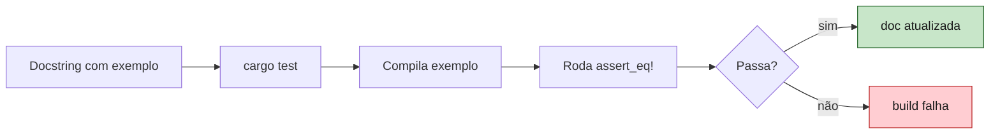

<a id="capitulo-45"></a>
# Capítulo 45: Testing — cargo test, criterion, proptest

> *"Program testing can be used to show the presence of bugs, but never to show their absence."*
> — Edsger Dijkstra

> *"In Rust, the test framework is just `cargo`. There is no framework. That is the framework."*
> — Folclore de Rust, em algum issue do GitHub

## 45.1 O Imposto Que Outras Linguagens Cobram

Em quase toda linguagem, *testar* começa com uma decisão administrativa: **qual framework?**

Em TypeScript: Jest? Vitest? Mocha? Jasmine? Cada um com configuração própria, runner próprio, sintaxe própria, integração própria com TypeScript, mocks próprios. A configuração de um repositório TypeScript médio gasta mais linhas em `jest.config.ts` do que muitos pacotes em testes de verdade.

Em Java: JUnit? TestNG? Spock? Mais Maven? Mais Gradle? Mais surefire? A burocracia compete com a lógica.

Em Go, finalmente, alguém parou de inventar: `go test` é parte do toolchain. Função começa com `Test`, recebe `*testing.T`, pronto. Foi um avanço civilizacional.

Rust olhou para Go e disse: *certo, mas vamos longe*. O resultado é que, em Rust, **não há framework de testes** — porque o Cargo *é* o framework. Você não instala dependência. Você não escreve config. Você escreve uma função, marca `#[test]`, e roda `cargo test`. Pronto.

```rust
fn add(a: i32, b: i32) -> i32 { a + b }

#[test]
fn adiciona_dois_positivos() {
    assert_eq!(add(2, 3), 5);
}
```

Sem importar `describe`, `it`, `expect`, `beforeEach`. Sem `package.json`. Sem decorator. **A linguagem já tem tudo.** Esse minimalismo é uma posição filosófica: testes são parte do programa, não um artefato anexo.

## 45.2 A Anatomia: `#[test]`, `#[cfg(test)]`, `mod tests`

Convenção universal em qualquer crate Rust idiomático:

```rust
// src/lib.rs

pub fn divide(a: i32, b: i32) -> Result<i32, String> {
    if b == 0 {
        return Err("divisão por zero".into());
    }
    Ok(a / b)
}

#[cfg(test)]
mod tests {
    use super::*;

    #[test]
    fn divide_inteiro_exato() {
        assert_eq!(divide(10, 2), Ok(5));
    }

    #[test]
    fn divide_por_zero_retorna_erro() {
        assert!(divide(10, 0).is_err());
    }
}
```

Três detalhes que valem o capítulo inteiro:

1. **`#[cfg(test)]`** é compilação condicional. O módulo `tests` só existe quando você compila com `cargo test`. No binário de produção, ele *não está lá*. Sem código morto, sem peso, sem risco de chamar acidentalmente.

2. **`mod tests` colocado no mesmo arquivo** que o código testado é a convenção idiomática. Em Rust, *teste mora ao lado da função*. Você abre o arquivo, vê a função, vê o teste, vê a relação. Sem pular para `__tests__/foo.test.ts`.

3. **`use super::*`** dá ao módulo de teste acesso a tudo do módulo pai — inclusive itens privados (`fn` sem `pub`). Você testa a unidade real, não uma fachada artificialmente exposta.

### 45.2.1 As Macros de Asserção

```rust
assert!(condicao);              // panic se false
assert_eq!(esperado, obtido);   // panic se !=, mostra os dois valores
assert_ne!(a, b);                // panic se ==

// Mensagens customizadas:
assert!(user.is_active(), "usuário {} deveria estar ativo", user.id);

// Float comparison precisa de tolerância (igualdade exata é ilusão):
assert!((computed - expected).abs() < 1e-9);
```

`assert_eq!` mostra **as duas representações com `Debug`** quando falha, o que economiza horas de "qual era o valor mesmo?".

### 45.2.2 `#[should_panic]`

Para testar que uma função *deve* falhar com panic:

```rust
#[test]
#[should_panic(expected = "divisão por zero")]
fn panic_em_zero() {
    let _ = 10 / 0; // ou uma fn que entra em panic
}
```

O `expected = "..."` é importante — sem ele, qualquer panic passa, inclusive um panic *errado* que mascara um bug.

## 45.3 Integration Tests: A Pasta `tests/`

Tudo que está em `src/` é tratado como teste **unitário** — tem acesso a internos, roda como parte do binário do crate. Mas testes que exercitam o crate **como um cliente externo** vão em `tests/`, na raiz:

```
meu_crate/
├── src/
│   └── lib.rs
└── tests/
    ├── api.rs
    └── pipeline.rs
```

Cada arquivo em `tests/` é compilado como um *crate separado*, que importa o seu via `use meu_crate::*`. Isso garante que o teste exercita só a API pública. Se você precisou de algo interno, ou expõe via `pub`, ou repensa a API.

```rust
// tests/api.rs
use meu_crate::Cliente;

#[test]
fn cliente_paga_e_marca_como_ativo() {
    let mut c = Cliente::novo("felipe@example.com");
    c.pagar(100);
    assert!(c.is_ativo());
}
```

Doctests, unit tests, integration tests — três categorias, **um único comando** (`cargo test`) que roda todas em paralelo.

## 45.4 Doctests: A Inovação Que Faltava

O exemplo na docstring **é** o teste. Quando você escreve:

```rust
/// Soma dois inteiros.
///
/// # Exemplos
///
/// ```
/// let resultado = meu_crate::soma(2, 3);
/// assert_eq!(resultado, 5);
/// ```
pub fn soma(a: i32, b: i32) -> i32 {
    a + b
}
```

`cargo test` extrai o bloco entre crases, compila, roda, e verifica que o `assert_eq!` passa. Isso resolve um dos cânceres mais antigos da documentação técnica: **exemplos que não compilam mais**.

Quando você muda a assinatura de `soma`, o exemplo na docstring *quebra a build*. A documentação não pode mentir, porque ela é executada.

Em TypeScript, JSDoc é ignorada pelo runtime. Em Java, Javadoc idem. Em Python, `doctest` existe, mas é opcional, não-idiomático, fora do toolchain padrão. Em Rust, **doctest é a documentação**.



## 45.5 Paralelismo Por Padrão

`cargo test` roda testes em paralelo, em threads diferentes, **por padrão**. Não há flag para ativar — é o estado default. Isso é uma posição polêmica e correta:

- Testes paralelos descobrem **acoplamento oculto** (estado global, race condition em mock).
- Testes paralelos rodam mais rápido — tipicamente 4-10x em hardware moderno.
- Se um teste *precisa* de serialização, ele declara: `cargo test -- --test-threads=1`.

Em Jest, o paralelismo é arroz com feijão de configuração. Em Go, `t.Parallel()` é opt-in. Em Rust, é opt-out. **A linguagem que mais leva concorrência a sério também leva paralelismo de testes a sério.**

## 45.6 Quando Asserção Não Basta: Property-Based Testing

Asserções verificam *exemplos*. Você diz: "para input X, output deve ser Y". Funciona para casos óbvios. Falha para o universo que você não imaginou.

Property-based testing inverte: você descreve uma **propriedade que vale para todo input válido**, e a biblioteca gera centenas de inputs aleatórios para tentar quebrar a propriedade.

```rust
use proptest::prelude::*;

fn reverse<T: Clone>(v: &[T]) -> Vec<T> {
    v.iter().rev().cloned().collect()
}

proptest! {
    #[test]
    fn reverse_eh_involucao(v: Vec<i32>) {
        // reverse(reverse(v)) == v, para qualquer v
        prop_assert_eq!(reverse(&reverse(&v)), v);
    }

    #[test]
    fn reverse_preserva_tamanho(v: Vec<i32>) {
        prop_assert_eq!(reverse(&v).len(), v.len());
    }
}
```

`proptest` vai gerar 256 vetores diferentes (default) — vazios, com 1 elemento, com 1000, com valores extremos. Quando encontra um que falha, ele **shrinka**: tenta reduzir o input ao menor caso que ainda quebra. Em vez de te entregar `[847, -293, 1024, 0, ..., 99]`, ele te entrega `[1, 2]` — o caso mínimo.

Isso encontra bugs que asserções nunca encontrariam: overflow em soma, ordenação que falha em strings com unicode, parser que quebra em string vazia, serialização que perde precisão em float específico.

Para invariantes de negócio (impostos, taxas, cálculos financeiros, serialização roundtrip), property tests valem ouro:

```rust
proptest! {
    #[test]
    fn json_roundtrip_preserva_valor(user: User) {
        let json = serde_json::to_string(&user).unwrap();
        let restored: User = serde_json::from_str(&json).unwrap();
        prop_assert_eq!(user, restored);
    }
}
```

`quickcheck` é a alternativa mais antiga, com API mais minimal. `proptest` é mais flexível e idiomática. A escolha é gosto.

## 45.7 Benchmarks: criterion

`#[bench]` existe no compilador, mas requer Rust nightly e tem estatísticas pobres. A comunidade convergiu em **criterion**: estável, com warm-up, detecção de regressão, gráficos.

```rust
// benches/parse.rs
use criterion::{criterion_group, criterion_main, Criterion, black_box};
use meu_crate::parse;

fn bench_parse(c: &mut Criterion) {
    let input = include_str!("fixtures/large.json");
    c.bench_function("parse_large_json", |b| {
        b.iter(|| parse(black_box(input)))
    });
}

criterion_group!(benches, bench_parse);
criterion_main!(benches);
```

```toml
# Cargo.toml
[dev-dependencies]
criterion = { version = "0.5", features = ["html_reports"] }

[[bench]]
name = "parse"
harness = false
```

`cargo bench` roda. Criterion:

1. **Aquece** o cache (warm-up loops sem medir).
2. **Mede** dezenas de iterações em chunks.
3. **Calcula intervalo de confiança** estatístico.
4. **Compara com a última run** salva. Te diz: "mais lento por 3.2% (p < 0.01)" ou "sem mudança significativa".
5. Gera relatório HTML com gráficos.

`black_box` é o detalhe que separa bench amador de bench correto: ele impede o compilador de otimizar a chamada. Sem `black_box`, o LLVM percebe que você está chamando `parse` em loop sem usar o resultado, e *deleta a chamada*. Você benchmarka o nada.

Em TypeScript, benchmark sério vira `tinybench` + `vitest bench`. Em Go, `testing.B` é built-in mas mais cru. Em Rust, criterion ocupa um nicho onde rigor estatístico **não é opcional**.

## 45.8 Mocks: mockall

A maior parte do código Rust idiomático evita mocks. Funções puras não precisam — você passa input, verifica output. Repositórios podem ter implementação `InMemory` que é fake, não mock. Mas quando você *precisa* mockar — tipicamente em fronteira de I/O — `mockall` gera implementações automaticamente:

```rust
use mockall::*;

#[automock]
trait Repositorio {
    fn buscar_usuario(&self, id: u64) -> Option<String>;
}

fn saudacao(repo: &dyn Repositorio, id: u64) -> String {
    match repo.buscar_usuario(id) {
        Some(nome) => format!("Olá, {nome}"),
        None => "Olá, anônimo".into(),
    }
}

#[test]
fn saudacao_usa_nome_do_repo() {
    let mut mock = MockRepositorio::new();
    mock.expect_buscar_usuario()
        .with(predicate::eq(42))
        .times(1)
        .returning(|_| Some("Felipe".into()));

    assert_eq!(saudacao(&mock, 42), "Olá, Felipe");
}
```

Gosto pessoal: prefira **fakes** a **mocks**. Um `InMemoryRepository` que implementa o trait com um `HashMap` é mais reutilizável, mais legível, e mais resiliente a mudanças do que `expect_buscar_usuario().times(1)`. Mas o ferramental existe para quando o mock for o caminho correto.

## 45.9 Integration Real: testcontainers

Se você está testando código que fala com Postgres, Redis, Kafka — não mocke. Suba o real, em container, no início do teste. `testcontainers-rs`:

```rust
use testcontainers::{clients, images::postgres::Postgres};

#[test]
fn migra_usuarios_para_v2() {
    let docker = clients::Cli::default();
    let pg = docker.run(Postgres::default());
    let port = pg.get_host_port_ipv4(5432);
    let url = format!("postgres://postgres@localhost:{port}/postgres");

    let pool = conectar(&url);
    rodar_migrations(&pool);
    inserir_usuarios_v1(&pool, 100);

    migrar_para_v2(&pool);

    assert_eq!(contar_usuarios_v2(&pool), 100);
}
```

O container sobe, o teste roda, o container morre. Sem estado compartilhado, sem "rode `make db-test` antes". O teste **descreve seu mundo** e o constrói.

Em Go, `testcontainers-go` existe e faz o mesmo. Em TS, `testcontainers` também. A diferença é que, em Rust, isso se integra ao mesmo `cargo test` que tudo o mais — sem runner separado, sem matriz de framework.

## 45.10 O Panorama

| Capacidade | TS Jest/Vitest | Go testing | Java JUnit | Rust cargo test |
|---|---|---|---|---|
| Built-in no toolchain | Não | Sim | Não | **Sim** |
| Configuração | jest.config.ts | Zero | pom.xml + plugins | **Zero** |
| Paralelismo default | Sim (config) | `t.Parallel()` opt-in | Configurável | **Sim, sempre** |
| Doctests | JSDoc não roda | `Example` em godoc | Não nativo | **Sim, idiomático** |
| Property tests | fast-check | gopter | jqwik | **proptest, mainstream** |
| Benchmarks | tinybench | testing.B | JMH | **criterion, gold standard** |
| Mocks built-in | Sim (jest.mock) | Não | Mockito | mockall (crate) |
| Integration real | testcontainers | testcontainers | testcontainers | **testcontainers** |

Cargo test é a tese de que **testes são uma propriedade da linguagem**, não um produto comprado à parte. Você escreve uma função, marca `#[test]`, ela roda. Você escreve um exemplo, ele roda. Você escreve uma propriedade, ela é verificada em 256 inputs aleatórios. Tudo no mesmo comando, em paralelo, sem framework.

> *"A pergunta não é se a sua linguagem tem testes. É se ela trata testes como cidadão de primeira classe ou como dependência opcional."*

[Próximo: Capítulo 46 — Workspaces, Features e Conditional Compilation →](ch46-workspaces-features.md)
