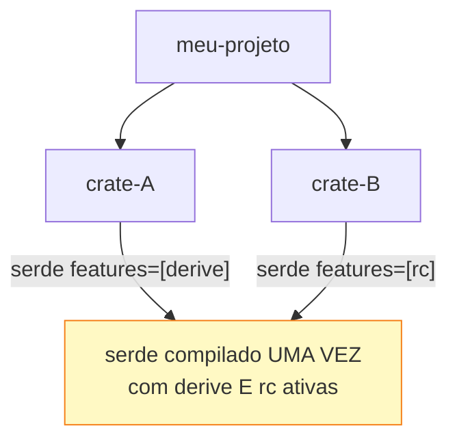

<a id="capitulo-46"></a>
# Capítulo 46: Workspaces, Features e Conditional Compilation

> *"Monorepos are not a technology problem. They are a build system problem."*
> — Folclore Google, em algum tech talk de 2015

> *"Cargo workspaces are the gold standard. The rest of the industry is catching up."*
> — Engenheiro do Tokio, em algum thread de Reddit

## 46.1 Por Que Monorepo, e Por Que É Difícil

Toda empresa que cresce passa pelo mesmo dilema. Você começa com um repositório por projeto. Cada projeto tem seu `package.json`, seu `go.mod`, seu `pom.xml`. Cada um lockado em uma versão de cada dependência. Cada um com seu CI.

Aí o time cresce. Você tem 30 serviços. 5 bibliotecas internas compartilhadas. Quando o utilitário `auth-lib` ganha um patch, você precisa atualizar 30 `package.json`. Quando uma vulnerabilidade aparece em `lodash`, você abre 30 PRs.

O monorepo resolve isso — *se* o seu sistema de build aguentar. JavaScript inventou Lerna, depois Nx, depois Turborepo, depois pnpm workspaces, cada um corrigindo o anterior. Java tem Gradle multi-module com configuração impressionante. Go tem `go.work` desde 2022 (apenas), uma adição tardia.

Rust nasceu pensando nisso. **Cargo workspaces existem desde 2017**. E são considerados, pela maior parte da comunidade que já tocou outras ferramentas, **o gold standard** do tema.

## 46.2 A Estrutura Mínima

Um workspace é literalmente um `Cargo.toml` com `[workspace]`:

```toml
# Cargo.toml na raiz
[workspace]
resolver = "2"
members = [
    "crates/api",
    "crates/db",
    "crates/auth",
    "crates/common",
]
```

```
meu-projeto/
├── Cargo.toml         # workspace
├── Cargo.lock         # ÚNICO, compartilhado por todos
├── target/            # ÚNICO, compartilhado por todos
└── crates/
    ├── api/
    │   ├── Cargo.toml
    │   └── src/
    ├── db/
    │   ├── Cargo.toml
    │   └── src/
    ├── auth/
    │   ├── Cargo.toml
    │   └── src/
    └── common/
        ├── Cargo.toml
        └── src/
```

Quatro coisas que esse layout te dá *grátis*:

1. **Um único `Cargo.lock`** — todas as crates resolvem para a mesma versão de cada dependência. Sem hell de "por que `serde 1.0.190` aqui e `serde 1.0.193` ali?".
2. **Um único `target/`** — quando `common` é compilado uma vez, `api`, `db` e `auth` reusam o artefato. Build de monorepo Rust é incremental por design.
3. **Comandos workspace-wide** — `cargo build --workspace`, `cargo test --workspace`, `cargo clippy --workspace`. Zero loop manual sobre subdiretórios.
4. **Path dependencies sem fricção** — `api` depende de `common` via `common = { path = "../common" }`, e o Cargo entende como parte do mesmo grafo.

### 46.2.1 Workspace Virtual vs Workspace com Pacote Raiz

Se a raiz **só agrupa membros** sem ser ela mesma uma crate publicável:

```toml
# Cargo.toml virtual (sem [package])
[workspace]
resolver = "2"
members = ["crates/*"]
```

Esse é o caso comum em monorepo: a raiz é coordenadora, não publica binário ou lib. Note o glob `"crates/*"` — você não precisa listar manualmente cada subdiretório novo.

Se a raiz *é* a crate principal e os membros são satélites (caso clássico: a crate principal + plugins/exemplos):

```toml
[package]
name = "tokio"
version = "1.38.0"

[workspace]
members = ["tokio-util", "tokio-stream"]
```

Os dois são válidos. Para serviços, prefira virtual. Para libraries, geralmente o padrão com pacote raiz.

## 46.3 `[workspace.dependencies]`: A Versão Única

Aqui o Cargo deixa todo concorrente para trás. Em workspaces médios (10+ crates), o pesadelo de manter versões consistentes é real:

```toml
# Antes do Rust 1.64: cada Cargo.toml repete a versão
# crates/api/Cargo.toml
[dependencies]
serde = { version = "1.0.193", features = ["derive"] }
tokio = { version = "1.36", features = ["full"] }

# crates/db/Cargo.toml
[dependencies]
serde = { version = "1.0.190", features = ["derive"] } # OPS, divergiu
tokio = { version = "1.35", features = ["full"] }       # OPS, divergiu
```

Desde Rust 1.64, **declare a versão uma vez** no workspace e cada membro herda:

```toml
# Raiz Cargo.toml
[workspace]
resolver = "2"
members = ["crates/*"]

[workspace.dependencies]
serde = { version = "1.0.193", features = ["derive"] }
tokio = { version = "1.36", features = ["full"] }
sqlx = { version = "0.7", features = ["postgres", "runtime-tokio-rustls"] }
anyhow = "1"
thiserror = "1"
```

```toml
# crates/api/Cargo.toml
[package]
name = "api"
version = "0.1.0"
edition = "2021"

[dependencies]
serde.workspace = true
tokio.workspace = true
anyhow.workspace = true
common = { path = "../common" }
```

```toml
# crates/db/Cargo.toml
[dependencies]
serde.workspace = true
sqlx.workspace = true
common = { path = "../common" }
# tokio NÃO é incluído aqui — db não precisa
```

Cada membro escolhe **quais** dependências do workspace usar — mas não **qual versão**. A versão é única, é central, é uma fonte da verdade.

Se um membro precisa de uma feature extra, ele pode adicionar:

```toml
[dependencies]
serde = { workspace = true, features = ["rc"] }  # adiciona ao que já está no workspace
```

Outras chaves herdáveis via `[workspace.package]`:

```toml
[workspace.package]
version = "0.1.0"
edition = "2021"
authors = ["Felipe Ness <felipe@example.com>"]
license = "MIT"
repository = "https://github.com/felipe-ness/projeto"

# nos membros:
[package]
name = "api"
version.workspace = true
edition.workspace = true
authors.workspace = true
license.workspace = true
repository.workspace = true
```

Bump de versão coordenado entre 20 crates? Uma linha alterada na raiz.

### 46.3.1 Lints Compartilhados

Desde Rust 1.74, lints também herdam:

```toml
# Raiz
[workspace.lints.rust]
unsafe_code = "forbid"
unused_imports = "warn"

[workspace.lints.clippy]
unwrap_used = "warn"
expect_used = "warn"
todo = "warn"

# Cada membro
[lints]
workspace = true
```

Um único contrato de qualidade para todo o monorepo.

## 46.4 Features: Conditional Compilation Como Cidadão de Primeira Classe

Features Rust resolvem três problemas distintos com um mecanismo só:

1. **Dependências opcionais** — `tokio` só se você precisar de async; `rayon` só se você quiser paralelismo CPU-bound.
2. **Implementações alternativas** — TLS via `rustls` ou via `native-tls`, escolha sua.
3. **Código condicional** — debug helpers que só existem em build de dev.

```toml
# Cargo.toml
[features]
default = ["tls"]
tls = ["dep:rustls"]
native-tls = ["dep:native-tls"]
metrics = ["dep:prometheus"]
debug-logs = []

[dependencies]
rustls = { version = "0.23", optional = true }
native-tls = { version = "0.2", optional = true }
prometheus = { version = "0.13", optional = true }
```

```rust
// src/lib.rs
#[cfg(feature = "tls")]
pub fn connect_tls(host: &str) { /* usa rustls */ }

#[cfg(feature = "native-tls")]
pub fn connect_tls(host: &str) { /* usa native-tls */ }

#[cfg(feature = "metrics")]
pub mod metrics; // módulo inteiro só existe se a feature ativa

#[cfg(feature = "debug-logs")]
fn dump_state(s: &State) {
    eprintln!("{s:#?}"); // útil só em desenvolvimento
}
```

Cliente que consome a crate escolhe:

```toml
[dependencies]
minha-lib = { version = "1.0", features = ["metrics"], default-features = false }
# - desliga "tls" (que estava em default)
# - liga "metrics"
```

### 46.4.1 O `dep:` Prefix

Pegadinha sutil. Quando você declara `optional = true`, Cargo cria automaticamente uma feature com o mesmo nome da dependência. Isso vaza a estrutura interna:

```toml
[dependencies]
rustls = { version = "0.23", optional = true }
# Implicitamente cria a feature "rustls"
```

O cliente pode escrever `features = ["rustls"]` e funciona. Mas se você renomear a dep ou trocar de biblioteca, **quebra a API pública**. A solução desde Rust 1.60 é o `dep:`:

```toml
[features]
tls = ["dep:rustls"]   # "rustls" não vira feature; só "tls" é a feature pública

[dependencies]
rustls = { version = "0.23", optional = true }
```

Agora sua API é a feature `tls`. A implementação é privada. Se trocar `rustls` por `boring`, ninguém percebe.

### 46.4.2 `cfg`: Mais Que Features

`#[cfg(...)]` é um sistema de predicados sobre o ambiente de build:

```rust
#[cfg(target_os = "linux")]
fn syscall_specifico() { /* ... */ }

#[cfg(target_arch = "x86_64")]
fn intrinsic_avx() { /* ... */ }

#[cfg(all(unix, feature = "metrics"))]
fn unix_metrics() { /* ... */ }

#[cfg(any(target_os = "macos", target_os = "ios"))]
fn apple_kqueue() { /* ... */ }

#[cfg(not(test))]
fn so_em_producao() { /* ... */ }
```

Para condições complexas, a macro `cfg_if!` deixa o código legível:

```rust
use cfg_if::cfg_if;

cfg_if! {
    if #[cfg(target_os = "linux")] {
        mod backend { /* epoll */ }
    } else if #[cfg(any(target_os = "macos", target_os = "ios"))] {
        mod backend { /* kqueue */ }
    } else if #[cfg(windows)] {
        mod backend { /* IOCP */ }
    } else {
        compile_error!("plataforma não suportada");
    }
}
```

`compile_error!` é a porta de saída digna: se a configuração não faz sentido, a build falha com mensagem clara em vez de produzir binário quebrado.

## 46.5 Feature Unification: A Pegadinha

Aqui mora um pitfall que custa horas a quem não conhece.

**Cargo unifica features**. Se duas crates do seu grafo dependem de `serde` e uma pede `feature = ["derive"]` enquanto a outra pede `feature = ["rc"]`, Cargo compila `serde` *uma vez*, com **ambas** as features ativas.



Por que isso importa:

1. **Features devem ser aditivas**. Ativar uma feature *adiciona* funcionalidade, nunca remove ou muda comportamento. Se sua feature `no-std` *desabilita* `std`, e outra crate do grafo pede `std`, alguém vai ficar irritado e o build vai quebrar.
2. **Anti-padrão**: a feature `std` deve *adicionar* APIs que requerem std, não negar `no_std`. Estrutura idiomática:

   ```rust
   #![cfg_attr(not(feature = "std"), no_std)]

   // Funções básicas: sempre disponíveis
   pub fn parse(s: &str) -> Result<Foo, Error> { /* ... */ }

   // Funções que precisam de std: opt-in
   #[cfg(feature = "std")]
   pub fn parse_from_file(path: &std::path::Path) -> Result<Foo, Error> { /* ... */ }
   ```

3. **Features mutuamente exclusivas são um anti-pattern**. Se você precisa de "ou TLS X ou TLS Y, nunca ambos", a unificação te trai. Soluções:

   ```rust
   // Detecta o conflito em compile time:
   #[cfg(all(feature = "rustls", feature = "native-tls"))]
   compile_error!("ative só uma das features TLS: rustls OU native-tls");
   ```

   Mas a melhor solução é **separar em crates diferentes** (`minha-lib-rustls`, `minha-lib-native-tls`) ou aceitar runtime config.

### 46.5.1 Resolver v2 e v3

Versão 2 (Rust 1.51) e versão 3 (Rust 1.84) do resolver corrigem unificações indesejadas:

- Features de `dev-dependencies` não vazam para builds normais.
- Features de `build-dependencies` (build scripts, proc macros) ficam isoladas das normais.
- Features de deps platform-specific (`[target.'cfg(unix)'.dependencies]`) só ativam no target relevante.

Sempre declare:

```toml
[workspace]
resolver = "3"
```

Em workspaces virtuais é **obrigatório** (não há `[package]` para inferir). Em workspaces com pacote raiz, herda do `package.edition`, mas explicitar é boa prática.

## 46.6 Diagnóstico: `cargo tree`

Quando o monorepo cresce, perguntas sobre o grafo viram comuns: "por que `tokio 1.32` aparece se eu pedi `1.36`?", "que features de `serde` estão ativas?". `cargo tree` responde:

```bash
cargo tree                          # árvore completa
cargo tree -e features              # mostra features de cada dep
cargo tree -i serde                 # quem depende de serde (inverso)
cargo tree -d                       # mostra duplicações (versão diferente da mesma crate)
cargo tree -f "{p} {f}"            # formato custom: pacote + features
```

Em um repo com 200 crates, `cargo tree -d` é a primeira coisa que você roda quando builds ficam lentas. Geralmente revela algo como `serde 1.0.190` E `serde 1.0.193` no mesmo grafo, porque uma dep transitiva fixou um caret restritivo.

## 46.7 Comparação Cruzada

| Capacidade | TS pnpm workspaces | Go go.work | Java Gradle multi-module | Rust Cargo workspace |
|---|---|---|---|---|
| Versão única de dep compartilhada | `pnpm` overrides | Não nativo | `dependencyManagement` | **`[workspace.dependencies]`** |
| Lock único | `pnpm-lock.yaml` | `go.sum` por módulo | Não | **`Cargo.lock` único** |
| Build cache compartilhado | Por workspace tool (Nx, Turbo) | `GOCACHE` global | Gradle daemon + cache | **`target/` único** |
| Path deps zero-config | `workspace:*` | `replace` | Sim | **Sim, sem ceremony** |
| Lints unificados | ESLint config compartilhado | Sem nativo | Sim, com plugin | **`[workspace.lints]`** |
| Conditional compilation | `process.env.NODE_ENV` | build tags | Profiles + classifiers | **`#[cfg]` first-class** |
| Feature flags em dep | Não nativo | build tags | Não | **`[features]` nativo** |
| Diagnóstico do grafo | `pnpm why` | `go mod why` | `gradle dependencies` | **`cargo tree`** |
| Quando foi inventado | 2017 (Lerna) → 2021 (pnpm) | **2022** | ~2010 (multi-module) | **2017** |

`go.work` chegou em 2022 e ainda não tem versão única — cada `go.mod` mantém suas dependências. JavaScript tem múltiplas soluções competindo, cada uma corrigindo defeitos da anterior. Java/Gradle é poderoso mas exige especialista para configurar. **Cargo workspace é o único caso onde "monorepo" é uma feature de duas linhas no manifest**.

## 46.8 O Veredito

Você pode escrever um workspace Rust em uma tarde e ter, gratuitamente:

- Versão única de cada dep, central e auditável.
- Build incremental compartilhado.
- Lints uniformes.
- Comandos workspace-wide.
- Feature flags por crate, escopadas, com unificação correta.
- Diagnóstico do grafo embutido.

Em outras linguagens, cada um desses itens é uma decisão arquitetural com implicações. Em Rust, é o default. Esse é o tipo de coisa que não aparece em benchmark, mas determina se um time de 30 pessoas consegue trabalhar no mesmo repositório sem se odiar.

> *"Linguagens são julgadas por seu pior dia. O pior dia de um monorepo Rust ainda é melhor que o melhor dia de um monorepo Java."*

[Próximo: Parte 17 — Async e Concorrência →](../part-17-async/ch47-async-await.md)
