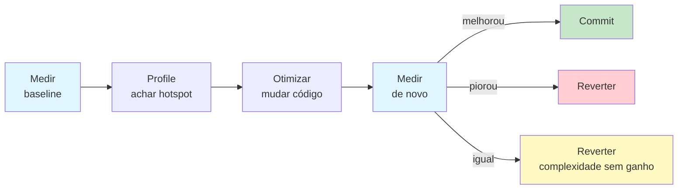
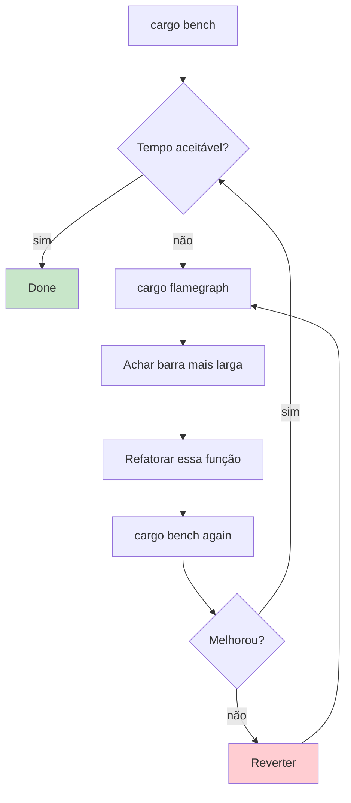

<a id="capitulo-48"></a>
# Capítulo 48: Profiling e Benchmarking

> *"Premature optimization is the root of all evil. Yet we should not pass up our opportunities in that critical 3%."*
> — Donald Knuth, *Structured Programming with go to Statements* (1974)

> *"Measure. Don't guess. Don't hope. Don't pray. Measure."*
> — Bryan Cantrill

## 48.1 A Regra Antes da Régua

Há duas formas de discutir performance: **com números** e **sem números**. A segunda é torcida ideológica. A primeira é engenharia.

Toda vez que você ouve "Rust é mais rápido que Go", "esse algoritmo é O(n log n)", "essa otimização é melhor", e a frase não é seguida por *números medidos com rigor*, você está ouvindo opinião. Pode ser opinião informada. Mas é opinião.

Engenharia de performance se faz num ciclo de quatro passos, sem atalho:



Pular qualquer um desses passos é caridade para futuros bugs. Otimizar sem medir é superstição. Medir sem profile é palpite. Profile sem mudança é teatro. Mudar sem medir de novo é negligência.

Este capítulo ensina cada passo, com as ferramentas que a comunidade Rust convergiu nas últimas duas décadas.

## 48.2 O Primeiro Salto: Debug versus Release

Antes de qualquer ferramenta sofisticada, há uma armadilha que devora newcomers. Considere o benchmark mais ingênuo possível:

```rust
// src/main.rs
fn main() {
    let n: u64 = 100_000_000;
    let inicio = std::time::Instant::now();
    let total: u64 = (1..=n).sum();
    let duracao = inicio.elapsed();
    println!("total = {}, tempo = {:?}", total, duracao);
}
```

Rodando com `cargo run`:

```
total = 5000000050000000, tempo = 1.124s
```

Rodando com `cargo run --release`:

```
total = 5000000050000000, tempo = 142ns
```

**Um fator de 7,9 milhões de vezes**. O loop foi executado em debug; em release, o LLVM percebeu que `(1..=n).sum()` é a fórmula de Gauss e substituiu por `n * (n+1) / 2`. Otimização constante.

A lição: **nenhum benchmark em modo debug significa nada**. Cada vez que você medir performance em Rust, garanta que está em release. `cargo bench` faz isso automaticamente. `cargo run` não.

Comparemos com **Go**: `go run` e `go build` produzem código otimizado por padrão. Não há "debug mode" no sentido do Rust. Isso simplifica o ferramental de Go, mas custa em tempo de compilação para iteração rápida.

Comparemos com **C/C++**: `gcc` e `clang` sem flag não otimizam. Você precisa `-O2` ou `-O3`. O default é debug, igual ao Rust. O ecossistema cmake/meson cuida disso com builds Release/Debug — mas é responsabilidade do build system, não da linguagem.

Comparemos com **TypeScript/Node**: V8 sempre JIT-otimiza após hot path. Não há "debug mode" — mas há *cold start* e *warmup*. Benchmarks naïves de 100ms em JS são frequentemente 90% warmup.

## 48.3 cargo bench e criterion.rs

A primeira ferramenta que todo Rustacean instala é o **criterion.rs**. É a biblioteca de benchmarking estatístico do ecossistema, com três features que matam:

1. **Estatística honesta**: mede média, desvio padrão, intervalo de confiança, e detecta outliers automaticamente.
2. **Detecção de regressão**: compara contra runs anteriores e te avisa se sua mudança piorou as coisas em 5% ou mais.
3. **Plots HTML**: gera gráficos com a distribuição completa das medições, não só médias mentirosas.

```toml
# Cargo.toml
[dev-dependencies]
criterion = { version = "0.5", features = ["html_reports"] }

[[bench]]
name = "soma"
harness = false
```

```rust
// benches/soma.rs
use criterion::{black_box, criterion_group, criterion_main, Criterion};

fn soma_iter(n: u64) -> u64 {
    (0..n).filter(|x| x % 2 == 0).map(|x| x * x).sum()
}

fn soma_loop(n: u64) -> u64 {
    let mut total = 0u64;
    let mut i = 0u64;
    while i < n {
        if i % 2 == 0 { total += i * i; }
        i += 1;
    }
    total
}

fn bench_soma(c: &mut Criterion) {
    let mut grupo = c.benchmark_group("soma_pares_quadrado");
    for &n in &[1_000u64, 10_000, 100_000, 1_000_000] {
        grupo.bench_with_input(format!("iter/{}", n), &n, |b, &n| {
            b.iter(|| soma_iter(black_box(n)))
        });
        grupo.bench_with_input(format!("loop/{}", n), &n, |b, &n| {
            b.iter(|| soma_loop(black_box(n)))
        });
    }
    grupo.finish();
}

criterion_group!(benches, bench_soma);
criterion_main!(benches);
```

`black_box` é crucial. Sem ele, o LLVM percebe que o resultado da função não é usado e elide a função inteira. `black_box` força o compilador a tratar o valor como opaco, impedindo a otimização. É o "no, you must actually run this" do benchmarking.

Rodando `cargo bench`:

```
soma_pares_quadrado/iter/1000000
                        time:   [481.23 µs 482.10 µs 482.99 µs]
                        change: [-0.34% +0.12% +0.61%] (p = 0.65 > 0.05)
                        No change in performance detected.

soma_pares_quadrado/loop/1000000
                        time:   [479.88 µs 480.76 µs 481.71 µs]
                        change: [-0.21% +0.18% +0.55%] (p = 0.41 > 0.05)
                        No change in performance detected.
```

Note as três medições: limite inferior, mediana, limite superior. O `change` compara com o último run salvo em `target/criterion`. O `p-value` te diz se a diferença é estatisticamente significativa. Isso é benchmarking com rigor.

Comparemos com **Go**: `testing.B` no stdlib é simples e bom. `b.N` cresce até o tempo total ser significativo. Não tem detecção automática de regressão (precisa `benchstat` à parte). Suficiente para 80% dos casos.

Comparemos com **JavaScript**: `Benchmark.js` é o equivalente, com estatística honesta. Mas o JS sofre com warmup — você precisa rodar 1000+ vezes antes de medir, senão está medindo o JIT.

Comparemos com **C++**: Google Benchmark é o equivalente direto do criterion. Mesma filosofia. Funciona bem.

## 48.4 iai: Benchmarks Determinísticos

Criterion mede tempo de relógio. Tempo de relógio varia: outro processo no CPU, throttling térmico, frequência turbo, cache da L3 lotada por outro processo. Em CI, isso ruge — runs são instáveis, regressões falsas-positivas pipocam.

Para benchmarks **determinísticos**, há o `iai`. Ele usa Cachegrind (do Valgrind) para contar **número exato de instruções** executadas. Não mede tempo. Mede trabalho.

```toml
[dev-dependencies]
iai = "0.1"

[[bench]]
name = "iai_soma"
harness = false
```

```rust
use iai::black_box;

fn iai_soma_iter() -> u64 {
    (0..black_box(1_000_000u64))
        .filter(|x| x % 2 == 0)
        .map(|x| x * x)
        .sum()
}

iai::main!(iai_soma_iter);
```

Saída:

```
iai_soma_iter
  Instructions:           4_812_344
  L1 Accesses:            7_201_009
  L2 Accesses:                  127
  RAM Accesses:                  41
  Estimated Cycles:       4_815_523
```

Esses números são **bit-exatos** entre runs. Sua CI pode falhar com tolerância de zero. Trade-off: Cachegrind é 50-100x mais lento que execução nativa, então você não roda iai a cada commit, mas em PRs que mexem em hot paths.

Comparemos: nem **Go**, nem **C++**, nem **JavaScript** tem equivalente nativo. Você precisa hackear `valgrind --tool=callgrind` à mão. Em Rust, é uma dev-dependency.

## 48.5 Profiling: Achar o Hotspot

Benchmark te diz **quanto** sua função demora. Profile te diz **onde** o tempo é gasto. Você precisa dos dois — benchmark para detectar problema, profile para diagnosticar.

A ferramenta mais usada em Rust é **cargo-flamegraph**. Instala com:

```bash
cargo install flamegraph
```

E roda com:

```bash
cargo flamegraph --bin minha-app
```

Em Linux, ele usa `perf`. Em macOS, `xctrace`/`dtrace`. Em Windows, `blondie` (driver nativo de profiling), funciona sem ferramentas externas.

O resultado é um SVG interativo: cada caixa é uma função, a largura é o tempo gasto nela (e descendentes), o eixo Y é a profundidade da call stack. Hotspots são as colunas largas. Você clica numa caixa para zoomar.

Workflow real:

```bash
# 1. Benchmark identifica que processar() está lento
cargo bench

# 2. Flamegraph diz por quê
cargo flamegraph --bench meu_bench -- --bench

# 3. Olhando o SVG, vejo que 60% do tempo está em parse_json::deserialize
# 4. Refatoro: cache do schema, evito alocação
# 5. Benchmark de novo
cargo bench

# 6. Comparar
# Antes: 481 µs ± 12 µs
# Depois: 142 µs ± 4 µs (-70.5%)
```

Esse é o ciclo. Não há mágica.



## 48.6 samply: Profiler Cross-Platform

Flamegraph é maravilhoso, mas em Linux tem um requisito: `perf` precisa de privilégios elevados (`sysctl kernel.perf_event_paranoid=-1`). Em ambientes corporativos, isso é fricção.

`samply` é uma alternativa moderna, escrita em Rust, com excelente UX. Funciona em Linux, macOS e Windows sem privilégios. Gera um perfil que abre direto no Firefox Profiler — uma das melhores UIs de profiling existentes.

```bash
cargo install samply
samply record ./target/release/minha-app
```

O Firefox Profiler te dá:

- **Call tree**: mesma view de flamegraph, mas hierárquica.
- **Marker chart**: pode marcar eventos custom no seu código.
- **Stack chart**: timeline empilhado.
- **Compare profiles**: abrir dois e ver diff.

Para projetos novos em 2026, eu recomendo `samply` antes de `cargo flamegraph`. Funciona out-of-the-box, sem permissões, em qualquer plataforma.

Comparemos com **Go**: `go tool pprof` é absurdamente bom. Built-in, web UI nativa, integra com `net/http/pprof` para profiling em produção. Esse é o ponto onde Go bate todo mundo. Rust tem `pprof-rs` como crate, mas a UX é menor que Go.

Comparemos com **TypeScript/Node**: Chrome DevTools Profiler é excelente. `--inspect` no Node, abre o DevTools, grava perfil. UI ótima. Funciona para servidores Node em produção via `--inspect=0.0.0.0:9229`.

Comparemos com **C/C++**: Linux `perf` direto, ou `valgrind --tool=callgrind` (lento mas detalhado), ou Intel VTune (proprietário, mas o melhor). O ecossistema é fragmentado e a curva de aprendizado é alta.

## 48.7 Heap Profiling com dhat

CPU é metade da história. Heap allocation é outra metade — especialmente em Rust, onde `Vec::push`, `String::format!`, `Box::new`, `Arc::clone` são fontes silenciosas de pressão de memória.

`dhat-rs` é a porta de Valgrind/DHAT para Rust. Mostra:

- Quantas alocações cada call stack fez.
- Quanto cada call stack alocou em pico.
- "Curtas vs longas" — alocações que viveram microssegundos versus minutos.

```rust
// src/main.rs
#[global_allocator]
static ALLOC: dhat::Alloc = dhat::Alloc;

fn main() {
    let _profiler = dhat::Profiler::new_heap();
    // ...código real...
}
```

Roda normalmente, abre `dhat-heap.json` em `https://nnethercote.github.io/dh_view/dh_view.html`. Você descobre quando uma função pequena está alocando 100 MB porque chama `format!()` num loop.

Em **Go**, `pprof` faz heap profiling embutido. `import _ "net/http/pprof"` e `go tool pprof http://localhost:6060/debug/pprof/heap`. Excelente.

Em **Java**, JVisualVM, JFR, async-profiler — toolkit maduro porque o GC sempre foi protagonista da JVM.

Em **C/C++**, `valgrind --tool=massif` ou `heaptrack`. Funcionam, mas lentos.

## 48.8 cargo-asm: Olhar o Assembly

Quando você precisa entender por que uma função é mais rápida que outra, e ambos os benchmarks são confiáveis, a próxima pergunta é: **o que o compilador realmente gerou?**

`cargo-asm` te mostra o assembly da função:

```bash
cargo install cargo-asm
cargo asm minha_crate::soma_iter --rust
```

Saída (truncada):

```asm
example::soma_iter:
        test    rdi, rdi
        je      .LBB0_1
        xor     eax, eax
        mov     rdx, rdi
        and     rdx, -2
        je      .LBB0_5
        ...
        vpaddq  ymm0, ymm0, ymm1     ; SIMD! AVX2 add
        vpaddq  ymm0, ymm0, ymm2
        ...
```

Aqueles `vpaddq ymm0, ...` são instruções AVX2 — SIMD de 256 bits. O compilador vetorizou seu loop automaticamente. Isso é a confirmação visual do que o benchmark sugeria.

Em **C/C++**, o equivalente é Compiler Explorer (godbolt.org), que é o gold standard. Funciona para Rust também (Rust foi adicionado em 2017), e é sem dúvida a melhor forma de inspecionar assembly: você cola código, escolhe rustc + flags, vê o assembly lado-a-lado. **Use Godbolt.** É gratuito, online, indispensável.

## 48.9 perf, Linux Real

Para profiling de produção em Linux, `perf` é o padrão. É um wrapper de eventos de hardware do kernel — pode contar:

- Cycles, instructions, IPC (instructions per cycle).
- Cache misses (L1, L2, L3).
- Branch mispredictions.
- TLB misses.

```bash
perf stat ./target/release/minha-app
```

Saída:

```
       1234.56 msec task-clock                #    0.998 CPUs utilized
             7 context-switches               #    5.671 /sec
   4,812,345,678 cycles                       #    3.901 GHz
   9,123,456,789 instructions                 #    1.90  insn per cycle
  1,234,567,890 branches                      #    1.000 G/sec
       3,456,789 branch-misses                #    0.28% of all branches
```

`1.90 insn per cycle` é decente. Modernos CPUs podem fazer 4+ IPC. Branch miss de 0.28% é ótimo. Se ver 5%+ de branch miss, você tem branches imprevisíveis num hot loop, e o capítulo 49 é seu amigo.

Para visualizar perf em call graph:

```bash
perf record -g ./target/release/minha-app
perf report
```

`perf` é o mais poderoso, mas não é portável (só Linux). Para CI cross-platform, `samply` é o caminho.

## 48.10 Caso Real: De 481 µs para 142 µs

Para fechar o capítulo, um exemplo concreto. Função: contar quantas linhas de um arquivo grande contêm uma palavra.

**Versão 0** (ingênua):

```rust
fn contar_v0(arquivo: &str, palavra: &str) -> usize {
    let conteudo = std::fs::read_to_string(arquivo).unwrap();
    conteudo
        .lines()
        .filter(|linha| linha.contains(palavra))
        .count()
}
```

Benchmark com arquivo de 100 MB, palavra "rust":

```
contar_v0    time: [142.3 ms 143.1 ms 143.9 ms]
```

Roda `cargo flamegraph` e o flamegraph mostra: 78% do tempo em `String::contains` → `str::find` → `core::str::pattern`. O algoritmo de busca de substring é genérico, e para uma palavra de 4 letras, faz mais trabalho que o necessário.

**Versão 1** (substituir por `memchr`-style com `bytes()`):

```rust
fn contar_v1(arquivo: &str, palavra: &str) -> usize {
    let conteudo = std::fs::read(arquivo).unwrap();
    let palavra_bytes = palavra.as_bytes();
    conteudo
        .split(|&b| b == b'\n')
        .filter(|linha| memchr::memmem::find(linha, palavra_bytes).is_some())
        .count()
}
```

Benchmark:

```
contar_v1    time: [38.7 ms 38.9 ms 39.2 ms]   — 3.7x speedup
```

Flamegraph agora mostra: 60% em `memchr::memmem::find`, 30% em `split`. O `find` está usando SIMD (AVX2). A divisão por linhas pode ser otimizada — não preciso de Vec, posso varrer bytes direto.

**Versão 2** (parar de dividir, varrer direto):

```rust
fn contar_v2(arquivo: &str, palavra: &str) -> usize {
    let conteudo = std::fs::read(arquivo).unwrap();
    let palavra_bytes = palavra.as_bytes();
    let mut total = 0;
    let mut inicio = 0;
    while let Some(pos) = memchr::memchr(b'\n', &conteudo[inicio..]) {
        let linha = &conteudo[inicio..inicio + pos];
        if memchr::memmem::find(linha, palavra_bytes).is_some() {
            total += 1;
        }
        inicio += pos + 1;
    }
    total
}
```

Benchmark:

```
contar_v2    time: [14.2 ms 14.3 ms 14.4 ms]   — 10x do baseline
```

`perf stat` confirma: IPC subiu de 1.4 para 2.7. Cache misses caíram de 4.2% para 0.8%. O loop agora é dominado por SIMD em memória contígua.

Esse é o ciclo completo: medir, profile, otimizar, medir. Três iterações. 10x de speedup. Toda decisão guiada por dados.

## 48.11 O Que Não Otimizar

Toda página deste capítulo é sobre fazer código mais rápido. Mas a regra mais importante de performance é: **não otimize código que não é gargalo**.

Aplicações reais gastam tempo de forma extremamente desigual. Tipicamente:

- 5% do código consome 80% do tempo.
- 80% do código consome 5% do tempo.

Otimizar os 80% que rodam 5% do tempo é trabalho desperdiçado. Pior: introduz complexidade que paga juros para sempre — código mais difícil de ler, manter, testar.

A sequência é: **profile primeiro**. Identifique os 5% que consomem 80%. Otimize só esses. Deixe o resto idiomático e legível.

Knuth, em 1974, estava certo. Premature optimization é raiz de todo mal. Mas ele também disse: *"yet we should not pass up our opportunities in that critical 3%"*. Os 3% críticos existem. Você precisa medir para encontrá-los.

> *"The first rule of optimization: don't. The second rule of optimization (for experts only): don't, yet."*
> — Michael A. Jackson

No próximo capítulo, vamos para os 3% críticos: SIMD, inlining manual, LTO, PGO, e otimizações de baixíssimo nível que separam código rápido de código absurdamente rápido.

---

[← Capítulo 47: Zero-Cost Abstractions](ch47-zero-cost.md) | [Próximo: Capítulo 49 — SIMD, Inlining e Otimizações →](ch49-simd-otimizacoes.md)
