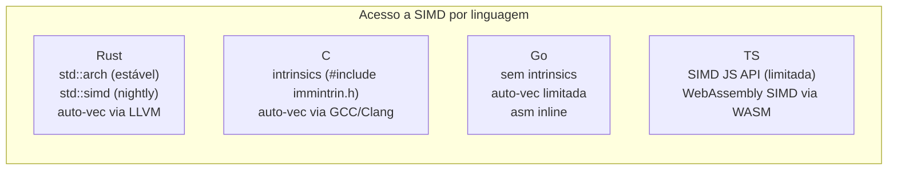

<a id="capitulo-49"></a>
# Capítulo 49: SIMD, Inlining e Otimizações

> *"Premature optimization is the root of all evil. Yet we must not pass up our opportunities in that critical 3%."*
> — Donald Knuth

> *"Rust te dá controle de C com a confiança de Haskell. Use os dois."*

## 49.1 O Mapa Antes do Microscópio

Antes de qualquer micro-otimização, esclareça três coisas:

1. **Você está em release?** `cargo build --release` é frequentemente 10-100x mais rápido que debug. Esquecer isso já anula a maior parte das otimizações manuais.
2. **Você mediu?** Sem benchmark, qualquer melhoria é fé.
3. **Você está no caminho quente?** Otimizar uma função chamada 10 vezes por segundo enquanto outra é chamada um milhão é desperdício.

Este capítulo trata do que vem depois. Quando perfilou, identificou o hot loop, e está disposto a sacrificar legibilidade por nanosegundos.

## 49.2 Inlining

`#[inline]` sugere ao compilador que substitua chamadas pela função expandida. Para a maioria dos casos, **o compilador já decide certo sozinho**. Use as anotações explicitamente apenas quando:

```rust
#[inline]                // sugere inline em outras crates (sem isso, só dentro da própria)
pub fn somar(a: u64, b: u64) -> u64 { a + b }

#[inline(always)]        // força (raríssimo — compiler quase sempre sabe melhor)
fn hot_path() { }

#[inline(never)]         // proíbe inline (debugging, profiling)
fn cold_path() { }

#[cold]                  // marca caminho raro (ajuda branch prediction)
fn handle_error() { }
```

A regra: comece sem anotações. Adicione `#[inline]` em funções pequenas em libs públicas (cross-crate inline depende disso). Anote `#[inline(always)]` apenas após perfilar e ver que o compilador não fez por conta.

## 49.3 LTO — Link-Time Optimization

Por padrão, otimizações ocorrem por crate. LTO permite otimização entre crates no momento da linkagem.

```toml
# Cargo.toml
[profile.release]
lto = "fat"           # otimização agressiva entre todas as crates (build lento)
# ou
lto = "thin"          # paralelo, quase tão bom, build mais rápido
codegen-units = 1     # uma única unidade — mais oportunidade de otimizar
```

`lto = "thin"` é o ponto doce: ganhos de 5-15% sobre default sem o tempo de build infame de `"fat"`.

## 49.4 PGO — Profile-Guided Optimization

PGO coleta dados sobre quais branches são tomados e quais funções são quentes em uma execução real, e recompila guiado por esses dados.

```bash
# 1. Instrumentar
RUSTFLAGS="-Cprofile-generate=/tmp/pgo" cargo build --release
# 2. Rodar workload representativo
./target/release/app
# 3. Mesclar perfil
llvm-profdata merge -o /tmp/pgo/merged.profdata /tmp/pgo
# 4. Recompilar com perfil
RUSTFLAGS="-Cprofile-use=/tmp/pgo/merged.profdata" cargo build --release
```

Ganho típico: 5-20%. Custo: pipeline de build mais complexo. Vale para binários de longa vida útil (databases, browsers, compilers).

## 49.5 target-cpu

Por padrão, Rust gera código para um CPU genérico (x86_64-v1 ou similar) — para portabilidade. Se você sabe que vai rodar no host onde compila:

```bash
RUSTFLAGS="-C target-cpu=native" cargo build --release
```

Isso libera AVX2, AVX-512, BMI2 e outros sets de instruções modernos. Ganhos de 10-30% em código numérico. Custo: o binário só roda nesse CPU (ou compatível superior).

## 49.6 SIMD Portável: std::simd

SIMD (Single Instruction, Multiple Data) processa N elementos em paralelo numa única instrução. Multiplicar 8 floats em uma instrução vs 8 instruções: o ganho é literalmente 8x.

Rust tem duas bibliotecas:

- **`std::arch`** (estável): intrinsics específicas de plataforma. `_mm256_add_ps`, `vaddq_f32`, etc. Verboso mas funciona em estável.
- **`std::simd`** (nightly, portátil): API uniforme. Compila para o melhor SIMD disponível.

Exemplo com `std::simd` (nightly):

```rust
#![feature(portable_simd)]
use std::simd::f32x8;

fn somar_vetores(a: &[f32], b: &[f32], out: &mut [f32]) {
    let chunks_a = a.chunks_exact(8);
    let chunks_b = b.chunks_exact(8);
    let chunks_o = out.chunks_exact_mut(8);

    for ((va, vb), vo) in chunks_a.zip(chunks_b).zip(chunks_o) {
        let sa = f32x8::from_slice(va);
        let sb = f32x8::from_slice(vb);
        (sa + sb).copy_to_slice(vo);
    }
}
```

Para estável, use crates como `wide` ou `simd_aligned`.

## 49.7 Auto-Vetorização

O melhor SIMD é o que você não escreve. O compilador (LLVM) tenta auto-vetorizar loops simples:

```rust
pub fn dobrar(v: &mut [f32]) {
    for x in v {
        *x *= 2.0;
    }
}
// Em release com target-cpu=native, gera AVX2 automaticamente.
```

Para ajudar o auto-vetorizador:
- Use `chunks_exact` em vez de `chunks` (tamanho conhecido).
- Evite branches dentro do loop.
- Use `iter_mut().for_each(...)` em vez de índices manuais.
- Inspecione com `cargo-asm` ou Godbolt.

## 49.8 Branch Prediction e #[cold]

Predição de branch errada custa ~10 ciclos. Em hot loops, isso domina.

```rust
fn processar(item: &Item) -> Result<(), Erro> {
    if item.valido() {
        rapido(item);
        Ok(())
    } else {
        #[cold]
        fn lento(item: &Item) -> Erro {
            Erro::Invalido
        }
        Err(lento(item))
    }
}
```

`#[cold]` move o código para uma região afastada do hot path, melhorando cache de instruções e dando dica ao branch predictor.

## 49.9 Data-Oriented Design

Cache misses custam ~100 ciclos. Layout de memória importa mais que algoritmo em código numérico.

**Array of Structs (AoS) vs Struct of Arrays (SoA):**

```rust
// AoS — cada elemento traz dados não usados pra cache
struct Particula { pos: [f32; 3], vel: [f32; 3], massa: f32 }
let particulas: Vec<Particula> = vec![/* ... */];
for p in &mut particulas {
    p.pos[0] += p.vel[0];  // carrega pos+vel+massa pra cache
}

// SoA — só carrega o que usa
struct Particulas {
    pos_x: Vec<f32>, pos_y: Vec<f32>, pos_z: Vec<f32>,
    vel_x: Vec<f32>, vel_y: Vec<f32>, vel_z: Vec<f32>,
    massa: Vec<f32>,
}
// Loop sobre pos_x e vel_x: cache lines totalmente preenchidas com dados úteis.
```

Bevy ECS, Unity DOTS, e a maioria de motores de física modernos usam SoA por essa razão. Em Rust, a crate `soa-derive` automatiza a transformação.

## 49.10 Inspecionando Assembly

```bash
cargo install cargo-asm
cargo asm --rust meu_crate::minha_funcao --release
```

Ou online no [godbolt.org](https://godbolt.org) (Rust suportado).

Olhar assembly não é exibicionismo — é diagnóstico. Você descobre se o compilador vetorizou, se inlinou, se eliminou dead code. Sem isso, otimização é adivinhação.

## 49.11 Comparação Honesta



Rust e C jogam o mesmo jogo: acesso direto a SIMD do CPU. Go e TS ficam de fora — não foram desenhadas para esse domínio.

## 49.12 O Custo da Otimização

Cada técnica deste capítulo torna o código:
- **Mais rápido** (objetivo).
- **Menos legível** (custo).
- **Mais frágil** a mudanças de hardware ou compilador (custo).

A regra de ouro: **otimize após perfilar, isole o trecho otimizado, documente o porquê com benchmark anexo**. Código performático não-comentado é bug futuro.

---

> *"Hardware é a única realidade. Tudo o que escrevemos vira sinais elétricos. Quem conhece o caminho até lá escreve o código que importa."*

[← Capítulo 48 — Profiling](ch48-profiling.md) | [Próximo: Capítulo 50 — CLI →](../part-18-applications/ch50-cli.md)
