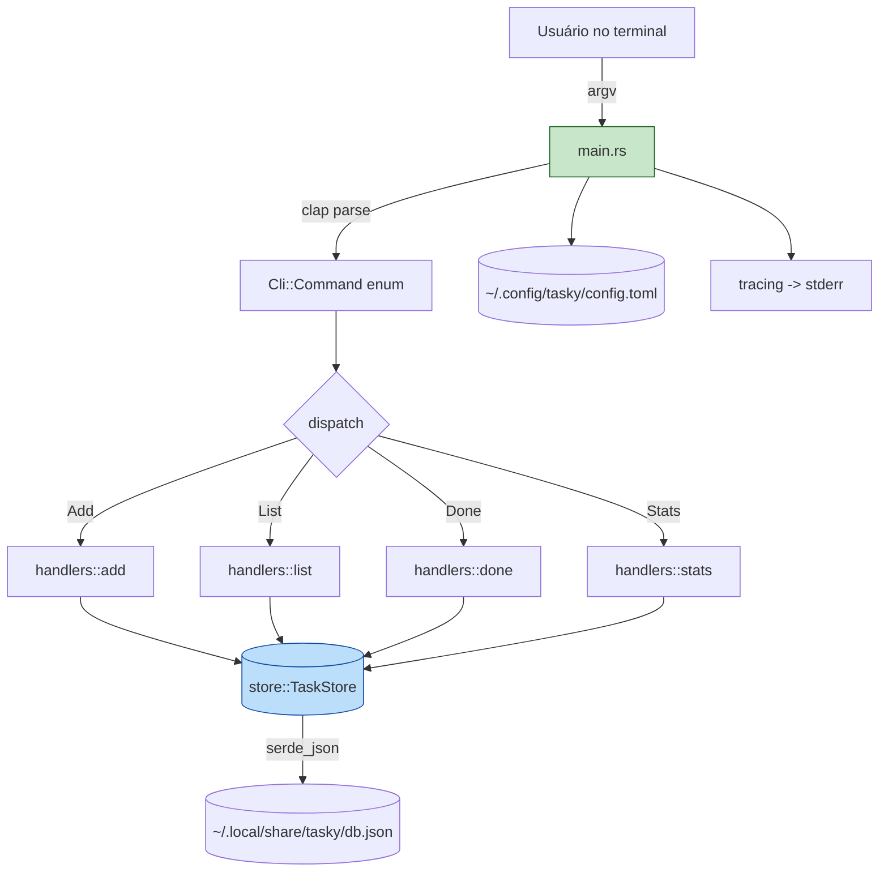
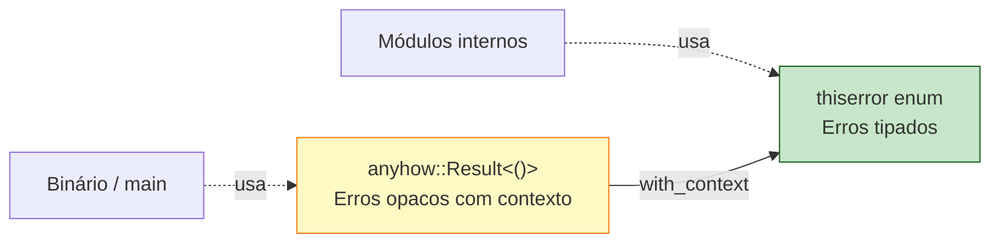
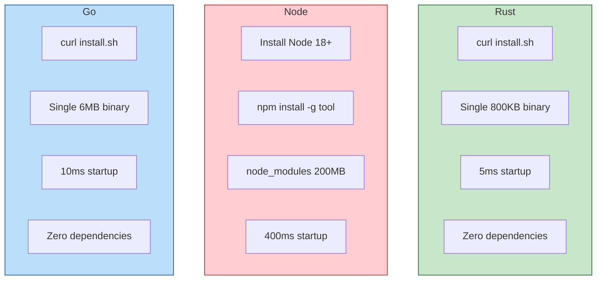

<a id="capitulo-50"></a>
# Capítulo 50: Construindo uma CLI Real

> *"A user interface is like a joke. If you have to explain it, it's not that good."*
> — Martin LeBlanc

> *"The Unix philosophy: write programs that do one thing and do it well. Rust took that and added: and never segfault."*
> — autor desconhecido, em algum thread do r/rust

## 50.1 Por Que CLIs em Rust Estão Comendo o Mundo

Pegue qualquer terminal de um desenvolvedor sério em 2026 e olhe o que está rodando. Há uma chance considerável de que `grep` foi substituído por **ripgrep** (`rg`). Que `find` virou **fd**. Que `cat` virou **bat**. Que `ls` virou **exa** (ou `eza`). Que `du` virou **dust**. Que `cd` virou **zoxide** (`z`). Que `time` virou **hyperfine**. Que `cloc` virou **tokei**.

Todas essas ferramentas têm uma coisa em comum: foram escritas em Rust por pessoas que estavam fartas das versões originais.

Não é coincidência. CLIs são o domínio onde Rust *ganha de longe*:

| Característica | Por que importa em CLIs |
|---|---|
| Binário único, sem runtime | Você instala um arquivo. Sem `node_modules`, sem `python -m venv`, sem `bundler`. |
| Startup time ~5ms | CLI roda mil vezes por dia. Cada milissegundo de cold start é fricção. |
| Cross-compilation trivial | `cargo build --target x86_64-pc-windows-msvc` num Mac. Funciona. |
| Performance previsível | Sem GC pausa. Sem JIT warmup. O `for` loop é o `for` loop. |
| Ecossistema maduro de CLIs | `clap`, `indicatif`, `crossterm`, `console`, `color-eyre`. |

Compare com Node:

```bash
$ time node my-tool.js --help
real    0m0.412s   # 400ms só pra imprimir help
$ time my-rust-tool --help
real    0m0.005s   # 80x mais rápido. Em algo trivial.
```

Multiplique 400ms por cada vez que um pre-commit hook roda em CI. Multiplique por cada vez que um shell prompt customizado consulta status de git. Latência composta destrói UX.

Go também faz binário único e é rápido — vamos comparar honestamente ao longo do capítulo. Mas Rust ganha em dois lugares: tamanho do binário (com `strip` e `lto`, fica menor) e *ergonomia da linguagem para parsing* — `clap` com derive macros é genuinamente delicioso.

Neste capítulo vamos construir **`tasky`**, um gerenciador de tarefas de linha de comando, do zero, com tudo que uma CLI séria precisa: subcomandos, parsing tipado, persistência, configuração, logs estruturados, cores, e build cross-platform.

## 50.2 O Que Vamos Construir

`tasky` é simples no que faz e sério no como faz:

```bash
$ tasky add "Escrever capítulo 50" --priority high --tag rust-book
Added task #1: Escrever capítulo 50 [high]

$ tasky list
  #  Status   Pri    Tags          Title
  1  open     high   rust-book     Escrever capítulo 50
  2  open     med    -             Comprar café

$ tasky done 1
Completed task #1

$ tasky stats
Total: 2 | Open: 1 | Done: 1 | High prio open: 0
```

Arquitetura em alto nível:



Stack:

- **clap 4** com `derive(Parser)` para parsing.
- **anyhow** para erros no `main` (boundary do binário).
- **thiserror** para erros tipados nas camadas internas.
- **tracing** + **tracing-subscriber** para logs.
- **serde** + **serde_json** para persistência.
- **toml** + **directories** para config cross-platform.
- **owo-colors** para output colorido respeitando `NO_COLOR`.

## 50.3 Cargo.toml: a Espinha do Projeto

```toml
[package]
name = "tasky"
version = "0.1.0"
edition = "2021"
rust-version = "1.74"
description = "A no-nonsense task manager for your terminal"
license = "MIT OR Apache-2.0"

[dependencies]
clap = { version = "4.5", features = ["derive", "env"] }
anyhow = "1.0"
thiserror = "1.0"
tracing = "0.1"
tracing-subscriber = { version = "0.3", features = ["env-filter", "fmt"] }
serde = { version = "1.0", features = ["derive"] }
serde_json = "1.0"
toml = "0.8"
directories = "5.0"
owo-colors = { version = "4.0", features = ["supports-colors"] }
chrono = { version = "0.4", features = ["serde"] }

[profile.release]
opt-level = 3
lto = "fat"
codegen-units = 1
strip = "symbols"
panic = "abort"
```

Cada flag em `[profile.release]` paga seu preço:

- `lto = "fat"` — link-time optimization. Torna o link 3x mais lento, mas inlina entre crates.
- `codegen-units = 1` — uma única unidade de codegen. Mais lento, código mais rápido.
- `strip = "symbols"` — remove símbolos de debug. Binário cai pela metade.
- `panic = "abort"` — abort em vez de unwind. Sem stack-unwinding overhead, binário menor.

O resultado: `tasky` final fica em torno de **800KB** statically linked. Comparação:

| Linguagem | Binário típico | Notas |
|---|---|---|
| Rust (este capítulo) | ~800 KB | Com `strip` e `lto`. |
| Go (Cobra equivalente) | ~6 MB | Runtime do Go embutido. |
| Node + pkg | ~40 MB | V8 inteiro embutido. |
| Python + PyInstaller | ~15 MB | Interpretador + libs. |
| C (com getopt) | ~50 KB | Mas você escreveu o parser à mão. |

## 50.4 Definindo o CLI com `clap` Derive

Em outras linguagens, você define argumentos imperativamente: `parser.add_argument(...)`. Em Rust com `clap` derive, você define **a forma dos argumentos como tipos** e o parser é gerado em compile time.

`src/cli.rs`:

```rust
use clap::{Parser, Subcommand, ValueEnum};
use std::path::PathBuf;

/// A no-nonsense task manager for your terminal.
#[derive(Debug, Parser)]
#[command(
    name = "tasky",
    version,
    about,
    long_about = None,
    propagate_version = true,
)]
pub struct Cli {
    /// Path to config file. Defaults to OS-standard config dir.
    #[arg(long, env = "TASKY_CONFIG", global = true)]
    pub config: Option<PathBuf>,

    /// Increase verbosity (-v debug, -vv trace).
    #[arg(short, long, action = clap::ArgAction::Count, global = true)]
    pub verbose: u8,

    #[command(subcommand)]
    pub command: Command,
}

#[derive(Debug, Subcommand)]
pub enum Command {
    /// Add a new task.
    Add {
        /// Task title (required).
        title: String,

        /// Priority of the task.
        #[arg(short, long, value_enum, default_value_t = Priority::Med)]
        priority: Priority,

        /// Tags, comma-separated.
        #[arg(short, long, value_delimiter = ',')]
        tag: Vec<String>,
    },
    /// List tasks. By default, only open ones.
    List {
        /// Show all tasks, including done ones.
        #[arg(short, long)]
        all: bool,

        /// Filter by tag.
        #[arg(short, long)]
        tag: Option<String>,
    },
    /// Mark a task as done.
    Done {
        /// Task id.
        id: u32,
    },
    /// Remove a task permanently.
    Rm {
        /// Task id.
        id: u32,
    },
    /// Print summary statistics.
    Stats,
}

#[derive(Debug, Clone, Copy, ValueEnum, serde::Serialize, serde::Deserialize)]
#[serde(rename_all = "lowercase")]
pub enum Priority {
    Low,
    Med,
    High,
}

impl std::fmt::Display for Priority {
    fn fmt(&self, f: &mut std::fmt::Formatter<'_>) -> std::fmt::Result {
        match self {
            Priority::Low => f.write_str("low"),
            Priority::Med => f.write_str("med"),
            Priority::High => f.write_str("high"),
        }
    }
}
```

Tudo aqui é **type-driven**. `Priority` é um enum de três variantes. `clap` deriva automaticamente o parser que aceita `--priority high|med|low` e gera mensagem de erro clara se você passar `--priority urgent`. Compare com argparse em Python ou yargs em Node, onde isso seria string + validação manual.

Pontos sutis que `clap` resolve de graça:
- `propagate_version = true` faz `tasky add --version` funcionar.
- `env = "TASKY_CONFIG"` faz `--config` ler de variável de ambiente como fallback.
- `global = true` faz a flag funcionar antes ou depois do subcomando.
- `value_delimiter = ','` faz `--tag rust,book,cli` virar `Vec<String>`.

`tasky --help` é gerado automaticamente, com cores e formatação.

## 50.5 Erros: `anyhow` na Borda, `thiserror` no Núcleo

Há duas culturas de erro em Rust que coexistem em harmonia:



`anyhow` é para o `main`: você não vai casar em variantes, só vai imprimir. `thiserror` é para bibliotecas: callers vão fazer `match` nos erros.

`src/error.rs`:

```rust
use std::path::PathBuf;
use thiserror::Error;

#[derive(Debug, Error)]
pub enum StoreError {
    #[error("task with id {0} not found")]
    NotFound(u32),

    #[error("storage path {path:?} is not accessible: {source}")]
    Io {
        path: PathBuf,
        #[source]
        source: std::io::Error,
    },

    #[error("storage file is corrupted: {0}")]
    Corrupt(#[from] serde_json::Error),
}

pub type StoreResult<T> = Result<T, StoreError>;
```

Cada variante tem um `Display` informativo (via `#[error(...)]`). `#[from]` gera `From<serde_json::Error>` automaticamente — `?` propaga sem boilerplate.

No `main`, `anyhow::Result` engole tudo:

```rust
// src/main.rs
use anyhow::{Context, Result};

fn main() -> Result<()> {
    let cli = cli::Cli::parse();
    init_tracing(cli.verbose);

    let cfg = config::load(cli.config.as_deref())
        .context("loading config")?;

    let mut store = store::TaskStore::open(&cfg.data_path)
        .with_context(|| format!("opening store at {:?}", cfg.data_path))?;

    handlers::dispatch(cli.command, &mut store)
        .context("executing command")?;

    Ok(())
}
```

`?` em `anyhow::Result` aceita qualquer `Error`. `context`/`with_context` adicionam camadas que aparecem na saída:

```
Error: executing command

Caused by:
    0: opening store at "/home/felipe/.local/share/tasky/db.json"
    1: storage file is corrupted: expected `,` or `}` at line 12 column 3
```

Compare com Go, onde você manualmente envolve cada erro com `fmt.Errorf("doing X: %w", err)`. `anyhow` faz isso ergonomicamente. Compare com Node, onde stack traces de `Error` são longas mas sem **camadas semânticas**.

## 50.6 Persistência com `serde`

`serde` é a obra-prima da serialização em Rust: derive macro que gera serialização e desserialização para qualquer formato (JSON, TOML, YAML, MessagePack, bincode...) sem reflection em runtime.

`src/store.rs`:

```rust
use crate::cli::Priority;
use crate::error::{StoreError, StoreResult};
use chrono::{DateTime, Utc};
use serde::{Deserialize, Serialize};
use std::fs;
use std::path::{Path, PathBuf};

#[derive(Debug, Clone, Serialize, Deserialize)]
pub struct Task {
    pub id: u32,
    pub title: String,
    pub priority: Priority,
    pub tags: Vec<String>,
    pub status: Status,
    pub created_at: DateTime<Utc>,
    pub completed_at: Option<DateTime<Utc>>,
}

#[derive(Debug, Clone, Copy, PartialEq, Eq, Serialize, Deserialize)]
#[serde(rename_all = "lowercase")]
pub enum Status {
    Open,
    Done,
}

#[derive(Debug, Default, Serialize, Deserialize)]
struct DbFile {
    next_id: u32,
    tasks: Vec<Task>,
}

pub struct TaskStore {
    path: PathBuf,
    db: DbFile,
}

impl TaskStore {
    pub fn open(path: &Path) -> StoreResult<Self> {
        if let Some(parent) = path.parent() {
            fs::create_dir_all(parent).map_err(|source| StoreError::Io {
                path: parent.to_path_buf(),
                source,
            })?;
        }

        let db = if path.exists() {
            let bytes = fs::read(path).map_err(|source| StoreError::Io {
                path: path.to_path_buf(),
                source,
            })?;
            serde_json::from_slice(&bytes)?
        } else {
            DbFile { next_id: 1, tasks: Vec::new() }
        };

        Ok(Self { path: path.to_path_buf(), db })
    }

    pub fn add(&mut self, title: String, priority: Priority, tags: Vec<String>) -> &Task {
        let task = Task {
            id: self.db.next_id,
            title,
            priority,
            tags,
            status: Status::Open,
            created_at: Utc::now(),
            completed_at: None,
        };
        self.db.next_id += 1;
        self.db.tasks.push(task);
        self.db.tasks.last().unwrap() // pushed acima, sempre Some
    }

    pub fn complete(&mut self, id: u32) -> StoreResult<&Task> {
        let task = self
            .db
            .tasks
            .iter_mut()
            .find(|t| t.id == id)
            .ok_or(StoreError::NotFound(id))?;
        task.status = Status::Done;
        task.completed_at = Some(Utc::now());
        Ok(task)
    }

    pub fn remove(&mut self, id: u32) -> StoreResult<()> {
        let pos = self
            .db
            .tasks
            .iter()
            .position(|t| t.id == id)
            .ok_or(StoreError::NotFound(id))?;
        self.db.tasks.remove(pos);
        Ok(())
    }

    pub fn list(&self) -> &[Task] {
        &self.db.tasks
    }

    /// Atomic write: write to tmp, fsync, rename. Avoids torn files on crash.
    pub fn flush(&self) -> StoreResult<()> {
        let json = serde_json::to_vec_pretty(&self.db)?;
        let tmp = self.path.with_extension("json.tmp");

        fs::write(&tmp, &json).map_err(|source| StoreError::Io {
            path: tmp.clone(),
            source,
        })?;

        fs::rename(&tmp, &self.path).map_err(|source| StoreError::Io {
            path: self.path.clone(),
            source,
        })?;

        Ok(())
    }
}

impl Drop for TaskStore {
    fn drop(&mut self) {
        // Best-effort flush. `Drop` não pode falhar; logamos e seguimos.
        if let Err(e) = self.flush() {
            tracing::error!(error = %e, "failed to flush store on drop");
        }
    }
}
```

Três detalhes de produção que muita CLI hobbyista ignora:

1. **Atomic write via tmp + rename**. Se o processo for morto no meio do `write`, você não corrompe o DB; o `rename` em filesystem POSIX é atômico, e Windows desde Win10 também.
2. **Drop com flush best-effort**. Esquecer de chamar `flush()` no fim do `main` é o tipo de bug que aparece em produção. Drop garante.
3. **Erro de IO carrega o `path`**. Quando o usuário ver `Caused by: opening store at "/some/locked/path"`, ele sabe o que aconteceu.

Para datasets maiores (centenas de milhares de tasks), trocar JSON por **`sled`** (embedded KV store) é o passo natural. A interface da `TaskStore` esconde o backend; o resto do código não muda.

## 50.7 Configuração Cross-Platform com `directories`

Onde colocar config e dados? Cada OS tem convenção própria:

- Linux: `$XDG_CONFIG_HOME/tasky/config.toml` (default `~/.config/tasky/`)
- macOS: `~/Library/Application Support/tasky/`
- Windows: `%APPDATA%\tasky\`

Escrever isso à mão é uma fonte de bugs. A crate `directories` resolve.

`src/config.rs`:

```rust
use directories::ProjectDirs;
use serde::{Deserialize, Serialize};
use std::path::{Path, PathBuf};

#[derive(Debug, Clone, Serialize, Deserialize)]
pub struct Config {
    pub data_path: PathBuf,
    #[serde(default = "default_color")]
    pub color: ColorMode,
}

#[derive(Debug, Clone, Copy, Serialize, Deserialize)]
#[serde(rename_all = "lowercase")]
pub enum ColorMode {
    Auto,
    Always,
    Never,
}

fn default_color() -> ColorMode {
    ColorMode::Auto
}

pub fn load(explicit: Option<&Path>) -> anyhow::Result<Config> {
    let dirs = ProjectDirs::from("dev", "ness", "tasky")
        .ok_or_else(|| anyhow::anyhow!("could not determine project dirs"))?;

    let cfg_path = explicit
        .map(Path::to_path_buf)
        .unwrap_or_else(|| dirs.config_dir().join("config.toml"));

    if cfg_path.exists() {
        let raw = std::fs::read_to_string(&cfg_path)?;
        let cfg: Config = toml::from_str(&raw)?;
        Ok(cfg)
    } else {
        Ok(Config {
            data_path: dirs.data_dir().join("db.json"),
            color: ColorMode::Auto,
        })
    }
}
```

O usuário pode customizar criando `~/.config/tasky/config.toml`:

```toml
data_path = "/mnt/ssd/tasks/db.json"
color = "always"
```

Sem config, defaults sãos. Com config, override granular. **Esse é o padrão de toda CLI séria.**

## 50.8 Logs com `tracing`

`tracing` é o sucessor moderno de `log`. Ele entende **spans** (intervalos de tempo) além de eventos pontuais — vital para entender concorrência.

`src/main.rs` (continuação):

```rust
use tracing_subscriber::{fmt, EnvFilter};

fn init_tracing(verbose: u8) {
    let level = match verbose {
        0 => "warn",
        1 => "info",
        2 => "debug",
        _ => "trace",
    };

    let filter = EnvFilter::try_from_default_env()
        .unwrap_or_else(|_| EnvFilter::new(format!("tasky={level}")));

    fmt()
        .with_env_filter(filter)
        .with_writer(std::io::stderr)
        .with_target(false)
        .compact()
        .init();
}
```

Logs vão para **stderr** — regra sagrada de Unix. Stdout é para **dado**, stderr é para **conversa**. Pipe `tasky list | grep foo` precisa não receber lixo.

Em handlers:

```rust
#[tracing::instrument(skip(store))]
pub fn add(
    store: &mut TaskStore,
    title: String,
    priority: Priority,
    tags: Vec<String>,
) -> anyhow::Result<()> {
    tracing::debug!(?priority, tag_count = tags.len(), "creating task");
    let task = store.add(title, priority, tags);
    println!(
        "Added task #{}: {} [{}]",
        task.id.bold(),
        task.title,
        task.priority.to_string().yellow()
    );
    Ok(())
}
```

`#[tracing::instrument]` cria um span ao redor da função. Com `RUST_LOG=tasky=trace tasky add ...`, você vê:

```
TRACE add{title="Buy coffee" priority=Med tag_count=0}: creating task
```

Comparação:
- **Node + winston**: similar em features, mas instrumentação manual em cada função.
- **Go + slog**: structured logs nativos, mas sem spans (você usa OpenTelemetry separado).
- **`println!` em qualquer linguagem**: você vai se arrepender em produção.

## 50.9 Output Colorido que Respeita o Mundo

Cores em terminal são uma armadilha. Não dá pra simplesmente escrever `\x1b[31m`. Você precisa:

1. Detectar se stdout é um TTY (senão pipe vê escape codes).
2. Respeitar `NO_COLOR` (variável de ambiente padrão de facto).
3. Respeitar `--color=never` / `--color=always`.

`owo-colors` resolve com a feature `supports-colors`:

```rust
use owo_colors::{OwoColorize, Stream::Stdout};

println!(
    "{}",
    "ok".if_supports_color(Stdout, |t| t.green())
);
```

Se stdout não suporta cor (pipe, redirect, `NO_COLOR=1`), a closure não é aplicada. Output vira plain text.

`src/handlers.rs` para `list`:

```rust
use owo_colors::{OwoColorize, Stream::Stdout};
use crate::cli::Priority;
use crate::store::{Status, Task, TaskStore};

pub fn list(store: &TaskStore, all: bool, tag_filter: Option<String>) -> anyhow::Result<()> {
    let tasks: Vec<&Task> = store
        .list()
        .iter()
        .filter(|t| all || t.status == Status::Open)
        .filter(|t| match &tag_filter {
            Some(tag) => t.tags.iter().any(|x| x == tag),
            None => true,
        })
        .collect();

    if tasks.is_empty() {
        println!("No tasks. Add one with `tasky add \"...\"`.");
        return Ok(());
    }

    println!(
        "{:>4}  {:<8}  {:<6}  {:<14}  {}",
        "#".bold(), "Status".bold(), "Pri".bold(), "Tags".bold(), "Title".bold()
    );

    for t in tasks {
        let status = match t.status {
            Status::Open => "open"
                .if_supports_color(Stdout, |s| s.cyan())
                .to_string(),
            Status::Done => "done"
                .if_supports_color(Stdout, |s| s.green())
                .to_string(),
        };
        let pri = match t.priority {
            Priority::High => t.priority.to_string()
                .if_supports_color(Stdout, |s| s.red())
                .to_string(),
            Priority::Med => t.priority.to_string()
                .if_supports_color(Stdout, |s| s.yellow())
                .to_string(),
            Priority::Low => t.priority.to_string()
                .if_supports_color(Stdout, |s| s.bright_black())
                .to_string(),
        };
        let tags = if t.tags.is_empty() {
            "-".to_string()
        } else {
            t.tags.join(",")
        };

        println!("{:>4}  {:<8}  {:<6}  {:<14}  {}", t.id, status, pri, tags, t.title);
    }

    Ok(())
}
```

Em terminal interativo: cores. Em `tasky list | head`: sem cores, pronto pra parser.

## 50.10 Cross-Platform Builds com `cargo`

Aqui Rust faz algo absurdo de ergonômico. De um Mac M1, você compila para 5 plataformas:

```bash
$ rustup target add x86_64-unknown-linux-gnu \
                    x86_64-pc-windows-gnu \
                    aarch64-apple-darwin \
                    aarch64-unknown-linux-musl

$ cargo build --release --target x86_64-unknown-linux-gnu
$ cargo build --release --target x86_64-pc-windows-gnu
$ cargo build --release --target aarch64-apple-darwin
$ cargo build --release --target aarch64-unknown-linux-musl
```

Para builds production-grade automatizados, **`cross`** (https://github.com/cross-rs/cross) faz cross-compilation via Docker, eliminando toda dor de toolchain de C linker:

```bash
$ cargo install cross
$ cross build --release --target aarch64-unknown-linux-musl
```

`musl` é especialmente útil — gera binários **completamente estáticos**, sem depender de glibc. Você pode jogar no `scratch` Docker image, em Alpine, em qualquer kernel Linux remotamente moderno. Sem "GLIBC_2.32 not found".

## 50.11 Distribuição: `cargo install`

A forma mais simples de distribuir uma CLI Rust é publicar em **crates.io**:

```bash
$ cargo publish
```

E o usuário instala com:

```bash
$ cargo install tasky
$ tasky --help
```

Para usuários sem Rust instalado, **`cargo-binstall`** baixa o binário pré-compilado do GitHub Releases:

```bash
$ cargo binstall tasky
```

Para automação completa, **`cargo-dist`** (da equipe da axodotdev) gera releases multi-plataforma com checksums, instalador shell (`curl | sh`), instalador PowerShell, e Homebrew tap, tudo a partir de um `cargo dist init`.

Comparação de UX final do binário:



Go e Rust empatam em UX de instalação e ambos atropelam Node. Onde Rust ganha de Go: **tamanho** (binário 7x menor) e **latência fria** (sem startup do runtime). Onde Go ganha de Rust: **tempo de compilação** (3x mais rápido em projetos médios).

## 50.12 As CLIs Lendárias Escritas em Rust

Vale conhecer a galeria. Cada uma é mais rápida que sua contraparte clássica em ordens de magnitude:

| Tool | Substitui | Por que ganhou |
|---|---|---|
| **ripgrep** (`rg`) | `grep`, `ag`, `ack` | Multi-thread, regex JIT, respeita `.gitignore`. ~5x grep. |
| **fd** | `find` | Sintaxe humana, paralelo, `.gitignore` aware. ~10x find. |
| **bat** | `cat` | Syntax highlighting + paginação + git diff inline. |
| **eza** (ex-exa) | `ls` | Cores semânticas, git status, ícones, tree mode. |
| **dust** | `du` | Output gráfico imediatamente legível. |
| **tokei** | `cloc` | Conta linhas em 200+ linguagens em segundos. |
| **hyperfine** | `time` | Benchmark estatístico com warmup, outliers, comparação. |
| **zoxide** (`z`) | `cd` | Aprende seus diretórios mais usados via frecency. |
| **starship** | (vários prompts) | Prompt de shell sub-50ms cross-shell. |
| **delta** | `git diff` | Diffs com syntax highlighting e side-by-side. |
| **just** | `make` | Task runner sem armadilhas de Makefile. |
| **bottom** (`btm`) | `top` / `htop` | Monitor de sistema com gráficos no terminal. |
| **gitui** / **lazygit** | `git` (TUI) | Git interativo via terminal. |
| **uv** | `pip` / `poetry` | 10-100x mais rápido. Reescreveu pip em Rust. |

`uv` da Astral merece nota: foi escrito em Rust **explicitamente para ser mais rápido que pip**, e Python community adotou em massa. É a maior validação possível: a comunidade Python, conhecidamente conservadora, abandonou ferramentas Python em Python por uma reescrita em Rust, *porque era melhor*.

**Padrão**: cada uma dessas tools foi escrita por um indivíduo ou time pequeno que estava insatisfeito com o status quo. Rust dá a uma pessoa o poder de superar uma ferramenta que C tem desde os anos 1980. Esse é o multiplicador.

## 50.13 O `main.rs` Final

Tudo amarrado:

```rust
// src/main.rs
mod cli;
mod config;
mod error;
mod handlers;
mod store;

use anyhow::{Context, Result};
use clap::Parser;
use tracing_subscriber::{fmt, EnvFilter};

fn main() -> Result<()> {
    let cli = cli::Cli::parse();
    init_tracing(cli.verbose);

    let cfg = config::load(cli.config.as_deref())
        .context("loading config")?;

    let mut store = store::TaskStore::open(&cfg.data_path)
        .with_context(|| format!("opening store at {:?}", cfg.data_path))?;

    handlers::dispatch(cli.command, &mut store)
        .context("executing command")?;

    store.flush().context("persisting store")?;
    Ok(())
}

fn init_tracing(verbose: u8) {
    let level = match verbose {
        0 => "warn",
        1 => "info",
        2 => "debug",
        _ => "trace",
    };
    let filter = EnvFilter::try_from_default_env()
        .unwrap_or_else(|_| EnvFilter::new(format!("tasky={level}")));
    fmt()
        .with_env_filter(filter)
        .with_writer(std::io::stderr)
        .with_target(false)
        .compact()
        .init();
}
```

E `handlers::dispatch`:

```rust
// src/handlers.rs (continuação)
use crate::cli::Command;
use crate::store::TaskStore;

pub fn dispatch(cmd: Command, store: &mut TaskStore) -> anyhow::Result<()> {
    match cmd {
        Command::Add { title, priority, tag } => add(store, title, priority, tag),
        Command::List { all, tag } => list(store, all, tag),
        Command::Done { id } => done(store, id),
        Command::Rm { id } => rm(store, id),
        Command::Stats => stats(store),
    }
}
```

`match` exaustivo. Adicionou variante nova em `Command`? O compilador grita até você tratar.

## 50.14 O Que Esse Capítulo Provou

Ao final dele, `tasky`:

- Compila em ~12 segundos no primeiro build, ~2s incremental.
- Gera um único binário de ~800KB.
- Roda subcomandos em ~5ms.
- Tem help auto-gerado, parsing tipado, errors com contexto, logs estruturados, cores que respeitam o ambiente, persistência atômica, configuração XDG-compliant, e build cross-platform.

Refazer essa coisa em Node levaria mais código (parsing manual ou yargs verboso, errors via try/catch sem context layers, persistência sem atomic write a menos que você importe `proper-lockfile`), e o binário final via `pkg` chegaria a 40+ MB com startup de 400ms.

Refazer em Go ficaria parecido em código (Cobra é decente), mas você lutaria mais com erros (sem `?`, sem `anyhow::Context` ergonômico) e teria binário 7x maior.

Rust foi feito para esse domínio. Não por acidente — por design. O próximo capítulo mostra que o mesmo design serve para um servidor web de produção.

---

> *"A boa CLI não te força a lembrar dela. Ela some no fluxo do terminal. Para sumir, ela precisa ser rápida, previsível, e não falhar. Rust dá os três de graça."*

[Próximo: Capítulo 51 — Web Service com Axum →](ch51-axum.md)
