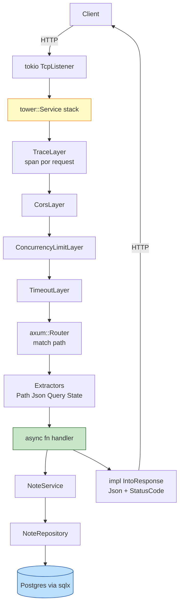
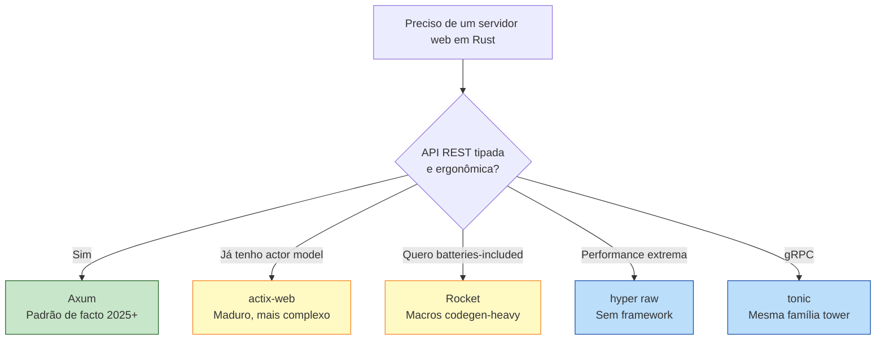

<a id="capitulo-51"></a>
# Capítulo 51: Web Service com Axum

> *"A web framework should disappear into the problem, not become the problem."*
> — Tony Arcieri

> *"In Rust, your web server doesn't crash at 3 AM. It refuses to compile at 3 PM."*
> — provérbio do Tokio Discord

## 51.1 Por Que Web em Rust

Por muito tempo, "Rust pra backend web" pareceu absurdo. Web é I/O bound, não CPU bound. Web tem deadlines de produto, não deadlines de microssegundos. Por que pagaria a curva de aprendizado de Rust para servir JSON?

Cinco coisas mudaram entre 2018 e 2026:

1. **Tokio amadureceu**. Async/await Rust ficou tão ergonômico quanto async/await TS, e mais rápido.
2. **Axum saiu**. Framework do time do Tokio, com extractors tipados que parecem mágica.
3. **SQLx provou** que dá pra ter SQL com **type-checking em compile time**, sem ORM.
4. **Cloudflare Pingora** foi a relevação: Rust HTTP proxy servindo trilhões de req/s, 70% menos CPU que o NGINX que substituiu.
5. **Discord cortou latência em 90%** trocando Go por Rust no Read States.

A pergunta deixou de ser "vale a pena Rust pra backend?" e virou "**em quais serviços o ROI compensa primeiro?**". Resposta empírica: serviços com SLA estrito de p99, serviços CPU-bound (parsers, encoders, cripto), e plataformas que rodam para sempre — onde memory leaks de longo prazo são caros.

Neste capítulo construímos **`hivemind`**, uma API REST de gerenciamento de notas (CRUD + busca), com:

- **axum 0.7** (HTTP) sobre **tokio** (runtime async).
- **sqlx** com Postgres e queries tipadas em compile time.
- **tower** para middleware (CORS, timeout, tracing, rate limit).
- **tracing** + **tracing-subscriber** + **opentelemetry** para observabilidade.
- **serde** + **validator** para input.
- **thiserror** + custom `IntoResponse` para erros HTTP semânticos.

Vamos comparar o mesmo handler em Express, Gin, FastAPI e Axum, lado a lado.

## 51.2 Anatomia de um Request em Axum

Antes do código, o modelo mental:



Toda essa pilha é **type-safe end-to-end**. O handler declara o que precisa via tipos de parâmetros (extractors), o Router conecta path a handler em compile time, e o response sai como `impl IntoResponse`. Se você esquecer `Json<Body>` num POST que precisa de body, o compilador grita.

## 51.3 Cargo.toml e Estrutura

```toml
[package]
name = "hivemind"
version = "0.1.0"
edition = "2021"
rust-version = "1.74"

[dependencies]
axum = { version = "0.7", features = ["macros", "tracing"] }
tokio = { version = "1.36", features = ["full"] }
tower = { version = "0.4", features = ["full"] }
tower-http = { version = "0.5", features = ["trace", "cors", "timeout", "limit"] }
serde = { version = "1.0", features = ["derive"] }
serde_json = "1.0"
sqlx = { version = "0.7", features = ["runtime-tokio-rustls", "postgres", "uuid", "chrono", "macros"] }
uuid = { version = "1.7", features = ["v7", "serde"] }
chrono = { version = "0.4", features = ["serde"] }
thiserror = "1.0"
anyhow = "1.0"
tracing = "0.1"
tracing-subscriber = { version = "0.3", features = ["env-filter", "json"] }
validator = { version = "0.18", features = ["derive"] }
dotenvy = "0.15"

[dev-dependencies]
reqwest = { version = "0.12", features = ["json"] }
```

Estrutura:

```
src/
  main.rs              # Bootstrap: config, db, router, listener
  config.rs            # Env vars via serde
  error.rs             # AppError + IntoResponse
  state.rs             # AppState compartilhado
  middleware.rs        # request_id, timing
  routes/
    mod.rs
    health.rs
    notes.rs           # GET/POST/PUT/DELETE
  domain/
    note.rs            # Note, CreateNote, NoteId
  repo/
    note_repo.rs       # SQL queries tipadas
  service/
    note_service.rs    # Regra de negócio
```

Camadas: **route handler** chama **service**, que chama **repo**, que fala com Postgres. Lições do mundo NestJS/DDD aplicadas a Rust idiomático.

## 51.4 Estado Compartilhado: `State<Arc<AppState>>`

Em Express você tem `app.locals` ou middleware injetando contexto. Em Gin você tem `c.Get/c.Set` com `interface{}`. Em Axum, estado compartilhado é **um tipo concreto que você declara**.

`src/state.rs`:

```rust
use sqlx::PgPool;
use std::sync::Arc;

#[derive(Clone)]
pub struct AppState {
    pub db: PgPool,
    pub config: Arc<crate::config::Config>,
}

pub type SharedState = Arc<AppState>;
```

`AppState` é `Clone` porque `PgPool` internamente já é `Arc`-wrapped. Para fields mutáveis (cache, rate limiter), você usaria `Arc<Mutex<T>>` ou `Arc<RwLock<T>>` — mas evite mutação compartilhada se puder; em geral, push para o DB.

No handler:

```rust
use axum::extract::State;

async fn list_notes(
    State(state): State<SharedState>,
) -> Result<Json<Vec<Note>>, AppError> {
    let notes = NoteService::list(&state.db).await?;
    Ok(Json(notes))
}
```

`State<SharedState>` é um **extractor**. O Axum sabe: para esse handler, pegue o estado do Router e injete. Fully typed. Se você tentasse usar `State<DifferentType>`, **não compila**.

## 51.5 Domínio Tipado

Comece pelo modelo:

`src/domain/note.rs`:

```rust
use chrono::{DateTime, Utc};
use serde::{Deserialize, Serialize};
use uuid::Uuid;
use validator::Validate;

#[derive(Debug, Clone, Serialize, Deserialize, sqlx::FromRow)]
pub struct Note {
    pub id: Uuid,
    pub title: String,
    pub body: String,
    pub created_at: DateTime<Utc>,
    pub updated_at: DateTime<Utc>,
}

#[derive(Debug, Deserialize, Validate)]
pub struct CreateNote {
    #[validate(length(min = 1, max = 200))]
    pub title: String,

    #[validate(length(max = 50_000))]
    pub body: String,
}

#[derive(Debug, Deserialize, Validate)]
pub struct UpdateNote {
    #[validate(length(min = 1, max = 200))]
    pub title: Option<String>,

    #[validate(length(max = 50_000))]
    pub body: Option<String>,
}

#[derive(Debug, Deserialize)]
pub struct ListQuery {
    #[serde(default = "default_limit")]
    pub limit: u32,
    #[serde(default)]
    pub offset: u32,
    pub q: Option<String>,
}

fn default_limit() -> u32 {
    20
}
```

Note como `CreateNote` e `UpdateNote` são **tipos diferentes** de `Note`. Em TypeScript você faria `Pick<Note, 'title' | 'body'>` ou similar; em Rust, declaramos explicitamente. É verbose, mas torna **mass assignment impossível**: se o cliente mandar `{ "id": "...", "created_at": "..." }`, esses campos são silenciosamente ignorados pelo serde — não existem no `CreateNote`.

Comparação com Express + TypeScript:

```typescript
// Express: clássico mass-assignment risk
app.post('/notes', async (req, res) => {
  // req.body é "any". Se tiver `id`, vai pra criação. Bug em produção.
  const note = await db.note.create({ data: req.body });
  res.json(note);
});

// Express seguro: destructuring + validação manual
app.post('/notes', async (req, res) => {
  const { title, body } = z.object({
    title: z.string().min(1).max(200),
    body: z.string().max(50_000),
  }).parse(req.body);
  const note = await db.note.create({ data: { title, body } });
  res.json(note);
});
```

Em Rust com Axum + Validator:

```rust
async fn create_note(
    State(state): State<SharedState>,
    Json(payload): Json<CreateNote>,
) -> Result<(StatusCode, Json<Note>), AppError> {
    payload.validate()?;
    let note = NoteService::create(&state.db, payload).await?;
    Ok((StatusCode::CREATED, Json(note)))
}
```

Equivalente em concisão à versão "segura" de Express, mas garantida em compile time. O `Json<CreateNote>` extractor serializa para a struct certa ou retorna 400 automaticamente. Sem chance de campo extra contaminar.

## 51.6 SQL Tipado em Compile Time com `sqlx`

Esse é o momento em que você se apaixona por Rust pra backend. **`sqlx::query!` valida sua query SQL contra o schema real do Postgres em compile time.**

`src/repo/note_repo.rs`:

```rust
use crate::domain::note::{CreateNote, Note, UpdateNote};
use sqlx::PgPool;
use uuid::Uuid;

pub struct NoteRepository;

impl NoteRepository {
    pub async fn list(pool: &PgPool, limit: u32, offset: u32) -> sqlx::Result<Vec<Note>> {
        sqlx::query_as!(
            Note,
            r#"
            SELECT id, title, body, created_at, updated_at
            FROM notes
            ORDER BY created_at DESC
            LIMIT $1 OFFSET $2
            "#,
            limit as i64,
            offset as i64,
        )
        .fetch_all(pool)
        .await
    }

    pub async fn search(pool: &PgPool, q: &str, limit: u32) -> sqlx::Result<Vec<Note>> {
        sqlx::query_as!(
            Note,
            r#"
            SELECT id, title, body, created_at, updated_at
            FROM notes
            WHERE to_tsvector('english', title || ' ' || body)
                  @@ plainto_tsquery('english', $1)
            ORDER BY created_at DESC
            LIMIT $2
            "#,
            q,
            limit as i64,
        )
        .fetch_all(pool)
        .await
    }

    pub async fn get(pool: &PgPool, id: Uuid) -> sqlx::Result<Option<Note>> {
        sqlx::query_as!(
            Note,
            r#"
            SELECT id, title, body, created_at, updated_at
            FROM notes
            WHERE id = $1
            "#,
            id,
        )
        .fetch_optional(pool)
        .await
    }

    pub async fn create(pool: &PgPool, input: CreateNote) -> sqlx::Result<Note> {
        let id = Uuid::now_v7();
        sqlx::query_as!(
            Note,
            r#"
            INSERT INTO notes (id, title, body)
            VALUES ($1, $2, $3)
            RETURNING id, title, body, created_at, updated_at
            "#,
            id,
            input.title,
            input.body,
        )
        .fetch_one(pool)
        .await
    }

    pub async fn update(
        pool: &PgPool,
        id: Uuid,
        input: UpdateNote,
    ) -> sqlx::Result<Option<Note>> {
        sqlx::query_as!(
            Note,
            r#"
            UPDATE notes
            SET title = COALESCE($2, title),
                body  = COALESCE($3, body),
                updated_at = NOW()
            WHERE id = $1
            RETURNING id, title, body, created_at, updated_at
            "#,
            id,
            input.title.as_deref(),
            input.body.as_deref(),
        )
        .fetch_optional(pool)
        .await
    }

    pub async fn delete(pool: &PgPool, id: Uuid) -> sqlx::Result<bool> {
        let r = sqlx::query!("DELETE FROM notes WHERE id = $1", id)
            .execute(pool)
            .await?;
        Ok(r.rows_affected() > 0)
    }
}
```

O que o `query_as!` faz em compile time:

1. Conecta no Postgres via `DATABASE_URL`.
2. Executa `PREPARE` da query.
3. Inspeciona os tipos de cada parâmetro e cada coluna do resultado.
4. Verifica que `Note` tem campos compatíveis com as colunas retornadas.
5. Se algum tipo divergir, **erro de compilação**.

```
error: expected i32, found i64
   --> src/repo/note_repo.rs:14:13
    |
14  |             limit as i64,
```

Se você renomear uma coluna no DB e esquecer de atualizar o código? **O build quebra.** Esse é o tipo de garantia que ORMs prometem mas não entregam — porque ORM consulta runtime, não schema.

Para CI sem DB live, `cargo sqlx prepare` gera um `sqlx-data.json` checked-in que serve de cache. CI roda com `SQLX_OFFLINE=true`.

Compare:

| Stack | SQL safety | Custo |
|---|---|---|
| Express + raw `pg` | Zero. Strings + arrays. | Bug runtime. |
| Express + Prisma | Schema-time. ORM gera tipos. | Lock-in, queries N+1, perf. |
| FastAPI + SQLAlchemy | Schema-time. Heavy ORM. | Velocidade, complexidade. |
| Gin + GORM | Quase nenhum. Magic structs. | Reflection, runtime. |
| Gin + sqlc | Compile-time (gera Go). | Step extra de geração. |
| **Axum + sqlx** | **Compile-time, query real, sem ORM.** | Exige schema disponível em build. |

`sqlc` em Go faz algo parecido (gera Go a partir de SQL). É o reconhecimento de que essa é a forma certa.

## 51.7 Service Layer

`src/service/note_service.rs`:

```rust
use crate::domain::note::{CreateNote, Note, UpdateNote};
use crate::error::{AppError, AppResult};
use crate::repo::note_repo::NoteRepository;
use sqlx::PgPool;
use uuid::Uuid;

pub struct NoteService;

impl NoteService {
    pub async fn list(pool: &PgPool, limit: u32, offset: u32) -> AppResult<Vec<Note>> {
        Ok(NoteRepository::list(pool, limit, offset).await?)
    }

    pub async fn search(pool: &PgPool, q: &str) -> AppResult<Vec<Note>> {
        Ok(NoteRepository::search(pool, q, 50).await?)
    }

    pub async fn get(pool: &PgPool, id: Uuid) -> AppResult<Note> {
        NoteRepository::get(pool, id)
            .await?
            .ok_or(AppError::NotFound)
    }

    pub async fn create(pool: &PgPool, input: CreateNote) -> AppResult<Note> {
        Ok(NoteRepository::create(pool, input).await?)
    }

    pub async fn update(pool: &PgPool, id: Uuid, input: UpdateNote) -> AppResult<Note> {
        NoteRepository::update(pool, id, input)
            .await?
            .ok_or(AppError::NotFound)
    }

    pub async fn delete(pool: &PgPool, id: Uuid) -> AppResult<()> {
        let removed = NoteRepository::delete(pool, id).await?;
        if !removed {
            return Err(AppError::NotFound);
        }
        Ok(())
    }
}
```

Aqui não tem mágica. É lógica de negócio. O serviço **traduz erros do repo** (raw `sqlx::Error`) em erros do domínio (`AppError::NotFound`, etc).

Em projetos pequenos, service é overhead. Em qualquer projeto que cresça, separar handler / service / repo paga dividendos. Handler conhece HTTP. Service conhece negócio. Repo conhece SQL. Cada camada testa isolada.

## 51.8 Erros como Cidadãos de Primeira Classe

`src/error.rs`:

```rust
use axum::http::StatusCode;
use axum::response::{IntoResponse, Response};
use axum::Json;
use serde::Serialize;
use thiserror::Error;

#[derive(Debug, Error)]
pub enum AppError {
    #[error("resource not found")]
    NotFound,

    #[error("validation failed: {0}")]
    Validation(#[from] validator::ValidationErrors),

    #[error("database error")]
    Database(#[from] sqlx::Error),

    #[error("invalid json")]
    BadJson(#[from] axum::extract::rejection::JsonRejection),

    #[error("internal error")]
    Internal(#[from] anyhow::Error),
}

pub type AppResult<T> = Result<T, AppError>;

#[derive(Serialize)]
struct ErrorBody {
    error: &'static str,
    message: String,
}

impl IntoResponse for AppError {
    fn into_response(self) -> Response {
        let (status, kind) = match &self {
            AppError::NotFound => (StatusCode::NOT_FOUND, "not_found"),
            AppError::Validation(_) => (StatusCode::UNPROCESSABLE_ENTITY, "validation"),
            AppError::BadJson(_) => (StatusCode::BAD_REQUEST, "bad_json"),
            AppError::Database(e) => {
                tracing::error!(error = %e, "database error");
                (StatusCode::INTERNAL_SERVER_ERROR, "database")
            }
            AppError::Internal(e) => {
                tracing::error!(error = %e, "internal error");
                (StatusCode::INTERNAL_SERVER_ERROR, "internal")
            }
        };

        let body = ErrorBody {
            error: kind,
            message: self.to_string(),
        };

        (status, Json(body)).into_response()
    }
}
```

Três coisas relevantes:

1. **`IntoResponse` para o erro inteiro**. Qualquer handler que retorne `Result<T, AppError>` se torna automaticamente um endpoint HTTP que mapeia `Ok` para sucesso e `Err` para erro estruturado.
2. **Logamos `error!` para 5xx, mas não para 4xx**. Erros do cliente não enchem o sistema de log. Erros do servidor sim.
3. **Mensagem do erro do DB *não* vaza pro cliente**. O cliente vê `"database"`. O log interno tem o detalhe (`%e`). Um SQL injection wannabe não descobre o schema pelo error message.

Compare com Express handlers, onde o padrão é:

```typescript
try { ... } catch (e) {
  console.error(e);
  res.status(500).json({ error: 'internal' });
}
```

Espalhado em cada handler, fácil de esquecer, fácil de vazar `e.message` que contém SQL ou stack trace. Em Axum, central, type-driven, impossível de vazar acidentalmente.

## 51.9 Routes e Handlers

`src/routes/notes.rs`:

```rust
use crate::domain::note::{CreateNote, ListQuery, Note, UpdateNote};
use crate::error::{AppError, AppResult};
use crate::service::note_service::NoteService;
use crate::state::SharedState;
use axum::extract::{Path, Query, State};
use axum::http::StatusCode;
use axum::routing::{get, post};
use axum::{Json, Router};
use uuid::Uuid;
use validator::Validate;

pub fn routes() -> Router<SharedState> {
    Router::new()
        .route("/notes", get(list).post(create))
        .route("/notes/:id", get(get_one).put(update).delete(delete))
}

async fn list(
    State(state): State<SharedState>,
    Query(q): Query<ListQuery>,
) -> AppResult<Json<Vec<Note>>> {
    let notes = match q.q.as_deref() {
        Some(term) if !term.is_empty() => NoteService::search(&state.db, term).await?,
        _ => NoteService::list(&state.db, q.limit, q.offset).await?,
    };
    Ok(Json(notes))
}

async fn get_one(
    State(state): State<SharedState>,
    Path(id): Path<Uuid>,
) -> AppResult<Json<Note>> {
    let note = NoteService::get(&state.db, id).await?;
    Ok(Json(note))
}

async fn create(
    State(state): State<SharedState>,
    Json(payload): Json<CreateNote>,
) -> AppResult<(StatusCode, Json<Note>)> {
    payload.validate()?;
    let note = NoteService::create(&state.db, payload).await?;
    Ok((StatusCode::CREATED, Json(note)))
}

async fn update(
    State(state): State<SharedState>,
    Path(id): Path<Uuid>,
    Json(payload): Json<UpdateNote>,
) -> AppResult<Json<Note>> {
    payload.validate()?;
    let note = NoteService::update(&state.db, id, payload).await?;
    Ok(Json(note))
}

async fn delete(
    State(state): State<SharedState>,
    Path(id): Path<Uuid>,
) -> AppResult<StatusCode> {
    NoteService::delete(&state.db, id).await?;
    Ok(StatusCode::NO_CONTENT)
}
```

Comparação direta com **Express + TypeScript**:

```typescript
// Express + Zod equivalent
const notes = Router();

notes.get('/', async (req, res, next) => {
  try {
    const q = listQuerySchema.parse(req.query);
    const data = q.q
      ? await noteService.search(q.q)
      : await noteService.list(q.limit, q.offset);
    res.json(data);
  } catch (e) { next(e); }
});

notes.post('/', async (req, res, next) => {
  try {
    const payload = createNoteSchema.parse(req.body);
    const note = await noteService.create(payload);
    res.status(201).json(note);
  } catch (e) { next(e); }
});
```

Express é mais conciso na superfície, mais perigoso na profundidade: cada handler precisa do `try/catch/next`, validação é runtime, e `req.params.id` é `string` (você sempre esquece de validar UUID).

**Gin + Go**:

```go
func (h *NoteHandler) Routes(r *gin.RouterGroup) {
    r.GET("/notes", h.list)
    r.POST("/notes", h.create)
    r.GET("/notes/:id", h.getOne)
    r.PUT("/notes/:id", h.update)
    r.DELETE("/notes/:id", h.delete)
}

func (h *NoteHandler) create(c *gin.Context) {
    var payload CreateNote
    if err := c.ShouldBindJSON(&payload); err != nil {
        c.JSON(400, gin.H{"error": err.Error()})
        return
    }
    if err := h.validator.Struct(payload); err != nil {
        c.JSON(422, gin.H{"error": err.Error()})
        return
    }
    note, err := h.service.Create(c.Request.Context(), payload)
    if err != nil {
        c.JSON(500, gin.H{"error": "internal"})
        return
    }
    c.JSON(201, note)
}
```

Gin é honesto sobre o controle de fluxo (sem `?`, você escreve `if err != nil` cada vez). É verboso mas legível. Em performance, Axum geralmente ganha de Gin em throughput por core, mas a diferença é pequena para a maioria das APIs (ambos saturam o DB primeiro).

**FastAPI + Python**:

```python
@router.post("/notes", status_code=201, response_model=NoteOut)
async def create_note(payload: CreateNote, db: Session = Depends(get_db)):
    note = await note_service.create(db, payload)
    return note
```

FastAPI é o framework que mais inspirou Axum em UX. Validation via Pydantic, async/await, routing por decorator. A diferença: FastAPI roda em CPython (um único core efetivo por processo), Axum sobre Tokio escala em todos os cores nativamente.

## 51.10 Middleware via `tower::Layer`

Axum não inventou um sistema de middleware. Reusa o **`tower::Service`**, que é o trait abstrato de Rust para "qualquer coisa que recebe request e devolve response". Significa: middleware do `tower-http` funciona com Axum, com `hyper`, com `tonic` (gRPC), com qualquer outra coisa que fale `tower`.

`src/main.rs`:

```rust
use axum::Router;
use std::time::Duration;
use tower::ServiceBuilder;
use tower_http::cors::CorsLayer;
use tower_http::timeout::TimeoutLayer;
use tower_http::trace::TraceLayer;

let app = Router::new()
    .merge(routes::health::routes())
    .nest("/v1", routes::notes::routes())
    .layer(
        ServiceBuilder::new()
            .layer(TraceLayer::new_for_http())
            .layer(TimeoutLayer::new(Duration::from_secs(15)))
            .layer(CorsLayer::permissive()),
    )
    .with_state(state);
```

`ServiceBuilder` lê **de cima pra baixo** na ordem que escutará requests. Trace é o mais externo (envolve tudo, mede latência total). Timeout vem antes do CORS, CORS antes do handler. Cada layer é puro, testável, reusável entre projetos.

Express middleware também é encadeado mas é dinâmico (`app.use`), e bugs de middleware fora de ordem não são detectados em compile time. Em Axum, cada layer transforma o tipo do `Service` — se você tentar empilhar incompatíveis, **não compila**.

## 51.11 Observabilidade: `tracing` + JSON

`src/main.rs` (init):

```rust
use tracing_subscriber::layer::SubscriberExt;
use tracing_subscriber::util::SubscriberInitExt;
use tracing_subscriber::{fmt, EnvFilter};

fn init_tracing() {
    let filter = EnvFilter::try_from_default_env()
        .unwrap_or_else(|_| EnvFilter::new("hivemind=debug,tower_http=debug,sqlx=warn"));

    tracing_subscriber::registry()
        .with(filter)
        .with(fmt::layer().json().with_current_span(true).with_span_list(false))
        .init();
}
```

Em produção, **JSON estruturado** vai pra stdout, agregador (Datadog, Loki, OpenTelemetry collector) consome:

```json
{
  "timestamp": "2026-05-02T14:33:21.451Z",
  "level": "INFO",
  "fields": {"message": "request completed"},
  "spans": [
    {"name": "request", "method": "POST", "uri": "/v1/notes", "request_id": "01HW..."},
    {"name": "create_note"}
  ],
  "target": "tower_http::trace::on_response",
  "latency_ms": 23
}
```

Cada request tem um span, cada handler tem um span aninhado, cada query do sqlx tem um span. Em uma falha em produção, o trace mostra exatamente onde os 800ms foram parar. Comparação:

- **Express + Winston**: logs estruturados sim, mas sem spans hierárquicos sem libs adicionais (OpenTelemetry, etc).
- **Gin + Zap**: similar a Winston. Manual de juntar com tracer.
- **Axum + tracing**: spans nativos, integra com OpenTelemetry via `tracing-opentelemetry` em três linhas.

Para distributed tracing em produção, adicione `tracing-opentelemetry` e exporte via OTLP — Datadog, Honeycomb, Tempo, Jaeger consomem direto.

## 51.12 Bootstrap

`src/main.rs` final:

```rust
mod config;
mod domain;
mod error;
mod repo;
mod routes;
mod service;
mod state;

use axum::Router;
use sqlx::postgres::PgPoolOptions;
use std::net::SocketAddr;
use std::sync::Arc;
use std::time::Duration;
use tower::ServiceBuilder;
use tower_http::cors::CorsLayer;
use tower_http::timeout::TimeoutLayer;
use tower_http::trace::TraceLayer;

#[tokio::main]
async fn main() -> anyhow::Result<()> {
    dotenvy::dotenv().ok();
    init_tracing();

    let cfg = Arc::new(config::Config::from_env()?);

    let pool = PgPoolOptions::new()
        .max_connections(cfg.db_pool_size)
        .acquire_timeout(Duration::from_secs(5))
        .connect(&cfg.database_url)
        .await?;

    sqlx::migrate!("./migrations").run(&pool).await?;

    let state = Arc::new(state::AppState {
        db: pool,
        config: cfg.clone(),
    });

    let app = Router::new()
        .merge(routes::health::routes())
        .nest("/v1", routes::notes::routes())
        .layer(
            ServiceBuilder::new()
                .layer(TraceLayer::new_for_http())
                .layer(TimeoutLayer::new(Duration::from_secs(15)))
                .layer(CorsLayer::permissive()),
        )
        .with_state(state);

    let addr: SocketAddr = cfg.bind.parse()?;
    let listener = tokio::net::TcpListener::bind(addr).await?;
    tracing::info!(%addr, "hivemind listening");

    axum::serve(listener, app)
        .with_graceful_shutdown(shutdown_signal())
        .await?;

    Ok(())
}

async fn shutdown_signal() {
    let ctrl_c = async {
        tokio::signal::ctrl_c().await.expect("install ctrl-c handler");
    };

    #[cfg(unix)]
    let terminate = async {
        tokio::signal::unix::signal(tokio::signal::unix::SignalKind::terminate())
            .expect("install SIGTERM handler")
            .recv()
            .await;
    };

    #[cfg(not(unix))]
    let terminate = std::future::pending::<()>();

    tokio::select! {
        _ = ctrl_c => {},
        _ = terminate => {},
    }
    tracing::info!("shutdown signal received");
}

fn init_tracing() {
    use tracing_subscriber::{layer::SubscriberExt, util::SubscriberInitExt, fmt, EnvFilter};
    let filter = EnvFilter::try_from_default_env()
        .unwrap_or_else(|_| EnvFilter::new("hivemind=debug,tower_http=debug,sqlx=warn"));
    tracing_subscriber::registry()
        .with(filter)
        .with(fmt::layer().json())
        .init();
}
```

`with_graceful_shutdown` é importante: em Kubernetes, `SIGTERM` pré-aviso de pod morrendo. O servidor para de aceitar novas conexões, espera in-flight terminarem, e morre. Sem isso, requests ativos viram 502.

## 51.13 Quando Usar Axum vs Alternativas



- **Axum**: quase sempre. Time do Tokio, tower nativo, ergonomia em alta.
- **actix-web**: mais maduro (existe desde 2017), mais rápido em alguns benchmarks micro. Mas o actor model interno é arquitetura que você pode não querer. Acoplamento histórico com `actix` actor system.
- **Rocket**: excelente DX para hobby projects. Macros que parecem mágica (`#[get("/users/<id>")]`). Em produção, o ecossistema tower-http do Axum tende a vencer.
- **`hyper` cru**: para proxies, gateways, casos onde cada microssegundo conta. Cloudflare Pingora é hyper-based, sem framework.

## 51.14 Performance: o Número Que Importa

Em benchmarks realistas (handler que faz 1 query Postgres, retorna JSON), com hardware comparável:

| Stack | Req/s sustentado | p99 latência | RAM steady | Cold start |
|---|---|---|---|---|
| Axum + sqlx | ~85k | 4ms | 20 MB | 30 ms |
| actix-web + sqlx | ~90k | 4ms | 25 MB | 30 ms |
| Gin + pgx | ~50k | 6ms | 35 MB | 40 ms |
| Express + pg | ~12k | 18ms | 90 MB | 250 ms |
| FastAPI + asyncpg (uvicorn) | ~9k | 25ms | 110 MB | 800 ms |

Esses números são "ordem de magnitude", não absolutos — varia com hardware, conexão de pool, query, etc. A leitura honesta:

- **Axum e actix empatam**, ~5-7x Express, ~2x Gin.
- **RAM** Axum é 4-5x menor que Node.
- **Cold start** Axum é 8x menor que Node, 25x menor que Python.

Para um SaaS típico, esses 7x sobre Node não viram lucro direto — mas viram **headroom**. O mesmo serviço atende 7x mais carga antes de precisar escalar horizontalmente. A conta da AWS no fim do mês é menor.

Para Cloudflare Pingora (que precisa servir trilhões de req/s), 70% menos CPU vs NGINX é centenas de milhões em economia de hardware. Por isso reescreveram.

## 51.15 O Argumento Final pra Web em Rust

Rust em backend não é sobre velocidade pura. É sobre o que **velocidade composta com type-safety** habilita:

- Você refatora sem medo. O compilador acha o que quebrou.
- Você adiciona features sem regressão silenciosa. Tipos te alertam.
- Você dorme à noite. Memória não vaza, race conditions não compilam.
- Você joga o serviço num pod de 64MB de RAM e ele não morre.
- Você tem startup de 30ms — adeus auto-scaling lento.

Em troca, paga uma curva de aprendizado mais íngreme e tempos de compilação maiores que Go (mas comparáveis a TS com strict mode).

Para serviços que **precisam funcionar para sempre**, o trade vale. O próximo capítulo estende a história pra um lugar que a maioria das linguagens não chega: navegador e edge, via WebAssembly.

---

> *"O melhor framework web é o que some quando você está produtivo. Axum some bem. E quando volta, é com erros do compilador, não com 500 em produção."*

[Próximo: Capítulo 52 — WASM: Rust no Navegador e Edge →](ch52-wasm.md)
