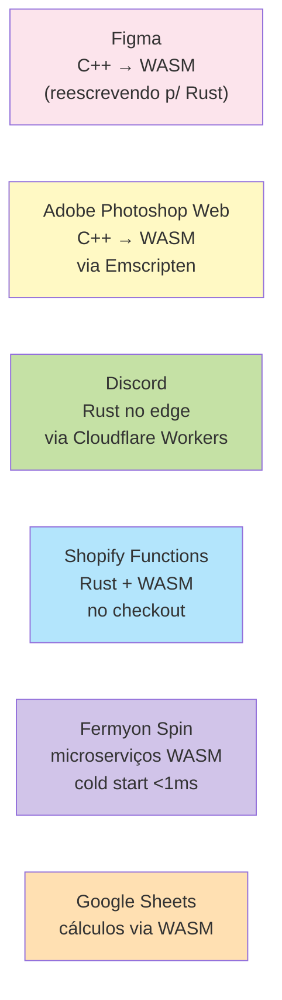

<a id="capitulo-52"></a>
# Capítulo 52: WASM — Rust no Navegador e Edge

> *"WebAssembly is the most important thing happening in the web platform."*
> — Brendan Eich, criador de JavaScript

> *"WASM é a primeira chance honesta de levar código de sistemas para todo lugar — sem reescrever em quatro linguagens."*

## 52.1 O Que É WebAssembly

WebAssembly (WASM) é um formato binário de instruções para uma máquina virtual portátil. Foi desenhado para ser:

- **Rápido**: perto da velocidade nativa.
- **Seguro**: sandboxed por design (sem acesso a memória fora do módulo).
- **Portátil**: roda no navegador (todos modernos), em servidores (Wasmtime, Wasmer), em edge (Cloudflare Workers, Fastly), em embedded.
- **Linguagem-agnóstico**: C, C++, Rust, Go, AssemblyScript, e dezenas de outras compilam para WASM.

Para Rust, WASM é o segundo maior alvo depois de binários nativos — e está crescendo mais rápido que qualquer outro.

## 52.2 Por Que Rust é Especial em WASM

Três razões fazem Rust+WASM uma combinação rara:

1. **Tamanho do binário**: hello world em Rust+WASM ≈ 50 KB. Em Go ≈ 2 MB (runtime + GC). Em C++ via Emscripten ≈ 200 KB-1 MB com JS glue.
2. **Sem garbage collector**: WASM ainda não tem GC nativo estável (proposta WasmGC em rollout). Linguagens com GC precisam embarcar o próprio — explosão de tamanho.
3. **FFI honesto**: a interop entre Rust e JS via `wasm-bindgen` é uma das melhores experiências de FFI de todo o ecossistema.

## 52.3 Setup Mínimo

```bash
rustup target add wasm32-unknown-unknown
cargo install wasm-pack
```

Crie um crate:

```toml
# Cargo.toml
[package]
name = "minha_wasm"
version = "0.1.0"
edition = "2024"

[lib]
crate-type = ["cdylib"]

[dependencies]
wasm-bindgen = "0.2"
```

```rust
// src/lib.rs
use wasm_bindgen::prelude::*;

#[wasm_bindgen]
pub fn saudacao(nome: &str) -> String {
    format!("Olá, {}!", nome)
}

#[wasm_bindgen]
pub fn fibonacci(n: u32) -> u64 {
    if n < 2 { n as u64 } else {
        fibonacci(n - 1) + fibonacci(n - 2)
    }
}
```

Compile:

```bash
wasm-pack build --target web
```

E use no navegador:

```html
<script type="module">
  import init, { saudacao, fibonacci } from './pkg/minha_wasm.js';
  await init();
  console.log(saudacao('Felipe'));
  console.log(fibonacci(40)); // ordens de grandeza mais rápido que JS
</script>
```

## 52.4 Interop Bidirecional

`wasm-bindgen` faz a ponte entre tipos Rust e JS automaticamente:

| Rust | JavaScript |
|---|---|
| `&str`, `String` | `string` |
| `i32`, `u32`, `i64`, `u64`, `f32`, `f64` | `number` (com cuidado em u64) |
| `bool` | `boolean` |
| `Vec<T>` | `Array` |
| `Option<T>` | `T | undefined` |
| `Result<T, E>` | `T` ou `throw` |
| `js_sys::Promise` | `Promise` |
| `web_sys::Element` | `HTMLElement` |

```rust
use wasm_bindgen::prelude::*;
use web_sys::{window, console};

#[wasm_bindgen(start)]
pub fn main() {
    console::log_1(&"Olá do Rust!".into());
    let doc = window().unwrap().document().unwrap();
    let body = doc.body().unwrap();
    body.set_inner_text("Renderizado de Rust");
}
```

`web-sys` expõe toda a API do navegador (DOM, fetch, WebGL, WebAudio) com tipagem.

## 52.5 Frameworks Web em Rust

WASM permite escrever **front-end inteiro em Rust**:

| Framework | Modelo | Comparável a |
|---|---|---|
| **Yew** | VDOM, hooks-style | React |
| **Leptos** | Signals (fine-grained reactivity) | SolidJS |
| **Dioxus** | VDOM, multiplataforma (web/desktop/mobile) | React Native |
| **Sycamore** | Signals | Solid |
| **Perseus** | SSR + client | Next.js |

Exemplo Leptos:

```rust
use leptos::*;

#[component]
fn App() -> impl IntoView {
    let (contador, set_contador) = create_signal(0);
    view! {
        <button on:click=move |_| set_contador.update(|n| *n += 1)>
            "Clicado " {contador} " vezes"
        </button>
    }
}
```

Mesma estrutura mental do React/Solid. Mas com tipagem real, sem `any`, sem runtime errors silenciosos.

## 52.6 Edge Computing com WASM

WASM no servidor é a outra metade da história. Cloudflare Workers e Fastly Compute@Edge rodam WASM com cold-start próximo de zero (ms) — comparado com containers (segundos) ou VMs (minutos).

```rust
// Cloudflare Worker em Rust
use worker::*;

#[event(fetch)]
async fn main(req: Request, env: Env, _ctx: Context) -> Result<Response> {
    let path = req.path();
    Response::ok(format!("Você acessou: {}", path))
}
```

Por que WASM venceu em edge:
- Sandbox forte: provider pode rodar código de mil clientes na mesma máquina.
- Cold start ínfimo: WASM já é pré-compilado (AOT), não há container para subir.
- Baixo consumo: sem JVM, sem Node, sem Python — só o módulo WASM.

## 52.7 WASI: WASM no Servidor Standalone

Wasm originalmente vivia só no navegador. **WASI** (WebAssembly System Interface) é a especificação para WASM acessar arquivos, rede, processo — fora do navegador.

```rust
fn main() {
    let conteudo = std::fs::read_to_string("entrada.txt").unwrap();
    println!("{}", conteudo);
}
```

```bash
cargo build --target wasm32-wasi
wasmtime target/wasm32-wasi/debug/meu_app.wasm
```

WASI está se consolidando como **alternativa portátil a Docker**: um único binário `.wasm` que roda em qualquer plataforma com runtime WASI. Bytecode Alliance (Mozilla, Fastly, Intel) é o consórcio por trás.

## 52.8 Limitações Honestas

WASM ainda tem fronteiras:

- **Threads**: existem (`wasm32-unknown-unknown` com `atomics`) mas exigem cabeçalhos COOP/COEP no servidor para funcionar no navegador.
- **GC integration**: WasmGC está chegando, mas Rust não usa (não tem GC).
- **DOM access**: cada chamada cruza a fronteira WASM↔JS — caro em loop apertado. Manipule grandes blocos em Rust e atualize DOM em batches.
- **Tamanho ainda importa**: 50 KB é ótimo, mas se o bundle JS já tem 2 MB, ganhar peso é irrelevante.
- **Debug**: source maps existem mas estão atrás do que TS/JS oferecem.

## 52.9 Casos Reais



Não é hype: WASM já roda em produção em escala global. Rust é a linguagem que melhor se beneficia desse alvo.

## 52.10 Comparação com Outras Linguagens em WASM

| Linguagem | Tamanho hello world | Notas |
|---|---|---|
| **Rust** | ~50 KB | Sem GC. Melhor interop. |
| **C/C++** | ~200 KB-1 MB | Via Emscripten. JS glue grande. |
| **Go** | ~2 MB | Runtime + GC embarcados. TinyGo reduz para ~50 KB com cuidado. |
| **AssemblyScript** | ~10 KB | Subset de TypeScript. Menor curva. Menor expressividade. |
| **Zig** | ~5-50 KB | Próximo a Rust em tamanho, ainda imaturo. |
| **Python (Pyodide)** | ~10 MB | CPython embarcado. Para uso interativo. |
| **Java** | ~3-5 MB | Via TeaVM ou CheerpJ. |

Rust é o único na faixa de 50 KB com expressividade de linguagem moderna e ecossistema completo.

## 52.11 O Que Esperar Adiante

- **Component Model**: padrão para WASM modular, com tipagem rica entre módulos. Rust implementa via `wit-bindgen`.
- **WasmGC**: GC nativo do runtime, vai facilitar Java/Kotlin/Dart compilarem mais leve. Rust não precisa.
- **Threads estáveis no navegador**: matérias.
- **Direct DOM access**: proposta para evitar a ponte JS.
- **WASI Preview 2/3**: filesystem, sockets, HTTP nativos.

Rust está bem posicionado em todas essas frentes — é a linguagem mais ativa no ecossistema WASM depois do próprio JS.

---

> *"WASM transforma 'a web' em 'qualquer plataforma'. Rust transforma 'qualquer plataforma' em 'sem footguns'. Juntos: portabilidade sem traição."*

[← Capítulo 51 — Axum](ch51-axum.md) | [Próximo: Capítulo 53 — Rust vs TypeScript →](../part-19-comparisons/ch53-rust-vs-typescript.md)
